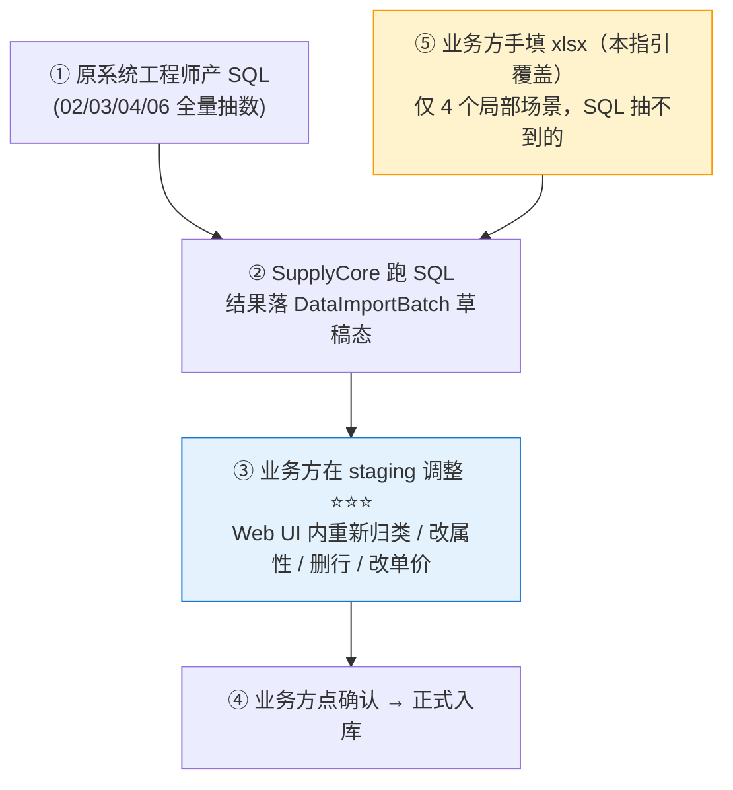

# 业务方填报指引 V0.1

**致**：物资公司 + 各厂矿物资部 / 仓储 / 财务 业务方接口人
**来自**：网信办
**日期**：2026-05-20
**配套**：[`原系统迁移方案-V0.1.md`](./原系统迁移方案-V0.1.md) §八-A、[`分批上线与基础数据采集计划-V0.2.md`](./分批上线与基础数据采集计划-V0.2.md)

---

## 一、上线流程中你在哪一环

请先理解业务方在整个上线流程中的位置 —— **xlsx 手填只占很小一块**，主路径是 SQL 抽数 + staging 调整。

| 你做的事 | 主用工具 | 工作量占比 |
|---|---|---|
| **staging 调整确认**（02/03/04/06 全量数据）| SupplyCore Web UI | **70%**（关键路径 / 数据治理一次性窗口）|
| **xlsx 手填**（4 个局部场景）| 本包 5 份 xlsx | 20% |
| 物理盘点 + 反馈数据问题 | 现场 + 数据问题台账 | 10% |

> **重要原则**：02 物料 / 03 供应商 / 06 期初库存的**主体数据不在 xlsx 里填**，而是工程师 SQL 抽进 staging 后你在 Web UI 调整。本包 xlsx 只覆盖"SQL 抽不到的"4 个手填场景。

---

## 二、4 个 xlsx 手填场景

### 场景 1：01 业务联系人补充（各厂矿物资部 / 1 天）

**xlsx**：`01-组织与人员模板-V0.2.xlsx` → `人员` sheet

**为什么**：组织架构和人员主体由 Nova 平台自动同步（OrgCode + 工号 + 部门），但**业务对接联系人字段** Nova 不维护，需要各厂矿物资部对照单位补。

**填什么**：在 Nova 同步的人员行里，找到本单位的物资业务对接人，**补充以下字段**：

| 字段 | 类型 | 填法 |
|---|---|---|
| `business_contact_phone` | string(20) | 业务对接电话（手机优先）|
| `business_contact_email` | string(64) | 业务对接邮箱 |
| `business_role` | enum | 物资管理员 / 仓库主任 / 供应商对接 / 财务对账 |

**回收**：填完整个 xlsx 邮件回传，技术侧通过 `upload-and-validate` 入 staging，业务方在 Web UI 确认后入库。

**反查 OrgCode**：打开 `07-组织架构参考表-V0.2.xlsx` 的"组织架构表"sheet 找。

---

### 场景 2：04 货位 (Location) 实地补充（各厂矿仓储 / 3-5 天）

**xlsx**：`04-仓储基础数据模板-V0.2.xlsx` → `货位` sheet

**为什么**：仓库（Warehouse）/ 库区（Zone）从原仓储系统 SQL 抽数，但**货位（Location）级**很多老仓没数字化或者数字化粒度不够，需要实地走一遍补全。

**填什么**：

| 字段 | 必填 | 校验 |
|---|---|---|
| `warehouse_code` | ✅ | 在 04/仓库 sheet 中存在（先看仓库 sheet 抽数结果再填）|
| `zone_code` | ✅ | 在 04/库区 sheet 中存在 |
| `location_code` | ✅ | 规则：`L-{zone_code}-{排号}-{列号}-{层号}`，如 `L-Z-A-01-01-01` |
| `location_name` | ⚠️ | 选填，便于人工识别 |
| `location_status` | ✅ | 已加 Excel 下拉：可用 / 锁定 / 待启用 / 报废 |

**回收**：建议先等仓库 + 库区 SQL 抽完进入 staging 后，再开始填货位（你需要知道 warehouse_code/zone_code 才能填）。

**实地盘点要点**：盘点过程发现"仓库类型应该是工地仓不是主仓""库区划分要调整"等，**不要改本 xlsx**，记到《数据问题台账》(`DataIssueLog`) 由系统侧在 staging 阶段统一调整。

---

### 场景 3：05 NC 映射全量人工对照（财务 + 物资公司 + cici / 2 周）

**xlsx**：`05-财务与NC映射模板-V0.2.xlsx` → 4 个 sheet 全部需填

**为什么**：NC 映射是**纯人工对照**（跨系统编码对应关系），SQL 抽不到，也无法在 staging 自动生成。

| Sheet | 内容 | 主责 | 复核 |
|---|---|---|---|
| `部门映射` | SupplyCore 部门 ↔ NC 部门编码 | 财务 | 物资公司 |
| `供应商映射` | SupplyCore 供应商 ↔ NC 供应商编码 | 物资公司供应商管理 | 财务 |
| `科目映射` | InterfaceCode 业务场景 ↔ NC 科目（借贷方）| 财务 | cici |
| `InterfaceCode映射` | 5 业务场景 ↔ NC 凭证 BillCode + Bdef | 财务 + cici | NC 管理方 |

**前置依赖**：
- 部门映射：需要 01 组织 Nova 同步完成
- 供应商映射：需要 03 供应商在 staging 入库完成
- 科目映射 + InterfaceCode：需要 SC 端 5 个业务场景定义稳定

**回收**：分 sheet 分批回传（不要等 4 个都填完才发，每填完一个 sheet 就发），加快 NC 联调节奏。

**注**：xlsx 第 5 个 sheet `SC-NC双号制规则` 是参考用 / **不需要填**。

---

### 场景 4：06 期初库存物理盘点差异（各厂矿仓储 + 物资公司 + 财务 / 3-5 天）

**xlsx**：`06-期初库存模板-V0.2.xlsx` → `期初库存` sheet

**为什么**：期初库存主体由原系统 SQL 抽（万行级，人工填不现实），但**物理盘点后会发现差异**（账实不符 / 缺漏 / 报废 / 单价缺失），需要补/调差异行。

**两类差异处理**：

| 差异类型 | 处理方式 |
|---|---|
| **小量调整**（少数行单价 / 数量微调）| ⭐ 推荐：直接在 staging Web UI 调，**不用 xlsx** |
| **大量补录**（原系统漏抽 / 新发现物料 / 报废批量标记）| 用本 xlsx 补一批 → upload-and-validate 追加进同一 batch |

**填的核心字段**（已加 Excel 下拉/校验）：

| 字段 | 校验 |
|---|---|
| `material_code` | 必填 / 02 物料 staging 入库后才知道 |
| `warehouse_code` + `location_code` | 必填 / 04 仓储 staging 入库后才知道 |
| `quantity` | 已加 `>0` 校验 |
| `unit_price` | 单价缺失就空着，由财务后置补 |
| `inbound_date` | 已加 `≤TODAY` 校验 |
| `stock_status` | 已加下拉：正常 / 待检 / 隔离 / 报废 |
| `report_date` | 已加 `TODAY±7` 校验 |
| `source` | 已加下拉：线下台账 / 上一系统迁移 / **物理盘点** |

**回收**：盘点完成后批量回传。如果原系统抽的库存有明显错误（如某仓全空），请同时记《数据问题台账》触发系统侧 staging 回滚 + 重抽。

---

## 三、staging 调整窗口（02/03/04/06 主体数据 / Web UI）

这块**不用 xlsx**，但是你的主战场，先要了解。

### 调整能干什么

按 `原系统迁移方案 §八-A.1` 列的典型场景：

| 数据 | 借机做的事 |
|---|---|
| **02 物料** | 物料分类重新归类 / 高敏感属性核对 / 删除明显废弃物料 / 是否可采购 / 安全库存补全 |
| **03 供应商** | 准入状态调整（黑名单 / 暂停 / 待审核）/ 合并重复 / 资质过期清理 / NC 编码补 |
| **04 仓储** | 仓库类型规划（主仓 / 临时仓 / 工地仓 / 报废仓）/ 启用批次/序列号/效期开关 / 库区重新划分 |
| **06 期初库存** | 盘点状态确认 / 单价补全 / 物理盘点差异 |

### 调整节奏

- 工程师 SQL 抽数 1-3 天 → 落 DataImportBatch 草稿态
- 业务方在 staging 调整 **3-5 天**（关键路径，不能跳过）
- 业务方点"确认应用"→ 进正式库

### 调整 UI（待 Sprint 20n/20o 上线）

当前 staging 数据浏览 + 单条调整可用；**批量调整 UI**（按筛选条件批量改）+ **调整留痕 UI** 正在开发，预计 Sprint 20n。

> 在批量 UI 上线前，大量重复调整可以反馈给项目组用 SQL 批量改 staging，不用一行一行点。

---

## 四、xlsx 操作通用约定

### 4.1 reference 字典（07）

`07-组织架构参考表-V0.2.xlsx` 是**只读字典**，不需要填报：
- 填 01/04/05/06 的 `org_code` 时，先打开 07 反查 5 位 OrgCode（如 `001.007.002` = 阜新矿业恒大煤矿）
- 不要用前端 dashboard 的矿名（艾友/东梁/五龙/新邱）— 那是 mock 数据，OrgCode 不一致

### 4.2 已加的 Excel 易用性增强

| 增强 | 在哪里 |
|---|---|
| **下拉数据验证** | 02 计量单位/分类编码（跨 sheet）/ 04 仓库/库区/货位枚举 / 06 期初库存 4 处枚举 |
| **R1 表头悬停批注** | 02/04/06 共 25 处必填字段（鼠标悬停看：字段英文名 / 类型 / 校验 / 示例 / 常见错误）|
| **Sheet ↔ 数据表对照附录** | 每份 xlsx 首页"说明" sheet 末尾，反查目标表名 |
| **02 物料分类基线** | 已预填 V1.8 110 行（不用查规范，直接用下拉选）|
| **02 标准计量单位** | 已预填 25 个（M/MM/KG/T/L/件/个/套/台 等）|

### 4.3 环境要求

推荐 Microsoft Excel 2016+ 或 WPS Office 2021+，跨 sheet 下拉 / 单元格批注 / 同 sheet 校验三类功能在 Office 2010 以下版本可能显示异常。

### 4.4 多人协作

- 同一 sheet 不要多人同时改（Excel 不支持，会冲突）
- 大表（如 05 NC 映射）按 sheet 拆给不同人 → 最后由对接人合并

---

## 五、反馈渠道

| 场景 | 渠道 |
|---|---|
| xlsx 字段不清楚 / 校验过严 / 示例不够 | 直接回邮件，技术侧 1 个工作日内回 |
| 原系统抽的数据明显错（漏抽 / 错抽 / 类型乱）| 记《数据问题台账》→ 触发 staging 回滚 + 重抽 |
| staging Web UI 操作问题 / 批量功能需求 | 反馈到 cici，进 Sprint 20n/20o 评估 |
| 物理盘点物料新发现（原系统没有）| 06 期初库存补行 + 02 物料发新增请求给原系统工程师 |

---

## 六、版本沿革

| 版本 | 日期 | 变更 |
|---|---|---|
| V0.1 | 2026-05-20 | main a 起草 / 4 手填场景 + staging 调整边界 + 业务方在上线流程中的定位 |

---

**Maintained**: main 主代理 a + cici 协调
**Owner**: 物资公司 + 网信办
