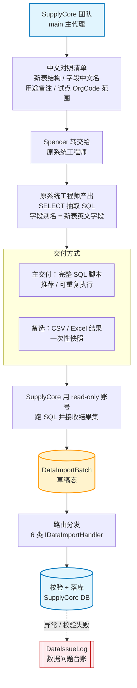
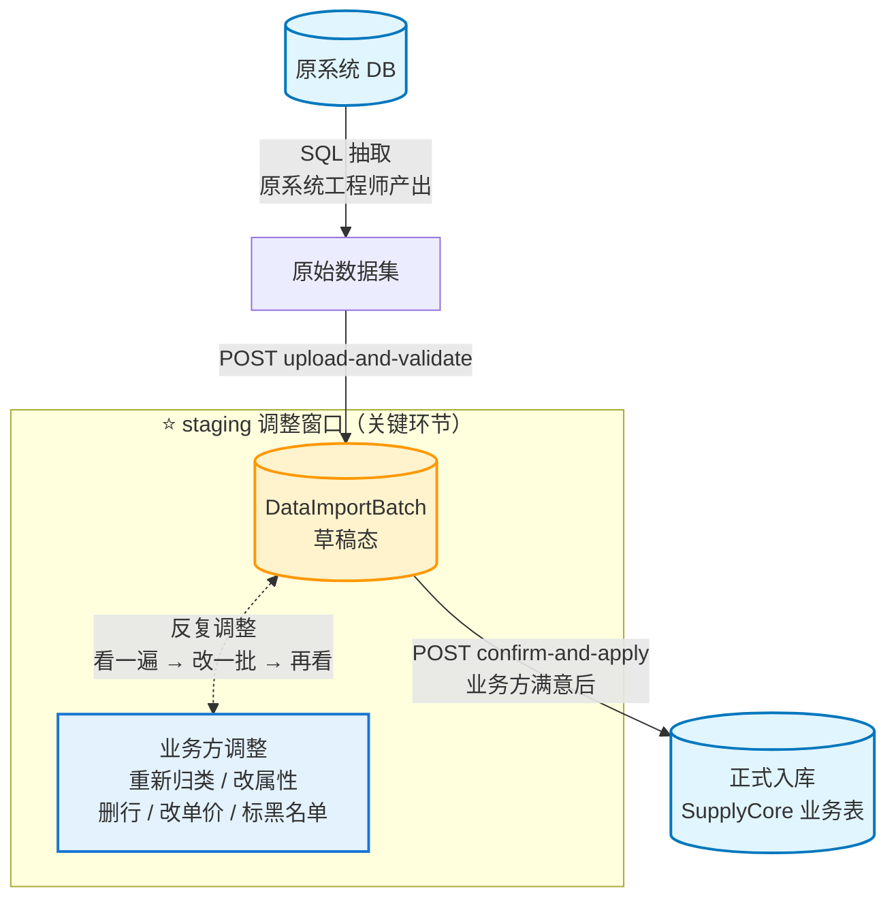
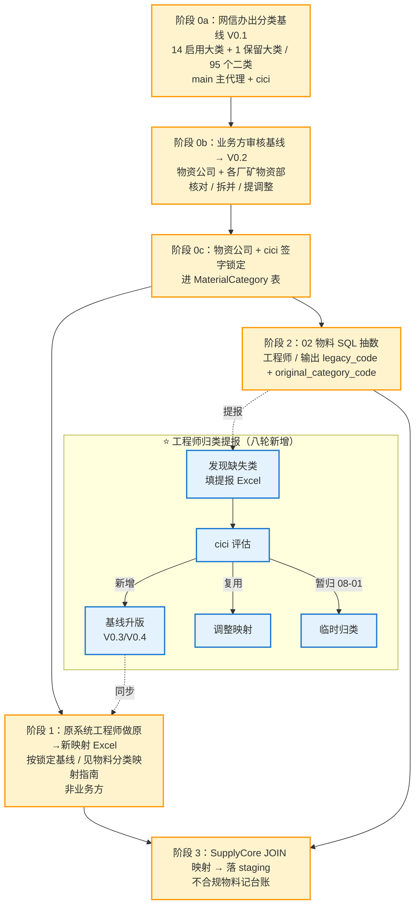

# 原系统迁移方案 V0.1

**项目**：阜矿物资供应协同管理平台 / SupplyCore（系统更名见 [`系统命名与定位说明-V0.1.md`](../系统命名与定位说明-V0.1.md)）
**日期**：2026-05-17（Spencer 3 项决策拍板后起草 / 当日 Spencer 二轮反馈再修订）
**定位**：从阜矿现有物资系统抽取基础数据进入新系统的执行方案
**配套**：[`分批上线与基础数据采集计划-V0.2.md`](./分批上线与基础数据采集计划-V0.2.md) §二 第 1 批（替代纯人工填报路径）

**V0.1 内修订记录**（2026-05-17 当日 Spencer 二~九轮反馈 / 2026-05-19 网信办十轮拍板）：
- 二轮反馈 → 协作模式从"我们直连 + 反向映射" **调整为** "我们给中文对照清单 + 原系统工程师对照新表输出"
- 三轮反馈 → 交付方式 **锁定 SQL 脚本为主**（可重复执行 / 利于并行新旧系统 / 增量同步基础 / 审计留痕），Excel 仅作工程师不熟 SQL 时的备选
- 四轮反馈 → 03 / 04 / 06 同款中文清单 **同步起草**（不等 02 验证完）/ 工程师可 4 份并行交付
- **五轮反馈 → 增加"业务方数据调整确认环节"**（§八-A 新增）：迁移不是"原样搬过来"，业务部门借迁移做数据治理。staging 调整时机 + 责任分工 + 利用现有 DataImportBatch 草稿态机制
- **六轮反馈 → 物料分类编码前置确认**（§八-A.8 新增 / 关键工作流调整）：物料分类是 PK 级引用，先 staging 调整再绑物料会出错。改为业务方**先确认分类树**（Excel 编辑 + 锁定）→ 再迁物料数据。分类前置 / 物料后置
- **七轮反馈 → material_code 第 1 阶段不再 = legacy_code**（§六.3 修订 / §八-A.8.3 简化）：业务方既然预先重新编码大类-小类，原 `legacy_code` 的分类前缀就与新分类对不上 → 第 1 阶段就应该按新规则生成新 `material_code`（当时草案曾写 `M-XX-XX-NNNN`，后续九轮已被 V1.8 的 `XX-XX-XXXXXX` 取代，不能再"业务方零适应"）。SupplyCore 按业务方映射表自动生成 material_code / 工程师 SQL 只出 legacy_code（更省事）
- **八轮反馈 → 项目组先出"分类基线"+ 工程师提报增补机制**（§八-A.8 重排 / 新增 §8-A.8.6 / 新建 [`物料分类基线-V0.1.md`](./物料分类基线-V0.1.md)）：项目组**先规划**一类、二类编码（专业基线 / 不让业务方空白起）→ 业务方在基线上核对 / 调整 → 工程师归类时遇缺失可**提报增补**（不阻塞 / SLA 分级）
- **九轮反馈 → 分类基线指向权威规范 V1.8（不是项目组重新规划）**（[`物料分类基线-V0.1.md`](./物料分类基线-V0.1.md) V0.1 b 版修正 / 本方案 §六.3 + §八-A.8 同步）：Spencer 指出"一类编码是 14 大类"，找到权威源 [`物资编码规范-V1.8`](../详细规则/物资编码规范文档.md)（2026-05-04 已定稿）。修正：① 大类数 8→**14 + 1 保留（PS）** ② 编码格式 `M-XX-XX-NNNN`→**`XX-XX-XXXXXX`**（拼音字母 + 2 位数字 + 6 位流水）③ 项目组不重新规划 / 直接引用 V1.8 / 业务方核对覆盖度即可
- **十轮拍板 → 分类映射职责厘清 + 02 清单首发口径**（网信办 2026-05-19 / 修订 §8-A.8.2 S1 + §8-A.8.3 + §8-A.8.4 行 1）：消除原 §8-A.8.2/8.3 与 [`物料分类映射指南-V0.1.md`](./物料分类映射指南-V0.1.md)（抬头"致原系统工程师"）的口径冲突。定版职责链：**① 分类基线由网信办（项目组 / main + cici）生成 → ② 业务方（物资公司 + 各厂矿物资部）审核 → ③ 物资公司 + cici 锁定 → ④ 连同《物料分类映射指南》提交原系统工程师，由工程师按锁定基线做原→新映射回填**（原"业务方维护原→新映射 Excel"作废）。**发包时序**：02 物资主数据对照清单可与 03/04/06 一起**首发**工程师（清单本身不受分类阻塞）；业务方审完、基线锁定后再把"锁定版基线 + 映射指南"**补发更新**给工程师做映射
- **十一轮拍板 → 迁移范围扩为全集团 + 迁移/上线解耦**（网信办 2026-05-19 / 覆盖 Spencer 原决策 3 / 修订 §一.2 + §三 + §四 + §七 + §九 + §十 + §十一 + §十二 + 4 份对照清单）：程序化 SQL 抽取对全集团 vs 3 单位边际成本几乎为零，**数据迁移范围由"试点 3 单位"扩为"阜新矿业集团全部单位"（OrgCode 前缀 `001.007.*`，SQL 由 `IN (...)` 改 `LIKE '001.007.%'`）**。同时**解耦两个概念**：① 数据迁移 = 全集团一次抽全入 staging；② 上线运行 + 业务方治理确认 = 仍按单位/批次分批（DataImportBatch 原生支持分批 confirm-and-apply）。效率红利拿满，上线风险与业务方一次性工作量不引爆
- 增加 4 份独立文件（全中文 / 直接发送给原系统工程师 / 主交付 = SQL）：
  - [`02 物资主数据`](./原系统迁移-对照清单-02物资主数据-V0.1.md)
  - [`03 供应商档案`](./原系统迁移-对照清单-03供应商档案-V0.1.md)
  - [`04 仓储基础`](./原系统迁移-对照清单-04仓储基础-V0.1.md)
  - [`06 期初库存`](./原系统迁移-对照清单-06期初库存-V0.1.md)
- §二 / §三 / §五 / §七 / §八-A / **§八-A.8 新增** / §十 / §十一 / §十二 同步调整

---

## 一、背景与决策

### 1.1 为什么要从原系统迁移

V0.2 原文档 §二 第 1 批规划：6 类基础数据靠业务方填 Excel 模板 → 三个不可控风险：

- 集团 5000-10000 物料编码 × 各厂矿物资部填报 → 速度慢 + 易错 + 重复劳动
- `nc_material_code` 必须跨系统对照，纯人工填报无可靠对照源
- 期初库存（万行级别）人工填几乎不现实

**结论**：能从原系统抽的，优先抽；抽不到的再人工补。

### 1.2 Spencer 2026-05-17 拍板（3 项决策）

| # | 决策点 | 选定方案 |
|---|---|---|
| 1 | 原系统形态 | **阜矿现有物资系统 / 数据库可直连** |
| 2 | 编码改造 | **双轨过渡（new_code + legacy_code）** |
| 3 | 迁移范围 | ~~试点 3 单位先抽~~ → **V0.1 十一轮：全集团全部单位**（OrgCode 前缀 `001.007.*` / 程序化抽取边际成本≈0）；**上线运行 + 业务方确认仍分批**（迁移/上线解耦）|

---

## 二、6 类模板迁移覆盖判断

| # | 模板 | 是否可直连 | 中文清单状态 | 抽取来源 | 配套人工补充 |
|---|---|---|---|---|---|
| 01 组织人员 | ❌ Nova 同步主导 | 不适用 | Nova 平台 | 业务联系人补 |
| **02 物资主数据** | ✅ 本方案核心 | ✅ [V0.1 已起草](./原系统迁移-对照清单-02物资主数据-V0.1.md) | 原物资系统物料表 | NC 物料编码对照 |
| **03 供应商档案** | ✅ 同套方案 | ✅ [V0.1 已起草](./原系统迁移-对照清单-03供应商档案-V0.1.md) | 原物资系统供应商表 | NC 供应商对照 |
| **04 仓储基础** | ✅ 仓库 / 库区 SQL 抽 | ✅ [V0.1 已起草](./原系统迁移-对照清单-04仓储基础-V0.1.md) | 原物资系统仓储表 | 货位部分实地补（清单已说明）|
| 05 NC 映射 | ❌ 跨系统对照 | 不适用 | - | 人工对照（不改变）|
| **06 期初库存** | ✅ **必须 SQL**（人工填不现实）| ✅ [V0.1 已起草](./原系统迁移-对照清单-06期初库存-V0.1.md) | 原物资系统库存表 | 物理盘点差异补 |

**4 份清单可并行交付给原系统工程师**（02 / 03 / 04 / 06）— 工程师按表难易选先后顺序，**SupplyCore 这边不强制顺序**。落库顺序由 IDataImportHandler 处理（02/03/04 → 06）。

---

## 三、技术架构与协作模式

### 3.1 协作模式（核心）

**主路径：原系统工程师产出 SQL → 我们跑 SQL 抽数 → 落库**



**为什么这套协作模式更好**：
- 原系统工程师最熟自己的表结构，让他做"原 → 新"映射成本最低
- 我们不需要拿到完整 schema 文档 / 减少 IT 协调摩擦
- 工程师用中文清单对照英文新表 → 中文备注消除语言摩擦
- SQL 别名 = 新表英文字段 → 我们接收后零再加工

### 3.2 为什么 SQL 脚本优于 Excel（Spencer 三轮反馈拍板）

| 维度 | Excel 一次性 | **SQL 脚本（推荐）** |
|---|---|---|
| 可重复执行 | ❌ 每次都要工程师重新导 | ✅ 我们随时 re-run / 拿最新数据 |
| 并行新旧系统 | ❌ 快照 t0 / 之后 drift | ✅ 周期性 re-run / 持续同步 |
| 增量同步基础 | ❌ 没法做 | ✅ 加 `WHERE update_time > last_sync` 即可 |
| 对账机制 | ❌ 难比对 | ✅ 同 SQL 跑 2 次 → 自动 diff |
| 审计留痕 | ⚠️ 仅文件 | ✅ SQL 文本 + 跑时 batch_id + 结果集全留痕 |
| 工程师能力门槛 | 低（导出即可）| 中（要写 SQL，但工程师本就熟）|

**Excel 保留为备选场景**：工程师 SQL 写不出来的子表 / 一次性补数 / 局部字段。

### 3.3 抽取触发方式

- **试点第 1 轮**：拿到工程师 SQL 后，我们手工跑（DBeaver / psql / sqlplus 取决于原系统类型）
- **试点稳定后**：封装 endpoint `POST /api/supply-cores/data-migration/run-sql-batch`（待新增），传入 SQL + 目标 templateType
- **正式期**：评估增量同步 / 定时 job（待详设）

### 3.4 待补充信息（简化版 — 不强求 schema）

| # | 项 | 状态 |
|---|---|---|
| 1 | 原系统数据库类型（决定 SQL 方言：Oracle / SQL Server / MySQL / PG）| ⏳ |
| 2 | read-only 账号 + 连接方式（VPN / 跳板机）| ⏳ |
| 3 | 工程师对照《中文清单》产出的 SELECT SQL（02 物资主数据 3 张表）| ⏳ **核心交付物** |
| 4 | 工程师对每个字段映射的"原系统字段简述"（用于 review 准确性）| ⏳ |
| 5 | 全集团（`001.007.*`）在原系统的真实数据量（评估抽取性能 / 是否需分页分批）| 可工程师在 SQL 内 COUNT |

> ✅ V0.1 早版"原系统完整 schema 文档"已经**不再是阻塞项** — 让工程师按中文清单出 SQL 即可，schema 仅在 review 阶段抽样验证。

---

## 四、范围过滤（V0.1 十一轮：全集团 / 数据迁移与上线解耦）

> **V0.1 十一轮（网信办 2026-05-19）**：迁移范围由试点 3 单位扩为**阜新矿业集团全部单位**。程序化 SQL 抽取对全集团边际成本≈0，故**数据迁移一次抽全集团**；**上线运行 + 业务方治理确认仍按单位/批次分批**（见 §八-A / §十）。原试点 3 单位（`001.007.001` 本部 / `001.007.002` 恒大煤矿 / `001.007.018` 物资公司）降级为"业务方确认/上线运行的首批"，不再是数据抽取边界。

### 4.1 OrgCode 范围（全集团）

| 维度 | 口径 |
|---|---|
| 数据抽取范围 | 阜新矿业集团全部单位，OrgCode 前缀 `001.007.*` |
| 上线运行/业务方确认首批 | `001.007.001` 本部 + `001.007.002` 恒大煤矿 + `001.007.018` 物资公司（DataImportBatch 分批 confirm-and-apply）|

通用 SQL 过滤（全集团）：

```sql
WHERE org_code LIKE '001.007.%'
```

> 若原物资系统本身只服务阜矿集团（无集团外数据），可进一步去掉过滤抽全表 — 由工程师在 SQL 内确认 org_code 取值分布。

### 4.2 全集团数据量预估（替换原试点预估）

| 类型 | 全集团预估量级 | 备注 |
|---|---|---|
| 02 物料编码 | 5000-10000 | 集团全量（原试点 1500-3000 仅为子集）|
| 03 供应商 | 1000-2000 | 集团全量供应商 |
| 04 仓库 / 库区 / 货位 | 100-200 / 800-1500 / 数万 | 货位部分需现场盘点（量随单位数放大）|
| 06 期初库存 | 十万行级 | 必须 SQL；落 staging 后**分批 confirm-and-apply** 控回退爆炸半径 |

---

## 五、字段映射表（02 物资主数据 — 内部参考版）

> 🔁 **本节是内部参考用**。给原系统工程师的"对外清单"（全中文 / 字段用途）见独立附件
> [`原系统迁移-对照清单-02物资主数据-V0.1.md`](./原系统迁移-对照清单-02物资主数据-V0.1.md)。
> 工程师按附件中文清单产出 SQL 后，我们用本节英文映射做最终 review。
>
> ⚠️ 下表中原系统字段名是**占位示例**（工程师写 SQL 时按自己 schema 真实字段命名 + 起新表英文字段为别名）。

### 5.1 物料分类（MaterialCategory）

| 目标字段（SupplyCore）| 类型 | 原系统字段（占位）|
|---|---|---|
| category_code | string(16) | `M_CATEGORY.CATE_CODE` |
| category_name | string(64) | `M_CATEGORY.CATE_NAME` |
| parent_category_code | string(16) | `M_CATEGORY.PARENT_CODE` |
| level | int | `M_CATEGORY.LEVEL` |
| is_high_sensitive | bool | `M_CATEGORY.IS_DANGEROUS` |
| is_active | bool | `M_CATEGORY.STATUS = 'A'` |

### 5.2 物料主数据（Material — **加 legacy_code 双轨字段**）

| 目标字段 | 类型 | 原系统字段（占位）| 备注 |
|---|---|---|---|
| material_code | string(16) | SupplyCore 自动生成 | 新系统物料编码；数据库/API 存 `ZH01000001`，页面可展示 `ZH-01-000001` |
| **legacy_code** | string(64) | `MATERIAL.MAT_CODE` | **原系统物料编码 / 双轨追溯 / 唯一索引（可空）** |
| material_name | string(128) | `MATERIAL.MAT_NAME` |  |
| specification | string(256) | `MATERIAL.SPEC` |  |
| unit | string(16) | `MATERIAL.UNIT_CODE` | 需 Unit 字典对照 |
| original_category_code | string(64) | `MATERIAL.CATE_CODE` | 原系统分类编码；由 M-18 映射到 V1.8 二级分类 |
| nc_material_code | string(32) | `MATERIAL.NC_CODE`（**待 Spencer 确认原系统是否已存**）| 缺失 → 记 NC 映射台账 |
| is_high_sensitive | bool | `MATERIAL.IS_DANGEROUS` |  |
| is_equipment_spare | bool | `MATERIAL.IS_SPARE` |  |
| is_purchasable | bool | `MATERIAL.IS_PURCHASE` |  |
| is_active | bool | `MATERIAL.STATUS = 'A'` |  |
| safety_stock | decimal | `MATERIAL.SAFETY_STOCK` |  |
| remark | string(256) | `MATERIAL.REMARK` |  |

### 5.3 计量单位（Unit）

原系统计量单位字典 → SupplyCore Unit 字典，需做一次性对照（估计 ~30-50 条）。

---

## 六、双轨编码方案

### 6.1 Domain 实体改造

Material 实体增加 `LegacyCode` 字段：

```csharp
public class Material : AuditedEntity<Guid>
{
    public string MaterialCode { get; set; }     // 新主键 / 业务唯一
    public string? LegacyCode { get; set; }      // 原系统编码 / 唯一索引（可空 — 新建物料无值）
    // ... 其他字段
}
```

### 6.2 EF Configuration

```csharp
b.Property(x => x.LegacyCode).HasMaxLength(64);
b.HasIndex(x => x.LegacyCode).IsUnique();
```

### 6.3 过渡期策略（V0.1 九轮反馈修订 / 4 阶段 / 引用规范 V1.8 编码格式）

| 阶段 | 策略 | 业务方感知 |
|---|---|---|
| **阶段 0（分类前置）** | 业务方核对 [`物资编码规范 V1.8`](../详细规则/物资编码规范文档.md) 的 14 大类 + 95 二类覆盖度 + 锁定 | 业务方核对 / 不重新设计 |
| **第 1 阶段（试点 1-2 周）** | `material_code` 由 SupplyCore 按 V1.8 自动生成；数据库/API 存 `ZH01000001`，页面展示 `ZH-01-000001`；`legacy_code` 保留原系统编码 | 业务方适应新编码 / 但**老查询通过 legacy_code 100% 兼容** |
| 第 2 阶段（试点扩大后）| 试点反馈 → 提报新增二类（规范升版 V1.9）| 业务方可提调整建议 |
| 第 3 阶段（NC 真接通后）| 定型 / `legacy_code` 永久保留做追溯 | 稳定运行 |

**为什么修订**（七轮 + 九轮）：
- 七轮：业务方既然在阶段 0 预先规划新分类编码，原 `legacy_code` 的分类前缀就与新分类对不上 → 第 1 阶段就用新规则
- 九轮：编码规则不是项目组现编，**规范 V1.8 已定稿**（拼音字母 + 数字 / 全集团一物一码）/ 项目组 + 业务方直接采用

### 6.4 查询兼容（V0.1 七轮配套调整）

- 物料查询 API 同时支持 `material_code` / `legacy_code` 入参（OR 查询）
- **业务方/前端默认显示 `material_code`**（新规则 / 已对齐新分类）
- **老台账 / 老报表 / 老查询**：录入历史编码（即 legacy_code）也能查出 → 通过 `legacy_code` 字段 OR 查询
- 大屏 / 报表层做兼容：物料展示同时展示 `material_code` 和 `(legacy_code: XXX)` 副标

---

## 七、SQL 抽取模板（参考样例 / 由原系统工程师按真实 schema 改写）

> 🔁 本节 SQL 是**参考样例** — 真实字段名以原系统为准。我们的核心约定是：
> **每个 SELECT 字段都用 `AS` 起新表英文字段为别名**（如 `m.原系统编码字段 AS legacy_code`），
> 这样我们接收结果集后零再加工，直接进 IDataImportHandler。
>
> 给原系统工程师的中文版样例 + 字段对照表见独立附件
> [`原系统迁移-对照清单-02物资主数据-V0.1.md`](./原系统迁移-对照清单-02物资主数据-V0.1.md) §五。

### 7.1 物料分类

```sql
SELECT
  CATE_CODE                                  AS category_code,
  CATE_NAME                                  AS category_name,
  PARENT_CODE                                AS parent_category_code,
  LEVEL                                      AS level,
  IS_DANGEROUS                               AS is_high_sensitive,
  CASE WHEN STATUS = 'A' THEN 1 ELSE 0 END   AS is_active
FROM M_CATEGORY
WHERE STATUS IN ('A', 'I');
```

### 7.2 物料主数据（V0.1 十一轮：全集团过滤）

```sql
SELECT DISTINCT
  m.MAT_CODE          AS legacy_code,
  m.MAT_NAME          AS material_name,
  m.SPEC              AS specification,
  m.UNIT_CODE         AS unit,
  m.CATE_CODE         AS original_category_code,  -- 原系统分类编码 / SupplyCore 通过 M-18 映射到 V1.8 二级分类
  m.NC_CODE           AS nc_material_code,
  m.IS_DANGEROUS      AS is_high_sensitive,
  m.IS_SPARE          AS is_equipment_spare,
  m.IS_PURCHASE       AS is_purchasable,
  CASE WHEN m.STATUS = 'A' THEN 1 ELSE 0 END AS is_active,
  m.SAFETY_STOCK      AS safety_stock,
  m.REMARK            AS remark
FROM MATERIAL m
JOIN INVENTORY i ON i.MAT_CODE = m.MAT_CODE
WHERE i.ORG_CODE LIKE '001.007.%';   -- V0.1 十一轮：全集团（原试点 3 单位 IN 列表已废）
```

> JOIN INVENTORY 是为了过滤"全集团实际有库存或用过的物料"，避免抽出大量历史无用物料 — 也可改用 `WHERE EXISTS` 写法，按 schema 性能挑。全集团量级较大，工程师可在 SQL 内 `COUNT` 先评估再批量抽。

### 7.3 03 / 04 / 06 SQL 抽取模板 → V0.2 起草

待 Spencer 拍板 03/04/06 是否同套方案，再追加 SQL 模板。

---

## 八、验证机制

### 8.1 抽取后自动校验（DataIssueLog）

| 校验项 | 检查口径 | 严重度 |
|---|---|---|
| 必填字段完整率 | legacy_code / name / unit / original_category_code | 高 |
| 编码唯一性 | legacy_code 唯一；material_code 由系统生成后唯一 | 高 |
| M-18 映射命中率 | original_category_code 必须能映射到 V1.8 二级分类 | 高 |
| NC 物料编码缺失 | nc_material_code IS NULL | 中 |
| 计量单位有效性 | unit 必须在 Unit 字典 | 高 |
| 高敏感属性一致性 | is_high_sensitive 与分类继承一致 | 中 |

### 8.2 抽样核查（业务方）

| 抽样对象 | 抽样量 | 准确率门槛 |
|---|---|---|
| 物资公司随机抽 | 50 条 | 100% |
| 各厂矿物资部随机抽 | 20 条 / 单位 | ≥ 95% |

### 8.3 双向核对

- SupplyCore 抽出量 vs 原系统总量（按 `org_code` 维度）
- 偏差 > 1% 必须解释或记台账

---

## 八-A、业务方数据调整确认环节（Spencer 五轮反馈 / 关键）

### 8-A.1 为什么要这一环节

**迁移不是"原样搬过来"** — 业务部门要借这次迁移**做一次数据治理**。这是上线一次性、不可错过的窗口。

典型场景：

| 数据类 | 业务方借机做的事 |
|---|---|
| 02 物料 | **物料分类重新归类**（旧系统分类常常乱 / 太粗 / 太细 / 不一致）/ 高敏感属性核对 / 删除明显废弃的物料 / 是否可采购 / 安全库存补全 |
| 03 供应商 | **准入状态调整**（重新审视黑名单 / 暂停 / 待审核）/ 合并重复供应商 / 资质过期清理 / NC 编码补 |
| 04 仓储 | **仓库类型规划**（哪些是主仓 / 哪些是临时仓 / 工地仓 / 报废仓）/ enable_batch/serial/expiry 开关按业务规范打开 / 库区重新划分 |
| 06 期初库存 | **盘点状态确认**（哪些是正常 / 待检 / 隔离 / 报废）/ 单价补全 / 物理盘点差异处理 |

不做这一环节的后果：旧系统的乱账原样进新系统 → 新系统第一天就有历史包袱 → 第 2 批库存试点、第 3 批采购、第 4 批 NC 联调全部受拖累。

### 8-A.2 调整时机：转换后 staging 调整为主

理论上业务方调整有两个时机：

| 时机 | 优点 | 缺点 | 建议 |
|---|---|---|---|
| 转换前（在原系统调整）| 原系统数据干净 / 迁移直接到位 | 业务方对原系统不熟 / 调整动力低 / 新规则未定 | 仅做明显错的（黑名单 / 停用 / 明显错分类）|
| **转换后（SupplyCore staging 区）** | 新系统是业务方的目标系统 / 调整动力强 / 可用新系统工具辅助 | 多一道流程 | ⭐ **本方案主路径** |

### 8-A.3 数据流（利用现有 DataImportBatch 草稿态机制）

✅ 好消息：DataImportBatch 架构在 Sprint 20k T-A2（commit `c5893fe`）**已经为这个需求做了准备**：



调整中可以反复来回 — 业务方先看一遍 → 改一批 → 再校验 → 再调 → 满意后才点 "确认应用"。

### 8-A.4 责任分工

| 数据类 | 调整主责 | 复核 | 工具 |
|---|---|---|---|
| 02 物料 | 物资公司物资管理（牵头）| 各厂矿物资部 | SupplyCore Web UI（**待开发**）|
| 03 供应商 | 物资公司供应商管理 | 财务（NC 对照）| SupplyCore Web UI |
| 04 仓储 | 物资公司仓储管理 | 各厂矿仓储 | SupplyCore Web UI |
| 06 期初库存 | 各厂矿仓储（盘点）| 财务（金额）| SupplyCore Web UI |

### 8-A.5 业务方调整 UI（需新增 Sprint task）

当前架构：✅ DataImportBatch staging + IDataImportHandler 框架已具备
缺口：❌ 业务方使用的"staging 数据调整 UI"还需要起 Sprint task

UI 功能清单：
- staging 数据浏览 + 筛选 + 排序
- 单条调整（修改字段 / 删除行 / 标记备注）
- 批量调整（按筛选条件批量改 — 如"把所有 cat='电缆' 重新归到 01-01"）
- 调整留痕（哪个用户 / 什么时间 / 调整前后值）
- 数据问题台账联动（DataIssueLog 关联调整记录）
- 确认按钮 → 触发 `confirm-and-apply`

**建议拆为新 Sprint task** — 列入 20n 或 20o，与 SQL 抽数 + 落库 staging 并行推进。

### 8-A.6 工作量与时序调整

加入业务方调整后，工作量重估：

| 阶段 | 工作量 | 责任 | 备注 |
|---|---|---|---|
| 工程师产出 SQL + 抽数到 staging | 1-3 天 | 原系统工程师 + main | 同前 |
| **业务方 staging 调整确认** ⭐ | **3-5 天**（新增 / 关键路径 / 不能跳过）| 物资公司 + 各厂矿 + 财务 | 4 类数据并行调整 |
| 业务方确认 → 入正式库 | 0.5 天 | main 主代理 | 同前 |
| **合计**（含业务方调整）| **~2.5-3 周** | | 比未含调整版本多 3-5 天 |

### 8-A.7 边界 — 工程师不需要承担的事

🟢 **原系统工程师不需要为业务方调整操心**：
- 不需要在 SQL 里做数据清洗（只抽现状）
- 不需要预判业务方会怎么调（业务方自己想）
- 不需要重复出 SQL（业务方调整在 staging 做，不退回原系统）

🟢 **新系统会保留双轨追溯**：
- `legacy_code` 永久保留原系统编码
- 业务方调整后哪怕 `material_code` 变了，老台账 / 老查询都能通过 `legacy_code` 找回原始数据

### 8-A.8 物料分类编码前置确认（Spencer 六轮反馈 / 关键工作流调整）

#### 8-A.8.1 为什么分类要前置确认（不能后置 staging 调整）

物料分类（MaterialCategory）是物料主数据的**主键级引用字段**（material.category_code → MaterialCategory.category_code）：

- 物料一行带一个 `category_code`，必须在分类表里存在
- 如果先迁物料、后调分类，物料的 `category_code` 可能成为无效引用 → 大量回写
- 而且物料分类是数据治理的"骨架" — 先把骨架立起来，肉才能稳定填上

**业务规则**：分类编码必须**先锁定，再迁物料**。这一点跟其他字段（属性 / 状态 / 单价等）不同 — 那些可以 staging 后调，分类不行。

#### 8-A.8.2 分类前置确认工作流（V0.1 八轮重排 / 项目组先出基线）



> **详细规划见独立文档** [`物料分类基线-V0.1.md`](./物料分类基线-V0.1.md)（含 14 启用大类 + 1 保留大类 / 95 个二类完整清单 + 业务方核对路径 + 工程师提报机制）

> 🔔 **V0.1 十轮拍板（网信办 2026-05-19）**：分类映射职责链为 **网信办生成基线（S0a）→ 业务方审核（S0b）→ 锁定（S0c）→ 原系统工程师按锁定基线做原→新映射（S1）**，与 [`物料分类映射指南-V0.1.md`](./物料分类映射指南-V0.1.md)（致工程师）一致；原"业务方维护映射 Excel"作废。**发包时序**：02 对照清单与 03/04/06 一起首发工程师（S2 清单不受分类阻塞，可先看先备 SQL），业务方审完、基线锁定后再补发"锁定版基线 + 映射指南"触发 S1。

#### 8-A.8.3 分类基线职责分工 + 物料 material_code / category_code 映射（V0.1 七轮锁定 / 十轮厘清）

**阶段 0 两份 Excel — 职责分工（V0.1 十轮 / 网信办 2026-05-19 拍板）**：

| Excel | 内容 | 出处 / 职责 |
|---|---|---|
| ① 目标分类树（= 分类基线）| 14 大类 + 95 二类编码 / 名称 / 上下级 / 高敏感属性 | **网信办生成** → 业务方审核 → 物资公司 + cici 锁定（**非业务方从零编**）|
| ② 原→新 分类编码映射 | `original_category_code → new_category_code`（每行一条对照 / 用于 02 物料 SQL JOIN）| **原系统工程师** 按锁定基线回填（见 [`物料分类映射指南-V0.1.md`](./物料分类映射指南-V0.1.md)）— **非业务方**|

**02 物料 SQL 抽数 + SupplyCore 落库流程**：

```
原系统工程师 SQL 输出：
  legacy_code（原物料编码）/ original_category_code（原分类）/ material_name / spec / unit / ...
  ⚠️ 注意：material_code 字段不再由工程师输出（V0.1 七轮调整）
  ↓
SupplyCore 接收 → JOIN 工程师回填的原→新映射 Excel ②
  ↓ original_category_code → new_category_code
  ↓
按 new_category_code（规范 V1.8 / 数据库存 `ZH01`，展示 `ZH-01`）+ 流水号自动生成 material_code
  ↓
落库到 Material 表：
  material_code = ZH01000001（数据库/API 存储；页面展示 `ZH-01-000001`）
  legacy_code   = 原系统编码（追溯用 / 老查询走这个）
  category_code = new_category_code（规范 V1.8 的 4 位二级分类码，如 `ZH01`）
```

**为什么这样设计**：
- 工程师 SQL 不操心 material_code 生成 → 减负
- material_code 生成逻辑集中在 SupplyCore → 规则一致 / 易维护
- 业务方的新分类规则一次性体现在 material_code 前缀里 → 编码与分类对齐

#### 8-A.8.4 责任分工 + 工作量（V0.1 八轮重排 / 项目组先出基线）

| 阶段 | 工作项 | 责任 | 工作量 |
|---|---|---|---|
| 0a | **项目组起草分类基线 V0.1**（14 启用大类 + 1 保留大类 / 95 个二类）✅ 已起草 | main 主代理 | 已完成（0 天）|
| 0b | 物资公司物资管理核对基线 → 调整建议 | 物资公司物资管理 | 1-2 天 |
| 0b | 各厂矿物资部核对（列 Top 100 物料 / 验证覆盖率）| 各厂矿物资部 | 1 天 |
| 0b | 汇总反馈 → 形成基线 V0.2 | main 主代理 | 0.5 天 |
| 0c | 物资公司 + cici 签字锁定 | 物资公司物资管理 + cici | 0.5 天 |
| 0c | 分类锁定版导入 MaterialCategory 表 | main 主代理 | 0.5 天 |
| 1 | **material_code 自动生成器开发**（按 new_category_code + 序号）| main 主代理 | 0.5 天 |
| **小计** | | | **4-5 天 / 关键前置路径**（V0.1 十轮：原→新映射移交工程师后置并行做，不再计入业务方前置）|
| 2 | 原→新分类映射 Excel 回填（按锁定基线 / 见映射指南 / **与 02 SQL 并行**）| 原系统工程师 | 1 天（不在业务方关键前置内）|
| 2 | 02 物料 SQL 抽数（**在阶段 0c 锁定后启动**）| 原系统工程师 | 同前 |
| 2+ | **🆕 工程师归类提报机制运作**（详见 §8-A.8.6）| 工程师 + main + cici | 持续 / 不阻塞 |

#### 8-A.8.5 同样模式是否扩展到 03 / 04 / 06

| 数据类 | 是否需要前置确认 | 判断 |
|---|---|---|
| 03 供应商类型枚举（制造商 / 经销商等）| ⚠️ 可选 | 枚举值不多 / 可在 staging 后调 |
| 04 仓库类型 / 库区类型枚举 | ⚠️ 可选 | 同上 / 但 enable_batch/serial/expiry 开关业务规范要先讨论 |
| 06 stock_state 枚举（正常 / 待检 / 隔离 / 报废）| ❌ 不需要 | 新系统标准枚举 / 默认全填"正常"即可 |

**默认只 02 物料分类做前置确认**，其他 staging 后调即可。如果业务方反馈"仓库类型规则也要先定"，再追加。

#### 8-A.8.6 工程师归类提报机制（Spencer 八轮反馈新增）

**为什么需要这个机制**：

项目组起草的分类基线 V0.1（95 个二类）再专业，也不可能 100% 覆盖原系统所有物料。原系统工程师在 SQL 归类映射时，最容易在第一时间发现"找不到合适分类"的物料 — **他们的提报反馈循环越快，分类基线越完善**。

**提报流程**：

```
工程师 SQL 归类时发现缺失类
   ↓
填"分类提报 Excel"（不阻塞 SQL 进度 / 紧急的微信即时通知）
   ↓
main 主代理每日汇总 → cici + 物资公司物资管理评审
   ↓
评审决定：
   ├─ 新增二类 → 基线升版 V0.3/V0.4 → 同步业务方更新映射 Excel
   ├─ 复用现有二类 → 工程师调整映射
   └─ 暂归 08-01 待分类 → 业务方后续细化
   ↓
SupplyCore 重跑 staging / 新分类落库
```

**SLA**：

| 紧急度 | 工程师提交 | cici 评估回应 |
|---|---|---|
| 高（阻塞 SQL）| 即时（微信 / 电话）| **2 小时内** |
| 中 | 当日工作结束前 | 24 小时内 |
| 低 | 批量累积 | 48 小时内 |

**详细提报字段 + 流程图 + 责任分工** → 见独立文档 [`物料分类基线-V0.1.md`](./物料分类基线-V0.1.md) §五

---

## 九、风险与回退

| 风险 | 缓解 |
|---|---|
| 原系统 schema 不规范 / 字段名混乱 | 先做一次 schema 调研 / 把字段映射表跑通后再批量抽 |
| 原系统数据质量本身差 | 抽出后用 DataIssueLog 记台账 / 业务方分类处理 / 不强求一次性全干净 |
| 网络 / 权限 / 性能瓶颈（全集团量级放大）| V0.1 十一轮：全集团数据量较大，工程师 SQL 内先 `COUNT` 评估 → 分页/分单位批次抽取入 staging；落库走 DataImportBatch **分批 confirm-and-apply**，单批失败只回退该批，不波及全集团 |
| 双轨过渡期混乱 | 第 1 阶段 `material_code` 按 V1.8 自动生成，`legacy_code` 保留旧编码；查询同时支持新旧编码 |
| NC 编码迁移后仍大量缺失 | 配套 05 NC 映射模板 / 人工对照 / 不阻塞 02 上线 |
| 原系统数据被误改 | **强制 read-only 账号** / 抽取脚本无任何 INSERT / UPDATE / DELETE |

**回退机制**：
- 每次抽取生成 `DataImportBatch.Id`
- 调用 `POST /api/supply-cores/data-import-batch/{id}/rollback`（已实施 / 20k T-A2）
- 任一批次失败可整批回退，不影响原系统（全集团按批次隔离回退）

---

## 十、工作量与时序对比

### 10.1 本方案工作量（V0.1 含业务方调整 + 分类前置确认）

| 阶段 | 工作量 | 责任方 |
|---|---|---|
| 中文对照清单交付给原系统工程师（4 份）| 0.5 天 | main 主代理（已起草）+ Spencer 转交 |
| **阶段 0：物料分类前置确认** ⭐ | **3-4 天**（关键前置 / 02 物料 SQL 抽数的阻塞项）| 物资公司物资管理（牵头）+ 各厂矿物资部（核对）|
| 原系统工程师产出 SQL 脚本（4 类 / 12 张表）| 1-3 天 | 原系统工程师（可与阶段 0 并行做 03/04/06）|
| 我们 review SQL + 跑抽数 + 落 staging | 1 天 | main + cici |
| **业务方 staging 调整确认（4 类并行）** ⭐ | **3-5 天**（关键路径）| 物资公司 + 各厂矿 + 财务 |
| 业务方确认 → 触发 confirm-and-apply 入正式库 | 0.5 天 | main 主代理 |
| NC 映射对照（与业务方调整并行）| 2 天 | cici + 财务 + NC 管理方 |
| **合计** | **~3-3.5 周**（比未含分类前置多 3-4 天）| |

> 关键路径分析：
> - **阶段 0 物料分类前置确认是 02 物料 SQL 抽数的强阻塞项**（分类不锁，物料抽过来 original_category_code 没法映射）
> - 03 供应商 / 04 仓储 / 06 期初库存的 SQL 抽数**不受阶段 0 阻塞**，可以与阶段 0 完全并行
> - 工作量分布 ≈ 1 (分类前置) : 1 (工程师 SQL) : 2 (业务方 staging) : 1 (技术落库)
>
> **V0.1 十一轮（全集团 + 解耦）对工作量的影响**：
> - 工程师 SQL 抽取：扩为全集团**几乎不增量**（仅 WHERE 改 `LIKE '001.007.%'`，必要时分页）—— 这正是扩范围的核心红利
> - 技术落库：全集团量级大，改为**分批 confirm-and-apply**，单批工作量与原试点相当，按单位/批次滚动
> - 业务方 staging 治理确认：总量随全集团放大，但**按单位/批次分批确认**，单批节奏与原试点一致，不一次性引爆 —— 全集团总工期取决于分批轮数（与上线节奏对齐，见 §八-A / 分批上线计划）

### 10.2 对比原 V0.2 纯人工填报

| 方案 | 工作量 | 速度 |
|---|---|---|
| V0.2 纯人工填报（02 单类）| 2-3 天填 + 3-5 天清洗 = 5-8 天 / 厂矿 | × N 厂矿 |
| V0.2 6 类合计 | 3-4 周 | 慢 |
| **本方案 6 类合计** | **~2-2.5 周** | **省 1.5-2 周** |

---

## 十一、待补充信息（V0.1 协作模式调整后 / 简化版）

| # | 待补充项 | 责任 | 紧急度 |
|---|---|---|---|
| 1 | 原系统数据库类型（决定 SQL 方言）| Spencer 询原系统工程师 | **极高** |
| 2 | 原系统 read-only 账号 + 连接方式（VPN / 跳板机）| Spencer / 原系统 IT | 高（可后置 — 工程师先出 SQL，连接信息后到位）|
| 3 | **工程师对照《中文清单》产出的 SELECT SQL（02 物资主数据 3 张表）** | 原系统工程师 | **核心交付物** |
| 4 | 工程师对每个字段映射的"原系统字段简述" | 原系统工程师 | 高（用于 review 准确性）|
| 5 | 原系统是否已存 NC 物料编码字段 | 原系统工程师 SQL 里体现 | 高 |
| 6 | 原系统 OrgCode 取值分布（全集团 `001.007.%` 前缀过滤是否可行 / 是否含集团外数据）| 原系统工程师 SQL 里体现 | 高 |
| 7 | 03 供应商 / 04 仓储 / 06 期初库存 是否同套方案 | Spencer | 中 |

> ✅ 移除项：原 V0.1 早版列的"原系统完整 schema 文档 / ERD"已经**不再阻塞** — 工程师按中文清单出 SQL 即可，schema 仅在 review 阶段抽样验证。

---

## 十二、下一步立即动作（V0.1 / 含分类前置确认）

| # | 动作 | 完成时间 | 责任 |
|---|---|---|---|
| **0** | **🆕 物料分类目标 Excel 模板交付**（基础结构：分类编码 / 名称 / 上下级 / 高敏感属性）⭐ | 0.5 天 | main 主代理 |
| 1 | **Spencer 把 4 份清单 + 分类目标 Excel 一次性发出** | 立即 | Spencer |
| 2 | **🆕 业务方填 / 核对 / 锁定物料分类目标 Excel** ⭐ 阶段 0 关键前置 | 3-4 天 | 物资公司物资管理（牵头）+ 各厂矿物资部（核对）|
| 3 | 工程师对照清单产出 03 / 04 / 06 SQL（**可与 #2 并行 / 不受分类阻塞**）| 1-3 天 | 原系统工程师 |
| 4 | 分类 Excel 导入 MaterialCategory + 业务方确认锁定 | 0.5 天 | main 主代理 |
| 5 | 工程师产出 02 物料 SQL（**在 #4 锁定后启动**）| 1-2 天 | 原系统工程师 |
| 6 | main review SQL + 跑抽数 + 落 staging（DataImportBatch 草稿态）| 1 天 | main + cici |
| 7 | Material / Supplier / Warehouse 实体加 `LegacyCode` 字段 + EF Migration | 1 天 | main 主代理（与 #2-#5 并行）|
| 8 | **业务方 staging 调整 UI** 起 Sprint task ⭐ | 1 天起 task / 3-5 天开发 | **新增 Sprint task / 待 cici 协调** |
| 9 | **业务方调整确认**（4 类数据并行）⭐ | 3-5 天 | 物资公司 + 各厂矿 + 财务 |
| 10 | 业务方确认 → confirm-and-apply 入正式库 + 数据问题台账归档 | 0.5 天 | main 主代理 |
| 11 | 4 份清单实战验证后 → 升 [`02 / 03 / 04 / 06 模板 V0.3`](./数据采集模板/) + [`00-数据采集总览`](./数据采集模板/00-数据采集总览-V0.2.md) | 0.5 天 | main 主代理 |

**关键路径分析**：
- **#2 物料分类前置确认是 02 物料 SQL（#5）的强阻塞项** — 分类不锁定，02 SQL 没法启动
- #3（03/04/06 SQL）和 #2（分类前置）**完全并行**，互不阻塞
- #7 LegacyCode Migration 与 #2/#3/#5 全部并行
- #8 staging UI 必须在 #6 落 staging 前 / 至少同步推进
- 真正的关键路径：**#2 → #4 → #5 → #6 → #8/#9 → #10**
- **V0.1 十一轮**：#5/#6 抽数范围 = 全集团 `001.007.%`（不增量）；#9 业务方确认 + #10 入库按单位/批次**分批**，首批仍为 001.007.001/002/018，后续单位滚动（与分批上线计划对齐）

---

## 十三、版本沿革

| 版本 | 日期 | 变更 |
|---|---|---|
| V0.1 | 2026-05-17 | Spencer 拍板 3 项决策后起草（数据库直连 + 双轨编码 + 试点 3 单位先抽 / main 主代理 a / 02 物资主数据详化 / 03 04 06 待 V0.2 追加）|
| V0.1（内修订）| 2026-05-19 | 网信办十轮：分类映射职责厘清（网信办出基线→业务方审→工程师映射）+ 02 清单首发口径。网信办十一轮：迁移范围扩为**全集团 `001.007.*`** + **数据迁移/上线运行解耦**（详见头部 V0.1 内修订记录 / §四 / §八-A / §十）|

---

**Created**: 2026-05-17 / Sprint 20n 期间 / main 主代理 a
**Owner**: main 主代理 a + cici 协调
**配套**：[`分批上线与基础数据采集计划-V0.2.md`](./分批上线与基础数据采集计划-V0.2.md) §二 第 1 批 / [`数据采集模板/00-数据采集总览-V0.2.md`](./数据采集模板/00-数据采集总览-V0.2.md)
