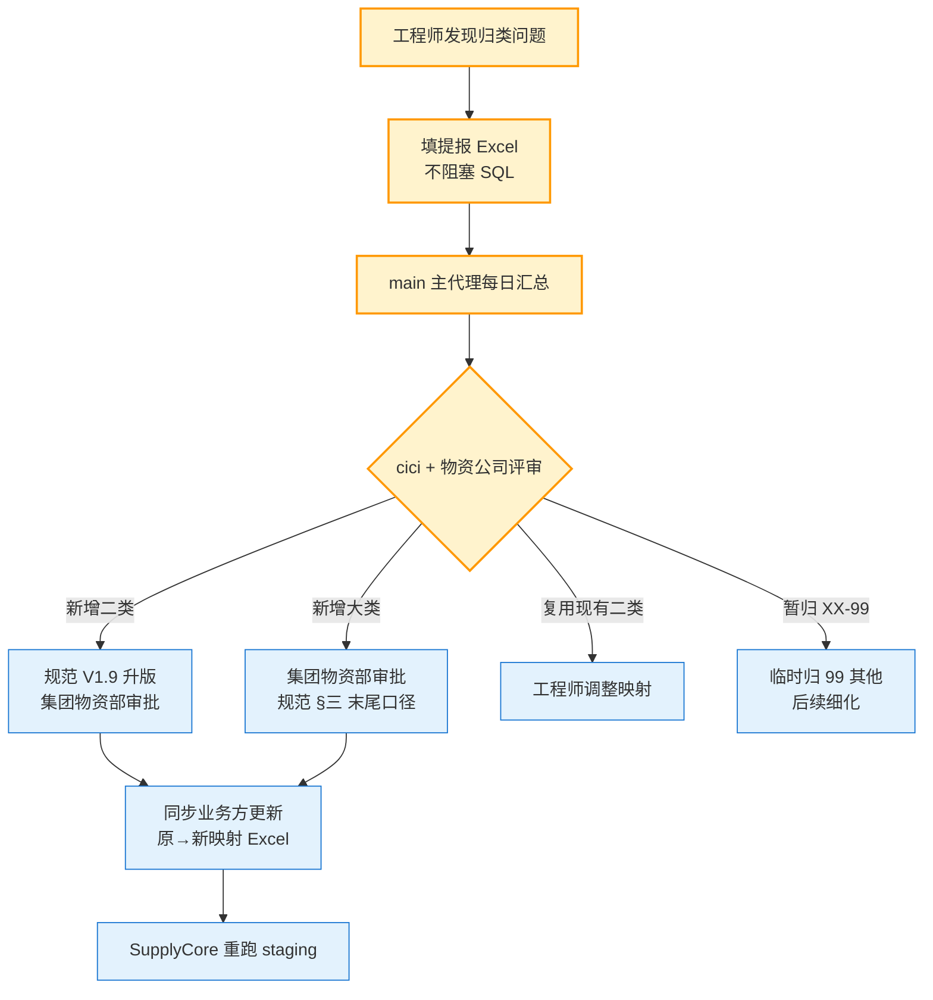

# 物料分类基线 V0.1（引用《物资编码规范》V1.8）

**项目**：阜矿物资供应管理系统 / SupplyCore
**日期**：2026-05-17（Spencer 九轮反馈后 / **V0.1 内 b 版修正**）
**定位**：物料分类前置规划基线 / 业务方核对 / 工程师归类映射依据 / 提报增补动态扩充
**权威来源**：[`docs/详细规则/物资编码规范文档.md`](../详细规则/物资编码规范文档.md) **V1.8（2026-05-04 已定稿）**
**配套**：[`原系统迁移方案-V0.1.md`](./原系统迁移方案-V0.1.md) §八-A.8 / [`02 物资主数据清单`](./原系统迁移-对照清单-02物资主数据-V0.1.md)

> **V0.1 内 b 版修正记录**（2026-05-17 / Spencer 九轮反馈）：
>
> V0.1 a 版误用 02 模板示例的 8 大类（`01`-`08` 数字编码）作为基线。Spencer 指出"一类编码已经是 14 大类"，找到权威定义 — [`物资编码规范-V1.8`](../详细规则/物资编码规范文档.md)（2026-05-04 定稿）的 **14 大类（拼音字母 HG/ZH/SB/...）+ 1 保留（PS）+ 二级分类已完整定义（共 95 个二类）**。
>
> b 版彻底修正：本文档**不再重复列出分类**，直接引用规范 V1.8 作为权威源 + 加业务方核对路径 + 工程师提报机制。

---

## 一、定位与原则

### 1.1 这份文档不是新创，是引用现有权威规范

集团已经发布《物资编码规范》V1.8（2026-05-04 / 节三、节四）作为**一期正式启用的权威基线**。

本文档作用：
1. **承上启下**：把权威规范 V1.8 引入迁移工作流
2. **业务方核对**：让物资公司物资管理 + 各厂矿物资部核对"V1.8 是否覆盖原系统物料"
3. **工程师提报机制**：原系统工程师在 SQL 归类映射时，发现 V1.8 未覆盖的物料 → 提报增补（按 V1.8 §三 末尾"后续新增大类经集团审批后扩展"的口径走）

### 1.2 编码规则（来自规范 V1.8 §二）

```
XX - XX - XXXXXX
 ↑    ↑     ↑
大类  分类  流水号
(2 位拼音) (2 位数字) (6 位序号)

示例：ZH-01-000001（支护材料-锚杆-第 1 号）
      HG-01-000001（火工品-炸药-第 1 号）
```

- **大类**：2 位拼音首字母（HG / ZH / SB / ...）
- **分类**：2 位数字（`01` - `99`，每大类必有 `99 其他`兜底）
- **流水号**：6 位数字（按分类独立自增 / 从 `000001` 开始）
- **总长**：10 位字符（含分隔符 `-` 共 12 位）

---

## 二、14 大类 + 1 保留（直接引用规范 V1.8 §三）

| # | 大类代码 | 拼音来源 | 大类名称 | 二类数 | 高敏感 | 关键说明 |
|---|---|---|---|---|---|---|
| 1 | **HG** | 火工 | 火工品 | 4 | **✅ 全部** | 炸药/雷管/导爆管 / 国家管控物资 / 单独管控 |
| 2 | **ZH** | 支护 | 支护材料 | 9 | 否 | 锚杆/锚索/钢带/网片/坑木/型钢梁 |
| 3 | **SB** | 设备 | 设备整机 | 11 | 否 | 采煤机/掘进机/液压支架/皮带机等整机设备 |
| 4 | **BP** | 备品 | 备品备件 | 10 | 否 | 采煤机/掘进机/皮带机/液压支架等设备配件 |
| 5 | **JD** | 机电 | 机电材料 | 6 | 否 | 电缆/防爆开关/传感器/变频器/灯具 |
| 6 | **YZ** | 油脂 | 油脂燃料 | 6 | 部分 | 柴油/液压油/乳化液/润滑脂（YZ-01 燃油部分高敏感）|
| 7 | **GC** | 钢材 | 钢材 | 8 | 否 | 钢轨/型钢/钢板/钢管/钢丝绳 |
| 8 | **JZ** | 建筑 | 建筑材料 | 5 | 否 | 水泥/砂石/砖/防水材料 |
| 9 | **TF** | 通防 | 通防材料 | 5 | 否 | 风筒/瓦斯抽采管/密闭材料/阻化剂 |
| 10 | **HX** | 化学 | 化工材料 | 5 | **✅ 全部** | 浮选药剂/絮凝剂/注浆材料/阻燃剂 / 批次管理 |
| 11 | **GJ** | 工具 | 工器具 | 7 | 否 | 手动/电动/气动工具/测量仪表 |
| 12 | **LB** | 劳保 | 劳保用品 | 8 | 否 | 安全帽/矿灯/自救器/工作服 |
| 13 | **BZ** | 包装 | 包装材料 | 3 | 否 | 编织袋/标签 |
| 14 | **BG** | 办公 | 办公用品 | 3 | 否 | 办公耗材及日常消耗品 |
| - | **PS（保留）** | 排水 | 排水材料 | 5 | 否 | **用量少时归 BP-99**，规模达标启用 PS |

**合计：14 启用 + 1 保留 / 95 个二类**

> 每大类的完整二类清单详见 [`物资编码规范文档.md`](../详细规则/物资编码规范文档.md) §四（4.1 ~ 4.15）。
> **本文档不重复列出二类清单**，避免与权威规范出现版本漂移。

### 2.1 PS 排水材料启用规则（重要）

- 用量较少的单矿：暂归 `BP-99`（备品备件其他）
- 达到独立管理规模：启用 PS 大类（向集团物资部申请）
- **试点 3 单位**（`001.007.001` / `002` / `018`）启用判断由 Spencer + 物资公司决定

---

## 三、业务方核对路径

### 3.1 核对目标（不是重新规划，是覆盖度核对）

业务方核对**不要重新设计编码规则**（V1.8 已定稿 / 不能动），核对的是：

| 检查项 | 行动 |
|---|---|
| ① 各厂矿常用物料能否在 14 大类 + 95 二类中找到归类 | 试点 3 单位列 Top 100 物料 / 验证覆盖率 |
| ② 是否需要新增二类（V1.8 未覆盖的）| 集中到工程师提报清单 / cici + 物资公司评审 |
| ③ PS 是否需要试点启用 | 试点 3 单位单独评估 / Spencer 决定 |
| ④ 高敏感属性是否需要扩展 | HG/HX 已全部高敏感 / 其他大类（如 YZ 燃油）是否要标 |
| ⑤ 跨大类边界模糊的物料（如井下水泵 / 既属 SB 又属 PS 配件）| 工程师提报 / cici 仲裁归属 |

### 3.2 责任分工

| 工作项 | 责任 | 工作量 |
|---|---|---|
| 物资公司物资管理：核对 14 大类 + 95 二类覆盖度 | 物资公司物资管理 | 1 天 |
| 各厂矿物资部：列 Top 100 物料 + 验证归类 | 各厂矿物资部 | 1 天 |
| 汇总反馈 + 提报清单整理 | main 主代理 | 0.5 天 |
| cici + 物资公司评审 / 签字锁定 | cici + 物资公司物资管理 | 0.5 天 |
| 锁定版导入 MaterialCategory 表 | main 主代理 | 0.5 天 |
| **小计** | | **3.5 天 / 关键前置路径** |

工作量比 V0.1 a 版（3-4 天）略少 — 不需要从零编辑分类，只需核对现有 V1.8 规范的覆盖度。

---

## 四、工程师归类提报机制

### 4.1 提报场景

工程师在 02 物料 SQL 归类映射时遇到：

- 原系统的某类物料**在 V1.8 14 大类 + 95 二类中找不到合适位置**（应优先考虑归到对应大类的 `99 其他`）
- 业务方维护的"原→新分类编码映射 Excel"不覆盖某些原分类
- 某个 `99 其他` 下物料数量异常多（粒度不够 / 建议拆出新二类，规范升版 V1.9）
- 物料的实际高敏感属性与 V1.8 标注不一致

→ **填"分类提报清单 Excel"**（不阻塞 SQL）

### 4.2 提报清单字段

| 字段 | 说明 | 示例 |
|---|---|---|
| `legacy_code` | 原系统物料编码 | MAT-12345 |
| `material_name` | 原物料名称 | 矿用机器人控制器 |
| `original_category_code` | 原系统分类编码 | 01.05.机器人 |
| `current_v18_fallback` | 当前 V1.8 兜底归类 | SB-99 其他设备 |
| `suggested_new_category` | 建议新增二类（如规范要升 V1.9）| SB-12 矿用机器人 |
| `suggested_high_sensitive` | 高敏感属性建议 | false |
| `reason` | 提报原因 | SB-99 已积累 80+ 条 / 粒度不够 |
| `urgency` | 高 / 中 / 低 | 中 |

### 4.3 评审 + 增补流程



### 4.4 SLA

| 紧急度 | 工程师提交 | cici 评估回应 |
|---|---|---|
| 高（阻塞 SQL）| 即时（微信 / 电话）| **2 小时内** |
| 中 | 当日工作结束前 | 24 小时内 |
| 低 | 批量累积 | 48 小时内 |

---

## 五、责任分工总览

| 工作项 | 责任 |
|---|---|
| 编码规范权威源 | 集团物资管理部 / 已发布规范 V1.8（2026-05-04）|
| 核对覆盖度（针对试点 3 单位）| 物资公司物资管理 + 各厂矿物资部 |
| 锁定版进 MaterialCategory | main 主代理 + cici |
| 工程师归类映射 + 提报 | 原系统工程师 + main 主代理（汇总）|
| 提报评审 + 增补决定 | cici + 物资公司物资管理 |
| 新增大类审批 | 集团物资管理部（按 V1.8 §三 口径）|
| 规范升版（V1.9）| 集团物资管理部 / SupplyCore 项目组协助起草 |

---

## 六、关键引用

| 文档 | 用途 |
|---|---|
| [`docs/详细规则/物资编码规范文档.md`](../详细规则/物资编码规范文档.md) V1.8 | **权威基线 / 14 大类 + 95 二类完整清单** |
| [`docs/招标/附件六-物料编码规范-v1.1.md`](../招标/附件六-物料编码规范-v1.1.md) | 招标版（与 V1.8 对齐 / 节三末尾说明）|
| [`docs/详细设计/03-物料主数据与编码详细设计-V1.2.md`](../详细设计/03-物料主数据与编码详细设计-V1.2.md) §4.1 + §4.7 | M-04 分类 + M-18 历史映射 数据模型 |
| [`docs/上线/原系统迁移方案-V0.1.md`](./原系统迁移方案-V0.1.md) §八-A.8 | 迁移工作流配套 |
| [`docs/上线/物料分类映射指南-V0.1.md`](./物料分类映射指南-V0.1.md) | **给原系统工程师的映射操作指南**（含 95 二类详表 + M-18 映射 Excel 模板 + 工作步骤）|

---

## 七、版本沿革

| 版本 | 日期 | 变更 |
|---|---|---|
| V0.1 a 版 | 2026-05-17 早 | 项目组首次起草 / **❌ 误用 02 模板示例的 8 大类**（应为 14 大类）|
| V0.1 b 版 | 2026-05-17 同日修正 | **Spencer 九轮反馈** / 修正引用为权威规范 V1.8 / 14 大类 + 1 保留 + 95 二类 / 编码格式 `XX-XX-XXXXXX` |

---

**Created**: 2026-05-17 / SupplyCore 项目组 / Spencer 九轮反馈
**Owner**: main 主代理 + cici 协调
**配套**：[`原系统迁移方案-V0.1.md`](./原系统迁移方案-V0.1.md) §八-A.8
