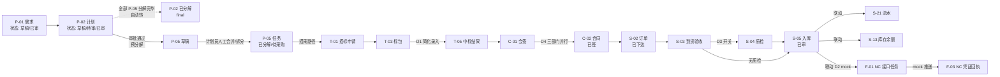

# 档 A 增强原型实施方案（V0.4）

**版本：** V0.4
**日期：** 2026-05-10
**文档性质：** 原型设计层 · 实施方案文件
**适用阶段：** 原型 v0.9 增强（半交互式 mock）开发与验收

---

## 一、文档目的

本文档用于把"档 A 增强原型 — 推荐版"的范围、技术决策、架构、数据模型、联动规则、路线图和验收标准固化下来，作为开发与评审依据。

本文档重点回答：

- 增强原型的目的、范围与边界（不是开发正式系统）
- 选定的简化决策（D1-D6）与对应工作量
- 4 层架构（数据 / 状态机 / 联动 / UI）的设计
- 主线 + 一类扩展涉及实体（约 28 张）的 LocalStorage schema 与精简字段
- 8+ 状态机的 JS 定义与触发联动
- 39 页静态原型中需要改造的页面范围（17 页 + 全局组件）
- 5-6 周分周路线图与每周可演示交付物
- 风险与边界
- 验收标准（业务方 / 项目领导小组各自看什么）

本文档**不**做以下事：

- 不写正式开发的代码框架（不引入 Vue / React / .NET 等）
- 不替代详设 01-11 的字段约定与状态机规约（增强原型只取核心子集）
- 不做正式系统的安全 / 性能 / 信创合规（archive 性质）
- 不做 NC、Nova、招采平台真实集成（全部 mock）

### 1.1 本期能力边界声明

为避免读者误读为"完整业务闭环"，明确划清本期的能力边界。

#### ✅ 本期满足

| 维度 | 内容 |
| --- | --- |
| **业务主线** | **采购入库主线完整联动**：需求审批 → 计划汇总 → 任务分解 → 招采（含流标）→ 合同（三部门会签）→ 订单 → 到货 → 质检 → 入库 → 库存原子事务（S-13/S-14/S-21）+ 应付挂账（BIZ-001）+ NC 推送（mock）|
| **治理能力** | 审批管理中心 + 预警通知中心 + 核心报表 5 张 + 多角色切换 + 流标重新走集体决策 |
| **核心机制演示** | 库存原子事务、移动平均成本、应付挂账时点、多节点审批（含集团并行会签 + 1000 万分档）、NC 接口任务 + 状态分层 + 重推、流标 + 反规避 + 预警治理 |

#### ❌ 本期不满足

| 维度 | 内容 | 落点 |
| --- | --- | --- |
| **财务闭环** | 合同付款链路（C-04/07/08/10）、月度集体决议 WF-PAY-001、应付消减 BIZ-020、NC 实付回写 | 二期 A4 |
| **暂估闭环** | 6 个月窗口 + D-90/D-30 二段预警 + 自动冲销 + 三对一致对账 | 二期 A8 |
| **三单匹配** | 合同 / 入库 / 发票三单匹配规则 | 二期 A4（含在付款链路）|
| **出库与流转** | 领料出库 / 调拨 / 盘点 / 废旧 / 委托加工 / 外委检修 / 直达 | 二期 A2/A3/A5/A6/A9/A10/A11 |
| **设备主线** | 设备建档 / 租赁 / 检修 / 报废 | 二期 A7 |
| **后评价反馈** | 4 类反馈 → 自动联动供应商分类 | 二期 A12 |

> **核心结论**：本期满足的是 **采购入库主线完整联动 + 治理能力雏形**；不满足的是 **从需求到付款 / 暂估 / 三单匹配的端到端财务闭环**。后者是二期 A4/A8 的核心范围，详见 [`03-档A二期扩展规划-V0.1.md`](./03-档A二期扩展规划-V0.1.md)。

---

## 二、范围与决策

### 2.1 主线范围

增强原型按一条"端到端采购入库主线"+ 一类 5 项治理能力组织：

```
主线：需求审批 → 采购计划 → 任务分解 → 招采标包 → 中标回传
       → 合同 → 采购订单 → 到货验收 → 入库 / NC（mock）

一类扩展：审批管理中心 + 预警通知中心 + 核心报表 + 多角色切换 + 流标
```

主线涉及实体（约 20 张）：

- **采购计划域**：P-01 demand_request、P-02 purchase_plan、P-03 plan_line、P-05 purchase_task、P-06 demand_request_line
- **招采域**：T-01 tender_application、T-03 tender_package、T-04 procurement_document、T-05 tender_result、T-07 tender_package_line
- **合同域**：C-01 contract_approval、C-02 contract（含 `payment_terms` 文本字段描述付款节奏，本期不建 C-04 实体）、C-11 contract_line
- **库存域**：S-01 purchase_request、S-02 purchase_order、S-03 goods_receipt、S-04 quality_inspection（可选）、S-05 purchase_receipt、S-22 ~ S-25 明细、S-13 inventory、S-14 inventory_batch、S-21 inventory_transaction
- **接口域（mock）**：F-01 interface_task、F-02 interface_message、F-03 interface_receipt、F-13 interface_switch
- **审批 / 主数据域**：A-08 workflow、A-09 node、A-20 instance、A-10 opinion；M-01 organization、M-05 material、M-09 supplier、M-12 cost_center

一类扩展涉及实体（约 8 张）：

- **报表预警域**：R-01 report_definition、R-04 alert_rule、R-05 alert_record、R-08 alert_notification、R-11 alert_receiver
- **审批中心**：A-20 approval_instance（已涉及）+ A-10 approval_opinion（已涉及）+ 角色 ↔ 待办关联

### 2.1.1 一类扩展能力详细范围

| # | 能力 | 描述 | 涉及实体 |
| --- | --- | --- | --- |
| **E1** 审批管理中心 | 当前角色的"待办审批 / 我发起的 / 我审批过的"三段视图；点击进入对应业务单据；按钮直接审批通过 / 驳回 + 写入 A-10 意见 + 触发 A-20 状态迁移 | A-20 / A-10 / 业务实体 |
| **E2** 预警通知中心 | 当前角色的"未读预警 / 已确认 / 已处理"三段视图；按预警来源穿透到业务单据；支持手工标记已处理 | R-05 / R-08 / R-11 |
| **E3** 核心报表 5 张 | RPT-INV-001 库存余额表 / RPT-INV-002 收发存报表 / RPT-FIN-001 接口推送状态 / RPT-PUR-001 采购入库汇总 / RPT-WF-001 审批超时统计；从主线产生的数据自动聚合（V0.4 修订：原 V0.3 含 RPT-FIN-002 暂估未冲销与边界声明冲突，本期不演示暂估，移二期 A8）| R-01 + 各业务实体 |
| **E4** 多角色切换 | 顶部下拉切换：采购员 / 计划员 / 物资主管 / 财务 / IT / 集团委员会；切换后菜单 / 按钮 / 数据范围（A-06）按角色过滤 | A-02 / A-03 / A-06 |
| **E5** 流标 + 重新集体决策 | T-03 状态机加流标态 + 联动 ALR-PUR-002 流标预警 + 重新发标必须重走集体决策审批 | T-03（加流标态）|

### 2.2 推荐版决策（D1-D6）

| # | 决策 | 选定方案 | 理由 |
| --- | --- | --- | --- |
| **D1** | 招采阶段 | **简化**：跳过发标 / 投标 / 评标，直接录入中标结果 T-05 | 一期口径"以结果手工导入为主"，详设 04 §4.10.4；省 1 周工作量 |
| **D2** | NC 推送 | **完整 mock**：F-13 开关 ON 时调 mock 函数返回假凭证号，触发 F-01 + 状态分层 | 这是演示的核心亮点之一，必须保留 |
| **D3** | 质检（S-04） | **开关切换**：到货验收页加复选框"是否需要质检"；勾选则多一步串行短路 | 简单加开关，工作量低，能展示串行短路三类验收 |
| **D4** | 审批流深度 | **完整多节点**：按详设 10 V1.2 的 WF-* 模板真实流转 | 详设 10 V1.2 是核心成果，必须演示集团并行会签等亮点 |
| **D5** | 计划聚合 + 任务分解 | **保留**：演示"基层需求 → 计划汇总（同物料合并）→ 计划员人工拆分 / 合并 P-05 任务 → 打包标包"全流程 | 与 prototype 已有 `purchase-task-decomposition.html` 对齐；Spencer 强调过的关键演示能力（memory 2026-05-10 第 9 条）。**V0.3 修订**：原 V0.2 简化为 1:1 与 prototype 现实矛盾，本版回归保留聚合 + 人工分解 |
| **D6** | 主数据 | **预填充**：5-10 个物料、3-5 家供应商、2-3 个组织、1-2 个仓库 | 节省物料申请、供应商准入子流程的工作量 |

### 2.3 不在本期范围（移到二期）

- 出库主线（S-08 / S-09）— 留 A2 主线（二期）
- 调拨主线（S-11 / S-12）— 留 A3 主线（二期）
- 盘点 / 废旧（S-15-S-20）— 留 A5/A6 主线（二期）
- 合同付款链路（C-07 / C-08 / C-10）— 留 A4 主线（二期）
- 设备 / 设备租赁（E 域）— 留 A7 主线（二期）
- 委托加工 / 外委检修 / 直达使用单位 / 暂估闭环联动 — 留 A8/A9/A10/A11（二期）
- 后评价反馈 / 应急采购 / 化整为零反规避 — 二期
- AI Tool / 时间穿越 / 数据导入导出 / 三对一致定期对账 — 二期 / 三期
- 真实多用户 / 真实 SSO / 真实 NC — 全部 mock（不在档 A 任何阶段）

**完整二期 / 三期挂账见 `03-档A二期扩展规划-V0.1.md`**。

---

## 三、技术决策

### 3.1 技术栈

| 层 | 选型 | 理由 |
| --- | --- | --- |
| 前端框架 | **Vanilla JS（保持现有 prototype 风格）** | 不引入 Vue / React，与现有 39 页原型代码风格一致，无学习成本 |
| 数据持久化 | **LocalStorage**（每个实体一个 key，JSON 序列化） | 单机演示足够；如遇容量瓶颈（5 MB 上限）再切 IndexedDB |
| 状态管理 | **`prototype/assets/data.js` 升级为状态管理中心** | 复用现有结构 |
| 跨页面广播 | **`BroadcastChannel API`**（state-bus 频道） | 浏览器原生支持，不需第三方库 |
| 状态机 | **JS 对象 + 手写 transition 函数**（不引入 XState） | 详设状态机相对简单，手写更可控 |
| 联动规则 | **事件总线**（`EventTarget` + 自定义 Event） | 状态迁移触发 emit 事件，订阅者执行级联 |
| mock 用户 / 角色 | **顶部下拉切换（保留现有 chrome.js 结构）** | 不做真 SSO |
| mock NC | **延迟 1-2 秒返回假凭证号 + 5% 失败率（演示重推）** | 模拟真实接口的异步性 + 失败 / 重推场景 |

### 3.2 文件组织

```
prototype/
├── index.html                      # 现有
├── assets/
│   ├── chrome.js                   # 现有，加角色切换
│   ├── data.js                     # 升级为状态管理中心
│   ├── statemachine.js             # 新增：状态机定义与执行
│   ├── linkage.js                  # 新增：联动规则订阅
│   ├── mock-nc.js                  # 新增：NC mock 接口
│   ├── seed-data.js                # 新增：主数据种子
│   └── ui-helper.js                # 新增：通用 UI 函数（确认对话框、Toast 等）
│   └── roles.js                    # 新增：6 角色定义 + 菜单可见性 + 数据范围过滤
├── *.html (现有 39 页，本期改造 17 页 — 见 §七)
│   ├── requirement-list.html / requirement-detail.html  # 改造：P-01 表单 + 提交审批触发
│   ├── purchase-planning.html      # 改造：P-02 审批 + 生成 P-05 草稿
│   ├── purchase-task-decomposition.html  # 改造：P-05 草稿 → 人工合并/拆分 → 已分解（D5）
│   ├── tender.html / tender-archive.html  # 改造：T-01/T-03 录入 + T-05 中标 + 流标态（E5）
│   ├── contract-detail.html        # 改造：C-01 会签 + 三部门并行（D4）
│   ├── purchase-orders.html        # 改造：S-02 订单下达 + 关联合同
│   ├── goods-receipt.html          # 改造：S-03 到货 + 质检开关（D3）
│   ├── quality-check.html          # 改造：S-04 串行短路三类验收（D3）
│   ├── purchase-receipt.html       # 新建（V0.3）：S-05 入库审核 + S-13/S-14/S-21 联动 + NC mock
│   ├── inventory.html              # 改造：S-13 余额 + S-21 流水穿透
│   ├── nc-interface.html / nc-interface-detail.html  # 改造：F-01 任务 + 重推 + F-03 回执
│   ├── approval-center.html        # 改造：三段视图 + 一键审批（E1）
│   ├── alert-rules.html            # 改造：扩为 alert-center 能力（E2）
│   └── reports.html / report-detail.html  # 改造：5 张报表统一入口（E3）
└── README.md                       # 升级到 v0.9
```

---

## 四、4 层架构

### 4.1 数据层（`data.js`）

升级 `data.js` 为状态管理中心，提供：

```javascript
// 数据访问 API
data.get(entity, id)            // 读取单条
data.list(entity, filter)       // 列表查询
data.create(entity, payload)    // 新增
data.update(entity, id, patch)  // 局部更新
data.delete(entity, id)         // 软删除（is_deleted=true）

// 持久化（LocalStorage 自动 sync）
data.flush()                    // 主动持久化
data.reset()                    // 重置到种子数据

// 跨页面状态同步
data.subscribe(entity, callback)  // 订阅实体变化
data.broadcast(entity, event)     // 广播变化
```

每个实体一个 LocalStorage key：`prototype:M-05`、`prototype:P-01` 等。
存储格式：JSON 数组 `[{...}, {...}]`。
索引用 in-memory Map（页面加载时构建）。

### 4.2 状态机层（`statemachine.js`）

每个实体的状态机用 JS 对象表达：

```javascript
const stateMachines = {
  'P-02': {
    initial: '草稿',
    states: {
      '草稿': { on: { '提交审批': '待审' } },
      '待审': {
        on: {
          '审批通过': '已审',  // V0.4a 修订（同事 P1）：状态机只转状态，不在此处创建草稿
          '审批驳回': '已驳回'
        }
      },
      '已审': {
        // V0.4 修订：'已审 → 已分解' 不再由人工触发，
        // 由 P-05 全部分解完毕后自动触发（见 linkage `P-05:草稿→已分解` 订阅）
        on: { '全部任务分解完毕': { target: '已分解', guards: ['allTasksDecomposed'] } }
      },
      '已驳回': { on: { '修改后提交': '待审' } },
      '已分解': { type: 'final' },
      '已作废': { type: 'final' }
    },
    guards: {
      '提交审批': (entity) => entity.lines.length > 0,  // 必须有计划行
      'allTasksDecomposed': (plan) => {
        // 全部 P-05 状态在 已分解/待采购/已分流/已完成 中，无草稿态
        const tasks = data.list('P-05', { plan_id: plan.id });
        return tasks.every(t => ['已分解', '待采购', '已分流', '已完成'].includes(t.task_state));
      }
    }
    // V0.4a 修订（同事 P1）：原 V0.4 在此处定义 actions: { createTaskDrafts }，
    // 与 §6.2 联动表中 linkage.on('P-02:已审') 的副作用重复，会创建重复 P-05 草稿。
    // 修正：本状态机仅负责状态迁移与 guards；P-05 草稿创建 + 通知 PLANNER 由 linkage.on('P-02:已审') 唯一负责（见下文 §6.3 联动规则示例）。
  },
  // ... 其余 7 个状态机
};

// 状态机执行引擎
function transition(entity, event, payload) {
  const sm = stateMachines[entity.type];
  const state = sm.states[entity.state];
  const transition = state.on[event];
  // 校验 guards、执行 actions、更新 state、广播事件
}
```

主线涉及的 8 个状态机：

| 实体 | 状态数 | 关键迁移 |
| --- | --- | --- |
| **P-02 采购计划** | 6 | 草稿 / 待审 / 已审 / 已驳回 / 已分解 / 已作废 |
| **T-01 招标申请** | 5 | 待申请 / 待审 / 已审 / 已驳回 / 已结案 |
| **T-03 标包** | 6 | 待标 / 已发标 / 已评标 / 已公示 / 流标 / 已结案（D1 简化为：待标 / 已结案）|
| **C-02 合同** | 8 | 草稿 / 待审 / 已签 / 执行中 / 已完成 / 已变更 / 已终止 / 已作废 |
| **S-02 采购订单** | 5 | 草稿 / 已下达 / 部分到货 / 全部到货 / 已关闭 |
| **S-03 到货验收** | 3 | 待验收 / 已验收 / 已拒收 |
| **S-04 质检** | 5 | 待检 / 品种检验中 / 数量检验中 / 质量检验中 / 已检验（D3 开关启用） |
| **S-05 采购入库** | 5 | 草稿 / 待审 / 已审 / 已作废 / 已冲销 |

### 4.3 联动规则层（`linkage.js`）

监听状态机的状态迁移事件，触发级联动作：

```javascript
// V0.4a 修订（同事 P1 收口）：P-02 状态机本身不再 actions 创建草稿，
// 仅由本 linkage 唯一负责创建 + 通知，避免重复。
linkage.on('P-02:已审', async (plan) => {
  // 自动生成 P-05 草稿，等计划员人工分解
  for (const line of plan.lines) {
    await data.create('P-05', {
      task_no: generateNo('TK'),
      plan_id: plan.id,
      plan_line_id: line.id,
      material_id: line.material_id,
      quantity: line.quantity,
      task_state: '草稿'  // 不是"待采购"
    });
  }
  // 推送通知给计划员去 purchase-task-decomposition.html 调整
  await notify('PLANNER', '有新的采购任务待分解', { plan_id: plan.id });
});

// 计划员人工分解 / 合并后提交单条 P-05；提交后检查是否触发 P-02 自动转已分解
linkage.on('P-05:草稿→已分解', async (task) => {
  // 触发采购方式分流：招采 / 直采 / 单一来源
  if (task.tender_type === '招标') {
    await data.create('T-01', { plan_id: task.plan_id, /* ... */ });
  } else if (task.tender_type === '直接采购') {
    await data.create('S-01', { task_id: task.id, /* ... */ });
  }

  // V0.4a：检查所属 P-02 的全部 P-05 是否都脱离草稿态；满足则触发 P-02 状态机自动转已分解
  const plan = await data.get('P-02', task.plan_id);
  if (plan && plan.state === '已审') {
    await transition('P-02', plan.id, '全部任务分解完毕');  // guards `allTasksDecomposed` 把关
  }
});

linkage.on('T-05:已验证', async (result) => {
  // 中标结果落地后自动创建合同会签 C-01
  await data.create('C-01', {
    approval_no: generateNo('CA'),
    supplier_id: result.supplier_id,
    contract_amount: result.winning_amount,
    approval_state: '待会签'
  });
});

linkage.on('S-05:已审', async (receipt) => {
  // 同事务联动：S-21 流水 + S-13 库存 + 触发 NC 凭证
  await transaction(async () => {
    await createInventoryTransaction(receipt);
    await updateInventoryBalance(receipt);
    await triggerNCInterface(receipt, 'BIZ-001');
  });
});
```

### 4.4 UI 层（页面改造）

每个改造页面遵循"3 段结构"：

```html
<!-- 顶部：实体当前状态 + 历史时间线 -->
<section id="state-header">
  <h2 id="bill-no"></h2>
  <div id="state-badge"></div>
  <div id="state-timeline"></div>  <!-- 状态历史 -->
</section>

<!-- 中部：表单字段 + 明细行 -->
<section id="form">
  <!-- 字段表（按详设字段表） -->
  <!-- 明细行（如有）-->
</section>

<!-- 底部：操作按钮（按当前状态可用迁移）+ 审批意见 -->
<section id="actions">
  <!-- 动态渲染 transition 按钮 -->
  <!-- 如需审批，显示审批意见输入 -->
</section>
```

每个 UI 改造主要做 3 件事：
1. 加载时从 `data.list(entity, filter)` 取数据
2. 提交时调 `transition(entity, event, payload)` 触发状态机
3. 订阅 `data.subscribe(entity, callback)` 让状态变化自动刷新页面

---

## 五、数据模型（核心实体精简字段）

> 增强原型只取详设字段表的最小子集（约 60% 字段），保证业务可演示。完整字段表以详设为准。

### 5.1 主数据（预填充）

```javascript
// M-01 organization
[
  { id: 1, code: 'GROUP', name: '阜矿集团', type: 'GROUP', parent_id: null },
  { id: 2, code: 'WZ', name: '物资公司', type: 'COMPANY', parent_id: 1 },
  { id: 3, code: 'MINE-A', name: '甲煤矿', type: 'MINE', parent_id: 1 },
  { id: 4, code: 'MINE-B', name: '乙煤矿', type: 'MINE', parent_id: 1 }
]

// M-02 warehouse
[
  { id: 1, code: 'WH-01', name: '物资公司中心库', org_id: 2 },
  { id: 2, code: 'WH-02', name: '甲矿现场库', org_id: 3 }
]

// M-05 material（5-10 个）
[
  { id: 1, code: '01010001', name: '锚杆 Φ20×2400', unit: '根', category: 'BP', is_direct_eligible: false },
  { id: 2, code: '01020003', name: '矿用电缆 MYP-3×50', unit: '米', category: 'DL', is_direct_eligible: false },
  { id: 3, code: 'HG010001', name: '乳化炸药', unit: 'kg', category: 'HG', has_batch: true, is_safety_special: true },
  // ...
]

// M-09 supplier（3-5 家）
[
  { id: 1, code: 'SUP-001', name: '某矿用支护材料公司', state: '合格', credit_level: 'A' },
  { id: 2, code: 'SUP-002', name: '某电缆制造公司', state: '合格', credit_level: 'B' },
  // ...
]
```

### 5.2 业务实体核心字段

每个实体只保留：主键、业务编号、关键 FK、关键业务字段、状态字段、审计字段。

详细字段清单见附录 A。

---

## 六、状态机与联动详细规约

### 6.1 主线串联图



### 6.2 关键状态迁移与联动

| 状态迁移 | 前置校验（guards） | 自动级联（actions） |
| --- | --- | --- |
| P-01 提交审批 | 物料 / 数量必填 | 创建审批实例 A-20 |
| P-01 审批通过 | 审批实例完成 | 触发 P-02 计划汇总 / 聚合（**支持同物料合并**，D5 决策）；实际 P-05 任务由计划员在 `purchase-task-decomposition.html` 确认分解，不在此处自动展开 |
| P-02 提交审批 | 至少 1 行计划行 | 按金额触发不同 WF 模板（D4） |
| P-02 审批通过 | 集团委员会通过（如金额超阈值） | **自动生成 P-05 草稿**（按计划行预分解，状态 = `草稿`），推送计划员到 `purchase-task-decomposition.html` 处理 |
| P-05 计划员确认 / 调整 | 至少 1 条 P-05 草稿存在 | 计划员可**人工合并 / 拆分** P-05；提交后状态 = `已分解`，进入采购方式分流（招采 / 直采 / 单一来源）|
| P-05 选择采购方式 | — | 招采路径 → 触发 T-01；直采路径 → 触发 S-01 |
| T-05 录入中标结果 | 标包存在 | 自动创建 C-01 会签 |
| C-01 会签通过 | 三部门均会签（D4 完整版） | 自动生成 C-02，状态 = 已签 |
| C-02 已签 | 必备 15 项条款齐全（D6 简化为不校验） | — |
| S-02 下达 | 关联合同存在 | 触发 NC mock 接口（订单同步）|
| S-03 已验收 | 数量在订单允许范围 | 是否需质检（D3 开关）|
| S-04 已检验 | 三类验收串行短路 | 不合格转待验区（联动 S-13 不增） |
| S-05 已审 | 关联到货 / 质检完成 | **核心联动**：S-21 流水写入 + S-13/S-14 库存更新 + F-01 接口任务（BIZ-001）|
| F-01 推送中 | F-13 开关 ON | mock NC：1-2 秒延迟 + 5% 失败率 |
| F-01 推送失败 | retry < 3 | 30 秒后自动重推；超过 3 次进入 F-08 异常台账 |

### 6.3 库存原子事务规约（最关键的演示点）

S-05 采购入库审核通过时，必须在同一个 LocalStorage 事务内完成：

```javascript
async function onPurchaseReceiptApproved(receipt) {
  // 开始事务（LocalStorage 不支持事务，用快照 + 回滚机制模拟）
  const snapshot = data.snapshot(['S-21', 'S-13', 'S-14', 'F-01']);

  try {
    for (const line of receipt.lines) {
      // 1. 写 S-21 流水
      await data.create('S-21', {
        transaction_type: '入库',
        material_id: line.material_id,
        warehouse_id: receipt.warehouse_id,
        batch_id: line.batch_id,
        quantity_delta: line.quantity,
        amount_delta: line.line_amount,
        source_bill_type: 'S-05',
        source_bill_id: receipt.id,
        source_line_id: line.id
      });

      // 2. 更新 S-13 库存余额（移动平均）
      const inv = await data.findOrCreate('S-13', {
        org_id: receipt.org_id,
        warehouse_id: receipt.warehouse_id,
        material_id: line.material_id
      });
      inv.unit_cost = (inv.total_amount + line.line_amount) / (inv.quantity + line.quantity);
      inv.quantity += line.quantity;
      inv.total_amount += line.line_amount;
      inv.available_quantity = inv.quantity - inv.frozen_quantity;
      await data.update('S-13', inv.id, inv);

      // 3. 如有批次，更新 S-14
      if (line.batch_id) {
        await data.upsert('S-14', { /* ... */ });
      }
    }

    // 4. 触发 NC 接口（mock）
    if (await data.get('F-13', 'BIZ-001-switch')?.switch_status === '开') {
      await data.create('F-01', {
        task_no: generateNo('FT'),
        interface_id: 'BIZ-001',
        source_bill_no: receipt.receipt_no,
        source_bill_type: 'S-05',
        task_state: '待推送'
      });
      // 异步触发 mock 推送（不阻塞主事务）
      setTimeout(() => mockNCPush(receipt), 0);
    }

  } catch (e) {
    data.rollback(snapshot);
    throw e;
  }
}
```

### 6.4 NC 接口 mock 规约

`mock-nc.js` 模拟 NC 推送的真实异步行为：

```javascript
async function mockNCPush(taskId) {
  await sleep(1000 + Math.random() * 1000);  // 1-2 秒延迟

  const success = Math.random() > 0.05;  // 95% 成功率
  if (success) {
    await data.create('F-03', {
      task_id: taskId,
      receipt_status: '已记账',
      nc_voucher_no: `NC${dateStr()}${seq()}`,  // mock 凭证号
      receipt_time: new Date().toISOString()
    });
    await data.update('F-01', taskId, {
      task_state: '推送成功',
      finance_state: '已记账'
    });
  } else {
    await data.update('F-01', taskId, {
      task_state: '推送失败',
      push_error_code: 'NC-MOCK-001',
      push_error_message: '模拟接口超时（演示用）'
    });
    // 30 秒后自动重推（演示重推机制）
    setTimeout(() => {
      const task = data.get('F-01', taskId);
      if (task.retry_count < 3) {
        task.retry_count++;
        mockNCPush(taskId);
      } else {
        // 升级到 F-08 异常台账
        data.create('F-08', { /* ... */ });
      }
    }, 30000);
  }
}
```

---

## 七、UI 改造范围

主线 + 一类扩展共需改造 / 新建 17 个页面（**V0.3 修订**：页面名按 prototype 实际文件名对齐，详见附录 A 页面映射表）。

#### 主线页面（12 页）

| 序号 | 页面 | 改造内容 | 工作量 |
| --- | --- | --- | --- |
| 1 | `requirement-list.html` + `requirement-detail.html` | P-01 列表 + 详情表单 + 提交审批触发（V0.2 误写为 demand-request.html）| M |
| 2 | `purchase-planning.html`（已有）| P-02 列表 + 计划详情 + 多节点审批 | L |
| 3 | `purchase-task-decomposition.html` | P-05 草稿 → 人工合并 / 拆分 → 已分解 + 路径分流（D5 修订：保留聚合 + 人工分解）| **L**（V0.3 由 M 升 L）|
| 4 | `tender.html` + `tender-archive.html` | T-01/T-03 简化录入 + T-05 中标结果 + 流标态（E5）（V0.2 误写为 tender-package.html）| M |
| 5 | `contract-detail.html`（已有）| C-01 会签 + C-02 合同 + 三部门并行（D4）| L |
| 6 | `contract-list.html` | 合同列表 + 状态筛选 | S |
| 7 | `purchase-orders.html`（注意 -s 复数） | S-02 订单创建 + 下达触发（V0.2 误写为 purchase-order.html）| M |
| 8 | `goods-receipt.html` | S-03 到货 + 质检开关（D3）| M |
| 9 | `quality-check.html` | S-04 串行短路三类验收（V0.2 误写为 quality-inspection.html）| M |
| 10 | `goods-receipt.html` 内扩 OR 新建 `purchase-receipt.html` | S-05 入库审核 + 库存事务联动（V0.3 决策点：建议新建独立页，因"到货验收" ≠ "入库"）| **L**（最关键）|
| 11 | `inventory.html` | S-13 库存余额展示 + S-21 流水穿透查询（V0.2 误写为 inventory-balance.html）| M |
| 12 | `nc-interface.html` + `nc-interface-detail.html` | F-01 接口任务列表 + 重推按钮 + F-03 回执（V0.2 误写为 nc-interface-task.html）| M |

#### 一类扩展页面（5 页）

| 序号 | 页面 | 改造内容 | 工作量 | 对应 E |
| --- | --- | --- | --- | --- |
| 13 | `approval-center.html`（已有，需联动改造）| 当前角色的"待办 / 我发起的 / 我审批过的"三段视图 + 一键审批 / 驳回 | L | E1 |
| 14 | `alert-rules.html`（已有，扩为 alert-center 能力）| "未读 / 已确认 / 已处理"三段视图 + 穿透到业务单据 + 标记已处理（V0.3：复用现有页加 tab 区，不新建）| L | E2 |
| 15 | `reports.html` + `report-detail.html`（已有）| 5 张报表统一入口（库存 / 收发存 / 接口推送 / 采购入库汇总 / 审批超时）（V0.4 修订：去暂估，加审批超时统计）| M | E3 |
| 16 | （已合并到 15）| 原 V0.2 列两页报表已合并到 reports.html | —— | E3 |
| 17 | `assets/chrome.js` 升级 + 新增 `assets/roles.js` | 顶部加角色切换下拉 + 待办徽标 N + 预警徽标 N | M | E4 |

S = Small（半天）/ M = Medium（1-1.5 天）/ L = Large（2-3 天）

总计：主线约 17-20 个工作日 + 一类扩展约 7-9 个工作日 = **24-29 个工作日**（含联调）。

### 全局组件改造

- `chrome.js` 顶部加角色切换 + 待办 / 预警两个红点徽标
- `data.js` 升级为状态管理中心（参见 §4.1）
- 所有页面 footer 加"刷新数据 / 重置演示数据"按钮
- 新增 `roles.js` 定义 6 个角色 + 菜单可见性 + 数据范围过滤（按 A-06 mock）

### 全局组件改造

- `chrome.js` 顶部加角色切换（采购员 / 计划员 / 物资主管 / 财务 / IT）
- `data.js` 升级为状态管理中心（参见 §4.1）
- 所有页面 footer 加"刷新数据 / 重置演示数据"按钮

---

## 八、路线图（5-6 周）

### 第 1 周：框架层

| 天 | 工作 | 产出物 |
| --- | --- | --- |
| 1 | `data.js` 升级（LocalStorage + 增删改查 API + BroadcastChannel）| 状态管理中心 |
| 2 | `statemachine.js` 引擎（transition + guards + actions）| 状态机执行引擎 |
| 3 | `linkage.js` 联动规则订阅 + `seed-data.js` 主数据预填 | 联动框架 + 主数据 |
| 4 | `mock-nc.js` NC 接口 mock | NC mock |
| 5 | `chrome.js` 加角色切换（E4）+ UI 通用组件（确认对话框 / Toast / 状态徽章）+ `roles.js` 6 角色定义 | UI 框架 + 角色 |

**周末演示**：单个页面（如需求提报）能保存到 LocalStorage、刷新页面后还在、跨页面广播变化；顶部能切换角色。

### 第 2 周：业务前段（需求 → 计划 → 任务 → 招采）

| 天 | 工作 | 产出物 |
| --- | --- | --- |
| 6 | P-01 需求提报页 + 提交审批 + 审批实例 A-20 | 需求审批跑通 |
| 7 | P-02 采购计划页 + 多节点审批（D4）+ 自动联动 P-05 | 计划审批 → 任务自动生成 |
| 8 | P-05 任务分解页 + 招采路径 / 直采路径分流 | 任务分流跑通 |
| 9 | T-01 招标申请 + T-03 标包（D1 简化 + E5 流标态）+ T-05 中标录入 | 招采主线 + 流标 |
| 10 | 第 2 周联调 + bug 修复 | 前段端到端跑通 |

**周末演示**：从需求审批到中标结果录入，全程自动联动；含一次"流标 → 重新走集体决策"演示。

### 第 3 周：业务中段（合同 → 订单 → 验收 → 质检）

| 天 | 工作 | 产出物 |
| --- | --- | --- |
| 11 | C-01 会签 + 三部门并行（D4）| 合同会签跑通 |
| 12 | C-02 合同 + 8 状态机 + 合同行 C-11（含 `payment_terms` 文本字段描述付款节奏，C-04 实体不建，付款链路二期 A4 演示）| 合同状态机跑通 |
| 13 | S-01 申请 + S-02 订单 + 关联合同 + 订单下达触发 | 订单跑通 |
| 14 | S-03 到货验收 + S-04 质检（D3 开关 + 串行短路） | 验收质检跑通 |
| 15 | 第 3 周联调 + bug 修复 | 中段端到端跑通 |

**周末演示**：中标结果 → 合同 → 订单 → 到货 → 质检，全程自动联动 + 多节点审批。

### 第 4 周：核心联动 + NC mock

| 天 | 工作 | 产出物 |
| --- | --- | --- |
| 16 | S-05 入库审核 + 库存原子事务（S-13/S-14/S-21）| 入库 + 库存事务（最关键）|
| 17 | F-01 接口任务 + mock NC 推送 + 重推机制 + F-03 回执 | NC mock 跑通 |
| 18 | 库存余额页 + 流水穿透查询 | 库存视图 |
| 19 | F-08 异常台账 + 重推后处理 | 异常路径 |
| 20 | 第 4 周联调 + 主线整体回归 | 主线跑通 |

**周末演示**：完整主线端到端，含 NC mock 接口失败 → 自动重推 → 成功的演示。

### 第 5 周：一类扩展（审批中心 + 预警中心）

| 天 | 工作 | 产出物 |
| --- | --- | --- |
| 21 | E1 `approval-center.html` 三段视图 + 一键审批 / 驳回 | 审批中心 |
| 22 | E1 审批联动主线 + 顶部 `chrome.js` 待办徽标 N 显示 | 审批闭环 |
| 23 | E2 `alert-rules.html` 扩为 alert-center 能力 + 三段视图 + 穿透到业务单据 | 预警中心 |
| 24 | E2 预警自动产生联动（流标 / NC 推送失败 / 审批超时 / 库存异常）+ 预警徽标 N | 预警闭环 |
| 25 | 第 5 周联调 + bug 修复 | 治理能力跑通 |

**周末演示**：演示治理视角的"我审批的 / 我收到的预警"，业务方看到完整治理闭环。

### 第 6 周：核心报表 + 整体验收

| 天 | 工作 | 产出物 |
| --- | --- | --- |
| 26 | E3 `reports.html` + `report-detail.html` 统一入口接入 RPT-INV-001/002 | 库存报表 |
| 27 | E3 `reports.html` 继续接入 RPT-FIN-001/002 + RPT-PUR-001 | 接口与采购报表 |
| 28 | E3 RPT-PUR-001 采购入库汇总（合并到一个综合报表页或独立）| 采购报表 |
| 29 | 整体回归测试 + 6 个角色全场景验证 | 整体验收 |
| 30 | 整体演示彩排 + README v0.9 + 演示脚本（05 文档）| **交付** |

**周末演示**：完整端到端 + 5 张报表 + 审批 / 预警治理中心，6 角色切换无缝。

---

## 九、风险与边界

### 9.1 已知风险

| 风险 | 缓解措施 |
| --- | --- |
| LocalStorage 5 MB 容量上限 | 数据量预估 < 1 MB（实体精简版 + 业务量演示用），不会触发 |
| 浏览器跨标签页广播兼容性（BroadcastChannel） | 现代浏览器都支持；IE 不考虑（演示用 Chrome / Edge）|
| 多人同时演示数据冲突 | 单机演示 / 单浏览器 + reset 按钮重置 |
| 详设状态机过多变化 | 只取详设 V1.x{a,b} 锁定的状态机；不跟进未来变更 |
| 演示中代码 bug 暴露给业务方 | 第 4 周整体回归 + 演示脚本 + reset 按钮 |

### 9.2 不在范围内（明确不做）

- 真实多用户 / 真实并发（单机演示）
- 真实权限 / 真实 SSO（mock 角色切换）
- 真实 NC / Nova / 招采平台集成（全 mock）
- 真实金额 / 真实供应商数据（脱敏）
- 性能优化 / 信创合规（不是正式系统）
- 单元测试 / 自动化测试（演示用，手工验证为主）
- 移动端响应式（桌面浏览器）
- 国际化 / 多语言（中文）

### 9.3 可选扩展（不在 V0.1 范围）

- 演示数据导出 / 导入（JSON 格式）
- 时间穿越（mock 系统时间，演示月结 / 审批超时等场景；暂估超期演示移二期 A8）
- 多角色并发演示（开多个浏览器窗口扮演不同角色）

---

## 十、验收标准

### 10.1 业务方验收（领导汇报视角）

**核心演示链路（必须流畅）**：

1. 采购员提交需求 → 计划员归集到采购计划 → 提交审批
2. 物资主管审批 → 集团委员会审议（按金额）→ 计划已审
3. 系统自动按计划行生成 P-05 草稿；计划员在 `purchase-task-decomposition.html` 合并 / 拆分并确认后，P-05 转 `已分解 / 待采购`
4. 采购任务选择招采路径 → 录入中标结果（演示一次正常 + 一次流标 → 重新走集体决策 → E5）
5. 自动生成合同会签 → 三部门并行会签 → 合同签订
6. 创建采购订单 → 下达
7. 到货验收（演示一次有质检 + 一次无质检）
8. 入库审核 → 系统自动 ① 写库存事务流水 ② 更新库存余额（移动平均）③ 推送 NC（mock）
9. NC 异常 → 自动重推 → 成功
10. 库存余额页穿透查看流水

**治理能力演示**（E1-E5 必须流畅）：

11. **E4 多角色切换**：采购员视角 → 提交需求；切换计划员 → 看到需求归集；切换物资主管 → 审批计划；切换财务 → 三部门会签合同；切换 IT → 看 NC 接口失败重推；切换集团委员会 → 审议大额计划。每次切换可见菜单 / 数据范围按角色过滤
12. **E1 审批中心**：物资主管登录 → 审批中心看到 N 单待办 → 一键通过 / 驳回 → 主线状态自动迁移
13. **E2 预警中心**：演示 4 类预警自动产生 — ① 流标 ALR-PUR-002 ② NC 推送失败 ALR-INT-001 ③ 审批超时 ALR-WF-001 ④ 库存异常 ALR-INV-001（低库存 / 超储）；接收人收到后穿透到业务单据处理（暂估超期 ALR-INV-006/007 移二期 A8 演示）
14. **E3 核心报表**：从主线产生数据后，库存余额表 / 收发存 / 接口推送状态 / 采购入库汇总 / 审批超时统计 5 张报表自动可看 + 实时刷新

**指标**：业务方理解整个流程不需要技术解释；点完整链路无报错；6 角色切换无缝；4 类预警自动产生且可见。

### 10.2 项目领导小组验收（治理视角）

- 详设 V1.x 的核心机制都能在原型中找到对应（状态机 / 库存事务 / 应付挂账 / NC 推送 / 多节点审批）
- 5 个域（P / T / C / S / F）联动正常
- 数据一致性：S-13 库存数 = S-21 流水累计；F-01 任务数 = 推送过的入库数

### 10.3 项目联系人验收（实施准备视角）

- 确认本原型可作为给中标供应商的"业务行为澄清材料"
- 确认本原型未引入与详设 V1.x 不一致的口径
- 确认 README v0.9 + 演示脚本完整

---

## 十一、版本与维护

| 版本 | 日期 | 主要变化 |
| --- | --- | --- |
| V0.1 | 2026-05-10 | 实施方案首版：固化范围（D1-D6 推荐版决策）+ 4 层架构 + 8 状态机 + 联动规约 + 4 周路线图 + 验收标准 |
| V0.2 | 2026-05-10 | 范围扩到一类 5 项治理能力（E1 审批中心 + E2 预警中心 + E3 核心报表 5 张 + E4 多角色切换 + E5 流标）；周期 4 周 → 5-6 周；UI 改造从 12 页扩到 17 页（新增 approval-center / alert-center / report-inv-balance / report-nc-task 共 4 页 + chrome.js 升级）；二期独立规划文档 `03-档A二期扩展规划-V0.1.md` 承接二类 13 项子主线 + 三类 6 项基础能力。 |
| V0.3 | 2026-05-10 | 同事评审 4 项实质修订 + 3 张表补齐：(1) §1.1 加"本期能力边界声明"明确 ✅ 满足 / ❌ 不满足，避免读者误读为完整业务闭环；(2) D5 决策回归"保留聚合 + 人工分解"（原 V0.2 简化 1:1 与 prototype `purchase-task-decomposition.html` 矛盾，与 Spencer 强调过的关键演示能力对齐）；(3) §6.2 联动改为"P-02 审批通过 → P-05 草稿态 → 计划员 `purchase-task-decomposition.html` 人工分解 → P-05 已分解"，不再完全自动；(4) §七 UI 改造表 + §四 文件结构示意图按 prototype 实际文件名修订（约 9 处错误页面名修正）；新增附录 A 页面映射表 / 附录 B 动作联动矩阵骨架 / 附录 C 演示主线脚本骨架（正常 / 流标 / NC 失败三条）；完整版动作矩阵 + 演示剧本各拆出独立文档（04 / 05 后续写）。**周期不变**仍 5-6 周，但 `purchase-task-decomposition.html` 工作量从 M 升 L；新建 `purchase-receipt.html` 独立采购入库页（区别于到货验收）；不新建分散预警 / 报表页（复用 `alert-rules.html` + `reports.html`）。|
| V0.4 | 2026-05-10 | 同事再评审 4 项口径收尾：(P1.1) **暂估完全移二期 A8**：删 RPT-FIN-002 暂估未冲销 / S-07 / BIZ-002 / ALR-INV-006/007，预警类型改为"流标 / NC 失败 / 审批超时 / 库存异常"，避免本期范围与边界声明矛盾；(P1.2) **P-02/P-05 状态机彻底分离**：P-02 `待审 → 已审`（仅生成 P-05 草稿）；计划员 `purchase-task-decomposition.html` 人工分解后 P-05 转 `已分解/待采购`；guards `allTasksDecomposed` 校验通过后 P-02 自动 `已审 → 已分解`；状态机示例代码 `createTask` 改为 `createTaskDrafts`，主线串联图同步；附录 B 第 4/5 行修订；(P2) **C-04 实体不建（选 B）**：本期合同域只保留 C-01/C-02/C-11；C-02 加 `payment_terms` 文本字段描述付款节奏（如"30%预付+60%验收+10%质保"），不进入状态机不联动 C-07/08/10；付款链路完整版二期 A4 演示；(P3) **§1 摘要更新**："10 个核心实体" → "约 28 张主线 + 一类扩展实体"；"4 周分周路线图" → "5-6 周分周路线图"；"8 个状态机" → "8+ 状态机"。范围进一步收紧，本期严格守"采购入库主线 + 一类治理能力"，不向暂估 / 付款偷渡。 |
| V0.4a | 2026-05-10 | 同事三评审 3 项收口：(P1) **P-05 草稿创建去重**：原 V0.4 状态机 `actions: ['createTaskDrafts']` 与 `linkage.on('P-02:已审')` 同时创建草稿，会重复。修正：状态机职责单一（仅状态迁移 + guards），P-05 草稿创建 + PLANNER 通知由 linkage 唯一负责；状态机 actions 块删除，加注释指向 linkage；linkage 中加注释明确"V0.4a：唯一负责"；linkage `P-05:草稿→已分解` 提交后加自动触发 P-02 `全部任务分解完毕` 事件（guards `allTasksDecomposed` 把关）。(P2) **D5 1:1 残留**：附录 B P-01 审批通过行原写"P-02 计划聚合（D5 简化为 1:1）"与 V0.4 的 D5 决策冲突，改为"支持同物料合并的计划汇总，P-05 任务由计划员人工确认分解"。(P2) **演示脚本"自动拆分"**：§10.1 业务方验收脚本第 3 步原写"系统自动拆分计划行为采购任务"易使人误以为完全自动，改为"系统自动按计划行生成 P-05 草稿；计划员合并 / 拆分并确认后转已分解"。小治理：附录 A/B/C 标题去掉"V0.3 新增"标签，附录 B 末"V0.4 计划写"改为"一期实施前补齐"，标题与正文版本一致。**主线逻辑无重大变化**，仅口径精度提升；不升 V0.5，保持 V0.4 文件名。 |

后续维护：

- 每周完成后回写"实际进度 vs 路线图"差异
- 出现详设 V1.x{c} 以上版本变化时，决定是否在原型中跟进（默认不跟）
- 演示后业务方反馈集中处理，不在演示中实时改

---

## 十二、一句话结论

档 A 增强原型是用 vanilla JS + LocalStorage 把现有 39 页静态原型升级为**端到端联动的半交互式 mock**，覆盖"需求审批 → 计划 → 任务 → 招采 → 合同 → 订单 → 到货 → 入库 / NC mock"主线 + **一类 5 项治理能力（审批中心 / 预警中心 / 核心报表 / 多角色 / 流标）**，重点演示详设 V1.x 已锁定的库存原子事务、应付挂账时点、多节点审批、NC 接口治理和合规预警治理。**5-6 周完成，单团队 1-2 人**，作为业务方 / 领导 / 中标供应商沟通的实物材料，不替代正式系统开发。本期未覆盖的 13 项独立子主线 + 6 项基础能力详见 `03-档A二期扩展规划-V0.1.md`。

---

## 附录 A：方案页面名 ↔ 当前 prototype 实际页面名映射表

> **背景：** V0.1/V0.2 方案文中页面名部分与 prototype 实际文件名不一致，导致同事评审时误判"需要新建多个页面"。V0.3 修订：方案中所有页面名严格按 prototype 实际文件名表达，方案中提到的"逻辑页面"在本附录中映射到具体物理文件。

### A.1 主线页面映射

| 逻辑页面（业务功能）| 方案 V0.1/V0.2 写法（已废弃）| Prototype 实际文件名（V0.3 标准）| 状态 |
| --- | --- | --- | --- |
| 需求提报 | `demand-request.html` | `requirement-list.html` + `requirement-detail.html` | 已存在 |
| 采购计划审批 | `purchase-plan.html` | `purchase-planning.html` | 已存在 |
| 任务分解 | `purchase-task-decomposition.html` | `purchase-task-decomposition.html` | 已存在（V0.3 决策点：本期最关键的人工分解页）|
| 招标 / 标包 | `tender-package.html` | `tender.html` + `tender-archive.html` | 已存在 |
| 合同详情 | `contract-detail.html` | `contract-detail.html` | 已存在 |
| 合同列表 | `contract-list.html` | `contract-list.html` | 已存在 |
| 采购订单 | `purchase-order.html` | `purchase-orders.html`（注意 -s 复数）| 已存在 |
| 到货验收 | `goods-receipt.html` | `goods-receipt.html` | 已存在 |
| 质检 | `quality-inspection.html` | `quality-check.html` | 已存在 |
| **采购入库** | `purchase-receipt.html` | **`purchase-receipt.html`（V0.3 决策：新建独立页）** | **本期需新建** |
| 库存余额 | `inventory-balance.html` | `inventory.html` | 已存在 |
| NC 接口任务 | `nc-interface-task.html` | `nc-interface.html` + `nc-interface-detail.html` | 已存在 |

### A.2 一类扩展页面映射

| 逻辑页面 | 方案 V0.1/V0.2 写法 | Prototype 实际文件名（V0.3 标准）| 状态 |
| --- | --- | --- | --- |
| 审批管理中心 | `approval-center.html` | `approval-center.html` | 已存在（需联动改造）|
| 预警通知中心 | `alert-center.html`（新建）| `alert-rules.html`（V0.3：扩为 alert-center 能力）| 已存在（V0.3：复用而非新建）|
| 核心报表入口 | `report-inv-balance.html` + `report-nc-task.html`（新建）| `reports.html` + `report-detail.html`（V0.3：复用统一入口）| 已存在（V0.3：复用，5 张报表合并到 reports.html 的 tab）|

### A.3 V0.3 实施口径

- **不新建分散报表页**：`reports.html` 一个入口承接 5 张报表（库存余额 / 收发存 / 接口推送状态 / 采购入库汇总 / 审批超时统计），通过 tab / 路由参数切换
- **不新建分散预警页**：`alert-rules.html` 加 alert-center tab 区，原有规则配置 + 新加"未读 / 已确认 / 已处理"三段视图共存
- **建议新建 `purchase-receipt.html` 独立采购入库页**：因业务上"到货验收"≠ "入库"，分页有助演示三个独立环节（到货 → 质检 → 入库）+ 入库的库存事务联动是最关键演示点

### A.4 改造工作量重新汇总

按附录 A 调整后：

| 类别 | 数量 | 工作量 |
| --- | --- | --- |
| 已存在 + 联动改造 | 13 页（主线 11 + 一类 2）| 约 18-22 工作日 |
| 新建独立页 | 1 页（`purchase-receipt.html`）| 约 2-3 工作日 |
| 复用扩展（不新建）| 2 页（`alert-rules.html` 加 tab + `reports.html` 加 5 tab）| 约 3-4 工作日 |
| 全局组件 | 2 个（`chrome.js` 升级 + `roles.js` 新增）| 约 1.5 工作日 |
| **合计** | **17 页 + 全局组件** | **约 24-29 工作日**（与 §七 一致）|

---

## 附录 B：动作联动矩阵骨架

> **本附录是骨架版**，列出主线 12 个关键动作的状态迁移 + 级联生成 + 写入审计字段；完整版（约 50+ 个动作）见后续 `04-档A动作联动矩阵-V0.1.md` 独立文档。

### B.1 主线动作骨架（12 项）

| # | 来源页面 | 动作 / 按钮 | 触发状态迁移 | 级联生成 / 更新 | 写入审计 |
| --- | --- | --- | --- | --- | --- |
| 1 | `requirement-list.html` 详情 | 提交审批 | P-01: `草稿 → 待审` | 创建 A-20 审批实例 | A-13 操作日志 |
| 2 | `approval-center.html` 待办 | 审批通过（P-01） | P-01: `待审 → 已审`；A-20: `审批中 → 已通过` | 写 A-10 审批意见 | A-14 审批日志 |
| 3 | `purchase-planning.html` | 提交审批 | P-02: `草稿 → 待审` | 创建 A-20 多节点实例（按金额阈值）| A-14 |
| 4 | `approval-center.html` 待办 | 审批通过（P-02 终审） | P-02: `待审 → 已审`（**仅生成 P-05 草稿**，不直接转已分解 — V0.4 修订）| 按 P-03 行预创建 P-05 草稿，状态 = `草稿`，推送计划员 | A-14 + A-13 |
| 5 | `purchase-task-decomposition.html` | 计划员合并 / 拆分 + 提交单条 P-05 | P-05: `草稿 → 已分解 → 待采购`（或 `已分流`）| 按 `tender_type` 分流：招采路径生成 T-01；直采路径生成 S-01；**guards 检查**：若该计划下全部 P-05 已脱离草稿态，触发 P-02 自动事件 `全部任务分解完毕` → `已分解` | A-13 |
| 6 | `tender.html` 录入中标 | 录入中标供应商 + 金额 | T-05: `待验证 → 已验证`；T-03: `已发标 → 已结案`（D1）；流标场景 → `流标`（E5）| 自动创建 C-01 会签单 | A-13 |
| 7 | `contract-detail.html` 会签 | 三部门并行会签通过（D4） | C-01: `会签中 → 已批准`；C-02: `草稿 → 待审 → 已签` | 状态机 §4.2.2 校验：盖章 + 签字 + 已批准三态（B2）| A-14 |
| 8 | `purchase-orders.html` | 下达订单 | S-02: `草稿 → 已下达` | 触发 NC mock（订单同步）| A-13 |
| 9 | `goods-receipt.html` | 验收完成 | S-03: `待验收 → 已验收` | 按 D3 开关分流：需质检 → 创建 S-04；不需 → 直接创建 S-05 草稿 | A-13 |
| 10 | `quality-check.html` | 三类验收完成 | S-04: 串行短路（品种 → 数量 → 质量）| 合格生成 S-05 草稿；不合格转待验区 | A-13 |
| 11 | `purchase-receipt.html`（新建）| **入库审核通过** | S-05: `草稿 → 已审` | **核心联动**：① 写 S-21 流水 ② 更新 S-13 余额（移动平均）③ 更新 S-14 批次 ④ 创建 F-01 接口任务（BIZ-001）⑤ 触发 mock NC 推送（5% 失败率）| A-13 + A-15 |
| 12 | `nc-interface.html` | 重推（NC 失败时）| F-01: `推送失败 → 推送中 → 推送成功` 或 `已重推` | mock NC 重新延迟 1-2 秒返回；超过 3 次进 F-08 异常台账 | A-15 |

### B.2 一类扩展动作骨架（5 项）

| # | 来源页面 | 动作 | 触发状态迁移 | 级联生成 / 更新 |
| --- | --- | --- | --- | --- |
| 13 | `approval-center.html` | 一键驳回 | A-20: `审批中 → 已驳回`；业务单据回退到 `已驳回` | 写 A-10 审批意见（含驳回原因）|
| 14 | `alert-rules.html` (alert-center tab) | 标记已处理 | R-05: `处理中 → 已解除` | 推送处理结果 |
| 15 | `chrome.js` 角色切换 | 切换角色 | LocalStorage `current_role` 更新 | 广播 BroadcastChannel；菜单 / 数据范围 A-06 重过滤 |
| 16 | `tender.html` 流标 | 录入流标原因 + 重发 / 终止 | T-03: `已发标/已评标/已公示 → 流标` | 重新发标 → 必须重新走集体决策（详设 04 §4.10.5）|
| 17 | （已删除）| 原 V0.3 含暂估场景动作（S-07 + BIZ-002），与边界声明冲突，V0.4 移除；暂估闭环演示见二期 A8 | —— | —— | —— |

### B.3 完整动作矩阵的位置

完整版（含所有 17 页 / 50+ 个动作 / 详细 guards 校验函数 / 详细 actions 副作用代码）见后续 `04-档A动作联动矩阵-V0.1.md`（一期实施前补齐）。

---

## 附录 C：演示主线脚本骨架

> **本附录是骨架版**，每条脚本列 5-10 步；详细分步剧本（含具体操作动作 / 录入数据 / 预期界面响应 / 截屏点）见 `05-档A演示脚本-V0.1.md`（第 4 周末写）。

### C.1 演示脚本 1：正常采购入库（happy path）

| 步 | 角色 | 动作 | 预期 |
| --- | --- | --- | --- |
| 1 | 采购员 | 在 `requirement-list.html` 提交需求（5 项物料） | P-01 列表新增；待办徽标 +1 |
| 2 | 物资主管 | `approval-center.html` 审批通过 | P-01 已审；自动归集到 `purchase-planning.html` |
| 3 | 计划员 | 提交采购计划审批 | P-02 多节点审批；金额超阈值进集团委员会 |
| 4 | 集团委员会 | 审议通过 | P-02 已审；自动生成 P-05 草稿 |
| 5 | 计划员 | 在 `purchase-task-decomposition.html` 合并 / 拆分草稿 → 提交 | P-05 已分解；按 tender_type 分流 |
| 6 | 采购员 | 在 `tender.html` 录入中标 | T-05 已验证；自动创建 C-01 会签 |
| 7 | 财务 + 法务 + 经发部 | 三部门并行会签通过 | C-01 已批准；C-02 已签 |
| 8 | 采购员 | 在 `purchase-orders.html` 下达订单 | S-02 已下达；NC mock 同步 |
| 9 | 仓管员 | `goods-receipt.html` 到货验收（关质检开关）| S-03 已验收；生成 S-05 草稿 |
| 10 | 仓管员 | `purchase-receipt.html` 入库审核 | **核心**：S-21 流水 + S-13 余额 + F-01 NC 推送（mock 1-2 秒）+ F-03 凭证回执 |

**演示焦点**：第 5、7、10 步是亮点 — 人工分解 / 三部门并行 / 库存原子事务 + NC mock。

### C.2 演示脚本 2：流标 → 重新走集体决策

| 步 | 角色 | 动作 | 预期 |
| --- | --- | --- | --- |
| 1-5 | 同 C.1 1-5 | —— | —— |
| 6 | 采购员 | 在 `tender.html` 录入"流标"（投标响应不足 < 3 家） | T-03: `已发标 → 流标`；ALR-PUR-002 流标预警触发 |
| 7 | 物资主管 | `alert-rules.html` 看到流标预警 | 穿透到流标标包 |
| 8 | 计划员 | 选择"重新发标"（详设 04 §4.10.5）| 系统强制：重新发标须重新走集体决策审批 |
| 9 | 集团委员会 | 重新审议 | P-02 重新审批通过；记录 `restart_count + 1` |
| 10 | 采购员 | 重新发标 → 录入中标 | 流程恢复正常路径 |

**演示焦点**：第 6、7、8 步 — 流标自动预警 + 强制重走集体决策（合规防火墙）。

### C.3 演示脚本 3：NC 推送失败 → 自动重推 → 成功

| 步 | 角色 | 动作 | 预期 |
| --- | --- | --- | --- |
| 1-9 | 同 C.1 1-9 | —— | —— |
| 10 | 仓管员 | 入库审核 | S-21/S-13 更新成功；F-01 推送中 |
| 11 | 系统（mock NC） | 5% 概率返回失败 | F-01: `推送中 → 推送失败`；ALR-INT-001 接口失败预警 |
| 12 | IT | `alert-rules.html` 收到接口预警 | 穿透到 `nc-interface.html` |
| 13 | 系统（30 秒后自动） | 自动重推（< 3 次） | F-01: `推送失败 → 推送中`（retry_count++） |
| 14 | 系统（mock NC） | 重推成功 | F-01: `推送成功`；F-03 凭证回执；finance_state = `已记账` |
| 15 | IT 或物资主管 | 看 `nc-interface-detail.html` | 看到重推记录 + 最终成功 |

**演示焦点**：第 11、13、14 步 — NC 失败自动重推 + 失败超 3 次升级 F-08 异常台账（演示治理闭环）。

### C.4 完整剧本的位置

完整剧本（每步含具体录入数据 / 预期界面响应 / 截屏点 / 失败回滚步骤）见 `05-档A演示脚本-V0.1.md`（第 4 周末写）。
