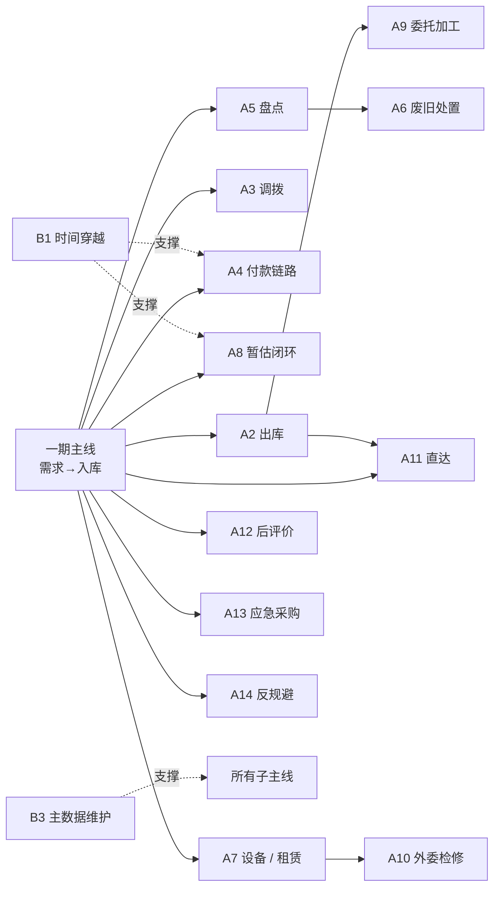

# 档 A 二期扩展规划（V0.2）

**版本：** V0.2
**日期：** 2026-05-10
**文档性质：** 原型设计层 · 二期扩展规划
**适用阶段：** 一期增强原型（02 文档）交付后的二期 / 三期范围治理

---

## 一、文档目的

本文档承接 [`02-档A增强原型实施方案-V0.4.md`](./02-档A增强原型实施方案-V0.4.md) 一期交付后的扩展规划，把当前调研出的 19 项未覆盖业务和基础能力按"独立子主线 + 基础能力"分组，给出优先级、依赖关系、工作量预估和启动条件。

本文档重点回答：

- 一期之后还有哪些业务 / 能力等待覆盖
- 二期 / 三期的优先级如何排
- 每条子主线的范围、涉及实体、工作量、前置依赖
- 什么条件触发二期启动（不主动推进，等业务方反馈或外部触发）
- 如何避免"二期一次做完"陷入工期失控

本文档**不**做以下事：

- 不替代 02 一期方案（一期严守 5-6 周范围）
- 不固化二期具体启动时点（按业务方反馈和一期演示效果决定）
- 不替代正式系统开发（仍是 mock 性质，档 A 路线）
- 不绑定具体技术方案（按一期框架延续）

---

## 二、二期定位

二期是对一期"采购入库主线 + 治理能力"的**横向扩展**：

- 不改变 02 V0.4 已固化的技术栈、4 层架构、演示边界
- 在一期框架基础上加新的业务子主线和基础能力
- 每条子主线独立挂账，可单独排期，不绑定批量上线
- 工作量按"多数子主线 0.5-2 周、A4 付款链路 2.5-3 周 + 每项基础能力 0.5-1 周"模块化估算

**核心原则**：一期完成后**不主动推进二期**，等业务方反馈或外部触发后按需启动；避免一次做完陷入工期失控。

---

## 三、范围（19 项）

按"独立子主线"和"基础能力"两大类分组：

### 3.1 独立子主线（13 条，多数 0.5-2 周）

| # | 子主线 | 涉及实体 | 工作量 | 演示价值 |
| --- | --- | --- | --- | --- |
| **A2** | 出库主线 | S-08 / S-09 + S-13 + S-21 + 成本中心归集 + BIZ-005/005A 凭证 | 1 周 | 演示成本归集 + 移动平均出库成本 + 对厂矿销售出库 |
| **A3** | 调拨主线 | S-11 / S-12 + 跨组织调拨 + S-21 + BIZ-007 内部往来对冲 | 1 周 | 演示跨组织调拨 + NC 内部往来 |
| **A4** | 合同付款链路 | **A4a**：C-04 合同付款节点（合同条款层）/ C-07 付款计划（计划生成层）/ WF-PAY-001 月度集体决议；**A4b**：C-08 付款申请 / C-10 付款执行 + BIZ-014/015/020 + 三单匹配 + NC 实付回写 | **2.5-3 周** | 分两段演示四层付款控制（C-04→C-07 → C-08→C-10）+ 集体决议 + 三单匹配 + 应付消减 + 实付回写 |
| **A5** | 盘点主线 | S-15 / S-16 / S-17 / S-18 + BIZ-008/009 + 盘亏审批 | 1 周 | 演示盘盈盘亏审批 + 库存调整 |
| **A6** | 废旧处置 | S-19 / S-20 + BIZ-010/011/012 + 高敏感审批 | 1 周 | 演示报废 / 回收 / 变卖 / 销毁四类处置路径 |
| **A7** | 设备 / 设备租赁 | E-01-E-14（14 张表）+ 租赁费用汇总 BIZ-019 + WF-RPR-001 | **2 周** | 演示设备全生命周期 + 租赁起 / 续 / 停 / 退 |
| **A8** | 暂估闭环联动 | S-07 + 6 个月窗口 + D-90 / D-30 / D-0 / D+30 四阶段预警、阻断、专项对账 + BIZ-002/BIZ-003 冲销闭环 | 1 周 | 静态页 `tentative-estimate.html` 已有，二期先补数据生成，再补预警与冲销联动 |
| **A9** | 委托加工 | 扩展单据 + 受托虚拟仓 + 标准损耗率 + 三方联合验收 + BIZ-019 | 1.5 周 | 演示虚拟仓 + 损耗率 + 加工费成本归集 |
| **A10** | 外委检修 | E-05 检修 + 40% 原值上限 + WF-RPR-001 + WF-CON-OVERLIMIT-001 + SENS-CON-004 | 1 周 | 演示外委检修审批分档 + 价格上限校验 + 月度上报 |
| **A11** | 直达使用单位 | S-05 直达入库 + 即时销售出库（BIZ-005A 已有）+ 直达验收角色 + 不沉淀库存余额 | 1 周 | 演示直达不进库存 + 厂矿验收 |
| **A12** | 后评价反馈 | 4 类反馈（供应商 / 产品质量 / 售后 / 防爆煤安）+ 自动联动供应商分类 + WF-SUP-REASSESS-001 | 1 周 | 演示反馈 → 自动重评估 |
| **A13** | 应急采购 | is_emergency=true + 3 工作日补办 + 100% 准确率 + WF-PUR-EMERGENCY-001 | 0.5 周 | 演示应急路径 + 补办时限 |
| **A14** | 化整为零反规避 | ALR-PUR-SPLIT-001 检测 + 30 天累计申请检测 | 0.5 周 | 演示反规避自动检测 |

**独立子主线小计**：13 条，按 A4/A8 修正后约 **15-17 周（视并行度可压缩）**。

### 3.2 基础能力（6 项，每项 0.5-1 周）

| # | 基础能力 | 工作量 | 价值 |
| --- | --- | --- | --- |
| **B1** | 时间穿越（mock 系统时间） | 0.5 周 | 一次性演示月结 / 暂估 D-90 / D-30 / D-0 / D+30 / 提前期等"多日才出现"场景 |
| **B2** | 数据导入导出（JSON）| 0.5 周 | 跨设备演示用；可保存"演示快照" |
| **B3** | 主数据维护（M-04 / M-05 / M-09 增删改）| 1 周 | 演示物料 / 供应商 / 分类的管理流程 |
| **B4** | 三对一致定期对账演示（INV_RECON_TRIPLE_CONSISTENCY）| 0.5 周 | 演示账实对账自动任务 + 差异预警 |
| **B5** | AI Tool 调用样板 | 1 周 | 演示 8 类 Tool 中 1-2 个的调用流程（如库存查询）+ 权限脱敏 |
| **B6** | 演示数据快照（保存 / 还原）| 0.5 周 | 同 B2，但更系统化（按场景命名快照）|

**基础能力小计**：6 项 × 平均 0.7 周 = **约 4-5 周**。

### 3.3 总工作量

13 条子主线 + 6 项基础能力，总计 **约 19-22 周**（顺序做）。如果业务方一次只关心 2-3 条主线，每批约 2-6 周就能交付一组。

---

## 四、优先级与排期建议

不建议一次做完，按"业务方关心度 + 演示价值 + 依赖度"分三档：

### 4.1 二期 P0（强烈推荐，5-6 周）

业务方一定问 + 一期演示后必然延伸的方向：

| 优先级 | 项 | 理由 |
| --- | --- | --- |
| 1 | **A4 合同付款链路** | 一期只到入库挂应付，业务方必问"那钱怎么出"；月度集体决议是详设 10 V1.2 的核心成果，必须演示 |
| 2 | **A2 出库主线** | 一期只到入库，业务方必问"那物资怎么领出去用"；演示成本归集 + 移动平均出库成本 |
| 3 | **A8 暂估闭环联动** | 一期已有静态页；二期 A8 启动时先补 S-07 / BIZ-002 / BIZ-003 数据生成，再演示四阶段超期提醒、阻断和冲销闭环 |
| 4 | **B1 时间穿越** | 没有时间穿越就演示不了"暂估 6 个月窗口、D-90 / D-30 / D-0 / D+30"等场景；本质上是必备工具 |
| 5 | **A14 化整为零反规避** | 一期已加 ALR-PUR-SPLIT-001，但没有自动检测演示；价值高且工作量低 |

**P0 小计**：约 5-6 周。

### 4.2 二期 P1（推荐，4-5 周）

按业务方反馈决定是否做：

| 优先级 | 项 | 理由 |
| --- | --- | --- |
| 6 | **A3 调拨主线** | 跨组织 + 内部往来对冲，演示跨域联动；如果业务方关心多矿协同就做 |
| 7 | **A5 盘点主线** | 盘盈盘亏审批是经典场景，演示价值高 |
| 8 | **A12 后评价反馈** | 自动联动供应商分类，是 04 详设 §4.1.4 的亮点 |
| 9 | **B3 主数据维护** | 真实演示需要主数据增删改入口，否则只能 mock 预填 |

**P1 小计**：约 4-5 周。

### 4.3 二期 P2（可选，6-7 周）

按业务方反馈和资源决定，按需启动：

| 优先级 | 项 | 理由 |
| --- | --- | --- |
| 10 | **A6 废旧处置** | 四类处置 + 高敏感审批，但不是核心闭环 |
| 11 | **A7 设备 / 设备租赁** | 工作量大（2 周）+ 详设 07 已含完整字段；按业务方对设备管理关心度决定 |
| 12 | **A9 委托加工** | 详设有但是次要业务 |
| 13 | **A10 外委检修** | 与 A7 联动，可一起做 |
| 14 | **A11 直达使用单位** | 与 A2 出库相关，可一起做 |
| 15 | **A13 应急采购** | 0.5 周低成本但场景独立 |
| 16 | **B2/B4/B5/B6** 基础能力 | 按需补 |

**P2 小计**：约 6-7 周。

---

## 五、依赖关系

部分子主线之间有依赖，启动顺序需注意：

**关键依赖**：

- A2 / A3 / A4 / A8 / A12 / A13 / A14 都直接依赖一期主线（不依赖其他二期项）
- A5 → A6（盘亏 → 废旧）
- A7 → A10（设备 → 外委检修）
- A2 → A11（出库 → 直达）
- A2 → A9（出库 → 委托加工）
- B1 / B3 是基础能力，支撑多条子主线

---

## 六、决策点

二期启动需先回答以下问题：

| 决策点 | 触发时机 | 决策方 |
| --- | --- | --- |
| **是否启动二期？** | 一期演示完成、业务方反馈收齐 | 项目领导小组 |
| **本批做哪几项？** | 二期启动后每批排期 | 业务方 + 项目联系人 |
| **二期算正式系统的一部分还是仍是原型？** | 二期启动前 | 项目领导小组（路线 X：仍走档 A 原型 / 路线 Y：升档 B MVP / 路线 Z：直接 C 正式开发） |
| **资源投入？** | 二期启动前 | 项目领导小组（1 人 / 2 人团队、是否外包）|

**默认假设**（如无反馈）：

- 一期交付后**等业务方反馈 2-4 周**，再决定是否启动二期
- 二期分批，每批 4-6 周，按 P0 → P1 → P2 顺序
- 仍走档 A 原型路线（不升 MVP / 不进正式开发）

---

## 七、启动二期的 4 个触发条件

不主动推进，等以下条件触发：

1. **业务方反馈**：业务方在一期演示后明确提出"这条主线（如付款）也想看"
2. **领导汇报**：项目领导小组安排扩大演示范围（如向集团领导汇报）
3. **中标供应商需要**：供应商需要更广的业务场景才能做技术方案
4. **培训需求**：业务方培训需要覆盖更多场景

---

## 八、风险与边界

### 8.1 已知风险

| 风险 | 缓解措施 |
| --- | --- |
| 二期范围膨胀，工期失控 | 严格按 P0 / P1 / P2 三档分批；每批不超 6 周 |
| 详设 V1.x 在二期期间继续演化，原型与详设漂移 | 二期每批启动前对照详设最新版本核查口径变化 |
| 二期与一期数据兼容性 | 每批二期启动时检查 LocalStorage schema 是否需要迁移 |
| 业务方一次要太多 | 启动前明确"每批不超 4 项"硬规则 |

### 8.2 不在档 A 范围内（明确不做）

- 真实多用户 / 真实并发（仍是单机演示）
- 真实权限 / 真实 SSO
- 真实 NC / Nova / 招采平台集成
- 性能 / 信创 / 安全合规
- 移动端响应式 / 国际化

如需以上，应升级到档 B（MVP）或档 C（正式开发），不在本规划范围。

---

## 九、版本与维护

| 版本 | 日期 | 主要变化 |
| --- | --- | --- |
| V0.1 | 2026-05-10 | 二期扩展规划首版：13 条子主线 + 6 项基础能力 + 三档优先级 + 依赖关系 + 4 个启动触发条件 |
| V0.2 | 2026-05-10 | 按评审修正：承接 02 V0.4；A8 暂估升级为 D-90 / D-30 / D-0 / D+30 四阶段 + BIZ-002/BIZ-003 冲销闭环；删除"一期主线产生暂估数据"误导表述；A4 合同付款链路拆为 A4a/A4b，工作量由 1.5 周修正为 2.5-3 周；P0 小计修正为 5-6 周；总工作量修正为 19-22 周。**V0.2 内修订（2026-05-10 后续评审）**：修正 A4a 实体名错位 — 原"C-04 付款计划 / C-07 付款申请"与详设 01 V1.0 标准不一致（详设 01 line 309-315 / 838-839 明确：C-04 = 合同付款节点 / C-07 = 付款计划 / C-08 = 付款申请 / C-10 = 付款执行）。修正后 A4a 含 C-04 合同付款节点 + C-07 付款计划 + WF-PAY-001 月度集体决议（详设 05 §8.2 四层付款控制链路前两层）；A4b 含 C-08 付款申请 + C-10 付款执行 + BIZ-014/015/020 + 三单匹配 + NC 实付回写（后两层）。 |

后续维护规则：

- 每次二期启动一批后，本文档对应项标"已落"或"已规划 - 待启动"
- 出现新业务场景需要扩展时，先评估归入二期 P0/P1/P2 哪一档，再加入本文档
- 不在 docs/原型设计/ 之外引用本文档（本文档是档 A 内部规划，不参与正式详设流程）

---

## 十、一句话结论

档 A 二期扩展规划把一期未覆盖的 19 项业务 / 能力按"独立子主线 + 基础能力"分类、按 P0 / P1 / P2 三档排优先级、按依赖关系组织排期，**不主动推进**，等业务方反馈或外部触发后按需启动；每批不超过 4 项 / 6 周，避免范围爆炸；二期仍走档 A 原型路线，如需升级到正式系统应另起档 B / C 决策。
