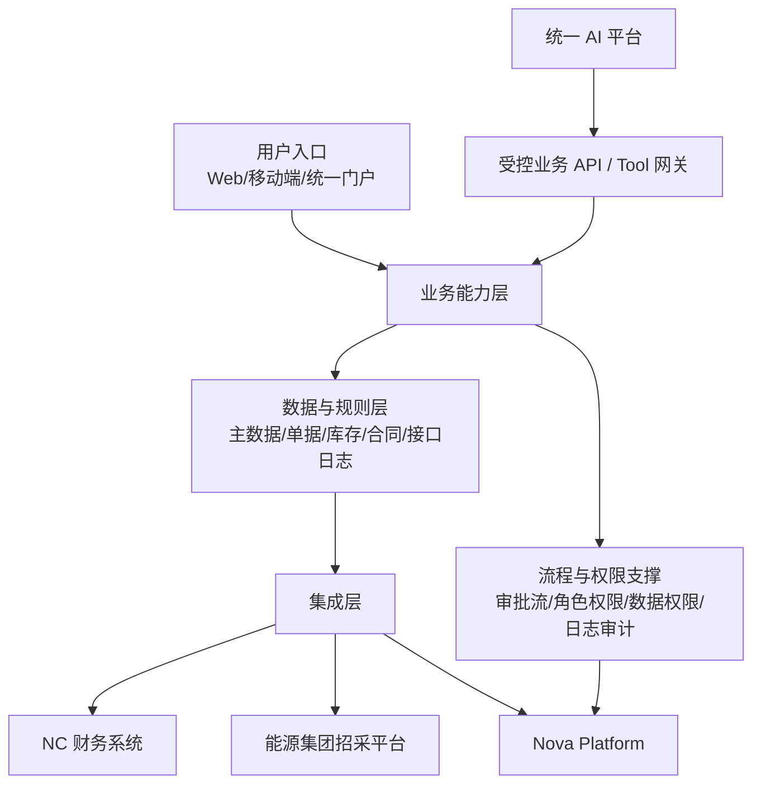
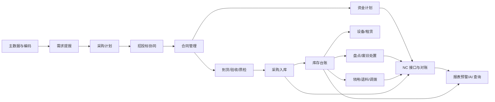

# 物资供应管理系统概要设计总览（V0.1）

**版本：** V0.1
**日期：** 2026-04-24
**编制依据：** 需求梳理 V1.0、招标文件 V1.1、集团统一建设原则 V2.0、详细规则文档
**文档性质：** 概要设计阶段总览与边界控制文件

---

## 一、文档目的

本文档用于承接前期需求梳理和招标 V1.1 成果，形成物资供应管理系统概要设计阶段的总体框架。

本文档重点回答：

- 系统总体边界是什么
- 一期系统由哪些能力域和模块组成
- 业务、数据、接口、权限和部署之间如何组织
- 哪些内容属于概要设计阶段应明确的事项
- 哪些内容应留到详细设计、实施配置或联调阶段进一步确定

本文档不是详细设计文档，不直接固化数据库表结构、接口字段、页面原型和审批流最终配置。

### 1.1 文档权威边界

概要设计分卷允许保留必要上下文，但应避免多处维护同一细节。各专题的权威边界如下：

| 主题 | 权威文档 | 其他文档处理方式 |
| --- | --- | --- |
| 总体边界、设计输入、分卷顺序 | `00-概要设计总览-v0.1.md` | 其他文档只引用，不重复展开 |
| 总体架构、部署、外部系统集成 | `01-总体架构与集成边界-v0.1.md` | 总览只保留边界摘要 |
| 一期 15 个业务模块职责 | `02-业务模块概要设计-v0.1.md` | 总览只做能力域归并 |
| 主数据、编码、权威来源、NC 映射 | `03-主数据与编码概要设计-v0.1.md` | 模块文档只说明职责，不展开编码细则 |
| 权限、审批、审计 | `04-权限审批与审计概要设计-v0.1.md` | 总览只保留总体原则 |
| NC 接口、状态、对账、封账 | `05-NC接口与对账概要设计-v0.1.md` | 总览只保留架构和范围口径 |

---

## 二、设计输入

概要设计以现有文档体系为输入，按以下优先级理解和使用。

| 层级 | 主要文档 | 对概要设计的作用 |
| --- | --- | --- |
| 集团统筹层 | `docs/集团统筹/集团业务系统统一建设原则-V2.0.md` | 约束统一权限、SSO、平台 API、独立数据库、AI 入口、信创和运维审计要求 |
| 招标正式文本 | `docs/招标/物资供应管理系统招标技术要求-v1.1.md` 及附件一至附件六 | 作为一期外部约束和设计范围基准 |
| 项目主文档层 | `docs/需求梳理/01~11` 系列文档 | 提供项目背景、模块边界、流程单据、权限矩阵、实施路径和二期边界 |
| 详细规则层 | `docs/详细规则/物资编码规范文档.md`、`docs/详细规则/物资管理与财务接口规范.md` | 支撑主数据、编码、NC 映射、凭证规则、对账和联调设计 |
| 专项能力层 | `docs/集团统筹/AI接入专题/物资管理系统/` | 支撑统一 AI 入口能力开放和 Tool 化接口设计 |

---

## 三、概要设计阶段边界

### 3.1 本阶段应明确

- 系统总体架构与部署边界
- 一期模块划分和模块间关系
- 核心业务主线和关键状态流转
- 主数据、业务单据、接口日志、审计留痕等数据域划分
- 与 Nova Platform、NC 财务系统、能源集团招采平台、统一 AI 平台的集成边界
- 权限、审批、数据隔离、日志审计的总体模型
- 信创数据库、私有化部署、接口规范和运维监控的总体要求

### 3.2 本阶段不固化

- 最终数据库物理表结构和字段类型
- 全量接口字段、报文枚举和错误码
- 页面原型、菜单层级和交互细节
- 审批流每个节点的最终人员配置
- 计量单位字典维护责任人清单
- 集团组织与 NC 核算组织的最终映射台账
- PDF、zip 等发标包交付形态

---

## 四、系统定位与边界

物资供应管理系统定位为集团物资业务平台，核心是以物资实物流转为主线，支撑需求计划、招投标协同、采购合同、入库出库、设备与设备租赁、资金计划、供应商、财务接口、报表预警和 AI 能力开放。

系统必须明确以下边界：

| 外部系统/平台 | 本系统边界 |
| --- | --- |
| Nova Platform | 使用其统一身份、组织、人员、权限和平台公共能力；本系统独立部署业务数据库，不与平台共库 |
| NC 财务系统 | 本系统产生业务事实、接口状态和对账依据；NC 负责财务凭证、应付核算、实付款和总账处理 |
| 能源集团招采平台 | 本系统负责采购文件生成、导出/上传、结果导入和归档；公告、投标、开标、评标等过程以招采平台为主 |
| 统一 AI 平台 | 本系统开放受控业务接口和 Tool 能力；AI 平台不得直接访问本系统底层数据库 |
| 后续资产系统或集团统一编码体系 | 一期预留关联字段、映射关系和扩展接口，不要求一期直接替代或全面落地 |

---

## 五、总体架构

系统概要架构建议按“入口层、业务能力层、数据与规则层、集成层、支撑层”组织。

### 5.1 入口层

- 业务人员通过 Web 或移动端办理需求提报、审批、入库、出库、盘点、处置等业务。
- 管理人员通过报表、预警和追溯查询查看集团、矿厂、仓库、供应商和合同维度数据。
- 统一 AI 平台通过受控 API 和 Tool 调用查询能力，不直接访问数据库。

### 5.2 业务能力层

业务能力层承载一期 15 个模块，重点保证“计划到合同、合同到库存、库存到财务、财务到对账”的闭环。

### 5.3 数据与规则层

数据与规则层统一管理主数据、业务单据、库存台账、设备台账、合同台账、接口日志、对账记录、审批意见和操作日志。

### 5.4 集成层

集成层统一采用 API + JSON 作为对外正式集成标准，内部可采用异步机制实现削峰、重试和解耦，但不改变对外接口标准。

### 5.5 支撑层

支撑层包括统一身份接入、角色权限、组织数据同步、审批流配置、参数配置、日志审计、运行监控和告警。

---

## 六、一期模块分组

一期 15 个模块在概要设计中建议按能力域归并，便于后续分卷编写。
本节只说明能力域归并，模块职责、上下游、关键对象和状态控制以 `02-业务模块概要设计-v0.1.md` 为准。

| 能力域 | 对应模块 | 概要设计关注点 |
| --- | --- | --- |
| 基础底座 | 基础档案与组织仓库管理、物料主数据与编码管理、系统管理与基础支撑 | 组织、仓库、物料、供应商、成本中心、计量单位、权限、流程、日志、参数 |
| 计划与采购协同 | 需求提报与采购计划管理、招投标管理、供应商管理 | 需求来源、计划审批、采购方式分流、招采平台协同、供应商准入和结果回传 |
| 合同与资金 | 合同管理、资金计划管理 | 合同审批、付款条款、付款计划、月度预支付、付款进度、NC 实付回写 |
| 库存实物流转 | 采购到货与入库管理、库存领用与退料调拨管理、盘点与废旧处置管理 | 入库、质检、出库、退料、调拨、盘点、废旧处置、账实一致 |
| 设备与租赁 | 设备管理、设备租赁管理 | 设备台账、权属、状态、调拨、检修、报废、租赁计费、费用汇总 |
| 业财与管理分析 | 财务与NC接口管理、报表预警与查询分析、AI 能力开放 | NC 接口、状态回执、幂等、对账、报表、预警、Tool 化查询 |

---

## 七、核心业务主线

一期系统核心业务主线如下：

核心设计原则：

- 所有业务单据必须能够追溯到来源、审批、执行和接口状态。
- 库存变化必须由合法业务单据驱动。
- 财务接口必须以审核通过后的业务事实为依据。
- 已结账期间的业务调整必须走受控补录、反结或冲销流程。
- 查询、报表和 AI 能力必须遵守同一套权限和数据边界。

---

## 八、核心数据域

概要设计阶段建议先按数据域组织，不急于固化物理表。
本节只说明数据域边界；主数据细化以 `03-主数据与编码概要设计-v0.1.md` 为准，NC 接口细化以 `05-NC接口与对账概要设计-v0.1.md` 为准。

| 数据域 | 主要对象 |
| --- | --- |
| 主数据域 | 组织、仓库、库区货位、物料分类、物料主数据、计量单位、供应商、成本中心、NC 存货映射 |
| 采购计划域 | 需求提报、需求汇总、采购计划、计划调整、计划外紧急采购、新品计划 |
| 招采协同域 | 招标申请、采购方式、标包、采购文件、招采平台回传结果、评标报告附件 |
| 合同资金域 | 合同、合同条款、付款节点、付款计划、付款申请、付款状态、实付回写 |
| 库存单据域 | 到货单、验收单、质检单、入库单、退货单、领料单、退料单、调拨单、盘点单、处置单 |
| 设备租赁域 | 设备台账、设备状态、权属变更、维修保养、报废处置、租赁合同、起租、停租、退租、租赁费用 |
| 财务接口域 | 接口任务、接口报文、接口回执、推送状态、幂等键、错误日志、重推记录、对账记录 |
| 权限审计域 | 用户、角色、岗位、数据权限、审批实例、审批意见、操作日志、登录日志 |
| 报表分析域 | 库存余额、收发存、暂估未冲销、接口失败、呆滞库存、低库存、合同风险、供应商履约 |

---

## 九、集成边界概要

本节只保留集成对象和职责边界，详细接口治理以 `01-总体架构与集成边界-v0.1.md` 和 `05-NC接口与对账概要设计-v0.1.md` 为准。

| 集成对象 | 总览边界 |
| --- | --- |
| Nova Platform | 负责统一身份、组织、人员等公共能力；物资系统通过 API 获取并保存业务副本，不与平台共库 |
| NC 财务系统 | 负责凭证、应付、实付和总账；物资系统负责业务事实、接口任务、回执状态和对账依据 |
| 能源集团招采平台 | 负责公告、投标、开标、评标和公示；物资系统负责采购文件协同、结果归档和合同联动 |
| 统一 AI 平台 | 作为统一 AI 入口；物资系统开放受控查询和分析 Tool，不允许 AI 直接访问底层数据库 |

---

## 十、权限与审批概要

权限设计建议分为四层：

| 层级 | 说明 |
| --- | --- |
| 身份认证 | 统一接入 SSO，身份来源以集团统一平台为准 |
| 功能权限 | 控制菜单、按钮、导入导出、审批、重推、反结等操作能力 |
| 数据权限 | 按集团、矿厂、仓库、使用单位、业务角色控制可见范围 |
| 审计权限 | 高敏感操作必须记录操作人、时间、前后值、审批意见和来源单据 |

高敏感场景包括火工品、危险品、盘亏、报废、销毁、月结、反结、补录、接口重推、黑名单解除和合同变更。

---

## 十一、非功能与部署概要

| 分类 | 概要要求 |
| --- | --- |
| 部署 | 私有化部署，系统独立数据库，不与集团统一平台共库 |
| 数据库 | 采用 PostgreSQL 兼容国产信创数据库，具体产品在实施阶段确定 |
| 接口 | API + JSON，优先 HTTPS，接口日志可查，异常可追溯 |
| 安全 | 统一身份认证、最小权限、敏感操作审计、数据导出留痕 |
| 性能 | 满足常规出入库、审批、查询、接口批处理和月末对账高峰 |
| 可用性 | 支持接口失败重试、人工补偿、任务监控和异常告警 |
| 可扩展 | 预留辽宁能源统一编码、招采平台深度直连、AI Tool 扩展能力 |
| 运维 | 支持操作日志、接口日志、错误日志、运行监控和巡检记录 |

---

## 十二、后续概要设计文档拆分

建议概要设计阶段按以下顺序编写：

| 顺序 | 文档 | 目标 |
| --- | --- | --- |
| 1 | `00-概要设计总览-v0.1.md` | 统一设计输入、边界、架构、模块分组和后续拆分 |
| 2 | `01-总体架构与集成边界-v0.1.md` | 细化部署架构、系统组件、外部系统对接和接口治理 |
| 3 | `02-业务模块概要设计-v0.1.md` | 按 15 个模块说明模块职责、核心流程、关键单据和边界 |
| 4 | `03-主数据与编码概要设计-v0.1.md` | 细化物料、分类、编码、供应商、组织仓库、NC 映射 |
| 5 | `04-权限审批与审计概要设计-v0.1.md` | 细化角色、功能权限、数据权限、审批流和高敏感控制 |
| 6 | `05-NC接口与对账概要设计-v0.1.md` | 细化 29 项接口、状态矩阵、幂等、重推、对账和封账 |
| 7 | `06-报表预警与AI能力概要设计-v0.1.md` | 细化报表清单、预警模型、AI Tool 清单和权限控制 |
| 8 | `07-非功能与实施约束概要设计-v0.1.md` | 细化信创、性能、安全、运维、迁移、试运行和验收支撑 |

---

## 十三、待进入详细设计前的保留事项

以下事项不阻塞概要设计，但在详细设计或实施启动前必须进一步明确：

| 事项 | 影响范围 | 建议处理时点 |
| --- | --- | --- |
| 计量单位统一字典的维护归口、变更审批和映射关系 | 主数据、NC 接口、报表 | 详细设计前完成模板确认 |
| 集团组织架构与 NC 财务核算组织映射规则 | 组织权限、财务接口、成本归集 | 详细设计前形成映射台账 |
| 具体数据库产品和 SQL 方言差异 | 表结构、索引、脚本、迁移 | 详细设计和环境准备阶段 |
| 审批流最终节点与岗位人员 | 流程配置、权限配置、上线初始化 | 实施配置阶段 |
| 报表字段口径和统计周期 | 报表、AI 查询、验收 | 原型和详细设计阶段 |
| PDF/zip 发标包交付形态 | 招标交付物 | 管理层封版决策后处理 |

---

## 十四、一句话结论

当前文档体系已具备进入概要设计阶段的条件。概要设计应先固化总体架构、模块边界、数据主线、集成边界和权限审计模型，再逐步下钻到业务模块、接口、主数据、报表和非功能专题，避免过早锁死详细表结构和页面原型。
