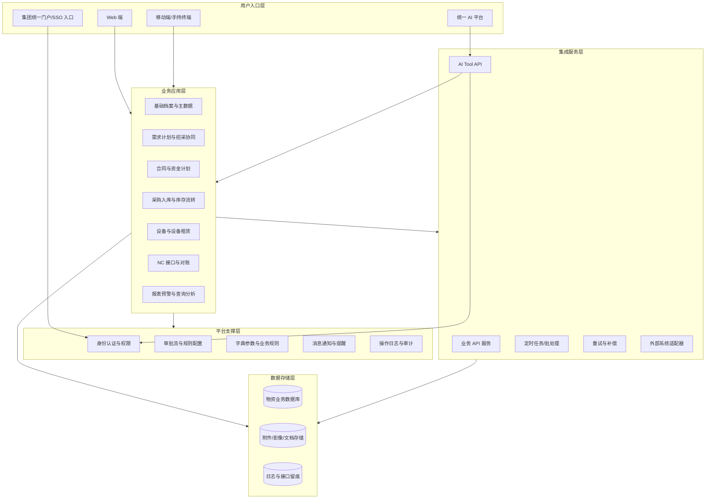
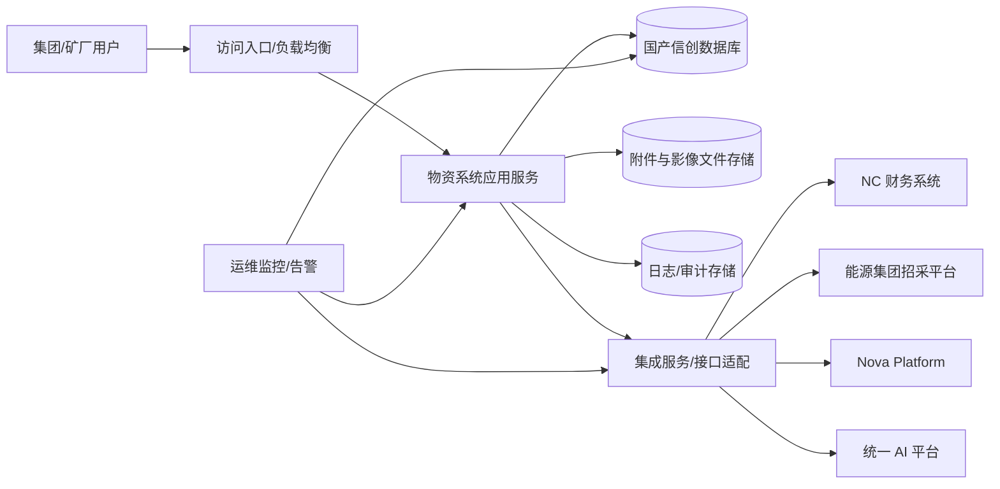
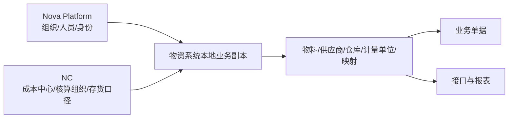
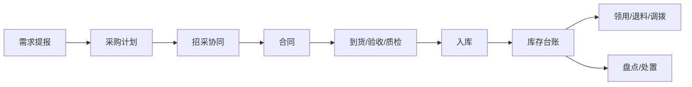
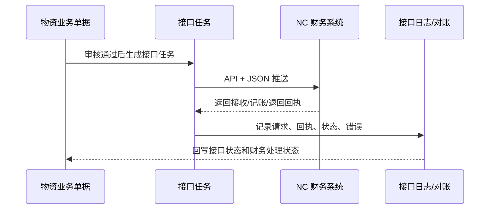
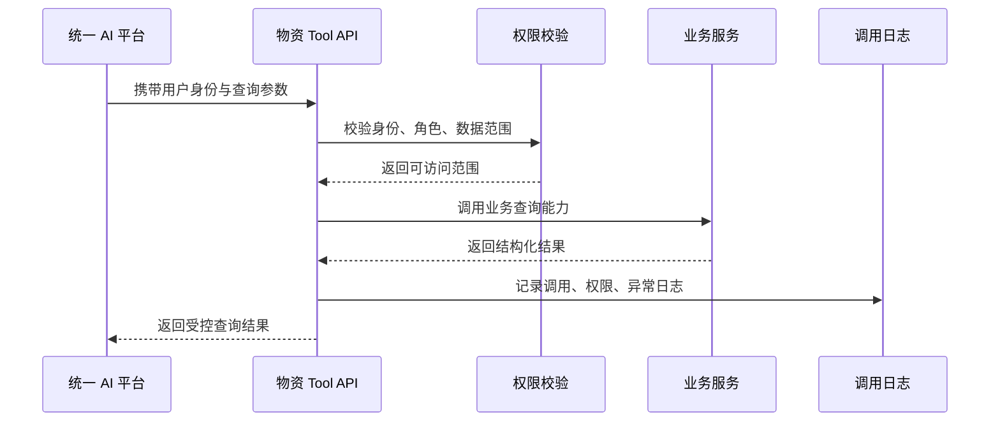

# 总体架构与集成边界概要设计（V0.1）

**版本：** V0.1
**日期：** 2026-04-24
**上位文档：** `00-概要设计总览-v0.1.md`
**文档性质：** 概要设计专题文档

---

## 一、文档目的

本文档用于细化物资供应管理系统的一期总体架构、部署边界、系统组件和外部集成关系。

本文档重点回答：

- 系统按哪些逻辑组件组织
- 系统如何私有化部署、如何与集团统一平台低耦合集成
- 与 Nova Platform、NC 财务系统、能源集团招采平台、统一 AI 平台的职责边界是什么
- API、日志、鉴权、幂等、异常和对账应如何治理
- 哪些架构事项必须在概要设计阶段确定，哪些留到详细设计或联调阶段

---

## 二、设计原则

### 2.1 独立部署、低耦合集成

物资供应管理系统应独立部署应用服务和业务数据库，不与 Nova Platform 或其他集团平台共用数据库实例。

系统通过标准 API 获取集团统一身份、组织、人员、权限等公共能力，避免直接访问平台底层库。

### 2.2 业务闭环优先

架构设计应优先保证从需求提报、采购计划、招投标协同、合同、入库、库存流转、资金计划到 NC 财务接口和对账的闭环稳定运行。

### 2.3 数据受控、接口留痕

所有跨系统数据交换都应通过受控接口完成。接口调用、权限校验、失败重推、回执处理和人工干预必须可查询、可追溯、可审计。

### 2.4 统一身份、统一权限

用户身份和组织人员数据以集团统一平台为上位来源；物资系统保留本地业务角色、数据权限、审批规则和业务副本，用于本系统业务控制。

### 2.5 AI 能力纳入主架构

统一 AI 平台调用物资系统能力时，只能通过受控业务 API 和 Tool 能力访问，不能直接连接物资系统数据库。

### 2.6 信创适配和可迁移

系统应满足国产操作系统、国产数据库和私有化部署要求。数据库优先按 PostgreSQL 兼容国产信创数据库设计，具体产品差异在详细设计和实施环境阶段处理。

---

## 三、总体逻辑架构

系统逻辑架构建议划分为用户入口层、业务应用层、平台支撑层、数据存储层、集成服务层和运维审计层。

---

## 四、部署架构概要

一期建议采用私有化部署，按应用服务、数据库、文件存储、接口服务和运维监控进行分层。

### 4.1 应用服务

- 承载业务模块、审批、查询、报表、接口管理和系统支撑能力。
- 支持 Web 和移动端访问。
- 支持后续按业务量拆分服务或模块，但一期概要设计不强制微服务化。

### 4.2 数据库

- 独立部署物资系统业务数据库。
- 不与 Nova Platform、NC 或招采平台共库。
- 数据库产品按 PostgreSQL 兼容国产信创数据库方向设计。
- SQL 方言、分区、索引、序列、JSON 字段等细节在详细设计阶段结合最终产品确定。

### 4.3 文件与影像存储

- 存储合同附件、采购文件、验收照片、质检资料、招评标结果材料、供应商资质、设备资料等。
- 文件对象应与业务单据建立关联关系。
- 重要附件应保留上传人、上传时间、来源单据、文件类型和版本信息。

### 4.4 日志与审计

- 至少覆盖登录日志、业务操作日志、审批流转日志、接口调用日志、异常日志、导出日志和 AI 调用日志。
- 高敏感操作应记录操作前后值、审批意见和来源单据。
- 日志保留周期和归档策略在详细设计阶段按集团运维要求细化。

### 4.5 运维监控

- 监控应用可用性、数据库连接、接口成功率、失败重推、定时任务、磁盘容量和关键错误。
- 失败达阈值时应触发告警，推送给运维和业务责任人。

---

## 五、核心组件划分

| 组件      | 主要职责                           | 备注                          |
| ------- | ------------------------------ | --------------------------- |
| 业务应用组件  | 承载 15 个一期业务模块                  | 重点保障库存实物流转和业财协同闭环           |
| 主数据组件   | 管理组织、仓库、物料、供应商、计量单位、成本中心、NC 映射 | 与编码规则、NC 映射和权限范围强关联         |
| 流程审批组件  | 管理业务审批、合同会签、盘亏报废、反结补录等流程       | 一期可采用配置化审批能力，不要求建设大型 BPM 平台 |
| 权限组件    | 管理角色、功能权限、数据权限、高敏感操作控制         | 身份来源对接 Nova，本地保留业务权限模型      |
| 接口适配组件  | 管理 NC、Nova、招采平台、AI 平台接口        | API + JSON 为正式集成标准          |
| 任务与补偿组件 | 管理定时对账、月末暂估、接口重试、失败补偿          | 需要可监控、可暂停、可重推               |
| 报表查询组件  | 提供库存、收发存、合同、接口、预警、追溯查询         | 支持多维查询和导出留痕                 |
| 日志审计组件  | 统一记录操作、审批、接口、导出和 AI 调用日志       | 支撑审计、追责和问题复盘                |

---

## 六、外部系统集成边界

本章是外部系统职责边界和接口治理的权威章节。主数据对象、编码和 NC 存货映射细则以 `03-主数据与编码概要设计-v0.1.md` 为准；业务模块职责以 `02-业务模块概要设计-v0.1.md` 为准；接口字段、报文、对账和封账细节以 `05-NC接口与对账概要设计-v0.1.md` 为准。

### 6.1 Nova Platform

**定位：** 集团统一公共服务平台，提供统一身份、组织、人员、权限和公共服务能力。

**物资系统使用内容：**

- SSO 单点登录
- 组织架构和人员基础数据
- 岗位或角色基础信息
- 数据权限上位范围
- 统一 API 网关或平台 API 规范

**边界约束：**

- 物资系统不直接访问 Nova 底层数据库。
- 物资系统可维护本地业务角色和权限配置。
- 组织、人员数据可在本地保存业务副本，用于历史单据、审批记录和数据权限判断。
- 当 Nova 组织人员变更后，物资系统应通过同步或接口查询方式更新本地副本。

**概要设计关注点：**

| 事项   | 概要要求                       |
| ---- | -------------------------- |
| 登录   | 支持 SSO，避免独立认证体系割裂          |
| 组织人员 | 以 Nova 为权威来源，本地保存业务副本      |
| 数据权限 | 结合 Nova 组织范围与物资系统仓库、业务角色配置 |
| 审批   | 可与集团审批体系兼容，具体流程节点在实施阶段配置   |
| 审计   | 登录、授权、权限变更和关键访问须留痕         |

### 6.2 NC 财务系统

**定位：** 财务核算、应付处理、凭证、实际付款和总账系统。

**物资系统职责：**

- 维护业务事实和业务单据。
- 形成主数据映射、业务触发、接口任务、接口报文和推送状态。
- 接收 NC 回执、凭证号、错误信息和实际付款结果。
- 输出对账结果和异常台账。

**NC 职责：**

- 管理财务核算规则和凭证处理。
- 返回凭证、回执、错误信息、付款执行结果。
- 配合主数据映射、成本中心、财务组织、科目等规则确认。

**一期接口范围：**

| 类别     | 数量   | 说明                              |
| ------ | ---- | ------------------------------- |
| 主数据同步  | 5 项  | 物料映射、停用通知、计量单位、成本中心、财务组织对照      |
| 业务单据推送 | 19 项 | 采购、领料、调拨、盘点、废旧、预付款、暂估、委托加工等     |
| 对账与监控  | 5 项  | 日对账、周库存余额、月末全量对账、接口状态查询、映射完整性检查 |

**接口治理要求：**

- 正式集成标准为 API + JSON。
- 内部可以采用消息队列、任务队列或异步任务实现削峰和重试。
- 幂等键采用 `interfaceId + sourceBillNo + orgCode` 组合，并在详细设计阶段结合期间、业务类型进一步明确。
- 接口状态、业务状态、财务处理状态、期间状态必须分层管理。
- 失败接口必须支持自动重试、人工重推、异常台账和告警。

### 6.3 能源集团招采平台

**定位：** 招标公告、投标、开标、评标、结果公示等招评标过程平台。

**物资系统职责：**

- 从采购计划生成招标申请和采购文件。
- 支持采购文件导出或按条件上传。
- 接收或归档评标报告、结果公示、中标/成交结果等材料。
- 将中标/成交结果联动到合同管理和供应商管理。

**边界约束：**

- 一期不替代能源集团招采平台的招评标过程。
- 一期以导出/上传、结果导入、附件归档为主。
- 自动直连、流程穿透、结果结构化同步可作为二期增强。

### 6.4 统一 AI 平台

**定位：** 集团统一 AI 入口和智能助理平台。

**物资系统职责：**

- 开放库存、出入库、采购到货、供应商、消耗分析、预警识别、合同付款、设备租赁等查询能力。
- 将能力封装为受控业务 API 或 Tool API。
- 执行身份识别、权限校验、参数校验、调用日志和异常日志。

**边界约束：**

- 不建设独立 AI 门户或独立智能问答入口。
- AI 平台不得直接访问物资系统底层数据库。
- AI 查询结果不得突破用户在物资系统中的数据权限。
- 高风险写操作、审批、数据变更不作为一期 AI 自动执行范围。

---

## 七、接口治理模型

### 7.1 接口分层

| 层级     | 说明                           |
| ------ | ---------------------------- |
| 业务 API | 面向前端、移动端、AI Tool 和外部系统提供业务能力 |
| 集成 API | 面向 NC、Nova、招采平台等系统交换数据       |
| 任务 API | 面向定时任务、批处理、对账、重试和补偿          |
| 管理 API | 面向运维、监控、日志查询、接口状态管理          |

### 7.2 接口统一要求

- 对外正式接口采用 API + JSON。
- 优先使用 HTTPS。
- 请求和响应须包含业务标识、来源系统、组织编码、单据编号、操作时间和请求流水号。
- 接口必须有明确版本号、调用方、鉴权方式、失败处理和幂等策略。
- 接口日志应能够按接口 ID、来源单号、组织、状态、时间范围查询。

### 7.3 状态治理

接口状态不能混同业务状态、财务状态和期间状态。概要设计建议按四类状态分别维护。

| 状态类型   | 示例                    | 设计意义           |
| ------ | --------------------- | -------------- |
| 业务单据状态 | 草稿、待审、已审、已作废、已冲销      | 判断业务事实是否成立     |
| 接口推送状态 | 待推送、推送中、成功、失败、已重推、已关闭 | 判断接口执行过程       |
| 财务处理状态 | 未接收、已接收、已记账、已退回、已冲销   | 判断 NC 侧处理结果    |
| 期间状态   | 未结账、已结账、已反结           | 判断是否允许补录、重推和调整 |

### 7.4 幂等与重推

- 每次接口推送应生成唯一请求流水号。
- 同一业务事实重复推送时必须可识别，不得重复生成凭证或重复执行业务。
- 报文一致的重复推送可返回幂等成功。
- 报文不一致的重复推送应进入冲突处理，不允许静默覆盖。
- 已结账期间不得通过重推规避反结和审批流程。

### 7.5 异常与补偿

| 异常类型      | 处理策略               |
| --------- | ------------------ |
| 网络超时      | 自动重试，达到阈值后告警       |
| 外部系统业务错误  | 记录错误码和错误描述，人工处理后重推 |
| 报文校验失败    | 阻断推送，提示业务或配置问题     |
| 幂等冲突      | 禁止覆盖，转人工复核         |
| NC 已接收未记账 | 进入对账异常，由财务和运维协同处理  |
| 期间已结账     | 走受控补录、反结或冲销流程      |

---

## 八、数据流与责任边界

### 8.1 主数据流

主数据设计应遵守“上位来源明确、本地副本可追溯、业务引用稳定”的原则。
本节只说明主数据在架构中的流向和责任边界，主数据范围、权威来源、编码生命周期和映射完整性控制以 `03-主数据与编码概要设计-v0.1.md` 为准。

### 8.2 业务单据流

业务单据流以审批通过和业务事实成立为财务触发基础。

### 8.3 财务接口流

### 8.4 AI 查询流

---

## 九、安全、权限与审计边界

### 9.1 安全边界

- 用户访问必须经过统一身份认证或受控登录入口。
- 外部系统调用必须经过接口鉴权。
- AI 平台调用必须携带可识别用户或服务身份。
- 数据库不向 AI 平台、招采平台或第三方系统直接开放。

### 9.2 权限边界

- 功能权限控制用户能做什么。
- 数据权限控制用户能看哪些组织、仓库、单据、供应商和报表。
- 审批权限控制用户能否审批、退回、加签、反结、重推、解除黑名单等。
- 导出权限和高敏感操作应单独控制。

### 9.3 审计边界

必须纳入审计的操作包括：

- 登录、退出、登录失败
- 物料新增、变更、停用
- 采购计划审批、调整、取消
- 合同审批、变更、终止
- 入库、出库、调拨、盘点、废旧处置
- 月结、反结、补录、冲销
- 接口推送、重推、关闭、异常处理
- 报表导出、附件下载
- AI Tool 调用

---

## 十、部署与运行约束

| 约束项  | 概要要求                         |
| ---- | ---------------------------- |
| 部署方式 | 私有化部署，不接受纯 SaaS 公有云          |
| 数据库  | 独立数据库，PostgreSQL 兼容国产信创数据库优先 |
| 操作系统 | 支持国产 Linux 环境                |
| 浏览器  | 兼容主流国产浏览器                    |
| 接口协议 | HTTP/HTTPS，优先 HTTPS          |
| 外部依赖 | 关键依赖须可管控、可审计、可持续运维           |
| 数据备份 | 支持数据库备份、附件备份和日志归档            |
| 监控告警 | 覆盖应用、接口、任务、数据库、磁盘和异常错误       |
| 运维支持 | 支持远程和现场运维，问题处理全过程留痕          |

---

## 十一、详细设计阶段需进一步明确

| 事项            | 说明                                |
| ------------- | --------------------------------- |
| 最终技术栈         | 招标不强制开发语言；详细设计阶段需结合供应商方案确定        |
| 数据库产品         | 达梦、人大金仓、瀚高等具体产品和 SQL 差异需结合实施环境确认  |
| API 网关规范      | 集团统一 API 网关由网信办提供具体联调规范           |
| SSO 协议细节      | Token、用户信息字段、组织字段、权限字段需对接 Nova 文档 |
| 组织与 NC 核算组织映射 | 需要形成初始化台账和变更维护流程                  |
| 计量单位统一字典      | 需要明确归口、字典范围、映射关系和变更审批             |
| 接口字段全集        | 本阶段明确接口范围和治理规则，字段全集在接口详细设计中固化     |
| 日志保留周期        | 结合集团运维、安全和审计制度确定                  |

---

## 十二、一句话结论

一期总体架构应坚持独立部署、统一身份、受控接口、业务闭环和日志可追溯。系统内部围绕物资实物流转组织业务能力，对外通过 API + JSON 与 Nova Platform、NC、招采平台和统一 AI 平台低耦合集成，为后续业务模块概要设计、主数据设计、权限审批设计和 NC 接口设计提供统一技术边界。