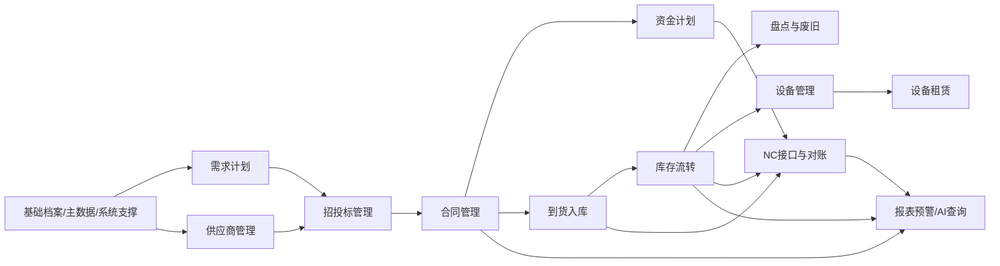

# 业务模块概要设计（V0.1）

**版本：** V0.1
**日期：** 2026-04-24
**上位文档：** `00-概要设计总览-v0.1.md`、`01-总体架构与集成边界-v0.1.md`
**文档性质：** 概要设计专题文档

---

## 一、文档目的

本文档用于对物资供应管理系统一期 15 个业务模块进行概要设计，明确各模块的职责边界、上下游关系、关键业务对象、核心状态和跨模块协同方式。

本文档重点回答：

- 一期 15 个模块分别负责什么
- 每个模块不负责什么，避免边界混乱
- 模块之间如何传递业务对象和状态
- 哪些单据会影响库存、合同、付款或财务接口
- 后续详细设计应从哪些对象、流程和状态继续下钻

本文档不直接固化页面原型、数据库表结构、接口字段和审批节点人员配置。

---

## 二、设计依据

| 文档                                   | 作用                    |
| ------------------------------------ | --------------------- |
| `docs/需求梳理/01-项目目标与范围说明-V1.0.md`     | 明确一期建设范围和系统边界         |
| `docs/需求梳理/02-业务流程与单据清单-V1.0.md`     | 明确核心流程、单据体系和库存/财务影响   |
| `docs/需求梳理/06-模块功能清单（需求沟通版）-V1.0.md` | 明确 15 个一期模块及功能范围      |
| `docs/需求梳理/07-角色权限与审批矩阵-V1.0.md`     | 明确角色、权限、审批和高敏感场景控制    |
| `docs/招标/物资供应管理系统招标技术要求-v1.1.md`     | 明确外发招标约束和供应商实施边界      |
| `docs/招标/附件二-接口清单及报文示例-v1.1.md`      | 明确 NC 接口范围、状态、幂等和对账要求 |

---

## 三、模块划分原则

### 3.1 以业务闭环划分

模块划分以“需求计划 → 招投标 → 合同 → 到货入库 → 库存流转 → 财务接口 → 报表预警”为主线，避免单纯按页面或岗位切分。

### 3.2 以主数据作为底座

组织、仓库、物料、供应商、计量单位、成本中心和 NC 映射是所有业务模块的基础。业务模块不得绕过主数据直接维护另一套基础口径。

### 3.3 以单据驱动库存和财务

库存增减、合同履约、付款计划和 NC 接口都应由合法业务单据驱动。已审核业务事实不得被随意覆盖。

### 3.4 以权限和审计贯穿全系统

每个模块都必须接入角色权限、数据权限、审批流和日志审计，尤其是月结、反结、盘亏、报废、火工品、接口重推、合同变更等高敏感场景。

### 3.5 以一期可落地为边界

一期模块设计应保证核心闭环可运行，复杂 BI、深度招采直连、复杂租赁计费、合同条款库、电子签约等可作为二期增强。

---

## 四、一期模块全景

一期 15 个模块建议按 6 个能力域组织。

| 能力域  | 模块                                         |
| ---- | ------------------------------------------ |
| 基础底座 | 1. 基础档案与组织仓库管理；2. 物料主数据与编码管理；15. 系统管理与基础支撑 |
| 计划采购 | 3. 需求提报与采购计划管理；4. 招投标管理；12. 供应商管理          |
| 合同资金 | 10. 合同管理；11. 资金计划管理                        |
| 库存业务 | 5. 采购到货与入库管理；6. 库存领用与退料调拨管理；7. 盘点与废旧处置管理   |
| 设备租赁 | 8. 设备管理；9. 设备租赁管理                          |
| 业财分析 | 13. 财务与 NC 接口管理；14. 报表预警与查询分析；统一 AI 能力开放   |

---

## 五、模块概要设计

### 5.1 基础档案与组织仓库管理

| 项目    | 设计说明                                                   |
| ----- | ------------------------------------------------------ |
| 模块定位  | 全系统基础档案底座，负责组织、仓库、库区货位、计量单位、供应商基础档案、成本中心和组织仓库关系等基础数据维护 |
| 主要职责  | 维护基础档案；支撑库存归属、数据权限、成本归集、报表维度和接口映射                      |
| 不承担职责 | 不替代 Nova Platform 的组织和人员权威来源；不承担供应商深度考评和黑名单规则的全部业务管理   |
| 上游来源  | Nova Platform 组织人员数据、NC 成本中心/核算组织口径、集团基础制度             |
| 下游使用  | 物料主数据、采购计划、库存、设备、合同、权限、报表、NC 接口                        |
| 关键对象  | 组织、仓库、库区、货位、计量单位、成本中心、使用单位、组织仓库关系                      |
| 关键控制  | 基础档案变更须留痕；影响历史业务的档案不得物理删除；组织和仓库必须支持数据权限过滤              |

概要要求：

- 本模块只定义基础档案在业务模块中的职责、输入输出和控制点。
- 组织、仓库、计量单位、成本中心和供应商档案的权威来源、维护边界、映射规则以 `03-主数据与编码概要设计-v0.1.md` 为准。
- 供应商准入、考评和黑名单的业务规则以本文件 `5.12 供应商管理` 为准，不在基础档案模块重复展开。

### 5.2 物料主数据与编码管理

| 项目    | 设计说明                                                |
| ----- | --------------------------------------------------- |
| 模块定位  | 全系统最核心的主数据模块，负责物料分类、编码、属性、生命周期和 NC 存货映射             |
| 主要职责  | 物料新增、变更、停用；一物一码；分类属性维护；批次/保质期/危险品属性；NC 映射；条码二维码基础信息 |
| 不承担职责 | 不负责库存数量变化；不直接生成财务凭证；不直接替代 NC 存货档案                   |
| 上游来源  | 业务单位新增需求、物资管理分类规则、编码规范、NC 存货口径                      |
| 下游使用  | 采购计划、招投标、合同、入库、出库、盘点、设备、报表、NC 接口                    |
| 关键对象  | 物料分类、物料主数据、物料编码、物料属性、NC 存货映射、条码二维码                  |
| 关键控制  | 编码只增不改；停用不删除；新增和变更须审批；特殊物资属性须受控维护                   |

概要要求：

- 本模块只定义“物料主数据与编码管理”作为业务模块应承担的职责。
- 编码结构、生命周期、查重、审批、特殊属性、NC 存货映射和辽宁能源集团编码预留以 `03-主数据与编码概要设计-v0.1.md` 为准。
- 后续详细设计应基于 `03` 再下钻字段模板、导入模板、校验规则和初始化治理计划。

### 5.3 需求提报与采购计划管理

| 项目    | 设计说明                                           |
| ----- | ---------------------------------------------- |
| 模块定位  | 从基层需求到正式采购计划的入口模块，是采购链路起点                      |
| 主要职责  | 需求提报、需求汇总、库存校核、采购计划编制、计划审批、计划分解、计划调整和计划外紧急采购留痕 |
| 不承担职责 | 不直接完成供应商选定；不直接生成合同；不直接影响库存                     |
| 上游来源  | 使用单位/区队需求、库存可用量、历史消耗、预算或专项计划                   |
| 下游使用  | 招投标管理、采购执行、合同管理、报表统计                           |
| 关键对象  | 需求提报单、采购计划、计划调整单、新品计划申报、采购任务单                  |
| 关键控制  | 库存充足提示；计划审批留痕；计划变更留痕；紧急采购补审批                   |

概要要求：

- 需求提报必须关联使用单位、用途、期望时间和物料主数据。
- 计划编制应支持月度、季度、年度、专项、调整等类型。
- 采购计划审批通过后，应能分解为采购任务并进入招投标或采购执行链路。
- 计划执行情况应能按完成率、到货率、调整次数、计划外占比等维度查询。

### 5.4 招投标管理

| 项目    | 设计说明                                             |
| ----- | ------------------------------------------------ |
| 模块定位  | 衔接采购计划和合同管理，负责采购方式分流、采购文件生成、平台协同和结果归档            |
| 主要职责  | 招标申请、采购方式管理、标包管理、采购文件生成/导出/上传、招采平台结果导入、结果归档、合同联动 |
| 不承担职责 | 不替代能源集团招采平台的公告、投标、开标、评标和公示过程                     |
| 上游来源  | 已审批采购计划、合格供应商、物料和采购方式规则                          |
| 下游使用  | 合同管理、供应商管理、物料价格回写、审计追溯                           |
| 关键对象  | 招标申请、采购方式、标包、采购文件、评标报告附件、中标/成交结果                 |
| 关键控制  | 采购计划必须关联；供应商准入控制；结果回传留痕；采购方式变更留痕                 |

概要要求：

- 采购计划审批通过后可按采购方式进入招投标模块。
- 一期支持采购文件导出/上传、结果导入和附件归档。
- 招采平台深度直连、自动上传、流程穿透和自动结果同步作为二期增强。
- 中标/成交结果应能回写合同模块，并可回写物料采购价格历史。

### 5.5 采购到货与入库管理

| 项目    | 设计说明                                            |
| ----- | ----------------------------------------------- |
| 模块定位  | 采购执行到库存增加的核心模块，形成入库和财务触发的源头业务事实                 |
| 主要职责  | 采购申请、采购订单、到货登记、验收、质检、采购入库、采购退货、入库照片、发票匹配辅助、暂估标识 |
| 不承担职责 | 不直接执行付款；不替代 NC 记账；不负责供应商最终考评规则                  |
| 上游来源  | 合同、采购订单、供应商送货、质检结果、发票信息                         |
| 下游使用  | 库存台账、合同履约、资金计划、NC 接口、报表预警                       |
| 关键对象  | 采购申请、采购订单、到货验收单、质检单、采购入库单、采购退货单                 |
| 关键控制  | 入库审核后增加库存；退货必须关联原入库；大型设备直达验收需单独记录               |

概要要求：

- 到货、验收、质检、入库应按场景支持分步处理。
- 采购入库单审核通过后影响库存，并按条件生成 NC 接口任务。
- 发票未到时可进入暂估处理链路。
- 入库照片、质检记录、验收意见和退货原因必须可追溯。

### 5.6 库存领用与退料调拨管理

| 项目    | 设计说明                                       |
| ----- | ------------------------------------------ |
| 模块定位  | 库存减少、回补和流转的日常核心模块                          |
| 主要职责  | 领料申请、领料审批、领料出库、退料入库、仓间调拨、组织间调拨、物资移拨、成本中心归集 |
| 不承担职责 | 不负责采购计划编制；不直接处理财务凭证；不改变已结账期间业务事实           |
| 上游来源  | 库存台账、使用单位需求、成本中心、审批结果                      |
| 下游使用  | 库存台账、NC 接口、成本归集、报表、AI 查询                   |
| 关键对象  | 领料申请单、领料出库单、退料入库单、调拨申请单、调拨单、移拨记录           |
| 关键控制  | 出库审核后减少库存；退料必须关联原领料；跨组织调拨区分调出和调入；权属变更须审批   |

概要要求：

- 常规领料应先申请后出库，应急直发可受控补单。
- 领料出库必须关联成本中心或用途，用于后续财务归集。
- 退料入库应关联原领料单，批次物料须校验批次。
- 调拨应区分同组织仓间调拨、跨组织调拨和仅保管位置变化的移拨。

### 5.7 盘点与废旧处置管理

| 项目    | 设计说明                                        |
| ----- | ------------------------------------------- |
| 模块定位  | 保证账实一致和处置合规的库存控制模块                          |
| 主要职责  | 盘点任务、盘点录入、盘盈盘亏、差异审批、呆滞识别、废旧认定、报废/回收/变卖/销毁处置 |
| 不承担职责 | 不替代财务资产减值或总账处理；不直接决定处置收入入账规则                |
| 上游来源  | 库存台账、盘点结果、废旧认定、危险品台账                        |
| 下游使用  | 库存调整、NC 接口、报表预警、审计追溯                        |
| 关键对象  | 盘点任务单、盘点单、盘盈处理单、盘亏处理单、废旧认定单、处置结果登记          |
| 关键控制  | 盘盈盘亏审批后调整库存；危险品销毁专项审批；处置收入和损失留痕             |

概要要求：

- 盘点应支持定期、临时、局部和专项盘点。
- 盘点期间是否冻结库存应作为实施配置项。
- 盘亏、报废、销毁按金额、品类和危险等级升级审批。
- 废旧处置应区分报废、回收、变卖、销毁四类。

### 5.8 设备管理

| 项目    | 设计说明                                          |
| ----- | --------------------------------------------- |
| 模块定位  | 对设备形成台账、状态、权属、来源、检修和处置的生命周期管理                 |
| 主要职责  | 设备分类、设备台账、权属变更、来源关联、状态管理、领用投用、调拨、维修保养、检修、报废处置 |
| 不承担职责 | 不建设完整独立资产管理系统；不替代财务固定资产系统                     |
| 上游来源  | 采购入库、直达验收、资产标识、使用单位、设备管理部门                    |
| 下游使用  | 设备租赁、库存追溯、合同、报表、审计                            |
| 关键对象  | 设备档案、设备状态记录、权属变更单、维修保养记录、检修单、报废处置记录           |
| 关键控制  | 设备状态变更留痕；跨组织调拨审批；报废与关联资产处置留痕                  |

概要要求：

- 设备以台账方式管理，重点记录来源、权属、位置、状态、责任人和关联资产标识。
- 一期保留资产关联能力，不把资产系统全部纳入本项目范围。
- 设备调拨、停启用、检修、报废应形成完整过程记录。
- 设备可与采购入库、合同、租赁、报表形成关联。

### 5.9 设备租赁管理

| 项目    | 设计说明                                     |
| ----- | ---------------------------------------- |
| 模块定位  | 管理租赁设备从申请、起租、在租、续租、停租、退租到费用汇总的闭环         |
| 主要职责  | 租赁申请、合同关联、起租登记、在租状态、续租、停租、退租、交接确认、月度费用汇总 |
| 不承担职责 | 不直接执行付款；不替代 NC 应付核算；不处理复杂经营性租赁深度分析       |
| 上游来源  | 租赁合同、供应商、设备档案、使用单位                       |
| 下游使用  | 资金计划、合同管理、供应商管理、报表预警                     |
| 关键对象  | 租赁申请单、租赁登记单、起租单、续租单、停租单、退租单、租赁费用汇总表      |
| 关键控制  | 起租/续租/停租/退租状态受控；费用汇总可追溯；退租交接留痕           |

概要要求：

- 租赁设备必须关联合同、供应商、使用单位和设备档案。
- 月度租赁费用汇总结果应推送资金计划模块作为付款依据。
- 实际付款执行仍由 NC 或财务系统负责。
- 复杂租金结算、检修停租联动、多类型计费规则可作为二期增强。

### 5.10 合同管理

| 项目    | 设计说明                                                  |
| ----- | ----------------------------------------------------- |
| 模块定位  | 采购合同全生命周期管理和付款条款来源模块                                  |
| 主要职责  | 合同审批会签、合同登记、合同与计划/招采/订单/入库关联、付款条款定义、履约跟踪、到期预警、合同变更和终止 |
| 不承担职责 | 不直接执行付款；不替代电子签约平台；不直接生成库存变化                           |
| 上游来源  | 招投标结果、采购计划、供应商、物料和合同文本                                |
| 下游使用  | 采购入库、资金计划、付款申请、NC 实付回写、报表                             |
| 关键对象  | 合同审批会签单、合同登记单、合同条款、付款节点、合同变更单、合同终止单                   |
| 关键控制  | 合同变更终止审批留痕；付款条款统一来源；合同金额和付款节点控制                       |

概要要求：

- 合同必须关联供应商、采购计划、招投标结果和采购范围。
- 付款条款和付款节点应在合同模块定义，并同步到资金计划模块。
- 合同履约进度应关联入库、验收和付款执行数据。
- 合同到期、未执行、超期和风险点应纳入预警。

### 5.11 资金计划管理

| 项目    | 设计说明                                        |
| ----- | ------------------------------------------- |
| 模块定位  | 将合同付款条款转化为付款计划、付款申请和支付进度跟踪                  |
| 主要职责  | 付款计划生成、月度预支付汇总、付款申请、付款条件校验、付款审批、付款台账、实付结果回写 |
| 不承担职责 | 不替代 NC 实际付款、应付核算和记账                         |
| 上游来源  | 合同付款条款、入库验收、发票、供应商、NC 实付结果                  |
| 下游使用  | NC 接口、合同台账、报表预警、管理汇总                        |
| 关键对象  | 付款计划单、月度预支付汇总表、付款申请单、付款审批记录、付款执行台账          |
| 关键控制  | 付款金额不得超合同和节点上限；条件不满足不得提交；实付结果以 NC 回写为准      |

概要要求：

- 付款计划必须来源于合同条款，不应在资金计划模块另建一套付款规则。
- 付款申请应校验合同状态、入库验收、发票、付款比例和累计金额。
- 月度预支付汇总应支持按组织、供应商、合同、到期时间统计。
- 实付结果回写后同步更新合同台账和付款进度。

### 5.12 供应商管理

| 项目    | 设计说明                                  |
| ----- | ------------------------------------- |
| 模块定位  | 供应商准入、分类、资质、考评和黑名单控制模块                |
| 主要职责  | 供应商档案、分类管理、资质文件、资质过期提醒、合格供应商准入、考评、黑名单 |
| 不承担职责 | 不替代集团供应商统一平台；不在一期实现复杂评分模型和深度供应链分析     |
| 上游来源  | 采购人员、集团物资管理、资质材料、履约和质检结果              |
| 下游使用  | 招投标、采购、合同、报表、预警                       |
| 关键对象  | 供应商档案、资质文件、供应商分类、考评记录、黑名单记录           |
| 关键控制  | 非合格供应商不得参与采购；资质过期提醒；黑名单解除审批           |

概要要求：

- 供应商分类至少包括潜在、合格、负面。
- 招投标和采购模块应校验供应商准入状态。
- 供应商资质有效期应纳入提醒。
- 黑名单列入和解除必须审批留痕。

### 5.13 财务与 NC 接口管理

| 项目    | 设计说明                                     |
| ----- | ---------------------------------------- |
| 模块定位  | 物资系统与 NC 财务系统业财协同的接口管理模块                 |
| 主要职责  | 主数据映射、业务单据推送、接口任务、接口状态、回执处理、失败重推、异常台账、对账 |
| 不承担职责 | 不替代 NC 记账和总账；不直接修改 NC 数据；不绕过审批处理已结账期间业务  |
| 上游来源  | 已审核业务单据、主数据映射、合同和付款结果                    |
| 下游使用  | NC 财务系统、报表、对账、异常处理、运维监控                  |
| 关键对象  | 接口任务、接口报文、接口回执、接口日志、重推记录、对账记录、异常台账       |
| 关键控制  | API + JSON；幂等；失败重试；人工重推；已结账期间受控；接口日志完整   |

概要要求：

- 本模块只定义财务与 NC 接口管理在业务模块中的职责边界。
- 接口范围、接口治理、状态矩阵和对账封账规则以 `01-总体架构与集成边界-v0.1.md` 及 `05-NC接口与对账概要设计-v0.1.md` 为准。
- 接口状态、业务状态、财务处理状态、期间状态必须分层维护。
- 接口失败应支持自动重试和人工重推。
- 幂等冲突、已结账期间调整、NC 已接收未记账等场景必须进入异常处理。

### 5.14 报表预警与查询分析

| 项目    | 设计说明                                                   |
| ----- | ------------------------------------------------------ |
| 模块定位  | 面向管理层、物资部门、仓储、财务和审计的基础查询、报表和预警模块                       |
| 主要职责  | 库存余额、收发存、采购入库、领料、调拨、盘点、废旧、接口失败、暂估未冲销、呆滞、低库存、合同风险等报表和预警 |
| 不承担职责 | 一期不建设复杂 BI 驾驶舱；不绕过权限直接展示跨组织明细                          |
| 上游来源  | 主数据、业务单据、库存台账、合同、接口日志、付款记录                             |
| 下游使用  | 管理查询、AI Tool、审计、经营分析、整改跟踪                              |
| 关键对象  | 报表定义、查询条件、预警规则、导出记录、追溯链路                               |
| 关键控制  | 数据权限过滤；导出留痕；预警规则可配置；查询结果可追溯来源单据                        |

概要要求：

- 基础报表和基础预警必须一期可用。
- 报表应支持组织、仓库、物料、供应商、合同、期间等维度过滤。
- 关键导出应记录导出人、时间、条件和范围。
- AI 查询能力应复用报表和业务查询能力，并遵守同一数据权限。

### 5.15 系统管理与基础支撑

| 项目    | 设计说明                                               |
| ----- | -------------------------------------------------- |
| 模块定位  | 支撑系统安全、权限、流程、字典、日志、参数、通知和 AI 接入的基础能力模块             |
| 主要职责  | 角色权限、数据权限、审批流程、参数配置、状态字典、操作日志、接口日志、通知提醒、AI Tool 支撑 |
| 不承担职责 | 不替代 Nova 身份权威；不建设独立 AI 门户；不把审批引擎做成大型通用 BPM 平台      |
| 上游来源  | Nova 身份组织数据、业务模块配置需求、集团统一建设原则                      |
| 下游使用  | 全部业务模块、接口、报表、AI、运维审计                               |
| 关键对象  | 用户副本、角色、岗位、权限、数据范围、审批流、参数、日志、通知                    |
| 关键控制  | 最小权限；高敏感操作专项权限；权限变更留痕；日志可查；AI 调用可审计                |

概要要求：

- 统一身份以 Nova Platform 为来源，本系统维护业务角色和数据权限。
- 审批流应支持按组织、金额、物资类别、业务类型分级配置。
- 高敏感操作包括反结、补录、盘亏、报废、销毁、接口重推、黑名单解除等。
- AI Tool 调用必须纳入权限校验和日志审计。

---

## 六、跨模块协同关系

### 6.1 主数据驱动业务

物料、组织、仓库、供应商、计量单位、成本中心和 NC 映射应先于业务单据稳定。业务单据只能引用主数据，不应在业务模块内临时新增不受控基础数据。

### 6.2 计划驱动采购

需求提报和采购计划是采购执行的上游来源。招投标、合同、采购订单和入库都应能追溯到采购计划或计划外紧急采购依据。

### 6.3 合同驱动付款

合同模块定义付款条款和付款节点，资金计划模块负责生成付款计划和付款申请。付款规则不应在多个模块重复维护。

### 6.4 单据驱动库存

采购入库、采购退货、领料出库、退料入库、调拨、盘点、废旧处置等单据审核后才影响库存。草稿、待审、驳回状态不得影响库存余额。

### 6.5 业务事实驱动财务接口

NC 接口应由已审核业务单据触发，不应由手工凭空发起。接口失败、重推、关闭和异常处理必须关联原业务单据。

### 6.6 报表和 AI 只读优先

报表预警和 AI 能力应优先作为查询、分析、预警和追溯入口。涉及审批、反结、冲销、付款、供应商黑名单等高风险操作，不作为一期 AI 自动执行范围。

---

## 七、统一状态设计原则

本节只定义业务模块层面的统一状态口径，避免 15 个模块各自定义状态。接口推送状态、财务处理状态和对账封账细节以 `01-总体架构与集成边界-v0.1.md` 及 `05-NC接口与对账概要设计-v0.1.md` 为准；审批节点和高敏感操作控制以 `04-权限审批与审计概要设计-v0.1.md` 为准。

### 7.1 业务单据状态

业务单据应统一支持以下基础状态：

| 状态  | 含义             |
| --- | -------------- |
| 草稿  | 已创建但未提交        |
| 待审  | 已提交审批，等待处理     |
| 已审  | 审批通过，业务事实成立    |
| 已驳回 | 审批未通过，可修改后重新提交 |
| 已作废 | 单据终止，不再生效      |
| 已冲销 | 对已生效业务进行反向处理   |

### 7.2 库存影响状态

只有已审且满足生效条件的库存类单据才允许影响库存。

| 单据类型  | 库存影响      |
| ----- | --------- |
| 采购入库单 | 增加库存      |
| 采购退货单 | 减少库存      |
| 领料出库单 | 减少库存      |
| 退料入库单 | 增加库存      |
| 调拨单   | 调出减少、调入增加 |
| 盘盈处理单 | 增加库存      |
| 盘亏处理单 | 减少库存      |
| 废旧出库单 | 减少库存      |

### 7.3 财务接口状态

触发财务接口的单据应维护接口推送状态和财务处理状态。接口成功不等于财务记账完成，必须以 NC 回执区分已接收、已记账、已退回和已冲销。

### 7.4 期间状态

期间状态至少包括未结账、已结账、已反结。已结账期间不得直接修改业务事实，需通过受控补录、反结或冲销流程处理。

---

## 八、后续详细设计输入

业务模块概要设计完成后，详细设计阶段应继续细化以下内容：

| 内容      | 说明                       |
| ------- | ------------------------ |
| 模块菜单和页面 | 按角色、业务频率和单据生命周期设计页面      |
| 单据字段    | 明确每类单据的主表、明细、附件、状态、审批字段  |
| 状态机     | 为高频单据和高敏感单据细化状态流转        |
| 审批规则    | 明确按金额、组织、物资类别、业务类型的审批规则  |
| 库存账规则   | 明确库存余额、批次、权属、调拨在途和盘点冻结规则 |
| 接口触发点   | 明确哪些单据在哪个状态触发 NC 接口      |
| 报表指标    | 明确报表字段、口径、统计周期、权限和导出规则   |
| AI Tool | 明确可开放的业务查询接口、参数、权限和返回结构  |

---

## 九、一句话结论

一期业务模块设计应围绕主数据底座、计划采购、合同资金、库存实物流转、设备租赁、业财接口和报表 AI 七条线协同展开。后续详细设计要从关键单据、状态机、审批规则、库存影响和接口触发点继续下钻，避免模块之间形成重复维护、状态割裂和责任不清。