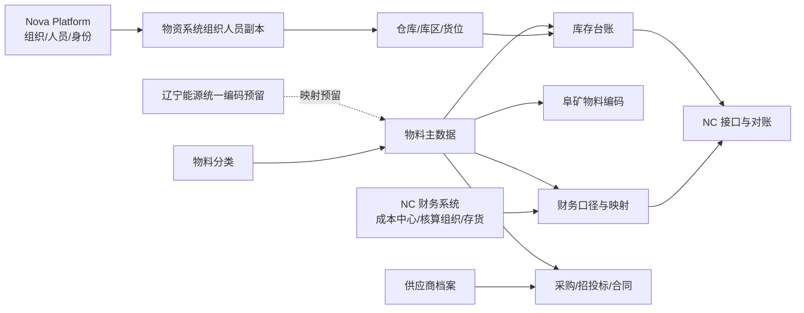
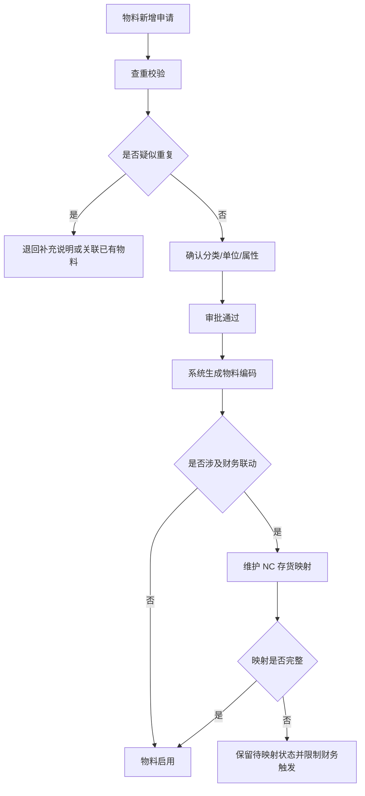

# 主数据与编码概要设计（V0.1）

**版本：** V0.1
**日期：** 2026-04-24
**上位文档：** `00-概要设计总览-v0.1.md`、`01-总体架构与集成边界-v0.1.md`、`02-业务模块概要设计-v0.1.md`
**文档性质：** 概要设计专题文档

---

## 一、文档目的

本文档用于在概要设计阶段明确物资供应管理系统的主数据范围、编码策略、权威来源、生命周期、映射关系和治理边界。
本文档是概要设计阶段主数据、物料编码、权威来源和 NC 存货映射的细化依据；其他概要设计文档只保留必要引用，不重复维护本文件中的规则细节。

本文档重点回答：

- 一期哪些数据属于主数据和基础字典
- 各类主数据的权威来源、维护归口和使用边界是什么
- 物料编码如何生成、稳定、停用和扩展
- 物资系统与 NC、Nova Platform、未来集团统一编码之间如何映射
- 后续详细设计需要细化哪些字段、流程、校验和初始化规则

本文档不直接固化物理表结构、接口报文字段和页面原型；字段级设计以详细设计和实施配置为准。

---

## 二、设计依据

| 文档                                 | 作用                              |
| ---------------------------------- | ------------------------------- |
| `docs/需求梳理/03-主数据与编码规则说明-V1.0.md`  | 明确主数据对象、编码原则、维护机制和管理口径          |
| `docs/详细规则/物资编码规范文档.md`            | 明确物料编码结构、大类分类、NC 映射和集团编码扩展预留    |
| `docs/详细规则/物资管理与财务接口规范.md`         | 明确 NC 主数据映射、计量单位、成本中心、组织口径和对账要求 |
| `docs/需求梳理/05-财务与NC接口需求说明-V1.0.md` | 明确主数据映射缺失、接口拦截、月末对账和归口责任        |
| `docs/需求梳理/07-角色权限与审批矩阵-V1.0.md`   | 明确主数据维护权限、审批角色和组织仓库数据权限         |
| `docs/招标/物资供应管理系统招标技术要求-v1.1.md`   | 明确供应商实施交付中的主数据和编码建设要求           |

---

## 三、设计定位

主数据与编码是系统底座，不是普通功能菜单。它决定后续需求提报、采购计划、招投标、合同、库存、设备、资金计划、NC 接口、报表和 AI 查询是否能够使用同一套业务口径。

一期主数据设计应坚持以下定位：

| 定位     | 说明                            |
| ------ | ----------------------------- |
| 业务口径底座 | 统一物料、组织、仓库、供应商、计量单位、成本中心等基础对象 |
| 编码治理底座 | 以一物一码、编码只增不改、停用不删除为核心约束       |
| 财务映射底座 | 通过 NC 存货、成本中心、核算组织映射支撑接口推送和对账 |
| 权限过滤底座 | 通过组织、仓库、角色和数据范围支撑业务数据隔离       |
| 报表分析底座 | 为库存、采购、合同、供应商、成本和预警提供统一维度     |
| 扩展兼容底座 | 预留辽宁能源未来统一编码和集团级主数据对接能力       |

---

## 四、一期主数据范围

一期主数据建议按 8 类对象组织。

| 类别   | 主数据对象                      | 一期设计重点                          |
| ---- | -------------------------- | ------------------------------- |
| 组织人员 | 组织、部门、人员、岗位                | 以 Nova Platform 为权威来源，本系统保存业务副本 |
| 仓储地点 | 仓库、库区、货位、组织仓库关系            | 由物资系统维护，用于库存归属、盘点范围和数据权限        |
| 物料体系 | 物料分类、物料主数据、物料编码、物料属性       | 一物一码、分类统一、属性受控、停用不删除            |
| 计量体系 | 主单位、采购单位、库存单位、换算关系         | 单位字典统一维护，与 NC 保持一致或建立稳定映射       |
| 供应商  | 供应商档案、资质、准入状态、黑名单状态        | 支撑招投标、合同、采购、对账和履约追溯             |
| 财务口径 | 成本中心、核算组织、会计科目引用           | 以 NC 或财务系统为权威来源，物资系统引用和映射       |
| 映射关系 | 物料-NC 存货、组织-NC 核算组织、成本中心对照 | 支撑接口推送、幂等、对账和异常处理               |
| 扩展编码 | 辽宁能源集团物料编码映射预留             | 一期预留字段、关系和接口空间，不要求直接启用          |

---

## 五、权威来源与维护边界

主数据必须先明确“谁是权威来源”，否则后续接口、权限和对账会持续出现口径冲突。

| 数据对象      | 权威来源                  | 物资系统职责                   | 不应承担的职责             |
| --------- | --------------------- | ------------------------ | ------------------- |
| 组织、人员、岗位  | Nova Platform 或集团统一平台 | 同步业务副本，用于单据、审批、权限和历史追溯   | 不作为组织人员权威维护系统       |
| 业务角色、数据权限 | 物资系统                  | 维护业务角色、仓库范围、组织范围和模块权限    | 不替代集团统一身份认证         |
| 仓库、库区、货位  | 物资系统                  | 维护仓储地点、归属组织、启停状态和业务属性    | 不在 NC 中重复维护仓库业务规则   |
| 物料分类      | 集团物资管理归口              | 维护分类、编码前缀、属性规则和启停状态      | 不允许各单位随意新增分类口径      |
| 物料主数据     | 物资系统，集团物资管理归口         | 维护物料编码、名称、规格、属性、状态和映射    | 不替代 NC 存货档案         |
| 计量单位      | 集团物资 + 财务联合确认         | 维护单位字典、主单位、换算关系和 NC 映射   | 不允许不同单位各自扩展同义单位     |
| 供应商档案     | 物资系统或集团供应商归口          | 维护供应商基础信息、资质、准入和黑名单状态    | 不替代未来集团统一供应商平台      |
| 成本中心      | NC 或财务系统              | 引用财务口径，维护使用单位对照关系        | 不在物资系统自建另一套成本中心     |
| 核算组织      | NC 或财务系统              | 维护组织与核算组织映射，用于接口和对账      | 不把业务组织等同于财务核算组织     |
| NC 存货     | NC 财务系统               | 维护物料到 NC 存货的 N:1 映射和推送校验 | 不要求 NC 按物资细规格重建编码体系 |

---

## 六、物料编码概要设计

### 6.1 编码结构

物料编码采用 `XX-XX-XXXXXX` 结构。

| 段位   | 位数       | 含义      | 示例        |
| ---- | -------- | ------- | --------- |
| 大类代码 | 2 位拼音首字母 | 物料一级分类  | `ZH` 支护材料 |
| 分类代码 | 2 位数字    | 物料二级分类  | `01` 锚杆   |
| 流水号  | 6 位数字    | 按分类独立自增 | `000001`  |

示例：`ZH-01-000001` 表示支护材料-锚杆分类下的第 1 个物料。

### 6.2 编码原则

| 原则       | 概要要求                      |
| -------- | ------------------------- |
| 一物一码     | 同一物料在集团范围内只允许一个有效编码       |
| 编码只增不改   | 编码生效后不得修改，错误场景通过停用和新建处理   |
| 停用不删除    | 停用物料保留历史单据、库存、合同和接口可追溯性   |
| 不含组织     | 组织、矿厂、仓库不进入编码主体，由业务字段表达   |
| 不含供应商    | 供应商物料号作为扩展属性维护，不进入本系统编码   |
| 不含规格细节堆砌 | 规格、型号、材质、品牌、图号等通过属性字段表达   |
| 支持扩展     | 预留新增大类、分类、集团统一编码和 NC 映射能力 |

### 6.3 编码生成控制

物料编码应由系统按分类自动生成，不建议人工录入编码主体。

### 6.4 大类扩展原则

现有大类以《物资编码规范文档》为准。新增大类必须满足：

- 由集团物资管理归口审批。
- 两位大类代码不得与既有代码冲突。
- 明确是否涉及危险品、批次、保质期、条码、NC 科目和专项费用。
- 明确与 NC 存货分类和财务科目的映射影响。
- 已发生历史业务的分类不得随意合并、拆分或重编码。

---

## 七、物料主数据生命周期

物料生命周期建议按“申请、审核、启用、变更、停用、归档查询”管理。

| 状态  | 含义                 | 业务控制                |
| --- | ------------------ | ------------------- |
| 待申请 | 业务单位发现现有物料无法满足需求   | 可提交新增申请，不可直接用于业务单据  |
| 待审核 | 已提交主数据审批           | 不可用于采购、库存和接口        |
| 待映射 | 物料已编码，但 NC 存货映射未完成 | 可按配置限制采购或限制财务触发     |
| 启用  | 物料正式可用             | 可用于需求、采购、合同、库存和报表   |
| 变更中 | 名称、规格、属性、映射等申请变更   | 原数据继续有效，审批通过后生成变更记录 |
| 停用  | 不再允许新业务引用          | 历史单据、库存、接口和报表仍可查询   |
| 归档  | 长期不用但保留历史          | 不可新建业务，不可复用编码       |

物料变更应区分两类：

| 变更类型  | 示例                        | 控制原则                   |
| ----- | ------------------------- | ---------------------- |
| 非关键变更 | 备注、图片、技术说明、供应商物料号         | 审批可简化，但必须留痕            |
| 关键变更  | 名称、规格型号、分类、单位、NC 映射、危险品属性 | 必须审批，必要时触发财务、库存和安全部门复核 |

---

## 八、主数据对象概要设计

### 8.1 物料分类

| 项目     | 概要设计                             |
| ------ | -------------------------------- |
| 主要用途   | 决定编码前缀、属性模板、库存统计、采购分析、NC 映射和报表维度 |
| 关键属性组  | 大类代码、分类代码、分类名称、上级分类、启停状态、特殊管理标识  |
| 关键规则   | 分类启用后可新增物料；分类停用后不得新增物料，但历史物料仍可查询 |
| 详细设计输入 | 分类维护页面、分类审批、分类变更影响分析、分类与 NC 科目映射 |

### 8.2 物料主数据

| 项目     | 概要设计                               |
| ------ | ---------------------------------- |
| 主要用途   | 支撑需求、采购、合同、库存、设备、报表、接口和 AI 查询      |
| 关键属性组  | 基本识别、规格型号、分类单位、仓储属性、财务映射、特殊属性、扩展备注 |
| 关键规则   | 编码唯一；名称规格查重；启用后可引用；停用后不得新引用；历史可追溯  |
| 详细设计输入 | 字段模板、属性校验、附件资料、条码二维码、查重规则、导入模板     |

### 8.3 组织与仓库

| 项目     | 概要设计                                 |
| ------ | ------------------------------------ |
| 主要用途   | 支撑库存归属、出入库地点、盘点范围、数据权限和跨组织调拨判断       |
| 关键属性组  | 组织编码、组织层级、仓库编码、库区货位、仓库类型、归属组织、启停状态   |
| 关键规则   | 组织人员来自 Nova；仓库由物资系统维护；仓库停用不得影响历史库存查询 |
| 详细设计输入 | 组织同步机制、仓库权限、库区货位层级、跨组织共享仓规则          |

### 8.4 计量单位

| 项目     | 概要设计                           |
| ------ | ------------------------------ |
| 主要用途   | 保证采购、入库、出库、盘点、计价和 NC 推送数量口径一致  |
| 关键属性组  | 单位编码、单位名称、单位类型、精度、NC 单位映射、换算比例 |
| 关键规则   | 同一物料必须有主单位；采购单位和库存单位不一致时必须维护换算 |
| 详细设计输入 | 单位字典、单位换算、数量精度、接口转换和异常拦截规则     |

### 8.5 供应商档案

| 项目     | 概要设计                                 |
| ------ | ------------------------------------ |
| 主要用途   | 支撑采购准入、招投标、合同、到货、付款、对账和履约追溯          |
| 关键属性组  | 供应商编码、名称、证照、税务结算、联系人、供应范围、准入状态、黑名单状态 |
| 关键规则   | 非合格供应商不得参与采购；资质过期须预警；黑名单解除须审批        |
| 详细设计输入 | 供应商准入流程、资质附件、考评指标、黑名单控制和招投标联动        |

### 8.6 成本中心与使用单位

| 项目     | 概要设计                              |
| ------ | --------------------------------- |
| 主要用途   | 支撑领料成本归集、费用凭证、资金统计和报表分析           |
| 关键属性组  | 使用单位、成本中心编码、成本中心名称、核算组织、适用范围、启停状态 |
| 关键规则   | 成本中心以财务口径为准；领料出库必须按规则带出或选择成本中心    |
| 详细设计输入 | 一对一/一对多映射、默认规则、跨成本中心拆分、历史变更追溯     |

### 8.7 NC 存货映射

| 项目     | 概要设计                                |
| ------ | ----------------------------------- |
| 主要用途   | 支撑物资业务单据按 NC 存货口径推送、记账和对账           |
| 关键属性组  | 物料编码、NC 存货编码、NC 存货名称、核算组织、映射状态、启停状态 |
| 关键规则   | 默认采用物资 N:1 NC 存货映射；组织级差异通过补充映射处理；若 NC 暂未落地，允许物料保持“待映射/未配置”状态，但不得启用对应财务接口 |
| 详细设计输入 | 映射维护流程、映射优先级、缺失拦截、每日检查、月末对账、映射配置模型 |

---

## 九、NC 映射概要设计

### 9.1 映射策略

物资系统按物料和规格细分管理，NC 按存货和财务科目归集管理。两者不强求编码体系一致，采用物资系统主动适配 NC 的 N:1 映射策略。

若当前阶段 NC 尚未落地，则先固化映射字段、映射状态、配置入口和启停开关，不要求形成最终 NC 存货编码台账；正式映射待 NC 账套、存货档案和核算口径确定后补齐。

| 维度   | 物资系统        | NC 财务系统    | 映射关系           |
| ---- | ----------- | ---------- | -------------- |
| 管理对象 | 物料、规格、批次、仓库 | 存货、科目、核算组织 | 物料 N → NC 存货 1 |
| 数据粒度 | 细           | 粗          | 推送时按 NC 存货汇总   |
| 权威职责 | 业务实物和库存事实   | 财务凭证、应付和总账 | 通过接口和对账衔接      |

### 9.2 映射查找优先级

NC 存货映射建议按以下优先级查找：

1. 若存在“物料 + NC 核算组织”的组织级映射，优先使用组织级映射。
2. 若不存在组织级映射，使用物料主数据上的默认 NC 存货映射。
3. 若仍无法找到有效映射，则拦截财务接口推送，生成映射缺失异常。

### 9.3 映射完整性控制

| 场景         | 控制要求                       |
| ---------- | -------------------------- |
| NC 未落地阶段   | 允许映射状态保持“待映射/未配置”，但必须具备映射字段、配置入口和接口启停控制 |
| 新增物料涉及财务联动 | 未完成 NC 映射前不得触发财务接口         |
| 物料停用       | 应同步通知或标记 NC 相关映射状态，不删除历史关系 |
| 成本中心缺失     | 领料出库、专项费用和成本归集类单据不得推送 NC   |
| 核算组织缺失     | 跨组织调拨和财务接口推送应拦截            |
| 映射变更       | 必须记录变更前后值、审批人、时间和影响说明      |

---

## 十、辽宁能源集团编码扩展预留

一期应明确：阜矿物资系统编码是当前主体编码，不因未来集团统一编码标准推倒重建。

| 层级      | 编码主体                   | 一期处理方式            |
| ------- | ---------------------- | ----------------- |
| 阜矿物资系统  | 本系统物料编码 `XX-XX-XXXXXX` | 正式启用，作为业务单据和库存主编码 |
| NC 财务系统 | NC 存货编码                | 通过 N:1 映射对接       |
| 辽宁能源集团  | 未来统一物料编码               | 预留字段和映射关系，暂不直接启用  |

预留要求：

- 物料主数据预留集团物料编码和集团物料名称。
- 支持未来建立阜矿物料与集团物料的映射关系。
- 支持未来按集团口径导出、同步或对账。
- 不以未来编码为由要求一期重新梳理所有阜矿编码。
- 若未来集团编码粒度与阜矿不同，通过映射、换算或补充规则处理。

---

## 十一、初始化与治理要求

主数据初始化是上线成败的前置条件，应在详细设计和实施阶段单独形成治理计划。

| 工作项     | 目标                    | 主责建议          |
| ------- | --------------------- | ------------- |
| 历史物料清洗  | 清理重复、无效、分类缺失、单位混乱的物料  | 集团物资管理牵头      |
| 分类补齐    | 所有有效物料必须归入明确分类        | 物资管理 + 各矿配合   |
| 单位统一    | 主单位、采购单位、库存单位和换算关系明确  | 物资管理 + 财务确认   |
| NC 映射建立 | 若 NC 已落地，则有效财务联动物料完成 NC 存货映射；若 NC 暂未落地，则先完成映射字段和配置模板准备 | 财务 + 物资 + 实施方 |
| 组织仓库初始化 | 组织、仓库、库区、货位和归属关系清晰    | 物资管理 + 信息化    |
| 成本中心对照  | 使用单位、区队、部门与成本中心关系确认   | 财务牵头，各矿配合     |
| 供应商整理   | 合格供应商、潜在供应商、负面供应商状态明确 | 物资管理 + 采购     |
| 导入校验    | 编码唯一、单位合法、映射完整、状态合法   | 实施方 + 信息化     |

上线前至少完成以下检查：

- 有库存余额的物料必须完成编码、分类、单位和仓库归属。
- 需要推送 NC 的物料必须完成 NC 存货映射。
- 领料会触发财务归集的使用单位必须完成成本中心对照。
- 已停用物料不得作为新业务默认可选项。
- 若 NC 已落地并启用财务接口，期初库存金额应与 NC 存货余额对齐，差异不得带病上线。

若当前阶段尚未启用 NC 财务接口，则只要求映射字段、配置模型和状态控制到位，不要求在本阶段形成最终 NC 存货编码台账。

---

## 十二、权限与审计控制

主数据属于高影响数据，应纳入权限、审批和审计控制。

| 操作      | 控制要求                   |
| ------- | ---------------------- |
| 物料新增    | 发起、审核、编码生成、NC 映射分权处理   |
| 物料变更    | 关键字段变更必须审批，记录变更前后值     |
| 物料停用    | 检查库存、未完成订单、合同和接口状态后处理  |
| 分类调整    | 需评估编码、库存、报表和 NC 映射影响   |
| 单位换算调整  | 涉及库存和接口数量，必须审批并留痕      |
| NC 映射调整 | 财务参与确认，历史推送不得被无痕覆盖     |
| 供应商黑名单  | 列入和解除均需审批，采购链路强制校验     |
| 批量导入    | 必须记录导入人、时间、模板版本、成功失败明细 |

所有主数据维护动作应记录操作日志；高敏感字段应记录字段级变更日志。

---

## 十三、后续详细设计输入

主数据与编码概要设计完成后，详细设计阶段应继续细化以下内容：

| 内容      | 说明                            |
| ------- | ----------------------------- |
| 主数据字段清单 | 明确物料、分类、仓库、供应商、单位、映射等对象字段     |
| 编码生成规则  | 明确分类流水号生成、并发控制、作废处理和异常补救      |
| 查重规则    | 明确名称、规格、型号、单位、品牌、图号等查重组合      |
| 审批流程    | 明确新增、变更、停用、映射调整和批量导入审批        |
| 导入模板    | 明确历史物料、仓库、供应商、成本中心、NC 映射模板    |
| 数据校验    | 明确必填、唯一、引用、状态、单位换算和映射完整性校验    |
| 接口触发    | 明确哪些主数据变更触发 NC、Nova 或未来集团平台同步 |
| 权限模型    | 明确谁能新增、审核、变更、停用、导出和批量导入       |
| 治理计划    | 明确上线前清洗、映射、对账、验收和责任分工         |

---

## 十四、一句话结论

主数据与编码设计的核心是先稳定“物料、组织、仓库、单位、供应商、成本中心、NC 映射”七类底座，再让业务单据和接口全部引用这套底座。后续详细设计必须优先落地字段、查重、审批、导入、映射完整性和上线治理计划，否则业务流程、库存台账和 NC 对账都会被主数据质量拖住。
