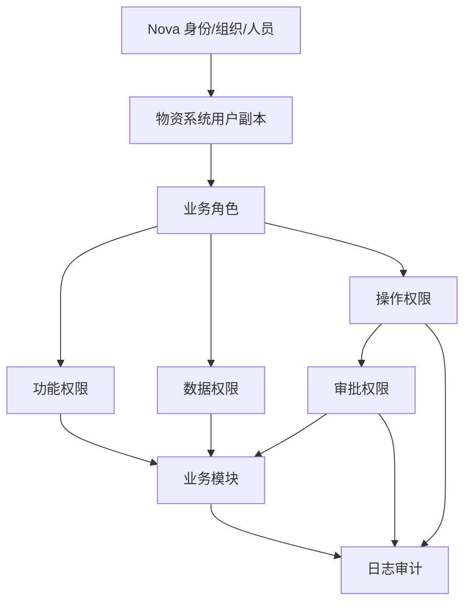
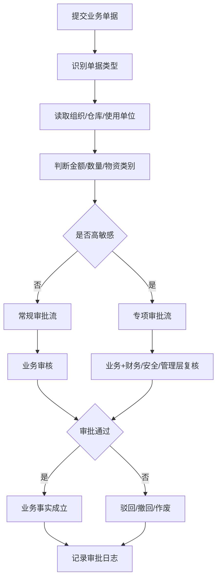

# 权限审批与审计概要设计（V0.1）

**版本：** V0.1
**日期：** 2026-04-24
**上位文档：** `00-概要设计总览-v0.1.md`、`01-总体架构与集成边界-v0.1.md`、`02-业务模块概要设计-v0.1.md`
**文档性质：** 概要设计专题文档

---

## 一、文档目的

本文档用于在概要设计阶段明确物资供应管理系统的身份接入、角色权限、数据权限、审批规则、高敏感操作控制和日志审计模型。

本文档重点回答：

- 系统如何接入集团统一身份和组织人员数据
- 本系统内部如何维护业务角色、功能权限和数据权限
- 主要业务审批如何按组织、金额、物资类别和业务类型路由
- 哪些操作属于高敏感操作，需要专项权限、审批和审计
- 日志审计应覆盖哪些对象、动作和关键字段
- 后续详细设计和实施配置阶段需要继续细化哪些内容

本文档不直接固化最终审批人名单、每个按钮权限、每个页面菜单、每个金额阈值和每条日志字段；这些内容应在详细设计和实施配置阶段结合组织、岗位和制度确认。

本文档是概要设计阶段权限、审批和审计模型的细化依据；业务模块中的权限描述只保留必要引用，不重复维护本文件中的规则细节。

---

## 二、设计依据

| 文档                                | 作用                                     |
| --------------------------------- | -------------------------------------- |
| `docs/集团统筹/集团业务系统统一建设原则-V2.0.md`  | 明确统一登录、统一身份来源、权限模型、日志审计和最小合规要求         |
| `docs/需求梳理/07-角色权限与审批矩阵-V1.0.md`  | 明确一期角色清单、建议权限矩阵、审批矩阵和特殊场景控制            |
| `docs/概要设计/01-总体架构与集成边界-v0.1.md`  | 明确 Nova Platform、权限组件、审批组件和日志审计组件的架构边界 |
| `docs/概要设计/02-业务模块概要设计-v0.1.md`   | 明确 15 个业务模块的职责、关键控制和高敏感场景分布            |
| `docs/概要设计/03-主数据与编码概要设计-v0.1.md` | 明确主数据维护、变更、映射和批量导入的权限与审计要求             |
| `docs/招标/物资供应管理系统招标技术要求-v1.1.md`  | 明确供应商交付中应满足的权限、审批、日志和审计能力              |

---

## 三、设计原则

### 3.1 统一身份，业务权限本地维护

用户身份、组织、人员等基础信息以 Nova Platform 或集团统一平台为上位来源。物资系统不另建独立身份体系，但可以维护本系统业务角色、功能权限、数据权限、审批规则和本地业务副本。

### 3.2 职责分离，避免一人包办

发起、审核、执行、复核、财务确认和系统配置等关键职责应分离。尤其是库存调整、付款申请、接口重推、月结反结、黑名单解除等场景，不应由同一角色独立完成闭环。

### 3.3 分级授权，按组织和职责控制数据

集团、矿厂、仓库、使用单位、岗位和角色应形成分级授权。普通角色默认只能查看和处理职责范围内数据，集团角色按授权查看汇总或穿透明细。

### 3.4 高敏感操作专项控制

火工品、危险品、盘亏、报废、销毁、跨组织调拨、合同变更、付款、月结、反结、补录、接口重推、黑名单解除等操作必须具备专项权限、审批和审计。

### 3.5 审批可配置，规则可追溯

审批路由应支持按组织、金额、物资类别、业务类型、供应商状态、合同金额、库存影响和财务影响配置。审批过程和结果必须可查询、可追溯。

### 3.6 日志覆盖关键事实

所有关键业务操作、审批流转、权限变更、接口操作、数据导入导出、AI 调用和高敏感动作必须记录日志。高敏感操作应记录操作前后值、原因、审批意见和来源单据。

---

## 四、总体权限模型

权限模型建议按“身份来源、组织范围、业务角色、功能权限、数据权限、操作权限、审批权限、审计权限”八层组织。

| 层级   | 设计说明                      | 示例                   |
| ---- | ------------------------- | -------------------- |
| 身份来源 | 接入 Nova Platform 或集团统一身份源 | 用户、人员、岗位、组织          |
| 组织范围 | 定义用户归属和可管理组织边界            | 集团、矿厂、部门、区队          |
| 业务角色 | 定义用户在物资系统内的业务职责           | 集团物资、各矿物资、仓库管理员、财务人员 |
| 功能权限 | 控制能进入哪些模块、页面和功能           | 采购计划、入库、合同、接口管理      |
| 数据权限 | 控制能看哪些组织、仓库、单据、供应商和报表     | 本仓库、本单位、集团汇总         |
| 操作权限 | 控制能执行哪些按钮级动作              | 新增、提交、审核、作废、导出、重推    |
| 审批权限 | 控制能否审批、退回、加签、会签和终审        | 计划审批、付款审批、反结审批       |
| 审计权限 | 控制能否查看日志、导出审计记录和处理异常      | 操作日志、接口日志、权限变更日志     |

---

## 五、角色体系概要设计

一期角色不宜过度细碎，但必须覆盖业务发起、业务管理、仓储执行、采购执行、质检、财务、安全、系统运维和管理查询。

| 角色类别   | 建议角色          | 主要权限定位                       |
| ------ | ------------- | ---------------------------- |
| 管理查询类  | 集团领导/管理层      | 查看集团汇总、重大异常、关键报表，通常不处理日常单据   |
| 信息化运维类 | 网信办/信息化、系统管理员 | 查看配置、接口状态、日志；维护角色、参数、流程和系统配置 |
| 物资管理类  | 集团物资管理、各矿物资管理 | 管理主数据、计划、库存业务审核、处置审核和规则确认    |
| 仓储执行类  | 仓库管理员         | 执行到货、入库、出库、退料、调拨、盘点等现场业务     |
| 业务申请类  | 使用单位/区队申请人    | 发起需求、领料、退料、物料新增等申请           |
| 采购执行类  | 采购人员          | 处理采购计划执行、订单、合同、付款申请和供应商协同    |
| 质检控制类  | 质检人员          | 登记质检结果、不合格处理意见和让步接收意见        |
| 财务控制类  | 财务人员          | 参与成本中心、付款、月结、反结、接口结果和对账处理    |
| 安全专项类  | 安全部门角色        | 参与火工品、危险品、安全专项物资和销毁处置审批      |
| 审计查询类  | 审计/监督查询角色     | 查看授权范围内日志、业务链路和异常台账，不直接改业务   |

角色设计要求：

- 一个用户可拥有多个业务角色，但审批和执行职责冲突时应限制同一单据闭环操作。
- 系统管理员可配置权限和流程，但不应代替业务角色处理业务事实。
- 财务人员可审核财务条件和接口结果，不应直接修改仓库现场业务。
- 仓库管理员可执行库存业务，不应拥有盘亏报废终审、反结、接口重推等高敏感终权。
- 审计查询角色原则上只读，不应拥有业务修改、审批或系统配置权限。

---

## 六、功能权限概要设计

功能权限应按模块、菜单、页面、按钮和导出能力分层配置。

| 权限粒度 | 设计说明                                  |
| ---- | ------------------------------------- |
| 模块权限 | 控制是否可进入基础档案、主数据、计划、招投标、合同、库存、接口、报表等模块 |
| 菜单权限 | 控制是否显示某类业务菜单，如采购计划、采购入库、领料出库、盘点任务     |
| 页面权限 | 控制是否可访问台账页、明细页、审批页、配置页、日志页            |
| 操作权限 | 控制新增、编辑、删除、提交、撤回、审核、驳回、作废、冲销、重推等操作    |
| 导入权限 | 控制主数据、期初数据、供应商、映射关系等批量导入              |
| 导出权限 | 控制报表、台账、日志、审计结果等导出，关键导出需留痕            |
| 配置权限 | 控制流程、角色、参数、字典、接口、预警规则等配置              |

功能权限控制原则：

- 菜单可见不代表具备操作权限。
- 查询权限、导出权限、审批权限和配置权限必须分离。
- 高敏感操作必须独立授权，不应默认随模块权限开放。
- 批量导入、批量修改、批量导出必须纳入专项权限和日志审计。

---

## 七、数据权限概要设计

数据权限用于控制用户能看哪些业务数据和报表结果。建议至少按组织、仓库、使用单位、供应商、物料类别和角色职责控制。

| 数据维度  | 控制目标                        |
| ----- | --------------------------- |
| 组织范围  | 控制集团、矿厂、部门、区队等组织层级数据可见性     |
| 仓库范围  | 控制仓库管理员和物资管理人员可见库存、出入库和盘点范围 |
| 使用单位  | 控制需求提报、领料、退料和成本归集相关数据       |
| 物料类别  | 控制火工品、危险品、安全专项物资等特殊类别可见和操作  |
| 供应商范围 | 控制采购、合同、供应商资质和履约信息可见性       |
| 合同范围  | 控制合同台账、付款节点、付款申请和合同附件可见性    |
| 报表范围  | 控制汇总报表、明细穿透和跨组织导出范围         |

数据权限生效原则：

- 明细查询、台账查询、报表穿透、AI 查询和导出应使用同一套数据权限。
- 集团层角色可按授权查看汇总数据；是否能穿透明细需单独授权。
- 仓库管理员默认仅查看本仓库或授权仓库数据。
- 使用单位默认仅查看本单位发起或相关的需求、领料和退料数据。
- 财务人员可查看财务触发相关数据，但不代表可修改业务源单据。
- 安全部门可查看特殊物资相关数据，不默认查看全部普通物资数据。

---

## 八、审批模型概要设计

审批模型建议采用“单据类型 + 组织范围 + 金额阈值 + 物资类别 + 财务影响 + 特殊标识”的规则组合。

### 8.1 审批节点类型

| 节点类型 | 设计说明                        |
| ---- | --------------------------- |
| 发起   | 创建并提交单据，必须记录发起组织、发起人、业务原因   |
| 初审   | 由业务归口角色确认业务必要性、数据完整性和合规性    |
| 复核   | 对金额、特殊物资、库存影响、合同影响、财务影响进行复核 |
| 会签   | 财务、安全、质检、合同等专项角色并行或顺序参与确认   |
| 终审   | 由授权管理层或归口负责人确认高影响业务事项       |
| 执行   | 审批通过后由仓库、采购、系统或接口任务执行业务动作   |
| 归档   | 审批意见、附件、执行结果和日志进入可追溯记录      |

### 8.2 审批路由条件

| 条件    | 示例                      |
| ----- | ----------------------- |
| 组织层级  | 各矿内审批、集团审批、跨组织会签        |
| 金额阈值  | 合同金额、付款金额、盘亏金额、处置金额     |
| 物资类别  | 火工品、危险品、安全专项、低值易耗品、大额备件 |
| 库存影响  | 入库、出库、退料、调拨、盘盈、盘亏、废旧处置  |
| 财务影响  | 付款、暂估、红冲、接口重推、反结补录      |
| 供应商状态 | 潜在、合格、负面、黑名单            |
| 合同状态  | 新签、变更、终止、超期、超金额         |
| 期间状态  | 未结账、已结账、已反结             |

### 8.3 审批动作

| 动作  | 控制要求                   |
| --- | ---------------------- |
| 提交  | 校验必填、权限、数据范围和业务状态      |
| 同意  | 记录意见、审批人、时间、节点和业务状态变化  |
| 驳回  | 必须填写原因，可退回发起人或上一节点     |
| 撤回  | 仅允许在未被下一节点处理前按权限撤回     |
| 加签  | 记录加签原因、加签人、加签节点和意见     |
| 转办  | 需保留原审批人、转办人、转办原因和接收人   |
| 作废  | 对已终止业务单据进行受控关闭，不得物理删除  |
| 冲销  | 对已生效业务事实进行反向处理，需保留原单关联 |

---

## 九、主要业务审批边界

本节只固化概要审批边界，不复制完整审批矩阵。详细审批节点、金额阈值、岗位人员和流程配置以实施阶段确认为准。

| 业务类别     | 发起主体           | 关键审批/参与角色           | 高敏感升级条件                |
| -------- | -------------- | ------------------- | ---------------------- |
| 主数据新增变更  | 使用单位、各矿物资、集团物资 | 各矿物资、集团物资、财务/安全按需参与 | 关键物料、特殊物资、NC 映射变更、批量导入 |
| 需求与采购计划  | 使用单位、各矿物资      | 各矿物资、集团物资、管理层按金额参与  | 重大计划、计划外紧急采购、计划频繁调整    |
| 招投标与采购方式 | 采购人员、物资管理      | 物资管理、采购归口、必要时管理层    | 采购方式变更、单一来源、非招标采购例外    |
| 到货入库与退货  | 仓库、采购、质检       | 仓库、物资管理、质检、财务按需参与   | 质检不合格、让步接收、跨期退货、大型设备直达 |
| 领料退料调拨   | 使用单位、仓库、物资管理   | 部门负责人、各矿物资、财务按需参与   | 跨组织调拨、特殊物资、已结账期间调整     |
| 盘点与废旧处置  | 仓库、物资管理        | 各矿物资、财务、安全、管理层按规则参与 | 盘亏、报废、销毁、危险品、金额超阈值     |
| 设备与租赁    | 设备管理、使用单位、采购   | 物资管理、设备管理、财务按需参与    | 权属变更、报废、停租争议、重大租赁费用    |
| 合同与资金    | 采购人员、物资管理      | 物资管理、财务、管理层按金额参与    | 合同变更终止、超合同付款、付款条件不满足   |
| 供应商管理    | 采购、物资管理        | 集团物资、管理层按规则参与       | 黑名单列入解除、负面供应商参与采购      |
| NC 接口与月结 | 财务、信息化、系统任务    | 财务、系统管理员、网信办按需参与    | 接口重推、关闭异常、反结、补录、跨期调整   |

---

## 十、高敏感操作控制

高敏感操作必须同时满足“专项权限 + 审批或确认 + 日志留痕 + 可追溯来源”。

| 高敏感操作         | 控制要求                           |
| ------------- | ------------------------------ |
| 火工品/危险品出入库和销毁 | 专项角色授权，安全部门参与审批，形成专项台账         |
| 盘亏、报废、销毁      | 按金额、品类、危险等级升级审批，财务和安全按需参与      |
| 跨组织调拨         | 区分调出和调入责任，必要时财务确认内部结算或对账口径     |
| 月结、反结、补录      | 财务主导，信息化配合，严格审批，记录期间、原因和影响范围   |
| 接口重推、关闭、异常处理  | 限定财务/系统管理员角色，记录原接口任务、错误原因和处理结果 |
| 合同变更、终止       | 记录变更原因、金额影响、履约影响和会签意见          |
| 付款申请和付款计划调整   | 校验合同、验收、发票、累计付款和节点比例，财务参与复核    |
| 供应商黑名单解除      | 集团物资或管理层审批，记录解除原因和有效期          |
| 主数据关键字段变更     | 记录变更前后值，必要时财务、安全或集团物资复核        |
| 批量导入和批量导出     | 独立权限，记录模板版本、操作人、时间、范围和结果       |

高敏感操作不应只依赖页面提示控制，必须在后端权限、业务状态和审计日志层面共同校验。

---

## 十一、审计日志概要设计

审计日志应覆盖用户行为、业务事实、审批过程、接口处理、配置变更、数据导入导出和 AI 调用。

| 日志类型    | 覆盖内容                 | 关键审计字段                |
| ------- | -------------------- | --------------------- |
| 登录日志    | 登录成功、失败、登出、Token 刷新  | 用户、组织、IP、时间、终端、结果     |
| 操作日志    | 新增、修改、删除、提交、作废、冲销    | 操作人、动作、对象、前后值、原因      |
| 审批日志    | 同意、驳回、加签、转办、撤回、终审    | 审批人、节点、意见、时间、流转路径     |
| 权限日志    | 用户授权、角色调整、数据范围调整     | 变更人、被变更人、角色、范围、前后值    |
| 接口日志    | 推送、回执、失败、重试、关闭、重推    | 接口 ID、来源单号、请求流水、状态、错误 |
| 导入日志    | 主数据、期初、映射、供应商批量导入    | 模板版本、成功失败明细、校验结果      |
| 导出日志    | 报表、台账、日志、审计数据导出      | 导出人、范围、条件、数量、文件标识     |
| AI 调用日志 | Tool 调用、参数、权限校验、返回摘要 | 调用人、Tool、参数、数据范围、结果   |
| 异常日志    | 系统异常、接口异常、任务异常       | 错误码、错误信息、堆栈摘要、处理状态    |

审计日志设计原则：

- 关键操作必须能追溯到人、时间、组织、动作、对象和结果。
- 高敏感字段变更应记录字段级前后值。
- 日志不得被普通业务角色修改或删除。
- 日志查询和导出本身也应记录审计日志。
- 日志保留周期、归档策略和脱敏策略应按集团运维与安全制度在详细设计阶段确定。

---

## 十二、与外部平台的边界

### 12.1 与 Nova Platform

| 内容    | 边界                              |
| ----- | ------------------------------- |
| 身份认证  | Nova 或集团统一平台为身份来源，物资系统接入 SSO    |
| 组织人员  | 组织、人员、岗位来自平台，物资系统保存业务副本         |
| 业务角色  | 物资系统维护本系统业务角色，不反向作为集团统一角色源      |
| 数据权限  | 结合平台组织范围和物资系统仓库、业务角色、物料类别配置     |
| 审批人解析 | 可通过平台人员组织数据解析，也可按本系统角色 + 组织规则配置 |

### 12.2 与 NC 财务系统

| 内容   | 边界                     |
| ---- | ---------------------- |
| 财务审批 | 物资系统负责付款申请、月结反结等业务审批留痕 |
| 实际付款 | NC 或财务系统负责实际付款和财务处理    |
| 接口重推 | 物资系统记录重推权限、审批、原因和结果    |
| 对账异常 | 财务和物资系统共同处理，处理过程必须留痕   |

### 12.3 与统一 AI 平台

| 内容    | 边界                                |
| ----- | --------------------------------- |
| 权限继承  | AI Tool 调用必须继承物资系统身份、角色和数据权限      |
| 只读优先  | 一期 AI 能力以查询、分析、预警和追溯为主            |
| 高风险限制 | 审批、反结、重推、付款、黑名单解除等不作为一期 AI 自动执行范围 |
| 审计留痕  | AI 调用必须记录调用人、参数、数据范围和结果摘要         |

---

## 十三、后续详细设计输入

权限审批与审计概要设计完成后，详细设计阶段应继续细化以下内容：

| 内容      | 说明                             |
| ------- | ------------------------------ |
| 角色清单    | 明确角色编码、角色名称、适用组织、互斥关系和默认权限     |
| 功能权限树   | 明确模块、菜单、页面、按钮、导入导出、配置项权限       |
| 数据权限规则  | 明确组织、仓库、使用单位、物料类别、供应商、合同范围过滤规则 |
| 审批流程模板  | 明确每类单据的节点、路由条件、加签转办、撤回作废规则     |
| 金额和类别阈值 | 明确采购、合同、付款、盘亏、报废、处置等升级审批阈值     |
| 高敏感清单   | 明确专项权限编码、审批要求、日志字段和二次确认规则      |
| 日志字段清单  | 明确各类日志字段、索引、查询条件、保留周期和归档策略     |
| 权限初始化模板 | 明确上线初始化时用户、角色、组织、仓库和审批人配置模板    |
| 权限测试用例  | 覆盖越权访问、跨组织查询、导出控制、审批越权、高敏感操作   |
| 运维审计流程  | 明确日志查询、异常处理、权限变更复核和审计导出流程      |

---

## 十四、一句话结论

权限、审批与审计设计的核心不是简单分配菜单，而是用统一身份、本地业务角色、数据范围过滤、审批路由和日志审计共同形成内控闭环。后续详细设计必须先固化角色、权限树、数据范围、审批模板、高敏感清单和日志字段，再进入页面和流程配置。