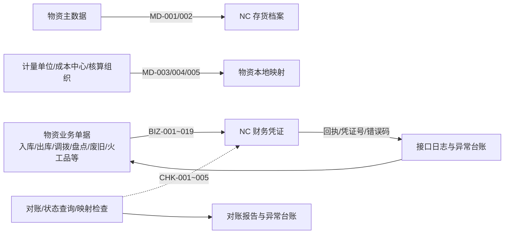
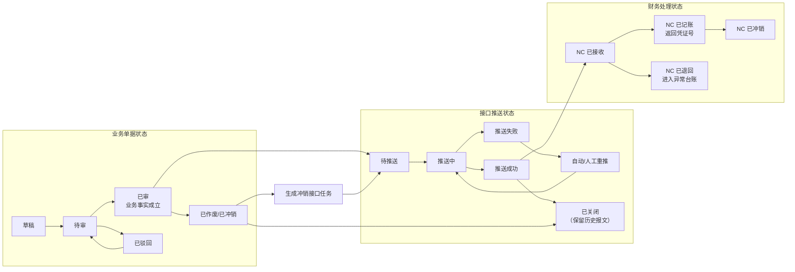
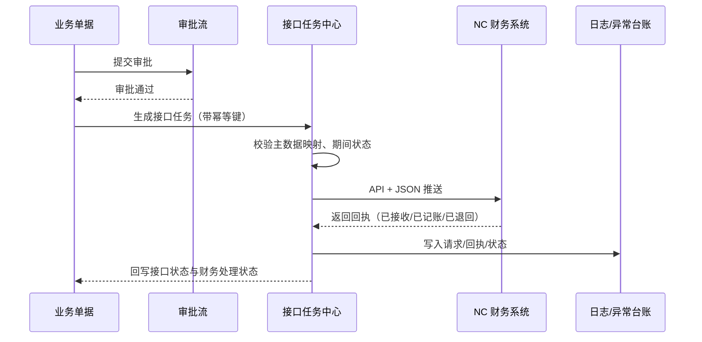
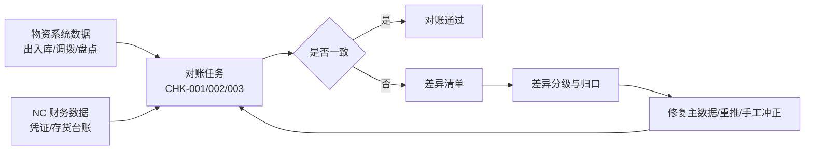
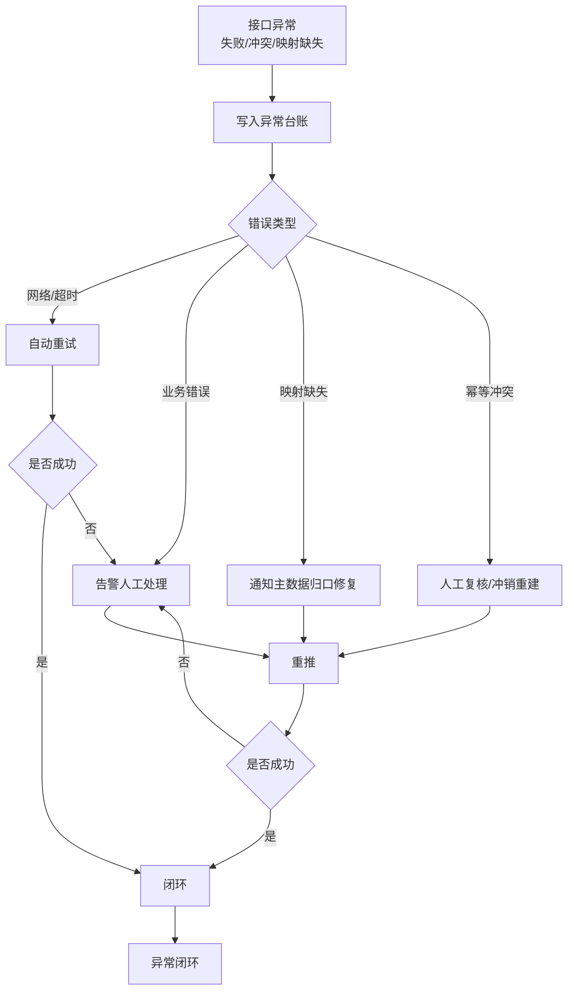

# NC 接口与对账概要设计（V0.1）

**版本：** V0.1
**日期：** 2026-04-24
**上位文档：** `00-概要设计总览-v0.1.md`、`01-总体架构与集成边界-v0.1.md`、`02-业务模块概要设计-v0.1.md`、`03-主数据与编码概要设计-v0.1.md`、`04-权限审批与审计概要设计-v0.1.md`
**文档性质：** 概要设计专题文档

---

## 一、文档目的

本文档用于在概要设计阶段明确物资供应管理系统与 NC 财务系统之间 29 项接口的治理边界、状态模型、触发规则、幂等与重推、对账封账、异常补偿和运维监控要求。

本文档重点回答：

- 一期 NC 接口范围怎么划、每类接口承担什么职责
- 接口推送、回执、状态、幂等、重推应如何统一治理
- 业务单据在什么状态触发什么接口、按什么粒度推送
- 主数据映射不完整时如何受控拦截，避免脏数据进入财务
- 日常、月末、年度对账和封账应按什么节奏和责任推进
- 已结账期间的调整和反结如何受控
- 接口失败、冲突、NC 已接收未记账等异常如何闭环
- 哪些事项应留到详细设计、联调和实施阶段进一步明确

本文档不直接固化每项接口的完整字段清单、错误码对照表、凭证分录样例和联调脚本。字段级内容以 `docs/招标/附件二-接口清单及报文示例-v1.1.md`、`docs/详细规则/物资管理与财务接口规范.md` 及实施阶段《接口联调规范》为准。

---

## 二、设计依据

| 文档 | 作用 |
| --- | --- |
| `docs/需求梳理/05-财务与NC接口需求说明-V1.0.md` | 明确业财协同原则、接口范围、状态矩阵、对账封账骨架和责任分工 |
| `docs/招标/附件二-接口清单及报文示例-v1.1.md` | 明确 29 项接口、统一回执字段、幂等规则、精度尾差和验收标准 |
| `docs/详细规则/物资管理与财务接口规范.md` | 明确各业务场景下的凭证口径、分录、暂估冲销、对账 SOP 和特殊业务处理 |
| `docs/概要设计/01-总体架构与集成边界-v0.1.md` | 明确接口分层、接口治理模型、四类状态口径和集成边界 |
| `docs/概要设计/03-主数据与编码概要设计-v0.1.md` | 明确物料-NC 存货 N:1 映射、组织/成本中心映射和映射完整性控制 |
| `docs/概要设计/04-权限审批与审计概要设计-v0.1.md` | 明确接口重推、反结、例外关闭、对账报告导出等高敏感操作的权限和审计要求 |
| `docs/集团统筹/集团业务系统统一建设原则-V2.0.md` | 明确独立部署、API + JSON、信创、日志审计等集团级约束 |

---

## 三、设计原则

### 3.1 业务事实驱动

NC 接口必须由物资系统已审核的业务单据触发，不允许手工凭空发起接口、不允许从未经审批的草稿或待审单据直接推送财务凭证。

### 3.2 状态分层、严禁混用

业务单据状态、接口推送状态、财务处理状态、期间状态四类状态必须分层维护。接口成功不代表财务记账完成，凭证号到账前不得视为业务闭环。

### 3.3 主数据先行、映射完整才能推送

物料-NC 存货、组织-NC 核算组织、使用单位-成本中心、计量单位等映射未完成的单据，必须在接口侧被拦截，不得以"推完再补"绕过。

### 3.4 幂等可重推、重推不覆盖

同一业务事实重复推送必须可识别，不得重复生成凭证；报文不一致的重复推送必须冲突拦截，不得静默覆盖。

### 3.5 失败可查、差异可对

任何接口推送、重推、回执、差异、手工干预都必须留痕，并能按单号、组织、期间、状态、错误类型查询和追溯。

### 3.6 封账受控、反结留痕

已结账期间不允许直接修改业务事实或通过重复推送规避审批；补录、反结、冲销必须走专项审批流程并全过程留痕。

### 3.7 对外统一 API + JSON

正式对外集成标准为 API + JSON，优先 HTTPS；内部可采用消息队列、异步任务实现削峰重试，但不改变对外接口标准和验收口径。

---

## 四、接口总览

### 4.1 一期接口范围

一期建设 **29 项接口**，分为主数据同步、业务单据推送、对账与监控三类。接口 ID、推送方向、触发时机、频率详见 `docs/招标/附件二-接口清单及报文示例-v1.1.md` 第四章。本文档不重复接口字段，只明确治理层面的分类与关注点。

| 类别 | 接口数 | 代表接口 | 概要设计关注点 |
| --- | --- | --- | --- |
| 主数据同步 | 5 项（MD-001~005） | 物料-存货映射、物料停用、计量单位、成本中心、核算组织 | 权威来源、同步时机、映射缺失拦截 |
| 业务单据推送 | 19 项（BIZ-001~019） | 采购入库/退货、领料/退料、调拨、盘盈盘亏、废旧、火工品、暂估冲销、预付核销、委托加工等 | 审核后触发、幂等键、期间校验 |
| 对账与监控 | 5 项（CHK-001~005） | 日对账、周库存余额、月末全量对账、接口状态查询、映射完整性检查 | 频率节奏、差异分级、封账前核对 |

### 4.2 接口实时性分级

| 级别 | 接口特征 | 一期范围示例 |
| --- | --- | --- |
| 实时 | 业务发生即推送、不允许批量 | 火工品出入库（BIZ-013）、接口状态查询（CHK-004） |
| 准实时 | 单据审核后事件驱动、秒级至分钟级推送 | 采购入库、领料出库、调拨、盘盈盘亏、预付款、委托加工等 |
| 批量/定时 | 月末/月初定时批处理或日度/周度定时 | 暂估（BIZ-002）、暂估冲销（BIZ-003）、低值易耗摊销（BIZ-018）、日/周/月对账 |

### 4.3 接口总体流向

---

## 五、接口统一技术规范

### 5.1 集成标准

| 层面 | 统一要求 |
| --- | --- |
| 对外集成标准 | API + JSON |
| 传输协议 | 优先 HTTPS，不接受未加密的裸 HTTP 承载生产数据 |
| 字符集 | UTF-8 |
| 鉴权 | 统一服务身份 + Token/签名机制，鉴权方式在详细设计与联调阶段确认 |
| 版本管理 | 接口须有明确版本号，不兼容变更须通过新版本号承载 |
| 批量对账 | 通过受控 API 或任务接口，不采用离线文件交换作为正式标准 |
| 内部异步 | 允许使用消息队列、任务队列等异步机制削峰重试，不改变对外 API 标准 |

### 5.2 请求与响应公共要素

所有接口请求与响应至少应包含：

- 业务标识（`interfaceId`、`sourceBillNo`、`sourceBillType`、`orgCode`）
- 来源系统（`sourceSystem`）
- 请求流水号（`requestId`）、推送时间（`pushTime`）
- 幂等键（由 `interfaceId + sourceBillNo + orgCode` 组合）
- 版本号、调用方、鉴权信息

响应至少包含 NC 侧最小回执字段（详见 [附件二 3.3](../招标/附件二-接口清单及报文示例-v1.1.md)）：`interfaceId`、`sourceBillNo`、`orgCode`、`receiptStatus`、`receiptTime`、`ncVoucherNo`、`errorCode`、`errorMessage`、`retryNo`。

### 5.3 日志留痕要求

| 日志类型 | 留存内容 | 用途 |
| --- | --- | --- |
| 请求日志 | 请求流水号、幂等键、报文摘要、发送时间 | 问题追溯、性能分析 |
| 回执日志 | 回执状态、凭证号、错误码、错误描述、处理时间 | 对账、异常分析 |
| 重推日志 | 重推触发方、重推次数、前次错误、本次结果 | 审计、责任追溯 |
| 异常台账 | 错误类型、单据信息、处理人、处理动作、闭环状态 | 日常异常管理 |

日志保留周期不少于 12 个月，具体按集团运维审计要求在详细设计阶段明确。

---

## 六、统一状态矩阵与流转

### 6.1 四类状态分层

为避免状态混同和对账错位，一期统一按四类状态分层维护，每类状态独立取值、独立流转：

| 状态类别 | 状态取值 | 承担作用 |
| --- | --- | --- |
| 业务单据状态 | 草稿、待审、已审、已驳回、已作废、已冲销 | 判断业务事实是否成立 |
| 接口推送状态 | 待推送、推送中、推送成功、推送失败、已重推、已关闭 | 判断接口执行过程 |
| 财务处理状态 | 未接收、已接收、已记账、已退回、已冲销 | 判断 NC 侧处理结果 |
| 期间状态 | 未结账、已结账、已反结 | 判断是否允许补录、重推和调整 |

对资金计划类单据，另补充支付状态：待申请、审批中、已审批待支付、部分支付、已支付、支付退回/支付失败。

### 6.2 关键流转约束

- **业务 → 接口**：只有业务单据进入"已审"才允许生成接口任务；草稿、待审、驳回状态不得推送。
- **接口 → 财务**：接口"推送成功"不等于财务"已记账"，必须等待 NC 回执确认；回执为"已记账"时写入凭证号，回执为"已退回"时走异常处理。
- **期间与推送**：期间状态为"已结账"时，禁止该期间单据直接推送或重推；须先走反结流程。
- **冲销与作废**：业务"已冲销"必须触发对应冲销接口，原接口任务进入"已关闭"而非被删除，历史报文保留可追溯。

### 6.3 状态流转图

下图将状态分为三条线理解：业务单据状态判断“业务事实是否成立”，接口推送状态判断“接口任务是否成功送达并取得回执”，财务处理状态判断“NC 是否完成接收、记账或退回”。三类状态不能混用。

关键理解：

- 业务单据只有到“已审”，才允许生成接口任务。
- 接口“推送成功”只表示 NC 已返回接口回执，不等于财务已记账。
- 财务是否完成，要看 NC 回执后的财务处理状态，如“已接收、已记账、已退回、已冲销”。
- 业务冲销或作废时，不删除原接口任务，而是关闭原任务并生成新的冲销接口任务。

---

## 七、幂等与重推

### 7.1 幂等键

一期基础幂等键采用 `interfaceId + sourceBillNo + orgCode` 作为业务唯一键。对单据一次性推送的接口，基础幂等键可直接使用；对分批入账、部分到票、分批付款、按行触发或按期间批处理的接口，必须在基础键上追加业务维度，形成扩展幂等键。

| 场景 | 扩展幂等键建议 |
| --- | --- |
| 采购入库部分到票正式入账 | `interfaceId + sourceBillNo + orgCode + invoiceNo/settleBatchNo + lineNo` |
| 预付款分批核销 | `interfaceId + sourceBillNo + orgCode + paymentNodeNo + invoiceNo/settleBatchNo` |
| 暂估、冲销、重新暂估 | `interfaceId + sourceBillNo + orgCode + estimatePeriod + estimateBatchNo` |
| 低值易耗摊销 | `interfaceId + sourceBillNo + orgCode + amortizePeriod + amortizeBatchNo` |
| 委托加工发出和加工费确认 | `interfaceId + sourceBillNo + orgCode + processStage + lineNo` |

扩展幂等键的字段名和组合方式在接口联调阶段固化，但不得只依赖 `sourceBillNo` 处理分批或分阶段财务触发，否则会把合法分批推送误判为幂等冲突。

### 7.2 幂等处理规则

| 情形 | 处理策略 |
| --- | --- |
| 同键值重复推送、报文一致 | NC 返回幂等成功，不重复生成凭证；物资侧记录幂等命中 |
| 同键值重复推送、报文不一致 | NC 返回业务冲突；物资侧进入"幂等冲突"异常，禁止静默覆盖 |
| 已结账期间的重复推送 | 无论报文是否一致，接口侧直接拦截，强制走反结流程 |
| 冲销后再推 | 原接口任务保持已关闭，冲销须以独立接口任务标识（如 `-REVERSE` 后缀） |

### 7.3 重推策略

| 触发 | 策略 |
| --- | --- |
| 网络超时、NC 暂不可达 | 自动重试 3 次，指数退避（初始 30 秒）；达到阈值后告警，转人工 |
| NC 业务错误（科目未配、映射缺失） | 不自动重试；进入异常台账，待物资/财务修复数据后人工重推 |
| 报文校验失败 | 不推送 NC，直接拦截，标识字段问题并通知业务责任人 |
| 幂等冲突 | 禁止覆盖，转人工复核，必要时由业务发起冲销与新单重建 |

重推全过程必须记录触发方、原错误、本次请求流水号和结果，并关联原业务单据和原接口任务。

---

## 八、接口触发点

### 8.1 触发节点总览

业务单据与接口任务的触发关系应在概要设计阶段统一口径，避免各模块各自定义。下表列出一期核心触发节点；联调阶段再细化时点参数和组织口径。

| 业务单据 | 触发节点 | 对应接口 | 频率特征 |
| --- | --- | --- | --- |
| 采购入库单（发票已到） | 单据审核通过 + 三单匹配完成 | BIZ-001 采购入库（正式） | 准实时 |
| 采购入库单（发票未到） | 月末暂估批处理 | BIZ-002 采购入库（暂估） | 月末批量 |
| 暂估冲销 | 次月初暂估冲销批处理 | BIZ-003 暂估红字冲销 | 月初批量 |
| 采购退货单 | 退货单审核通过 | BIZ-004 | 准实时 |
| 领料出库单 | 出库单审核通过 | BIZ-005 | 准实时 |
| 退料入库单 | 退料单审核通过 | BIZ-006 | 准实时 |
| 跨组织调拨单 | 调出方发出 + 调入方签收完成 | BIZ-007 | 准实时 |
| 盘点处理单 | 盘盈/盘亏审批通过 | BIZ-008 / BIZ-009 | 准实时 |
| 废旧处置单 | 变卖出库、变卖收入、销毁审批通过 | BIZ-010 / BIZ-011 / BIZ-012 | 准实时（销毁为实时） |
| 火工品出入库单 | 审核通过 | BIZ-013 | **实时，不参与批量** |
| 预付款申请 | 审批付款时 | BIZ-014 | 准实时 |
| 预付款核销 | 发票 + 入库匹配完成 | BIZ-015 | 准实时 |
| 让步接收入库单 | 质检让步 + 降价确认 | BIZ-016 | 准实时 |
| 安全专项领料单 | 审核通过 | BIZ-017 | 准实时 |
| 低值易耗领用 | 月末摊销批处理 | BIZ-018 | 月末批量 |
| 委托加工单 | 加工发出或加工费确认 | BIZ-019 | 准实时 |

### 8.2 触发时序

### 8.3 触发控制要点

- 审批未通过的单据不得生成接口任务。
- 主数据映射缺失的单据生成任务后应进入"待推送-拦截"状态，不向 NC 发送。
- 已结账期间的补录单据不得直接触发接口，必须附反结申请。
- 批量接口（暂估、冲销、摊销）在运行窗口内集中执行，运行时长与并发按月末批量要求设计。

### 8.4 暂估滚动生命周期

已入库但发票未到的采购入库单，应按“月末暂估、次月初冲销、仍未到票则下月末重新暂估”的滚动方式处理，直至发票到达并完成正式入账。

| 时点 | 处理要求 | 接口 |
| --- | --- | --- |
| 入库当月月末 | 对已入库、发票未到、未正式入账的单据生成暂估 | BIZ-002 |
| 次月月初 | 对上月暂估记录生成红字冲销，不改变实物库存 | BIZ-003 |
| 发票仍未到 | 当月月末按当前暂估规则重新暂估，形成新的暂估批次 | BIZ-002 |
| 发票到达 | 校验原暂估已冲销，按发票和入库匹配结果正式入账 | BIZ-001 |

暂估批次、冲销批次和正式入账批次必须可追溯，幂等键应包含期间或批次号，避免跨月滚动暂估被误判为重复推送。

---

## 九、主数据映射与拦截

### 9.1 核心映射关系

| 映射类别 | 关系 | 权威来源 | 维护主责 |
| --- | --- | --- | --- |
| 物料 → NC 存货 | N:1 | NC 存货档案 | 物资 + 财务联合维护映射表 |
| 物资组织 → NC 核算组织 | N:1 或 1:1 | NC 核算组织 | 财务主责、物资引用 |
| 使用单位 → 成本中心 | N:1 或 1:1 | NC 成本中心 | 财务主责、各矿配合 |
| 计量单位 → NC 单位 | 1:1 或带换算 | 统一字典 | 物资 + 财务联合确认 |

映射维护规则、查找优先级、停用/变更留痕以 [03 主数据与编码概要设计](./03-主数据与编码概要设计-v0.1.md) 第九章为准。

### 9.2 映射完整性拦截

| 缺失项 | 拦截范围 | 处理策略 |
| --- | --- | --- |
| 物料 NC 存货映射 | 所有财务联动接口 | 接口任务生成时校验，缺失则任务置为"待映射"并告警 |
| 使用单位成本中心 | 领料出库、专项费用、成本归集类接口 | 出库单审核前校验；未配置不得审核 |
| 核算组织映射 | 跨组织调拨、涉及财务组织的全部接口 | 接口任务生成前校验，缺失则拦截 |
| 计量单位映射 | 所有业务单据推送 | 单据维护期间预校验，单位不合法不得保存 |

每日由映射完整性检查接口（CHK-005）扫描并输出告警清单，物资接口管理员按日闭环。

### 9.3 主数据变更对接口的影响

- 物料新增并完成 NC 映射后，通过 MD-001 同步；停用通过 MD-002 同步。
- 成本中心、核算组织变更由 NC 主动推送（MD-004/005），物资侧引用口径。
- 已发生历史业务的主数据变更须保留前后值和变更时间，避免影响历史凭证追溯。

---

## 十、凭证口径与精度

### 10.1 凭证口径责任边界

物资系统负责按业务场景生成凭证报文所需的**业务行信息**（来源单号、组织、物料/存货编码、数量、单价、金额、税额、成本中心等）。NC 负责按科目映射生成最终会计分录和凭证号。

各业务场景的会计分录、借贷方向、暂估/冲销规则以 `docs/详细规则/物资管理与财务接口规范.md` 第三章至第十五章为准；接口报文字段以附件二及实施阶段《接口联调规范》为准。

### 10.2 精度统一

| 数据项 | 精度要求 |
| --- | --- |
| 移动平均单价 | 6 位小数 |
| 入库/出库金额 | 2 位小数（四舍五入） |
| 数量 | 4 位小数（按重量计量物料适用） |
| 税率与税额 | 税率按百分比整数；税额 = 不含税金额 × 税率，四舍五入到分 |

物资系统与 NC 的精度、舍入规则必须完全一致。精度对照表在联调阶段由双方联合出具并签字确认。

### 10.3 尾差处理

| 规则 | 阈值 | 处理方式 |
| --- | --- | --- |
| 单笔出库尾差 | ≤ 0.01 元 | 系统自动消化 |
| 月度累计尾差 | ≤ 50 元 | 自动计入"管理费用-存货价差" |
| 超月度累计阈值 | > 50 元 | 必须查明原因并留痕 |
| 最后一笔出库 | 库存清零 | 金额按账面倒挤，避免残余金额 |

### 10.4 价格保护

一期实现以下保护机制（详见 [附件二 第八章](../招标/附件二-接口清单及报文示例-v1.1.md)）：

- 入库单价偏离当前移动平均 ≥ 30% 告警、需人工确认
- 入库单价超过当前移动平均 200% 拦截、需审批放行
- 入库单价为 0 拦截、须选择"赠品入库"类型
- 出库禁止负库存

---

## 十一、对账机制

### 11.1 对账频率与接口

| 频率 | 对账内容 | 对应接口 | 执行方 |
| --- | --- | --- | --- |
| 每日 | 前一日物资出入库业务日期 vs 前一日 NC 凭证日期的笔数/金额 | CHK-001 | 系统自动比对 |
| 每周 | 本周物资库存余额 vs NC 存货科目余额 | CHK-002 | 物资 + 财务 |
| 每月 | 全量库存数量/金额对账，出具对账报告 | CHK-003 | 物资 + 财务 |
| 每年 | 年末存货盘点 + 财务审计配合 | CHK-003 扩展 | 物资 + 财务 + 审计 |
| 按需 | 接口推送结果/重推状态查询 | CHK-004 | 物资接口管理员 |
| 每日 | 映射完整性扫描，`ncInvCode` 为空告警 | CHK-005 | 系统自动 |

### 11.2 差异分级与归口

| 差异类型 | 典型场景 | 处理归口 |
| --- | --- | --- |
| 映射缺失 | 新物料未建 NC 映射、成本中心未配置 | 物资 + 财务主数据组 |
| 金额差异 | 精度不一致、移动平均算法偏差 | 财务 + 实施方 |
| 数量差异 | 跨期单据、在途未收、调拨签收未完成 | 物资业务员 + 仓库 |
| 状态不一致 | 物资已审 NC 未记账、NC 已冲销物资未同步 | 物资接口管理员 + 财务 |
| 手工调整台账 | NC 端直接记账的手工凭证 | 财务，须登记台账 |

差异清单支持按组织、物料、期间、差异类型、金额区间钻取，并记录处理人、处理动作、闭环状态。

日对账默认按业务日期与凭证日期对齐；若 NC 侧存在跨日记账或补记账，应在差异清单中标记“跨日记账”原因，不得直接计入业务差异。

### 11.3 对账流程

---

## 十二、月结封账与反结

### 12.1 月结封账前置条件

每月封账前必须完成以下核对并留痕：

1. 主数据映射缺失已清零或有书面说明
2. 接口失败单据已处理完毕或有例外说明
3. 暂估清单和暂估冲销清单已双方确认
4. NC 手工调整台账已对齐
5. 重大差异已明确原因和责任人
6. 当期全量对账报告已出具并双方签字

### 12.2 月结责任骨架

| 环节 | 最低要求 | 责任方 |
| --- | --- | --- |
| 每日接口巡检 | 检查前一日失败、超时、未回执接口并闭环 | 物资接口管理员 |
| 每日差异处理 | 主数据缺失、金额差异、状态不一致逐条处理 | 物资 + 财务 |
| 月末对账前检查 | 未映射、未推送、失败重推、暂估、盘盈盘亏、手工调整台账全部核对 | 物资 + 财务 |
| 月结确认 | 对账完成后由双方确认封账 | 物资负责人 + 财务负责人 |
| 封账后补单/反结 | 走申请、审批、反结/重推、留痕流程 | 财务 + 信息化 |

### 12.3 反结控制

| 控制点 | 要求 |
| --- | --- |
| 反结申请 | 必须关联具体业务单据、明确原因和影响范围 |
| 反结审批 | 走财务审批流程，物资业务负责人会签 |
| 反结执行 | 打开期间后定点处理，处理完成必须重新封账 |
| 反结留痕 | 记录申请人、审批人、反结原因、受影响凭证、再封账时间 |
| 禁止行为 | 禁止以重复推送、删除单据、旁路补单等方式规避反结 |

---

## 十三、异常与补偿

### 13.1 典型异常类型

| 异常类型 | 处理策略 |
| --- | --- |
| 网络超时 / NC 不可达 | 自动重试（指数退避），阈值后告警转人工 |
| 外部业务错误（如科目未配置） | 记录错误码，通知物资/财务修复，人工重推 |
| 报文校验失败 | 阻断推送，返回字段问题，由业务修复单据 |
| 幂等冲突 | 禁止覆盖，转人工复核，必要时冲销重建 |
| NC 已接收未记账 | 进入"对账异常"，财务核查 NC 侧处理进度 |
| 期间已结账 | 走反结或延后至次期处理，不得规避 |
| 映射缺失 | 任务拦截为"待映射"，映射建立后自动重新生成 |
| 余额/精度冲突 | 进入差异清单，财务确认后补冲或调整 |

### 13.2 异常台账

异常台账是接口治理的中枢，一期应至少包含：

- 接口 ID、业务单号、组织、期间、幂等键、错误类型、错误码、错误描述
- 首次失败时间、最后失败时间、重试次数、处理人、处理动作、闭环时间
- 关联的原始请求报文、回执报文、重推记录
- 当前状态（待处理、处理中、已闭环、已例外关闭）

异常台账保留不少于 12 个月，支持按责任方、错误类型、时间范围查询和导出。

### 13.3 异常处理流程

---

## 十四、运维监控与告警

### 14.1 监控指标

| 维度 | 监控指标 |
| --- | --- |
| 接口可用性 | 接口调用成功率、超时率、平均响应时长 |
| 推送积压 | 待推送队列长度、推送中任务数、超时任务数 |
| 重推健康 | 重推次数分布、重推成功率、达到阈值的任务数 |
| 对账健康 | 日/周/月对账差异数量、金额规模、未闭环差异数 |
| 映射健康 | 映射缺失单据数、受拦截接口数 |
| 批量任务 | 暂估/冲销/摊销批处理运行时长、失败条数、告警次数 |
| 期间状态 | 各组织当前期间状态、反结申请数 |

### 14.2 告警分级

| 级别 | 触发条件示例 | 处置要求 |
| --- | --- | --- |
| 紧急 | 实时接口（火工品）失败、月末封账对账报告未出 | 即时处置，不过夜 |
| 高 | 业务接口连续失败超阈值、批量任务失败 | 当日处置 |
| 中 | 单据级重推次数超阈值、对账差异 > 阈值 | 次日闭环 |
| 低 | 映射缺失告警、低频错误码 | 每周批量处置 |

### 14.3 运维动作

| 动作 | 能力要求 |
| --- | --- |
| 接口状态查询 | 按接口 ID、组织、期间、状态、时间范围查询 |
| 单据重推 | 人工选择单据/批量重推，记录触发方与原因 |
| 任务暂停/恢复 | 支持按接口或任务暂停，避免故障期反复重试放大 |
| 降级策略 | NC 不可用时允许积压任务落地，恢复后有序回放 |
| 运维日志 | 运维动作自身也进入审计日志 |

---

## 十五、权限与审计

接口管理属高敏感域，以下操作必须纳入权限和审计控制：

| 操作 | 控制要求 |
| --- | --- |
| 接口任务查询 | 按组织、仓库、业务类型数据权限过滤 |
| 人工重推 | 专项权限，记录触发方、原因、前后状态 |
| 任务关闭/作废 | 高敏感权限，须审批，记录前后状态与说明 |
| 异常例外关闭 | 专项权限，必须附书面说明和业务/财务双方确认 |
| 反结申请 | 仅授权角色可发起；审批链路留痕 |
| 映射维护 | 物资主数据管理员 + 财务口径确认；关键字段变更记录前后值 |
| 对账报告导出 | 记录导出人、时间、范围；导出内容纳入审计日志 |
| 手工对账调整 | 禁止直接修改物资/NC 数据，只能登记台账供对账使用 |

功能权限、数据权限、审批流细节以 `04-权限审批与审计概要设计-v0.1.md` 为准。

---

## 十六、详细设计阶段需进一步明确

| 事项 | 说明 |
| --- | --- |
| 接口完整字段清单 | 每项接口的请求、响应、错误码、字段数据字典 |
| 鉴权与签名细节 | Token 颁发、签名算法、超时策略、密钥轮换 |
| 错误码对照表 | NC 侧业务错误码与物资侧错误分类的完整映射 |
| 科目对照表 | 各大类物料对应的 NC 科目编码、特殊业务科目 |
| 成本中心对照表 | 全矿厂使用单位 → NC 成本中心的完整映射 |
| 计量单位统一字典 | 含换算比例、维护归口和变更审批 |
| 批量任务运行窗口 | 月末暂估、冲销、摊销的时间窗口、并发与容错 |
| 压测与性能指标 | 准实时 ≤ 2 秒、批量 ≤ 30 分钟的达成方案 |
| 对账报告模板 | 日/周/月/年对账报告的字段、版式、签字流程 |
| 封账 SOP | 《财务接口对账与异常处理 SOP》单独编写 |
| 联调测试用例 | 正常/异常/边界场景用例、数据准备、回归脚本 |
| 日志保留与归档 | 接口、重推、异常、审计日志的归档策略和介质 |

---

## 十七、一句话结论

一期 NC 接口与对账的核心不是"做几个接口"，而是建立一套**状态分层、幂等可重推、映射不完整必拦截、失败可查、差异可对、月结可封、反结可控、异常可闭环**的业财协同规则。29 项接口是范围边界，四类状态、幂等键、映射完整性、对账 SOP 和封账反结是治理抓手。后续详细设计应围绕字段字典、错误码、科目对照、封账 SOP 和联调用例继续下钻，避免接口能跑通但业财对不上账。
