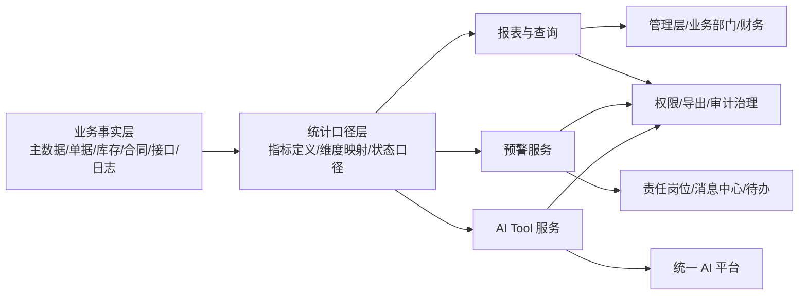

# 报表预警与 AI 能力概要设计（V0.1）

**版本：** V0.1
**日期：** 2026-04-24
**上位文档：** `00-概要设计总览-v0.1.md`、`01-总体架构与集成边界-v0.1.md`、`02-业务模块概要设计-v0.1.md`、`03-主数据与编码概要设计-v0.1.md`、`04-权限审批与审计概要设计-v0.1.md`、`05-NC接口与对账概要设计-v0.1.md`
**文档性质：** 概要设计专题文档

---

## 一、文档目的

本文档用于在概要设计阶段明确物资供应管理系统一期报表预警与 AI 能力的边界、分层、对象范围、权限控制和审计要求。

本文档重点回答：

- 一期至少应形成哪些基础报表、台账、查询和管理分析能力
- 预警规则应如何组织，怎样做到可配置、可解释、可闭环
- 统一 AI 入口接入时，本系统应开放哪些 Tool 能力以及如何受控调用
- 报表、预警、AI 查询、导出和审计之间如何共用一套数据口径与权限边界
- 哪些事项应在概要设计阶段明确，哪些留到详细设计、原型设计和实施联调阶段继续细化

本文档不直接固化最终 BI 产品选型、物理统计表结构、缓存策略、页面布局、图表样式、消息模板文案和 Prompt 细节。

本文档是概要设计阶段报表预警与 AI 能力的权威边界文件；模块文档、权限文档和 AI 附件中的相关描述只保留必要引用，不重复维护本文件中的设计细节。

---

## 二、设计依据

| 文档 | 作用 |
| --- | --- |
| `docs/需求梳理/06-模块功能清单（需求沟通版）-V1.0.md` | 明确模块十四“报表预警与查询分析”和模块十五“系统管理与基础支撑”范围 |
| `docs/需求梳理/07-角色权限与审批矩阵-V1.0.md` | 明确管理查询角色、导出权限、高敏感控制和跨组织查看边界 |
| `docs/需求梳理/11-报审需求来源对照表-V1.0.md` | 明确报表统计、预警、导出留痕和 AI 能力开放已纳入一期正式范围 |
| `docs/招标/物资供应管理系统招标技术要求-v1.1.md` | 明确第九章报表预警与查询要求、第十一章统一 AI 入口接入要求和验收边界 |
| `docs/招标/附件五-AI接入能力要求及验收条款-v1.1.md` | 明确 8 类最低能力开放范围、Tool 要求、联调交付物和验收项 |
| `docs/概要设计/03-主数据与编码概要设计-v0.1.md` | 明确报表统计维度、主数据权威来源、编码和映射关系 |
| `docs/概要设计/04-权限审批与审计概要设计-v0.1.md` | 明确报表、导出、AI 查询、异常日志和审计日志的一致控制要求 |
| `docs/概要设计/05-NC接口与对账概要设计-v0.1.md` | 明确接口状态、失败清单、映射缺失、对账差异和月结数据边界 |
| `docs/集团统筹/集团业务系统统一建设原则-V2.0.md` | 约束统一身份、统一接口、日志审计、私有化部署和 AI 入口接入方式 |

---

## 三、设计原则

### 3.1 先统一口径，再呈现图表

报表和 AI 查询首先要解决“口径一致”，然后才是展示形式。库存、计划、合同、供应商、接口状态、付款、设备租赁等指标必须来自受控业务事实，不能由各报表页面各自计算出不同结果。

### 3.2 报表、预警、AI 同源

报表、预警和 AI 查询应共享同一套业务数据边界、统计维度和指标定义。不能出现人工查询看到的数据、报表看到的数据和 AI 返回的数据互相矛盾。

### 3.3 预警必须可解释、可闭环

每条预警都应说明来源对象、触发条件、阈值、命中时间、接收对象和解除条件。预警不是“红点提醒”，而是可追溯、可处理、可关闭的管理对象。

### 3.4 AI 只走受控业务接口

统一 AI 平台调用本系统能力时，只能通过标准业务 API / Tool 获取结构化结果，不得直接访问底层数据库，不得绕过本系统权限和日志体系。

### 3.5 查询、导出、AI 共用一套权限

同一用户在列表查询、报表穿透、Excel/PDF 导出和 AI 查询中，应遵循同一套组织范围、仓库范围、业务角色和敏感字段控制规则。

### 3.6 一期先固化基础能力

一期重点形成基础报表、基础预警、全流程追溯、受控导出和 8 类最低 AI Tool 能力。复杂经营驾驶舱、自由建模 BI、智能预测和自动决策可作为二期增强。

---

## 四、总体能力模型

一期报表预警与 AI 能力建议按“业务事实层、统计口径层、应用输出层、审计治理层”组织。

### 4.1 能力域划分

| 能力域 | 主要内容 | 一期关注点 |
| --- | --- | --- |
| 基础报表与台账 | 库存、收发存、采购入库、调拨、盘点、废旧处置、物料编码、接口状态等 | 先把台账和基础统计跑通 |
| 管理分析与追溯 | 价格趋势、计划完成率、周转率、履约率、合同执行、预支付汇总、发票审计、全流程追溯 | 形成管理闭环，不追求复杂 BI 平台 |
| 预警服务 | 低库存、超储、临期、合同到期、付款到期、接口失败、映射缺失、资质过期等 | 统一规则、统一接收、统一闭环 |
| AI Tool 服务 | 库存、出入库、采购到货、供应商、消耗分析、预警识别、合同付款、设备租赁查询 | 只读优先、结构化返回、可联调验收 |
| 导出与审计治理 | Excel/PDF 导出、在线打印、水印、导出留痕、AI 调用日志、异常日志 | 满足内控、审计和答疑需要 |

### 4.2 与其他专题的边界

| 主题 | 本文档边界 | 其他文档边界 |
| --- | --- | --- |
| 统计维度来源 | 说明哪些统计维度必须引用统一主数据 | 主数据对象和编码规则以 `03` 为准 |
| 权限与导出控制 | 说明报表、导出、AI 查询如何受控 | 角色、权限树和日志字段以 `04` 为准 |
| 接口失败和对账类指标 | 说明接口状态报表、失败告警、差异清单如何纳入报表预警 | 接口 ID、状态矩阵和对账规则以 `05` 为准 |
| AI 接入验收 | 说明 Tool 范围和受控边界 | 联调交付和验收条款以招标正文第十一章及附件五为准 |

---

## 五、报表体系概要设计

### 5.1 报表分层

一期报表建议按五层组织，避免简单堆叠查询页面。

| 层次 | 说明 | 典型输出 |
| --- | --- | --- |
| 明细台账层 | 直接反映业务事实和单据结果 | 库存余额表、调拨台账、合同执行台账 |
| 汇总统计层 | 按组织、仓库、供应商、物料、期间汇总 | 采购入库汇总表、领料汇总表、月度预支付汇总表 |
| 管理分析层 | 面向管理层的趋势、比率和结构分析 | 价格趋势图、计划完成率、周转率、履约率 |
| 追溯核查层 | 支撑审计、答疑、对账和异常排查 | 发票审计表、接口推送状态表、全流程追溯查询 |
| 可视化展示层 | 以看板和图表形式展示重点指标 | 关键预警看板、库存风险分布、合同风险分布 |

### 5.2 一期基础报表清单

一期至少纳入以下报表与台账能力，正式口径与招标正文第九章一致。

| 分类 | 报表/台账 | 主要统计维度 | 主要使用对象 |
| --- | --- | --- | --- |
| 库存与仓储 | 库存余额表、收发存报表、领料汇总表、调拨台账、盘点差异表、废旧处置台账 | 组织、仓库、物料、批次、期间 | 物资管理、仓库、审计 |
| 采购与计划 | 采购入库汇总表、计划完成率统计表、采购价格变动趋势表 | 组织、供应商、物料、时间、采购方式 | 采购、物资管理、管理层 |
| 主数据与规则 | 物料编码台账 | 分类、编码、状态、映射关系 | 主数据管理员、采购、仓库 |
| 财务接口与核查 | 接口推送状态表、暂估未冲销清单、发票审计表 | 组织、接口状态、业务单据、期间 | 财务、网信办、实施运维 |
| 库存风险 | 呆滞库存清单、火工品专项台账、安全专项物资台账 | 仓库、物料类别、使用单位、期间 | 物资管理、安全管理、管理层 |
| 合同与付款 | 合同执行台账、月度预支付汇总表 | 组织、供应商、合同、账期、付款节点 | 采购、财务、管理层 |
| 供应商、效率与租赁 | 物资周转率统计表、供应商履约率统计表、设备租赁费用汇总表 | 供应商、组织、设备、合同、期间 | 采购、设备管理、管理层 |

### 5.3 查询与穿透要求

报表设计不应停留在“看总数”，而应支持穿透到业务事实。

一期查询和穿透至少满足以下要求：

- 支持按组织、矿厂、部门、仓库、物料分类、物料编码、供应商、合同、期间、单据状态等多条件组合查询。
- 支持从汇总报表穿透到明细单据，再追溯到来源单据、审批、执行和接口状态。
- 支持物资全流程追溯查询，至少覆盖“需求提报 -> 采购计划 -> 招投标协同 -> 合同 -> 到货验收 -> 入库 -> 领用/调拨/盘点/处置 -> NC 接口”。
- 支持管理层查看汇总和趋势，业务人员查看明细和可执行对象，财务人员查看接口和核查对象。
- 支持在线打印、Excel 导出、PDF 导出，但导出边界必须受控。

### 5.4 指标刷新与统计口径原则

概要设计阶段只固化刷新原则，不固化最终实现方案。

| 类型 | 口径要求 | 刷新原则 |
| --- | --- | --- |
| 台账类报表 | 直接反映业务事实和当前状态 | 以在线查询为主，随业务状态变化更新 |
| 接口状态类 | 区分业务状态、接口状态、财务状态、期间状态 | 与接口任务和回执同步更新 |
| 趋势分析类 | 使用受控统计口径，不允许页面端自行拼算 | 可按定时任务或增量统计刷新 |
| 比率指标类 | 需明确分子、分母、口径期间和异常值处理 | 在详细设计阶段固化公式和统计周期 |
| 看板图表类 | 引用上层已定义指标，不另起口径 | 支持管理层快速查看和异常穿透 |

### 5.5 一期与二期边界

一期报表重点是“基础可用、口径统一、可导出、可审计、可追溯”。以下内容不作为一期必须交付的验收前提：

- 自由建模式 BI 平台
- 超复杂驾驶舱场景编排
- 跨多个集团级系统的统一经营分析中台
- 智能预测补货、自动原因归因、自动决策推荐

---

## 六、预警模型概要设计

### 6.1 预警对象模型

预警建议作为独立业务对象管理，而不是散落在各模块页面提示中。

| 要素 | 说明 |
| --- | --- |
| 预警来源 | 来源单据、主数据对象、统计指标或接口事件 |
| 预警规则 | 触发条件、阈值、判定窗口、适用组织、例外条件 |
| 预警等级 | 建议至少区分提示、一般、重要、紧急四级 |
| 接收对象 | 按组织、岗位、角色、责任人、业务归口配置 |
| 通知方式 | 一期至少支持站内消息、消息中心、待办提醒；可预留统一消息平台对接 |
| 处理状态 | 新增、已确认、处理中、已解除、人工关闭等闭环状态 |
| 审计字段 | 命中时间、命中规则、处理人、处理意见、关闭原因 |

### 6.2 一期基础预警清单

一期至少纳入以下基础预警，正式口径与招标正文第九章一致。

| 预警类型 | 来源对象 | 触发基础 | 默认接收对象 | 处理关注点 |
| --- | --- | --- | --- | --- |
| 低库存预警 | 库存台账 | 低于安全库存 | 供应科、库管 | 是否补货、是否调整计划 |
| 超储预警 | 库存台账 | 超过库存上限 | 物资管理 | 是否压降采购、是否调拨消化 |
| 临期/过期预警 | 批次库存 | 距保质期到期达到阈值 | 库管、物资管理 | 是否优先发放、是否处置 |
| 呆滞预警 | 出入库记录 | 超过设定周期未出库 | 物资管理 | 是否清理、调拨、停采 |
| 合同到期提醒 | 合同台账 | 距到期日达到阈值 | 采购、物资管理 | 是否续签、收尾或终止 |
| 付款到期提醒 | 付款计划 | 距付款节点达到阈值 | 财务 | 是否发起审批、核对条件 |
| 设备租赁到期提醒 | 租赁执行单 | 距计划退租日达到阈值 | 设备管理、使用单位 | 是否续租或退租 |
| 设备租赁超期未退预警 | 租赁执行单 | 超过计划退租日仍在租 | 设备管理、使用单位 | 是否异常占用、责任追踪 |
| 设备租赁异常停租预警 | 租赁执行单 | 停租后超时未续租或退租 | 设备管理 | 是否流程中断或数据遗漏 |
| 接口失败告警 | 接口任务 | 推送或回执失败 | 网信办、财务 | 是否重推、是否人工补偿 |
| 映射缺失告警 | 主数据映射 | 物料或组织映射缺失 | 物资管理、网信办 | 是否补齐映射后再推送 |
| 资质过期提醒 | 供应商/物资资质 | 距到期日达到阈值 | 采购、物资管理 | 是否暂停采购或更新资质 |

### 6.3 预警状态流转

预警状态必须与业务事实、处理动作分层维护，不能因为页面“已读”就视为问题已经解决。

| 状态 | 含义 | 典型动作 |
| --- | --- | --- |
| 新增 | 规则首次命中，尚未确认 | 自动生成预警记录并通知责任人 |
| 已确认 | 责任人已查看并确认接手 | 记录确认人和确认时间 |
| 处理中 | 已形成处理动作，但未完全消除风险 | 记录处理措施、预计完成时间 |
| 已解除 | 触发条件已消失 | 自动或人工校验后关闭 |
| 人工关闭 | 业务确认不再继续处理 | 必须填写关闭原因并留痕 |

### 6.4 预警治理原则

- 预警规则应支持按组织、仓库、物料类别、供应商、合同类型等维度配置。
- 同一业务事实连续命中时，应避免重复轰炸，但不能丢失升级轨迹。
- 预警解除应优先依赖业务事实恢复，不建议纯手工删除。
- 高敏感预警的人工关闭、批量关闭和规则停用应纳入权限和审计控制。
- 预警处理记录应可作为管理复盘、审计取证和 AI 异常识别的数据来源。

---

## 七、AI Tool 能力概要设计

### 7.1 一期 AI 能力定位

一期 AI 能力定位为“统一入口下的受控查询、分析、预警识别和追溯辅助”，不定位为自动审批或自动执行引擎。

设计边界如下：

- AI 平台通过标准 Tool 调用本系统能力，不直接访问数据库。
- AI 返回结果必须基于当前登录用户或映射用户身份的权限范围。
- 一期以只读查询和分析为主，不开放审批、反结、重推、付款、黑名单解除等高风险自动执行能力。
- Tool 返回结果应以结构化数据为主，便于统一 AI 平台二次组织摘要、明细展示和多轮追问。

### 7.2 一期最低 Tool 清单

一期至少开放以下 8 类最低 Tool 能力，正式口径与招标正文第十一章及附件五一致。

| Tool 编号 | Tool 名称 | 对应能力 | 主要输入 | 主要输出 | 权限控制基础 |
| --- | --- | --- | --- | --- | --- |
| AI-001 | 库存查询 Tool | 查询当前库存、可用量、批次、低库存状态 | 组织、仓库、物料、批次、时间点 | 汇总库存、批次明细、预警标识 | 组织范围、仓库范围、物料可见范围 |
| AI-002 | 出入库查询 Tool | 查询入库、领用、退料、调拨、盘点等记录 | 单据类型、组织、仓库、物料、时间区间 | 单据列表、数量汇总、状态摘要 | 组织范围、仓库范围、业务单据权限 |
| AI-003 | 采购与到货查询 Tool | 查询采购计划、招采结果、到货和入库执行情况 | 计划号、供应商、物料、时间区间、执行状态 | 执行摘要、到货明细、未到货清单 | 采购范围、组织范围、供应商范围 |
| AI-004 | 供应商查询 Tool | 查询供应商档案、资质、履约和黑名单状态 | 供应商、类别、资质状态、时间区间 | 基础档案、资质状态、履约指标 | 供应商范围、敏感字段权限 |
| AI-005 | 领用与消耗分析 Tool | 查询领用趋势、消耗结构和单位使用情况 | 组织、使用单位、物料类别、时间区间 | 消耗趋势、对比统计、异常提示 | 组织范围、使用单位范围、成本中心范围 |
| AI-006 | 预警与异常识别 Tool | 汇总风险预警、接口失败、资质到期等异常 | 组织、预警类型、时间区间、等级 | 预警清单、等级分布、处理状态 | 预警可见范围、组织范围 |
| AI-007 | 合同与付款查询 Tool | 查询合同执行、账期、付款计划和实际回写 | 合同号、供应商、组织、时间区间 | 合同摘要、付款节点、风险标识 | 合同范围、金额敏感字段权限 |
| AI-008 | 设备与设备租赁查询 Tool | 查询设备状态、租赁执行、费用汇总和异常 | 设备、组织、供应商、时间区间 | 设备状态、租赁明细、费用摘要 | 设备范围、组织范围、合同范围 |

### 7.3 Tool 设计要求

每项 Tool 在详细设计阶段至少应继续细化以下内容：

| 设计项 | 说明 |
| --- | --- |
| 功能说明 | 明确该 Tool 回答什么问题，不回答什么问题 |
| 输入参数 | 结构化参数、参数类型、是否必填、默认值和取值范围 |
| 输出结构 | 汇总字段、明细数组、分页信息、来源单号、异常提示 |
| 错误返回 | 参数错误、权限不足、数据不存在、结果过大、系统异常等统一错误码 |
| 数据范围 | 明确组织、仓库、供应商、合同、敏感字段等过滤规则 |
| 审计日志 | 记录调用人、Tool、参数、数据范围、返回摘要、耗时和结果状态 |

### 7.4 AI 结果控制原则

- 结果应优先返回结构化数据，再由统一 AI 平台生成自然语言摘要。
- 返回结果应包含必要的时间范围、过滤条件和来源对象标识，避免“只给结论不给依据”。
- 对价格、合同金额、付款金额等敏感字段，应按角色控制是否展示原值、脱敏值或仅给出区间提示。
- 当结果条数过大时，应优先返回汇总、Top N、分页或“需缩小范围”的受控提示，不允许无限量导出。
- AI 查询本身不等同于导出，若需要导出完整清单，仍应走系统内受控导出能力。

### 7.5 与统一 AI 平台的边界

| 内容 | 本系统边界 |
| --- | --- |
| 身份来源 | 使用统一身份或映射身份调用，本系统负责权限校验 |
| 数据访问 | 统一 AI 平台只调用 Tool，不直接访问数据库 |
| 结果生成 | 本系统负责提供结构化结果，统一 AI 平台负责对话组织和编排 |
| 高风险动作 | 审批、重推、反结、付款、删除、批量导出不作为一期 AI 自动执行范围 |
| 联调验收 | 提供接口文档、字段说明、示例报文、测试账号和联调记录 |

---

## 八、权限、导出与审计控制

### 8.1 权限控制原则

报表、预警、导出和 AI 查询必须共用同一套权限骨架，具体角色和权限树以 `04-权限审批与审计概要设计-v0.1.md` 为准。

| 控制维度 | 设计要求 |
| --- | --- |
| 组织范围 | 控制能看哪些集团、矿厂、部门和使用单位数据 |
| 仓库范围 | 控制能看哪些仓库、库区、货位和库存对象 |
| 业务对象范围 | 控制供应商、合同、设备、租赁、接口任务等对象可见范围 |
| 敏感字段 | 控制价格、合同金额、付款金额、成本口径等字段展示方式 |
| 导出权限 | 控制是否允许导出、可导出何种范围、是否需额外审批 |
| AI 查询权限 | AI Tool 调用必须继承用户当前权限，不得放大查询范围 |

### 8.2 导出控制要求

一期导出能力应满足“可用”与“受控”并重。

- 支持 Excel、PDF 和在线打印等基础输出方式。
- 导出范围、导出字段、导出次数和大批量导出应纳入权限控制。
- 敏感导出应支持水印、导出日志或等效追踪机制。
- 跨组织、跨仓库、大范围明细或含敏感金额字段的导出，建议预留二次确认或审批扩展能力，具体阈值在详细设计阶段确定。
- AI 查询结果若转为正式导出，应回到业务系统内执行受控导出，不由 AI 平台直接生成可外发文件。

### 8.3 审计留痕要求

| 审计对象 | 关键留痕要求 |
| --- | --- |
| 报表查询 | 记录查询人、查询条件、时间范围、结果量级 |
| 报表导出 | 记录导出人、导出范围、导出字段、导出文件标识、导出时间 |
| 预警处理 | 记录命中规则、处理人、处理意见、处理结果、关闭原因 |
| AI 调用 | 记录调用人、Tool、参数、数据范围、结果摘要、异常信息 |
| 高敏感查询 | 对价格、付款、合同金额、大范围导出等动作加强留痕 |

---

## 九、后续详细设计输入

报表预警与 AI 能力概要设计完成后，详细设计阶段应继续细化以下内容：

| 内容 | 说明 |
| --- | --- |
| 报表清单字段定义 | 明确每张报表的字段、排序、汇总规则、穿透对象和导出口径 |
| 指标公式与统计周期 | 明确计划完成率、周转率、履约率、价格趋势等公式和统计周期 |
| 看板与图表布局 | 明确管理层看板、业务看板、异常看板的展示方案 |
| 预警阈值与接收模板 | 明确默认阈值、升级规则、接收对象、消息模板和停用策略 |
| Tool API 规格 | 明确 8 类 Tool 的接口协议、参数定义、错误码和示例报文 |
| 性能与缓存策略 | 明确大报表、跨期间统计、分页查询和 AI 并发调用的性能方案 |
| 导出控制细则 | 明确导出水印模板、脱敏规则、审批阈值和文件留存策略 |
| 测试与验收用例 | 覆盖报表准确性、权限隔离、预警触发、Tool 调用、日志审计和异常处理 |

---

## 十、一句话结论

报表、预警与 AI 能力的核心不是多做几个图表和问答接口，而是用统一口径、统一权限、统一审计把“看得见、查得准、问得到、追得回”真正做成系统能力。后续详细设计应先固化报表字段口径、预警阈值、Tool 规格和导出控制，再进入页面与接口实现。
