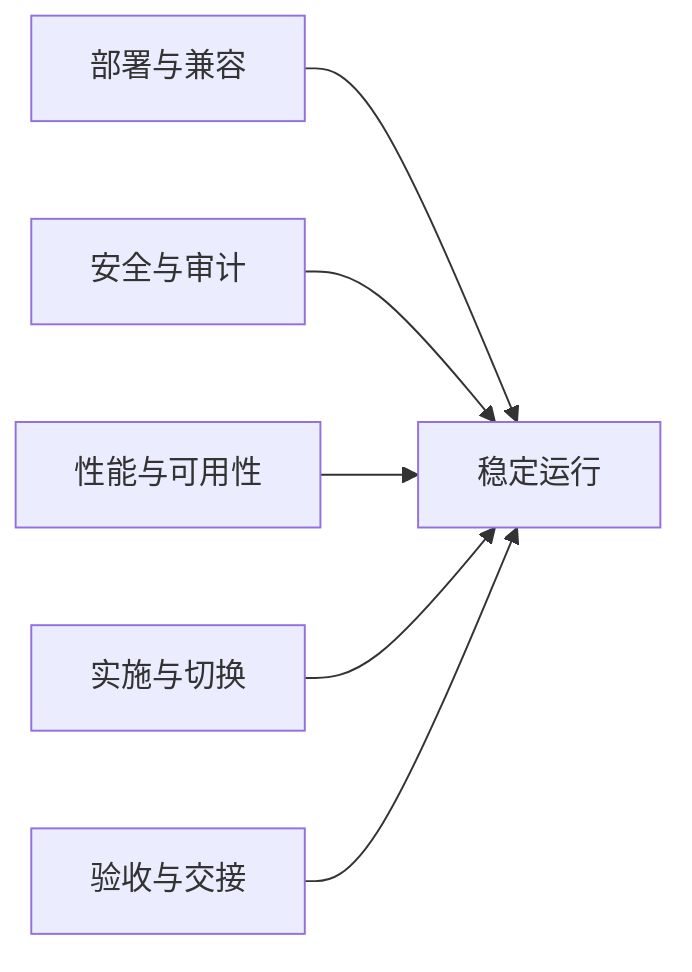

# 非功能与实施约束概要设计（V0.1）

**版本：** V0.1
**日期：** 2026-04-24
**上位文档：** `00-概要设计总览-v0.1.md`、`01-总体架构与集成边界-v0.1.md`、`02-业务模块概要设计-v0.1.md`、`03-主数据与编码概要设计-v0.1.md`、`04-权限审批与审计概要设计-v0.1.md`、`05-NC接口与对账概要设计-v0.1.md`、`06-报表预警与AI能力概要设计-v0.1.md`
**文档性质：** 概要设计专题文档

---

## 一、文档目的

本文档用于在概要设计阶段明确物资供应管理系统一期建设中的非功能基线、实施约束、数据迁移、试运行、正式切换、验收支撑和运维交接要求。

本文档重点回答：

- 一期系统在部署、信创、安全、性能、可用性和运维可控方面至少应达到什么基线
- 实施阶段应按什么组织方式、分批策略和阶段门推进，避免“需求没稳就直接开发”
- 历史数据治理、初始化导入、并行运行、关键数据比对、正式切换和回退应如何受控
- 验收应围绕哪些对象展开，哪些交付物必须在验收前准备齐全
- 哪些事项应在概要设计阶段先明确，哪些留到详细设计、环境准备和实施配置阶段落地

本文档不直接固化最终硬件资源清单、监控产品选型、数据库实例参数、部署脚本、网络策略细项和具体项目人员名单。

本文档是概要设计阶段非功能与实施约束的权威边界文件；其他文档仅保留必要引用，不重复维护本文件中的基线要求。

---

## 二、设计依据

| 文档 | 作用 |
| --- | --- |
| `docs/集团统筹/集团业务系统统一建设原则-V2.0.md` | 明确私有化部署、信创适配、安全可控、实施联调、验收和运维最小合规要求 |
| `docs/需求梳理/01-项目目标与范围说明-V1.0.md` | 明确项目实施重点、成功标准和一期建设目标 |
| `docs/需求梳理/09-实施路径与阶段计划-V1.0.md` | 明确九阶段推进路径、分批交付策略、试运行、上线和验收节奏 |
| `docs/招标/物资供应管理系统招标技术要求-v1.1.md` | 明确第十章技术与部署要求、第十二章数据初始化与迁移要求、第十三章实施培训与上线支持要求、第十四章验收要求、第十五章运维与售后要求 |
| `docs/概要设计/01-总体架构与集成边界-v0.1.md` | 明确独立部署、低耦合集成、接口治理和运行边界 |
| `docs/概要设计/04-权限审批与审计概要设计-v0.1.md` | 明确日志审计、高敏感控制和权限配置边界 |
| `docs/概要设计/05-NC接口与对账概要设计-v0.1.md` | 明确接口联调、异常补偿、对账和封账要求 |
| `docs/概要设计/06-报表预警与AI能力概要设计-v0.1.md` | 明确报表、预警、AI 接入的性能、导出、联调和验收支撑边界 |

---

## 三、设计原则

### 3.1 独立部署、全程可控

系统必须以私有化、独立数据库、统一日志审计和可持续运维为前提设计，不引入上线后无法被招标方控制和审计的关键依赖。

### 3.2 先跑通闭环，再做复杂优化

一期优先保障库存业务闭环、NC 财务联动、统一权限接入、基础报表预警和 AI 接入可用，不以复杂大屏、复杂 BI 或高度自动化运维作为上线前提。

### 3.3 先治理数据，再切换系统

历史物料、单位、分类、映射和期初库存未整理清楚时，不应直接推进正式切换。主数据质量是上线稳定性的前置条件，不是上线后的补救事项。

### 3.4 先试运行验证，再正式上线

系统上线前必须经过真实业务场景试运行、关键数据比对、接口稳定性验证和问题闭环，不允许跳过并行运行或以“上线后再看”为主要策略。

### 3.5 分批交付，但总体设计一次完成

一期可以按核心批和扩展批分批实施、分批试运行，但数据模型、接口设计、权限骨架和总体部署方案不应分裂成两套。

### 3.6 验收以可运行、可追溯、可交接为核心

验收不只看页面是否做出来，还应覆盖闭环业务、接口联调、数据质量、日志审计、迁移比对、文档交付、培训效果和运维交接。

---

## 四、非功能基线模型

一期非功能与实施约束建议按“部署与兼容、安全与审计、性能与可用性、实施与切换、验收与交接”五类组织。

### 4.1 基线分类

| 类别 | 范围 | 一期关注点 |
| --- | --- | --- |
| 部署与兼容 | 私有化部署、信创数据库、国产操作系统、浏览器和多端适配 | 保证环境可落地、后续可迁移 |
| 安全与审计 | 统一身份、权限、敏感数据控制、日志、导出留痕、备份恢复 | 满足集团统一治理和审计要求 |
| 性能与可用性 | 响应时间、接口时效、可用性、任务稳定性、监控告警 | 满足日常业务高峰和月末关键场景 |
| 实施与切换 | 数据治理、初始化、联调、并行运行、切换和回退 | 降低上线和替换旧系统风险 |
| 验收与交接 | 功能、接口、数据、AI、报表、文档、培训、售后 | 避免项目“验完即失控” |

---

## 五、部署、兼容与安全基线

### 5.1 部署与信创要求

| 项目 | 基线要求 |
| --- | --- |
| 部署方式 | 私有化部署，部署在招标方指定数据中心或机房，不接受纯 SaaS 公有云形态 |
| 数据库 | 采用 PostgreSQL 兼容国产信创数据库，独立部署，不与集团平台共库 |
| 操作系统 | 至少支持一类国产 Linux 环境 |
| 中间件 | 支持国产中间件或可控开源中间件 |
| 浏览器 | 兼容主流国产浏览器和常用办公浏览器 |
| 终端形态 | PC 端为主，移动端至少覆盖领料申请、审批、库存查询、扫码等高频场景 |
| 集成标准 | 正式对外接口采用 API + JSON，优先 HTTPS |

### 5.2 安全与可控要求

| 项目 | 基线要求 |
| --- | --- |
| 身份与权限 | 接入统一身份体系，至少实现 SSO，权限与数据范围受控 |
| 敏感数据 | 价格、合同金额、付款金额等按角色控制可见性，必要时脱敏展示 |
| 导出控制 | 按角色、岗位、组织控制导出权限，敏感导出单独留痕 |
| 文件追踪 | 重要导出文件支持水印、导出日志或等效追踪机制 |
| 高风险动作 | 补录、反结、接口重推、大范围导出、规则停用等动作必须可审计 |
| 关键依赖 | 不引入无法审计、无法持续运维或无法在私有化环境受控运行的关键依赖 |

### 5.3 备份、恢复与运维可控

一期至少应具备以下运维控制能力：

- 应具备数据库备份与恢复能力，并纳入运维交接范围。
- 应具备操作日志、接口日志、异常日志和运行日志的统一留痕能力。
- 应具备监控、告警、巡检和故障处置的基础机制。
- 应具备补丁管理、版本升级、性能优化和问题追踪的基本流程。
- 具体备份频率、恢复点目标、监控工具选型和告警阈值在详细设计和环境准备阶段确定。

---

## 六、性能、可用性与运行约束

### 6.1 一期性能基线

正式口径以招标正文第十章为基准，概要设计阶段先固化以下非功能指标。

| 指标 | 一期基线 |
| --- | --- |
| 并发用户数 | 不低于 200 人，详细容量按实际组织规模复核 |
| 单据操作响应时间 | 小于等于 3 秒 |
| 报表查询响应时间 | 小于等于 5 秒 |
| 接口推送时效 | 准实时场景下小于等于 30 秒 |
| 系统可用性 | 不低于 99.5% |

### 6.2 运行稳定性要求

- 核心业务和接口任务应支持失败重试、人工补偿和异常追踪。
- 月末暂估、冲销、对账和结账场景应作为性能与稳定性重点验证对象。
- 报表、预警和 AI 查询不得绕过统一权限和日志机制换取性能。
- 高峰期应优先保障单据处理、接口回执和关键查询稳定，复杂统计和大范围导出可采取分页、异步或限流策略。

### 6.3 详细设计待补项

以下内容在概要设计阶段不写死，但在详细设计前必须明确：

| 内容 | 建议处理时点 |
| --- | --- |
| 服务器和数据库资源 sizing | 环境准备阶段 |
| 接口任务并发和队列策略 | 详细设计阶段 |
| 报表缓存与统计刷新策略 | 详细设计阶段 |
| 备份频率、恢复演练节奏 | 运维方案阶段 |
| 监控指标、告警阈值和告警渠道 | 运维方案阶段 |

---

## 七、数据初始化、迁移与并行运行约束

### 7.1 历史数据治理边界

上线前必须将历史数据治理视为正式工作包，而不是实施过程中的顺带动作。

| 对象 | 治理重点 |
| --- | --- |
| 物料主数据 | 重复编码清理、分类补齐、单位统一、停用口径统一 |
| NC 映射 | 若 NC 已落地，校验物料与 NC 存货映射、组织与核算组织映射、成本中心映射完整性；若 NC 未落地，先校验映射字段、状态、配置入口和接口启停控制 |
| 仓储数据 | 仓库、库区、货位和组织归属关系整理 |
| 供应商与合同 | 关键供应商、合同基础信息和履约关联对象清理 |
| 期初库存 | 账面数量、批次、单位、金额；若 NC 已落地并启用财务接口，还应校验与 NC 对账一致性 |

### 7.2 初始化导入要求

- 上线前应完成主数据、已落地映射关系和期初库存的初始化导入；若 NC 未落地，则先完成 NC 映射配置模型和状态控制准备。
- 导入必须有模板、校验规则、导入日志和失败明细，不接受不可追溯的人工散改。
- 映射完整性校验必须在正式推送 NC 前完成；若 NC 未落地，正式切换前至少应完成映射字段、状态、配置入口和接口开关校验。
- 导入后的结果必须经过抽样核对和关键对象全量校验。

### 7.3 并行运行与比对要求

一期应保留新旧系统并行运行安排，至少覆盖关键业务和关键数据对象；退出条件以 `docs/需求梳理/13-并行运行退出条件表-V1.0.md` 为准。

| 比对对象 | 比对重点 | 建议节奏 |
| --- | --- | --- |
| 主数据 | 编码、分类、单位、映射完整性 | 上线前集中比对 |
| 库存数据 | 库存余额、批次、收发存结果 | 日核对/周核对 |
| 接口数据 | 凭证推送、回执状态、暂估和冲销结果 | 日核对 |
| 报表结果 | 库存、收发存、盘点、呆滞、预支付等关键报表口径 | 周核对 |
| 扩展链路 | 计划、招投标、合同、付款、设备租赁和 AI 接入结果 | 扩展批试运行期间专项核对 |

### 7.4 迁移与并行运行原则

- 真实单据必须在试运行阶段跑通主要业务闭环，不能只做静态演示。
- 并行运行期间的差异、整改和确认结论必须形成记录，作为上线决策依据。
- 未完成关键映射和关键数据比对前，不应进入全量正式切换。
- 数据问题必须优先在正式上线前解决，不把结构性脏数据带入生产运行。

---

## 八、实施组织与分批交付约束

### 8.1 实施组织要求

| 角色 | 主要职责 |
| --- | --- |
| 网信办/信息化 | 统筹项目推进、环境协调、接口协调、实施管理、阶段门组织 |
| 物资业务部门 | 确认主数据、流程、单据、试运行范围和业务验收口径 |
| 财务部门 | 确认 NC 映射、财务口径、接口联调、对账和数据验收 |
| 各矿物资部门/仓库 | 提供基层业务口径、试运行支撑、差异核对和上线反馈 |
| 供应商/实施方 | 负责系统建设、实施配置、开发、联调、培训、上线支持和交付文档 |

### 8.2 分批交付约束

一期实施可采用“核心批 + 扩展批”策略，但应遵守以下约束：

- 招标范围不分批，仍按一期整体范围进行报价和交付承诺。
- 数据模型不分批，深化设计阶段应一次性完成一期数据模型和接口模型设计。
- 核心批优先保障“主数据 -> 库存业务 -> NC 接口 -> 基础报表预警 -> 系统管理”闭环稳定。
- 扩展批在核心批稳定基础上推进采购计划、招投标、合同、资金计划、供应商、设备租赁、AI 接入增强等能力。
- 扩展批上线前提是核心批已稳定运行且无重大未闭环风险。

### 8.3 实施阶段输出物

实施阶段至少应形成以下成果：

| 阶段 | 关键输出物 |
| --- | --- |
| 深化设计与准备 | 实施方案、详细需求/原型说明、接口设计说明、权限与流程配置方案、数据初始化方案、培训计划 |
| 核心批实施 | 已实施系统环境、核心批测试记录、NC 联调记录、初始化数据台账、问题整改记录 |
| 扩展批实施 | 扩展批测试记录、AI 联调与 Tool 注册记录、跨模块联动测试记录、问题整改记录 |
| 试运行与上线 | 并行运行比对记录、试运行日报/周报、上线切换方案、回退预案、护航支持记录 |

深化设计成果须经招标方确认后，方可进入正式开发、配置和联调阶段。

---

## 九、试运行、切换与回退约束

### 9.1 试运行进入条件

进入试运行前，至少应确认：

- 关键模块已实施完成并完成基础测试。
- 主数据和已落地映射已完成基础导入和校验；若 NC 未落地，则 NC 映射配置模型和接口启停边界已完成校验。
- 已具备条件的 NC 接口、统一权限和必要外部对接已完成基本联调；暂未落地的 NC 场景应明确人工替代路径和后续补联调计划。
- 核心问题已有分级和整改计划，不存在阻断性缺陷。

### 9.2 正式切换要求

| 项目 | 切换要求 |
| --- | --- |
| 上线窗口 | 事先确认上线窗口和切换步骤，不做临时性随意切换 |
| 数据准备 | 完成主数据和期初数据最终导入，并保留导入记录 |
| 接口切换 | 统一安排已落地接口的切换时点、校验方式和回执确认方式；NC 未落地场景应明确接口开关关闭、人工替代路径和后续补联调计划 |
| 培训支持 | 至少完成两轮培训（上线前 + 上线后），并保留培训签到和材料 |
| 护航周期 | 至少覆盖首周、首月以及招标要求的 3 个月运行保障期 |

### 9.3 回退约束

回退不是失败预设，而是正式切换前必须明确的受控预案。

回退方案至少应明确：

- 回退触发条件，如核心业务阻断、关键数据严重偏差、接口不可恢复异常等。
- 回退决策责任人和审批机制。
- 数据回退、接口回退、业务通知和用户操作冻结的具体步骤。
- 回退后差异数据补录和重新切换的处理路径。

---

## 十、验收、交接与售后约束

### 10.1 验收范围

概要设计阶段建议将验收对象按六类组织。

| 验收类别 | 主要内容 |
| --- | --- |
| 功能验收 | 十五大模块核心功能、核心流程、审批执行和关键业务闭环 |
| 接口验收 | 已落地 NC 接口、异常处理、重推、月末暂估/冲销、招采平台协同边界；NC 未落地场景验收配置模型、接口开关、人工替代路径和后续补联调计划 |
| 数据验收 | 主数据导入、映射校验、期初库存对账、并行运行差异可追溯；NC 未落地时重点验收配置模型、状态控制和接口启停边界 |
| 报表与 AI 验收 | 报表清单、预警触发、数据口径、8 类 AI 能力接入、Tool 注册验证 |
| 文档与培训验收 | 用户手册、管理手册、接口文档、培训材料、数据字典、培训记录 |
| 运维交接验收 | 日志、监控、备份恢复、问题分级响应、升级和巡检交接 |

### 10.2 必交付文档清单

系统验收前，至少应交付以下文档：

- 用户手册/操作指南
- 系统管理手册
- 接口文档
- 培训材料
- 数据字典
- 测试记录与联调记录
- 数据初始化和迁移记录
- 上线切换方案与回退预案
- 运行保障和问题处理记录

### 10.3 售后与运维交接基线

| 项目 | 基线要求 |
| --- | --- |
| 质保期 | 验收合格后不少于 1 年免费质保 |
| 上线支持 | 上线首月驻场支持 |
| 运行保障 | 上线后至少 3 个月运行保障期 |
| 响应机制 | 紧急、严重、一般、建议问题应有分级响应和解决时限 |
| 巡检维护 | 原则上每季度至少一次巡检，并纳入记录 |
| 升级策略 | 明确后续版本升级、补丁管理和配合方式 |

### 10.4 问题分级响应基线

| 问题级别 | 响应时间 | 解决时间 |
| --- | --- | --- |
| 紧急（系统不可用） | 30 分钟 | 4 小时 |
| 严重（核心功能异常） | 2 小时 | 8 小时 |
| 一般（非核心功能异常） | 4 小时 | 2 个工作日 |
| 建议（优化类） | 1 个工作日 | 协商确定 |

---

## 十一、后续详细设计输入

非功能与实施约束概要设计完成后，详细设计和实施准备阶段应继续细化以下内容：

| 内容 | 说明 |
| --- | --- |
| 环境与资源清单 | 明确服务器、数据库、中间件、网络和存储资源配置 |
| 部署实施方案 | 明确拓扑、安装步骤、发布流程、环境隔离和切换方案 |
| 监控与巡检方案 | 明确监控指标、告警规则、巡检清单和故障升级流程 |
| 备份恢复方案 | 明确备份频率、恢复流程、演练节奏和责任分工 |
| 数据迁移方案 | 明确模板、校验规则、导入步骤、回滚和复核机制 |
| 阶段门清单 | 明确试运行、上线、验收各阶段门的进入与退出条件 |
| 培训与交接方案 | 明确培训对象、轮次、教材、签到和考核方式 |
| 验收用例库 | 覆盖功能、接口、数据、报表、AI、日志、回退和运维交接场景 |

---

## 十二、一句话结论

非功能与实施约束设计的核心不是补几条性能或售后指标，而是提前把“能不能稳、怎么迁、怎么切、怎么验、谁来接”这些真正决定项目成败的边界先锁住。后续详细设计应先把环境、迁移、阶段门、回退和交接方案落细，再推进全面实施。
