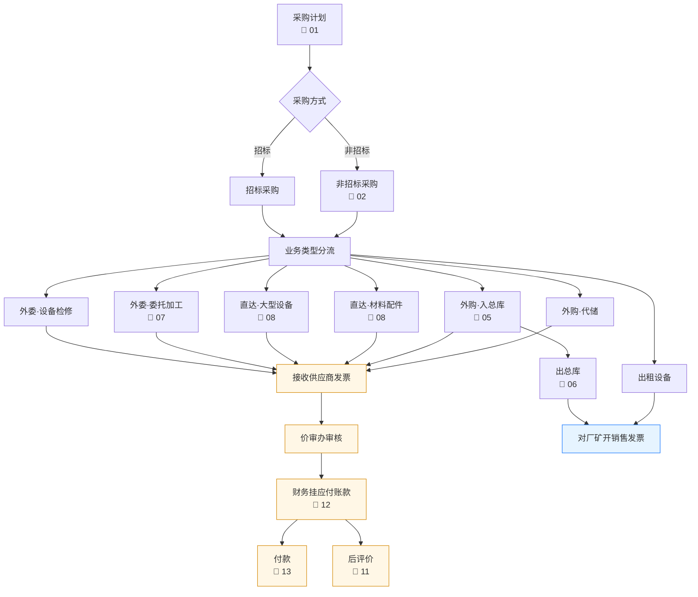
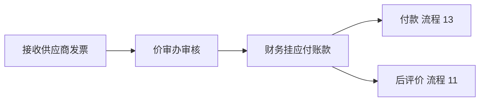

# 采购、供应内控总体框架（业务地图）

> **来源：** `docs/流程调研/调研原文档/0.内控总体框架图（12月修订）.docx`
> **性质：** 这是一张**业务地图**（不是流程图），把所有子流程在整体中的位置串起来；其他 13 张流程图（流程图 1-13）都是它的子流程。
> **用途：** 作为流程调研目录的索引页。

---

## 总体框架

> **图例：** 📄 后跟数字 = 对应流程调研子文档编号

---

## 一、采购方式（顶层分流）

| 方式 | 触发条件 | 子流程 |
|---|---|---|
| **招标采购** | 满足招标条件（金额阈值、政策要求） | 流程 02 内含招标分支 |
| **非招标采购** | 不满足招标条件 / 询比采购 | [02-采购方式流程.md](02-采购方式流程.md) |

> 调研1（设备采购流程）已对该判断分支做了详细描述：>100 万触发集团领导审批 + 招投标管理中心；<100 万走能源招投标网站公开采购。

## 二、业务类型分流（7 类）

| # | 业务类型 | 关键调研文档 | 详设落点 |
|---|---|---|---|
| 1 | **外委·设备检修** | (无独立流程图，并入流程 12 财务账) | 详设 02 业务类型 = 外委检修 |
| 2 | **外委·委托加工** | [07-委托加工流程.md](07-委托加工流程.md) | 详设 02 业务类型 = 委托加工 |
| 3 | **直达·大型设备** | [08-直达使用单位流程.md](08-直达使用单位流程.md)；调研1 全链路 | 详设 02 业务类型 = 直达·设备 |
| 4 | **直达·材料配件** | [08-直达使用单位流程.md](08-直达使用单位流程.md) | 详设 02 业务类型 = 直达·材料 |
| 5 | **外购·入总库** | [05-采购入总库流程.md](05-采购入总库流程.md) | 详设 06 入库管理 |
| 6 | **外购·代储** | (并入流程 12 财务账分支 4) | 详设 02 业务类型 = 代储 |
| 7 | **出租设备** | (本图唯一来源；其他流程图未涵盖) | **疑似一期不实施** — 待详设确认 |

## 三、出库环节

- **出总库** → 厂矿（对应 [06-出总库流程.md](06-出总库流程.md)）
- 出总库后**对厂矿开销售发票**（销售侧账）

## 四、财务路径（共性收口）

| 节点 | 子流程 |
|---|---|
| 财务挂应付账款 | [12-采购供应入财务账流程.md](12-采购供应入财务账流程.md) |
| 付款 | [13-支付采购款流程.md](13-支付采购款流程.md) |
| 后评价 | [11-后评价流程.md](11-后评价流程.md) |

---

## 与详设的对应关系

| 框架节点 | 详设落点 |
|---|---|
| 采购方式分流（招标 / 非招标） | 详设 02 + 详设 04 招标管理 + 询比管理 |
| 7 类业务类型 | 详设 02 业务类型枚举（business_type 字段值域） |
| 7 类业务的财务凭证差异 | 详设 05 凭证类型路由（与流程 12 一一对应） |
| 销售开票 | 详设 05 销售开票（厂矿内部销售） |
| 后评价 | 详设 11 后评价模块 |

---

## 待业务方核对要点

| # | 疑点 | 影响 |
|---|---|---|
| 1 | "出租设备"是否纳入一期范围？流程 0-13 里只有这张图提到 | 影响详设 02 业务类型枚举 |
| 2 | "外委·设备检修"为什么没有独立流程图？是否合并到流程 12？ | 影响详设 04 业务子模块清单 |
| 3 | "招标采购 → 业务类型分流"的箭头是否真的存在？或者**招标只对应特定业务类型**？ | 影响详设 02 招标-业务的路由规则 |
| 4 | "对厂矿开销售发票"的对象（"厂矿" = 集团内部用户单位）是销售还是内部移拨？财务/税务口径需明确 | 影响详设 05 销售/移拨的科目区分 |

---

## 子流程文档索引

| 编号 | 文档 | 覆盖范围 |
|---|---|---|
| 0 | **[00-内控总体框架.md](00-内控总体框架.md)** | （本文档）业务地图 |
| 1 | [01-采购计划流程.md](01-采购计划流程.md) | 三类计划入口 → 审批 → 下发 |
| 2 | [02-采购方式流程.md](02-采购方式流程.md) | 招标 / 询比 / 非招标的分流与执行 |
| 3 | [03-供应商管理流程.md](03-供应商管理流程.md) | 供应商准入 / 维护 / 退出 |
| 4 | [04-合同审批流程.md](04-合同审批流程.md) | 合同三路审批 + 履约保证金 |
| 5 | [05-采购入总库流程.md](05-采购入总库流程.md) | 收货验收 + 暂估闭环 |
| 6 | [06-出总库流程.md](06-出总库流程.md) | 出库正常/临时双路径 |
| 7 | [07-委托加工流程.md](07-委托加工流程.md) | 委托加工业务 |
| 8 | [08-直达使用单位流程.md](08-直达使用单位流程.md) | 直达不入总库 |
| — | (9 缺失) | — |
| 10 | [10-存货管理流程.md](10-存货管理流程.md) | 库存盘点 / 损益 |
| 11 | [11-后评价流程.md](11-后评价流程.md) | 采购完成后评价 |
| 12 | [12-采购供应入财务账流程.md](12-采购供应入财务账流程.md) | 6 类业务的财务凭证处理 |
| 13 | [13-支付采购款流程.md](13-支付采购款流程.md) | 月度资金计划 + 双路径付款 |
| 调研1 | [调研1-设备采购流程.md](调研1-设备采购流程.md) | 设备采购全链路（8 阶段） |

---

## 版本记录

| 版本 | 日期 | 变更 |
|---|---|---|
| V0.1 | 2026-05-07 | 由 docx 转录初稿；作为流程调研目录索引页 |
