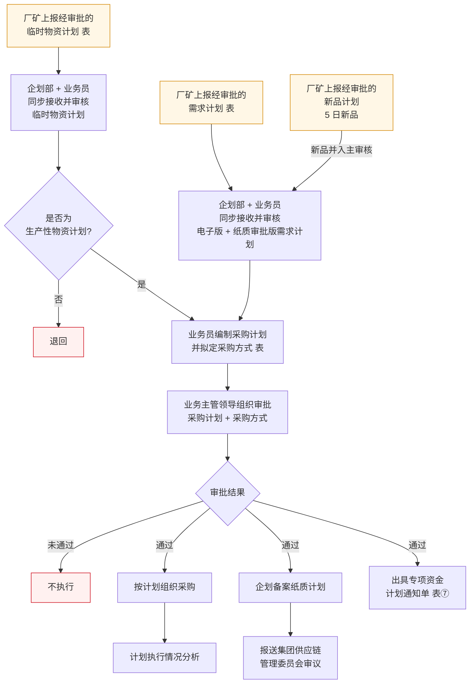

# 采购计划流程

> **来源：** `docs/流程调研/调研原文档/1.采购计划流程图（按新表序调整）.docx`（2026-04-23 修订版）
> **范围：** 三类计划入口（常规需求 / 新品 / 临时）的接收 → 编制 → 审批 → 通过后下发
> **核心原则：** **无计划不采购**

---

## 总流程

---

## 1. 输入端：三条计划入口

| 编号 | 入口 | 说明 |
|---|---|---|
| 1 | **厂矿需求计划**（表） | 常规年度/季度需求，经厂矿审批后上报 |
| 2 | **厂矿新品计划**（5 日新品） | 新品独立通道，与常规需求计划在"接收与审核"步合流 |
| 3 | **厂矿临时物资计划**（表） | 临时计划走独立审核通道，并加判断 |

> 三类入口都要求**经厂矿内部审批**后才能上报到物资公司。

## 2. 接收与审核

- **执行方：** 企划部 + 业务员**同步接收并审核**，覆盖电子版 + 纸质审批版
- **入口分流：**
  - 常规需求 + 新品 → 同入"主审核"流程
  - 临时计划 → 单设审核 + 后续"是否为生产性物资计划"判断

## 3. 临时计划判断（仅临时通道）

| 判断 | 走向 |
|---|---|
| 是生产性物资计划 | 汇入"业务员编制采购计划"主流程 |
| 否 | **退回** |

## 4. 编制采购计划与采购方式

业务员审核通过后：
- 编制采购计划
- 拟定采购方式（业务流程下游"采购方式确认"由 `2.采购方式流程图` 接力）

## 5. 审批

- **审批人：** 业务主管领导
- **审批对象：** 采购计划 + 采购方式
- **三种结果：**
  - **通过** → 进入下发（节 6）
  - **未通过** → 不执行
  - 全程贯穿 **无计划不采购** 原则

## 6. 通过后下发（三件事）

| 动作 | 后续 |
|---|---|
| **按计划组织采购** | → 计划执行情况分析（后评价口径，详设 09 报表/详设 11 后评价对接） |
| **企划备案纸质计划** | → 报送**集团供应链管理委员会审议** |
| **出具专项资金计划通知单**（表⑦） | 通知到责任部门 |

---

## 与详设的对应关系（初步）

| 流程节点 | 详设落点 |
|---|---|
| 厂矿三类计划入口 | 详设 02 采购管理 — 计划池入口；新品/临时通道作为子状态登记 |
| 业务主管领导审批 | 详设 10 权限审批流（PUR / CON 类审批模板） |
| 专项资金计划通知单（表⑦） | 详设 03 主数据 / 表附录锚点 |
| 计划执行情况分析 | 详设 09 报表（后评价类） |
| 集团供应链管理委员会审议 | 详设 11 流程穿刺：组织维度上跨级审批节点 |

---

## 待业务方核对要点

| # | 疑点 | 影响 |
|---|---|---|
| 1 | "无计划不采购"是审批结果分支还是独立原则？本稿按"独立原则"处理 | 影响详设 10 审批结果值域定义 |
| 2 | "通过 → 三件事"是否真**并行**，还是先备案再下发再启动采购？ | 影响详设 02 任务状态机 |
| 3 | "专项资金计划通知单（表⑦）"是否专指特定预算口径？表⑦ 应回查附录 | 影响详设 03 主数据字段 |
| 4 | 新品"5 日"是时限（5 个工作日上报）还是其他含义？ | 影响详设 11 时限章 |

---

## 版本记录

| 版本 | 日期 | 变更 |
|---|---|---|
| V0.1 | 2026-05-07 | 由 docx（2026-04-23 修订版）转录初稿；待业务方核对 4 处疑点 |
