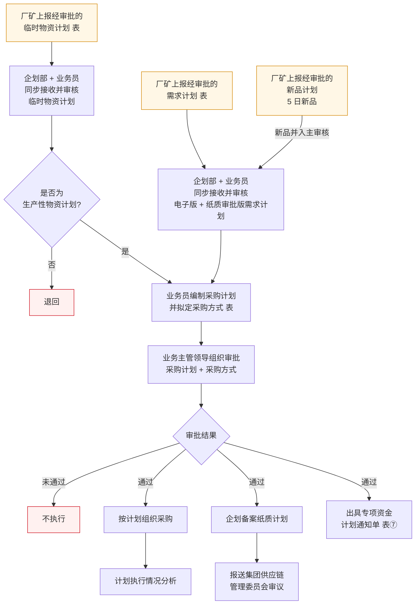

# 采购计划流程

> **来源：** `docs/流程调研/调研原文档/1.采购计划流程图（按新表序调整）.docx`（2026-04-23 修订版）
> **范围：** 三类计划入口（常规需求 / 新品 / 临时）的接收 → 编制 → 审批 → 通过后下发
> **核心原则：** **无计划不采购**

---

## 总流程

---

## 1. 输入端：三条计划入口

| 编号 | 入口 | 说明 |
|---|---|---|
| 1 | **厂矿需求计划**（表） | 常规年度/季度需求，经厂矿审批后上报 |
| 2 | **厂矿新品计划**（5 日新品） | 新品独立通道，与常规需求计划在"接收与审核"步合流 |
| 3 | **厂矿临时物资计划**（表） | 临时计划走独立审核通道，并加判断 |

> 三类入口都要求**经厂矿内部审批**后才能上报到物资公司。

## 2. 接收与审核

- **执行方：** 企划部 + 业务员**同步接收并审核**，覆盖电子版 + 纸质审批版
- **入口分流：**
  - 常规需求 + 新品 → 同入"主审核"流程
  - 临时计划 → 单设审核 + 后续"是否为生产性物资计划"判断

## 3. 临时计划判断（仅临时通道）

| 判断 | 走向 |
|---|---|
| 是生产性物资计划 | 汇入"业务员编制采购计划"主流程 |
| 否 | **退回** |

## 4. 编制采购计划与采购方式

业务员审核通过后：
- 编制采购计划
- 拟定采购方式（业务流程下游"采购方式确认"由 `2.采购方式流程图` 接力）

## 5. 审批

- **审批人：** 业务主管领导
- **审批对象：** 采购计划 + 采购方式
- **三种结果：**
  - **通过** → 进入下发（节 6）
  - **未通过** → 不执行
  - 全程贯穿 **无计划不采购** 原则

## 6. 通过后下发（三件事）

| 动作 | 后续 |
|---|---|
| **按计划组织采购** | → 计划执行情况分析（后评价口径，详设 09 报表/详设 11 后评价对接） |
| **企划备案纸质计划** | → 报送**集团供应链管理委员会审议** |
| **出具专项资金计划通知单**（表⑦） | 通知到责任部门 |

---

## 🔵 政策依据（V0.2 — 政策 04 采购管理办法回填）

> 本节由 [政策解析/04-采购管理办法.md](政策解析/04-采购管理办法.md)（阜矿发 [2025] 70 号）第二十七~四十六条提炼。

### 编制原则（第二十七~二十八条）

- **自下而上**：各单位结合年度/季度/月度费用指标 + 生产定额 + 建设任务编制
- **年统领、季调整、月执行**
- 编制时充分考虑现有库存及平衡利旧
- 严禁宽打窄用、造成积压浪费
- 申请计划资金总额必须**与本单位财务部门上报集团公司的采购资金计划相符**，**不得高于集团公司下达的费用指标**

### 计划提报时限（**关键 SLA**）

| 计划类型 | 提报时限 |
|---|---|
| **年度物资申请计划** | 每年 **11 月 15 日前**（提报下一年度）|
| **季度计划** | **提前 30 天** |
| **月度申请计划** | 每月 **20 日前**（提报下月）|
| **掘进工作面 / 重点大型工程**等所需物资 | 提前 **3 个月** |
| **大型设备** | 提前 **6 个月** |
| **进口物资** | 提前 **9 个月** |

> 未按时间提报申请计划 → 视为当期无采购项目。

### 申请计划必填内容（第二十九条）

物资名称 / 详细的规格型号或机型图号 / 计量单位 / 需用数量 / 物资类别（基于《阜新矿业集团集采物资目录》）

> 新增物资品种或目录中未涵盖的具体规格型号 → 需经物资公司审核通过后添加到目录内。

### 月度审批节点矩阵（第三十九 / 四十四 / 四十五条）

| 日期 | 动作 | 责任方 |
|---|---|---|
| 每月 1 日前 | 招标采购申请报送招投标管理委员会办公室 | 各单位 |
| 每月 5 日前 | 集团物资管理委员会审议；计划调整 / 取消上报 | 委员会办公室 |
| 每月 7 日前（特殊情况顺延）| 招标项目初审完成 → 招投标管理委员会审议 | 招投标管理委员会办公室 |
| 每月 20 日前 | 申请计划报送物资管理委员会办公室 | 各单位 |
| 每月 26 日前 | 管理委员会成员初审 | 物资管理委员会办公室 |

### 重大物资特殊审批（第三十九条）

> 重大物资需经**集团公司供应链管理委员会**审核。

### 月度集中采购需求计划必备条件（第三十四条）

| 项目类型 | 条件 |
|---|---|
| **工程建设项目** | 已核准（或已备案）或已取得同意开展项目前期工作的批文 |
| **其他项目** | 项目资金已落实 + 技术规范书已审定 |
| 集团公司有特殊要求 | 按要求执行 |

### 应急采购（第四十条 / 四十一条 — 联动业务方 Q-13-1 现状）

- **触发条件**：抢险、救灾或不可预见生产急需等特殊情况
- **审批链**：本单位内部决策 → 集团分管领导 + 物资采购分管领导 + **总经理**同意 → 物资公司组织采购
- **特殊情况**：分管领导同意后申请单位自行采购，事后向供应链管理委员会汇报
- **"三重一大"**：要向党委会汇报
- **可先申请后补办**：补办手续 **3 个工作日内**完成，**计划准确率必须 100%**

### 计划取消与调整（第四十二条）

- 取消：申请单位内部审批 + 加盖公章书面申请 + 集团公司分管领导审批签字 → 报物资管理委员会办公室执行
- 调整：报集团公司物资管理委员会审批同意后执行
- "三重一大"原则的：执行相关决策程序
- 计划调整或取消：**每月 5 日前**上报

### 反规避禁止情形（第三十二条）

- ❌ 指定供应商
- ❌ 以指定品牌、独家安标等理由变相指定供应商
- 特殊情况须向集团公司供应链管理委员会作出说明

### 启动采购前提（第四十七 / 四十八条）

| 项目类型 | 启动条件 |
|---|---|
| **能源集团集中采购范围内**工程建设 | 编制总体采购策划（采购初步方案 / 方式 / 概算或估算金额）→ 报集团公司供应链管理委员会办公室审核 → 向能源集团备案 |
| **首次启动主设备 / 主体工程施工 / 工程总承包** | 政府主管部门核准或备案文件 OR 集团公司投资决策文件 OR 决策机构同意启动招标的指令 → 集团供应链管理委员会办公室审核同意后启动 |

---

## 与详设的对应关系（初步）

| 流程节点 | 详设落点 |
|---|---|
| 厂矿三类计划入口 | 详设 02 采购管理 — 计划池入口；新品/临时通道作为子状态登记 |
| 业务主管领导审批 | 详设 10 权限审批流（PUR / CON 类审批模板） |
| 专项资金计划通知单（表⑦） | 详设 03 主数据 / 表附录锚点 |
| 计划执行情况分析 | 详设 09 报表（后评价类） |
| 集团供应链管理委员会审议 | 详设 11 流程穿刺：组织维度上跨级审批节点 |

---

## 待业务方核对要点

| # | 疑点 | 影响 |
|---|---|---|
| 1 | "无计划不采购"是审批结果分支还是独立原则？本稿按"独立原则"处理 | 影响详设 10 审批结果值域定义 |
| 2 | "通过 → 三件事"是否真**并行**，还是先备案再下发再启动采购？ | 影响详设 02 任务状态机 |
| 3 | "专项资金计划通知单（表⑦）"是否专指特定预算口径？表⑦ 应回查附录 | 影响详设 03 主数据字段 |
| 4 | 新品"5 日"是时限（5 个工作日上报）还是其他含义？ | 影响详设 11 时限章 |

---

## 版本记录

| 版本 | 日期 | 变更 |
|---|---|---|
| V0.1 | 2026-05-07 | 由 docx（2026-04-23 修订版）转录初稿；待业务方核对 4 处疑点 |
| V0.2 | 2026-05-09 | 由政策 04 采购管理办法回填 — 加 §政策依据：编制原则 + 时限矩阵（年度/季度/月度 + 大型设备/进口提前期）+ 月度审批节点（1/5/7/20/26 日）+ 应急采购 3 工作日补办 + 反规避规则 + 启动采购前提 |
