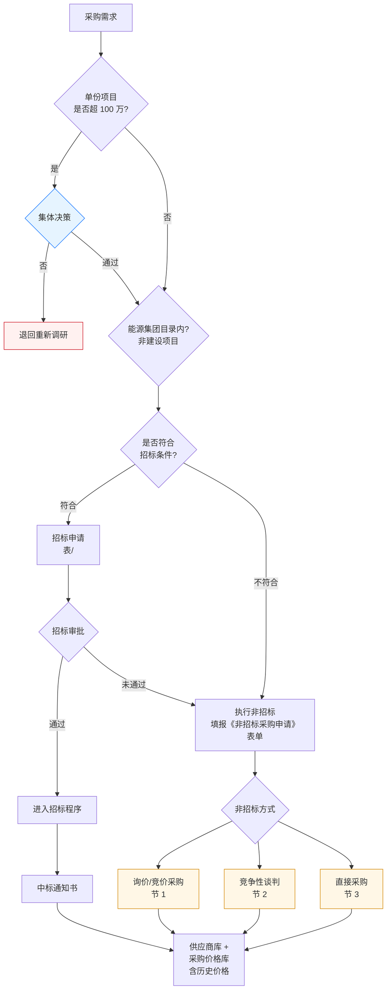
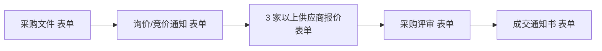
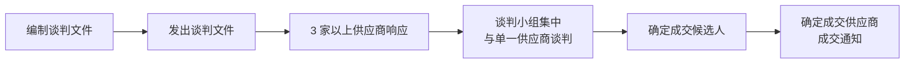
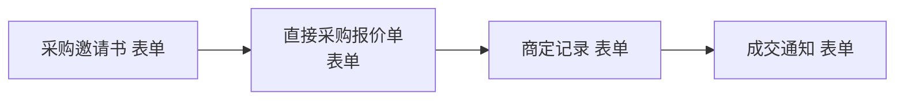

# 采购方式流程

> **来源：** `docs/流程调研/调研原文档/2.采购方式流程图（新表序调整）.docx`
> **范围：** 采购方式选择决策树（100 万阈值集体决策 → 集团目录 → 招标条件 → 招标/非招标三种）+ 三种非招标方式的执行细节
> **下游：** 供应商库 + 采购价格库（含历史价格）
> **政策回填（V0.2）：** 2026-05-09 由 [政策解析/04-采购管理办法.md](政策解析/04-采购管理办法.md) 印证，**原图遗漏第 4 种非招标方式"竞价采购"**；金额阈值不止 100 万一档，详见 §政策依据 节。

---

## 总流程

---

## 决策维度（自顶向下）

| 维度 | 阈值 / 判定 | 走向 |
|---|---|---|
| **金额阈值** | 单份项目 > 100 万 | 触发**集体决策**（不通过 → 退回重新调研） |
| **集团目录** | 能源集团目录内 / 非建设项目 | 走集团统一渠道 |
| **招标条件** | 符合 → 招标；不符合 → 非招标 | 招标审批未通过 → 降级走非招标 |
| **非招标方式** | 询价/竞价 / 竞争性谈判 / 直接采购 | 三选一 |

---

## 🔵 政策依据（V0.2 — 政策 04 采购管理办法回填）

> 本节由 [政策解析/04-采购管理办法.md](政策解析/04-采购管理办法.md) 提炼，**作为流程的权威细节**，与原调研图对照如有冲突以本节为准。

### 完整阈值矩阵（5 档，**非"100 万一档"**）

| 阈值档位 | 采购方式 | 实施主体 | 监督方 | 政策依据 |
|---|---|---|---|---|
| **必须招标**：工程施工 ≥ 400 万 / 物资设备材料 ≥ 200 万 / 勘察设计监理 ≥ 100 万 | 公开招标（不可降级）| 招投标管理中心 | 纪检监察部 | 第十五条 |
| **应招标**：工程 ≥ 50 万 / 物资 ≥ 20 万 / 服务设备修理 ≥ 10 万 | 公开招标（特殊情形可邀请招标 / 转非招标）| 招投标管理中心 | 纪检监察部 | 第十七条 |
| **公开采购**：5 万 - 应招标限额 | 公开招标 / 公开谈判 / 公开询比 / 公开竞价 | 采购单位自行 | 招投标管理中心 | 第二十一条 |
| **竞争性采购**：2 万 - 5 万 | 招标 / 询比 / 竞价 / 谈判 4 选 1 | 采购单位自行 | — | 第二十二条 |
| **小额采购**：< 2 万 | 自行决定 + **2 人以上共同** + 留记录 | 采购单位 | — | 第二十三条 |

> **重要招标项目**额外阈值：单项合同估算 ≥ 50 万（工程 / 物资 / 设备修理）/ ≥ 15 万（咨询服务）→ 招标文件须集团相关部门审核（第五条）。

### 4 种非招标方式精确判定条件（**原图缺竞价**）

| 方式 | 最低供应商数 | 同时满足条件（**硬性 ≥3 家** / **谈判 ≥2 家**） |
|---|---|---|
| **谈判采购** | **≥ 2 家** | 标的物技术复杂或性质特殊 / 需求明确但多方案选 / 市场资源缺乏（≤2 家）/ 联合研发共担风险 / **应急** |
| **询比采购** | **≥ 3 家** | 需求清晰准确完整 / 技术质量标准化高 / 市场资源较丰富（潜在 ≥ 3 家）/ **应急**（一次报出**不得更改的价格**） |
| **竞价采购** | **≥ 3 家** | 同上 + **以价格竞争为主** + **多轮次公开报价** / **应急** |
| **直接采购** | 与特定供应商 | 国家秘密 / 抢险救灾 / 不可替代专利 / 原供应商配套 / **有效供应商仅 1 家** / 战略物资定向 / 集团控股管理关系 / 招投委批准 |

### 应招标项目可转非招标的 6 种情形（第十六条）

1. 涉及国家安全 / 国家秘密 / 抢险救灾 / 以工代赈 / 农民工特殊情况
2. 不可替代的专利或专有技术
3. 采购人依法能够自行建设、生产或提供
4. 已招标特许经营项目投资人依法能自行提供
5. 同一期工程向原中标人采购，否则影响功能配套
6. 国家规定的其他特殊情形

### 应招标项目可转邀请招标的情形（第十八条）

- 技术复杂、有特殊要求或受自然环境限制，**只有少量潜在投标人**
- 公开招标方式费用占项目合同金额比例过大

### 月度时间节点矩阵

| 日期 | 动作 | 责任方 |
|---|---|---|
| 每月 1 日前 | 招标采购申请报送招投标管理委员会办公室 | 各单位 |
| 每月 5 日前 | 报集团物资管理委员会审议；计划调整 / 取消上报 | 委员会办公室 |
| 每月 7 日前 | 招标项目初审 → 招投标管理委员会审议 | 招投标管理委员会办公室 |
| 每月 20 日前 | 申请计划报送物资管理委员会办公室 | 各单位 |
| 每月 26 日前 | 管理委员会成员初审 | 物资管理委员会办公室 |
| 每年 11 月 15 日前 | 下一年度物资申请计划提报 | 各单位 |

### 应急采购（第四十一条）

- 可**先申请后补办**审批手续
- 补办手续 **3 个工作日内**完成
- **准确率必须 100%**

### 反规避规则（第二十六、三十二条）

- ❌ **化整为零**或以其他方式规避招标
- ❌ 指定供应商 / 指定品牌 / 独家安标等理由变相指定（特殊情况须向集团供应链管理委员会说明）

---

## 1. 询价/竞价采购

**关键约束：3 家以上供应商**报价。

## 2. 竞争性谈判

**关键约束：3 家以上响应** + **谈判小组集中** + **与单一供应商谈判**（一对一谈判轮替）

## 3. 直接采购

直接采购**不需要 3 家比价**，但要有**商定记录**作为留痕。

## 4. 招标采购（招标程序入口）

> 招标程序在本图为概略节点（招标申请 → 进入招标程序 → 中标通知书），具体招标内部流程由独立招标管理系统承载。

---

## 下游库（共享落点）

| 库 | 内容 |
|---|---|
| **供应商库** | 中标 / 成交供应商沉淀 |
| **采购价格库** | 含**历史价格**，供后续询价 / 评审参考 |

---

## 与详设的对应关系（初步）

| 流程节点 | 详设落点 |
|---|---|
| 100 万阈值 → 集体决策 | 详设 10 §九金额阈值 — CONDITION 节点 conditionConfig.expression |
| "退回重新调研" | 详设 02 计划池状态机（增 `RESEARCH_RETURN` 状态） |
| 招标条件判断 | 详设 04 招标管理 — 招标条件规则集 |
| 三种非招标方式 | 详设 02 采购方式枚举（PUR_METHOD = TENDER / INQUIRY / NEGOTIATION / DIRECT） |
| "3 家以上供应商"约束 | 详设 04 询价/谈判 — 最低供应商数量校验 |
| 招标申请 → 进入招标程序 | 详设 04 招标管理（独立子模块） |
| 供应商库 | 详设 03 主数据 — 供应商主数据 |
| 采购价格库（历史价格） | 详设 03 主数据 / 详设 09 报表 — 历史价格分析 |

---

## 待业务方核对要点

| # | 疑点 | 影响 |
|---|---|---|
| 1 | "100 万"是金额阈值的唯一档位？还是还有其他档位（500 万 / 1000 万）？ | 影响详设 10 阈值表达式 |
| 2 | "能源集团目录内（非建设项目）"判断的具体规则？目录由谁维护？非建设项目如何识别？ | 影响详设 03 主数据 — 集团目录维护 |
| 3 | "招标条件"与"100 万阈值"是否独立？小额项目也可能符合招标条件吗？ | 影响详设 04 招标条件规则 |
| 4 | "招标审批未通过 → 降级非招标"的降级规则？是否要重新走集体决策？ | 影响详设 04 招标失败回退路径 |
| 5 | 三种非招标方式的**选择规则**：何时选询价、何时选谈判、何时选直接？ | 影响详设 02 采购方式选择助手 |
| 6 | "3 家以上供应商"如何校验？系统强约束还是软提示？ | 影响详设 04 校验级别 |
| 7 | 供应商库与采购价格库是否同库异表？历史价格保留期限？ | 影响详设 03 价格数据保留 |

---

## 版本记录

| 版本 | 日期 | 变更 |
|---|---|---|
| V0.1 | 2026-05-07 | 由 docx 转录初稿；待业务方核对 7 处疑点 |
| V0.2 | 2026-05-09 | 由政策 04 采购管理办法 OCR 解析回填 — 加 §政策依据：5 档完整阈值矩阵 + 4 种非招标方式精确条件（**原图遗漏竞价采购**） + 月度时间节点 + 应急采购 + 反规避规则 |
