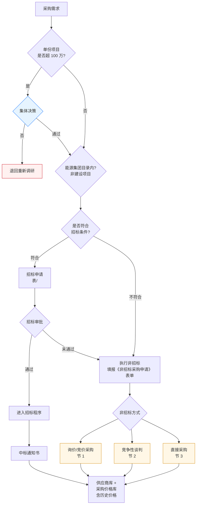
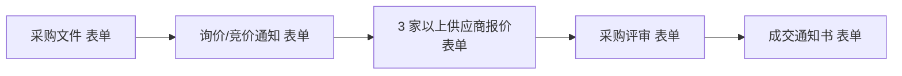
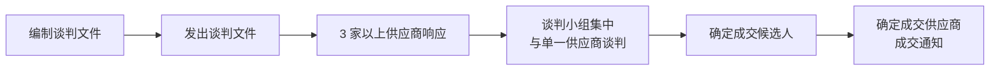
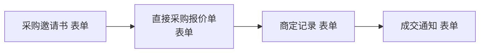

# 采购方式流程

> **来源：** `docs/流程调研/调研原文档/2.采购方式流程图（新表序调整）.docx`
> **范围：** 采购方式选择决策树（100 万阈值集体决策 → 集团目录 → 招标条件 → 招标/非招标三种）+ 三种非招标方式的执行细节
> **下游：** 供应商库 + 采购价格库（含历史价格）

---

## 总流程

---

## 决策维度（自顶向下）

| 维度 | 阈值 / 判定 | 走向 |
|---|---|---|
| **金额阈值** | 单份项目 > 100 万 | 触发**集体决策**（不通过 → 退回重新调研） |
| **集团目录** | 能源集团目录内 / 非建设项目 | 走集团统一渠道 |
| **招标条件** | 符合 → 招标；不符合 → 非招标 | 招标审批未通过 → 降级走非招标 |
| **非招标方式** | 询价/竞价 / 竞争性谈判 / 直接采购 | 三选一 |

---

## 1. 询价/竞价采购

**关键约束：3 家以上供应商**报价。

## 2. 竞争性谈判

**关键约束：3 家以上响应** + **谈判小组集中** + **与单一供应商谈判**（一对一谈判轮替）

## 3. 直接采购

直接采购**不需要 3 家比价**，但要有**商定记录**作为留痕。

## 4. 招标采购（招标程序入口）

> 招标程序在本图为概略节点（招标申请 → 进入招标程序 → 中标通知书），具体招标内部流程由独立招标管理系统承载。

---

## 下游库（共享落点）

| 库 | 内容 |
|---|---|
| **供应商库** | 中标 / 成交供应商沉淀 |
| **采购价格库** | 含**历史价格**，供后续询价 / 评审参考 |

---

## 与详设的对应关系（初步）

| 流程节点 | 详设落点 |
|---|---|
| 100 万阈值 → 集体决策 | 详设 10 §九金额阈值 — CONDITION 节点 conditionConfig.expression |
| "退回重新调研" | 详设 02 计划池状态机（增 `RESEARCH_RETURN` 状态） |
| 招标条件判断 | 详设 04 招标管理 — 招标条件规则集 |
| 三种非招标方式 | 详设 02 采购方式枚举（PUR_METHOD = TENDER / INQUIRY / NEGOTIATION / DIRECT） |
| "3 家以上供应商"约束 | 详设 04 询价/谈判 — 最低供应商数量校验 |
| 招标申请 → 进入招标程序 | 详设 04 招标管理（独立子模块） |
| 供应商库 | 详设 03 主数据 — 供应商主数据 |
| 采购价格库（历史价格） | 详设 03 主数据 / 详设 09 报表 — 历史价格分析 |

---

## 待业务方核对要点

| # | 疑点 | 影响 |
|---|---|---|
| 1 | "100 万"是金额阈值的唯一档位？还是还有其他档位（500 万 / 1000 万）？ | 影响详设 10 阈值表达式 |
| 2 | "能源集团目录内（非建设项目）"判断的具体规则？目录由谁维护？非建设项目如何识别？ | 影响详设 03 主数据 — 集团目录维护 |
| 3 | "招标条件"与"100 万阈值"是否独立？小额项目也可能符合招标条件吗？ | 影响详设 04 招标条件规则 |
| 4 | "招标审批未通过 → 降级非招标"的降级规则？是否要重新走集体决策？ | 影响详设 04 招标失败回退路径 |
| 5 | 三种非招标方式的**选择规则**：何时选询价、何时选谈判、何时选直接？ | 影响详设 02 采购方式选择助手 |
| 6 | "3 家以上供应商"如何校验？系统强约束还是软提示？ | 影响详设 04 校验级别 |
| 7 | 供应商库与采购价格库是否同库异表？历史价格保留期限？ | 影响详设 03 价格数据保留 |

---

## 版本记录

| 版本 | 日期 | 变更 |
|---|---|---|
| V0.1 | 2026-05-07 | 由 docx 转录初稿；待业务方核对 7 处疑点 |
