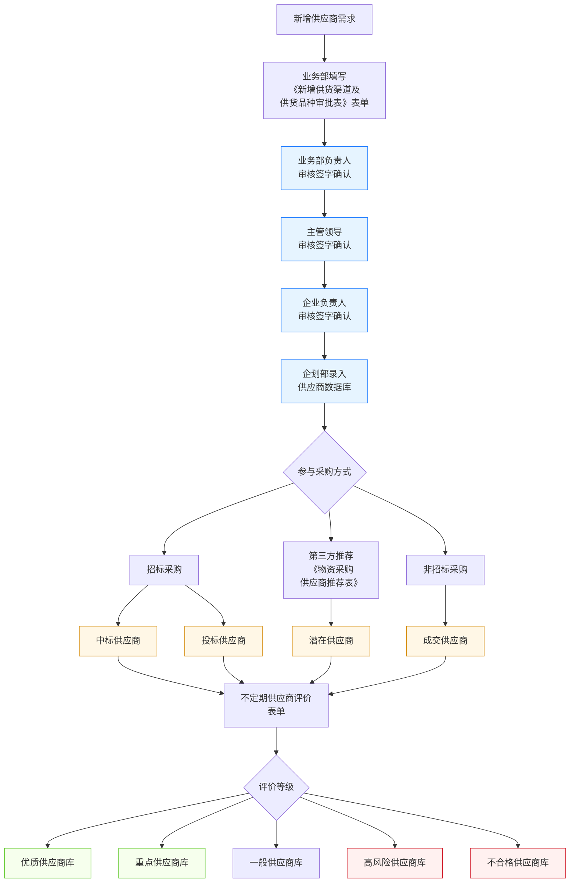

# 供应商管理流程

> **来源：** `docs/流程调研/调研原文档/3.供应商管理流程图（按新表序调整）.docx`
> **范围：** 供应商**准入审批 → 入库 → 参与采购 → 不定期评价 → 五级分类库**全生命周期
> **核心：** 三级审批准入 + 评价后 5 库分类（优质 / 重点 / 一般 / 高风险 / 不合格）

---

## 总流程

---

## 1. 准入阶段（三级审批）

| 顺序 | 角色 | 动作 | 表单 |
|---|---|---|---|
| 1 | 业务部 | 填写《新增供货渠道及供货品种审批表》 | 表单 |
| 2 | 业务部负责人 | 审核签字确认 | — |
| 3 | 主管领导 | 审核签字确认 | — |
| 4 | 企业负责人 | 审核签字确认 | — |
| 5 | 企划部 | 录入供应商数据库 | — |

> 三级审批链：业务部负责人 → 主管领导 → 企业负责人，串行不可跳过。

## 2. 参与采购阶段（角色标签）

供应商在数据库中后，根据采购方式接收不同角色标签：

| 采购方式 | 角色标签 |
|---|---|
| 招标采购 | **中标供应商**（赢得招标） / **投标供应商**（参与未中标） |
| 第三方推荐（《物资采购供应商推荐表》） | **潜在供应商** |
| 非招标采购 | **成交供应商** |

> 角色标签是**累加属性**（同一供应商可有多个标签），供后续评价参考。

## 3. 评价阶段（不定期）

- **频度：** 不定期
- **依据：** 不定期供应商评价表单
- **输入维度：** 角色标签（中标 / 投标 / 潜在 / 成交）+ 实际履约情况

## 4. 评价后 5 级分类库

| 库 | 含义 | 后续处理 |
|---|---|---|
| **优质供应商库** | 履约最佳，长期合作 | 优先邀标 |
| **重点供应商库** | 重要合作对象 | 常规优先 |
| **一般供应商库** | 普通供应商 | 常规处理 |
| **高风险供应商库** | 履约存在风险 | 重点关注 / 限制邀标范围 |
| **不合格供应商库** | 不再合作 | 禁用 / 列入黑名单 |

> 同一供应商在不同时段可能在不同库（评价是动态的）。

---

## 与详设的对应关系（初步）

| 流程节点 | 详设落点 |
|---|---|
| 三级审批准入 | 详设 10 §6 审批模板（SUP:NEW 模板） |
| 业务部填写《新增审批表》 | 详设 03 主数据 — 供应商主数据；详设 02 注册流程 |
| 角色标签（4 种） | 详设 03 供应商主数据 — 角色标签字段（多值） |
| 不定期评价 | 详设 04 供应商管理 — 评价子模块 |
| 5 级分类库 | 详设 03 供应商主数据 — `category` 枚举（QUALITY / KEY / NORMAL / HIGH_RISK / DISQUALIFIED） |
| 第三方推荐 | 详设 04 供应商推荐子模块 |

---

## 待业务方核对要点

| # | 疑点 | 影响 |
|---|---|---|
| 1 | "不定期评价"频度具体如何把握？季度？年度？还是事件触发（重大事故 / 投诉）？ | 影响详设 11 评价定时任务 |
| 2 | 5 级分类的**评价标准**是什么？分数阈值？综合评级？谁拍板？ | 影响详设 04 评价规则引擎 |
| 3 | 高风险 / 不合格供应商的**自动触发条件**？（如连续 N 次质量不合格） | 影响详设 11 自动降级规则 |
| 4 | 高风险 / 不合格供应商是否允许**重新评估升级**？升级流程？ | 影响详设 04 供应商生命周期 |
| 5 | "潜在供应商"标签是否在**正式合作前**就建库？还是合作后回填？ | 影响详设 03 供应商初始状态 |
| 6 | 同一供应商可能跨多个分类库，**冲突时**以哪个为准？（如同时是"重点" + "高风险"） | 影响详设 03 多分类优先级 |
| 7 | 准入审批链 3 级是否所有金额 / 物资类型都一样？大金额是否升级到集团审批？ | 影响详设 10 阈值表达式 |

---

## 版本记录

| 版本 | 日期 | 变更 |
|---|---|---|
| V0.1 | 2026-05-07 | 由 docx 转录初稿；待业务方核对 7 处疑点 |
