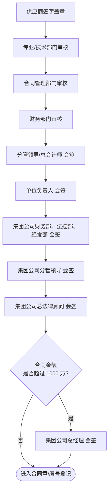

# 采购合同流程

> **来源：** `docs/流程调研/调研原文档/4.合同审批流程(按新表序调整).docx`
> **范围：** 业务员起草合同 → 三路审批分流（内部 / 20万以下 / 20万以上）→ 供应商盖章 → 加盖合同章 → 合同编号登记 → 履约保证金（条件触发）
> **起草依据：** 中标通知 / 成交通知书

---

## 总流程

---

## 1. 内部企业审批链（合同备案）

> 触发：交易对方为集团内部企业（无金额阈值）

- 入口表单：**《阜矿集团所属单位合同备案单》**
- 审批链最短，仅走物资公司内部会签

## 2. 20 万以下审批链（小额会签）

> 触发：交易对方非内部企业，且合同金额 ≤ 20 万元

- 入口表单：**《物资公司合同会签单》**
- 与内部企业链条节点相同，但入口表单不同（**物资公司层面**而非集团所属单位）

## 3. 20 万以上审批链（集团多部门会签）

> 触发：交易对方非内部企业，且合同金额 > 20 万元

- 入口表单：**《阜矿集团所属单位合同会签单》**
- 物资公司内部会签 + **集团层面四级会签**（财务/法控/经发 → 分管 → 总法律顾问 → 总经理）
- **1000 万阈值**触发集团公司总经理会签

---

## 4. 汇合后动作

| 顺序 | 动作 | 责任方 |
|---|---|---|
| 1 | 业务员向合同管理部门申请加盖合同章 | 业务员 + 合同管理部门 |
| 2 | 业务员向企划部申请合同编号，登记纸质台账并签字（表单） | 业务员 + 企划部 |
| 3 | （条件）签订履约保证金协议、缴纳履约保证金 | 业务员 + 供应商 |

---

## 与详设的对应关系（初步）

| 流程节点 | 详设落点 |
|---|---|
| 起草依据：中标通知 / 成交通知书 | 详设 02 招标管理 / 询比管理 → 合同模块入参 |
| 三路分流（内部 / ≤20万 / >20万） | 详设 04 合同管理：合同 `category` 字段 + `amount_threshold` 路由 |
| 集团公司会签链 | 详设 10 §6 审批模板 — 跨级审批节点（A-08 ProcessDefinition） |
| 1000 万阈值 → 总经理会签 | 详设 10 §九 金额阈值实施层 → CONDITION 节点 conditionConfig.expression |
| 履约保证金 | 详设 04 合同管理 — 保证金子模块（待详设确认是否一期实施） |
| 合同章 / 合同编号 | 详设 03 编码规则 + 详设 04 合同生命周期状态机 |
| 电子台账 + 纸质台账 | 详设 04 数据双轨 / 详设 11 数据初始化 |

---

## 待业务方核对要点

| # | 疑点 | 影响 |
|---|---|---|
| 1 | "供应商签字盖章"的位置：**审批前**(图示) vs **审批后**(逻辑常识)？ | 影响详设 04 合同状态机 |
| 2 | 履约保证金的"符合缴纳条件"具体规则是什么？金额？类别？合同类型？ | 影响详设 04 保证金子模块 |
| 3 | 内部企业链是否真的没有"集团审批"？无论金额？ | 影响详设 10 路由规则 |
| 4 | 20 万以下小额走"物资公司层面"会签单，与"内部企业"层级有何差异？ | 影响合同分类口径 |
| 5 | "1000 万"以上是否还要在 "20-1000 万" 链条**之后**叠加，还是单独路径？ | 影响审批节点编号 |
| 6 | 集团"财务部、法控部、经发部"三部门是**串行**还是**并行**会签？ | 影响详设 10 signMode |

---

## 版本记录

| 版本 | 日期 | 变更 |
|---|---|---|
| V0.1 | 2026-05-07 | 由 docx 转录初稿；待业务方核对 6 处疑点 |
