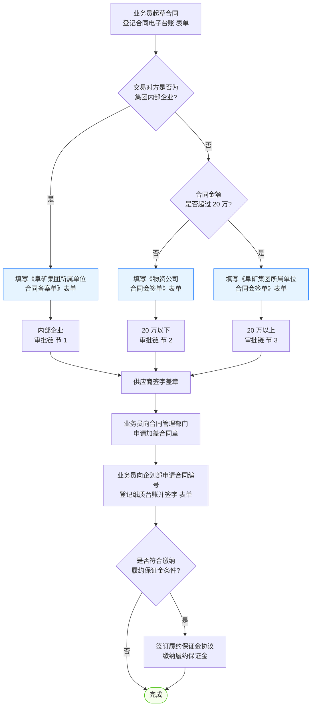

# 采购合同流程

> **来源：** `docs/流程调研/调研原文档/4.合同审批流程(按新表序调整).docx`
> **范围：** 业务员起草合同 → 三路审批分流（内部 / 20万以下 / 20万以上）→ 供应商盖章 → 加盖合同章 → 合同编号登记 → 履约保证金（条件触发）
> **起草依据：** 中标通知 / 成交通知书

---

## 总流程

---

## 1. 内部企业审批链（合同备案）

> 触发：交易对方为集团内部企业（无金额阈值）

- 入口表单：**《阜矿集团所属单位合同备案单》**
- 审批链最短，仅走物资公司内部会签

## 2. 20 万以下审批链（小额会签）

> 触发：交易对方非内部企业，且合同金额 ≤ 20 万元

- 入口表单：**《物资公司合同会签单》**
- 与内部企业链条节点相同，但入口表单不同（**物资公司层面**而非集团所属单位）

## 3. 20 万以上审批链（集团多部门会签）

> 触发：交易对方非内部企业，且合同金额 > 20 万元

- 入口表单：**《阜矿集团所属单位合同会签单》**
- 物资公司内部会签 + **集团层面四级会签**（财务/法控/经发 → 分管 → 总法律顾问 → 总经理）
- **1000 万阈值**触发集团公司总经理会签

---

## 🔵 政策依据（V0.2 — 政策 05 合同管理办法回填）

> 本节由 [政策解析/05-合同管理办法.md](政策解析/05-合同管理办法.md)（阜矿经发字 [2022] 158 号）提炼。

### 合同审查权限矩阵（**比原图更精细**）

| 主体 | 自审权限 | 超出后处理 |
|---|---|---|
| **各单位** | 标的额 ≤ **5 万元** + 制式文本买卖合同自审 | 走备案制或审查制 |
| **物资公司** | 标的额 ≤ **20 万元** + 制式文本买卖合同自审 | 走备案制或审查制 |
| **集团内部企业之间** | — | **备案制**（填备案表 + 合同文本到经发部备案，**不走审查制**）|
| **重大合同** | — | 审查制（本单位内部会签 + 集团相关部门 + 领导审查会签）|
| **≥ 1000 万** | — | 审查制 + **集团公司总经理审批**（叠加在审查制流程之后）|

### 6 类重大合同自动识别（第二十三条 — **关键!**）

下列合同自动归为**重大合同 → 走审查制**：

1. **标的额 ≥ 20 万的买卖合同**
2. 借贷、担保合同
3. 投资、并购、资产置换、合资合作等合同
4. **设备、土地、房屋等租赁及产权变动**合同
5. 建设工程施工合同
6. 其他标的额 ≥ 20 万的合同

### 多部门会签职责（**印证业务方 Q-04-6 现状并行答复**）

| 部门 | 职责 |
|---|---|
| **经发部**（归口管理）| 规范、指导、监督；履行**会签**；档案集中保管；台账 |
| **法律风控部** | 审查合法有效性 + **法律风险提示**；参与重大合同的可行性论证、起草、修改、谈判、审查、签订；纠纷协助；制定规范文本 |
| **财务部** | 评审；审查支付方式 / 不含税价款 / 发票种类 / 税金；履行**会审** |
| 其他职能部门 | 涉及本部门业务时提出意见，履行会审 |

> **会签默认可并行**（"集团公司相关部门、领导审查会签同意"措辞，未要求串行）— 与业务方 Q-04-6 答复"现状并行 + 同意改为并行"一致。

### 合同必备 15 项条款（第十七条）

含合同当事人 / 标的 / 数量质量 / 价款支付方式 / 履约期限 / 双方权利义务 / **法律适用和争议解决方式（约定诉讼时尽量写我方所在地法院）**/ 违约责任（明确金额计算方法）/ 期限 / 生效时间 / 签订地点（**尽可能填我方所在地**）/ **公章 + 法定代表人签字** 等。

### 强制规则

- **2 万以下即时结清**：例外，可不签书面合同
- **无合同不验收、不结算、不挂账、不付款**（第十三条）
- **一份合同一个编号**，不得重号或漏号；补充协议同号
- **空白内容注明"无"字**（防止后续填写）
- 会签意见**禁止"原则同意""基本可行"**等模糊语言

### 尽职调查（签订前必做，第十六条）

主体资格合格 / 经营范围匹配 / 代签授权完整 / 履约能力 / **履约信用**（违约事实 / 重大经济纠纷 / 失信人名单）/ 担保资格证明（如有担保）

---

## 4. 汇合后动作

| 顺序 | 动作 | 责任方 |
|---|---|---|
| 1 | 业务员向合同管理部门申请加盖合同章 | 业务员 + 合同管理部门 |
| 2 | 业务员向企划部申请合同编号，登记纸质台账并签字（表单） | 业务员 + 企划部 |
| 3 | （条件）签订履约保证金协议、缴纳履约保证金 | 业务员 + 供应商 |

---

## 与详设的对应关系（初步）

| 流程节点 | 详设落点 |
|---|---|
| 起草依据：中标通知 / 成交通知书 | 详设 02 招标管理 / 询比管理 → 合同模块入参 |
| 三路分流（内部 / ≤20万 / >20万） | 详设 04 合同管理：合同 `category` 字段 + `amount_threshold` 路由 |
| 集团公司会签链 | 详设 10 §6 审批模板 — 跨级审批节点（A-08 ProcessDefinition） |
| 1000 万阈值 → 总经理会签 | 详设 10 §九 金额阈值实施层 → CONDITION 节点 conditionConfig.expression |
| 履约保证金 | 详设 04 合同管理 — 保证金子模块（待详设确认是否一期实施） |
| 合同章 / 合同编号 | 详设 03 编码规则 + 详设 04 合同生命周期状态机 |
| 电子台账 + 纸质台账 | 详设 04 数据双轨 / 详设 11 数据初始化 |

---

## 待业务方核对要点

| # | 疑点 | 影响 |
|---|---|---|
| 1 | "供应商签字盖章"的位置：**审批前**(图示) vs **审批后**(逻辑常识)？ | 影响详设 04 合同状态机 |
| 2 | 履约保证金的"符合缴纳条件"具体规则是什么？金额？类别？合同类型？ | 影响详设 04 保证金子模块 |
| 3 | 内部企业链是否真的没有"集团审批"？无论金额？ | 影响详设 10 路由规则 |
| 4 | 20 万以下小额走"物资公司层面"会签单，与"内部企业"层级有何差异？ | 影响合同分类口径 |
| 5 | "1000 万"以上是否还要在 "20-1000 万" 链条**之后**叠加，还是单独路径？ | 影响审批节点编号 |
| 6 | 集团"财务部、法控部、经发部"三部门是**串行**还是**并行**会签？ | 影响详设 10 signMode |

---

## 版本记录

| 版本 | 日期 | 变更 |
|---|---|---|
| V0.1 | 2026-05-07 | 由 docx 转录初稿；待业务方核对 6 处疑点 |
| V0.2 | 2026-05-09 | 由政策 05 合同管理办法 OCR 解析回填 — 加 §政策依据：审查权限矩阵 + 6 类重大合同清单 + 多部门会签职责 + 必备 15 项条款 + 强制规则 + 尽职调查 |
