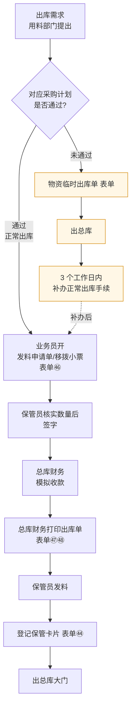

# 出总库流程

> **来源：** `docs/流程调研/调研原文档/6.出总库流程图（按新表序调整）.docx`
> **范围：** 出库需求 → 计划核验 → 正常 / 临时双路径 → 财务模拟收款 → 打印出库单 → 保管员发料 → 出总库大门
> **核心约束：** 出库单**不能重复打印，且过月做废**；临时出库须**3 个工作日内补办正常手续**

---

## 总流程

> **出库单约束：** 不能重复打印；**过月做废**（跨月失效）。

---

## 1. 触发与判断

**入口：** 用料部门提出领料需求。

**判断节点：** 该需求对应的**采购计划是否已通过**？

| 判断结果 | 走向 |
|---|---|
| 通过（有效采购计划） | 走"正常出库"路径 |
| 未通过 | 走"临时出库"路径，事后补办 |

## 2. 正常出库路径

| 顺序 | 角色 | 动作 | 表单 |
|---|---|---|---|
| 1 | 业务员 | 开发料申请单（移拨小票） | 表单㊻ |
| 2 | 保管员 | 核实数量后签字 | — |
| 3 | 总库财务 | 模拟收款 | — |
| 4 | 总库财务 | 打印出库单 | 表单㊼㊽ |
| 5 | 保管员 | 发料 | — |
| 6 | 保管员 | 登记保管卡片 | 表单㊹ |
| 7 | — | 出总库大门 | — |

> **出库单关键约束（图示注释）：**
> - **不能重复打印**（打印一次后系统锁定）
> - **过月做废**（跨自然月出库单失效）

## 3. 临时出库路径

| 顺序 | 动作 | 表单 |
|---|---|---|
| 1 | 开具《物资临时出库单》 | 表单 |
| 2 | 出总库 | — |
| 3 | **3 个工作日内**补办正常出库手续 | — |

> **关键时限：3 个工作日**（临时出库后补办窗口）

---

## 与详设的对应关系（初步）

| 流程节点 | 详设落点 |
|---|---|
| "采购计划是否通过"判断 | 详设 02 + 详设 06：出库需求与计划池 join 校验 |
| 发料申请单 / 移拨小票（表单㊻） | 详设 06 出库管理 — 申请单据 |
| 总库财务模拟收款 | 详设 05 财务对接 / NC 接口（详设 08）|
| 出库单（表单㊼㊽） "不能重复打印 + 过月做废" | 详设 06 出库单据生命周期 + 详设 11 时限（跨月失效定时任务） |
| 保管卡片登记（表单㊹） | 详设 06 库存台账（与入库流程共用） |
| 临时出库单 | 详设 06 异常出库子模块 |
| 3 个工作日补办时限 | 详设 11 时限 + 详设 09 报表（临时出库未补办预警） |

---

## 待业务方核对要点

| # | 疑点 | 影响 |
|---|---|---|
| 1 | "对应采购计划是否通过"具体是什么 join 关系？按物料 / 按部门 / 按计划单号？ | 影响详设 06 计划-出库关联校验 |
| 2 | 临时出库 3 个工作日内未补办的处理？冻结？告警？ | 影响详设 11 时限兜底 |
| 3 | "过月做废"是按出库单**打印日**所在月，还是按**领料申请日**？ | 影响详设 06 失效定时任务 |
| 4 | "不能重复打印"是软提示还是硬约束（系统层面拦截）？ | 影响详设 06 出库单状态机 |
| 5 | 总库财务"模拟收款"的会计语义是什么？走 NC 接口还是仅本系统记账？ | 影响详设 08 NC 接口 |
| 6 | 保管卡片登记是出库时减库存，还是仅记录流水？与入库登记同表? | 影响详设 06 库存台账设计 |

---

## 版本记录

| 版本 | 日期 | 变更 |
|---|---|---|
| V0.1 | 2026-05-07 | 由 docx 转录初稿；待业务方核对 6 处疑点 |
