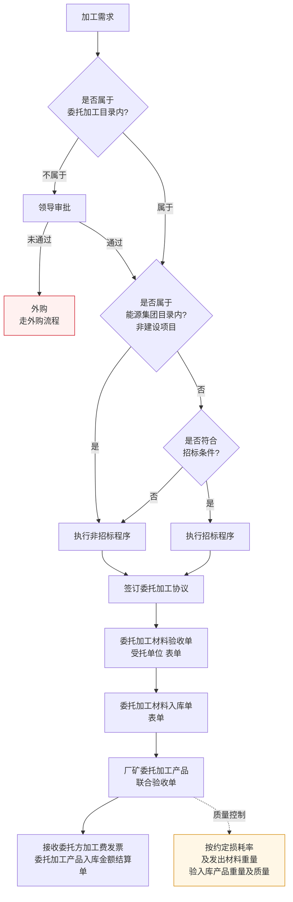

# 委托加工流程

> **来源：** `docs/流程调研/调研原文档/7.委托加工流程图（按新表序调整）.docx`
> **范围：** 委托加工目录判定 → 集团目录 / 招标条件三级判断 → 协议签订 → 材料发出/受托单位验收 → 成品联合验收 → 财务结算
> **核心控制点：** **按约定损耗率验产品**（材料重量 vs 入库产品重量 + 质量）

---

## 总流程

---

## 1. 准入判断（三级递进）

| 判断 | 是 → | 否 → |
|---|---|---|
| **是否属于委托加工目录?** | 进入采购方式判断 | 走领导审批，不通过则外购 |
| **是否属于集团目录?**（非建设项目） | 执行非招标程序 | 进入"是否符合招标条件"判断 |
| **是否符合招标条件?** | 执行招标程序 | 执行非招标程序 |

> 三级判断是**漏斗**：先看是不是委托加工合规范围，再看渠道（集团目录），最后看金额/规模（招标条件）。

## 2. 协议签订

- 通过采购方式选择后，签订**委托加工协议**
- 协议内容应含：约定损耗率 / 加工费 / 交期 / 质量标准（待业务方核对）

## 3. 材料 → 受托单位

| 顺序 | 单据 | 责任方 | 说明 |
|---|---|---|---|
| 1 | 委托加工材料验收单（受托单位）| 受托单位 | 受托单位验收委托方发出的材料 |
| 2 | 委托加工材料入库单 | 受托单位 | 受托单位把材料入受托单位库 |

> **库存所有权：** 材料从委托方发出后，**所有权仍属委托方**（受托单位仅代管 + 加工）。详设需明确该资产口径。

## 4. 成品联合验收

- **单据：** 厂矿委托加工产品联合验收单
- **执行方：** 厂矿（委托方使用单位）+ 受托单位
- **质量控制（关键）：**

> **按约定损耗率及发出材料重量，验入库产品重量及质量**

具体校验：
- **重量：** 入库产品重量 + 损耗 vs 发出材料重量
- **质量：** 产品质量是否符合协议标准

## 5. 财务结算

| 单据 | 用途 |
|---|---|
| 接收委托方加工费发票 | 受托单位开给委托方的加工费发票 |
| 委托加工产品入库金额结算单 | 委托方按"原材料成本 + 加工费"计入产品成本 |

> 与流程 12 节 6（委托加工财务凭证）形成上下游：本流程产生的单据 → 流程 12 财务凭证生成。

---

## 与详设的对应关系（初步）

| 流程节点 | 详设落点 |
|---|---|
| 委托加工目录判定 | 详设 03 主数据 — 委托加工目录维护 |
| 集团目录判定 | 详设 03 主数据 — 集团目录（与流程 02 共享） |
| 委托加工协议 | 详设 04 合同管理 — 委托加工合同子类型 |
| 材料发出 / 受托验收 | 详设 06 出库 + 详设 07 委托加工材料库（受托单位虚拟仓） |
| 联合验收 | 详设 06 入库 — 委托加工成品入库子模块 |
| 损耗率校验 | 详设 04 协议字段 + 详设 06 入库校验规则 |
| 加工费结算 | 详设 05 委托加工成本核算 |

---

## 待业务方核对要点

| # | 疑点 | 影响 |
|---|---|---|
| 1 | "委托加工目录"由谁维护？目录外只能外购吗？ | 影响详设 03 主数据 |
| 2 | "约定损耗率"是协议字段，还是有标准化损耗率库（按物料类别）？ | 影响详设 04 协议字段 |
| 3 | 实际损耗 > 约定损耗率时如何处理？补料？扣加工费？ | 影响详设 04 协议争议处理 |
| 4 | 材料发出阶段"委托方"的库存科目变化：移库 vs 委托加工库？资产负债表如何反映？ | 影响详设 07 委托加工资产口径 |
| 5 | 受托单位的"代管"库存是否纳入物资公司系统？还是仅在协议层面体现？ | 影响详设 06 受托单位虚拟仓设计 |
| 6 | 联合验收的"联合"具体是哪些角色？厂矿 + 受托 + 物资公司？ | 影响详设 10 联合验收审批节点 |

---

## 版本记录

| 版本 | 日期 | 变更 |
|---|---|---|
| V0.1 | 2026-05-07 | 由 docx 转录初稿；待业务方核对 6 处疑点 |
