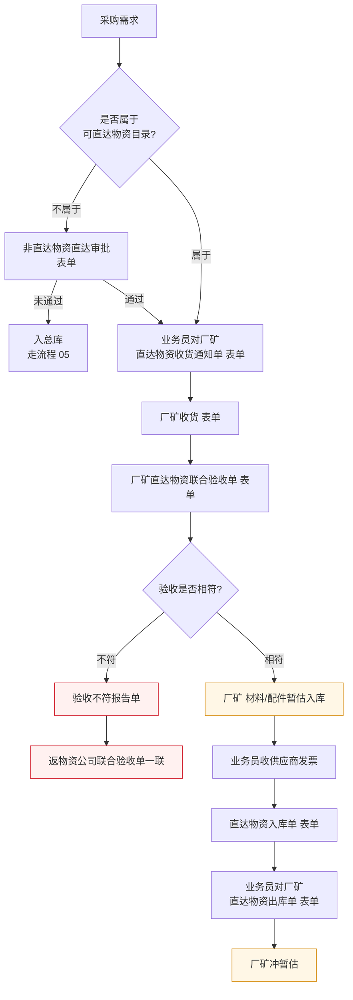

# 物资直达使用单位流程

> **来源：** `docs/流程调研/调研原文档/8.直达使用单位流程图（按新表序调整）.docx`
> **范围：** 直达物资目录判定 → 收货通知 → 厂矿直达验收 → 暂估入库 → 收发票冲减暂估
> **核心：** 物资**不入总库**，直接送达使用单位（厂矿），但仍要在物资公司账面走"虚拟入库 + 出库"完成财务闭环

---

## 总流程

---

## 1. 准入判断

| 判断 | 走向 |
|---|---|
| 属于可直达物资目录 | 直接走直达流程 |
| 不属于但通过《非直达物资直达审批》 | 走直达流程 |
| 不属于且审批未通过 | 走入总库（流程 05） |

> **目录维护责任方：** 待业务方确认（可能由企划部或集团统筹）

## 2. 收货阶段

| 顺序 | 角色 | 动作 | 表单 |
|---|---|---|---|
| 1 | 业务员 | 对厂矿发出直达物资收货通知单 | 表单 |
| 2 | 厂矿 | 收货 | 表单 |
| 3 | 厂矿（联合验收组） | 完成直达物资联合验收单 | 表单 + **附件清单** |

### 2.1 联合验收附件清单（关键留痕）

> **图示注释明确要求附件如下：**
>
> 1. **厂矿内部联合验收单**（厂矿层面已签字版）
> 2. **随货清单**（供应商提供）
> 3. **车号、货物、验收人员同框的影像资料**（防伪关键）
> 4. **与使用部门交接单**

> **附件 #3** 是直达流程的**核心防伪手段**（防止以次充好 / 短少 / 货证不符）。

## 3. 验收分流

| 结果 | 走向 |
|---|---|
| **相符** | 厂矿暂估入库 → 后续暂估冲减闭环 |
| **不符** | 出具验收不符报告单 + 返物资公司联合验收单一联（双方留痕） |

## 4. 暂估闭环（与流程 05 共用）

> 直达物资同样走"暂估入库 → 收发票 → 冲减暂估"的双轨财务闭环，但物理上不入总库。

| 顺序 | 动作 | 表单 |
|---|---|---|
| 1 | 厂矿：材料/配件暂估入库 | — |
| 2 | 业务员收供应商发票 | — |
| 3 | 直达物资入库单（物资公司账面虚拟入库） | 表单 |
| 4 | 业务员对厂矿：直达物资出库单（物资公司账面虚拟出库给厂矿） | 表单 |
| 5 | 厂矿冲暂估 | — |

> **物资公司视角：** "入库单 + 出库单"几乎同时发生（物理上没在总库停留），是**财务记账目的**的虚拟操作，便于销售凭证和厂矿应付的形成。

---

## 与详设的对应关系（初步）

| 流程节点 | 详设落点 |
|---|---|
| 直达物资目录判定 | 详设 03 主数据 — 直达物资目录 |
| 非直达物资直达审批 | 详设 10 §6 审批模板（破例审批节点） |
| 收货通知单 / 直达入库出库单 | 详设 06 直达流程子模块（虚拟入库 + 出库） |
| 联合验收 + 附件 #3（影像资料） | 详设 06 验收附件强约束；详设 11 防伪留痕 |
| 厂矿暂估入库 | 详设 06 暂估闭环（与流程 05 入总库共用模型） |
| 验收不符 → 返一联 | 详设 06 异常处理 + 详设 02 退货流程 |
| 应付账款挂账 | 详设 05 财务凭证（流程 12 节 1/2 直达材料/设备） |

---

## 待业务方核对要点

| # | 疑点 | 影响 |
|---|---|---|
| 1 | "可直达物资目录"由谁维护？更新频度？审批流程？ | 影响详设 03 主数据 |
| 2 | "非直达物资直达审批"的审批层级 / 阈值？是否区分金额？ | 影响详设 10 审批模板 |
| 3 | 附件 #3 影像资料的**最低规格**（清晰度 / 多角度 / 时间戳）？ | 影响详设 11 附件校验 |
| 4 | "联合验收"的"联合"具体由哪些角色组成？厂矿+使用部门+物资公司业务员？ | 影响详设 10 联合验收节点 |
| 5 | 验收不符返回后的处理路径？退货 / 索赔 / 补差？ | 影响详设 02 异常退货流程 |
| 6 | 直达物资是否还要进物资公司**虚拟仓库存台账**？还是只走凭证账面？ | 影响详设 06 虚拟仓设计 |
| 7 | "厂矿"作为内部销售对象的发票口径（销售 vs 移拨）？ | 影响详设 05 销售开票（与流程 0 节四第 4 项同源问题） |

---

## 版本记录

| 版本 | 日期 | 变更 |
|---|---|---|
| V0.1 | 2026-05-07 | 由 docx 转录初稿；待业务方核对 7 处疑点 |
