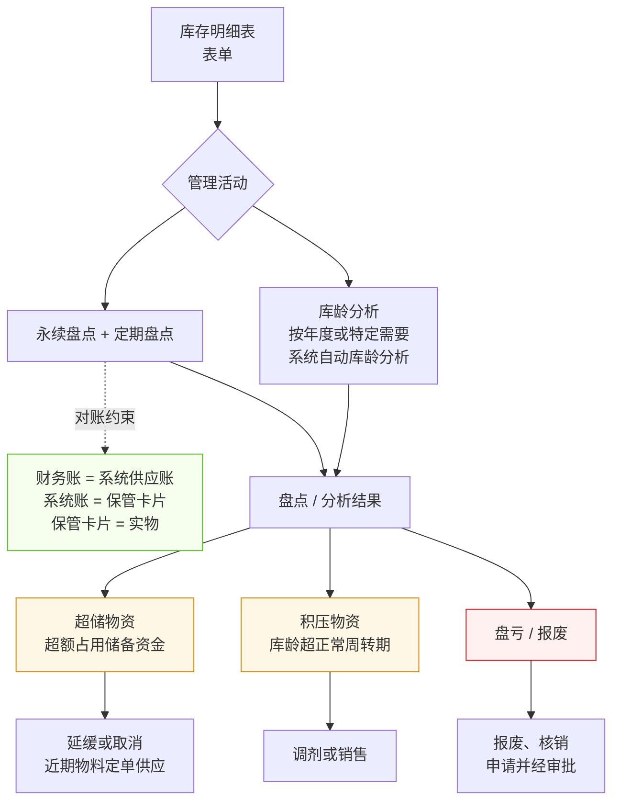

# 存货管理流程

> **来源：** `docs/流程调研/调研原文档/10.存货管理流程图（按新表序调整）.docx`
> **范围：** 库存明细 → 盘点 + 库龄分析 → 三类异常物资识别（超储 / 积压 / 盘亏报废）→ 对应处置动作
> **核心一致性约束：** **财务账 = 系统账 = 保管卡片 = 实物**（四对一致）

---

## 总流程

---

## 1. 数据源：库存明细表

- **表单：** 库存明细表（系统自动生成）
- 是后续盘点、库龄分析的统一数据基础

## 2. 管理活动（并列两类）

### 2.1 永续盘点 + 定期盘点

> **永续盘点：** 实时（每次出入库即更新台账）
> **定期盘点：** 周期性（月/季/年盘）

**关键对账约束（三对一致）：**

| 对照 | 一致目标 |
|---|---|
| 财务账 ↔ 系统供应账 | 月度对账 |
| 系统账 ↔ 保管卡片 | 实物入出账时核对 |
| 保管卡片 ↔ 实物 | 盘点时核对 |

> 三层对账，链条完整后**财务账 ↔ 实物**自动一致。

### 2.2 库龄分析

- **频度：** 按年度或特定需要组织进行
- **方式：** **系统自动库龄分析**
- **输出：** 库龄分布、超期物资清单

## 3. 三类异常物资 + 处置

| 类型 | 判定标准 | 处置动作 |
|---|---|---|
| **超储物资** | 超额占用储备资金 | **延缓或取消**近期物料定单供应 |
| **积压物资** | 库龄超正常周转期 | **调剂或销售**（移库 / 对外处置） |
| **盘亏 / 报废** | 实物缺失或损坏不可用 | **报废、核销申请**并经审批 |

> 三种异常的判定逻辑不同（金额维度 / 时间维度 / 状态维度），但都从盘点 + 库龄分析中暴露出来。

---

## 与详设的对应关系（初步）

| 流程节点 | 详设落点 |
|---|---|
| 库存明细表 | 详设 06 库存台账 + 详设 09 报表（库存明细查询） |
| 永续盘点 + 定期盘点 | 详设 06 盘点子模块 — `INV_COUNT`（永续 / 定期两类） |
| 三对一致约束 | 详设 06 + 详设 11 对账定时任务 + 详设 09 报表（差异预警） |
| 库龄分析（系统自动） | 详设 09 库龄分析报表 + 详设 11 定时任务 |
| 超储 / 积压判定 | 详设 06 库存异常规则引擎（金额阈值 + 周转期阈值） |
| 报废核销审批 | 详设 10 审批模板 — INV:WRITE_OFF（详设 10 §5.3 已含 INV 模块） |
| 调剂或销售 | 详设 06 调剂出库 + 详设 05 销售开票 |
| 延缓 / 取消订单 | 详设 02 采购订单状态机（增 SUSPEND / CANCEL_BY_OVERSTOCK） |

---

## 待业务方核对要点

| # | 疑点 | 影响 |
|---|---|---|
| 1 | 定期盘点的频度（月 / 季 / 年）？是否分物资类别？ | 影响详设 06 盘点定时任务 |
| 2 | "正常周转期"的具体阈值？是否分物资类别（如设备 vs 易耗品）？ | 影响详设 09 库龄分析参数 |
| 3 | "超额占用储备资金"的"超额"判定标准？ | 影响详设 06 超储规则 |
| 4 | "调剂"的具体含义：跨厂矿调拨 / 跨集团内部销售 / 其他？ | 影响详设 06 调剂模块设计 |
| 5 | 报废核销审批层级？金额阈值？谁拍板？ | 影响详设 10 审批模板 |
| 6 | 三对一致约束**发现差异时**的处理流程？谁查谁补？ | 影响详设 11 对账差异处理 |
| 7 | 库龄分析"按年度或特定需要"——"特定需要"具体指哪些场景？是否要支持手动触发？ | 影响详设 09 报表交互设计 |

---

## 版本记录

| 版本 | 日期 | 变更 |
|---|---|---|
| V0.1 | 2026-05-07 | 由 docx 转录初稿；待业务方核对 7 处疑点 |
