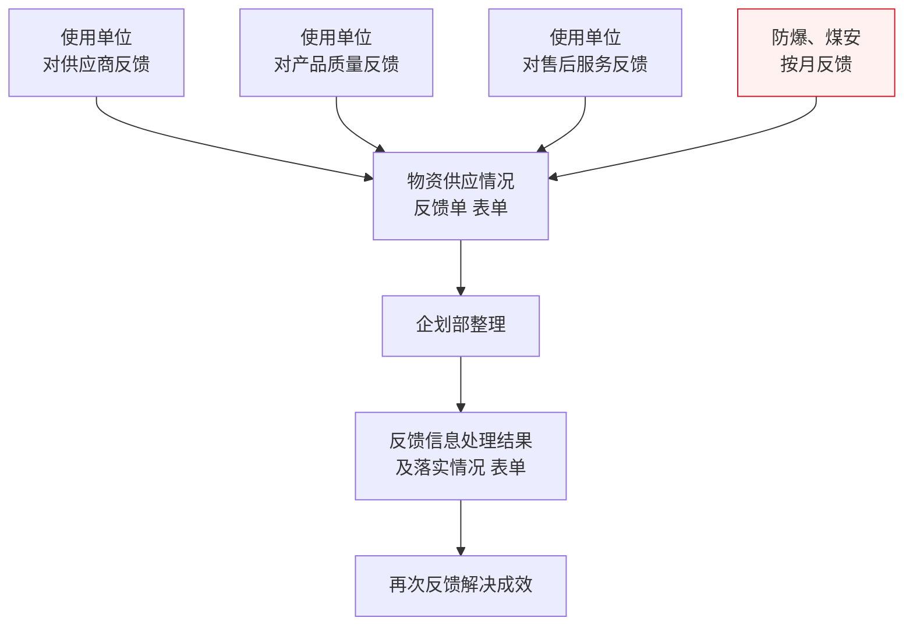

# 后评价流程

> **来源：** `docs/流程调研/调研原文档/11.后评价流程图（按新表序调整）.docx`
> **范围：** 使用单位反馈（4 类） → 反馈单汇总 → 企划部整理 → 处理结果落实 → 成效再反馈（闭环）
> **特别强制项：** **防爆、煤安按月反馈**（高危/合规类强制周期反馈）

---

## 总流程

---

## 1. 反馈来源（4 类）

| # | 反馈方 | 反馈对象 | 频度 |
|---|---|---|---|
| 1 | 使用单位 | 供应商（综合表现）| 不定期 |
| 2 | 使用单位 | 产品质量 | 不定期 |
| 3 | 使用单位 | 售后服务 | 不定期 |
| 4 | 防爆、煤安（合规线） | 物资合规情况 | **按月**（强制） |

> **#4 防爆/煤安**是煤矿企业的强制安全合规要求；其他三类为业务侧主动反馈。

## 2. 反馈汇总

- **统一表单：** 物资供应情况反馈单
- **汇总责任：** 企划部

## 3. 处理与落实

| 顺序 | 动作 | 表单 |
|---|---|---|
| 1 | 企划部整理（合并 4 类反馈，识别共性问题） | — |
| 2 | 输出处理结果及落实情况 | 反馈信息处理结果及落实情况 表单 |
| 3 | 向反馈方再次反馈解决成效（闭环） | — |

> **闭环关键：** 第 3 步是把"处理结果"回送给原反馈方，避免反馈成黑洞。

---

## 与详设的对应关系（初步）

| 流程节点 | 详设落点 |
|---|---|
| 4 类反馈来源 | 详设 02 后评价子模块 — 反馈类型枚举（VENDOR / QUALITY / AFTER_SALES / COMPLIANCE） |
| 防爆/煤安按月反馈（强制周期） | 详设 11 时限 + 详设 09 报表（合规反馈到期预警） |
| 反馈单 → 企划部整理 | 详设 02 后评价工单流转（与详设 03 供应商主数据联动 — 影响 5 级分类） |
| 处理结果落实 | 详设 02 工单状态机（FEEDBACK → PROCESSING → RESOLVED → CONFIRMED） |
| 再次反馈解决成效 | 详设 02 工单闭环（CONFIRMED 状态需反馈方确认） |

---

## 待业务方核对要点

| # | 疑点 | 影响 |
|---|---|---|
| 1 | 4 类反馈是否进**同一张表单**还是各有专项表单？ | 影响详设 02 表单设计 |
| 2 | "防爆、煤安按月反馈"具体指哪些物资类别？由专人提交还是系统自动汇总？ | 影响详设 03 物资分类（is_safety_special 字段，与详设 03 V1.1 M-05 联动） |
| 3 | 反馈"处理结果及落实情况"由谁出？企划部一手还是涉及供应商 / 业务部门联动？ | 影响详设 10 后评价审批模板 |
| 4 | "再次反馈解决成效"是否要留痕？反馈方是否要二次确认？ | 影响详设 02 工单闭环 |
| 5 | 反馈结果**是否影响供应商分类库**（流程 03 的 5 级分类）？联动机制？ | 影响详设 03 + 04 供应商管理联动 |
| 6 | 防爆/煤安反馈未按月提交时的处理：预警？强制流程冻结？ | 影响详设 11 时限兜底 |

---

## 版本记录

| 版本 | 日期 | 变更 |
|---|---|---|
| V0.1 | 2026-05-07 | 由 docx 转录初稿；待业务方核对 6 处疑点 |
