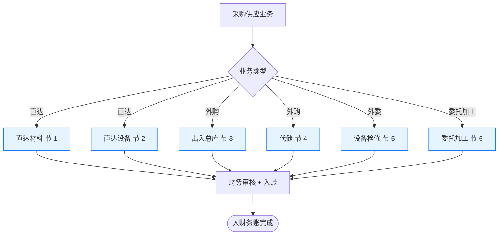
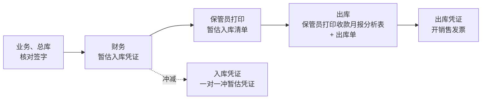
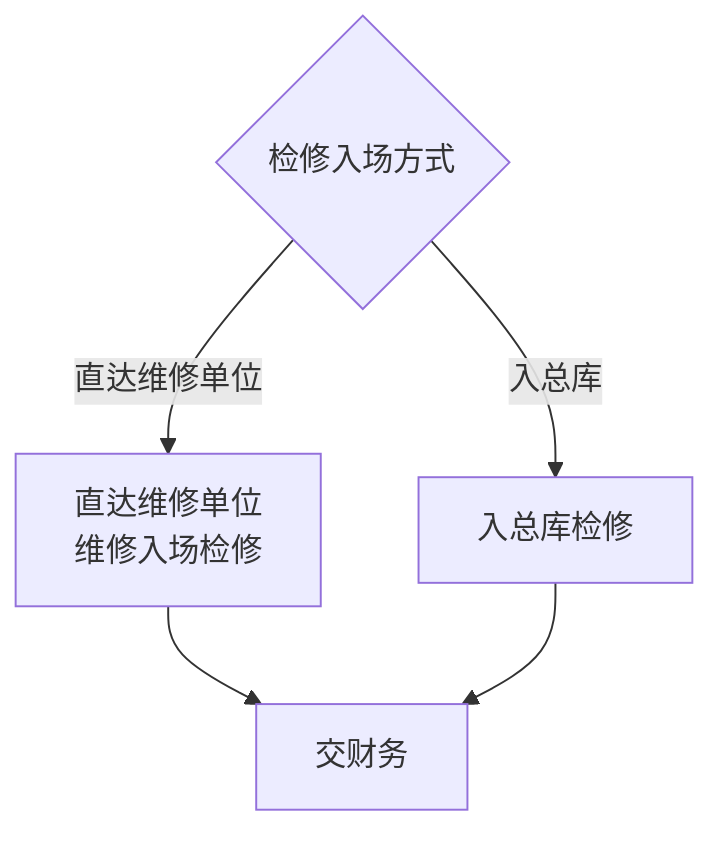

# 采购供应入财务账流程

> **来源：** `docs/流程调研/调研原文档/12.采购供应入财务账流程图.docx`
> **范围：** 6 类采购/供应业务（直达材料 / 直达设备 / 外购出入总库 / 外购代储 / 外委检修 / 委托加工）的**凭证传递 → 财务审核 → 入账**
> **核心逻辑：** **业务凭证（合同/发票/单据）→ 财务凭证（应付/暂估/销售/成本）**，每类业务的凭证清单不同
> **共性约束：** 库存计价采用**移动加权平均**（与基层一致；基层不适用月末一次加权平均）

---

## 总体框架

> **所有路径前置：价审**（合同/发票均经价审后才入财务流程）

---

## 1. 直达材料

> 物资直接送达使用单位，不入总库。

| 类型 | 凭证清单（业务侧上交） |
|---|---|
| 入参 | 价审后合同、价审后发票 |
| 业务单据 | 非直达物资直达审批；直达物资收货通知单；直达物资收货验收单；直达物资入库单；直达物资出库单 |

**财务动作：** 财务审核 → **入库凭证挂应付账款**

## 2. 直达设备

> 设备类直达，入凭证清单比材料多"设备购置计划通知单"。

| 类型 | 凭证清单 |
|---|---|
| 入参 | 价审后合同、价审后发票 |
| 业务单据 | 非直达物资直达审批单；**设备购置计划通知单**；直达物资收货通知单；直达物资收货验收单；直过物资入库单；直达物资出库单 |

**财务动作：** 财务审核 → **出库凭证开销售发票**

## 3. 外购入总库 + 出库（暂估 ↔ 冲减）

> 外购正常入总库的常规路径；与详设 06 的"采购入总库 + 出总库"流程对应。

**财务动作：**
- **入库时：** 暂估入库凭证（先按合同价暂估，发票未到时挂账）
- **冲减时：** 入库凭证一对一冲暂估凭证
- **出库时：** 出库凭证开销售发票
- **库存计价：** 移动加权平均
- **核查：** 财务**定期核对暂估，且不超时限**

> **与流程 5（采购入总库）+ 流程 6（出总库）的关系：** 流程 5/6 是**业务侧**视角；本节是**财务侧**视角。两个流程产生的单据汇合到本节做财务凭证处理。

## 4. 外购代储

> 代储 = 物资暂存代储仓库，按消耗结算。

| 类型 | 凭证清单 |
|---|---|
| 入参 | 价审后合同、价审后发票 |
| 业务单据 | **非代储物资代储审批单**；代储物资到场通知单；代储物资消耗汇总及附件；代储物资入库单；代储物资出库单 |

**财务动作：** 财务审核（按消耗节奏入账，**不一次性挂应付**）

## 5. 外委设备检修

> 设备送外委维修，分两种入场方式。

**凭证清单：** 价审后合同；价审后发票；**设备检修竣工报告**；**更换配件回收单**；修毕送达总库入库单；由总库送达厂矿出库单；检修设备验收单；检修设备结算单。

**财务动作：** 财务审核 → 出**检修凭证**

> **共有 2 套近似的凭证清单**（"检修设备验收单/结算单" 与 "设备检修验收单/结算单"），疑似图中重复，**待业务方核对**。

## 6. 委托加工

> 自有材料委托外部加工，加工费 + 材料移拨双轨入账。

| 类型 | 凭证清单 |
|---|---|
| 入参 | 价审后合同、价审后发票 |
| 业务单据 | 委托加工审批单；委托加工产品入库联合验收单；委托加工产品入库金额结算单；委托加工产品入库单 |
| 材料侧 | 合同、移拨材料单 |

**财务动作：**
- **加工完毕交财务** → **按委托加工费增加委托加工物资，并入库凭证单**
- **材料出库交财务** → 委托加工物资凭证（材料出库进入加工成本）

---

## 共性原则（贯穿所有业务）

| # | 原则 | 适用范围 |
|---|---|---|
| 1 | **价审前置** | 所有合同/发票必须经价审才能入财务流程 |
| 2 | **移动加权平均**计价 | 总库（与基层一致）；基层不适用月末一次加权平均 |
| 3 | **暂估闭环**（一对一冲减） | 外购入总库；最长不超 12 个月（详见流程 5） |
| 4 | **定期核对暂估** | 财务侧周期任务，超时限触发预警 |

---

## 与详设的对应关系（初步）

| 流程节点 | 详设落点 |
|---|---|
| 6 类业务分流 | 详设 02/04 业务类型枚举 → 详设 05 财务接口路由 |
| 价审前置 | 详设 04 合同管理 — 价审子模块 |
| 暂估入库凭证 / 冲减暂估凭证 | 详设 05 财务凭证生成；详设 08 NC 接口 |
| 出库凭证 / 销售发票 | 详设 05 出库财务路径；详设 08 NC 接口 |
| 移动加权平均（基层 vs 总库差异） | 详设 07 库存计价（移动加权 vs 月末一次） |
| 定期核对暂估 + 时限 | 详设 09 报表（暂估超期）+ 详设 11 时限 |
| 委托加工 / 外委检修单据 | 详设 02 业务子模块（详设 §委托加工 / §外委维修） |

---

## 待业务方核对要点

| # | 疑点 | 影响 |
|---|---|---|
| 1 | 6 类业务的判断条件是什么？同一物资可能跨类型吗？ | 影响详设 02 业务路由 |
| 2 | "外委设备检修"两套验收/结算单（"检修设备…" vs "设备检修…"）是否同一组单据的不同写法？ | 影响详设单据清单 |
| 3 | 直达材料"挂应付账款" vs 直达设备"开销售发票"—两类的财务语义差异？ | 影响详设 05 凭证类型 |
| 4 | 代储物资"消耗汇总及附件"的汇总周期？月度？季度？ | 影响详设 11 定时任务 |
| 5 | "暂估超期"的具体时限是什么？流程 5 提到"最长不超 12 个月"，是否同源？ | 影响详设 09 暂估超期预警 |
| 6 | 移动加权平均是物资类全口径，还是分仓位/分类别？ | 影响详设 07 计价模型 |
| 7 | 委托加工的"加工费增加委托加工物资"是会计处理的口语化表达，还是有专门的成本归集口径？ | 影响详设 07 委托加工成本核算 |

---

## 版本记录

| 版本 | 日期 | 变更 |
|---|---|---|
| V0.1 | 2026-05-07 | 由 docx 转录初稿；6 类业务整理为独立小节；待业务方核对 7 处疑点 |
