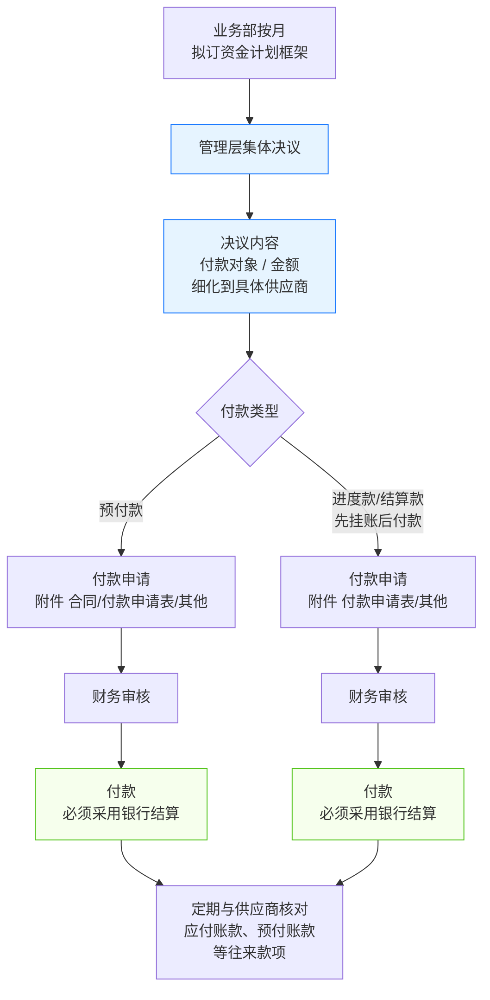

# 支付采购款流程

> **来源：** `docs/流程调研/调研原文档/13.支付采购款流程图.docx`
> **范围：** 月度资金计划 → 管理层集体决议 → 双路径付款（预付款 / 进度款·结算款）→ 银行结算 → 定期对账
> **核心原则：** **付款必须采用银行结算**；预付款"先付后结"，进度/结算款"先挂账后付款"

---

## 总流程

---

## 1. 资金计划与决议（前置）

### 1.1 月度资金计划框架

- **执行方：** 业务部
- **频度：** 按月
- **输出：** 资金计划框架（覆盖全月预计支付）

### 1.2 管理层集体决议

| 项 | 内容 |
|---|---|
| **讨论依据** | 资金计划框架；支付预付款、质保金计划；应付款项余额表；其他资料 |
| **决议产物** | 付款对象 / 金额（**细化到具体供应商**）|

> 决议是付款的**前置授权**：未经决议的付款不能进入下游申请。

---

## 2. 付款双路径

| 类型 | 时序逻辑 | 附件清单 |
|---|---|---|
| **预付款** | 先付款（合同条款约定） | **合同** + 付款申请表 + 其他 |
| **进度款 / 结算款** | **先挂账后付款** | 付款申请表 + 其他（合同已签时不重复附） |

### 2.1 共同环节（两路径相同）

| 顺序 | 动作 | 责任方 |
|---|---|---|
| 1 | 付款申请 | 业务员 |
| 2 | 财务审核 | 财务 |
| 3 | 付款 | 财务（**必须银行结算**） |

> **关键约束：付款必须采用银行结算**（不允许现金 / 票据等其他形式）

### 2.2 两路径关键差异

- **预付款**：合同生效后即可申请付款，**附合同**为必要附件（证明付款依据）
- **进度款/结算款**：先**挂账**（应付账款入账），再走付款流程；附件中不强制合同（应付账款已挂时合同已经在系统）

---

## 3. 定期对账（事后）

- **频度：** 定期（具体周期待业务方确认）
- **对象：** 供应商
- **内容：** 应付账款、预付账款等往来款项

> 对账是闭环：把"已付款"映射回"应付/预付"科目，发现差异及时调账。

---

## 与详设的对应关系（初步）

| 流程节点 | 详设落点 |
|---|---|
| 月度资金计划框架 | 详设 05 财务模块 — 资金计划子模块 |
| 管理层集体决议 | 详设 10 §6 审批模板（高金额 / 跨部门 — 集体决议节点） |
| 付款对象细化到供应商 | 详设 03 主数据 — 供应商主数据 |
| 双路径（预付款 / 进度款·结算款） | 详设 05 付款单据类型枚举（PAY:PREPAID / PAY:PROGRESS / PAY:FINAL） |
| 财务审核 + 银行结算 | 详设 05 + 详设 08 NC 接口（银行结算 → 资金对账） |
| 应付账款 / 预付账款 | 详设 05 财务凭证（与流程 12 入财务账上下游） |
| 定期对账 | 详设 05 对账子模块 + 详设 11 定时任务 + 详设 09 报表（往来款余额） |

---

## 待业务方核对要点

| # | 疑点 | 影响 |
|---|---|---|
| 1 | "管理层集体决议"是否每月一次？还是按需发起？决议人范围？ | 影响详设 10 集体决议节点配置 |
| 2 | 决议输出"付款对象/金额（细化到具体供应商）"是名单制还是额度制？ | 影响详设 05 资金计划锁定逻辑 |
| 3 | 预付款的"附件:合同"是否是**首次**付款必附，后续付款可豁免？ | 影响详设 05 付款附件校验 |
| 4 | "先挂账后付款"中的"挂账"动作具体在哪个环节？由谁触发？（流程 12 入财务账已挂应付？） | 影响详设 05 与详设 12 业务接力点 |
| 5 | 定期对账周期：月？季？年？由谁发起？ | 影响详设 11 定时任务 |
| 6 | "质保金"的支付时点和退还流程？是否在本图范围（图中只提了"质保金计划"作为决议依据）？ | 影响详设 04 质保金子模块 |
| 7 | 银行结算的具体形式（电汇/票据/承兑）是否有口径区分？ | 影响详设 05 付款方式枚举 |

---

## 版本记录

| 版本 | 日期 | 变更 |
|---|---|---|
| V0.1 | 2026-05-07 | 由 docx 转录初稿；待业务方核对 7 处疑点 |
