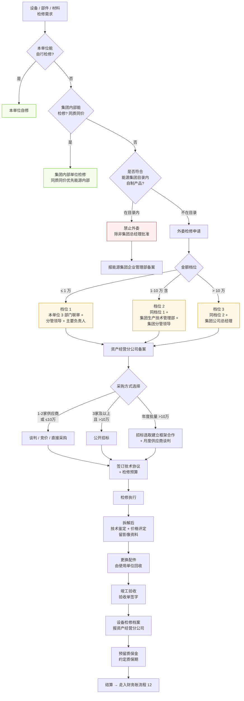
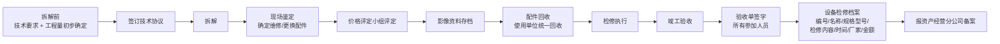

# 外委检修流程

> **来源：** 由政策附件提炼 — `docs/流程调研/政策解析/01-外委检修管理办法.md`（阜矿发 [2025] 63 号，2025-07-15）
> **范围：** 检修需求 → 自修/内部/外部判断 → 外委审批（金额三档）→ 采购方式选择 → 检修执行 → 验收 → 结算
> **特殊性：** 原始 13 张流程图**未独立绘制**外委检修，仅在流程 12 节 5 作财务凭证子分支提及；本流程由政策附件提炼补全，编号续接为 14。
> **业务方答复联动：** Q-00-1 业务方提交"检修管理办法"作为答复 → 业务方**可能将"出租设备"误归为"外委检修"**，需澄清术语。

---

## 总流程

---

## 1. 适用与术语

| 术语 | 定义 |
|---|---|
| **外委检修** | 内部不具备技术 / 工器具 / 资质等条件时，**委托具有法人资格、检修资质和检修能力的单位**进行机电设备 / 部件 / 材料检修 |
| **委托检修单位** | 发起外委检修的本公司 / 本单位（业务侧）|
| **外委检修单位** | 实际承担检修任务的外部供应商 |
| **检修领导小组** | 委托检修单位内部成立的临时组织（组长 = 主要负责人 / 副组长 = 分管领导 / 成员 = 生产/机电/供应等部门负责人）|

---

## 2. 检修优先级（漏斗）

| 顺序 | 检修方 | 强制约束 |
|---|---|---|
| 1 | **本单位自修** | 能修必须自修 |
| 2 | **集团公司内部单位** | 同质同价优先**能源内部企业**；内部单位**严禁拒不承担** |
| 3 | **集团公司外部单位**（外委）| 仅当 1+2 都不能时；**严禁转包** |

---

## 3. 外委审批（金额三档）

> **关键阈值（来源：政策第九条）：**

| 金额档位 | 审批链 | 备案 |
|---|---|---|
| **≤ 1 万元** | 本单位生产/机电/供应**联合审核** → 本单位分管领导 → 主要负责人 | 资产经营分公司 |
| **1-10 万元（含 10 万）** | 同上 + 集团公司生产技术管理部 → 集团分管领导 | 资产经营分公司 |
| **> 10 万元** | 同上 + **集团公司总经理** | 资产经营分公司 |

**特例（自制产品目录内）：** 禁止外委；确因特殊原因外委 → **集团公司总经理批准** → 报能源集团企业管理部备案。

**附件清单（外部检修审批单必附）：**
1. 集团公司及能源集团内部检修单位**不满足检修要求的回复函**（集团内部必须有回函；能源集团目录库内没有的不需要回函）
2. 煤矿单位按《机电设备检修管理实施细则》分两类管理（资产经营分公司直接申报 / 煤矿自行管理后备案）
3. 其他非煤单位按表格审批后报资产经营分公司备案

---

## 4. 采购方式选择

| 采购方式 | 适用条件 |
|---|---|
| **谈判 / 竞价 / 直接采购** | (a) 独家或只有 2 家外委单位具备检修资质能力 (b) 单台或批量 ≤ 10 万元（含）|
| **公开招标** | (a) 具备 **3 家及以上**外委检修单位 (b) 单台或批量 > 10 万元 |
| **框架合作 + 月度谈判** | 年度内批量 > 10 万 → 招标选取供应商 → 建立框架机制 → 按月度需求供应商谈判形式确定 |

> 公开招标前：**市场调研 → 检修预算 → 标底价格** → 公开招标。

---

## 5. 价格上限规则

> **第五条第（二）款：** 外委检修价格**原则上不超过原值的 40%**。

实施层落点：
- 详设 04 / 05 应建模"设备原值"字段（与 M-05 物料主数据 / M-13 设备主数据联动）
- 外委检修类合同 / 订单 → **价格上限校验**（≤ 原值 × 40%）

---

## 6. 检修执行与验收

**关键控制点：**
- **技术鉴定影像存档**（拆解后 + 配件确认 + 价格评定）— 详设 11 附件强约束
- **配件回收统一**（使用单位）— 防止"以旧充新"
- **质保期 + 质保金**预留 — 详设 05 §C-04 保证金子模块联动

---

## 7. 月度上报

| 频度 | 动作 | 责任方 | 接收方 |
|---|---|---|---|
| **每月 20 日前** | 月度 / 季度 / 年度外委检修项目完成情况汇总 | 委托检修单位 | 资产经营分公司 |
| 月度汇总后 | 统一报送 | 资产经营分公司 | 集团公司生产技术管理部 |

---

## 8. 罚则与合规

| 违规情形 | 处置 |
|---|---|
| 内部能修却外委 | 严格追究委托单位相关责任人和负责人责任 |
| 内部具备能力但以借口不承担 | 同上 |
| 审核 / 签字 / 验收过程中不认真履职 | 视情节处罚；构成违纪给纪律处分；涉嫌违法移送司法 |

---

## 与详设的对应关系

| 流程节点 | 详设落点 |
|---|---|
| 检修优先级（自修 / 内部 / 外部）| 详设 04 业务类型枚举 + 路由规则；详设 02 §业务流程主路径增 REPAIR 业务 |
| 金额三档审批 | 详设 10 §6.2 增 **WF-RPR-001 外委检修审批模板**（4 节点：本单位 → 集团生技 → 集团分管 → 集团总经理）；金额阈值 1万 / 10万 落 §九 配置项 |
| 采购方式选择 | 详设 04 §招采路由（与流程 02 共用 `pur_method` 枚举），区分 ≤10 万 vs >10 万 |
| 价格上限 40% | 详设 05 合同 / 04 订单 — 价格上限校验规则（基于设备原值） |
| 拆解后影像存档 | 详设 11 附件强约束（与流程 08 直达流程影像同源） |
| 配件回收 | 详设 06 库存（旧配件入库 / 新配件出库联动） |
| 验收单 + 设备档案 | 详设 06 验收子模块 + 详设 07 设备档案（可能涉及详设 07 设备主数据扩展）|
| 质保金 | 详设 05 §C-04 保证金子模块（与 Q-04-2 业务方答复"金额≥20万 + 招标 + 10%"是否同源待澄清） |
| 月度报送 | 详设 11 时限 + 详设 09 报表（外委检修月度统计）|
| 财务凭证 | 详设 08 BIZ-019 委托加工财务触发（外委检修可能复用此接口或独立 BIZ-019A） |

---

## 与原 13 张调研流程的关系

| 原调研流程 | 与本流程的关系 |
|---|---|
| 流程 12 节 5 外委设备检修 | 本流程是其**前置 + 主体**；流程 12 是其**财务凭证**（出检修凭证） |
| 流程 02 采购方式 | 共享决策树：阈值（10 万 vs 100 万）+ 招标条件判断 |
| 流程 04 合同审批 | 外委检修合同走特殊审批链（非标准合同审批模板）|
| 流程 03 供应商管理 | 外委检修单位作为特殊类别供应商（资质审核：检修资质）|
| 流程 11 后评价 | 外委检修后续质量反馈 → 影响检修单位评价 |
| 流程 10 存货管理 | 配件回收涉及库存（旧配件入库）|

---

## 待业务方核对要点

| # | 疑点 | 影响 |
|---|---|---|
| 1 | "出租设备" vs "外委检修"术语差异：业务方 Q-00-1 答复将本办法作为"出租设备"流程附件，需澄清两者关系 | 影响详设 02 业务类型枚举 |
| 2 | 外委检修的**质保金比例**（政策只说"预留"未明示比例）— 与 Q-04-2 答复的 10% 是否同源？ | 影响详设 05 §C-04 保证金 |
| 3 | "原值 40%"上限是否硬约束？超过怎么处理？ | 影响详设 04 / 05 价格校验级别 |
| 4 | "煤矿单位 vs 非煤单位"管理差异（附件 #2 提到分两类），具体规则？ | 影响详设 04 / 02 业务路由 |
| 5 | "能源集团内部企业"具体指哪些（与"集团公司内部单位"区分）？ | 影响详设 03 主数据 — 集团目录维护 |
| 6 | 框架合作（年度 >10 万）的合同形式 — 是框架合同还是按次合同？ | 影响详设 05 合同分类 |

---

## 版本记录

| 版本 | 日期 | 变更 |
|---|---|---|
| V0.1 | 2026-05-09 | 由政策 01-外委检修管理办法.md 提炼为业务流程；补全原 13 张流程图缺失的"外委检修"独立流程；与详设各模块的对应关系初步映射；6 项待业务方核对要点 |
