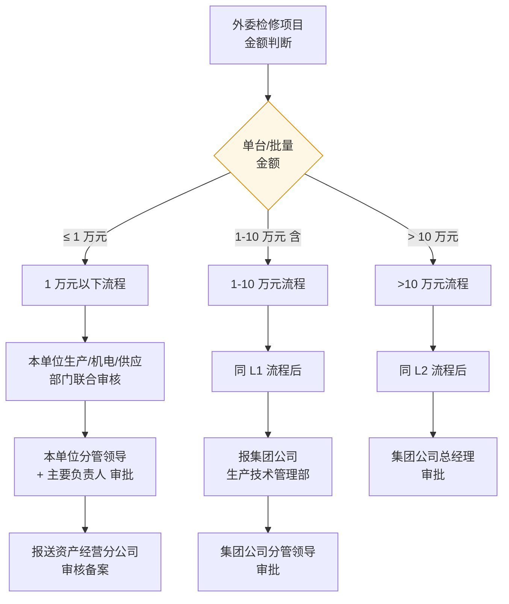

# 阜矿集团外委检修管理办法

> **来源：** `docs/流程调研/调研原文档/1阜矿发[2025]63号 关于印发阜矿集团外委检修管理办法的通知.pdf`
> **发布：** 阜新矿业集团综合办公室 2025-07-15 印发（阜矿发 [2025] 63 号）
> **配套：** 《阜矿集团机电设备检修管理实施细则》（本办法是其补充规定，冲突时以本办法为准）
> **依据：** 《辽宁省能源产业控股集团有限责任公司自制产品管理实施细则（试行）》

---

## 一、适用范围

| 适用对象 | 备注 |
|---|---|
| **集团公司及所属分公司** | 直接适用 |
| **全资子公司 / 集团公司控股公司** | 参照本办法，结合实际制定 |

**外委检修定义：** 内部不具备技术 / 工器具 / 资质等条件时，委托本单位及集团公司外部具有法人资格、检修资质和检修能力单位进行**机电设备、部件及材料检修**。

---

## 二、检修优先级（漏斗）

```
本单位自修
  ↓ 不能修
集团公司内部单位检修（同质同价优先能源内部企业）
  ↓ 不能修
集团公司外部单位检修
```

**强制约束：**
- 内部能修的，**严禁**委托检修单位选择外部单位检修
- 公司内部检修单位**严禁以任何理由拒不承担**检修任务（特殊情况须详细注明原因 + 按本办法第三章审批）
- **严禁转包**

---

## 三、外委检修原则（关键阈值）

| 原则 | 内容 |
|---|---|
| **应招尽招** | 外委检修坚持应招尽招原则 |
| **价格上限** | 外委检修价格**原则上不超过原值的 40%** |
| **专业资质** | 本单位无专业资质，按规定需相应资质，必须由专业厂商或人员维修 |
| **技术能力** | 本单位不具备相应技术能力 / 技术装备 |
| **施工力量** | 本单位维修量大，施工力量不足，要求时间内无法完成 |

---

## 四、组织职责

### 4.1 委托检修单位

成立**外委检修领导小组**：组长 = 主要负责人 / 副组长 = 分管领导 / 成员 = 生产/机电/供应等部门负责人。

**职责清单：**
1. 月度 / 季度 / 年度外委检修项目完成情况汇总，**每月 20 日前**报送资产经营分公司
2. 检修项目实施前技术要求和工程量初步确定 + 预算编制 + 招标/比价/竞价 + 技术协议签订
3. 技术鉴定、审核：拆解后组织技术人员现场鉴定 + 价格评定小组 + **保留影像资料存档**
4. 配件回收：更换下来的配件由**使用单位统一回收**
5. 竣工验收 + 结算

### 4.2 经营管理与发展改革部

负责外委检修项目招标所涉相关业务**监督检查**

### 4.3 生产技术管理部

负责外委检修项目及技术要求审核 + 每年组织对外委检修项目检查

---

## 五、审批阈值（关键控制点）

> **第八条：** 符合《辽宁省能源产业控股集团有限责任公司自制产品管理实施细则》目录**以内**的产品，**禁止外委**；确因特殊原因到外部检修的，**经集团公司总经理批准**后报能源集团企业管理部备案。

> **第九条：** 目录**以外**的产品按以下流程审批（**关键**）：



**审批阈值汇总表：**

| 金额档位 | 内部审批 | 集团审批 | 资产经营分公司 |
|---|---|---|---|
| **≤ 1 万元** | 本单位 3 部门联审 + 分管领导 + 主要负责人 | — | 备案 |
| **1-10 万元（含）** | 同上 | 集团生产技术管理部 + 集团分管领导 | 备案 |
| **> 10 万元** | 同上 | 集团生产技术管理部 + 集团分管领导 + **集团公司总经理** | 备案 |

---

## 六、采购方式（招标 vs 谈判/竞价/直接）

| 采购方式 | 适用条件 |
|---|---|
| **谈判 / 竞价 / 直接采购** | (1) 独家或只有两家外委单位具备检修资质能力<br/>(2) 设备检修费**单台或批量 ≤ 10 万元**（含 10 万元） |
| **公开招标** | (1) 具备 **3 家及以上**外委检修单位<br/>(2) 设备检修费**单台或批量 > 10 万元**<br/>(3) 年度内批量超 10 万 → **招标选取建立框架合作机制**，按月度需求采取供应商谈判形式 |

> 公开招标前，委托检修单位需根据市场调研制定**详细检修预算**，确定**检修标底价格**后方可组织。

---

## 七、验收管理

| 项 | 内容 |
|---|---|
| **验收主体** | 委托检修单位组织本公司相关使用单位 / 部门 |
| **验收依据** | 签订的合同 + 技术协议 |
| **验收记录** | 所有参加验收人员在**验收单上签字确认** |
| **设备档案** | 产权挂账单位建立设备检修档案：编号 / 名称 / 规格型号 / 检修内容 / 检修时间 / 检修厂家 / 检修金额；**报资产经营分公司备案** |
| **质保金** | **质保期 + 预留质保金**（具体比例本办法未明示，待业务方确认） |

---

## 八、罚则（合规要点）

通过监督、检查、举报等发现在审核、签字、验收过程中不认真履职：
- 视情节轻重处罚；构成违纪按规定给予纪律处分；涉嫌违法犯罪移送司法
- **追究责任的两类情况：**
  - 内部能自修却外委的 → 严格追究委托单位相关责任人和负责人责任
  - 内部具备能力但以借口不承担的 → 同上

---

## 九、附件 — 外部检修审批单（3 档）

办法附 3 张审批单模板：
- 10 万元以上版本（多 1 列"集团公司总经理"签字栏）
- 10 万元以下版本（含 1-10 万元，签到"集团分管领导"）
- 1 万元以下版本（仅本单位 + 资产经营分公司层签字）

**共性附件清单：**
1. 集团公司及能源集团内部检修单位不满足检修要求的**回复函**（集团内部必须有回函；能源集团目录库内没有的不需要回函）
2. 煤矿单位按《机电设备检修管理实施细则》分两类管理（资产经营分公司管理部份直接申报；煤矿单位自行管理部份按格审批后报备）
3. 其他非煤单位按表格审批后报资产经营分公司备案

---

## 与 P0 答复 / 调研流程的对应关系

| 维度 | 内容 | 对应 |
|---|---|---|
| **业务方 Q-00-1 答复** | "已补充流程图（附件名：检修管理办法）" | **本附件**（业务方提交的"出租设备"流程参考材料） |
| **Q-00-1 进一步澄清** | 业务方把"出租设备"答复关联到"外委检修管理办法" — 但**本附件主体是机电设备外委检修，不直接涉及"出租"业务**。需澄清："出租设备"在框架图（流程 0）中的真实含义 | ⚠ 需追问业务方 |
| **流程 12 节 5 外委设备检修** | 调研描述了外委设备检修的财务凭证（设备检修竣工报告 / 更换配件回收单 / 检修设备验收单 / 检修设备结算单） | ✅ 本办法 §四 + §七 验收对应 |
| **审批阈值** | 1 万 / 10 万 两档 | 详设 10 §6.2 应增 WF-RPR-001 外委检修审批模板（4 节点：本单位 → 集团生技 → 集团分管 → 集团总经理） |
| **采购方式** | 谈判/竞价/直接 ≤10 万；公开招标 >10 万；年度 >10 万走框架 | 与流程 02 采购方式判断口径一致（流程 02 是 100 万阈值，本办法是 10 万 — **阈值差异！**） |
| **价格上限 40%** | 外委检修价格不超原值 40% | 详设 04 / 05 应增价格校验规则（外委检修类合同） |
| **质保金** | 外委检修预留质保金 | 详设 05 §C-04 付款节点 + Q-04-2 履约保证金联动 |
| **影像存档** | 拆解后保留影像资料 | 与流程 08 直达流程"附件 #3 影像资料"同源；详设 11 附件存档规约 |
| **每月 20 日前汇总报送** | 月度强制时限 | 详设 11 时限 |

---

## 重点疑点 / 与现有规约的差异

| # | 内容 | 影响 |
|---|---|---|
| 1 | "出租设备" vs "外委检修"术语差异 | 框架图 0 的"出租设备"业务类型，业务方提交本附件作为答复 — 需澄清两者关系（同义？还是业务方误填？） |
| 2 | **阈值 10 万 vs 流程 02 的 100 万** | 外委检修阈值（10 万）与采购方式判断阈值（100 万）不同 — 详设 10 §九阈值表达式需区分业务类型 |
| 3 | 价格上限"原值 40%" | 详设 04 / 05 需建模"设备原值"字段 + 外委检修类合同的价格上限校验 |
| 4 | "应招尽招"原则 | 与详设 04 §8.3.1 最终口径一致：Q-02-6 已按方案 C 拍板为“强约束 + 简化特批”，不再按单纯软提示放行 |

---

## 版本记录

| 版本 | 日期 | 变更 |
|---|---|---|
| V0.1 | 2026-05-09 | 由 PDF 解析整理；提炼审批阈值 + 采购方式 + 价格上限 + 验收 + 影像存档要点；与 P0 答复 / 调研流程做对应关系映射 |
| V0.2 | 2026-05-09 | 同步 Q-02-6 最终拍板结果：详设 04 §8.3.1 已由“软提示”调整为“强约束 + 简化特批”。 |
