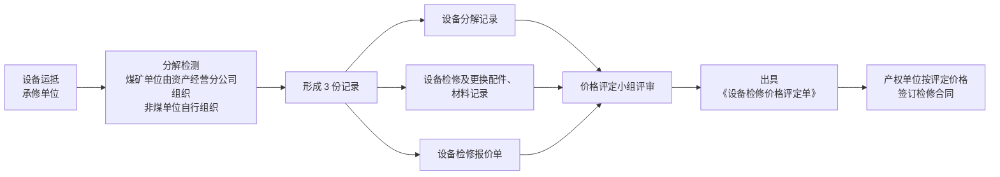
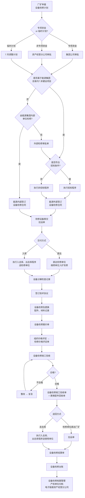

# 阜矿集团机电设备检修管理实施细则（试行）

> **来源：** `docs/流程调研/调研原文档/2阜矿集团机电管理管理检修细则(2).pdf`（25 页，扫描版，由 OCR 提取）
> **文号：** 阜矿发 [2025] 24 号（2025-03-07 印发）
> **作废前版本：** 阜矿发字 [2023] 73 号
> **依据：** 《阜新矿业（集团）有限责任公司工程管理办法》
> **重大价值：** **本细则是政策 01-外委检修管理办法的母本**（外委办法是其补充）；含完整流程图（附件 1）+ 价格评定 + 验收 + 结算细则

---

## 一、适用范围（第一~三条）

| 项 | 内容 |
|---|---|
| **适用主体** | 集团公司及所属分公司；全资子公司及控股公司参照 |
| **适用范围** | 集团所属各单位**自身不具备检修能力**，需外部单位检修的机电设备 |

> **目标：** 精细化、规范化、透明化；延长设备寿命；提高使用效率；控制成本支出

---

## 二、组织架构

### 2.1 集团机电设备检修领导小组（第四条）

```
组长：总经理
副组长：副总师以上领导
成员：生产技术管理部、安全监察部、经营管理与发展改革部、
      法律风控部、财务部、审计部、纪检监察部、资产经营分公司
```

**领导小组下设办公室**（设在**资产经营分公司**）：
- 主任 = 资产经营分公司主要负责人
- **核心职责：** 煤矿单位机电设备及工程车辆**外部检修申报** + 供应商评选方式申报 + 价格评定 + 租赁设备检修合同全过程管理 + 检修供应商考察评价

### 2.2 各部门职责（第五条）

| 部门 | 关键职责 |
|---|---|
| **资产经营分公司** | 煤矿单位检修工作核心管理主体（计划 / 拉运 / 价格评定 / 验收 / 合同） |
| **生产技术管理部** | 检修计划审核 + 技术标准审核 + **外修 10 万 / 内修 20 万以上检修完毕结算审核** |
| **经营管理与发展改革部** | 招标组织 + 合同合规性审核 |
| **法律风控部** | 涉法事项审核 |
| **财务部** | 资金保证 + 资金使用监督 + 财务合规性审核 |
| **审计部** | 独立审计 |
| **纪委监察部** | 违规违纪查处 |
| **集团各单位** | 编制本单位计划 + 提供技术 / 商务要求 + **非煤单位自行组织价格评定 + 自行组织联合验收** + 合同签订验收挂账结算 + 推荐供应商 |

> **每月 24 日**机电设备检修推进情况向资产经营分公司备案，由其上报生产技术管理部。

---

## 三、检修计划管理

### 3.1 计划分类（第六条）

| 计划类型 | 提报时间 |
|---|---|
| **年度检修计划** | 本年 **10 月 30 日前**报下一年度（含采、掘工作面安装机电设备）|
| **月度检修计划** | 每月 **15 日前**报下月 |
| **临时检修计划** | 由使用单位履行内部决策后填《临时检修计划审批单》→ 资产经营分公司复核 → 集团公司审批后执行 |

### 3.2 提前提报要求（第九条）

| 项目类型 | 提前期 |
|---|---|
| **掘进工作面**机电设备检修 | 提前 **3 个月** |
| **采煤工作面安装 + 四大机械等大型机电设备**检修 | 提前 **6 个月** |

### 3.3 不列入专项资金计划阈值（第十四条 — **关键**）

| 检修类型 | 单价上限 | 全年累计上限 | 处理方式 |
|---|---|---|---|
| **外部检修** | < 1 万元 | ≤ 10 万元 | 按月上报资产经营分公司**资产管理与设备检修中心**备案审核 |
| **内部企业检修** | < 2 万元 | ≤ 20 万元 | 同上 |

资产经营分公司将月统计情况上报生产技术管理部备案。

---

## 四、供应商评选（第十五~十八条）

| 项 | 内容 |
|---|---|
| **评选方式依据** | 《阜新矿业（集团）有限责任公司招标采购管理办法（试行）》(即政策 04) |
| **优先供应商** | 集团公司内部单位 + 能源产业集团内部煤机企业（**发内部询证函进行确认**）|
| **外部检修审批** | 内部不能满足时填《外部检修审批单》→ 审批通过后选**原主机厂家或生产单位**检修 |
| **煤矿单位** | 由**资产经营分公司**组织（招标 / 非招标）|
| **非煤单位** | 自行组织 |
| **特殊资质要求** | 涉及防爆、特种作业等 → 必须委托有相应资质的供应商 |

---

## 五、移交管理（第十九~二十一条）

| 项 | 内容 |
|---|---|
| **移交时限** | 月度计划下达后，**使用单位 2 个月内移交**承修单位 |
| **超期处理** | 不按时交付 → **原计划作废** |
| **《待修设备移交单》要素** | 名称 / 规格型号 / **图号** / 数量 / **资产原值** / 交货期 |
| **拉运凭证** | 煤矿单位及承修单位**必须由资产经营分公司开具**拉运凭证；非煤单位自行编制 |
| **就地检修** | 集团内部项目由领导小组根据实际情况确定是否就地检修 |

---

## 六、价格审核（**核心控制点** — 第二十二~二十四条）

### 6.1 价格评定流程



### 6.2 价格评定小组

| 单位类型 | 小组组成 |
|---|---|
| **煤矿单位** | 资产经营分公司 + 产权单位 + 相关部门**专业技术人员** |
| **非煤单位** | 自行组织 |
| **特殊或重大项目** | 邀请相关技术人员构成评定小组 |

> 价格评定小组要做好**市场考察调研**，保障检修价格合理。

---

## 七、合同管理（第二十五~三十一条）

| 规则 | 内容 |
|---|---|
| **依据** | 《阜新矿业（集团）有限责任公司合同管理办法》（政策 05）|
| **签订主体** | 煤矿单位：根据资产经营分公司组织招标（非招标）的结果与承修单位**直接签订**<br/>非煤单位：自行组织 |
| **合同范本** | 原则上使用集团公司**检修合同范本**，**统一编号** + 不得重号 |
| **技术协议** | 根据实际签订；作为合同附件**与检修合同同时存档** |
| **必备条款** | 检修项目 / 数量 / 单价 / 金额 / 时限 / **验收标准** / **质保期** / 设备运送方式 / 竣工时间 / 付款方式 / **违约责任** |
| **意向合同** | 不能完全确定的可先签意向合同（明确结算方式）|
| **违约责任** | 必须明确**因检修质量原因造成安全生产损失的赔偿责任** |
| **合同审核** | 必须报资产经营分公司审核 + 按合同管理办法审批 |
| **档案存档** | 各产权单位存档（**纸质版 + 电子版**）|

---

## 八、验收管理（第三十二~三十七条）

| 步骤 | 内容 |
|---|---|
| **验收标准** | 现行最新《煤矿机电设备检修技术规范》|
| **检修过程跟踪** | 资产经营分公司及使用单位安排技术人员到现场跟踪管理；**不合格配件不允许使用** |
| **验收顺序** | 1. 承修单位**自检**（按出厂检验标准）<br/>2. 资产经营分公司组织使用单位**联合验收**（按合同 + 技术协议）<br/>3. 集团公司生产技术管理部及业务相关部门可参与（视情况）|
| **不合格** | 承修单位整改 → 申请**复验** |
| **合格** | 联合验收人员在《设备检修竣工验收单》签字确认 |
| **配件回收** | 承修单位填《检修设备更换配件回收单》→ 随设备**交使用单位管理** |
| **保修制** | 质保期内出现质量问题，按合同违约责任追究 |

---

## 九、检修结算（第三十九~四十一条 — **关键!**）

### 9.1 租赁设备 vs 非租赁设备

| 类型 | 结算流程 |
|---|---|
| **租赁设备** | 承修单位按评定金额开票 → 产权单位办检修费挂账结算 → **按《机电租赁设备实施细则》一次性收取租用单位费用** |
| **非租赁设备 — 煤矿单位** | 检修费挂账 → 承修单位按价格评定金额开发票 + 结算单 → 资产经营分公司审核 → 产权单位办检修费挂账结算 |
| **非租赁设备 — 非煤单位** | 检修费挂账 → 承修单位按价格评定金额开发票 + 结算单 → 产权单位办检修费挂账结算 |

### 9.2 质量保证金（第四十一条）

- 检修费结算时按合同要求**留存相应质量保证金**
- 质保期内**未出现任何质量问题** → 质保期满后退还

---

## 十、考核罚则（第四十四条）

| 违规情形 | 处罚 |
|---|---|
| 掘进工作面、采煤工作面安装、四大机械大型机电设备检修计划**未按计划要求上报** | 扣**责任人 + 分管领导 + 负责人当月绩效工资 5%** |

---

## 十一、附件 1 机电设备检修完整流程图

> 来源 OCR 识别（附件 1 流程图）：



---

## 十二、与政策 01 外委检修管理办法 / 流程 14 的对应关系

### 12.1 与政策 01-外委检修管理办法的关系

| 维度 | 政策 02（本细则）| 政策 01（外委办法）|
|---|---|---|
| **定位** | **母本** — 集团机电设备检修管理总体框架 | **补充** — 专项规范外委检修审批 |
| **范围** | 含**内部 / 外部**检修；含**租赁 vs 非租赁** | 仅外委（外部单位检修）|
| **阈值** | 外修 1 万 / 10 万累计；内修 2 万 / 20 万累计 | 1 万 / 10 万 / >10 万 三档审批 |
| **合同部分** | 详细（必备条款 / 范本 / 技术协议）| 简略（提到验收 + 质保金 + 质保期）|
| **价格评定** | 详细（流程 + 评定小组组成）| 提到"价格评定小组" |
| **验收 / 结算** | 详细 | 提到验收人员签字 |
| **附件流程图** | 完整 | 仅审批单 3 张 |

### 12.2 与流程 14 外委检修流程的对应

| 流程 14 节点 | 本细则对应 |
|---|---|
| 检修请求 → 自修判断 | ✅ 第三条（自身不具备检修能力）|
| 内部 → 外部漏斗 | ✅ 第十六条（内部 → 内部询证函 → 外部）|
| 金额阈值审批 | ✅ 第十四条（外修/内修阈值矩阵）|
| 采购方式选择 | ✅ 第十五~十七条（依《招标采购管理办法》）|
| 价格上限 40% | ⚠ 本细则未明示（仅"市场考察调研保障合理"）|
| 拆解后影像存档 | ⚠ 本细则未明示影像（仅"分解记录 + 配件材料记录"）|
| 配件回收 | ✅ 第三十七条（承修单位填回收单 + 交使用单位）|
| 验收单 + 设备档案 | ✅ 第三十六/四十二条 |
| 质保金 | ✅ 第四十一条（留存质保金 + 期满退还）|
| 月度报送 | ✅ 第十四条（按月备案）+ 各部门职责（每月 24 日）|
| 财务凭证 | ✅ 第三十九/四十条（租赁 vs 非租赁结算口径）|

> **流程 14 应回填本细则的细节：** 移交时限 2 个月超期作废 + 价格评定流程（分解记录 / 报价单 / 评定单）+ 租赁设备一次性收费 + 不合格配件不允许使用。

---

## 十三、与 P0 答复 / 详设的对应关系

| P0 编号 | 业务方答复 | 本细则规定 |
|---|---|---|
| **Q-00-1** 出租设备业务流程图 | "已补充流程图（检修管理办法）" | ⚠ 本细则是**机电设备检修**(不是出租)；附件 1 流程图是**检修流程**;术语澄清待业务方 |
| **Q-04-2** 履约保证金 ≥20 万 + 招标 + 10% | — | ⚠ 本细则**未明示比例**（仅"留存相应质量保证金"），与 Q-04-2 答复"10%"不能直接印证 |
| **Q-12-2** 外委设备检修两套验收/结算单 | （P1）| ✅ 本细则统一为**《设备检修竣工验收单》+《设备检修结算单》+《检修设备更换配件回收单》** — 调研流程 12 节 5 中"检修设备验收单 / 检修设备结算单"与"设备检修验收单 / 设备检修结算单"是同一组单据的不同写法 |

---

## 十四、需追加 P0 / 详设的项

| # | 内容 | 影响 |
|---|---|---|
| 1 | **资产经营分公司**作为机电检修核心管理主体（煤矿单位）| 详设 02 业务子模块组织维度；详设 06 检修工作流责任方 |
| 2 | **租赁设备 vs 非租赁设备结算差异**（一次性收费 vs 按合同结算）| 详设 05 / 07 / 08 — 租赁设备检修走《机电租赁设备实施细则》独立路径 |
| 3 | **2 个月内移交超期作废** | 详设 11 时限 + 详设 06 出库提醒 |
| 4 | **设备分解记录 + 配件材料记录 + 报价单 + 评定单** 四份业务单据 | 详设 06 检修单据子模块 |
| 5 | **意向合同 → 实际合同**（不能完全确定时）| 详设 05 §C-01 合同状态机 — 增"意向合同" → "正式合同"转换 |
| 6 | **掘进 3 月 / 采煤 6 月 / 大型机电 6 月**提前期 | 详设 11 时限矩阵（按设备类型分档）|
| 7 | **每月 24 日**检修推进备案 + **10/30 月 15 日**计划报送 | 详设 11 时限矩阵 |
| 8 | **不列入专项资金的小额检修**（外修 < 1 万 / 内修 < 2 万 / 累计上限）| 详设 04 / 05 / 11 — 小额检修走简化流程（按月备案审核）|
| 9 | **煤矿 vs 非煤单位**管理差异（资产经营分公司组织 vs 各单位自行）| 详设 02 业务路由（按单位类型分流）|
| 10 | **绩效工资扣 5%** 处罚（计划上报不及时）| 详设 11 合规审计 — 与考核系统联动 |

---

## 版本记录

| 版本 | 日期 | 变更 |
|---|---|---|
| V0.1 | 2026-05-09 | OCR 提取 + 解析 25 页政策；提炼**完整机电设备检修流程图**（附件 1）+ 计划管理 + 价格评定 + 验收 + 结算 + 租赁 vs 非租赁 + 煤矿 vs 非煤管理差异；与政策 01 外委办法 / 流程 14 / P0 答复对照 — **本细则是政策 01 的母本，含完整流程图，应作为流程 14 的细节回填依据** |
