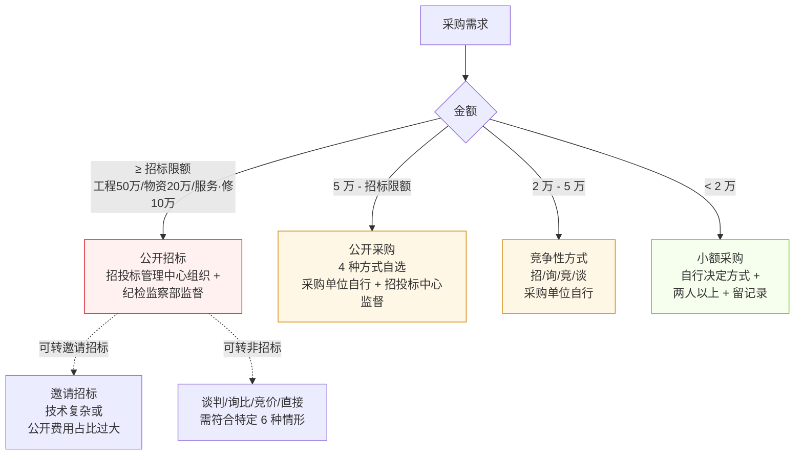
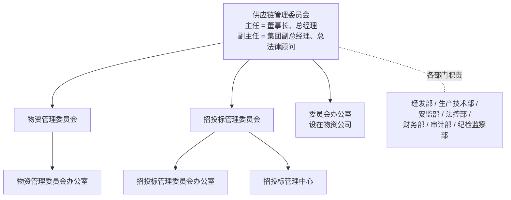

# 阜新矿业（集团）有限责任公司 采购管理办法（试行）

> **来源：** `docs/流程调研/调研原文档/关于印发《阜新矿业（集团）有限责任公司采购管理办法（试行）》的通知(4).pdf`（38 页，扫描版，由 OCR 提取）
> **文号：** 阜矿发 [2025] 70 号
> **依据：** 《招标投标法》《招标投标法实施条例》《非招标方式采购代理服务规范》《能源集团采购管理办法（试行）》
> **重大价值：** **本办法回答了 P0 中 Q-02 系列多项疑点**（金额阈值矩阵 / 4 种非招标方式判定条件 / 集团供应链管理委员会架构）

---

## 一、采购方式定义（第四条）

| 大类 | 子类 | 备注 |
|---|---|---|
| **招标采购** | 公开招标 / 邀请招标 | 必须招标 + 应招标项目 |
| **非招标采购** | 谈判采购 / 询比采购 / 竞价采购 / 直接采购 | 应招标但符合特定情形可转 |

---

## 二、适用范围（第五条）

| 类别 | 范围 |
|---|---|
| **工程建设** | 建筑物 / 构筑物 新建、改建、扩建 + 装修、拆除、修缮 |
| **物资采购** | 生产、工程、经营所需的设备、材料、配件 |
| **咨询服务** | 勘察、设计、监理、咨询、技术服务 |
| **检修项目** | 设备、配件、材料的修理（**含委托加工**）|
| **重要招标项目** | 工程 / 物资 / 设备修理：单项合同估算 **≥ 50 万**；咨询服务：**≥ 15 万** |

---

## 三、金额阈值矩阵（**P0 核心问题答案**）

### 3.1 必须招标项目（第十五条）

> 使用国家及省预算内投资资金的项目，**或**与工程建设有关并达到以下标准的：

| 项目类型 | 阈值 |
|---|---|
| 施工单项 | ≥ **400 万** |
| 重要设备、材料等物资 | ≥ **200 万** |
| 勘察、设计、监理等服务 | ≥ **100 万** |
| 同项目可合并的勘察+设计+施工+监理+设备材料 | 合计达上述标准 |

> 工程总承包：施工 / 货物 / 服务任一部分达限额 → 整个总承包应招标。

### 3.2 应招标项目（第十七条 — **关键!**）

| 项目类型 | 阈值 |
|---|---|
| **工程建设类** | 单项合同估算价 **≥ 50 万** |
| **物资采购类** | 单项合同估算价 **≥ 20 万** |
| **服务类、设备修理类** | 单项合同估算价 **≥ 10 万** |
| 同类合并 | 年度累计达上述标准 → 合并招标或入围招标 |

### 3.3 非招标但需公开采购（第二十一条）

| 阈值 | 采购方式 | 实施主体 | 监督 |
|---|---|---|---|
| **应招标额度以下，5 万元以上** | 公开采购：公开招标 / 公开谈判 / 公开询比 / 公开竞价 | 采购单位自行 | 招投标管理中心 |

### 3.4 竞争性采购（第二十二条）

| 阈值 | 采购方式 | 实施主体 |
|---|---|---|
| **5 万以下 2 万以上** | 竞争性方式（招/询/竞/谈）| 采购单位自行 |

### 3.5 小额采购（第二十三条）

| 阈值 | 采购方式 | 实施主体 |
|---|---|---|
| **< 2 万元** | 自行决定方式 + **两人以上共同** + 留有记录 | 采购单位 |

### 3.6 阈值矩阵汇总

---

## 四、4 种非招标采购方式（第十九条 — **判定条件**）

### 4.1 谈判采购（≥ 2 家）

> "同时与 2 个及以上符合资格条件的供应商分别进行**一轮或多轮报价**"

适用情形（满足任一）：
1. 标的物技术复杂或性质特殊，需谈判后确定需求
2. 需求明确但有多种实施方案，需谈判确定方案
3. 市场供应资源缺乏，**符合资格供应商只有 2 家**
4. 联合研发、共担风险模式形成的原创性商品或服务
5. 应急采购

### 4.2 询比采购（≥ 3 家）

> "由 3 个及以上符合资格条件的供应商一次报出**不得更改的价格**"

适用情形（**同时**满足）：
1. 采购需求清晰、准确、完整
2. 技术和质量标准化程度较高
3. 市场资源较丰富、潜在供应商不少于 **3 家**
4. 应急采购

### 4.3 竞价采购（≥ 3 家）

> "由 3 个及以上符合资格条件的供应商在规定时间内**多轮次公开竞争报价**"

适用情形（**同时**满足）：
1. 需求清晰、准确、完整
2. 技术和质量标准化程度较高
3. 标的物以**价格竞争为主**
4. 市场资源较丰富、潜在供应商不少于 **3 家**
5. 应急采购

### 4.4 直接采购（与特定供应商）

> "与特定的供应商进行一轮或多轮商议"

适用情形（满足任一）：
1. 国家秘密、国家安全或企业重大商业秘密
2. 抢险救灾、事故抢修等不可预见应急
3. 不可替代的专利或专有技术
4. 向原供应商采购，否则影响施工或功能配套
5. **有效供应商有且仅有 1 家**
6. 重点战略物资稳定供应（长期协议定向采购）
7. 集团公司控股或管理关系且依法有资格的供应商
8. 经招投标管理委员会批准或国家有关部门文件明确

---

## 五、组织架构

### 5.1 集团供应链管理委员会

### 5.2 物资公司主要职责（第九条）

| # | 职责 |
|---|---|
| 1 | 集团集中采购工作；编制更新**集团公司集采目录** |
| 2 | 审核各单位提报的年度/季度/月度集采计划 |
| 3 | 项目采购策划，建立集中采购工作台账 |
| 4 | 材料、设备、配件及检修项目控制价审核 |
| 5 | 参加开标、评标会议 |
| 6 | 集采物资采购合同签订及执行；质量与交付管理 |
| 7 | **建立供应商库 + 绩效评价** |
| 8 | 集采项目档案收集、归档、管理 |

### 5.3 各单位主要职责（第十一条）

- 实施应急采购 + **2 万元以下零星小额采购**（"小额采购"）
- 项目采购策划、采购计划、技术要求、控制价编制
- 本单位采购合同签订、执行、质量交付管理
- 本单位供应商绩效评价

---

## 六、采购计划与审批

### 6.1 计划编制原则（第二十七~二十八条）

- **自下而上**：各单位结合年度/季度/月度费用指标 + 生产定额 + 建设任务编制
- **年统领、季调整、月执行**
- 时间节点：
  - 年度计划：**每年 11 月 15 日前**
  - 季度计划：**提前 30 天**
  - 月度计划：**每月 20 日前**

### 6.2 月度时间节点（**关键 SLA**）

| 日期 | 动作 | 责任方 |
|---|---|---|
| 每月 1 日前 | 招标采购申请报送 | 各单位 → 招投标管理委员会办公室 |
| 每月 5 日前 | 报集团物资管理委员会审议；计划调整或取消上报 | 委员会办公室 |
| 每月 7 日前 | 招标项目初审完成 → 招投标管理委员会审议 | 招投标管理委员会办公室 |
| 每月 20 日前 | 申请计划报送 | 各单位 → 物资管理委员会办公室 |
| 每月 26 日前 | 管理委员会成员初审 | 物资管理委员会办公室 |

### 6.3 应急采购（第四十一条）

- 可**先申请后补办**审批手续
- 补办手续 **3 个工作日内**完成
- **准确率必须 100%**
- 审批：集团分管领导 + 物资采购分管领导 + 总经理同意 + 物资公司组织
- 特殊情况：分管领导同意后申请单位自行采购，事后向委员会汇报

---

## 七、采购计划禁止情形（第三十二条）

- 指定供应商 / 指定品牌 / 独家安标等理由变相指定 → **不予采购**
- 特殊情况需向集团供应链管理委员会作出说明

> **第二十六条：** 任何单位和个人**不得将招标项目化整为零或以其他任何方式规避招标**。

---

## 八、与 P0 答复 / 调研流程的对应关系（**重大！**）

### 8.1 阈值差异

| P0 编号 | 业务方答复 | 本办法的明确规定 | 差异 |
|---|---|---|---|
| **Q-02-1** 100 万阈值是唯一档位吗 | "当前仅 100 万一档" | ⚠ 本办法**多档**：必须招标 400/200/100 万 + 应招标 50/20/10 万 + 公开采购 5 万 + 竞争性 2 万 + 小额 < 2 万 | **业务方答复不全！** 详设 10 §九阈值需多档配置（按业务类型 × 金额维度） |
| **Q-02-3** 招标条件 vs 100 万阈值是否独立 | "20 万阈值进招标判断" | ✅ **本办法第十七条**：物资采购 ≥20 万应招标 | **答案在这里！** 业务方答复"20 万"与办法一致 |
| **Q-02-4** 招标失败降级回路 | "重新走集体决策" | 第四十六条：变更/终止/暂停采购需向集团供应链管理委员会申请 | 详设 04 招标失败回路：触发供应链管理委员会会议 |
| **Q-02-6** 3 家以上是软提示还是强约束 | "软提示" | ⚠ **本办法第十九条**：询比/竞价**必须满足"潜在供应商不少于 3 家"**（硬约束） | **业务方答复与办法不一致！** 详设需澄清：办法说硬性，业务方答软提示，可能业务方在实操中放宽了 |
| **Q-04-2** 履约保证金 ≥20 万 + 招标 + 10% | — | 本办法未明示比例（须查 05 合同管理办法）| — |
| **Q-13-1** 集体决议保留 | "所有付款都集体决议" | 本办法**无"付款集体决议"概念**（仅采购计划走管理委员会审议）| 详设 10 WF-PAY-001 集体决议节点是物资公司层面的（非集团层面） |

### 8.2 与流程 02 采购方式的对应

| 流程 02 内容 | 本办法对应 |
|---|---|
| 100 万阈值集体决策 | ⚠ 本办法**没有 100 万阈值概念**；流程 02 调研可能是物资公司层面的简化 |
| 招标 / 非招标 二分 | ✅ 第四条 |
| 三种非招标方式（询价/谈判/直接）| ⚠ 本办法**4 种非招标**：谈判 / 询比 / **竞价**（流程 02 漏） / 直接 |
| 3 家以上 | ✅ 第十九条（询比 + 竞价均要求）|

### 8.3 与流程 14 外委检修的对应

| 流程 14 内容 | 本办法对应 |
|---|---|
| 检修项目阈值 1 万 / 10 万 | 本办法**应招标限额 10 万**（服务类、设备修理类） — **与流程 14 阈值一致** |
| 外委检修包含委托加工 | ✅ 第五条第（一）款第 4 项："**检修项目是指设备、配件、材料的修理，其中材料修理包括委托加工**" |

---

## 九、需追加 P0 / 详设的项

| # | 内容 | 影响 |
|---|---|---|
| 1 | **多档金额阈值**（400/200/100 / 50/20/10 / 5 / 2 / 0 万）| 详设 10 §九阈值表达式按"业务类型 × 金额"二维矩阵配置 |
| 2 | **重要招标项目**(工程50万/物资20万/服务设备修10万)需特殊审核 | 详设 04 §招采路由 — 重要项目走完整审核链路 |
| 3 | **集采目录**:物资公司编制的集团统一采购目录 | 详设 03 主数据 — 集采目录维护 |
| 4 | **应急采购** 3 工作日补办 + 100% 准确率 | 详设 11 时限 + 详设 04 应急路径 |
| 5 | **每月 1/5/7/20/26 日**多个时间节点 | 详设 11 时限矩阵 |
| 6 | "**化整为零**" 规避招标禁止规则 | 详设 04 + 详设 09 反规避检测：年度同类累计统计 |
| 7 | **直接采购的 8 种适用情形** | 详设 04 直接采购路径需配置情形枚举 + 选择助手 |
| 8 | **2 人以上小额采购** | 详设 04 < 2 万采购的双人审批规则 |

---

## 版本记录

| 版本 | 日期 | 变更 |
|---|---|---|
| V0.1 | 2026-05-09 | OCR 提取 + 解析 38 页政策；提炼**完整阈值矩阵**（5 档）+ **4 种非招标方式判定条件** + 集团供应链管理委员会架构；与 P0 Q-02 系列深度对照 — **特别发现：业务方 Q-02-1 答"100 万一档"与办法的多档制度不一致；Q-02-6 答"软提示"与办法"硬性 ≥3 家"不一致** |
