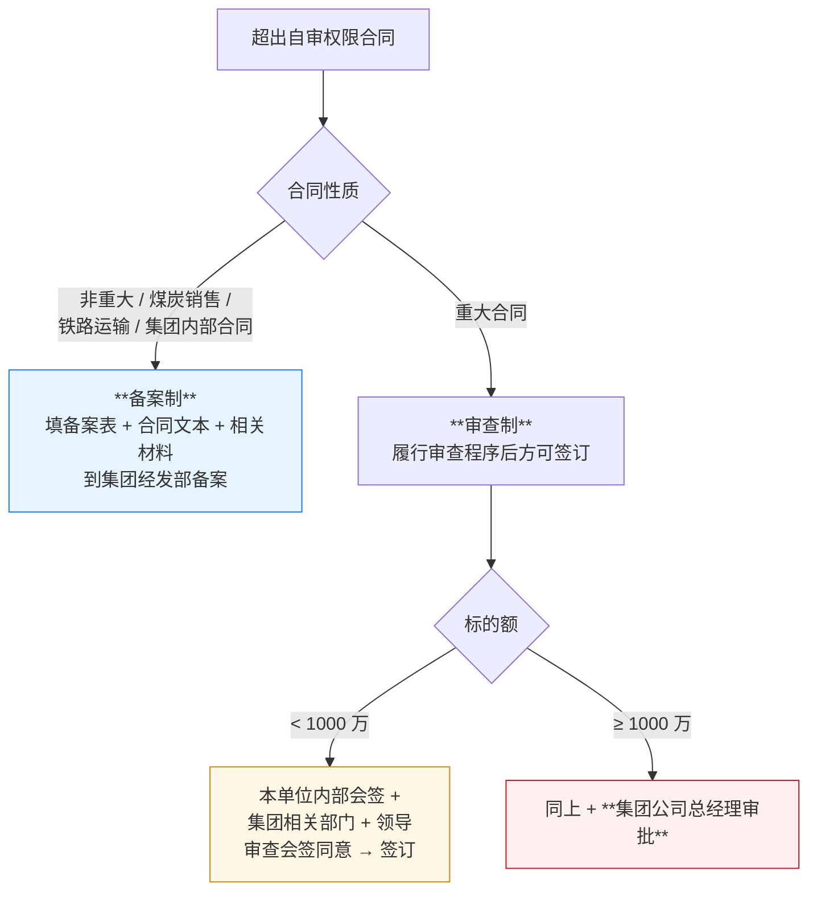

# 阜新矿业（集团）有限责任公司 合同管理办法

> **来源：** `docs/流程调研/调研原文档/阜矿集团合同管理办法(1).pdf`（26 页，扫描版，由 OCR 提取）
> **文号：** 阜矿经发字 [2022] 158 号
> **依据：** 《中华人民共和国民法典》及集团公司有关规章制度
> **重大价值：** **本办法确认了 P0 中 Q-04 系列多项业务方答复**（1000 万阈值集团总经理审批 + 20 万阈值买卖合同 + 内部企业备案制 + 多部门会签）

---

## 一、适用范围

| 项 | 内容 |
|---|---|
| **适用主体** | 集团公司及所属分公司；全资子公司及控股公司参照执行 |
| **适用类型** | 调整平等民事主体的合同：**买卖 / 建设工程 / 承揽 / 借款 / 租赁 / 担保 / 技术 / 委托 / 运输 / 投资入股 / 资产转让 / 股权转让** 等 |
| **不适用** | 金融机构贷款类合同 / 与职工签订的劳动合同 |
| **2 万以下例外** | 2 万以下即时结清的合同**无需书面合同** |

---

## 二、组织架构（多部门职责）

### 2.1 主要部门职责

| 部门 | 主要职责 |
|---|---|
| **经营管理与发展改革部**（合同归口管理部门）| 规范、指导、监督；制度制定；履行**会签职责**；档案集中保管；建立合同台账；指导下属企业 |
| **法律风险防控部** | 审查合同合法有效性 + 法律风险提示；参与重大合同可行性论证、起草、修改、谈判；协作处理合同纠纷；制定规范文本 |
| **财务部** | 参与合同评审；审查支付方式 / 不含税价款 / 发票种类 / 税金支付的合规性；履行**会审**职责 |
| **合同承办部门** | 草拟合同；预先尽职调查（主体资格 / 资信 / 履约能力 / 承办人资格）；负责合同履行 / 变更 / 解除；处理纠纷 |
| **其他职能部门** | 涉及本部门业务时提出意见；履行会审职责 |

### 2.2 合同管理原则

- **归口管理、各负其责**
- **归口主管 + 承办主办 + 职能审查 + 专业归档** 综合管理体制

---

## 三、合同审查权限矩阵（**P0 核心问题答案**）

### 3.1 自行审查权限（第二十二条 — **关键!**）

| 主体 | 自审上限 |
|---|---|
| **各单位** | **标的额 ≤ 5 万元** + 制式文本买卖合同 |
| **物资公司** | **标的额 ≤ 20 万元** + 制式文本买卖合同 |

> 各单位 / 物资公司在上述限额内**自行审查**，履行内部审查程序。

### 3.2 自审权限外的合同处理方式（第二十三条）

### 3.3 重大合同清单（第二十三条）

下列合同为**重大合同**（须走审查制）：

1. **标的额 ≥ 20 万的买卖合同**
2. 借贷、担保合同
3. 投资、并购、资产置换、合资合作等合同
4. 设备、土地、房屋等租赁及产权变动合同
5. 建设工程施工合同
6. 其他标的额 ≥ 20 万的合同

### 3.4 1000 万阈值（第二十四条）

> **第二十四条：** 合同标的额 ≥ 1000 万元（含 1000 万元）的合同由**集团公司总经理审批**。

---

## 四、合同必备条款（第十七条）

| # | 条款 |
|---|---|
| 1 | 合同当事人的名称、地址、法定代表人、委托代理人姓名、职务、联系方式 |
| 2 | 签约的目的和依据 |
| 3 | 标的 |
| 4 | 数量和质量 |
| 5 | 价款或酬金及支付方式 |
| 6 | 履约期限、地点或方式 |
| 7 | 双方权利和义务 |
| 8 | 法律适用和争议解决方式（**约定诉讼时尽量写我方所在地法院**）|
| 9 | 违约责任（明确违约金 / 赔偿金计算方法）|
| 10 | 合同期限、变更和终止条件 |
| 11 | 其他法律规定或必要条款 |
| 12 | 生效的时间和条件 |
| 13 | 签订地点、日期（**尽可能填我方所在地**）|
| 14 | **签约各方公章（或合同专用章）** |
| 15 | **法定代表人（或负责人）或委托代理人签字** |

---

## 五、合同订立要点

### 5.1 强制规则

- **2 万以下即时结清**例外：可不签书面合同
- **超过 2 万**：必须采用**书面形式**
- **无合同不验收、不结算、不挂账、不付款**（第十三条）
- **合同编号规则**：**一份合同一个编号，不得重号或漏号**；补充协议 / 变更协议编号与原合同一致（第十九条 + 附件 3）

### 5.2 尽职调查（第十六条）

签订前合同承办部门应调查对方：
1. **主体资格合格**：营业执照有效，核载内容与实际相符
2. **经营范围匹配**：拟签合同内容符合对方经营范围；专营许可 / 资质完整；代理商需提供生产商资质
3. **代签合同**：法定代表人身份证明 + 授权委托书 + 代理人身份证明
4. **履约能力**
5. **履约信用**：违约事实 / 重大经济纠纷 / 重大经济犯罪 / 失信人名单
6. **担保能力 / 担保资格证明**（如有担保）

### 5.3 内容规范（第十八条）

- 合同条款**完备、书写工整、用语准确，不得歧义**
- 专用名词 / 技术用语 / 技术标准 / 质量标准须约定确切含义
- **空白内容注明"无"字**（防止后续填写）
- 合同签订地**尽可能填我方所在地**

---

## 六、合同履行、变更、解除

| 情形 | 处理 |
|---|---|
| 合同履行中**对方丧失履约能力** | 中止履行 + 书面通知 + 要求担保；未在规定时间提供担保 → 解除合同 |
| 对方代理人**无代理权 / 超越权限** | 中止履行 + 书面通知 + 要求追认；未追认 → 解除合同 |
| 条件限制不能完全履行 | 协商变更或解除（须签变更/解除协议）|
| 变更/解除协议、通知、回复 | 作为原合同组成部分，**同样履行审查程序** |
| 对方未按约履行 | 在约定期限内要求对方书面出具确认书 + 拒绝时及时信函催促 |

---

## 七、与 P0 答复 / 调研流程 04 的对应关系（**重大！**）

### 7.1 P0 Q-04 系列对照

| P0 编号 | 业务方答复 | 本办法明确规定 | 一致性 |
|---|---|---|---|
| **Q-04-1** 供应商签字盖章位置 | "确认审批后盖章" | ✅ 第十七条第(十四)项：合同必备条款含**签约各方公章** + 第二十六条经审查不合格须修改后**重新提交审查**，意味盖章发生在审查通过后 | ✅ 一致 |
| **Q-04-2** 履约保证金触发规则 | "金额≥20万 + 招标 + 10%" | ⚠ **本办法未明示保证金条款**（合同管理办法不涵盖保证金细则） | 待查其他文件（招投标管理办法 / 财务管理办法） |
| **Q-04-3** 内部企业链是否真无集团审批 | "由集团合同管理部门确定" | ✅ 第二十三条：**"集团公司内部单位之间签订的合同采取备案制"**（不走审查制） | ✅ **印证!** "集团合同管理部门确定" = 经发部按备案制处理 |
| **Q-04-4** 20 万以下小额 vs 内部企业差异 | "确认数据归集口径差异 + 还有其他差异由集团合同管理部门确定" | ✅ **本办法第二十二条 + 第二十三条**：物资公司 ≤20 万自审 vs 内部企业备案 — **差异在审查方式**（自审 vs 集团备案）+ 数据归集（物资公司层面 vs 集团合并层面）| ✅ 一致 + 增加细节 |
| **Q-04-5** 1000 万阈值位置 | "确认叠加" | ✅ **第二十四条**：标的额 ≥ 1000 万由集团公司总经理审批（**叠加在审查制流程之后**）| ✅ 一致 |
| **Q-04-6** 集团三部门串/并行 | "现状并行 + 同意改为并行" | ⚠ 本办法**未明示三部门顺序**；第二十四条"集团公司相关部门、领导审查会签同意" — 措辞**会签**默认可并行 | ✅ 与业务方答复"现状并行"一致 |

### 7.2 与流程 04 合同审批的对应

| 流程 04 内容 | 本办法对应 |
|---|---|
| 三路分流（内部 / 20万以下 / 20万以上）| ✅ 第二十二/二十三条 — 内部企业备案制 / 物资公司 ≤20 万自审 / >20 万审查制 |
| 集团多部门会签（财务/法控/经发）| ✅ 第八/九/十一条 — **经发部归口 + 法风部审查 + 财务部会审 + 其他职能部门** |
| 1000 万 → 集团总经理 | ✅ 第二十四条 |
| 履约保证金条件 | ⚠ 本办法**未涵盖** — 业务方 Q-04-2 答复来源待查 |

---

## 八、需追加 P0 / 详设的项

| # | 内容 | 影响 |
|---|---|---|
| 1 | **20 万买卖合同阈值**（重大合同标准）| 详设 05 §C-01 合同审批流：20 万以上自动升审查制 + 20 万以下走自审 |
| 2 | **物资公司 ≤20 万自审 vs 各单位 ≤5 万自审 差异** | 详设 05 §C-01 自审权限按"主体类型 × 金额"双维度 |
| 3 | **2 万以下即时结清无需书面合同** | 详设 04 / 05 — 小额采购的合同形式选择 |
| 4 | **合同编号规则**（一合同一编号 + 补充协议同号）| 详设 05 + 详设 03 编码规则 |
| 5 | **6 类重大合同自动识别**（买卖 ≥20 万 / 借贷 / 担保 / 投资 / 设备土地房屋租赁 / 工程施工 / 其他 ≥20 万）| 详设 05 §C-02 合同分类自动判定 + 自动加签 |
| 6 | **空白内容注明"无"字**（合规要求）| 详设 05 — 合同模板字段必填校验（空字段自动填"无"）|
| 7 | **法律风险防控部** 介入重大合同（可行性论证 / 起草 / 修改 / 谈判 / 审查 / 签订）| 详设 10 §6.2 WF-CON-001 加注：法风部参与时机 |
| 8 | **审查不合格修改后须重新提交审查** | 详设 05 §C-01 状态机 — 驳回后重新走完整审查链 |
| 9 | **会签意见禁止"原则同意""基本可行"等模糊用语** | 详设 10 §审批意见输入校验 |

---

## 版本记录

| 版本 | 日期 | 变更 |
|---|---|---|
| V0.1 | 2026-05-09 | OCR 提取 + 解析 26 页政策；提炼**合同审查权限矩阵**（自审 5/20 万 + 重大审查制 + 1000 万总经理）+ **6 类重大合同自动识别** + 多部门职责（经发部归口 / 法风部审查 / 财务部会审）；与 P0 Q-04 系列深度对照 — **印证 Q-04-3/Q-04-4/Q-04-5/Q-04-6 业务方答复正确;Q-04-2 履约保证金条款本办法未涵盖,待查其他文件** |
