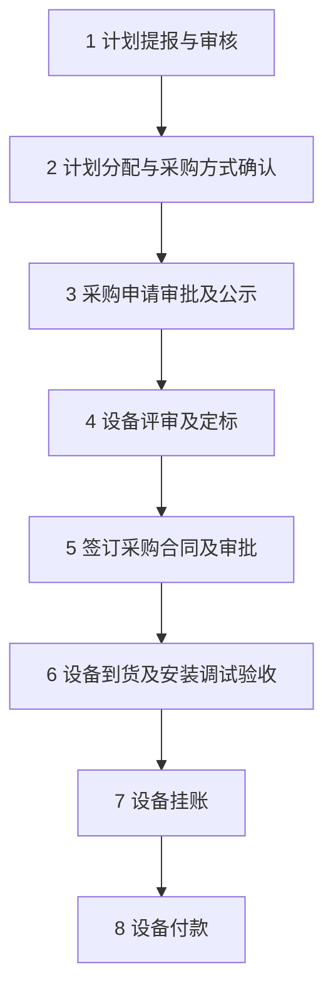
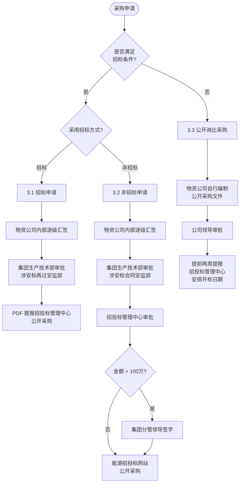
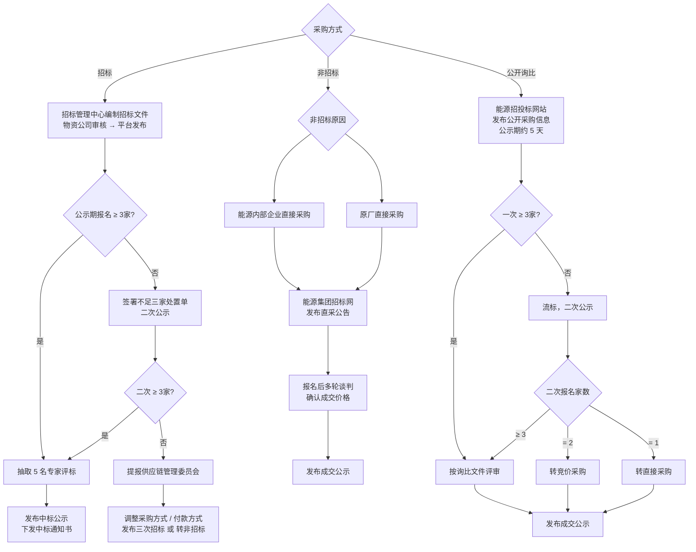
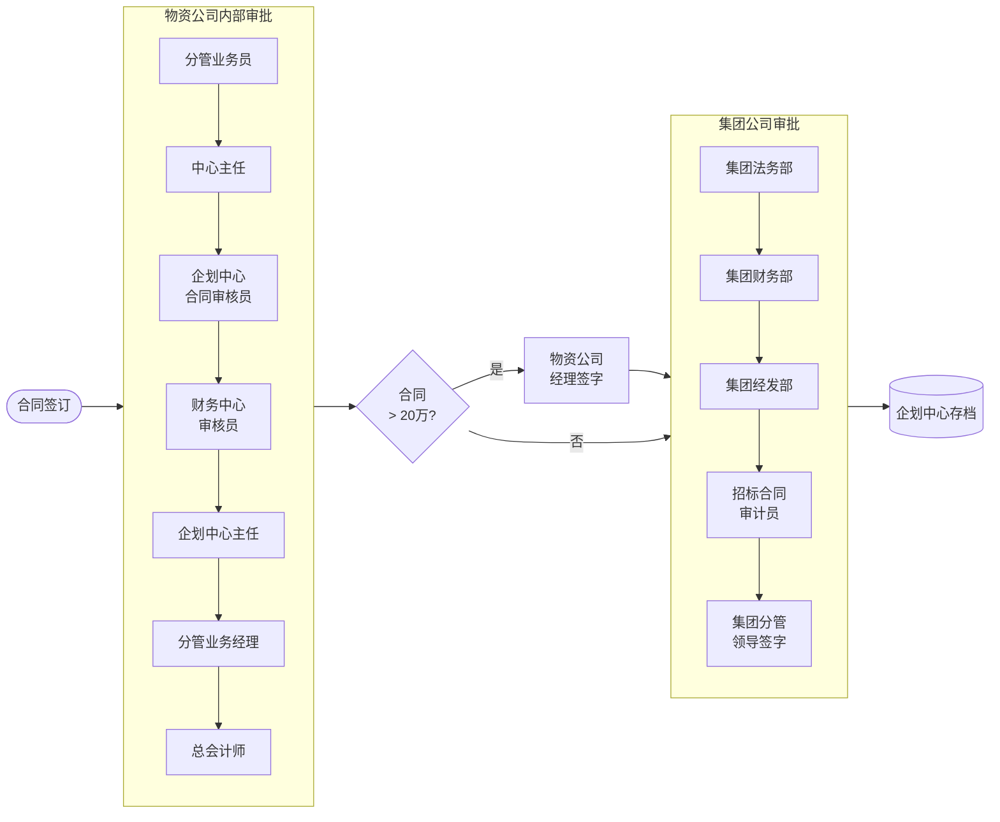
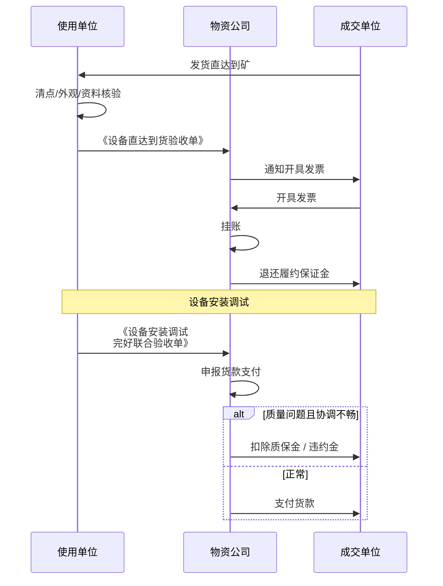

# 设备采购流程

> 来源：线下调研文档整理。覆盖从年度计划提报到设备付款的全链路，共 8 个阶段。

## 总体流程

---

## 1. 计划提报与审核

- **提报**：各使用单位于每年年底提交下一年度《全年专项资金采购计划申请》。
- **审核**：集团公司生产技术部审核计划；物资公司复核设备价格、型号，发现错误标注后反馈使用单位。
- **审议下达**：经集团公司党委会议审议通过后，生产技术部按实际生产使用情况，**以季度形式**下达采购计划。

## 2. 计划分配与采购方式确认

物资公司收到季度专项资金计划后：

1. 按部室及采购人员分工进行业务划分。
2. 督促各使用单位提供技术文件——须加盖**公章及骑缝章**，并由集团公司生产技术部分管人员签字后方才生效。
3. 业务员根据技术文件及计划金额对项目分包，明确采购方式，编制采购申请。

## 3. 设备采购申请审批及公示

按项目是否满足招标条件，分三条路径：

### 3.1 满足招标条件且采用招标的项目

- 审批链：物资公司分管业务员 → 业务中心主任 → 分管业务经理 → 企划中心主任 → 公司负责人。
- 加盖公司**招标专用章及公章**后，报集团生产技术部审批。
- **涉安标项目**：生产技术部与安监部须**分别审批**。
- 最终将招标采购申请扫描为 PDF，提报招投标管理中心公开采购。

### 3.2 满足招标条件但走非招标的项目

- 物资公司内部审批链同上。
- 加盖招标专用章及公章后报集团生产技术部审批；涉安标项目由生产技术部与安监部**一同审批**。
- 最后由招投标管理中心审批。
- **金额超过 100 万元**的，还须由集团分管领导签字。
- PDF 提报招投标管理中心后，通过能源招投标网站公开采购。

### 3.3 不满足招标条件的项目

- 物资公司自行编制公开采购文件（含资格、技术、商务、评标办法）。
- 经公司领导审批后，提交到能源集团招投标网站发布公开采购信息。
- **须提前两周**提报招投标管理中心，由其合理安排开标日期。

## 4. 设备评审及定标

### 4.1 设备招标

- 由集团招投标管理中心或能源集团招投标管理中心编制招标文件（含资格、技术、商务、评标办法），物资公司分管业务员审核。
- 招投标管理中心在招标平台发布招标信息及开标时间。
- **不足三家处置**：
  - 一次公示不足三家 → 物资公司签署"不足三家处置单"，分析原因后二次公示。
  - 二次仍不足三家 → 可提报集团供应链管理委员会，调整采购方式或付款方式后发布**三次招标**，或申请转为非招标采购。
- 评标：招投标管理中心从专家库**抽选 5 名专家**评标。
- 成交后招投标管理中心发布公示并下发中标通知书。

### 4.2 设备非招标

根据非招标原因分为两类，均需在能源集团招标网发布**直采公告**：

- 能源内部企业直接采购
- 原厂直接采购

直采单位报名后以**多轮谈判**确认成交价格，成交后发布成交公示。

### 4.3 公开询比（不满足招标条件）

- 通过能源招投标网站发布公开采购信息，公示期一般为 **5 天**。
- 一次公示不足三家 → 流标，发布二次公示。
- 二次公示报名家数处置：
  - **2 家** → 按询比文件规定转为**竞价采购**。
  - **1 家** → 按询比文件规定转为**直接采购**。
- 成交后发布成交公示。

## 5. 签订采购合同及审批

- 收到中标通知和成交通知书后，按采购文件约定和成交单位信息，**30 日内**签订采购合同、缴纳履约保证金，并到使用单位签订技术要求。

- **物资公司内部**：分管业务员 → 中心主任 → 企划中心合同审核员 → 财务中心审核员 → 企划中心主任 → 分管业务经理 → 总会计师；合同金额超过 **20 万元**时须由物资公司经理签字。
- **集团公司**：法务部 → 财务部 → 经发部 → 招标合同审计员审核盖章 → 集团分管领导签字 → 交物资公司企划中心存档。

## 6. 设备到货验收及安装调试完好验收

- 成交单位按合同及技术协议生产设备，**保证在合同约定日期内交付**；通常由厂家发货直达到矿。
- 使用单位依据技术要求和发货清单验收，包括：
  - 设备及随机部件清点
  - 外观检查
  - 资料核验
- 验收通过后，使用单位向物资公司出具：
  - **《设备直达到货验收单》**（到货即出具）
  - **《设备安装调试完好联合验收单》**（安装调试完成后出具）

## 7. 设备挂账

- 收到使用单位的**《设备直达到货验收单》**后，物资公司通知成交单位开具设备发票，并予以挂账。
- 发票挂账后及时退还成交单位履约保证金。

## 8. 设备付款

- 收到使用单位的**《设备安装调试完好联合验收单》**后，物资公司按合同约定付款方式申报设备货款支付。
- 若期间设备出现质量问题且物资公司协调不畅，按合同条款扣除相应**质保金及违约金**。

### 验收—挂账—付款时序

