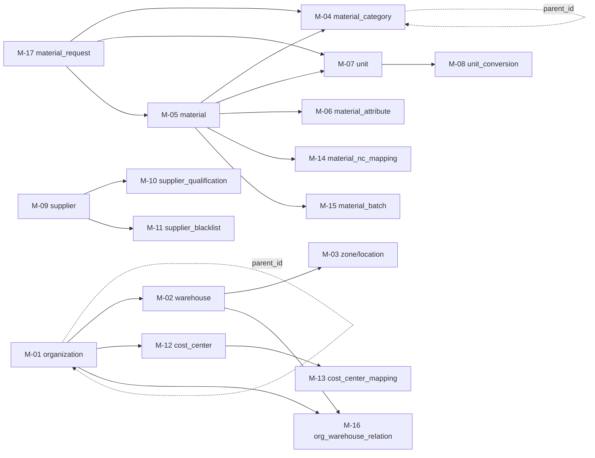
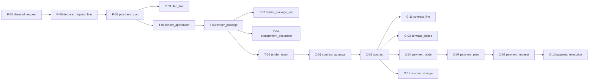
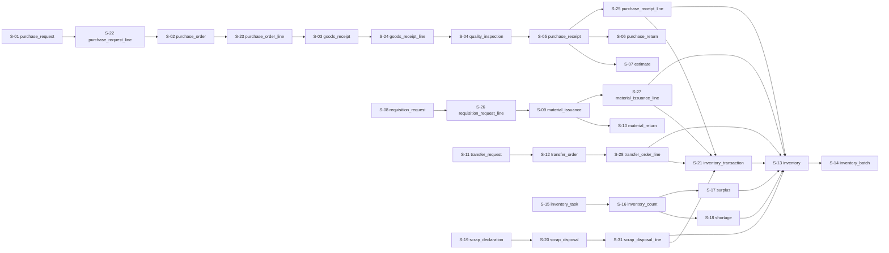
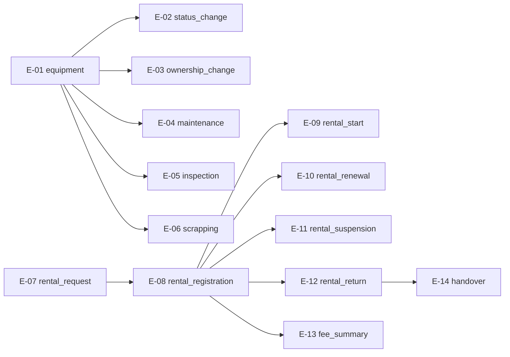
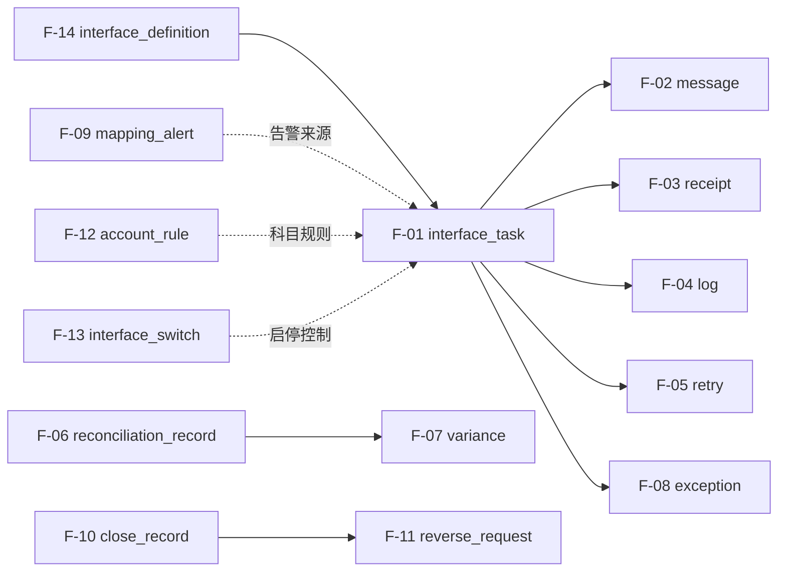
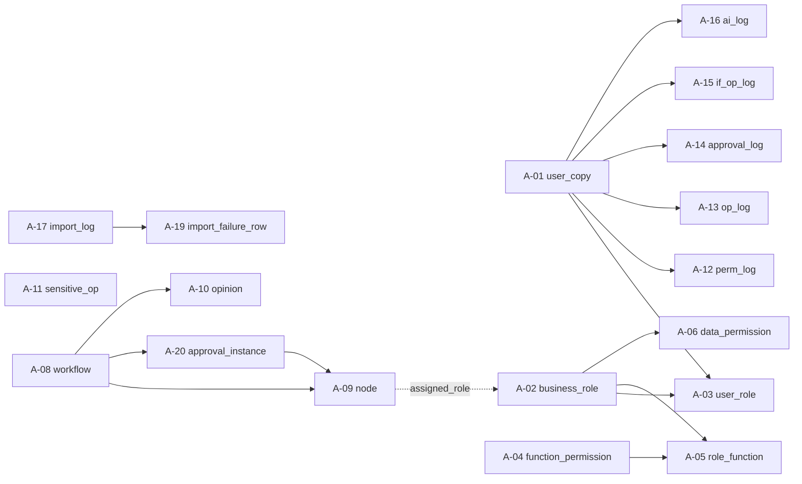
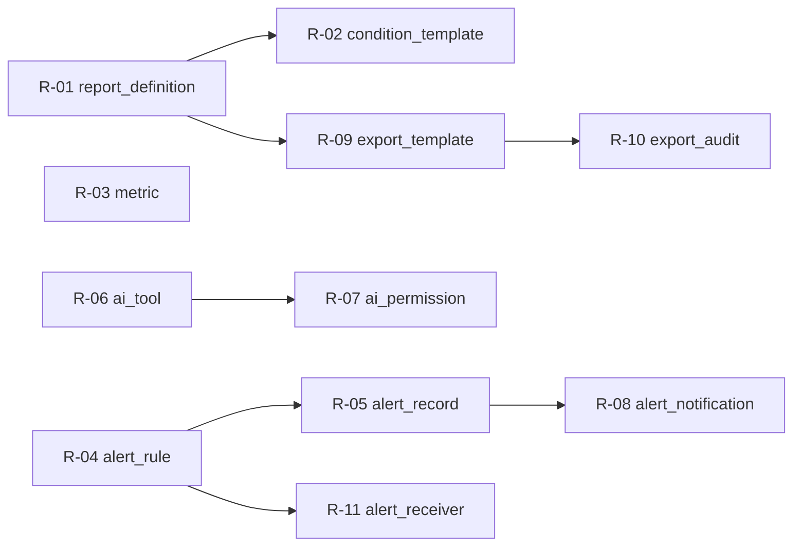
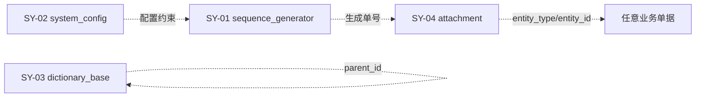
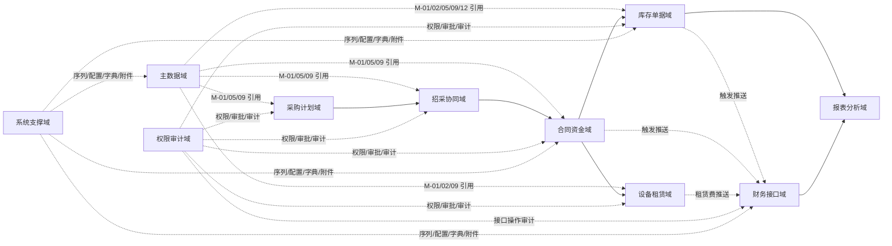

# 数据库逻辑模型（V0.7）

**版本：** V0.7
**日期：** 2026-05-02
**文档性质：** 详细设计层 · cross-module 数据模型骨架
**适用阶段：** 详细设计执行、开发实施、联调测试

---

## 一、文档目的

本文档作为详细设计层第一篇分卷，承接概要设计 `02-业务模块`、`03-主数据与编码`、`04-权限审批与审计`、`05-NC 接口与对账`、`06-报表预警与 AI 能力` 已划定的边界，把全系统跨模块的数据模型骨架先固化下来，为 `02-11` 各模块详设提供共用底座。

本文档重点回答：

- 全系统有哪些实体，按 10 大数据域（9 大业务 + 1 系统支撑）如何组织
- 各实体的主键、关键外键、关键字段、状态字段是什么
- 实体之间的关系如何
- 跨实体共用的约定（主键策略、审计字段、软删除、状态字段、NC 接口字段、工作流字段）
- 索引设计原则与数据库厂商无关原则
- 业务确认未回执的占位策略

本文档**不**做以下事：

- 不写每个实体的全字段表（全字段在 `02-11` 各模块详设中按主题集中描述）
- 不写具体 SQL DDL（按数据库厂商方言编写，由环境准备阶段产出）
- 不写页面字段、按钮、交互（属原型设计阶段产物）
- 不写接口报文样例（属 `08` 详设和详细规则文档承接）

---

## 二、设计输入

| 输入文档 | 在本文档中的作用 |
| --- | --- |
| `docs/概要设计/02-业务模块概要设计-v0.1.md` | 15 模块的业务对象、状态控制、跨模块协同 |
| `docs/概要设计/03-主数据与编码概要设计-v0.1.md` | 主数据范围、编码、生命周期、NC 映射 |
| `docs/概要设计/04-权限审批与审计概要设计-v0.1.md` | 权限审批审计实体模型 |
| `docs/概要设计/05-NC 接口与对账概要设计-v0.1.md` | 接口任务、状态矩阵、幂等键、对账记录 |
| `docs/概要设计/06-报表预警与 AI 能力概要设计-v0.1.md` | 报表、预警、AI Tool 实体 |
| `docs/详细规则/物资编码规范文档.md` | 编码规则、批次、条码、扩展预留 |
| `docs/详细规则/物资管理与财务接口规范.md` | NC 接口字段、状态字典、对账规则 |
| `docs/需求梳理/14-NC 映射与科目配置模板-V1.0.md` | NC 存货映射与科目规则的可配置模型 |
| `docs/需求梳理/15-计量单位统一模板-V1.0.md` | 单位字典、换算规则、维护归口 |
| `docs/详细设计/00-详细设计阶段规划-v0.1.md` | 详设拆分、深度边界、占位策略 |
| `docs/详细设计/开发实施引用索引-v0.2.md` | 开发参考优先级、开工条件、冲突处理 |

---

## 三、模型范围与边界

### 3.1 模型覆盖

按概要设计 `00 节八` 的核心数据域口径，本模型覆盖 9 大业务数据域 + 1 个系统支撑域：

| 域 | 编号前缀 | 实体数（V0.6） |
| --- | --- | --- |
| 主数据域 | M | 17 |
| 采购计划域 | P | 6 |
| 招采协同域 | T | 7 |
| 合同资金域 | C | 11 |
| 库存单据域 | S | 31 |
| 设备租赁域 | E | 14 |
| 财务接口域 | F | 14 |
| 权限审计域 | A | 20 |
| 报表分析域 | R | 11 |
| 系统支撑域 | SY | 4 |
| **合计** | — | **135** |

实体编号在本文件中作为唯一标识，跨文档引用时使用"实体编号 + 实体英文名"组合（例如 `M-05 material`）。

### 3.2 不在覆盖范围

- 二期才纳入的能力（如复杂驾驶舱、跨集团统一经营分析中台）不建模
- 业务确认轮中标"待启动"或"待 NC 落地"的实体（如正式 NC 核算组织映射台账）只保留可配置字段，不展开正式映射表
- 临时数据缓存表、查询性能视图、报表物化表等运行时优化结构不作为逻辑模型一部分

### 3.3 跨域关系

实体跨域引用通过外键体现，关键跨域关系：

- 几乎所有业务单据 → `M-01 organization`、`M-05 material`、`M-09 supplier`、`M-12 cost_center`
- 财务触发型业务单据 → `F-01 interface_task`（接口任务推送链路）
- 所有需审批的业务单据 → `A-20 approval_instance` + `A-10 approval_opinion`（流程定义仍来源于 `A-08/A-09`）
- 所有库存影响型业务单据 → `S-13 inventory` + `S-14 inventory_batch` + `S-21 inventory_transaction`
- 所有合同关联型单据 → `C-02 contract`

---

## 四、共用约定

本节定义全系统跨实体共用的字段约定，所有业务实体必须遵守，主数据实体按需采用。

### 4.1 主键策略

| 表类型 | 主键字段 | 类型 | 生成策略 |
| --- | --- | --- | --- |
| 业务单据表 | `<业务实体>_id` | 字符串或长整型 | 技术主键，系统内部关联使用，不等同于业务单号 |
| 业务单号字段 | `<业务实体>_no` | 字符串 | 业务编号 + 自增序列号（如 `RC202605010001`），必须唯一 |
| 主数据表 | `<实体>_id` | 字符串或长整型 | 技术主键；业务编码（如 `material_code`）单独唯一约束 |
| 关系/明细表 | `<关系>_id` | 长整型 | 自增 |
| 日志/流水表 | `log_id` | 长整型 | 自增 |

除明确由外部权威系统稳定提供的编码外，后续模块详设应优先采用“技术主键 + 业务编码/业务单号唯一索引”的双字段模式，避免业务编号调整、导入修正或外部系统编码变更影响历史关联。

### 4.2 审计字段（业务实体必须）

```
created_by         FK→A-01 user_copy        创建人
created_at         timestamp                  创建时间
updated_by         FK→A-01 user_copy        最后修改人
updated_at         timestamp                  最后修改时间
created_org_id     FK→M-01 organization     创建人所属组织（用于权限过滤）
version_no         integer                    乐观锁版本号
```

### 4.3 软删除（所有表必须）

```
is_deleted         boolean      软删除标志（默认 0）
deleted_by         FK→A-01     删除人
deleted_at         timestamp   删除时间
delete_reason      string      删除原因
```

软删除字段不参与业务索引；查询和外键判断时必须过滤 `is_deleted = 0`。物理删除仅限于环境准备阶段的初始化清理。

业务编码、业务单号、物料编码等唯一字段默认**不允许因软删除而重用**；如实施阶段确需重用，必须形成专项评审记录，并在唯一索引设计中显式区分历史失效记录。

### 4.4 业务状态字段

业务单据状态字段统一遵循以下值域：

| 字段名 | 值域 | 适用单据 |
| --- | --- | --- |
| `bill_state` | 草稿 / 待审 / 已审 / 已驳回 / 已作废 / 已冲销 | 通用业务单据 |
| `approval_state` | 待审 / 审中 / 已审 / 已驳回 / 已撤回 | 涉及审批的单据 |
| `interface_push_state` | 待推送 / 推送中 / 推送成功 / 推送失败 / 已重推 / 已关闭 | 涉及 NC 接口的单据 |
| `finance_state` | 未接收 / 已接收 / 已记账 / 已退回 / 已冲销 | 涉及 NC 财务回执的单据 |
| `period_state` | 未结账 / 已结账 / 已反结 | 涉及月结的实体 |

跨单据共用同一字段名，便于权限、报表、AI Tool 统一过滤。

### 4.5 NC 接口相关字段（财务触发型单据必须）

```
nc_voucher_no          NC 凭证号（回执回写）
interface_push_state   接口推送状态（取值见 4.4；原 `nc_push_state` 不再作为字段名使用）
last_push_time         最后推送时间
last_push_by           最后推送人 FK→A-01
push_error_code        推送错误码
push_error_message     推送错误描述
idempotent_key         幂等键（F-14.interface_code + sourceBillNo + orgCode + 业务维度，使用业务语义键 interface_code 而非技术主键 F-14.interface_id，避免接口元数据 ID 重建后历史幂等键失效）
```

### 4.6 工作流相关字段（涉及审批的单据必须）

```
workflow_instance_id   FK→A-20 approval_instance
current_node_id        当前审批节点
approval_chain         审批链路（JSON 数组，见 A-10）
approval_deadline      审批截止时间
escalation_flag        是否已升级（超期触发）
```

### 4.7 时间戳字段（业务单据推荐）

```
business_date          业务发生日期（跨期处理用，与 created_at 区分）
execute_date           预期执行日期（计划跟踪、预警用）
actual_date            实际执行日期
due_date               截止日期（超期识别用）
```

### 4.8 多租户字段（一期不启用，预留）

```
tenant_id              租户编码 - 一期默认全为同一租户值，支持后续多租户隔离扩展
```

### 4.9 附件字段（业务单据通用）

```
attachment_info        附件元数据 JSON（路径、文件名、大小、上传人、上传时间）
remarks                业务备注
internal_notes         内部处理备注（不对外显示）
```

### 4.10 主表 / 明细表建模原则

凡是可能存在“一单多物料、一单多费用、一单多合同标的、一单多批次”的业务单据，均应采用“主表 + 明细表”结构。主表承载单据编号、组织、供应商、审批、状态、金额合计等头信息；明细表承载物料、数量、单位、单价、批次、税率、行金额、来源行等行级信息。

以下明细实体在本 V0.3 中先作为跨模块骨架纳入，后续 `02-11` 模块详设应继续补齐全字段：

| 主实体 | 明细实体 | 说明 |
| --- | --- | --- |
| P-01 demand_request | P-06 demand_request_line | 需求提报一单多物料 |
| T-03 tender_package | T-07 tender_package_line | 标包一包多物料或多计划行 |
| C-02 contract | C-11 contract_line | 合同一合同多物料 / 多服务标的 |
| S-01 purchase_request | S-22 purchase_request_line | 采购申请多行 |
| S-02 purchase_order | S-23 purchase_order_line | 采购订单多行 |
| S-03 goods_receipt | S-24 goods_receipt_line | 到货验收多行 |
| S-05 purchase_receipt | S-25 purchase_receipt_line | 入库多行与批次拆分 |
| S-08 requisition_request | S-26 requisition_request_line | 领料申请多行 |
| S-09 material_issuance | S-27 material_issuance_line | 出库多行与批次拆分 |
| S-12 transfer_order | S-28 transfer_order_line | 调拨多行 |
| S-06 purchase_return | S-29 purchase_return_line | 采购退货多行 |
| S-10 material_return | S-30 material_return_line | 退料多行 |
| S-20 scrap_disposal | S-31 scrap_disposal_line | 废旧处置多行 |

**字段迁移说明（V0.4 收尾补强）**：节六各业务单据主表的"关键字段"列在 V0.3 仍保留 `material_id / quantity / unit_price / amount` 等行级语义字段，是 V0.1 / V0.2 历史结构残留。V0.4 起这些字段在含明细行的单据中按以下规则收口：

- 数量、金额类字段升级为聚合字段（如 `total_quantity / total_amount`），由明细表按 `<明细实体>_id = 主表 PK` 汇总，不在主表手工维护；
- 物料、批次、单价、规格类行级字段在多物料单据中**禁止**保留在主表，应迁移至 S-22 ~ S-31 / P-06 / T-07 / C-11 等明细行；
- 单物料单据（例如当前 P-01 demand_request 的单行模式）允许在主表保留行级字段，但模块详设需明确标注"单物料业务，无明细表"，并在状态机中说明若后续升级为多行需先迁移；
- 节六本表的"关键字段"列在 V0.4 阶段不逐表回填，避免影响骨架可读性；正式字段口径由 02 ~ 11 模块详设的全字段表承接，本节仅作上位规则。

---

## 五、ID 与编码策略

### 5.1 业务单号

所有业务单据生成 `<前缀><yyyymmdd><6 位序列号>` 格式的业务单号：

| 实体 | 前缀 | 示例 |
| --- | --- | --- |
| 采购计划 | PP | PP202605010001 |
| 采购订单 | PO | PO202605010001 |
| 采购入库 | RC | RC202605010001 |
| 领料出库 | IS | IS202605010001 |
| 调拨单 | TR | TR202605010001 |
| 盘点单 | IC | IC202605010001 |
| 合同 | CT | CT202605010001 |
| 付款申请 | PR | PR202605010001 |

详细前缀规则在 `02-基础档案与组织仓库详细设计` 中定义编号生成器实体。

### 5.2 物料编码

物料编码遵循 `docs/详细规则/物资编码规范文档.md` V1.7 的多级编码结构：大类 + 中类 + 小类 + 流水号 + 校验位。本文档不重复展开。

### 5.3 NC 存货编码

NC 存货编码作为外部映射字段，存储在 `M-14 material_nc_mapping` 中，**不**作为 `M-05 material` 的主键。映射状态在 NC 未落地阶段允许"待映射"，不阻断主物料的启用。

### 5.4 序列号管理

业务单号序列号由 SY-01 sequence_generator 实体管理，按"前缀 + 日期"维度独立维度，详见节 6.10 系统支撑域。

---

## 六、10 大数据域实体清单

本节按 10 大数据域（9 大业务 + 1 系统支撑）逐一列出实体，每条给出：实体编号、中文/英文名、关键字段（PK + 关键 FK + 5-8 个核心业务字段）、状态字段、跨域引用。完整字段表分散在 `02-11` 各模块详设中。

### 6.1 主数据域（M）

| 编号 | 实体（中/英） | 关键字段 | 状态/来源 | 备注 |
| --- | --- | --- | --- | --- |
| M-01 | 组织机构 organization | org_id (PK), parent_id (FK→M-01), org_code, org_name, org_type | status: 启用/停用；来源 Nova Platform 副本 | 树形自引用；几乎所有业务实体引用 |
| M-02 | 仓库 warehouse | warehouse_id (PK), org_id (FK→M-01), warehouse_code, warehouse_name, warehouse_type, location | status: 启用/停用 | — |
| M-03 | 库区与货位 warehouse_zone / storage_location | zone_id / location_id (PK), warehouse_id (FK→M-02), zone_code/location_code | status: 启用/停用；location_state: 正常/冻结 | 库区→货位两级嵌套；冻结仅适用于货位 |
| M-04 | 物料分类 material_category | category_id (PK), parent_id (FK→M-04), category_code, category_name, nc_account | status: 启用/停用 | 树形自引用；决定编码前缀和 NC 科目 |
| M-05 | 物料主数据 material | material_id (PK), material_code, material_name, category_id (FK→M-04), unit_id (FK→M-07), specification | material_state: 待申请/待审核/待映射/启用/变更中/停用/归档 | 系统核心主数据 |
| M-06 | 物料属性 material_attribute | attr_id (PK), material_id (FK→M-05), attr_type, attr_value, is_required | — | 一物料多属性（批次、保质期、危险等级、损耗、条码） |
| M-07 | 计量单位 unit | unit_id (PK), unit_code, unit_name, unit_type, nc_unit_code, precision | — | 字典型 |
| M-08 | 计量单位换算 unit_conversion | conversion_id (PK), from_unit_id (FK→M-07), to_unit_id (FK→M-07), conversion_ratio | — | 采购单位与库存单位换算 |
| M-09 | 供应商档案 supplier | supplier_id (PK), supplier_code, supplier_name, supplier_type, contact_info, tax_info | supplier_state: 潜在/合格/负面/黑名单；status: 启用/停用 | — |
| M-10 | 供应商资质 supplier_qualification | qual_id (PK), supplier_id (FK→M-09), qual_type, qual_doc_path, expire_date | qualification_status: 有效/已过期/待更新/已作废 | 支撑资质过期预警 |
| M-11 | 供应商黑名单 supplier_blacklist | blacklist_id (PK), supplier_id (FK→M-09), reason, listed_date, delisted_date, approver | status: 列入/解除待审/已解除 | 高敏感操作 |
| M-12 | 成本中心 cost_center | cost_center_id (PK), cost_center_code, cost_center_name, org_id (FK→M-01), nc_cost_center_code | status: 启用/停用；来源 NC 权威（NC 未落地阶段由财务部门在系统内本地维护，落地后切换至 NC 权威） | 物资侧引用 |
| M-13 | 成本中心-使用单位映射 cost_center_mapping | mapping_id (PK), cost_center_id (FK→M-12), usage_unit_id (FK→M-01), default_flag | — | 一对一/一对多 |
| M-14 | 物料 NC 存货映射 material_nc_mapping | mapping_id (PK), material_id (FK→M-05), org_id (FK→M-01), nc_inv_code, nc_inv_name | mapping_state: 未配置/待确认/已配置/已停用；interface_enabled: 已启用/未启用 | NC 未落地阶段保留"待映射" |
| M-15 | 物料批次 material_batch | batch_id (PK), material_id (FK→M-05), batch_no, produce_date, expire_date, fifo_priority | batch_state: 有效/临期/过期/冻结/作废 | HG/HX 物料必须维护 |
| M-16 | 组织-仓库关系 org_warehouse_relation | relation_id (PK), org_id (FK→M-01), warehouse_id (FK→M-02), relation_type | — | 跨组织共享仓 / 组织专属仓 |
| M-17 | 物料申请单 material_request | request_id (PK), request_no, applicant_id (FK→A-01), suggested_material_code, material_name, category_id (FK→M-04), specification, suggested_unit_id (FK→M-07), suggested_nc_inv_code, created_material_id (FK→M-05) | request_state: 草稿/待审核/审中/已批准/已驳回/已撤回 | 物料新建审批流的承载单据；通过后创建 M-05 记录并回填 created_material_id |

### 6.2 采购计划域（P）

| 编号 | 实体（中/英） | 关键字段 | 状态字段 | 备注 |
| --- | --- | --- | --- | --- |
| P-01 | 需求提报单 demand_request | request_id (PK), request_no, org_id (FK→M-01), usage_unit_id (FK→M-01), total_estimated_amount, plan_id | request_state: 草稿/待审核/审中/已批准/已驳回/已撤回/已应用/已作废 | 业务单位发起；物料与数量在 P-06 明细 |
| P-02 | 采购计划 purchase_plan | plan_id (PK), plan_no, org_id (FK→M-01), plan_type, plan_period, total_amount | approval_state: 草稿/待审/已审/已驳回/已分解/已作废 | 聚合需求 |
| P-03 | 采购计划明细 purchase_plan_line | line_id (PK), plan_id (FK→P-02), material_id (FK→M-05), quantity, unit_price, line_amount, demand_request_id (FK→P-01) | — | 计划行 |
| P-04 | 计划调整单 plan_adjustment | adj_id (PK), plan_id (FK→P-02), adj_type, adj_reason, old_quantity, new_quantity | approval_state: 待审/已审/已驳回 | 计划变更留痕 |
| P-05 | 采购任务单 purchase_task | task_id (PK), task_no, plan_id (FK→P-02), material_id (FK→M-05), quantity, supplier_id (FK→M-09) | task_state: 待采购/已分配/已完成 | 计划分解或紧急采购 |
| P-06 | 需求提报明细 demand_request_line | line_id (PK), request_id (FK→P-01), material_id (FK→M-05), quantity, unit_id (FK→M-07), expected_date, usage_description | — | 支撑一单多物料，P-01 仅承载单据头 |

### 6.3 招采协同域（T）

| 编号 | 实体（中/英） | 关键字段 | 状态字段 | 备注 |
| --- | --- | --- | --- | --- |
| T-01 | 招标申请 tender_application | app_id (PK), app_no, plan_id (FK→P-02), tender_type, procurement_method, total_quantity | application_state: 待申请/待审/已审/已驳回/已结案 | — |
| T-02 | 采购方式 procurement_method | method_id (PK), method_code, method_name, description | status: 启用/停用 | 字典型 |
| T-03 | 标包 tender_package | package_id (PK), tender_app_id (FK→T-01), package_code, package_name, total_quantity, total_estimate_amount | package_state: 待标/已发标/已评标/已公示/已结案/已作废 | — |
| T-04 | 采购文件 procurement_document | doc_id (PK), package_id (FK→T-03), doc_type, doc_version, doc_path, upload_date | document_state: 草稿/已发布/已更新/已作废 | 支持版本管理 |
| T-05 | 中标/成交结果 tender_result | result_id (PK), package_id (FK→T-03), supplier_id (FK→M-09), winning_quantity, winning_price, winning_amount, result_date | verification_state: 待验证/已验证/已作废 | 驱动合同登记 |
| T-06 | 招采平台对接日志 tender_platform_log | log_id (PK), tender_app_id (FK→T-01), sync_direction, sync_content, sync_time | log_state | 一期支持结果导入 |
| T-07 | 标包明细 tender_package_line | line_id (PK), package_id (FK→T-03), plan_line_id (FK→P-03), material_id (FK→M-05), quantity, estimate_unit_price, estimate_amount | — | 标包与计划行、物料的行级对应 |

### 6.4 合同资金域（C）

| 编号 | 实体（中/英） | 关键字段 | 状态字段 | 备注 |
| --- | --- | --- | --- | --- |
| C-01 | 合同审批会签单 contract_approval | approval_id (PK), approval_no, org_id (FK→M-01), supplier_id (FK→M-09), contract_amount, approvers | approval_state: 待会签/会签中/已批准/已驳回 | 财务必参会签 |
| C-02 | 合同登记单 contract | contract_id (PK), contract_no, org_id (FK→M-01), supplier_id (FK→M-09), tender_result_id (FK→T-05), purchase_plan_id (FK→P-02), contract_amount, contract_date, expected_delivery_date | contract_state: 草稿/待审/已签/执行中/已完成/已变更/已终止/已作废 | 系统核心台账 |
| C-03 | 合同条款 contract_clause | clause_id (PK), contract_id (FK→C-02), clause_type, clause_content, effective_date, termination_date | — | 价格、交期、质保等关键条款 |
| C-04 | 合同付款节点 contract_payment_node | node_id (PK), contract_id (FK→C-02), payment_node_no, payment_condition, payment_percentage, payment_amount, due_date | node_state: 待满足/已满足/已付款/已驳回 | 驱动付款计划 |
| C-05 | 合同变更单 contract_change | change_id (PK), contract_id (FK→C-02), change_type, old_value, new_value, change_reason | change_state: 待审/已审/已驳回/已作废 | 变更留痕 |
| C-06 | 合同终止单 contract_termination | term_id (PK), contract_id (FK→C-02), termination_reason, termination_date, approved_by | termination_state: 待审/已审/已驳回 | — |
| C-07 | 付款计划 payment_plan | plan_id (PK), contract_id (FK→C-02), payment_node_id (FK→C-04), total_amount, cumulative_amount, condition_fulfilled | plan_state: 待满足/已满足/部分付款/已完成 | — |
| C-08 | 付款申请单 payment_request | request_id (PK), request_no, contract_id (FK→C-02), supplier_id (FK→M-09), payment_plan_id (FK→C-07), request_amount, invoice_no, receipt_check | approval_state: 草稿/待审/已审/已驳回/已支付/支付退回 | 触发 NC 预付/付款接口 |
| C-09 | 月度预支付汇总 monthly_prepayment_summary | summary_id (PK), org_id (FK→M-01), summary_month, supplier_id (FK→M-09), summary_amount | summary_state | 月初批处理生成 |
| C-10 | 付款执行台账 payment_execution | exec_id (PK), payment_request_id (FK→C-08), actual_payment_amount, actual_payment_date, payment_voucher_no | executive_state: 待付款/部分支付/已支付/支付失败 | NC 实付回写 |
| C-11 | 合同明细 contract_line | line_id (PK), contract_id (FK→C-02), material_id (FK→M-05), package_line_id (FK→T-07), quantity, unit_price, line_amount, delivery_requirement | — | 合同标的行，支撑一合同多物料 / 多服务标的 |

### 6.5 库存单据域（S）

| 编号 | 实体（中/英） | 关键字段 | 状态字段 | 备注 |
| --- | --- | --- | --- | --- |
| S-01 | 采购申请单 purchase_request | request_id (PK), request_no, org_id (FK→M-01), supplier_id (FK→M-09), contract_id (FK→C-02), total_quantity, total_amount | request_state: 草稿/待审/已审/已驳回/部分下达/已下达/已关闭/已作废 | — |
| S-02 | 采购订单 purchase_order | order_id (PK), order_no, request_id (FK→S-01), supplier_id (FK→M-09), material_id (FK→M-05), quantity, unit_price, amount, delivery_date | order_state: 草稿/已下达/部分到货/全部到货/已关闭 | — |
| S-03 | 到货验收单 goods_receipt | receipt_id (PK), receipt_no, order_id (FK→S-02), received_date, received_quantity | goods_receipt_state: 待验收/已验收/已拒收/已作废 | 触发质检 |
| S-04 | 质检单 quality_inspection | inspection_id (PK), inspection_no, receipt_id (FK→S-03), inspector, qualified_quantity, unqualified_quantity, inspection_result | inspection_result: 合格/不合格/让步接收；inspection_state: 待检/检验中/已检验/已作废 | — |
| S-05 | 采购入库单 purchase_receipt | receipt_id (PK), receipt_no, org_id (FK→M-01), warehouse_id (FK→M-02), material_id (FK→M-05), inspection_id (FK→S-04), quantity, unit_price, amount, batch_no, receipt_date | purchase_receipt_state: 草稿/待审/已审/已作废/已冲销；is_invoice_arrived: 已到/未到 | 驱动 NC 接口；可暂估 |
| S-06 | 采购退货单 purchase_return | return_id (PK), return_no, receipt_id (FK→S-05), return_quantity, return_reason, return_date | return_state: 待审/已审/已驳回/已作废/已冲销 | NC 红字接口 |
| S-07 | 采购入库暂估 purchase_estimate | estimate_id (PK), receipt_id (FK→S-05), estimate_period, estimate_amount | estimate_state: 暂估中/已冲销/已正式入账/已作废 | 月初冲销 |
| S-08 | 领料申请单 requisition_request | request_id (PK), request_no, org_id (FK→M-01), usage_unit_id (FK→M-01), cost_center_id (FK→M-12), material_id (FK→M-05), quantity | request_state: 草稿/待审/已审/已驳回/待领用/已领用/已作废 | — |
| S-09 | 领料出库单 material_issuance | issuance_id (PK), issuance_no, request_id (FK→S-08), warehouse_id (FK→M-02), material_id (FK→M-05), quantity, cost_center_id (FK→M-12), batch_no | issuance_state: 草稿/待审/已审/已出库/已作废/已冲销 | 驱动 NC 接口、成本归集 |
| S-10 | 退料入库单 material_return | return_id (PK), return_no, issuance_id (FK→S-09), return_quantity, return_reason | return_state: 待审/已审/已驳回/已作废 | — |
| S-11 | 调拨申请单 transfer_request | request_id (PK), request_no, material_id (FK→M-05), from_warehouse_id (FK→M-02), to_warehouse_id (FK→M-02), from_org_id (FK→M-01), to_org_id (FK→M-01), quantity | request_state: 待审/已审/已驳回/已作废 | — |
| S-12 | 调拨单 transfer_order | order_id (PK), order_no, request_id (FK→S-11), from_warehouse_id (FK→M-02), to_warehouse_id (FK→M-02), from_org_id (FK→M-01), to_org_id (FK→M-01), material_id (FK→M-05), quantity | transfer_order_state: 待调拨/调出已发/待签收/已签收/已作废/已冲销 | 跨组织调拨触发 NC 接口 |
| S-13 | 库存台账 inventory | inventory_id (PK), org_id (FK→M-01), warehouse_id (FK→M-02), material_id (FK→M-05), quantity, in_quantity, out_quantity, frozen_quantity, available_quantity, unit_cost, total_amount | — | 库存唯一事实来源；报表/AI 必须从此推导 |
| S-14 | 库存批次账 inventory_batch | batch_inventory_id (PK), inventory_id (FK→S-13), batch_id (FK→M-15), batch_quantity, expired_flag | — | HG/HX 物料 FIFO 用 |
| S-15 | 盘点任务单 inventory_task | task_id (PK), task_no, org_id (FK→M-01), warehouse_id (FK→M-02), task_type, task_date | task_state: 待执行/执行中/已完成/已驳回/已作废 | — |
| S-16 | 盘点单 inventory_count | count_id (PK), task_id (FK→S-15), material_id (FK→M-05), warehouse_id (FK→M-02), account_quantity, count_quantity, difference | count_state: 待盘/已盘/已审 | — |
| S-17 | 盘盈处理单 inventory_surplus | surplus_id (PK), task_id (FK→S-15), material_id (FK→M-05), surplus_quantity, surplus_reason | approval_state: 待审/已审/已驳回/已作废 | — |
| S-18 | 盘亏处理单 inventory_shortage | shortage_id (PK), task_id (FK→S-15), material_id (FK→M-05), shortage_quantity, shortage_reason | approval_state: 待审/已审/已驳回/已作废；shortage_reason: 自然损耗/人为损坏/丢失等 | 高敏感 |
| S-19 | 废旧认定单 scrap_declaration | declaration_id (PK), material_id (FK→M-05), quantity, reason, declaration_date | declaration_state: 待申请/待审/已审/已驳回/已作废 | — |
| S-20 | 废旧处置单 scrap_disposal | disposal_id (PK), disposal_no, declaration_id (FK→S-19), disposal_type, disposal_quantity, disposal_amount | disposal_state: 待处置/处置中/已完成/已作废；disposal_type: 报废/回收/变卖/销毁 | 高敏感 |
| S-21 | 库存事务流水 inventory_transaction | transaction_id (PK), transaction_no, org_id (FK→M-01), warehouse_id (FK→M-02), material_id (FK→M-05), batch_id (FK→M-15), source_bill_type, source_bill_id, source_line_id, transaction_type, quantity_delta, amount_delta, unit_cost_after | transaction_type: 入库/出库/调拨调出/调拨调入/退料/退货/盘盈/盘亏/冲销/冻结/解冻 | 库存追溯、移动平均、FIFO、对账的统一流水 |
| S-22 | 采购申请明细 purchase_request_line | line_id (PK), request_id (FK→S-01), material_id (FK→M-05), quantity, unit_id (FK→M-07), unit_price, line_amount | request_line_state: 待下达/已下达/已关闭 | S-01 明细 |
| S-23 | 采购订单明细 purchase_order_line | line_id (PK), order_id (FK→S-02), request_line_id (FK→S-22), material_id (FK→M-05), quantity, unit_price, line_amount, delivery_date | order_line_state: 待到货/部分到货/全部到货/已关闭 | S-02 明细 |
| S-24 | 到货验收明细 goods_receipt_line | line_id (PK), receipt_id (FK→S-03), order_line_id (FK→S-23), material_id (FK→M-05), received_quantity, accepted_quantity, rejected_quantity | — | S-03 明细 |
| S-25 | 采购入库明细 purchase_receipt_line | line_id (PK), receipt_id (FK→S-05), receipt_line_id (FK→S-24), material_id (FK→M-05), batch_id (FK→M-15), quantity, unit_price, line_amount | — | S-05 明细；驱动 S-21 |
| S-26 | 领料申请明细 requisition_request_line | line_id (PK), request_id (FK→S-08), material_id (FK→M-05), quantity, unit_id (FK→M-07), cost_center_id (FK→M-12), usage_description | — | S-08 明细 |
| S-27 | 领料出库明细 material_issuance_line | line_id (PK), issuance_id (FK→S-09), request_line_id (FK→S-26), material_id (FK→M-05), batch_id (FK→M-15), quantity, unit_cost, line_amount | — | S-09 明细；驱动 S-21 |
| S-28 | 调拨明细 transfer_order_line | line_id (PK), order_id (FK→S-12), material_id (FK→M-05), batch_id (FK→M-15), quantity, unit_cost, line_amount | — | S-12 明细；调出/调入均形成 S-21 |
| S-29 | 采购退货明细 purchase_return_line | line_id (PK), return_id (FK→S-06), receipt_line_id (FK→S-25), material_id (FK→M-05), batch_id (FK→M-15), return_quantity, return_amount | — | S-06 明细 |
| S-30 | 退料明细 material_return_line | line_id (PK), return_id (FK→S-10), issuance_line_id (FK→S-27), material_id (FK→M-05), batch_id (FK→M-15), return_quantity, return_amount | — | S-10 明细 |
| S-31 | 废旧处置明细 scrap_disposal_line | line_id (PK), disposal_id (FK→S-20), material_id (FK→M-05), batch_id (FK→M-15), disposal_quantity, disposal_amount, disposal_result | — | S-20 明细 |

注：原 V0.1 的 S-21 receipt_attachment（采购入库附件）已废弃，附件统一收口到 SY-04 attachment 通用表，按 entity_type + entity_id 关联到任意业务单据；V0.3 起 S-21 编号重新用于库存事务流水。

### 6.6 设备租赁域（E）

| 编号 | 实体（中/英） | 关键字段 | 状态字段 | 备注 |
| --- | --- | --- | --- | --- |
| E-01 | 设备档案 equipment | equipment_id (PK), equipment_code, equipment_name, equipment_type, source_type, org_id (FK→M-01), warehouse_id (FK→M-02) | status: 可用/维修中/待报废/已报废；source_type: 采购入库/直达验收/外部购置 | 跨域：可关联 S-05 来源 |
| E-02 | 设备状态变更单 equipment_status_change | change_id (PK), equipment_id (FK→E-01), old_status, new_status, change_reason, change_date | — | 留痕 |
| E-03 | 设备权属变更单 equipment_ownership_change | change_id (PK), equipment_id (FK→E-01), from_org_id (FK→M-01), to_org_id (FK→M-01), change_reason | approval_state: 待审/已审/已驳回 | 跨组织调拨 |
| E-04 | 设备维修保养记录 equipment_maintenance | maintenance_id (PK), equipment_id (FK→E-01), maintenance_type, maintenance_date, maintenance_cost, maintenance_content | — | — |
| E-05 | 设备检修单 equipment_inspection | inspection_id (PK), equipment_id (FK→E-01), inspection_date, inspection_result, next_inspection_date | — | 支持检修预警 |
| E-06 | 设备报废处置单 equipment_scrapping | scrap_id (PK), equipment_id (FK→E-01), scrap_reason, scrap_date, residual_value | scrap_state: 待审/已审/已驳回 | 高敏感 |
| E-07 | 租赁申请单 rental_request | request_id (PK), request_no, org_id (FK→M-01), usage_unit_id (FK→M-01), supplier_id (FK→M-09), equipment_type, expected_start_date, expected_end_date | request_state: 待申请/待审/已审/已驳回/已签合同 | — |
| E-08 | 租赁登记单 rental_registration | registration_id (PK), request_id (FK→E-07), contract_id (FK→C-02), equipment_id (FK→E-01), supplier_id (FK→M-09), total_rental_period, monthly_rental_amount | — | 租赁母单 |
| E-09 | 租赁起租单 rental_start | start_id (PK), registration_id (FK→E-08), actual_start_date, initial_reading | start_state: 待确认/已确认 | — |
| E-10 | 租赁续租单 rental_renewal | renewal_id (PK), registration_id (FK→E-08), renewal_period, renewal_amount, renewal_date | renewal_state: 待审/已审/已驳回 | — |
| E-11 | 租赁停租单 rental_suspension | suspension_id (PK), registration_id (FK→E-08), suspension_date, suspension_reason, final_reading | suspension_state: 待审/已审/已驳回/已执行 | — |
| E-12 | 租赁退租单 rental_return | return_id (PK), registration_id (FK→E-08), planned_return_date, actual_return_date, equipment_condition, handover_confirmed | return_state: 待审/已审/已驳回/已交接 | — |
| E-13 | 租赁费用汇总表 rental_fee_summary | summary_id (PK), registration_id (FK→E-08), summary_month, monthly_fee, accumulative_fee | summary_state | 月末批处理；推送 NC |
| E-14 | 租赁交接确认单 rental_handover | handover_id (PK), rental_return_id (FK→E-12), handover_date, from_responsible_person, to_responsible_person | — | 责任确认 |

### 6.7 财务接口域（F）

| 编号 | 实体（中/英） | 关键字段 | 状态字段 | 备注 |
| --- | --- | --- | --- | --- |
| F-01 | 接口任务 interface_task | task_id (PK), task_no, interface_id (FK→F-14), source_bill_no, source_bill_type, org_id (FK→M-01) | task_state, push_state, finance_state（详 4.4） | 系统核心接口表 |
| F-02 | 接口报文 interface_message | message_id (PK), task_id (FK→F-01), request_body (JSON), response_body (JSON), request_id, request_time, response_time | — | 完整请求响应 |
| F-03 | 接口回执 interface_receipt | receipt_id (PK), task_id (FK→F-01), receipt_status, nc_voucher_no, error_code, error_message, retry_no | — | NC 端回执 |
| F-04 | 接口日志 interface_log | log_id (PK), task_id (FK→F-01), operation_type, operation_details, operation_time, operation_by | — | 全生命周期操作 |
| F-05 | 重推记录 interface_retry | retry_id (PK), task_id (FK→F-01), retry_reason, retry_time, retry_by, retry_count, result_code, result_message | — | 高敏感操作 |
| F-06 | 对账记录 reconciliation_record | record_id (PK), reconcile_date, reconcile_type, org_id (FK→M-01), total_items, matched_items, unmatched_items | record_state: 待执行/执行中/已完成/有差异待处理 | 日/周/月对账 |
| F-07 | 对账差异清单 reconciliation_variance | variance_id (PK), record_id (FK→F-06), variance_type, related_bill_no, physical_quantity, financial_quantity, physical_amount, financial_amount, variance_reason | variance_state: 待处理/处理中/已闭环/已例外关闭 | — |
| F-08 | 异常台账 exception_record | exception_id (PK), interface_id (FK→F-14), source_bill_no, exception_type, exception_code, first_occurred_time, retry_count | exception_state: 待处理/处理中/已闭环/已例外关闭 | 集中管理 |
| F-09 | 主数据映射缺失告警 mapping_missing_alert | alert_id (PK), alert_type, related_object_id, related_object_type, missing_field, alert_date | alert_state: 新增/已确认/已处理/已解除 | M-14 等映射缺失 |
| F-10 | 月结反结记录 period_close_record | close_id (PK), period_code, org_id (FK→M-01), close_date, close_by | close_state: 未结账/已结账/已反结 | 高敏感 |
| F-11 | 反结申请单 period_reverse_request | reverse_id (PK), period_code, reverse_reason, affected_bill_no, approved_by | reverse_state: 待审/已审/已驳回/已执行 | — |
| F-12 | NC 凭证科目规则 nc_account_rule | rule_id (PK), business_type, org_id (FK→M-01), material_category_id (FK→M-04), debit_account_code, credit_account_code, effective_date, expire_date | rule_status: 待配置/已配置/已启用/已停用 | 14 模板的可配置规则；NC 未落地阶段保留占位 |
| F-13 | 接口开关 interface_switch | switch_id (PK), switch_level, switch_target, switch_status, updated_by, updated_at | switch_level: 模块级/接口级/组织级；switch_status: 开/关 | 支撑 14 模板的三级启停控制 |
| F-14 | 接口定义 interface_definition | interface_id (PK), interface_code, interface_name, interface_type, endpoint_code, version_no, request_schema_ref, response_schema_ref, idempotent_rule, owner_module | interface_status: 草稿/已启用/已停用/已废弃 | 管理 29 项 NC 接口、Nova、招采平台、AI Tool 等接口元数据 |

### 6.8 权限审计域（A）

| 编号 | 实体（中/英） | 关键字段 | 状态字段 | 备注 |
| --- | --- | --- | --- | --- |
| A-01 | 用户副本 user_copy | user_id (PK), user_code, user_name, org_id (FK→M-01), user_status, last_sync_time | user_status | Nova Platform 同步 |
| A-02 | 业务角色 business_role | role_id (PK), role_code, role_name, applicable_org_id (FK→M-01) | role_status | 11 角色基线 |
| A-03 | 用户角色关系 user_role | relation_id (PK), user_id (FK→A-01), role_id (FK→A-02), org_id (FK→M-01), assigned_date, assigned_by | — | 多对多 |
| A-04 | 功能权限 function_permission | permission_id (PK), permission_code, permission_name, module_id, menu_id, page_id, action_type, resource_url | permission_status | 权限树 |
| A-05 | 角色功能权限关系 role_function_permission | relation_id (PK), role_id (FK→A-02), permission_id (FK→A-04) | — | 多对多 |
| A-06 | 数据权限 data_permission | permission_id (PK), role_id (FK→A-02), data_type, data_scope, scope_value | permission_status | 组织/仓库/物料类等维度 |
| A-07 | 数据权限规则 data_permission_rule | rule_id (PK), data_type, dimension, condition, scope_value | rule_status | 通用过滤规则 |
| A-08 | 审批流程 approval_workflow | workflow_id (PK), workflow_code, workflow_name, business_type, org_id (FK→M-01) | workflow_status | 路由规则 |
| A-09 | 审批节点 approval_node | node_id (PK), workflow_id (FK→A-08), node_sequence, node_type, approver_role_id (FK→A-02), approver_org_id (FK→M-01), approve_condition | node_status | 发起/初审/复核/会签/终审 |
| A-10 | 审批意见 approval_opinion | opinion_id (PK), business_bill_id, business_bill_type, workflow_id (FK→A-08), approver_id (FK→A-01), approval_action, approval_comment | — | 审批链路追溯 |
| A-11 | 高敏感操作 sensitive_operation | operation_id (PK), operation_code, operation_name, operation_description, required_permission, audit_level | — | 火工品/盘亏/报废/重推等 |
| A-12 | 用户权限变更日志 user_permission_log | log_id (PK), user_id (FK→A-01), changed_role_id (FK→A-02), old_roles, new_roles, change_reason | — | 权限审计 |
| A-13 | 操作日志 operation_log | log_id (PK), user_id (FK→A-01), operation_type, business_bill_id, business_bill_type, old_value, new_value, ip_address | — | 全量操作留痕 |
| A-14 | 审批日志 approval_log | log_id (PK), business_bill_id, business_bill_type, approver_id (FK→A-01), workflow_id (FK→A-08), node_sequence, approval_action, approval_chain_path | — | 审批链路日志 |
| A-15 | 接口操作日志 interface_operation_log | log_id (PK), interface_id (FK→F-14), task_id (FK→F-01), operation_person_id (FK→A-01), operation_type, operation_details | — | 接口审计 |
| A-16 | AI 调用日志 ai_call_log | log_id (PK), ai_tool_id, caller_user_id (FK→A-01), tool_name, input_params, output_summary, data_range, call_duration | — | AI 权限校验 |
| A-17 | 数据导入日志 data_import_log | log_id (PK), import_type, template_version, import_person_id (FK→A-01), import_date, total_records, success_records, failed_records | — | 主数据/期初导入 |
| A-18 | 数据导出日志 data_export_log | log_id (PK), export_type, export_person_id (FK→A-01), export_range, export_fields, export_record_count, export_file_id | — | 敏感导出留痕 |
| A-19 | 数据导入失败明细行 data_import_failure_row | failure_id (PK), import_log_id (FK→A-17), source_row_no, error_field, error_code, error_message, raw_row_data | — | 导入失败定位用 |
| A-20 | 审批实例 approval_instance | instance_id (PK), workflow_id (FK→A-08), business_bill_type, business_bill_id, initiator_id (FK→A-01), current_node_id (FK→A-09), instance_state, started_at, finished_at | instance_state: 草稿/审批中/已通过/已驳回/已撤回/已终止 | 业务单据关联审批的运行态实例 |

### 6.9 报表分析域（R）

| 编号 | 实体（中/英） | 关键字段 | 状态字段 | 备注 |
| --- | --- | --- | --- | --- |
| R-01 | 报表定义 report_definition | report_id (PK), report_code, report_name, report_type, report_category, sql_query | report_status | 一期报表清单 |
| R-02 | 查询条件模板 query_condition_template | template_id (PK), report_id (FK→R-01), condition_field, condition_type, default_value, is_required | — | 条件维度 |
| R-03 | 统计指标定义 metric_definition | metric_id (PK), metric_code, metric_name, metric_formula, metric_dimension | metric_status | 周转率/履约率等 |
| R-04 | 预警规则 alert_rule | rule_id (PK), rule_code, rule_name, rule_type, trigger_condition, alert_threshold, alert_level | alert_status | 一期预警类型；接收对象由 R-11 alert_receiver 关联，本表不存单值 receiver |
| R-05 | 预警记录 alert_record | alert_id (PK), rule_id (FK→R-04), related_object_id, related_object_type, alert_content, alert_date, alert_level | alert_state: 新增/已确认/处理中/已解除/人工关闭 | — |
| R-06 | AI Tool 定义 ai_tool_definition | tool_id (PK), tool_code, tool_name, tool_type, endpoint_url, input_schema, output_schema | tool_status | 8 类最低能力 |
| R-07 | AI Tool 调用权限 ai_tool_permission | perm_id (PK), tool_id (FK→R-06), role_id (FK→A-02), data_scope_limit, sensitive_field_mask | — | 脱敏控制 |
| R-08 | 预警通知 alert_notification | notif_id (PK), alert_id (FK→R-05), recipient_user_id (FK→A-01), notif_channel, notif_content | notif_status | 站内/消息中心/待办 |
| R-09 | 导出模板 export_template | template_id (PK), template_name, report_id (FK→R-01), export_format, export_fields, watermark_enabled | template_status | — |
| R-10 | 导出审计 export_audit | audit_id (PK), export_template_id (FK→R-09), export_person_id (FK→A-01), export_range, export_record_count, export_date | — | 与 A-18 互补 |
| R-11 | 预警接收对象 alert_receiver | receiver_id (PK), rule_id (FK→R-04), receiver_type, receiver_target_id, receiver_status | receiver_type: 用户/角色/岗位/组织/外部联系人 | 替代 R-04.receiver_role_id 单值字段，支撑多类型多对象接收 |

### 6.10 系统支撑域（SY）

系统支撑域承载序列号、配置、字典、附件等跨业务域共用的基础设施实体，避免每个业务域各自重复造支撑表。

| 编号 | 实体（中/英） | 关键字段 | 状态字段 | 备注 |
| --- | --- | --- | --- | --- |
| SY-01 | 序列号生成器 sequence_generator | sequence_id (PK), prefix, date_key, current_value, last_used_at | — | 按"前缀 + 日期"维度独立维度；支撑业务单号的唯一与连续 |
| SY-02 | 系统配置项 system_config | config_id (PK), config_key, config_value, config_scope, config_description, last_updated_by, last_updated_at | config_scope: 全局/组织/模块；config_status: 启用/停用 | 各类开关、默认值、阈值的统一存储；与 F-13 互补（F-13 专责接口开关） |
| SY-03 | 通用字典基础 dictionary_base | dict_id (PK), dict_code, dict_name, parent_id (FK→SY-03), display_order, is_system | status: 启用/停用 | 承载 M-07 unit / T-02 procurement_method 之外的通用字典（行业、币种、税率、文件类型等） |
| SY-04 | 通用附件 attachment | attachment_id (PK), entity_type, entity_id, file_path, file_name, file_size, file_type, upload_by (FK→A-01), upload_at | — | 通过 entity_type + entity_id 关联到任意业务单据；替代原 V0.1 的 S-21 receipt_attachment |

---

## 七、ERD（按域）

### 7.1 主数据域 ERD



### 7.2 计划-招采-合同主线 ERD



### 7.3 库存实物流转 ERD



### 7.4 设备租赁域 ERD



### 7.5 财务接口域 ERD



### 7.6 权限审计域 ERD



### 7.7 报表分析域 ERD



### 7.8 系统支撑域 ERD



### 7.9 跨域核心关系图



---

## 八、状态字段值域汇编

为避免各模块详设各自定义状态值，全系统状态字段统一参考下表。`02-11` 详设的具体单据状态如有扩展应在本表追加而不在模块内独立定义。

本节按"通用状态"和"专有状态"两类组织。模块详设的状态如有扩展应在本表追加，**不**在模块内独立定义。

#### 8.1 通用状态字段

| 字段名 | 值域 | 适用实体 | 备注 |
| --- | --- | --- | --- |
| `status` | 启用 / 停用 | 主数据型实体（M-01/02/04/07/12 等） | 默认启用 |
| `bill_state` | 草稿 / 待审 / 已审 / 已驳回 / 已作废 / 已冲销 | 通用业务单据 | 通用状态机 |
| `approval_state` | 待审 / 审中 / 已审 / 已驳回 / 已撤回 / 已作废 | 审批型单据 | 盘盈/盘亏等审批处理单可作废 |
| `request_state` | 草稿 / 待审 / 已审 / 已驳回 / 待执行 / 已执行 / 已作废 | 通用申请类单据；P-01/S-01/M-17 使用专有申请状态 | — |
| `task_state` | 待执行 / 执行中 / 已完成 / 已驳回 / 已作废 | 任务类实体（P-05/S-15） | 盘点任务支持作废 |
| `interface_push_state` | 待推送 / 推送中 / 推送成功 / 推送失败 / 已重推 / 已关闭 | F-01 + 触发 NC 接口的业务单据 | — |
| `finance_state` | 未接收 / 已接收 / 已记账 / 已退回 / 已冲销 | F-01 + 触发财务回执的业务单据 | NC 端反馈 |
| `period_state` | 未结账 / 已结账 / 已反结 | F-10 period_close_record | — |
| `return_state` | 待审 / 已审 / 已驳回 / 已作废 / 已冲销 | 退货 / 退料 / 退租类单据（S-06/S-10/E-12） | S-10/E-12 可不使用已冲销 |

#### 8.2 主数据专有状态

| 字段名 | 值域 | 适用实体 | 备注 |
| --- | --- | --- | --- |
| `material_state` | 待申请 / 待审核 / 待映射 / 启用 / 变更中 / 停用 / 归档 | M-05 material | 物料生命周期 |
| `supplier_state` | 潜在 / 合格 / 负面 / 黑名单 | M-09 supplier | 供应商生命周期 |
| `qualification_status` | 有效 / 已过期 / 待更新 / 已作废 | M-10 supplier_qualification | 资质有效期管理 |
| `blacklist_status` | 列入 / 解除待审 / 已解除 | M-11 supplier_blacklist | 高敏感操作 |
| `location_state` | 正常 / 冻结 | M-03B storage_location | 货位运行态；启停仍使用通用 `status` |
| `unit_mapping_state` | 未映射 / 待确认 / 已映射 | M-07 unit | 计量单位与 NC 单位映射状态 |
| `mapping_state` | 未配置 / 待确认 / 已配置 / 已停用 | M-14 material_nc_mapping | 详 14 模板 |
| `interface_enabled` | 已启用 / 未启用 | M-14 material_nc_mapping | 三级开关之一 |
| `batch_state` | 有效 / 临期 / 过期 / 冻结 / 作废 | M-15 material_batch | 批次生命周期 |

#### 8.3 业务单据专有状态

| 字段名 | 值域 | 适用实体 | 备注 |
| --- | --- | --- | --- |
| `application_state` | 待申请 / 待审 / 已审 / 已驳回 / 已结案 | T-01 tender_application | 招标申请 |
| `package_state` | 待标 / 已发标 / 已评标 / 已公示 / 已结案 / 已作废 | T-03 tender_package | 标包生命周期 |
| `document_state` | 草稿 / 已发布 / 已更新 / 已作废 | T-04 procurement_document | 采购文件版本 |
| `verification_state` | 待验证 / 已验证 / 已作废 | T-05 tender_result | 中标结果 |
| `contract_approval_state` | 待会签 / 会签中 / 已批准 / 已驳回 | C-01 contract_approval | 合同审批（与通用 approval_state 不同） |
| `contract_state` | 草稿 / 待审 / 已签 / 执行中 / 已完成 / 已变更 / 已终止 / 已作废 | C-02 contract | 合同生命周期 |
| `node_state` | 待满足 / 已满足 / 已付款 / 已驳回 | C-04 contract_payment_node | 付款节点 |
| `plan_state` | 待满足 / 已满足 / 部分付款 / 已完成 | C-07 payment_plan | 付款计划 |
| `executive_state` | 待付款 / 部分支付 / 已支付 / 支付失败 | C-10 payment_execution | 实付台账 |
| `order_state` | 草稿 / 已下达 / 部分到货 / 全部到货 / 已关闭 | S-02 purchase_order | 采购订单 |
| `goods_receipt_state` | 待验收 / 已验收 / 已拒收 / 已作废 | S-03 goods_receipt | 到货验收；字段名专有化，避免与 S-05 采购入库状态混用 |
| `purchase_receipt_state` | 草稿 / 待审 / 已审 / 已作废 / 已冲销 | S-05 purchase_receipt | 采购入库单状态；审核生效后写库存 |
| `inspection_state` | 待检 / 检验中 / 已检验 / 已作废 | S-04 quality_inspection | 质检 |
| `inspection_result` | 合格 / 不合格 / 让步接收 | S-04 quality_inspection | — |
| `estimate_state` | 暂估中 / 已冲销 / 已正式入账 / 已作废 | S-07 purchase_estimate | 暂估 |
| `transfer_order_state` | 待调拨 / 调出已发 / 待签收 / 已签收 / 已作废 / 已冲销 | S-12 transfer_order | 调拨；字段名专有化，避免与 S-02 order_state 混用 |
| `count_state` | 待盘 / 已盘 / 已审 | S-16 inventory_count | 盘点 |
| `declaration_state` | 待申请 / 待审 / 已审 / 已驳回 / 已作废 | S-19 scrap_declaration | 废旧认定 |
| `disposal_state` | 待处置 / 处置中 / 已完成 / 已作废 | S-20 scrap_disposal | 处置 |
| `disposal_type` | 报废 / 回收 / 变卖 / 销毁 | S-20 scrap_disposal | 04 决策 22 项确认 |
| `line_state` | 待执行 / 部分执行 / 已完成 / 已关闭 | 通用明细行实体；S-22/S-23/S-26 使用专有行状态 | 明细行级进度 |
| `request_state` | 草稿 / 待审核 / 审中 / 已批准 / 已驳回 / 已撤回 / 已应用 / 已作废 | P-01 demand_request | 需求提报单专有状态；纳入采购计划后进入已应用 |
| `request_state` | 草稿 / 待审 / 已审 / 已驳回 / 部分下达 / 已下达 / 已关闭 / 已作废 | S-01 purchase_request | 采购申请单专有状态；由 S-22 行下达进度驱动 |
| `request_line_state` | 待下达 / 已下达 / 已关闭 | S-22 purchase_request_line | 采购申请明细行下达状态 |
| `order_line_state` | 待到货 / 部分到货 / 全部到货 / 已关闭 | S-23 purchase_order_line | 采购订单明细行到货状态 |
| `request_state` | 草稿 / 待审 / 已审 / 已驳回 / 待领用 / 已领用 / 已作废 | S-08 requisition_request | 领料申请单专有状态 |
| `request_state` | 待审 / 已审 / 已驳回 / 已作废 | S-11 transfer_request | 调拨申请单专有状态 |
| `requisition_line_state` | 待出库 / 部分出库 / 已出库 / 已关闭 | S-26 requisition_request_line | 领料申请明细出库状态 |
| `request_state` | 草稿 / 待审核 / 审中 / 已批准 / 已驳回 / 已撤回 | M-17 material_request | 物料申请单专有状态；不套用通用申请类值域 |
| `equipment_status` | 可用 / 维修中 / 待报废 / 已报废 | E-01 equipment | 设备生命周期 |
| `start_state` | 待确认 / 已确认 | E-09 rental_start | 起租 |
| `suspension_state` | 待审 / 已审 / 已驳回 / 已执行 | E-11 rental_suspension | 停租 |

#### 8.4 接口与运行专有状态

| 字段名 | 值域 | 适用实体 | 备注 |
| --- | --- | --- | --- |
| `record_state` | 待执行 / 执行中 / 已完成 / 有差异待处理 | F-06 reconciliation_record | 对账记录 |
| `variance_state` | 待处理 / 处理中 / 已闭环 / 已例外关闭 | F-07 variance | 对账差异 |
| `exception_state` | 待处理 / 处理中 / 已闭环 / 已例外关闭 | F-08 exception_record | 异常台账 |
| `mapping_alert_state` | 新增 / 已确认 / 已处理 / 已解除 | F-09 mapping_missing_alert | 映射缺失 |
| `reverse_state` | 待审 / 已审 / 已驳回 / 已执行 | F-11 period_reverse_request | 反结申请 |
| `rule_status` | 待配置 / 已配置 / 已启用 / 已停用 | F-12 nc_account_rule | 凭证科目规则 |
| `switch_status` | 开 / 关 | F-13 interface_switch | 接口开关 |
| `interface_status` | 草稿 / 已启用 / 已停用 / 已废弃 | F-14 interface_definition | 接口定义生命周期 |
| `instance_state` | 草稿 / 审批中 / 已通过 / 已驳回 / 已撤回 / 已终止 | A-20 approval_instance | 审批实例生命周期 |
| `alert_state` | 新增 / 已确认 / 处理中 / 已解除 / 人工关闭 | R-05 alert_record | 预警实例 |
| `notif_status` | 待发送 / 已发送 / 已读 / 已撤回 | R-08 alert_notification | 预警通知 |
| `config_scope` | 全局 / 组织 / 模块 | SY-02 system_config | 配置作用范围 |

---

## 九、索引设计原则

### 9.1 必建索引

- 所有外键字段建立**单列索引**
- 所有业务单号字段（`*_no`）建立**唯一索引**
- 状态字段（`bill_state` 等）建立**单列索引**或与组织 ID 组合
- 创建时间 `created_at` 与业务日期 `business_date` 建立**升序索引**支撑报表范围查询
- 软删除标志 `is_deleted` 与组织 ID 组合建立**复合索引**支撑权限过滤

### 9.2 复合索引建议

| 实体 | 复合索引 | 用途 |
| --- | --- | --- |
| S-13 inventory | (org_id, warehouse_id, material_id) | 库存查询主索引 |
| S-13 inventory | (material_id, available_quantity) | 低库存预警 |
| S-21 inventory_transaction | (source_bill_type, source_bill_id, source_line_id) | 从业务单据追溯库存影响 |
| S-21 inventory_transaction | (material_id, business_date) | 物料流水、移动平均和 FIFO 追溯 |
| F-01 interface_task | (interface_id, task_state) | 任务查询 |
| F-01 interface_task | (idempotent_key) UNIQUE | 幂等保证 |
| F-14 interface_definition | (interface_code, version_no) UNIQUE | 接口版本唯一 |
| C-02 contract | (org_id, supplier_id, contract_state) | 合同查询 |
| A-20 approval_instance | (business_bill_type, business_bill_id) | 单据审批实例定位 |
| A-13 operation_log | (user_id, operation_time) | 审计查询 |
| A-13 operation_log | (business_bill_type, business_bill_id) | 单据操作历史 |

### 9.3 不建议过早优化

- 物化视图、覆盖索引、分区索引等留到性能瓶颈出现后再加
- 大表（库存台账、操作日志、接口报文）按月份或按组织分区由环境准备阶段决定
- 全文索引（如 OpenAPI 报文搜索）由运维方案承接

---

## 十、数据库厂商无关原则

### 10.1 兼容范围

本模型按 PostgreSQL 兼容国产信创数据库的最大公共子集设计，确保以下 SQL 特性可移植：

- 标准 ANSI 数据类型（`varchar`、`numeric`、`integer`、`timestamp`、`boolean`、`json`）
- 标准约束（PK、FK、UNIQUE、NOT NULL、CHECK）
- 标准索引（B-tree）
- 标准 DML 与简单子查询
- 视图、序列号、触发器（保守使用）

### 10.2 避免使用

- 厂商特有数据类型（如 Oracle 的 `ROWID`、SQL Server 的 `geography`）
- 厂商特有函数（如 `LISTAGG`、`STRING_AGG` 等聚合函数差异较大者）
- 厂商特有 Hint
- 厂商特有的特定分区策略（按规则分区可，按物理参数分区不可）

### 10.3 SQL 方言由环境准备阶段处理

具体 DDL 脚本、性能 Hint、特定信创数据库的兼容性差异在环境准备阶段处理，由实施供应商在 `database/docs/` 中产出方言说明。本模型不固化任何方言细节。

---

## 十一、业务确认占位项

以下实体或字段受业务确认轮影响，详设阶段标占位，不锁死。

| 占位项 | 影响实体 | 占位文本 | 解锁条件 |
| --- | --- | --- | --- |
| 计量单位字典首批数据 | M-07 unit | `[待业务方正式签字 - 参见 15]` | 物资部门 + 财务在 16 收集表上正式签字 |
| 物料单位配置首批 7 个典型物料 | M-05 + M-08 | `[待业务方正式签字 - 参见 15]` | 同上 |
| 换算规则首批 6 条 | M-08 | `[待业务方正式签字 - 参见 15]` | 同上 |
| NC 存货编码 | M-14 | `[待 NC 落地]` | NC 账套落地 + 存货档案就绪 |
| 凭证科目编码 | F-01 / F-02 配置 | `[待 NC 落地]` | 同上 |
| 集团组织与 NC 核算组织正式映射 | M-14 + M-12 | `[待 NC 落地]` | NC 联调前 |
| 并行运行退出条件最终阈值 | F-06 / F-07 评审依据 | `[待项目领导小组确认]` | 试运行方案编制前 |
| 看板主题与最小指标项 | R-01 + R-03 | `[待原型设计阶段确认]` | 原型阶段成文 |
| 上线回退执行步骤细则 | F-10 + F-11 配置 | `[待上线切换方案承接]` | 试运行方案编制前 |
| F-14 接口元数据初始录入 | F-14 | `[待联调阶段补齐]` | 实施供应商在联调启动前完成 29 项 NC 接口 + Nova 平台 + 招采平台 + AI Tool 接口元数据正式录入；A-20 / S-21 为运行态实体，由业务实际发生驱动，不需占位 |

占位文本统一格式：`[待业务方正式签字 - 参见 XX]` 或 `[待 NC 落地]` 或 `[待原型设计阶段确认]` 或 `[待项目领导小组确认]` 或 `[待上线切换方案承接]`。便于后续批量检索回填。

---

## 十二、实体口径冲突处理

详设过程中识别到以下跨域口径冲突，需在 `02-11` 各分卷详设中按本节口径处理。

### 12.1 库存余额单一事实来源

- **冲突**：S-13 库存台账 vs 报表分析域可能各自计算
- **处理**：S-13 作为唯一事实来源；R-01 报表定义和 R-04 预警规则必须从 S-13 推导，**不允许**报表端独立计算

### 12.2 合同付款节点与付款计划的衔接

- **冲突**：C-04 付款节点 vs C-07 付款计划 vs C-08 付款申请的状态流转关系
- **处理**：C-04 只定义合同条款（百分比、金额、期限）；C-07 基于条款生成；条件满足校验在 C-08 阶段进行；接口推送依赖 M-14 映射完整性

### 12.3 设备租赁与库存的边界

- **冲突**：E-01 设备 vs S-13 库存的关系
- **处理**：租赁设备在 S-05 采购入库时通过 `source_type` 直接标记"用于租赁"；E-01 不另起库存事实；租赁期间库存影响在 S-13 中标"已租出"或"受限"，不纳入可用库存

### 12.4 高敏感操作的统一登记

- **冲突**：S-18 盘亏 / S-20 处置 / E-06 设备报废 / F-05 重推 / F-10 反结 / M-11 黑名单解除分散在各域
- **处理**：A-11 sensitive_operation 作为统一登记表，各域高敏感单据在审批通过时同步登记一条 A-11 记录，由权限审计域统一审计

### 12.5 附件的统一收口

- **冲突**：原 V0.1 在 S-21 receipt_attachment 仅服务采购入库，但合同（C-02）、领料（S-09）、设备维保（E-04）、盘点（S-16）、处置（S-20）、租赁交接（E-14）等几十种单据都有附件需求；如各业务域各自定义附件子表，将出现命名冲突、字段不一致和权限分散
- **处理**：V0.2 起统一收口到 SY-04 attachment 通用表，按 `entity_type + entity_id` 关联到任意业务单据；原 S-21 已废弃，业务模块详设不再独立定义附件子表

### 12.6 单据头与明细行的职责分离

- **冲突**：如果采购订单、入库、出库、调拨等单据头直接保存 `material_id / quantity / unit_price`，只能支持单物料单据，后续一单多行、部分到货、部分入库、批次拆分和行级对账都会返工
- **处理**：V0.3 起明确所有核心业务单据采用“主表 + 明细表”结构；单据头保留状态、组织、供应商、金额合计、审批和接口状态，明细行保留物料、数量、单位、单价、批次、来源行和行级状态。后续模块详设不得把多物料业务退化为单据头字段

### 12.7 库存余额与库存流水的职责分离

- **冲突**：S-13 库存台账作为余额表可以支撑当前库存查询，但无法单独解释每一次出入库、调拨、退料、盘盈盘亏、冲销和冻结解冻的历史过程
- **处理**：V0.3 起新增 S-21 库存事务流水；所有库存影响型明细行在审核生效时必须生成 S-21，再由 S-21 汇总更新 S-13 / S-14。**S-21 写入与 S-13 / S-14 余额更新必须在同一数据库事务内完成（V0.4 强化）**：不允许异步队列、不允许跨事务延迟提交、不允许"先写流水后批量刷余额"的离线方式，避免余额表与流水表出现不一致窗口；如出现写入失败，整事务回滚，业务单据不允许进入"已审"或"已生效"状态。报表、AI、NC 对账需要追溯明细时，应优先查 S-21

### 12.8 审批定义与审批实例的职责分离

- **冲突**：A-08 / A-09 是流程模板和节点定义，不能直接承载某一张业务单据的审批运行态；若业务单据直接引用 A-09，会导致多单据共用节点定义时无法区分当前审批实例
- **处理**：V0.3 起新增 A-20 审批实例；业务单据只引用 A-20，A-20 再引用 A-08 / A-09。**A-10 审批意见以 `instance_id (FK→A-20)` 为主键挂接位置（V0.4 明确）**，便于多次发起、撤回、重审、跨节点会签等场景下区分不同实例的意见链；A-10 中保留 `business_bill_id + business_bill_type` 作为冗余索引字段，仅用于按单据维度直接查询审批历史的便捷入口，不作为权威关联键。模块详设禁止把 A-10 直接挂接业务单据而绕开 A-20。

---

## 十三、版本与维护

| 版本 | 日期 | 主要变化 |
| --- | --- | --- |
| V0.1 | 2026-05-01 | 数据库逻辑模型骨架首版：9 大数据域 111 实体清单 + 关键字段 + ERD + 共用约定 + 状态值域 + 索引原则 + 业务确认占位 + 口径冲突处理 |
| V0.2 | 2026-05-01 | 一致性自检后 8 项补充：A1 节八状态值域汇编扩展为 4 个分类（通用 / 主数据专有 / 业务单据专有 / 接口运行专有），覆盖 40+ 状态字段；A2 主数据域加 M-17 物料申请单（驱动 material_state）；A3 财务接口域加 F-12 NC 凭证科目规则、F-13 接口开关；B1 新增第 10 域系统支撑域 SY，含 SY-01 序列号生成器 / SY-02 系统配置项 / SY-03 通用字典基础 / SY-04 通用附件；B2 删除 S-21 receipt_attachment（收口至 SY-04），节十二新增 12.5 附件统一收口口径；B3 权限审计域加 A-19 数据导入失败明细行；B4 报表分析域加 R-11 预警接收对象（R-04 移除单值 receiver_role_id）；C1 M-12 cost_center 备注补 NC 未落地阶段由财务部门本地维护说明。实体总数 111 → 119，域数 9 → 10。 |
| V0.3 | 2026-05-01 | 按详设评审意见补强 5 项：主键策略明确为“技术主键 + 业务单号/编码唯一索引”；新增 4.10 主表/明细表建模原则，并补 P-06、T-07、C-11、S-22~S-31 等核心明细实体；新增 S-21 库存事务流水，支撑库存追溯、移动平均、FIFO 和对账；新增 A-20 审批实例，区分流程定义与单据审批运行态；新增 F-14 接口定义表，管理接口元数据与版本；同步 ERD、索引建议、状态值域和口径冲突处理。实体总数 119 → 135。 |
| V0.4 | 2026-05-01 | 详设评审收尾补强 6 项：(a) 节 4.10 末尾加字段迁移说明，明确含明细行单据头表字段在 V0.4 之后的收口规则（聚合化 / 禁止主表保留行级字段 / 单物料例外标注）；(b) F-01 / F-08 / A-15 的 `interface_id` 字段补 (FK→F-14) FK 标注，闭合接口元数据外键链；(c) 节 4.5 idempotent_key 中 `interfaceId` 消歧为 `F-14.interface_code` 业务语义键，禁止使用技术主键以避免元数据重建后历史幂等键失效；(d) 节 12.7 加 S-21 与 S-13 / S-14 同事务原子性硬约束，禁止异步与跨事务延迟提交，写入失败整事务回滚；(e) 节 12.8 明确 A-10 审批意见以挂接 `A-20.instance_id` 为权威主键，`business_bill_id + business_bill_type` 仅作冗余索引便捷入口；(f) 节十一占位项补 F-14 接口元数据"待联调阶段补齐"行，并标注 A-20 / S-21 为运行态实体不需占位。实体总数保持 135，无新增实体；本轮仅做评审收尾，未触动模型骨架。 |
| V0.5 | 2026-05-02 | 按 02/03 分卷一致性检查收口 5 项：补登记 M-03B `location_state`、M-07 `unit_mapping_state`、M-15 `batch_state`、M-17 专有 `request_state`；M-03 实体清单从"可用/不可用"修正为通用启停 + 货位冻结运行态；M-15 批次状态补齐临期/作废；M-17 申请状态补齐草稿并从通用申请类状态中区分。实体总数保持 135，仅修正状态字段口径。 |
| V0.6 | 2026-05-02 | 按 04 分卷一致性检查收口 5 项：统一 NC 推送字段名为 `interface_push_state`；M-10 状态字段改为 `qualification_status` 并补 `已作废`；补登记 P-01 / S-01 专有 `request_state`；补登记 S-22 `request_line_state` 与 S-23 `order_line_state`；同步实体清单中 P-01/S-01/S-22/S-23/M-10 的状态口径。实体总数保持 135，仅修正状态字段口径。 |
| V0.7 | 2026-05-02 | 按 06 分卷一致性检查收口库存状态口径：S-03 到货验收状态专名化为 `goods_receipt_state`，S-05 采购入库状态专名化为 `purchase_receipt_state`，S-12 调拨单状态专名化为 `transfer_order_state`；补齐 S-03/S-04/S-06/S-07/S-10/S-11/S-15/S-17/S-18/S-19/S-20 的作废/冲销状态；补登记 S-08 专有 `request_state` 与 S-26 专有 `requisition_line_state`；保持 `interface_push_state` 值域为待推送/推送中/推送成功/推送失败/已重推/已关闭。实体总数保持 135，仅修正状态字段口径。 |

后续维护规则：

- 各模块详设（02-11）若新增实体，应同时在本文件追加实体清单与编号
- 跨域共用字段调整应优先回写本文件 节四
- 状态字段值域扩展统一在节八汇编追加，不在模块详设独立定义
- 业务确认占位项回填到位后，应在节十一标注解锁日期与签字人
- 重大调整（章节增减、域调整、共用约定变化）触发版本号升级
- 小修订（措辞、补例）可不升版本号，但应在本节追加一行说明

---

## 十四、一句话结论

本数据库逻辑模型不是详细字段清单，而是 10 大数据域 135 个实体的"骨架地图"。它定义全系统跨模块共用的字段约定、状态值域和索引原则，让 `02-11` 各模块详设在统一底座上展开，避免字段、状态、关系出现互相打架的局部最优。后续每篇模块详设的全字段表都应能在本文件找到对应实体编号和上位规则。
