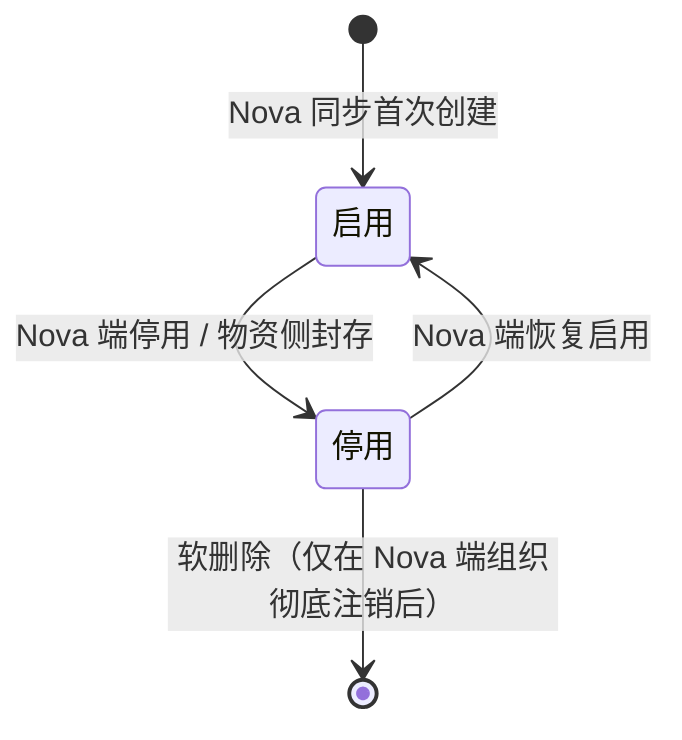
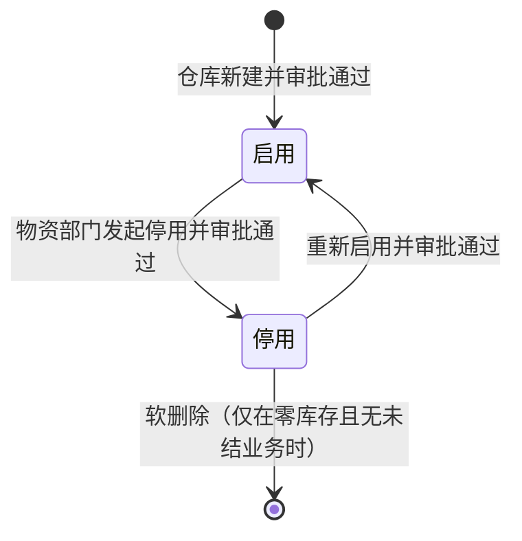
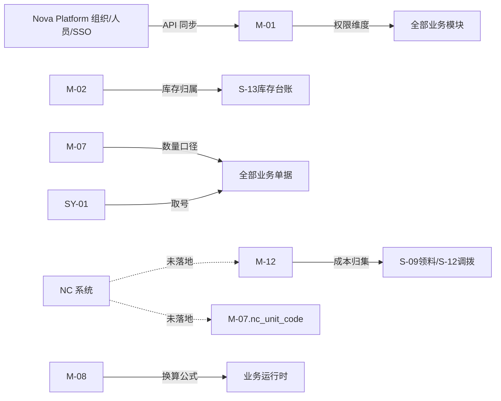

# 基础档案与组织仓库详细设计（V1.0）

**版本：** V1.0
**日期：** 2026-05-02
**文档性质：** 详细设计层 · 模块详设第二篇
**适用阶段：** 详细设计执行、开发实施、联调测试

---

## 一、文档目的

本文档承接 `01-数据库逻辑模型-V1.0.md` 的跨模块骨架，把基础档案模块涉及的 10 张表（组织、仓库、库区、货位、计量单位、单位换算、成本中心、成本中心映射、组织仓库关系、序列号生成器）的全字段、状态机、业务规则、接口规范、配置项和占位项固化下来。

本文档重点回答：

- 基础档案各实体的完整字段、约束和索引建议
- 组织树、库区货位嵌套、单位换算、成本中心映射的业务规则
- 与 Nova Platform、NC 核算组织、F-14 接口元数据的对接边界
- 业务确认未回执时的占位策略
- 与其他模块（03 物料、04 计划采购、06 库存、08 财务接口、10 权限）的协同边界

本文档**不**做以下事：

- 不写物料、供应商、批次、NC 存货映射等非基础档案实体（属 03 / 04 / 08 详设）
- 不写组织/仓库的最终初始数据（依赖 Nova 同步与业务部门提供）
- 不写最终单位字典（待业务方在 16 收集表正式签字后回填到 M-07 初始化数据）
- 不写 NC 核算组织正式映射（待 NC 账套落地后形成）
- 不写页面、按钮、交互（属原型设计阶段）
- 不写 SQL DDL（按厂商方言由环境准备阶段产出）

---

## 二、设计输入

| 输入文档 | 在本文档中的作用 |
| --- | --- |
| `docs/详细设计/01-数据库逻辑模型-V1.0.md` | 实体编号、共用约定（4.1-4.10）、状态值域、索引原则 |
| `docs/概要设计/02-业务模块概要设计-v0.1.md` 节 5.1 | 模块定位、职责边界、关键控制 |
| `docs/概要设计/03-主数据与编码概要设计-v0.1.md` 节 8.3 / 8.4 / 8.6、节九、节十一 | 组织、仓库、单位、成本中心、初始化与治理 |
| `docs/需求梳理/15-计量单位统一模板-V1.0.md` | 单位字典 / 物料单位配置 / 换算规则首稿 + 项目内口径锁定结论 |
| `docs/详细规则/物资管理与财务接口规范.md` | 成本中心、核算组织、NC 推送规则的下游约束 |
| `docs/集团统筹/集团业务系统统一建设原则-V2.0.md` | Nova 平台权威、独立部署、PG 兼容信创、API + JSON、SSO |
| `docs/需求梳理/16-业务确认轮统一收集表-V1.0.md` | 6 项业务确认事项的项目内口径（计量单位、NC 映射等） |

---

## 三、模块范围

### 3.1 本篇覆盖实体

| 实体编号 | 英文名 | 中文名 | 本篇覆盖深度 |
| --- | --- | --- | --- |
| M-01 | organization | 组织机构 | 全字段、状态机、Nova 同步、权限边界 |
| M-02 | warehouse | 仓库 | 全字段、状态机、归属、停用规则 |
| M-03A | warehouse_zone | 库区 | 全字段、嵌套规则、停用 |
| M-03B | storage_location | 货位 | 全字段、嵌套规则、停用 |
| M-07 | unit | 计量单位 | 全字段、字典初始化、NC 映射占位 |
| M-08 | unit_conversion | 计量单位换算 | 全字段、换算公式、舍入规则 |
| M-12 | cost_center | 成本中心 | 全字段、NC 权威边界、本地维护过渡口径 |
| M-13 | cost_center_mapping | 成本中心-使用单位映射 | 全字段、N:N 关系、默认值规则 |
| M-16 | org_warehouse_relation | 组织-仓库关系 | 全字段、共享/专属/集中 |
| SY-01 | sequence_generator | 序列号生成器 | 全字段、并发原子性、断号策略 |

### 3.2 不在本篇覆盖

| 实体 | 承接位置 |
| --- | --- |
| M-04 物料分类、M-05 物料、M-06 物料属性、M-14 NC 存货映射、M-15 物料批次、M-17 物料申请单 | 03 物料主数据与编码详细设计 |
| M-09 供应商、M-10 供应商资质、M-11 供应商黑名单 | 04 需求计划与采购协同详细设计 |
| F-14 接口定义详细字段 | 08 财务与 NC 接口详细设计 |
| A-01 用户副本、A-02 业务角色 | 10 权限审批流详细设计 |

### 3.3 共用约定继承

本篇所有实体表默认遵守 `01-V1.0` 节四的共用约定：

- 4.1 主键策略（技术主键 + 业务编码唯一索引）
- 4.2 审计字段（created_by / created_at / updated_by / updated_at / created_org_id / version_no）
- 4.3 软删除（is_deleted / deleted_by / deleted_at / delete_reason）
- 4.7 时间戳字段（按业务需要选用 effective_date / expire_date 等）
- 4.8 多租户字段（tenant_id 预留，一期默认全为同一租户）

下文字段表中**不重复列出**上述共用字段，只列实体专有字段；如某实体对共用约定有补充说明（例如 SY-01 保留软删除字段但业务禁止删除历史序列行），在该实体的"特别说明"中显式注明。

---

## 四、数据模型

### 4.1 M-01 organization 组织机构

#### 4.1.1 全字段表

| 字段名 | 类型 | 长度/精度 | 空值 | 默认值 | 唯一 | 外键 | 索引建议 | 注释 |
| --- | --- | --- | --- | --- | --- | --- | --- | --- |
| `org_id` | bigint | — | NOT NULL | auto | PK | — | PK | 技术主键 |
| `nova_org_id` | varchar | 64 | NOT NULL | — | UQ | — | UQ | Nova Platform 端的稳定 ID，外部权威键 |
| `parent_id` | bigint | — | NULL | NULL | — | FK→M-01.org_id | idx | 树形自引用；根节点（集团）为 NULL |
| `org_code` | varchar | 32 | NOT NULL | — | UQ | — | UQ | 业务编码，与 Nova 保持一致 |
| `org_name` | varchar | 128 | NOT NULL | — | — | — | idx | 组织全称 |
| `org_short_name` | varchar | 64 | NULL | — | — | — | — | 简称 |
| `org_type` | varchar | 32 | NOT NULL | — | — | — | idx | 取值：集团 / 二级集团 / 厂矿 / 部门 / 班组 |
| `org_level` | smallint | — | NOT NULL | — | — | — | idx | 层级深度 1-5；1=集团（辽宁能源）；5=班组 |
| `org_path` | varchar | 512 | NOT NULL | — | — | — | idx | 路径形如 `/1/12/108/`，便于子树过滤 |
| `nova_status` | varchar | 16 | NULL | — | — | — | — | Nova 端原始状态值（保留追溯） |
| `status` | varchar | 16 | NOT NULL | `启用` | — | — | idx | 取值：启用 / 停用 |
| `last_sync_time` | timestamp | — | NULL | — | — | — | idx | 最后一次成功同步时间 |
| `sync_status` | varchar | 16 | NOT NULL | `已同步` | — | — | idx | 取值：已同步 / 待同步 / 同步失败 |
| `sync_error_message` | varchar | 512 | NULL | — | — | — | — | 同步失败原因 |
| `is_data_scope_root` | boolean | — | NOT NULL | false | — | — | — | 是否数据权限根节点（厂矿级通常为 true） |
| `effective_date` | date | — | NOT NULL | CURRENT_DATE | — | — | — | 启用日期 |
| `expire_date` | date | — | NULL | — | — | — | — | 停用日期；NULL 表示未停用 |

**特别说明**：

- `nova_org_id` 是 Nova Platform 的稳定外部键，物资系统不允许修改；如 Nova 端组织合并/拆分，物资侧通过 sync_status 标记并人工评审
- 组织树最大深度按辽宁能源组织模型限定为 5 层（集团 → 二级集团 → 厂矿 → 部门 → 班组）；超过 5 层的同步数据须告警
- `org_path` 在每次 parent_id 变化时由触发器或服务层重新计算，不允许人工维护
- 物资系统**不允许**通过 UI 直接新增/删除组织；仅允许编辑物资专属字段（`is_data_scope_root` 等）
- 软删除字段保留但仅用于物资侧逻辑标记，不影响 Nova 同步

#### 4.1.2 状态机



状态迁移约束：

- 启用 → 停用：必须先校验下游业务（仓库归属、库存余额、未结业务单据），有依赖时不允许直接停用，要求先迁移或封存
- 停用状态下：组织只能作为历史业务的归属维度，不能作为新业务的发起组织、归属组织或权限范围
- 软删除（is_deleted=1）仅当 Nova 端彻底注销且物资侧确认无任何历史业务依赖时才允许

#### 4.1.3 业务规则

1. **Nova 同步规则**：T+1 全量校验 + 实时事件订阅；同步失败回写 `sync_status=同步失败` 并触发 F-09 mapping_missing_alert 告警
2. **数据权限根节点**：每个厂矿级组织（org_level=3）默认 `is_data_scope_root=true`，作为数据权限过滤的最小完整业务单元
3. **跨组织业务**：跨组织调拨、共享仓引用、跨组织成本归集需在 M-16 / M-13 / S-12 中显式声明，不允许靠组织树推导
4. **历史数据保护**：组织 `org_id` 一经使用不允许重用；如 Nova 端 ID 重建，物资侧分配新 `org_id` 并标记前 ID `is_deleted=1`

---

### 4.2 M-02 warehouse 仓库

#### 4.2.1 全字段表

| 字段名 | 类型 | 长度/精度 | 空值 | 默认值 | 唯一 | 外键 | 索引建议 | 注释 |
| --- | --- | --- | --- | --- | --- | --- | --- | --- |
| `warehouse_id` | bigint | — | NOT NULL | auto | PK | — | PK | 技术主键 |
| `warehouse_code` | varchar | 32 | NOT NULL | — | UQ | — | UQ | 业务编码，物资系统内唯一 |
| `warehouse_name` | varchar | 128 | NOT NULL | — | — | — | idx | 仓库名称 |
| `org_id` | bigint | — | NOT NULL | — | — | FK→M-01 | idx | 归属组织（专属仓为唯一组织；共享仓为主归属组织） |
| `warehouse_type` | varchar | 32 | NOT NULL | — | — | — | idx | 取值：主仓 / 分仓 / 中转仓 / 危化品仓 / 设备仓 / 备品备件仓 / 共享仓 |
| `warehouse_address` | varchar | 255 | NULL | — | — | — | — | 物理地址 |
| `responsible_user_id` | bigint | — | NULL | — | — | FK→A-01 | idx | 仓库负责人 |
| `contact_phone` | varchar | 32 | NULL | — | — | — | — | 联系电话 |
| `area_size_m2` | decimal | (10,2) | NULL | — | — | — | — | 仓库面积（平方米） |
| `temperature_control` | varchar | 16 | NOT NULL | `常温` | — | — | — | 取值：常温 / 恒温 / 冷藏 / 冷冻 |
| `explosion_proof` | boolean | — | NOT NULL | false | — | — | — | 是否防爆要求（火工品/化学品仓必须） |
| `is_shared` | boolean | — | NOT NULL | false | — | — | idx | 是否共享仓；与 M-16 配合使用 |
| `status` | varchar | 16 | NOT NULL | `启用` | — | — | idx | 启用 / 停用 |
| `effective_date` | date | — | NOT NULL | CURRENT_DATE | — | — | — | 启用日期 |
| `expire_date` | date | — | NULL | — | — | — | — | 停用日期 |
| `remarks` | varchar | 255 | NULL | — | — | — | — | 备注 |

#### 4.2.2 状态机



状态迁移约束：

- 启用 → 停用：必须满足以下全部条件
  1. 仓库内 S-13 库存台账总量 = 0（含冻结、在途）
  2. 无未结领料、退料、调拨业务（S-08 / S-09 / S-10 / S-11 / S-12 状态非草稿/待审/已审/已下达/部分到货）
  3. 无未关闭的盘点任务（S-15）
  4. 仓库下所有库区货位（M-03A / M-03B）均已停用
- 停用状态下：仓库不能被新业务引用，但历史业务的库存查询、报表统计仍可看到
- 跨组织共享仓停用：必须先解除 M-16 中所有 relation_type=共享 的关联

#### 4.2.3 业务规则

1. **业务编码规则**：建议 `<组织编码>-<仓库类型>-<3 位流水>`，例如 `FK01-MAIN-001`；不强制由系统生成，由物资部门维护
2. **共享仓约束**：`is_shared=true` 时必须在 M-16 中至少存在一条 `relation_type=共享` 的关系；只有 M-16 中所有共享关系解除后才能改回 `is_shared=false`
3. **特殊仓库**：`explosion_proof=true` 的仓库只能存放危化品/火工品类物料，业务规则在 03 / 06 详设中校验
4. **仓库责任人**：必须是 A-01 中状态为"启用"的用户

---

### 4.3 M-03A warehouse_zone 库区 + M-03B storage_location 货位

#### 4.3.1 M-03A warehouse_zone 全字段表

| 字段名 | 类型 | 长度/精度 | 空值 | 默认值 | 唯一 | 外键 | 索引建议 | 注释 |
| --- | --- | --- | --- | --- | --- | --- | --- | --- |
| `zone_id` | bigint | — | NOT NULL | auto | PK | — | PK | 技术主键 |
| `warehouse_id` | bigint | — | NOT NULL | — | — | FK→M-02 | idx | 所属仓库 |
| `zone_code` | varchar | 32 | NOT NULL | — | — | — | idx | 库区编码（仓库内唯一） |
| `zone_name` | varchar | 128 | NOT NULL | — | — | — | — | 库区名称 |
| `zone_type` | varchar | 32 | NOT NULL | — | — | — | idx | 取值：露天 / 室内 / 危化品 / 精密 / 大件 / 小件 |
| `area_size_m2` | decimal | (10,2) | NULL | — | — | — | — | 库区面积 |
| `storage_temperature_min` | decimal | (5,1) | NULL | — | — | — | — | 最低存储温度 |
| `storage_temperature_max` | decimal | (5,1) | NULL | — | — | — | — | 最高存储温度 |
| `status` | varchar | 16 | NOT NULL | `启用` | — | — | idx | 启用 / 停用 |
| `remarks` | varchar | 255 | NULL | — | — | — | — | 备注 |

**唯一约束**：`(warehouse_id, zone_code)` 复合唯一（仓库内库区编码唯一，不同仓库可重复）

#### 4.3.2 M-03B storage_location 全字段表

| 字段名 | 类型 | 长度/精度 | 空值 | 默认值 | 唯一 | 外键 | 索引建议 | 注释 |
| --- | --- | --- | --- | --- | --- | --- | --- | --- |
| `location_id` | bigint | — | NOT NULL | auto | PK | — | PK | 技术主键 |
| `zone_id` | bigint | — | NOT NULL | — | — | FK→M-03A | idx | 所属库区 |
| `location_code` | varchar | 32 | NOT NULL | — | — | — | idx | 货位编码（库区内唯一） |
| `location_name` | varchar | 128 | NOT NULL | — | — | — | — | 货位名称 |
| `location_type` | varchar | 32 | NOT NULL | — | — | — | idx | 取值：货架 / 堆放区 / 货架层 / 特殊位 |
| `shelf_no` | varchar | 32 | NULL | — | — | — | — | 货架号 |
| `row_no` | varchar | 16 | NULL | — | — | — | — | 行号 |
| `col_no` | varchar | 16 | NULL | — | — | — | — | 列号 |
| `level_no` | varchar | 16 | NULL | — | — | — | — | 层号 |
| `max_load_kg` | decimal | (10,2) | NULL | — | — | — | — | 最大承重（千克） |
| `barcode` | varchar | 64 | NULL | — | UQ | — | UQ | 货位条码（用于 PDA 扫描） |
| `status` | varchar | 16 | NOT NULL | `启用` | — | — | idx | 启用 / 停用 |
| `location_state` | varchar | 16 | NOT NULL | `正常` | — | — | idx | 取值：正常 / 冻结 |
| `freeze_reason` | varchar | 128 | NULL | — | — | — | — | 冻结原因（盘点冻结、特殊管控等） |

**唯一约束**：`(zone_id, location_code)` 复合唯一

#### 4.3.3 库区/货位嵌套规则

- **两级嵌套**：仓库 → 库区 → 货位，**不**允许货位之外再嵌套子货位（避免无限嵌套）
- **可选层级**：库区是必选层级；货位是**可选**——小型仓库（如班组级备品库）可只到库区不分货位，库存定位到 zone_id 即可
- **状态联动**：库区停用 → 库区下所有货位自动停用（不级联删除）；仓库停用 → 库区/货位均自动停用
- **冻结状态**：货位特有 `location_state=冻结` 用于盘点期间局部冻结、危险物料临时管控等场景；启停仍使用通用 `status`

#### 4.3.4 业务规则

1. **条码唯一性**：货位条码全局唯一，PDA 扫描定位用；若无 PDA 应用场景可不维护
2. **货位删除**：货位有库存时（S-13 中存在 location_id 引用）不允许删除，只能停用
3. **库区类型校验**：`zone_type=危化品` 的库区必须归属 `explosion_proof=true` 的仓库
4. **温度区间**：`storage_temperature_min < storage_temperature_max`；用于配合 M-15 物料批次的存储温度校验

---

### 4.4 M-07 unit 计量单位

#### 4.4.1 全字段表

| 字段名 | 类型 | 长度/精度 | 空值 | 默认值 | 唯一 | 外键 | 索引建议 | 注释 |
| --- | --- | --- | --- | --- | --- | --- | --- | --- |
| `unit_id` | bigint | — | NOT NULL | auto | PK | — | PK | 技术主键 |
| `unit_code` | varchar | 16 | NOT NULL | — | UQ | — | UQ | 单位编码，如 EA / KG / M / SET |
| `unit_name` | varchar | 32 | NOT NULL | — | — | — | idx | 单位名称：个/千克/米/套 |
| `unit_alias` | varchar | 64 | NULL | — | — | — | — | 历史别名（同义词归并用，仅历史查询） |
| `unit_type` | varchar | 16 | NOT NULL | — | — | — | idx | 取值：数量单位 / 重量单位 / 长度单位 / 体积单位 / 包装单位 / 时间单位 |
| `precision` | smallint | — | NOT NULL | 0 | — | — | — | 数量精度（小数位 0-3） |
| `nc_unit_code` | varchar | 16 | NULL | — | — | — | idx | NC 单位编码（NC 未落地阶段为空） |
| `nc_unit_name` | varchar | 32 | NULL | — | — | — | — | NC 单位名称 |
| `unit_mapping_state` | varchar | 16 | NOT NULL | `未映射` | — | — | idx | 取值：未映射 / 待确认 / 已映射 |
| `maintain_dept` | varchar | 64 | NOT NULL | `物资部门` | — | — | — | 维护部门（默认物资部门） |
| `confirm_dept` | varchar | 64 | NOT NULL | `财务部门` | — | — | — | 确认部门（默认财务部门） |
| `is_system` | boolean | — | NOT NULL | false | — | — | — | 是否系统内置（系统单位不允许停用） |
| `status` | varchar | 16 | NOT NULL | `启用` | — | — | idx | 启用 / 停用 |
| `remarks` | varchar | 255 | NULL | — | — | — | — | 备注 |

#### 4.4.2 初始化数据（首批 12 条，源自需求 15 表 5.2）

| unit_code | unit_name | unit_type | precision | unit_mapping_state | 备注 |
| --- | --- | --- | --- | --- | --- |
| EA | 个 | 数量单位 | 0 | 待确认 | 一般散件默认数量单位 |
| SET | 套 | 数量单位 | 0 | 待确认 | 成套领用 |
| UNIT | 台 | 数量单位 | 0 | 待确认 | 设备类常用单位 |
| M | 米 | 长度单位 | 2 | 待确认 | 电缆、管材 |
| ROLL | 卷 | 包装单位 | 0 | 未映射 | 采购包装单位 |
| KG | 千克 | 重量单位 | 3 | 待确认 | 散装耗材 |
| T | 吨 | 重量单位 | 3 | 待确认 | 大宗物资 |
| L | 升 | 体积单位 | 2 | 待确认 | 液体油品 |
| DRUM | 桶 | 包装单位 | 0 | 未映射 | 油品采购单位 |
| BOX | 箱 | 包装单位 | 0 | 未映射 | 紧固件采购单位 |
| PACK | 盒 | 包装单位 | 0 | 未映射 | 小件采购单位 |
| GEN | 根 | 数量单位 | 0 | 未映射 | 管材采购单位 |

**业务确认占位**：本初始化数据为 `[待业务方正式签字 - 参见 15]`，待 16 收集表第 1 项业务方正式签字后回填到 M-07 初始化脚本；项目内已锁定（2026-05-01）。

#### 4.4.3 业务规则

1. **新增单位流程**：物资部门发起 → 财务部门确认 NC 映射可行性 → 网信办系统配置；走审批流（A-08 / A-20），审批留痕在 A-10
2. **单位停用约束**：被任何启用物料（M-05）的主单位/采购单位/库存单位/领用单位引用时不允许停用；`is_system=true` 的系统内置单位永远不允许停用
3. **NC 映射回填**：`unit_mapping_state=已映射` 时 nc_unit_code 必须非空；NC 落地后由财务部门统一回填
4. **精度约束**：业务单据数量字段必须按 `precision` 截断，超过精度的输入按舍入规则处理（在 M-08 中定义）

---

### 4.5 M-08 unit_conversion 计量单位换算

#### 4.5.1 全字段表

| 字段名 | 类型 | 长度/精度 | 空值 | 默认值 | 唯一 | 外键 | 索引建议 | 注释 |
| --- | --- | --- | --- | --- | --- | --- | --- | --- |
| `conversion_id` | bigint | — | NOT NULL | auto | PK | — | PK | 技术主键 |
| `conversion_no` | varchar | 32 | NOT NULL | — | UQ | — | UQ | 换算规则编号，如 UOM-R001 |
| `material_id` | bigint | — | NULL | — | — | FK→M-05 | idx | 按物料单独配置（与 category_id 二选一非空） |
| `category_id` | bigint | — | NULL | — | — | FK→M-04 | idx | 按物料分类共用 |
| `from_unit_id` | bigint | — | NOT NULL | — | — | FK→M-07 | idx | 源单位 |
| `to_unit_id` | bigint | — | NOT NULL | — | — | FK→M-07 | idx | 目标单位 |
| `conversion_ratio` | decimal | (18,6) | NOT NULL | — | — | — | — | 换算比例：1 from_unit = ratio × to_unit |
| `rounding_method` | varchar | 32 | NOT NULL | `四舍五入` | — | — | — | 取值：四舍五入 / 向下取整 / 向上取整 / 不允许小数 |
| `result_precision` | smallint | — | NOT NULL | 0 | — | — | — | 换算结果保留小数位 |
| `effective_date` | date | — | NOT NULL | CURRENT_DATE | — | — | idx | 生效日期 |
| `expire_date` | date | — | NULL | — | — | — | — | 失效日期 |
| `status` | varchar | 16 | NOT NULL | `启用` | — | — | idx | 启用 / 停用 |
| `approval_record` | varchar | 255 | NULL | — | — | — | — | 审批单号或会议纪要编号 |

**唯一约束**：`(material_id, category_id, from_unit_id, to_unit_id, effective_date)` 复合唯一；`material_id` 和 `category_id` 至少一个非 NULL（CHECK 约束）

#### 4.5.2 换算公式

```
to_quantity_raw = from_quantity × conversion_ratio
to_quantity = ROUND(to_quantity_raw, result_precision, rounding_method)
```

具体舍入策略：

- **四舍五入**：标准 ROUND
- **向下取整**：FLOOR
- **向上取整**：CEIL
- **不允许小数**：若 `result_precision=0` 且换算结果非整数，业务校验拦截，要求重新输入或调整数量

#### 4.5.3 查找优先级

物料业务单据需要换算时，按以下优先级查找规则：

1. 按 `material_id` 直接匹配（最高优先级）
2. 按 `category_id` 匹配（物料所属分类）
3. 按 `category_id` 沿分类树向上查找（M-04 自引用）
4. 找不到则报错，业务单据拦截，提示"未配置换算规则"

#### 4.5.4 初始化数据（首批 6 条，源自需求 15 表 7.2）

| conversion_no | material_id | from_unit | to_unit | conversion_ratio | rounding | precision | 备注 |
| --- | --- | --- | --- | --- | --- | --- | --- |
| UOM-R001 | ZH-01-000001 | 箱 | 个 | 50 | 不允许小数 | 0 | 锚杆 1 箱 50 个 |
| UOM-R002 | DL-01-000001 | 卷 | 米 | 100 | 四舍五入 | 2 | 电缆 1 卷 100 米 |
| UOM-R003 | GC-01-000001 | 根 | 米 | 6 | 四舍五入 | 2 | 钢管定尺 6 米 |
| UOM-R004 | JX-01-000001 | 盒 | 个 | 10 | 不允许小数 | 0 | 轴承 1 盒 10 个 |
| UOM-R005 | YL-01-000001 | 桶 | 升 | 18 | 四舍五入 | 2 | 液压油标准 18L 桶 |
| UOM-R006 | LS-01-000001 | 箱 | 个 | 100 | 不允许小数 | 0 | 螺栓 1 箱 100 个 |

**业务确认占位**：同 4.4.2，`[待业务方正式签字 - 参见 15]`。

---

### 4.6 M-12 cost_center 成本中心

#### 4.6.1 全字段表

| 字段名 | 类型 | 长度/精度 | 空值 | 默认值 | 唯一 | 外键 | 索引建议 | 注释 |
| --- | --- | --- | --- | --- | --- | --- | --- | --- |
| `cost_center_id` | bigint | — | NOT NULL | auto | PK | — | PK | 技术主键 |
| `cost_center_code` | varchar | 32 | NOT NULL | — | UQ | — | UQ | 成本中心编码；NC 落地后由 NC 提供，未落地时使用 `LOCAL-` 前缀 |
| `cost_center_name` | varchar | 128 | NOT NULL | — | — | — | idx | 名称 |
| `nc_cost_center_code` | varchar | 32 | NULL | — | — | — | idx | NC 端编码（NC 未落地阶段为空） |
| `org_id` | bigint | — | NOT NULL | — | — | FK→M-01 | idx | 归属组织（按核算组织口径） |
| `accounting_org_id` | bigint | — | NULL | — | — | FK→M-01 | idx | 核算组织（NC 落地后必填） |
| `nc_synced` | boolean | — | NOT NULL | false | — | — | idx | 是否已同步 NC（NC 落地后由同步任务回写） |
| `maintain_source` | varchar | 16 | NOT NULL | `本地` | — | — | — | 取值：本地（NC 未落地）/ NC（NC 落地后切换） |
| `effective_date` | date | — | NOT NULL | CURRENT_DATE | — | — | — | 生效日期 |
| `expire_date` | date | — | NULL | — | — | — | — | 失效日期 |
| `status` | varchar | 16 | NOT NULL | `启用` | — | — | idx | 启用 / 停用 |

#### 4.6.2 NC 未落地过渡口径

按 16 收集表第 6 项业务确认轮口径（`待启动 - 依赖 NC 落地`），M-12 在三阶段切换：

| 阶段 | maintain_source | cost_center_code 格式 | nc_cost_center_code | nc_synced |
| --- | --- | --- | --- | --- |
| **阶段 1：NC 未落地** | `本地` | `LOCAL-<组织编码>-<3 位流水>` | NULL | false |
| **阶段 2：NC 账套就绪、映射就绪、未启用** | `本地` | `LOCAL-...`（保留） | 已写入但未启用 | false |
| **阶段 3：NC 联调通过、正式切换** | `NC` | NC 提供的编码（不再以 LOCAL- 开头） | 必填 | true |

切换规则：

- 阶段 1 → 阶段 2：财务部门提供 NC 端编码草案，写入 `nc_cost_center_code` 字段，`maintain_source` 不变
- 阶段 2 → 阶段 3：项目领导小组评审后，由网信办执行批量切换脚本，`cost_center_code` 改为 NC 编码、`maintain_source=NC`、`nc_synced=true`；旧 `LOCAL-` 编码作为历史记录保留在 `remarks` 中
- 切换过程中已经发生的领料、出库、调拨等业务凭证按原 `cost_center_id`（技术主键）继续关联，不受 `cost_center_code` 字符串变化影响

#### 4.6.3 业务规则

1. **本地维护审批**：阶段 1 / 2 由财务部门发起新增/变更，物资部门确认归属组织，网信办执行配置（A-08 / A-20 走审批流）
2. **NC 同步频率**：阶段 3 后，T+1 全量校验 + 实时事件订阅；同步失败回写 `nc_synced=false` 并触发 F-09 告警
3. **领料强制**：S-08 / S-09 领料业务单据的 `cost_center_id` 必须非空；若使用单位（usage_unit_id）有默认成本中心（M-13），自动带出但允许人工修改

---

### 4.7 M-13 cost_center_mapping 成本中心-使用单位映射

#### 4.7.1 全字段表

| 字段名 | 类型 | 长度/精度 | 空值 | 默认值 | 唯一 | 外键 | 索引建议 | 注释 |
| --- | --- | --- | --- | --- | --- | --- | --- | --- |
| `mapping_id` | bigint | — | NOT NULL | auto | PK | — | PK | 技术主键 |
| `cost_center_id` | bigint | — | NOT NULL | — | — | FK→M-12 | idx | 成本中心 |
| `usage_unit_id` | bigint | — | NOT NULL | — | — | FK→M-01 | idx | 使用单位（组织节点） |
| `default_flag` | boolean | — | NOT NULL | false | — | — | idx | 是否使用单位的默认成本中心 |
| `effective_date` | date | — | NOT NULL | CURRENT_DATE | — | — | — | 生效日期 |
| `expire_date` | date | — | NULL | — | — | — | — | 失效日期 |
| `status` | varchar | 16 | NOT NULL | `启用` | — | — | idx | 启用 / 停用 |
| `remarks` | varchar | 255 | NULL | — | — | — | — | 备注 |

**唯一约束**：`(cost_center_id, usage_unit_id, effective_date)` 复合唯一

#### 4.7.2 业务规则

1. **N:N 关系**：一个使用单位可关联多个成本中心；一个成本中心可服务多个使用单位
2. **默认值唯一**：每个 `usage_unit_id` 只允许一条 `default_flag=true` 的启用映射；新建时校验，若已有默认值需先取消旧默认值
3. **领料带出**：S-08 / S-09 / S-26 / S-27 领料/领料明细行的 `cost_center_id` 优先按以下顺序带出：
   1. 用户在表单上手工选择
   2. 使用单位的默认成本中心（M-13 中 default_flag=true）
   3. 该使用单位仅有的一条启用映射（如果只有一条）
   4. 提示用户必须选择
4. **历史保留**：成本中心变更后，旧映射不删除，标记 `expire_date` 与 `status=停用`

---

### 4.8 M-16 org_warehouse_relation 组织-仓库关系

#### 4.8.1 全字段表

| 字段名 | 类型 | 长度/精度 | 空值 | 默认值 | 唯一 | 外键 | 索引建议 | 注释 |
| --- | --- | --- | --- | --- | --- | --- | --- | --- |
| `relation_id` | bigint | — | NOT NULL | auto | PK | — | PK | 技术主键 |
| `org_id` | bigint | — | NOT NULL | — | — | FK→M-01 | idx | 组织 |
| `warehouse_id` | bigint | — | NOT NULL | — | — | FK→M-02 | idx | 仓库 |
| `relation_type` | varchar | 16 | NOT NULL | — | — | — | idx | 取值：专属 / 共享 / 集中 |
| `is_primary` | boolean | — | NOT NULL | false | — | — | — | 是否主归属（共享/集中仓的主组织） |
| `effective_date` | date | — | NOT NULL | CURRENT_DATE | — | — | — | 生效日期 |
| `expire_date` | date | — | NULL | — | — | — | — | 失效日期 |
| `status` | varchar | 16 | NOT NULL | `启用` | — | — | idx | 启用 / 停用 |
| `remarks` | varchar | 255 | NULL | — | — | — | — | 备注 |

**唯一约束**：`(org_id, warehouse_id, effective_date)` 复合唯一

#### 4.8.2 关系类型语义

| relation_type | 含义 | 约束 |
| --- | --- | --- |
| **专属** | 仓库仅服务一个组织 | M-02.is_shared=false；该仓库在 M-16 中只能有 1 条该类型记录 |
| **共享** | 仓库服务多个同级组织 | M-02.is_shared=true；M-16 中至少 2 条共享记录；其中 1 条 is_primary=true |
| **集中** | 仓库由上级组织代各下级组织管理 | M-02.is_shared=true；上级组织 is_primary=true；下级组织 is_primary=false |

#### 4.8.3 业务规则

1. **数据权限**：库存查询、领料、调拨等业务的数据权限按 M-16 过滤——用户所属组织必须在仓库的 M-16 关系中存在 `status=启用` 的记录
2. **主归属变更**：共享仓的主归属变更需走审批流，新主归属必须先建立 is_primary=true，旧主归属再 is_primary=false（不允许同时为空）
3. **跨组织调拨**：S-12 跨组织调拨的 from_warehouse 和 to_warehouse 都必须分别在 M-16 中有对应组织的启用关系

---

### 4.9 SY-01 sequence_generator 序列号生成器

#### 4.9.1 全字段表

| 字段名 | 类型 | 长度/精度 | 空值 | 默认值 | 唯一 | 外键 | 索引建议 | 注释 |
| --- | --- | --- | --- | --- | --- | --- | --- | --- |
| `sequence_id` | bigint | — | NOT NULL | auto | PK | — | PK | 技术主键 |
| `prefix` | varchar | 8 | NOT NULL | — | — | — | idx | 业务前缀，如 PO / RC / IS / TR |
| `date_key` | varchar | 8 | NOT NULL | — | — | — | idx | 日期段 YYYYMMDD（按"前缀 + 日期"独立递增） |
| `current_value` | bigint | — | NOT NULL | 0 | — | — | — | 当前值；下次取号 = current_value + 1 |
| `step_size` | smallint | — | NOT NULL | 1 | — | — | — | 步长（默认 1，特殊场景可调） |
| `last_used_at` | timestamp | — | NULL | — | — | — | — | 最后取号时间 |
| `last_used_by` | bigint | — | NULL | — | — | FK→A-01 | — | 最后取号操作人（接口取号时为系统用户） |

**唯一约束**：`(prefix, date_key)` 复合唯一

**特别说明**：本表保留 `01-V1.0` 节 4.3 的软删除字段，但业务规则禁止删除历史日期的序列记录；历史号段仅作为台账长期保留。审计字段中 `version_no` 用于乐观锁。

#### 4.9.2 取号并发控制

- **首选方案：行级锁（悲观锁）**——`SELECT ... FOR UPDATE` 锁定 `(prefix, date_key)` 行，UPDATE 后释放锁；保证并发下严格连续递增
- **备选方案：乐观锁（version_no）**——读 current_value 和 version_no，CAS 更新；冲突重试 3 次仍失败则降级到行级锁
- **不推荐**：分布式 ID 生成器、Snowflake 等——业务单号要求"前缀 + 日期 + 6 位顺序号"格式，必须严格连续

#### 4.9.3 断号策略

- **可断号**：业务事务回滚时已分配的号段视为浪费，**不**回收；符合"业务可接受少量断号"的口径，避免回收逻辑引入并发风险
- **每日重置**：每日 0:00 后，新业务单据按新 date_key 取号，current_value 从 0 开始
- **历史保留**：旧 date_key 行不清理，便于历史业务单号追溯

#### 4.9.4 业务编号格式约定

```
<前缀><YYYYMMDD><6 位顺序号，前导 0 补齐>
```

实例：`PO202605010001`、`RC202605010234`、`IS202605011500`

每日单业务前缀最大支持 999,999 单（6 位）；如某日某业务超过此上限，告警并告知项目领导小组评估是否需要扩展位数（升级 SY-01 表结构）。

#### 4.9.5 前缀清单

| 前缀 | 业务实体 | 编号生成位置 |
| --- | --- | --- |
| DR | P-01 demand_request 需求提报单 | 04 详设 |
| PP | P-02 purchase_plan 采购计划 | 04 详设 |
| PR | S-01 purchase_request 采购申请 | 04 / 06 详设 |
| PO | S-02 purchase_order 采购订单 | 04 / 06 详设 |
| GR | S-03 goods_receipt 到货验收 | 06 详设 |
| QC | S-04 quality_inspection 质检单 | 06 详设 |
| RC | S-05 purchase_receipt 采购入库 | 06 详设 |
| RT | S-06 purchase_return 采购退货 | 06 详设 |
| PE | S-07 purchase_estimate 采购入库暂估 | 06 详设 |
| RQ | S-08 requisition_request 领料申请 | 06 详设 |
| IS | S-09 material_issuance 领料出库 | 06 详设 |
| MR | S-10 material_return 退料入库 | 06 详设 |
| TQ | S-11 transfer_request 调拨申请 | 06 详设 |
| TR | S-12 transfer_order 调拨单 | 06 详设 |
| IT | S-15 inventory_task 盘点任务 | 06 详设 |
| IC | S-16 inventory_count 盘点单 | 06 详设 |
| SU | S-17 inventory_surplus 盘盈处理 | 06 详设 |
| SL | S-18 inventory_shortage 盘亏处理 | 06 详设 |
| SD | S-19 scrap_declaration 废旧认定 | 06 详设 |
| SP | S-20 scrap_disposal 废旧处置 | 06 详设 |
| TX | S-21 inventory_transaction 库存事务流水 | 06 详设 |
| CT | C-02 contract 合同 | 05 详设 |
| PA | C-08 payment_application 付款申请 | 05 详设 |
| EQ | E-01 equipment 设备 | 07 详设 |
| RR | E-07 rental_request 租赁申请 | 07 详设 |
| IFT | F-01 interface_task 接口任务 | 08 详设 |
| AD | P-04 plan_adjustment 计划调整单 | 04 详设 |
| PT | P-05 purchase_task 采购任务单 | 04 详设 |
| TA | T-01 tender_application 招标申请 | 04 详设 |
| CA | C-01 contract_approval 合同审批会签单 | 05 详设 |
| CC | C-05 contract_change 合同变更单 | 05 详设 |
| TN | C-06 contract_termination 合同终止单 | 05 详设 |
| ESC | E-02 equipment_status_change 设备状态变更单 | 07 详设 |
| EOC | E-03 equipment_ownership_change 设备权属变更单 | 07 详设 |
| EMT | E-04 equipment_maintenance 设备维修保养记录 | 07 详设 |
| EIN | E-05 equipment_inspection 设备检修单 | 07 详设 |
| ESR | E-06 equipment_scrapping 设备报废处置单 | 07 详设 |
| REG | E-08 rental_registration 租赁登记单 | 07 详设 |
| RST | E-09 rental_start 租赁起租单 | 07 详设 |
| RNE | E-10 rental_renewal 租赁续租单 | 07 详设 |
| RSP | E-11 rental_suspension 租赁停租单 | 07 详设 |
| RRT | E-12 rental_return 租赁退租单 | 07 详设 |
| RFS | E-13 rental_fee_summary 租赁费用汇总表 | 07 详设 |
| RHO | E-14 rental_handover 租赁交接确认单 | 07 详设 |
| REC | F-06 reconciliation_record 对账记录 | 08 详设 |
| EXC | F-08 exception_record 异常台账 | 08 详设 |
| REV | F-11 period_reverse_request 反结申请单 | 08 详设 |
| NAR | F-12 nc_account_rule NC凭证科目规则 | 08 详设 |
| AL | R-05 alert_record 预警记录 | 09 详设 |

后续 02-11 详设新增业务单据时应补本清单；前缀预留并防止冲突由本篇统一管理。

---

## 五、ERD

### 5.1 基础档案域 ERD

```mermaid
erDiagram
    M-01 organization ||--o{ M-01 organization : "parent_id 自引用"
    M-01 organization ||--o{ M-02 warehouse : "归属组织"
    M-02 warehouse ||--o{ M-03A warehouse_zone : "包含库区"
    M-03A warehouse_zone ||--o{ M-03B storage_location : "包含货位"
    M-01 organization ||--o{ M-12 cost_center : "归属组织"
    M-01 organization ||--o{ M-12 cost_center : "核算组织"
    M-12 cost_center ||--o{ M-13 cost_center_mapping : "映射"
    M-01 organization ||--o{ M-13 cost_center_mapping : "使用单位"
    M-01 organization ||--o{ M-16 org_warehouse_relation : "组织维度"
    M-02 warehouse ||--o{ M-16 org_warehouse_relation : "仓库维度"
    M-07 unit ||--o{ M-08 unit_conversion : "源单位"
    M-07 unit ||--o{ M-08 unit_conversion : "目标单位"
```

### 5.2 与外部模块的关系



---

## 六、状态机汇总

| 实体 | 状态字段 | 状态值域 | 关键迁移条件 |
| --- | --- | --- | --- |
| M-01 organization | status | 启用 / 停用 | 停用前校验下游业务（仓库、库存、未结单据）；Nova 同步事件驱动 |
| M-02 warehouse | status | 启用 / 停用 | 停用前校验：库存为零 + 无未结业务 + 库区货位均停用 |
| M-03A warehouse_zone | status | 启用 / 停用 | 仓库停用 → 自动停用 |
| M-03B storage_location | status | 启用 / 停用 | 库区停用 → 自动停用 |
| M-03B storage_location | location_state | 正常 / 冻结 | 货位运行态；冻结独立处理（盘点/管控触发） |
| M-07 unit | status | 启用 / 停用 | 系统单位（is_system=true）不可停用；被引用单位不可停用 |
| M-08 unit_conversion | status | 启用 / 停用 | 失效日期到达自动停用 |
| M-12 cost_center | status | 启用 / 停用 | NC 同步事件驱动（阶段 3）；本地维护走审批 |
| M-13 cost_center_mapping | status | 启用 / 停用 | 成本中心或使用单位停用 → 自动停用 |
| M-16 org_warehouse_relation | status | 启用 / 停用 | 仓库或组织停用 → 自动停用 |
| SY-01 sequence_generator | — | （无业务状态） | 仅技术运行态 |

---

## 七、业务规则汇总

### 7.1 组织树规则

- 树形最大深度 5 层
- 根节点（集团）`parent_id IS NULL`
- 非根节点 `parent_id` 必须存在且 `status=启用`（停用组织不能挂新子节点）
- `org_path` 由系统计算，禁止人工维护
- 不允许形成环（A → B → A）；新建/变更时校验

### 7.2 仓库归属规则

- 每个仓库必须有一个 `org_id` 主归属
- 共享仓 / 集中仓通过 M-16 表达多组织关系，但 M-02.org_id 仍指向主归属
- 主归属变更需走审批流，且必须同步更新 M-16

### 7.3 库区货位嵌套规则

- 仓库 → 库区 → 货位（最多三层）
- 货位为可选层级（小型仓库可只到库区）
- 库存（S-13）的位置定位优先级：货位 → 库区 → 仓库（位置精度按业务能力支持）

### 7.4 单位换算规则

- 换算精度由 M-08 的 `result_precision` 决定
- 舍入策略由 M-08 的 `rounding_method` 决定
- 不允许物料在未配置换算规则的情况下跨单位流转
- 换算规则变更对历史业务单据无追溯效应（按变更时点的有效规则计算并固化在单据上）

### 7.5 成本中心规则

- 阶段 1 / 2：`cost_center_code` 以 `LOCAL-` 开头，由财务部门维护
- 阶段 3：切换为 NC 编码，`maintain_source=NC`，`nc_synced=true`
- 切换过程中业务单据通过 `cost_center_id`（技术主键）保持稳定关联，不受字符串变化影响

### 7.6 编号生成规则

- 业务单据编号 = `<前缀><YYYYMMDD><6 位前导 0 顺序号>`
- 前缀由 SY-01 节 4.9.5 统一管理
- 每日重置；可断号（事务回滚不回收）
- 高并发取号优先行级锁

---

## 八、接口规范

### 8.1 Nova Platform 同步接口

| 接口 | 方向 | 频率 | 触发 | 说明 |
| --- | --- | --- | --- | --- |
| 组织全量同步 | Nova → 物资 | T+1 凌晨 | 调度任务 | 全量校验，差异写入 M-01 |
| 组织增量事件 | Nova → 物资 | 实时 | Nova 端组织变更事件 | 推送 nova_org_id + 操作类型（新增/变更/停用） |
| 用户全量同步 | Nova → 物资 | T+1 凌晨 | 调度任务 | 写入 A-01（不在本篇详细展开） |
| SSO 验证 | 物资 → Nova | 实时 | 用户登录 | 不在本篇展开（属 10 详设） |

接口字段细则在 08 详设 `F-14 interface_definition` 中按 `interface_code = NOVA_ORG_FULL_SYNC` 等编码登记，不在本篇重复。

### 8.2 NC 接口（按 NC 落地阶段启用）

| 接口 | 方向 | 启用时点 | 说明 |
| --- | --- | --- | --- |
| 核算组织映射查询 | NC → 物资 | NC 落地后 | 取核算组织清单 |
| 成本中心同步 | NC → 物资 | NC 落地后 | 阶段 3 切换的输入 |
| 计量单位映射查询 | NC → 物资 | NC 落地后 | 回填 M-07.nc_unit_code |

### 8.3 内部接口

- **取号接口**：业务单据生成时调用 SY-01 取号服务，输入 `(prefix, date_key)`，返回 `<前缀><日期><顺序号>`
- **组织树查询**：基于 `org_path` 的 LIKE 查询支持子树过滤
- **数据权限校验**：基于 M-16 的 SQL 拼接器，按当前用户的组织范围过滤业务数据

---

## 九、配置项与默认值矩阵

| 配置项 | 配置位置 | 默认值 | 可调范围 | 调整责任方 |
| --- | --- | --- | --- | --- |
| 组织树最大深度 | SY-02 system_config | 5 | 3-7 | 网信办 |
| 仓库面积单位 | SY-02 | 平方米 | 平方米 / 平方英尺 | 物资部门 |
| 单位精度上限 | SY-02 | 3 | 0-6 | 财务部门 |
| 换算结果默认舍入 | SY-02 | 四舍五入 | 见 4.5.2 列表 | 物资部门 + 财务 |
| 编号顺序号位数 | SY-02 | 6 | 4-8 | 网信办 |
| Nova 同步重试次数 | SY-02 | 3 | 1-10 | 网信办 |
| Nova 同步重试间隔（秒） | SY-02 | 60 | 30-600 | 网信办 |
| 库区货位是否必选 | SY-02 | 库区必选 / 货位可选 | — | 物资部门 |

实际配置入口在 SY-02 system_config 中按 `config_scope=全局/组织/模块` 维度存储；模块详设承接配置项的具体 key 命名。

---

## 十、业务确认占位项

承接 `01-V1.0` 节十一的占位策略，本篇相关占位如下：

| 占位项 | 影响实体 | 占位文本 | 解锁条件 |
| --- | --- | --- | --- |
| 组织树初始数据 | M-01 | `[待 Nova 同步]` | Nova Platform 组织模型联调通过、首次全量同步执行 |
| 仓库初始数据 | M-02 | `[待业务部门提供]` | 物资部门提供各矿仓库清单（含归属、类型、面积等） |
| 库区货位初始数据 | M-03A / M-03B | `[待业务部门提供]` | 物资部门按仓库提供库区货位清单 |
| 计量单位字典首批 12 条 | M-07 | `[待业务方正式签字 - 参见 15]` | 16 收集表第 1 项业务方正式签字（项目内已确认 2026-05-01） |
| 单位换算规则首批 6 条 | M-08 | `[待业务方正式签字 - 参见 15]` | 同上 |
| NC 计量单位映射 | M-07.nc_unit_code | `[待 NC 落地]` | NC 账套就绪 + 单位字典完成映射 |
| 成本中心 NC 编码 | M-12.cost_center_code（阶段 3） | `[待 NC 落地]` | NC 账套就绪 + 联调通过 + 项目领导小组评审切换 |
| 核算组织映射 | M-12.accounting_org_id | `[待 NC 落地]` | 同上 |

---

## 十一、与其他模块协同

### 11.1 03 物料主数据与编码详细设计

- M-04 物料分类（在 03 详设）使用 M-07 unit 作为默认单位
- M-05 物料（在 03 详设）使用 M-07 主单位/采购单位/库存单位/领用单位 + M-08 换算
- M-14 NC 存货映射（在 03 详设）使用 M-12 accounting_org_id 维度

### 11.2 04 需求计划与采购协同

- P-01 需求提报、P-02 采购计划使用 M-01 组织维度
- 采购前端单据通过 SY-01 取号

### 11.3 06 库存实物流转

- S-13 库存台账按 (M-01.org_id, M-02.warehouse_id, M-05.material_id) 维度
- S-09 领料出库的 cost_center_id 优先走 M-13 默认带出
- 跨组织调拨 S-12 必须满足 M-16 关系约束

### 11.4 08 财务与 NC 接口

- M-12 阶段 1/2/3 切换由 08 详设统一推动
- F-14 接口定义中登记 NOVA / NC 接口元数据

### 11.5 10 权限审批流

- 数据权限按 M-16 的组织-仓库关系过滤
- A-08 审批流的 applicable_org_id 引用 M-01

---

## 十二、版本与维护

| 版本 | 日期 | 主要变化 |
| --- | --- | --- |
| V0.1 | 2026-05-01 | 详设第二篇首版：M-01 / M-02 / M-03A / M-03B / M-07 / M-08 / M-12 / M-13 / M-16 / SY-01 共 10 张表的全字段、状态机、ERD、业务规则、接口规范、配置项默认值矩阵、业务确认占位项；与 03/04/06/08/10 协同边界 |
| V0.2 | 2026-05-02 | 按 01-v0.7 上位状态口径修正：SY-01 保留软删除字段但禁止业务删除历史序列行；M-03B 将冻结从通用 `status` 拆出为 `location_state`；M-07 将 NC 单位映射状态改名为 `unit_mapping_state`，避免与 M-14 `mapping_state` 混用。 |
| V0.3 | 2026-05-02 | 配合 06 库存实物流转详设补齐 SY-01 库存相关前缀：PE 采购入库暂估、SU 盘盈处理、SL 盘亏处理；保持既有 QC/IT/IC/SP/TX 前缀口径不变。 |
| V0.4 | 2026-05-02 | 配合 07 设备与设备租赁详设补齐 E 域业务前缀共 12 个：ESC/EOC/EMT/EIN/ESR（设备管理单据）、REG/RST/RNE/RSP/RRT/RFS/RHO（租赁管理单据）。E-01（EQ）和 E-07（RR）已在前版录入，不重复。 |
| V0.6 | 2026-05-02 | 配合 09 报表预警与AI能力详设补齐 R 域业务前缀：AL（R-05 alert_record 预警记录）。 |
| V0.5 | 2026-05-02 | 配合 08 财务与NC接口详设修正及补齐 F 域前缀：F-01 由原占位 `TK` 修正为 `IFT`（interface task，08 详设指定）；补齐 REC/EXC/REV/NAR 共 4 个 F 域业务前缀。 |
| V1.0 | 2026-05-02 | 详设阶段交叉评审通过（2026-05-02），全部 11 篇分卷无未解决问题，升至 V1.0 正式版 |

后续维护规则：

- 新增基础档案实体须同步更新 01-v0.x 实体清单
- 字段调整应保持向 01 节四共用约定的兼容性
- 状态值域扩展统一在 01 节八汇编追加，不在本篇独立定义
- SY-01 前缀清单变更须同步本篇节 4.9.5

---

## 十三、一句话结论

本篇把基础档案模块的 9 个实体从 `01` 骨架向下细化到字段级、约束级和规则级，让组织、仓库、单位、成本中心、编号底座具备开发可直接动手的输入。NC 未落地阶段的过渡口径（M-12 三阶段切换、M-07 NC 映射占位、组织树等 Nova 联调前的占位）已在节十中显式标注，避免详设阶段被外部依赖卡死。
