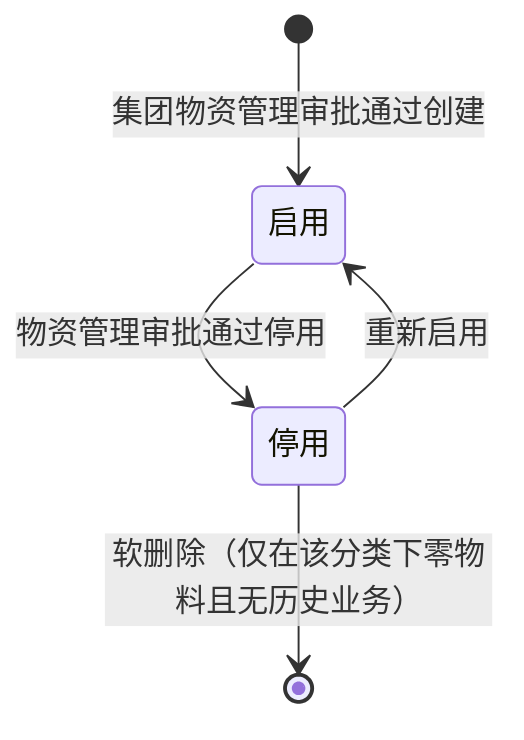
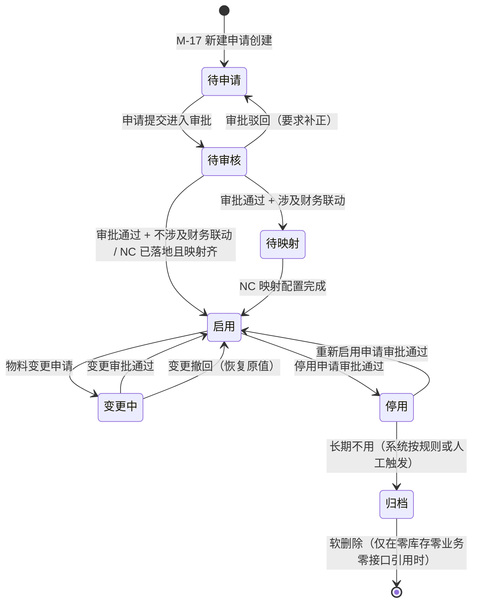
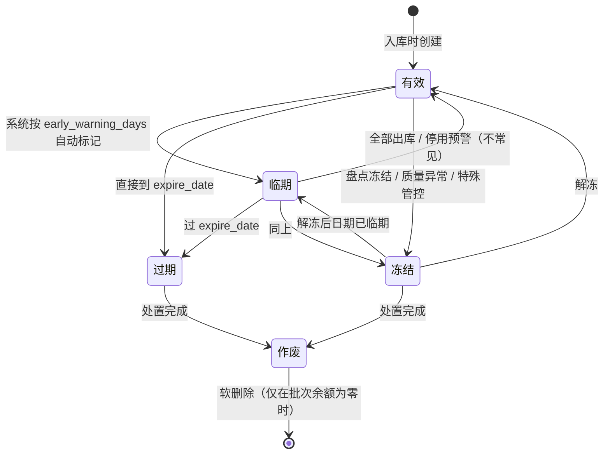
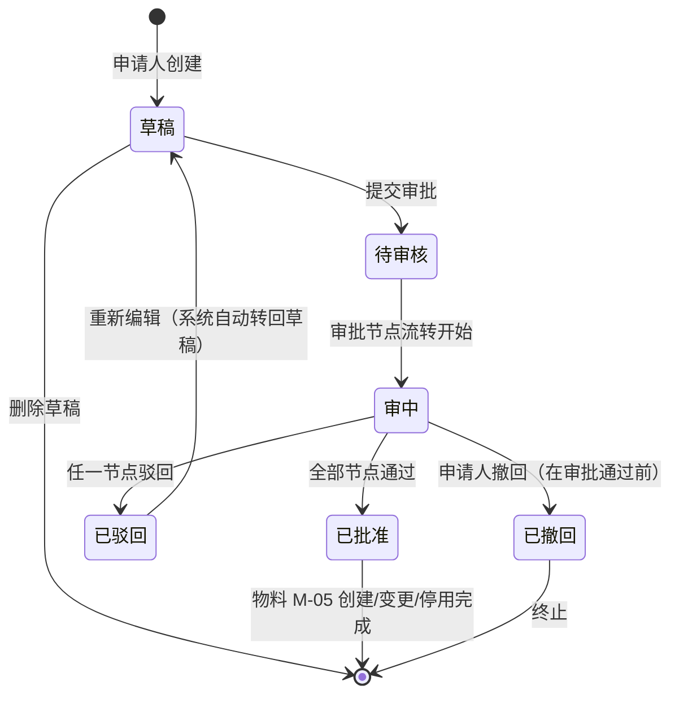
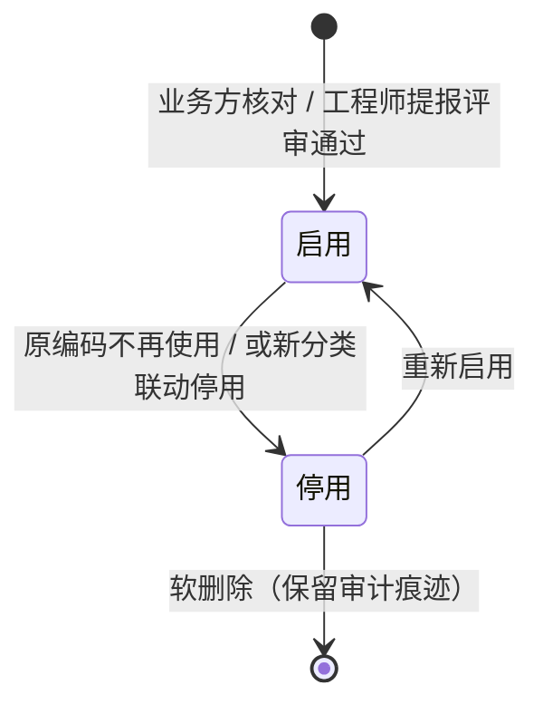
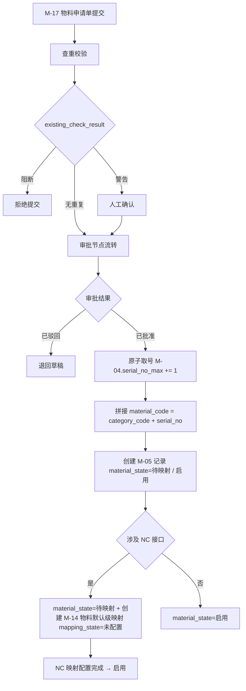
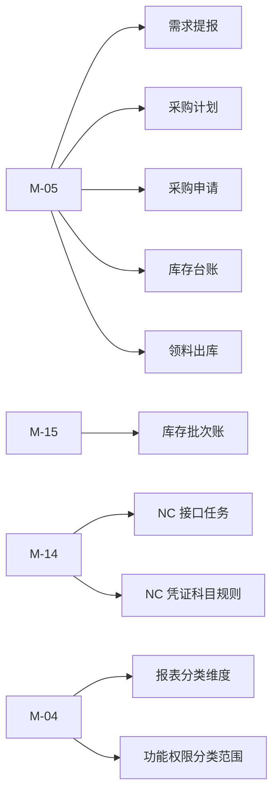

# 物料主数据与编码详细设计（V1.2）

**版本：** V1.2
**日期：** 2026-05-17
**文档性质：** 详细设计层 · 模块详设第三篇
**适用阶段：** 详细设计执行、开发实施、联调测试

> **V1.2 修订要点**（2026-05-17 / Spencer 反馈 / 原系统迁移配套）：
> 1. M-05 加 `legacy_code` 字段（原系统物料编码 / 唯一可空索引 / 双轨追溯）
> 2. **新增 M-18 material_category_legacy_mapping 实体**（原系统分类编码 → 新分类映射 / 支持业务方 N:1 合并归类 / 长期持久化追溯）
> 3. §3.1 / §4.2 / §4.7（新增）/ §8.8（新增）/ §13 同步

---

## 一、文档目的

本文档承接 `01-数据库逻辑模型-V1.0.md` 跨模块骨架与 `02-基础档案与组织仓库详细设计-V1.0.md` 的基础档案底座，把物料主数据模块涉及的 6 个实体（物料分类、物料主数据、物料属性、NC 存货映射、物料批次、物料申请单）的全字段、状态机、编码规则、业务规则、接口规范、配置项和占位项固化下来。

本文档重点回答：

- 物料分类树形结构、物料编码 `XX-XX-XXXXXX` 的生成与控制
- 物料主数据的全生命周期（待申请 → 待审核 → 待映射 → 启用 → 变更中 → 停用 → 归档）
- 一物多单位、批次管理、保质期管理的字段约束与触发规则
- NC 存货映射的查找优先级、缺失拦截、NC 未落地过渡口径
- 物料申请单 M-17 作为新建/变更/停用承载单据的审批流字段
- 集团统一编码扩展预留（不影响一期阜矿编码主体）

本文档**不**做以下事：

- 不重复 `docs/详细规则/物资编码规范文档.md` 的大类代码定义、分类代码细则；只在节五编码规则中引用
- 不写组织、仓库、计量单位等基础档案实体（属 02 详设）
- 不写供应商、供应商资质、黑名单（属 04 详设）
- 不写采购计划、采购订单、入库单等业务单据（属 04 / 06 详设）
- 不写 NC 凭证科目规则、接口推送报文（属 08 详设）
- 不写 SQL DDL 与页面交互

---

## 二、设计输入

| 输入文档 | 在本文档中的作用 |
| --- | --- |
| `docs/详细设计/01-数据库逻辑模型-V1.0.md` | 实体编号 M-04/M-05/M-06/M-14/M-15/M-17、共用约定、状态值域 |
| `docs/详细设计/02-基础档案与组织仓库详细设计-V1.0.md` | M-04 引用 nc_account_code、M-05 引用 unit_id (M-07) / category_id 的上位口径 |
| `docs/概要设计/03-主数据与编码概要设计-v0.1.md` 节六、节七、节 8.1 / 8.2 / 8.7、节九、节十、节十一 | 编码结构与原则、物料生命周期、NC 映射策略、辽宁能源扩展预留、初始化治理 |
| `docs/详细规则/物资编码规范文档.md` V1.8 | 大类代码（14+1 类）、分类代码细则、批次规则、条码规范、辽宁能源扩展数据结构 |
| `docs/需求梳理/14-NC映射与科目配置模板-V1.0.md` | NC 存货映射模板字段、状态字典、开关控制、NC 落地后补齐事项 |
| `docs/需求梳理/04-待确认事项清单.md` 第 11/12/29/35/37 项 | 历史物料清洗、PS 排水材料独立大类、物料属性字段扩展、辽宁能源扩展、HG/HX 保质期 |
| `docs/需求梳理/16-业务确认轮统一收集表-V1.0.md` | 第 3 项 NC 映射模板、第 6 项 NC 核算组织正式映射的项目内口径 |

---

## 三、模块范围

### 3.1 本篇覆盖实体

| 实体编号 | 英文名 | 中文名 | 本篇覆盖深度 |
| --- | --- | --- | --- |
| M-04 | material_category | 物料分类 | 全字段、树形结构、停用约束、与 NC 科目映射、属性模板 |
| M-05 | material | 物料主数据 | 全字段、生命周期 7 状态机、编码生成、一物多单位、查重、**V1.2 加 legacy_code 双轨字段** |
| M-06 | material_attribute | 物料属性 | 全字段、属性类型字典、必填规则、附件挂接 |
| M-14 | material_nc_mapping | 物料 NC 存货映射 | 全字段、查找优先级、缺失拦截、NC 未落地过渡 |
| M-15 | material_batch | 物料批次 | 全字段、HG/HX 必维护、FIFO 优先级、过期与冻结 |
| M-17 | material_request | 物料申请单 | 全字段、新建/变更/停用/启用四种类型、审批流挂接 |
| **M-18** | **material_category_legacy_mapping** | **物料分类历史映射** | **全字段、原→新分类映射、N:1 合并 / 1:N 拆分、迁移期持久化、长期追溯（V1.2 新增）** |

### 3.2 不在本篇覆盖

| 实体 | 承接位置 |
| --- | --- |
| M-01 / M-02 / M-03 / M-07 / M-08 / M-12 / M-13 / M-16 / SY-01 | 02 基础档案详设 |
| M-09 / M-10 / M-11 供应商相关 | 04 需求计划与采购协同详设 |
| F-12 NC 凭证科目规则、F-13 接口开关 | 08 财务与 NC 接口详设 |
| 采购计划、采购订单、入库、出库等业务单据 | 04 / 06 详设 |
| 物资编码规范的大类/分类完整清单 | `docs/详细规则/物资编码规范文档.md` V1.8 |

### 3.3 共用约定继承

本篇所有实体表默认遵守 `01-V1.0` 节四的共用约定（主键策略、审计字段、软删除、业务状态字段、NC 接口字段、工作流字段、时间戳字段、多租户字段、附件字段、主表/明细表原则）。下文字段表中**不重复列出**共用字段，只列实体专有字段；如某实体对共用约定有偏差（例如 M-04 不需要工作流字段），在该实体的"特别说明"中显式注明。

---

## 四、数据模型

### 4.1 M-04 material_category 物料分类

#### 4.1.1 全字段表

| 字段名 | 类型 | 长度/精度 | 空值 | 默认值 | 唯一 | 外键 | 索引建议 | 注释 |
| --- | --- | --- | --- | --- | --- | --- | --- | --- |
| `category_id` | bigint | — | NOT NULL | auto | PK | — | PK | 技术主键 |
| `parent_id` | bigint | — | NULL | NULL | — | FK→M-04 | idx | 树形自引用；大类 parent_id 为 NULL |
| `category_code` | varchar | 8 | NOT NULL | — | UQ | — | UQ | 大类 2 位 + 分类 2 位；如 `ZH01`、`ZH` |
| `category_name` | varchar | 128 | NOT NULL | — | — | — | idx | 分类名称 |
| `category_short_name` | varchar | 64 | NULL | — | — | — | — | 简称 |
| `category_level` | smallint | — | NOT NULL | — | — | — | idx | 1=大类（2 位代码）；2=分类（4 位代码） |
| `category_path` | varchar | 64 | NOT NULL | — | — | — | idx | 树路径，如 `/ZH/ZH01/` |
| `default_unit_id` | bigint | — | NULL | — | — | FK→M-07 | — | 该分类默认主单位（新建物料带出） |
| `nc_default_account_code` | varchar | 32 | NULL | — | — | — | idx | NC 默认科目（NC 未落地阶段为空） |
| `nc_default_inv_class` | varchar | 32 | NULL | — | — | — | — | NC 默认存货大类（NC 未落地阶段为空） |
| `has_batch` | boolean | — | NOT NULL | false | — | — | idx | 该分类物料是否需批次管理（HG/HX 默认 true） |
| `has_expiry` | boolean | — | NOT NULL | false | — | — | — | 是否有保质期 |
| `has_barcode` | boolean | — | NOT NULL | false | — | — | — | 是否需条码标识 |
| `is_dangerous` | boolean | — | NOT NULL | false | — | — | idx | 是否危险品 |
| `is_explosive` | boolean | — | NOT NULL | false | — | — | idx | 是否火工品（HG 大类默认 true） |
| `is_chemical` | boolean | — | NOT NULL | false | — | — | idx | 是否化学品（HX 大类默认 true） |
| `is_safety_special` | boolean | — | NOT NULL | false | — | — | idx | 是否安全专项物资 |
| `attribute_template_id` | bigint | — | NULL | — | — | — | — | 属性模板（可选；标识该分类的标准属性集） |
| `serial_no_max` | integer | — | NOT NULL | 0 | — | — | — | 该分类下当前最大流水号；用于编码生成 |
| `status` | varchar | 16 | NOT NULL | `启用` | — | — | idx | 启用 / 停用 |
| `effective_date` | date | — | NOT NULL | CURRENT_DATE | — | — | — | 启用日期 |
| `expire_date` | date | — | NULL | — | — | — | — | 停用日期 |
| `remarks` | varchar | 255 | NULL | — | — | — | — | 备注 |

**特别说明**：

- 大类（category_level=1）的 `category_code` 为 2 位字母（如 `ZH`、`HG`、`HX`、`PS`）；分类（category_level=2）的 `category_code` 为 4 位（大类 + 2 位数字，如 `ZH01`）
- `category_path` 在 parent_id 变化时由服务层重新计算
- `serial_no_max` 在物料新建编码生成时被原子递增（行级锁），确保 6 位流水号连续
- 大类列表与一期取值清单详见 `docs/详细规则/物资编码规范文档.md` V1.8 节三、节四，本篇不复述

#### 4.1.2 状态机



状态迁移约束：

- 启用 → 停用：分类下不允许有 `material_state IN ('待申请','待审核','启用','变更中')` 的物料；存在历史物料（停用/归档）允许停用分类（仅用于查询）
- 停用状态下：不允许通过 M-17 物料申请单创建该分类的新物料；已停用物料的查询、报表、历史业务仍可看到

#### 4.1.3 业务规则

1. **大类扩展**：新增大类必须由集团物资管理归口审批；2 位代码不得与既有冲突；同时确认是否涉及批次/保质期/条码/危险品/NC 科目等属性模板
2. **分类合并/拆分**：已发生历史业务的分类不得随意合并、拆分或重编码；如确需调整，必须形成专项评审记录并保留旧分类作为查询维度
3. **属性继承**：物料新建时，从所属分类继承 `default_unit_id`、`has_batch`、`has_expiry`、`has_barcode`、`is_dangerous` 等默认值，物料级别允许覆盖
4. **PS 排水材料处理**：按 04 待确认事项清单第 12 项口径——保留 PS 独立大类能力，用量不足时可暂归 BP-99；具体启用时点由物资管理决定

---

### 4.2 M-05 material 物料主数据

#### 4.2.1 全字段表

| 字段名 | 类型 | 长度/精度 | 空值 | 默认值 | 唯一 | 外键 | 索引建议 | 注释 |
| --- | --- | --- | --- | --- | --- | --- | --- | --- |
| `material_id` | bigint | — | NOT NULL | auto | PK | — | PK | 技术主键 |
| `material_code` | varchar | 16 | NOT NULL | — | UQ | — | UQ | 存储无分隔符 `XXXXXXXXXX`（如 `ZH01000001`），展示格式 `XX-XX-XXXXXX`；编码生效后不可修改 |
| `material_name` | varchar | 128 | NOT NULL | — | — | — | idx | 物料名称 |
| `material_short_name` | varchar | 64 | NULL | — | — | — | — | 简称 |
| `specification` | varchar | 255 | NULL | — | — | — | idx | 规格型号（如 `Φ20×2200`） |
| `model_no` | varchar | 64 | NULL | — | — | — | idx | 型号（设备类） |
| `manufacturer` | varchar | 128 | NULL | — | — | — | — | 制造商 |
| `brand` | varchar | 64 | NULL | — | — | — | — | 品牌 |
| `material_type` | varchar | 32 | NOT NULL | `一般物料` | — | — | idx | 取值：一般物料 / 火工品 / 化学品 / 设备 / 低值易耗 / 设备备件 / 安全专项 |
| `category_id` | bigint | — | NOT NULL | — | — | FK→M-04 | idx | 所属分类 |
| `main_unit_id` | bigint | — | NOT NULL | — | — | FK→M-07 | idx | 主单位（库存计量基础） |
| `purchase_unit_id` | bigint | — | NOT NULL | — | — | FK→M-07 | idx | 采购单位 |
| `inventory_unit_id` | bigint | — | NOT NULL | — | — | FK→M-07 | idx | 库存单位（通常 = 主单位） |
| `issuance_unit_id` | bigint | — | NOT NULL | — | — | FK→M-07 | idx | 领用单位 |
| `has_batch` | boolean | — | NOT NULL | false | — | — | idx | 是否批次管理（HG/HX 必为 true） |
| `has_expiry` | boolean | — | NOT NULL | false | — | — | — | 是否有保质期 |
| `has_barcode` | boolean | — | NOT NULL | false | — | — | — | 是否启用条码 |
| `shelf_life_days` | integer | — | NULL | — | — | — | — | 保质期天数（has_expiry=true 时必填） |
| `early_warning_days` | integer | — | NULL | 30 | — | — | — | 临期预警提前天数 |
| `storage_temperature_min` | decimal | (5,1) | NULL | — | — | — | — | 最低存储温度（℃） |
| `storage_temperature_max` | decimal | (5,1) | NULL | — | — | — | — | 最高存储温度（℃） |
| `safety_stock` | decimal | (18,3) | NULL | — | — | — | — | 安全库存量（按主单位） |
| `max_stock` | decimal | (18,3) | NULL | — | — | — | — | 最大库存量 |
| `reorder_point` | decimal | (18,3) | NULL | — | — | — | — | 补货点 |
| `standard_price` | decimal | (18,2) | NULL | — | — | — | — | 标准价（参考） |
| `last_purchase_price` | decimal | (18,2) | NULL | — | — | — | — | 最近采购价（系统回写） |
| `last_purchase_date` | date | — | NULL | — | — | — | — | 最近采购日期 |
| `nc_inv_default_code` | varchar | 32 | NULL | — | — | — | idx | NC 存货默认编码（M-14 物料默认级映射的快照） |
| `nc_inv_default_name` | varchar | 64 | NULL | — | — | — | — | NC 存货默认名称 |
| `group_material_code` | varchar | 32 | NULL | — | — | — | idx | 集团统一物料编码（一期预留，不启用） |
| `group_material_name` | varchar | 128 | NULL | — | — | — | — | 集团统一物料名称（预留） |
| `supplier_material_code` | varchar | 64 | NULL | — | — | — | idx | 主供应商物料号；不进入主编码 |
| `recommended_supplier_id` | bigint | — | NULL | — | — | FK→M-09 | — | 推荐供应商 |
| `material_state` | varchar | 16 | NOT NULL | `待申请` | — | — | idx | 见 4.2.2 状态机 |
| `is_safety_special` | boolean | — | NOT NULL | false | — | — | idx | 是否安全专项物资 |
| `is_capitalized` | boolean | — | NOT NULL | false | — | — | — | 是否资本化（按财务统一资本化标准）|
| `is_low_value` | boolean | — | NOT NULL | false | — | — | — | 是否低值易耗品（按统一摊销政策）|
| `is_direct_eligible` | boolean | — | NOT NULL | false | — | — | idx | 是否可直达使用单位（《可直达物资目录》—业务方调研 D3）；为 true 时无需走 WF-DIR-001 例外审批；目录由集团物资管理部维护 |
| `direct_catalog_category` | varchar | 16 | NULL | — | — | — | idx | 直达分类标签：`大型设备直达` / `材料配件直达` / NULL（不直达）；与 `is_direct_eligible` 联动设置 |
| `attachment_count` | integer | — | NOT NULL | 0 | — | — | — | 附件数量（关联 SY-04） |
| `create_request_id` | bigint | — | NULL | — | — | FK→M-17 | idx | 创建该物料的物料申请单 |
| `last_change_request_id` | bigint | — | NULL | — | — | FK→M-17 | — | 最近一次变更申请单 |
| `effective_date` | date | — | NOT NULL | CURRENT_DATE | — | — | — | 启用日期 |
| `archive_date` | date | — | NULL | — | — | — | — | 归档日期 |
| **`legacy_code`** | varchar | 32 | NULL | NULL | UQ⁽⁹⁾ | — | UQ | **原系统物料编码（V1.2 新增 / 仅迁移期写入 / 永久保留追溯）** |

#### 4.2.2 状态机（生命周期 7 状态）



状态迁移约束：

- 待申请 / 待审核：不允许用于任何业务单据
- 待映射：可用于无财务联动的业务（如内部调拨、设备登记），但不允许触发 NC 接口（F-13 interface_switch 拦截）
- 启用：全功能可用
- 变更中：原数据继续生效，新值在审批通过后切换
- 停用：不允许新业务引用；已结业务、库存查询、报表、历史接口任务可见
- 归档：不允许任何新引用；编码不可复用

#### 4.2.3 业务规则

1. **编码不可修改**：material_code 一经分配（即使在待审核状态被驳回再提交），不允许修改；如错误录入，须停用并新建
2. **多单位约束**：main_unit_id 与 inventory_unit_id 默认相同；purchase_unit_id 或 issuance_unit_id 与主单位不同时，必须在 M-08 unit_conversion 中存在有效换算规则
3. **HG / HX 强制约束**：`material_type IN ('火工品','化学品')` 时 `has_batch=true`，且 M-04 所属分类必须 `is_explosive=true` 或 `is_chemical=true`
4. **保质期强制**：`has_expiry=true` 时 `shelf_life_days` 必须 > 0；HG / HX 一般默认 has_expiry=true
5. **价格回写**：每次采购入库审核生效后，由系统更新 `last_purchase_price` 与 `last_purchase_date`；标准价由物资部门人工维护
6. **资本化判定**：依据财务统一资本化标准（04 待确认事项第 17 项）；建议在物料新建审批节点上由财务确认 `is_capitalized` 与 `is_low_value` 互斥
7. **集团编码扩展**：`group_material_code` / `group_material_name` 一期预留字段不启用，待辽宁能源集团统一编码标准发布后由集团物资管理批量回填
8. **可直达物资目录**（业务方调研 D3）：`is_direct_eligible=true` 的物料属于《可直达物资目录》，无需走详设 04 §S-01 业务规则第 5 条 WF-DIR-001 例外审批；目录由集团物资管理部维护（M-04 物料分类层 + M-05 物料层双层标记），变更须经 A-11 高敏感操作审批留痕。`direct_catalog_category` 在 `is_direct_eligible=true` 时必填（取值：大型设备直达 / 材料配件直当），用于详设 06 §7.7.1 直达验收角色分流和详设 08 直达凭证模板分类（D5 业务方待澄清）。
9. **`legacy_code` 双轨追溯（V1.2 新增）**：用于从阜矿现有物资系统迁移数据时记录原系统物料编码。约束：① 全表唯一（NULL 不计 / 多个新建物料可同时 NULL）② 仅迁移期写入，业务期不应通过 UI 修改 ③ `material_code` 永远是业务主用编码（按节五编码规则生成 `XX-XX-XXXXXX`）/ `legacy_code` 仅作历史追溯。业务期查询接口同时支持按 `material_code` 或 `legacy_code` 检索，老台账录入历史编码可查出。详见原系统迁移工作流 [`docs/上线/原系统迁移方案-V0.1.md`](../上线/原系统迁移方案-V0.1.md) §六 双轨编码方案。

#### 4.2.4 字段查重规则

物料申请阶段（M-17）触发查重：

| 查重维度 | 强度 | 处理方式 |
| --- | --- | --- |
| `material_code` 完全一致 | 阻断 | 拒绝提交，提示已存在 |
| `material_name + specification + model_no` 完全一致 | 阻断 | 拒绝提交，提示疑似重复（含已停用） |
| `material_name + specification` 文本相似度 ≥ 90% | 警告 | 弹窗确认，要求申请人填差异说明或关联已有物料 |
| `category_id + material_name` 同类同名 | 警告 | 弹窗确认 |
| `supplier_material_code` 与已有重复 | 提示 | 仅提示历史关联，不阻断 |

文本相似度算法由实施方实现（建议 Jaccard / Levenshtein 等），阈值在 SY-02 system_config 中配置。

---

### 4.3 M-06 material_attribute 物料属性

#### 4.3.1 全字段表

| 字段名 | 类型 | 长度/精度 | 空值 | 默认值 | 唯一 | 外键 | 索引建议 | 注释 |
| --- | --- | --- | --- | --- | --- | --- | --- | --- |
| `attr_id` | bigint | — | NOT NULL | auto | PK | — | PK | 技术主键 |
| `material_id` | bigint | — | NOT NULL | — | — | FK→M-05 | idx | 物料 |
| `attr_type` | varchar | 32 | NOT NULL | — | — | — | idx | 属性类型（见 4.3.2 字典） |
| `attr_value` | varchar | 512 | NOT NULL | — | — | — | — | 属性值 |
| `attr_unit` | varchar | 16 | NULL | — | — | — | — | 属性单位（重量/长度等） |
| `is_required` | boolean | — | NOT NULL | false | — | — | — | 是否必填（按分类的属性模板派生） |
| `is_searchable` | boolean | — | NOT NULL | false | — | — | idx | 是否进入搜索索引 |
| `display_order` | smallint | — | NOT NULL | 0 | — | — | — | 显示顺序 |
| `remarks` | varchar | 255 | NULL | — | — | — | — | 备注 |

**唯一约束**：`(material_id, attr_type, attr_value)` 复合唯一（同一物料同一属性类型可有多值，但同值不重复，例如多个适用机型）

#### 4.3.2 属性类型字典

| attr_type | 含义 | 适用物料 | 是否必填 |
| --- | --- | --- | --- |
| `危险等级` | 一级 / 二级 / 三级 / 普通 | HG / HX 必填 | HG / HX 是 |
| `批次属性` | 厂批/采购批/入库批 | has_batch=true | 是 |
| `保质期长度` | 天数 | has_expiry=true | 是 |
| `损耗率` | 百分比 | 油品 / 化学品 / 易损件 | 否 |
| `条码规格` | 38mm×25mm / 50mm×30mm / 二维码 | has_barcode=true | 是 |
| `图号` | 设备图号 | 设备 / 备件 | 否 |
| `产地` | 国家 / 地区 | 进口物资 | 否 |
| `适用机型` | 设备型号清单 | 备件类 | 否 |
| `执行标准` | GB / 行业标准编号 | 钢材 / 通防 / 化工 | 否 |
| `包装规格` | 50 个/箱、18L/桶 | 包装类 | 否 |
| `颜色` | 颜色名 | 劳保 / 标识 | 否 |
| `安规要求` | 防爆等级、IP 等级 | 电气类 | 否 |
| `供应商物料号` | 供应商内部编码 | 多供应商物料 | 否（可多值） |
| `历史代用编码` | 旧系统编码 | 数据迁移 | 否 |

属性类型字典在 SY-03 dictionary_base（dict_code=`MATERIAL_ATTR_TYPE`）中维护，允许扩展，但扩展须通过物资部门审批。

#### 4.3.3 业务规则

1. **属性模板派生**：物料新建时根据所属分类的 `attribute_template_id` 派生必填属性集；申请单 M-17 必须填齐
2. **附件挂接**：物料相关图纸、说明书、合格证等附件挂接到 SY-04 attachment（entity_type=`MATERIAL`，entity_id=material_id），不在 M-06 中单独存储
3. **多值属性**：例如"适用机型"、"供应商物料号"可有多条记录；查询时按 attr_type 聚合
4. **变更留痕**：属性变更走 M-17 物料申请单（变更类型）；通过审批后批量更新 M-06，旧值在 A-13 operation_log 中留痕

---

### 4.4 M-14 material_nc_mapping 物料 NC 存货映射

#### 4.4.1 全字段表

| 字段名 | 类型 | 长度/精度 | 空值 | 默认值 | 唯一 | 外键 | 索引建议 | 注释 |
| --- | --- | --- | --- | --- | --- | --- | --- | --- |
| `mapping_id` | bigint | — | NOT NULL | auto | PK | — | PK | 技术主键 |
| `material_id` | bigint | — | NOT NULL | — | — | FK→M-05 | idx | 物料 |
| `accounting_org_id` | bigint | — | NULL | — | — | FK→M-01 | idx | 核算组织（NULL 表示物料默认级映射；非 NULL 表示组织级映射） |
| `nc_inv_code` | varchar | 32 | NULL | — | — | — | idx | NC 存货编码（NC 未落地阶段为空） |
| `nc_inv_name` | varchar | 128 | NULL | — | — | — | — | NC 存货名称 |
| `nc_inv_class_code` | varchar | 32 | NULL | — | — | — | — | NC 存货大类编码 |
| `nc_inv_account_code` | varchar | 32 | NULL | — | — | — | idx | NC 存货科目（与 F-12 nc_account_rule 联动） |
| `mapping_state` | varchar | 16 | NOT NULL | `未配置` | — | — | idx | 取值：未配置 / 待确认 / 已配置 / 已停用 |
| `interface_enabled` | varchar | 16 | NOT NULL | `未启用` | — | — | idx | 取值：已启用 / 未启用；未启用时该映射不参与接口推送 |
| `mapping_priority` | varchar | 16 | NOT NULL | — | — | — | idx | 取值：组织级 / 物料默认级；与 accounting_org_id 是否为 NULL 联动 |
| `mapping_source` | varchar | 16 | NOT NULL | `本地维护` | — | — | — | 取值：本地维护 / NC 同步；NC 落地后切换 |
| `effective_date` | date | — | NOT NULL | CURRENT_DATE | — | — | — | 生效日期 |
| `expire_date` | date | — | NULL | — | — | — | — | 失效日期 |
| `last_sync_time` | timestamp | — | NULL | — | — | — | — | NC 同步时间（mapping_source=NC 同步时回写） |
| `change_reason` | varchar | 255 | NULL | — | — | — | — | 变更原因（变更时必填） |
| `change_approver_id` | bigint | — | NULL | — | — | FK→A-01 | — | 变更审批人 |
| `status` | varchar | 16 | NOT NULL | `启用` | — | — | idx | 启用 / 停用 |

**唯一约束**：`(material_id, accounting_org_id, effective_date)` 复合唯一（NULL 视为唯一值，由数据库唯一索引语义保证；如需严格唯一，可增加 `COALESCE(accounting_org_id, 0)` 函数索引）

#### 4.4.2 查找优先级（与概要 03 节 9.2 一致）

接口推送 / 报表统计 / AI Tool 需要 NC 存货编码时，按以下顺序查找：

1. **组织级映射**：`material_id = X AND accounting_org_id = Y AND status = 启用 AND mapping_state = 已配置 AND interface_enabled = 已启用 AND effective_date ≤ TODAY < COALESCE(expire_date, '9999-12-31')`
2. **物料默认级映射**：上一步无结果时，`material_id = X AND accounting_org_id IS NULL AND ...`
3. **拦截**：仍无结果时，写入 F-09 mapping_missing_alert（alert_type=`物料NC映射缺失`），并阻断当前业务的 NC 接口推送（F-08 exception_record 记录）

#### 4.4.3 NC 未落地过渡口径

按 16 收集表第 3 项与第 6 项的项目内口径：

| 阶段 | mapping_state | nc_inv_code | interface_enabled | mapping_source |
| --- | --- | --- | --- | --- |
| **阶段 1：NC 完全未落地** | `未配置` | NULL | `未启用` | `本地维护` |
| **阶段 2：NC 账套就绪、映射规则已锁** | `待确认` | 已写入但未生效 | `未启用` | `本地维护` |
| **阶段 3：NC 联调通过、正式启用** | `已配置` | NC 提供 | `已启用` | `NC 同步` |

切换规则：

- 阶段 1 → 2：财务部门按 14 模板批量录入候选 NC 存货编码，`mapping_state=待确认`
- 阶段 2 → 3：项目领导小组评审通过后，开关切到"已启用"；`mapping_source=NC 同步`，启用后 T+1 全量校验 + 实时事件订阅
- 切换前后业务单据通过 `material_id` 保持稳定关联，不受 nc_inv_code 字符串变化影响

#### 4.4.4 业务规则

1. **物料默认级 vs 组织级**：物料新建时必生成一条 `accounting_org_id IS NULL` 的物料默认级映射（NC 未落地阶段 mapping_state=未配置）；组织级差异在跨组织业务中按需补充
2. **缺失拦截**：F-13 interface_switch 中可配置"映射缺失是否拦截"开关；默认拦截，避免脏数据进入 NC
3. **变更必须留痕**：mapping_state 或 nc_inv_code 变更必须填写 change_reason 与 change_approver_id；旧映射不删除，标 status=停用 + expire_date
4. **物料停用同步**：M-05 物料停用时，所有相关 M-14 记录的 status 自动置为停用，但保留历史以便对账

---

### 4.5 M-15 material_batch 物料批次

#### 4.5.1 全字段表

| 字段名 | 类型 | 长度/精度 | 空值 | 默认值 | 唯一 | 外键 | 索引建议 | 注释 |
| --- | --- | --- | --- | --- | --- | --- | --- | --- |
| `batch_id` | bigint | — | NOT NULL | auto | PK | — | PK | 技术主键 |
| `material_id` | bigint | — | NOT NULL | — | — | FK→M-05 | idx | 物料 |
| `batch_no` | varchar | 64 | NOT NULL | — | — | — | idx | 批次号 |
| `factory_batch_no` | varchar | 64 | NULL | — | — | — | — | 厂批号（厂家原始批次） |
| `produce_date` | date | — | NULL | — | — | — | idx | 生产日期 |
| `expire_date` | date | — | NULL | — | — | — | idx | 失效日期（has_expiry=true 时必填） |
| `supplier_id` | bigint | — | NULL | — | — | FK→M-09 | idx | 来源供应商 |
| `source_receipt_id` | bigint | — | NULL | — | — | FK→S-05 | idx | 来源入库单（首次入库时回填） |
| `first_receipt_date` | date | — | NULL | — | — | — | idx | 首次入库日期 |
| `fifo_priority` | bigint | — | NOT NULL | — | — | — | idx | FIFO 优先级；按 produce_date 计算（早 = 数小） |
| `unit_cost` | decimal | (18,4) | NULL | — | — | — | — | 批次入库单价（用于 FIFO 出库成本） |
| `quality_certificate_no` | varchar | 64 | NULL | — | — | — | — | 合格证编号 |
| `batch_state` | varchar | 16 | NOT NULL | `有效` | — | — | idx | 取值：有效 / 临期 / 过期 / 冻结 / 作废 |
| `freeze_reason` | varchar | 128 | NULL | — | — | — | — | 冻结原因（盘点/质量异常/特殊管控） |
| `freeze_at` | timestamp | — | NULL | — | — | — | — | 冻结时间 |
| `freeze_by` | bigint | — | NULL | — | — | FK→A-01 | — | 冻结操作人 |
| `remarks` | varchar | 255 | NULL | — | — | — | — | 备注 |

**唯一约束**：`(material_id, batch_no)` 复合唯一

#### 4.5.2 状态机



状态迁移约束：

- 有效 → 临期：每日凌晨任务扫描，`expire_date - TODAY ≤ M-05.early_warning_days` 自动迁移
- 有效/临期 → 过期：每日凌晨任务扫描，`expire_date < TODAY`
- 冻结：手工触发，必须填 freeze_reason；冻结期间不允许出库（S-09/S-12 拦截）
- 作废：批次彻底退出业务，不能再扫码出库；通常先做废旧处置（S-19/S-20）

#### 4.5.3 业务规则

1. **批次创建**：S-05 采购入库审核生效时由系统自动创建 M-15 记录；手工新建批次仅限期初导入或特殊场景
2. **FIFO 优先级**：出库时按 `fifo_priority ASC, batch_id ASC` 排序选择批次；同物料同仓库存在多批次时严格 FIFO
3. **HG / HX 强制**：`M-05.material_type IN ('火工品','化学品')` 的物料每次入库必须维护批次号，不允许 batch_no 留空
4. **临期预警**：R-04 alert_rule 中 rule_code=`MATERIAL_BATCH_EXPIRY_NEAR` 监控批次状态进入临期；R-08 alert_notification 推送给仓管 / 物资部门 / 使用单位
5. **跨仓批次唯一性**：批次号在物料维度全局唯一，不区分仓库；同批次在不同仓库的余额由 S-14 inventory_batch 关联

---

### 4.6 M-17 material_request 物料申请单

#### 4.6.1 全字段表

| 字段名 | 类型 | 长度/精度 | 空值 | 默认值 | 唯一 | 外键 | 索引建议 | 注释 |
| --- | --- | --- | --- | --- | --- | --- | --- | --- |
| `request_id` | bigint | — | NOT NULL | auto | PK | — | PK | 技术主键 |
| `request_no` | varchar | 32 | NOT NULL | — | UQ | — | UQ | 业务单号；前缀 `MR`（SY-01 取号） |
| `request_type` | varchar | 16 | NOT NULL | — | — | — | idx | 取值：新建 / 变更 / 停用 / 启用 / 归档 |
| `applicant_id` | bigint | — | NOT NULL | — | — | FK→A-01 | idx | 申请人 |
| `applicant_org_id` | bigint | — | NOT NULL | — | — | FK→M-01 | idx | 申请人组织 |
| `existing_material_id` | bigint | — | NULL | — | — | FK→M-05 | idx | 变更/停用/启用/归档时关联的物料 |
| `created_material_id` | bigint | — | NULL | — | — | FK→M-05 | idx | 通过审批后创建的物料；新建类型回填 |
| `suggested_material_code` | varchar | 16 | NULL | — | — | — | — | 申请人填的疑似已存在编码（用于查重提示） |
| `material_name` | varchar | 128 | NOT NULL | — | — | — | idx | 物料名称 |
| `material_short_name` | varchar | 64 | NULL | — | — | — | — | 简称 |
| `specification` | varchar | 255 | NULL | — | — | — | — | 规格型号 |
| `model_no` | varchar | 64 | NULL | — | — | — | — | 型号 |
| `category_id` | bigint | — | NOT NULL | — | — | FK→M-04 | idx | 所属分类 |
| `suggested_main_unit_id` | bigint | — | NOT NULL | — | — | FK→M-07 | — | 建议主单位 |
| `suggested_purchase_unit_id` | bigint | — | NULL | — | — | FK→M-07 | — | 建议采购单位 |
| `suggested_inventory_unit_id` | bigint | — | NULL | — | — | FK→M-07 | — | 建议库存单位 |
| `suggested_issuance_unit_id` | bigint | — | NULL | — | — | FK→M-07 | — | 建议领用单位 |
| `has_batch` | boolean | — | NOT NULL | false | — | — | — | 是否批次管理 |
| `has_expiry` | boolean | — | NOT NULL | false | — | — | — | 是否有保质期 |
| `has_barcode` | boolean | — | NOT NULL | false | — | — | — | 是否启用条码 |
| `shelf_life_days` | integer | — | NULL | — | — | — | — | 保质期天数 |
| `request_reason` | varchar | 512 | NOT NULL | — | — | — | — | 申请原因 |
| `change_field_json` | text | — | NULL | — | — | — | — | 变更类型时记录字段差异 JSON（before/after） |
| `attribute_payload_json` | text | — | NULL | — | — | — | — | 属性 JSON（M-06 派生） |
| `nc_mapping_payload_json` | text | — | NULL | — | — | — | — | 建议 NC 映射 JSON |
| `existing_check_result` | varchar | 32 | NOT NULL | `未查重` | — | — | — | 取值：未查重 / 无重复 / 警告 / 阻断 |
| `existing_check_summary` | text | — | NULL | — | — | — | — | 查重结果摘要（疑似物料清单） |
| `request_state` | varchar | 16 | NOT NULL | `草稿` | — | — | idx | 取值：草稿 / 待审核 / 审中 / 已批准 / 已驳回 / 已撤回 |
| `workflow_instance_id` | bigint | — | NULL | — | — | FK→A-20 | idx | 审批实例 |
| `current_node_id` | bigint | — | NULL | — | — | FK→A-09 | — | 当前审批节点 |
| `approval_chain` | text | — | NULL | — | — | — | — | 审批链路 JSON |
| `approval_deadline` | timestamp | — | NULL | — | — | — | — | 审批截止时间 |
| `escalation_flag` | boolean | — | NOT NULL | false | — | — | — | 是否已升级 |
| `submit_time` | timestamp | — | NULL | — | — | — | idx | 提交时间 |
| `complete_time` | timestamp | — | NULL | — | — | — | — | 完成时间 |

**特别说明**：

- 变更类型时 `change_field_json` 记录字段差异（before/after），便于审批者快速看变化点
- 新建类型审批通过后，系统创建 M-05 记录并回填 `created_material_id`；同时按 `attribute_payload_json` 创建 M-06 属性、按 `nc_mapping_payload_json` 创建 M-14 物料默认级映射

#### 4.6.2 状态机



#### 4.6.3 审批流挂接

- M-17 引用 A-20 approval_instance（详 `01-V1.0` 节 12.8 A-10 挂接位置规则）
- 审批节点由 A-08 approval_workflow（business_type=`MATERIAL_REQUEST`）按 request_type 路由：
  - `新建`：物资专员 → 财务（涉及 NC）/ 安全（涉及 HG/HX）会签 → 物资管理审批
  - `变更`：分非关键变更（备注/图片/技术说明/供应商物料号——仅物资专员审批）和关键变更（名称/规格/分类/单位/NC 映射/危险品属性——同新建路径）
  - `停用 / 启用`：物资专员 → 物资管理（启用需校验是否有未结业务依赖）
  - `归档`：物资管理直接审批（停用满 N 天且零业务依赖）
- 审批意见记录到 A-10 approval_opinion，`instance_id (FK→A-20)` 为权威主键

#### 4.6.4 业务规则

1. **查重前置**：草稿 → 待审核切换前必须执行查重，`existing_check_result` 必须不为 `未查重`；若 `阻断` 则不允许提交
2. **撤回限制**：仅限申请人本人 + request_state IN ('待审核','审中') + 当前节点尚未审批通过
3. **驳回再编辑**：driver-back 后系统自动复制申请数据为新草稿，原 M-17 记录保留作为历史
4. **关联限制**：`request_type=新建` 时 existing_material_id 必须 NULL；`request_type IN ('变更','停用','启用','归档')` 时 existing_material_id 必须非 NULL
5. **超期升级**：approval_deadline 到达后未完成的，触发 escalation_flag=true 并按 A-08 中升级路径推送上一级审批人

---

### 4.7 M-18 material_category_legacy_mapping 物料分类历史映射（V1.2 新增）

#### 4.7.1 用途与定位

为支持 SupplyCore 上线时从阜矿现有物资系统迁移物料数据，需要持久化"原系统分类编码 → 新分类（M-04）"的映射关系。映射不是一次性消费品（不能仅靠 Excel JOIN），必须长期保留以支持：

- 迁移期 02 物料 SQL 抽数时 `original_category_code → new_category_id` 转换
- 业务方调整后的历史报表查询（"原 `01.05.MK` 现在归到哪个新分类？"）
- 财务对账历史科目映射（NC 凭证回查时按原编码追溯）
- 集团审计 / 业务方知识传承

为什么不在 M-04 加 `legacy_code` 单字段：业务方借迁移做规范化时存在 **N:1 合并归类**（主流场景，如旧系统的"电力电缆 / 控制电缆 / 通讯电缆"三类合并到新 `JD-01 电缆`），单字段无法表达多原编码 → 同一新分类的关系。

#### 4.7.2 全字段表

| 字段名 | 类型 | 长度/精度 | 空值 | 默认值 | 唯一 | 外键 | 索引建议 | 注释 |
| --- | --- | --- | --- | --- | --- | --- | --- | --- |
| `mapping_id` | bigint | — | NOT NULL | auto | PK | — | PK | 技术主键 |
| `legacy_category_code` | varchar | 32 | NOT NULL | — | UQ⁽¹⁾ | — | UQ | 原系统分类编码（例 `01.05.MK`）|
| `legacy_category_name` | varchar | 128 | NULL | — | — | — | — | 原系统分类名称（冗余便于核对）|
| `legacy_system_source` | varchar | 32 | NOT NULL | `阜矿物资系统` | — | — | idx | 来源系统标识 / 预留多源支持 |
| `new_category_id` | bigint | — | NOT NULL | — | — | FK→M-04 | idx | 映射目标新分类 |
| `mapping_type` | varchar | 16 | NOT NULL | `1:1` | — | — | idx | 取值：`1:1` / `N:1` / `1:N` |
| `remarks` | varchar | 512 | NULL | — | — | — | — | 业务方备注（为什么合并 / 拆分）|
| `status` | varchar | 16 | NOT NULL | `启用` | — | — | idx | 启用 / 停用 |
| `effective_date` | date | — | NOT NULL | CURRENT_DATE | — | — | — | 启用日期 |
| `expire_date` | date | — | NULL | — | — | — | — | 停用日期 |

**特别说明**：

- ⁽¹⁾ `legacy_category_code` 全表唯一（一期仅支持单一原系统迁移；多源场景升 V1.3 时改为 (`legacy_system_source`, `legacy_category_code`) 联合唯一）
- N:1 关系：多个原编码可以共享同一个 `new_category_id`（业务方合并归类 / 主流场景）
- 1:N 处理：原编码业务被拆分到多个新分类时，记录"主要"目标 `new_category_id`，附加拆分细节由 `remarks` 说明或后续工程师提报建第二层细化映射（避免引入复杂的多对多）
- 不支持物理删除（保留迁移期审计痕迹 / 软删除走 `status=停用`）

#### 4.7.3 状态机



#### 4.7.4 业务规则

1. **唯一性**：每个 `legacy_category_code` 全表唯一
2. **N:1 主流场景**：业务方借迁移做规范化（如旧系统的"电力电缆 / 控制电缆 / 通讯电缆"三类合并到新 `JD-01 电缆` 一类）
3. **1:N 处理**：原编码业务被拆分时记录"主要"目标 + `remarks` 说明（避免多对多）
4. **联动停用**：M-04 分类停用时，所有映射到该分类的 M-18 自动 `status=停用`（由 M-04 状态机后置钩子触发）
5. **维护责任**：物资公司物资管理（迁移阶段 0b 业务方核对输出）+ 工程师 SQL 归类时提报增补
6. **批量导入**：支持从业务方"原→新分类编码映射 Excel"批量导入（迁移期一次性 + 后续增量提报）
7. **不允许物理删除**：仅软删除（status=停用）/ 保留迁移期审计痕迹

#### 4.7.5 查询场景

| 场景 | 查询模式 |
| --- | --- |
| 原 → 新（迁移期常用 / 02 物料 SQL JOIN）| `WHERE legacy_category_code = '01.05.MK' AND status='启用'` |
| 新 → 原（合并溯源 / 财务对账）| `WHERE new_category_id = ? AND status='启用'` GROUP BY |
| 历史追溯 / 审计 | `WHERE legacy_category_code LIKE '01.%' ORDER BY effective_date` |

#### 4.7.6 实施时序

- **实施时机**：02 物料 SQL 抽数前（与 M-05 加 `legacy_code` 字段同期 / 阻塞物料迁移）
- **数据来源**：业务方阶段 0b 输出的"原→新分类编码映射 Excel"批量导入
- **工作量估算**：Domain 实体 + Repository + EF Migration + 批量导入服务 ≈ 1 PD
- **配套迁移文档**：[`docs/上线/原系统迁移方案-V0.1.md`](../上线/原系统迁移方案-V0.1.md) §六.5 / §八-A.8.3

---

## 五、编码规则

### 5.1 编码结构

物料编码遵循 `<大类 2 位字母><分类 2 位数字><流水 6 位数字>`，共 10 位字符（不含分隔符）。文档、页面、标签中可显示为带分隔符的 `XX-XX-XXXXXX`，但数据库 / API / 接口传输的 canonical value **不带分隔符**（即 `XXXXXXXXXX` 共 10 字符），由 UI 渲染时插入分隔符。

| 段位 | 位数 | 含义 | 示例 | 来源 |
| --- | --- | --- | --- | --- |
| 大类代码 | 2 位字母 | 一级分类 | `ZH` 支护材料 | M-04（category_level=1） |
| 分类代码 | 2 位数字 | 二级分类 | `01` 锚杆 | M-04（category_level=2） |
| 流水号 | 6 位数字 | 分类内独立递增 | `000001` | M-04.serial_no_max + SY-01 取号 |

完整示例：`ZH01000001` 显示为 `ZH-01-000001`。

### 5.2 编码生成流程



#### 5.2.1 流水号原子取号

- 在 M-04.serial_no_max 上行级锁（`SELECT ... FOR UPDATE`）
- UPDATE serial_no_max = serial_no_max + 1
- 取得新值作为流水号（左侧补 0 至 6 位）
- 与 SY-01 不同：SY-01 是按"前缀 + 日期"递增（业务单号），M-04.serial_no_max 是按分类全生命周期递增（物料编码）；两者互不交叉

#### 5.2.2 6 位流水号上限

每个分类支持 999,999 个物料；超过则告警并由集团物资管理评估是否新增二级细分（修改 M-04 分类代码定义）或扩展 6 位为 7 位（升级 schema）。一期不预设需要扩展。

### 5.3 大类与分类

一期沿用 `docs/详细规则/物资编码规范文档.md` V1.8 节三、节四定义的 14 个启用大类 + 1 个排水材料（PS，保留），与招标附件六 v1.1 完全一致。

| 大类代码 | 中文名 | 备注 |
| --- | --- | --- |
| HG | 火工品 | is_explosive=true，强制批次 |
| ZH | 支护材料 | — |
| SB | 设备整机 | 整机设备入库（与是否资本化无关） |
| BP | 备品备件 | — |
| JD | 机电材料 | — |
| YZ | 油脂燃料 | — |
| GC | 钢材 | — |
| JZ | 建筑材料 | — |
| TF | 通防材料 | — |
| HX | 化工材料 | is_chemical=true，强制批次 |
| GJ | 工器具 | 低值易耗工器具 |
| LB | 劳保用品 | — |
| BZ | 包装材料 | — |
| BG | 办公用品 | — |
| PS | 排水材料 | 04 待确认事项第 12 项口径，按用量启用 |

具体二级分类清单详见物资编码规范文档；本篇不复述，避免双向漂移。

### 5.4 集团统一编码扩展预留

一期阜矿物料编码作为业务主编码，集团统一编码以预留字段方式存储：

- `M-05.group_material_code`、`M-05.group_material_name`：一期不启用，待集团编码标准发布后由集团物资管理批量回填
- 不要求一期重新梳理或重编现有阜矿编码
- 后续支持映射、换算或补充规则处理粒度差异
- 详见 `docs/详细规则/物资编码规范文档.md` V1.8 节十四 "与辽宁能源集团编码扩展预留"

---

## 六、ERD

### 6.1 物料主数据域 ERD

```mermaid
erDiagram
    M-04 material_category ||--o{ M-04 material_category : "parent_id 自引用"
    M-04 material_category ||--o{ M-05 material : "category_id"
    M-07 unit ||--o{ M-05 material : "main / purchase / inventory / issuance unit"
    M-05 material ||--o{ M-06 material_attribute : "属性"
    M-05 material ||--o{ M-14 material_nc_mapping : "NC 映射（物料默认 + 组织级）"
    M-01 organization ||--o{ M-14 material_nc_mapping : "accounting_org_id"
    M-05 material ||--o{ M-15 material_batch : "批次"
    M-09 supplier ||--o{ M-15 material_batch : "来源供应商"
    M-17 material_request ||--o| M-05 material : "created_material_id / existing_material_id"
    M-04 material_category ||--o{ M-17 material_request : "category_id"
    A-20 approval_instance ||--o| M-17 material_request : "审批实例"
    SY-04 attachment }o--|| M-05 material : "entity_type=MATERIAL"
```

### 6.2 与外部模块的关系



---

## 七、状态机汇总

| 实体 | 状态字段 | 状态值域 | 关键迁移条件 |
| --- | --- | --- | --- |
| M-04 material_category | status | 启用 / 停用 | 停用前校验该分类下无活跃物料（待申请/待审核/启用/变更中） |
| M-05 material | material_state | 待申请 / 待审核 / 待映射 / 启用 / 变更中 / 停用 / 归档 | 见 4.2.2，跨 7 个状态、多条迁移路径，由 M-17 申请单驱动 |
| M-06 material_attribute | — | （无独立业务状态，跟随 M-05） | — |
| M-14 material_nc_mapping | mapping_state | 未配置 / 待确认 / 已配置 / 已停用 | NC 三阶段切换；与 interface_enabled 配合控制接口推送 |
| M-14 material_nc_mapping | interface_enabled | 已启用 / 未启用 | 仅 mapping_state=已配置 时允许已启用 |
| M-15 material_batch | batch_state | 有效 / 临期 / 过期 / 冻结 / 作废 | 每日凌晨任务驱动；冻结手工触发 |
| M-17 material_request | request_state | 草稿 / 待审核 / 审中 / 已批准 / 已驳回 / 已撤回 | 申请人提交、审批节点流转、超期升级 |

---

## 八、业务规则汇总

### 8.1 编码规则

- material_code 一经分配不可修改；错误录入须停用并新建
- 6 位流水号按分类全生命周期递增；不允许跳号；不允许复用（包括停用/归档物料的编码）
- 大类/分类代码扩展由集团物资管理审批

### 8.2 生命周期规则

- 物料新建必须经 M-17 申请单 + 审批流；不允许直接 INSERT M-05
- 涉及财务联动的物料在审批通过后进入"待映射"，必须完成 NC 映射才能切到"启用"
- 启用 → 停用前不强制零库存（停用仅阻止新业务，历史业务可见）
- 停用 → 归档前必须满足：零库存 + 零未结业务 + 软删除前零接口任务依赖

### 8.3 一物多单位规则

- main_unit_id 决定库存计量基础
- 采购/库存/领用单位与主单位不一致时，必须在 M-08 中存在有效换算规则
- 单位换算结果按 M-08.rounding_method 与 result_precision 处理
- 详见 02 详设节 4.5

### 8.4 批次管理规则

- HG / HX 必须批次管理（has_batch=true）
- 入库时 M-15 由系统自动创建；S-14 关联仓库余额
- 出库按 fifo_priority 严格 FIFO；冻结批次不参与出库
- 临期/过期由每日凌晨任务驱动

### 8.5 NC 映射规则

- 物料新建必生成物料默认级映射（accounting_org_id IS NULL）
- 组织级映射按需补充
- 查找按"组织级 → 物料默认级 → 拦截"三级
- NC 未落地阶段三阶段切换详 4.4.3

### 8.6 查重规则

- 申请单提交前必须查重
- 阻断 / 警告 / 提示三级（详 4.2.4）
- 文本相似度阈值由 SY-02 system_config 配置

### 8.8 历史映射规则（V1.2 新增 / 配套原系统迁移）

- M-05 `legacy_code` 字段全表唯一（NULL 不计 / 仅迁移期写入 / 业务期只读）
- M-18 物料分类历史映射 `legacy_category_code` 全表唯一（一期单源 / 多源升 V1.3 改联合唯一）
- N:1 合并归类是主流场景（业务方借迁移做规范化）
- 1:N 拆分通过"主要"目标 + remarks 记录（避免多对多）
- M-04 分类停用联动 M-18 自动 `status=停用`
- 不支持物理删除（仅软删除 / 保留审计痕迹）
- 维护责任：物资公司物资管理 + 工程师 SQL 归类提报增补
- 详见 [`docs/上线/原系统迁移方案-V0.1.md`](../上线/原系统迁移方案-V0.1.md) §六 + §八-A.8

### 8.7 集团扩展规则

- group_material_code 一期预留不启用
- 不影响阜矿编码主体
- 待集团统一编码标准发布后批量回填

---

## 九、接口规范

### 9.1 内部接口

| 接口 | 用途 | 关键字段 |
| --- | --- | --- |
| 物料编码生成服务 | 取分类原子流水号并拼接编码 | category_id → material_code |
| 物料查重服务 | 申请单提交前查重 | category_id + name + spec + model → 疑似清单 + 相似度 |
| NC 映射查询服务 | 业务运行时取 NC 存货编码 | material_id + accounting_org_id → nc_inv_code |
| 批次 FIFO 查询服务 | 出库时取批次顺序 | material_id + warehouse_id → 批次清单（按 fifo_priority） |
| 物料属性聚合查询 | 报表 / AI / 详情页 | material_id → M-06 多值聚合 |

### 9.2 NC 接口（按 NC 落地阶段启用）

| 接口 | 方向 | 启用时点 | 说明 |
| --- | --- | --- | --- |
| NC 存货档案查询 | NC → 物资 | NC 落地后 | 取 NC 存货编码清单，回填 M-14 候选 |
| NC 存货档案变更事件 | NC → 物资 | NC 落地后 | 实时事件订阅，更新 M-14 |
| 物料映射缺失告警 | 物资 → NC | 全阶段 | 写入 F-09 + 报警通道 |

接口字段细则在 08 详设的 F-14 interface_definition 中按 `interface_code` 登记，本篇不展开。

### 9.3 集团统一编码接口（预留）

集团统一编码发布后启用，建议接口形态：

- `集团 → 物资`：集团物料编码全量同步、增量事件订阅
- `物资 → 集团`：阜矿物料编码全量推送（用于集团端对账）

字段在未来集团编码标准发布后定义，本篇不固化具体字段。

---

## 十、配置项与默认值矩阵

| 配置项 | 配置位置 | 默认值 | 可调范围 | 调整责任方 |
| --- | --- | --- | --- | --- |
| 编码流水号位数 | SY-02 system_config | 6 | 6-7 | 集团物资管理（涉及 schema 升级） |
| 查重相似度阈值（警告） | SY-02 | 0.90 | 0.80-0.95 | 物资部门 |
| 查重相似度阈值（阻断） | SY-02 | 0.99 | 0.95-1.00 | 物资部门 |
| 临期预警提前天数（默认） | SY-02 | 30 | 7-90 | 物资 + 安全 |
| 物料归档后保留期（停用 → 归档触发天数） | SY-02 | 365 | 180-1095 | 物资管理 |
| HG/HX 强制批次开关 | SY-02 | true | true（一期不允许关闭） | 安全 + 物资 |
| 物料申请单审批超期天数 | SY-02 | 5（工作日） | 1-15 | 物资管理 |
| NC 映射缺失是否拦截财务接口 | F-13 interface_switch | true | true / false | 财务 + 网信办（NC 落地后联调时调整） |
| 物料默认级映射可否替代组织级映射 | SY-02 | true（兜底） | true / false | 财务 |

---

## 十一、业务确认占位项

承接 `01-V1.0` 节十一与 02 详设节十的占位策略：

| 占位项 | 影响实体 | 占位文本 | 解锁条件 |
| --- | --- | --- | --- |
| 大类清单与分类细则 | M-04 | `[引用编码规范 V1.8]` | 已固化在编码规范文档；属性模板补齐由后续治理 |
| 历史物料清洗与初始化 | M-05 全量 | `[待业务部门提供 - 参见 04 待确认事项第 11 项]` | 集团物资管理牵头清洗；上线前完成分类覆盖性调研 |
| HG/HX 各品类保质期具体值 | M-05.shelf_life_days | `[待仓储管理员配置 - 参见 04 第 37 项]` | 仓储管理员提供参考值并系统配置 |
| NC 存货编码 | M-14.nc_inv_code | `[待 NC 落地]` | NC 账套就绪 + 联调通过 |
| NC 凭证科目编码 | M-14.nc_inv_account_code | `[待 NC 落地]` | 与 F-12 nc_account_rule 联动 |
| 集团统一物料编码 | M-05.group_material_code | `[待集团统一编码标准发布]` | 辽宁能源集团编码标准正式发布 |
| 物料属性扩展字段（特种设备仪器类） | M-06.attr_type 字典扩展 | `[待业务单位提出 - 参见 04 第 29 项]` | 各业务单位需求集中后由物资部门统一评估 |
| 物料申请单审批节点最终人员 | M-17 → A-08 / A-09 | `[待实施配置阶段]` | 实施配置时由业务部门 + 网信办填具体岗位名单与金额阈值 |

---

## 十二、与其他模块协同

### 12.1 02 基础档案与组织仓库

- M-04.default_unit_id、M-05.main_unit_id 等引用 M-07 unit
- M-08 unit_conversion 在物料新建时根据建议的多单位创建对应换算规则

### 12.2 04 需求计划与采购协同

- P-01 需求提报、P-02 采购计划、S-01 采购申请、S-02 采购订单引用 M-05.material_id
- 申请单 P-01 提报阶段不允许 material_state IN ('待申请','待审核')

### 12.3 06 库存实物流转

- S-13 库存台账按 (org_id, warehouse_id, material_id) 维度
- S-14 库存批次账关联 M-15.batch_id
- S-09 领料出库按 FIFO 取 M-15.fifo_priority
- HG/HX 出库强制扫码批次

### 12.4 07 设备与设备租赁

- E-01 equipment 来源 source_type=`采购入库` 时关联 M-05（设备类物料）
- 设备物料的 material_type=`设备`

### 12.5 08 财务与 NC 接口

- M-14.nc_inv_code、nc_inv_account_code 是 F-01 interface_task 推送 NC 时的关键字段
- M-14 与 F-12 nc_account_rule 配合决定凭证生成
- F-13 interface_switch 控制 NC 映射缺失是否拦截

### 12.6 09 报表预警与 AI

- 物料分类是报表的主要分组维度
- 临期预警 R-04 alert_rule 监控 M-15 状态
- AI Tool 物料查询按 M-04 / M-05 / M-06 / M-15 维度

### 12.7 10 权限审批流

- 物料申请单 M-17 引用 A-08 approval_workflow（business_type=`MATERIAL_REQUEST`）
- A-04 function_permission 数据维度可按 M-04.category_id 限制（如安全员只看 HG/HX 分类）

---

## 十三、版本与维护

| 版本 | 日期 | 主要变化 |
| --- | --- | --- |
| V0.1 | 2026-05-01 | 详设第三篇首版：M-04 / M-05 / M-06 / M-14 / M-15 / M-17 共 6 张表的全字段；物料生命周期 7 状态机；编码生成流程（含 mermaid）；查重三级（阻断/警告/提示）；NC 映射查找优先级与三阶段过渡；HG/HX 强制批次；批次状态机（有效/临期/过期/冻结/作废）；M-17 申请单审批挂接 A-20；与 02/04/06/07/08/09/10 协同边界 |
| V0.2 | 2026-05-02 | 按 01-v0.7 上位状态口径修正引用：M-15 `batch_state` 与 M-17 专有 `request_state` 已回写到 01 状态值域；同步引用 02-v0.3 基础档案底座。 |
| V1.0 | 2026-05-02 | 详设阶段交叉评审通过（2026-05-02），全部 11 篇分卷无未解决问题，升至 V1.0 正式版 |
| V1.1 | 2026-05-04 | 与招标附件六 v1.1 + 编码规范 V1.8 对齐：节 5.3 大类清单 12 + PS 扩展为 14 + PS（启用大类新增 SB 设备整机、GJ 工器具）；引用文档版本号同步升级 |
| V1.1a | 2026-05-10 | 第四批补强 — 调研差异清单 E 类 (D3)：M-05 加 `is_direct_eligible` 是否可直达字段 + `direct_catalog_category` 直达分类标签（大型设备直达 / 材料配件直达），由集团物资管理部维护《可直达物资目录》；§4.2.3 业务规则补第 8 条联动详设 04 §S-01 WF-DIR-001 例外审批 + 详设 06 §7.7.1 直达验收角色分流。 |
| **V1.2** | **2026-05-17** | **原系统迁移配套（Spencer 反馈 / 配套上线层 [`原系统迁移方案-V0.1.md`](../上线/原系统迁移方案-V0.1.md)）**：① M-05 加 `legacy_code` 字段（原系统物料编码 / 唯一可空 / 仅迁移期写入 / 业务期只读 / 双轨追溯）+ §4.2.3 业务规则补第 9 条 ② **新增 M-18 material_category_legacy_mapping 实体**（原→新分类映射 / N:1 合并主流 / 1:N 拆分备注 / 长期持久化 / §4.7）③ §3.1 + §8.8 + §13 同步 |

后续维护规则：

- 新增物料相关实体须同步更新 01-v0.x 实体清单
- 编码规则、大类/分类清单变更须先回写编码规范文档，再回写本篇节五
- 物料状态值域扩展统一在 01 节八汇编追加
- M-17 审批路径调整须与 10 详设保持一致

---

## 十四、一句话结论

本篇把物料主数据从 `01` 骨架向下细化到字段级、约束级和规则级，固化了"编码不可改 / 一物多单位 / HG-HX 强制批次 / NC 映射三阶段过渡 / M-17 申请单驱动全生命周期"五条主线。集团统一编码、NC 存货编码、特种设备物料属性、HG-HX 保质期具体值等待业务/外部条件成熟的项已在节十一中显式占位，避免详设阶段被外部依赖卡死。
