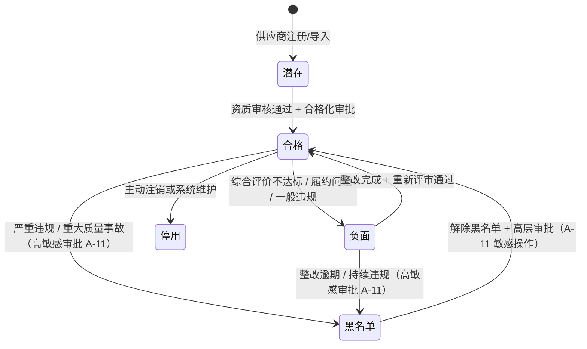
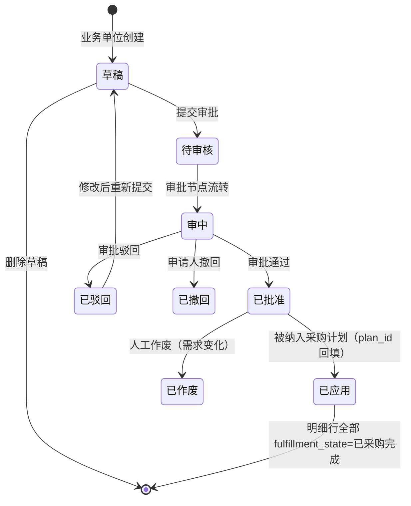
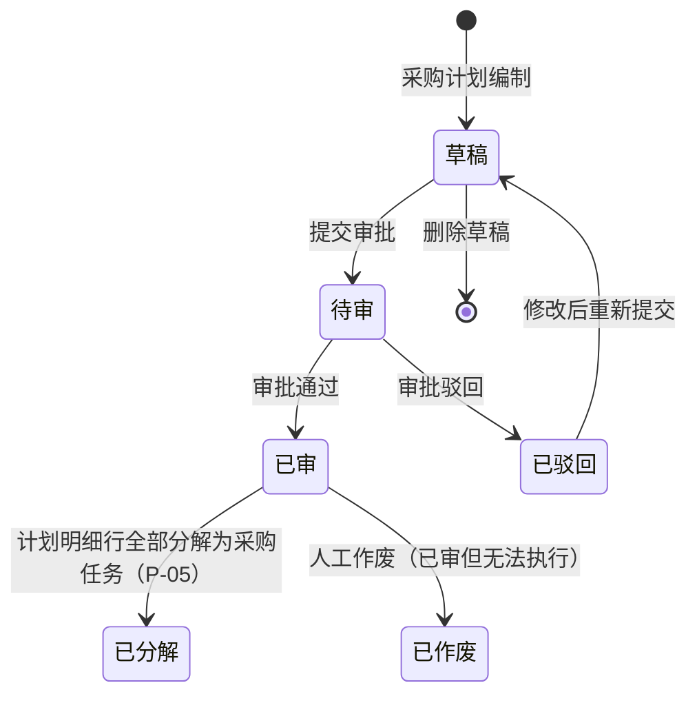
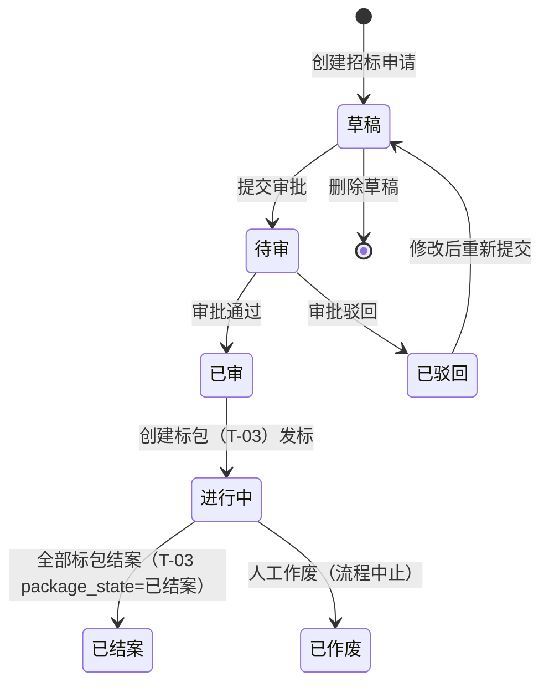
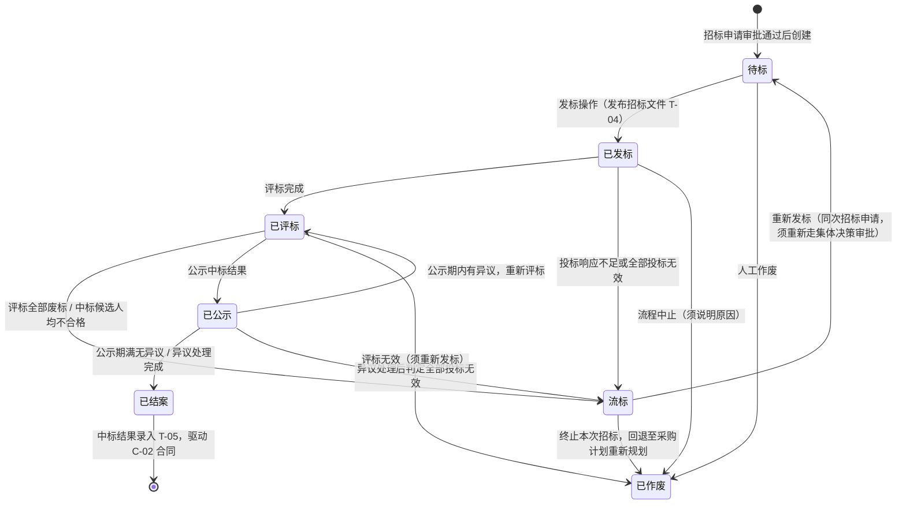
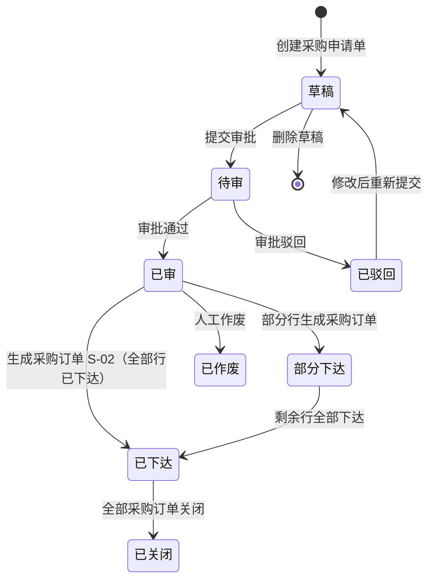
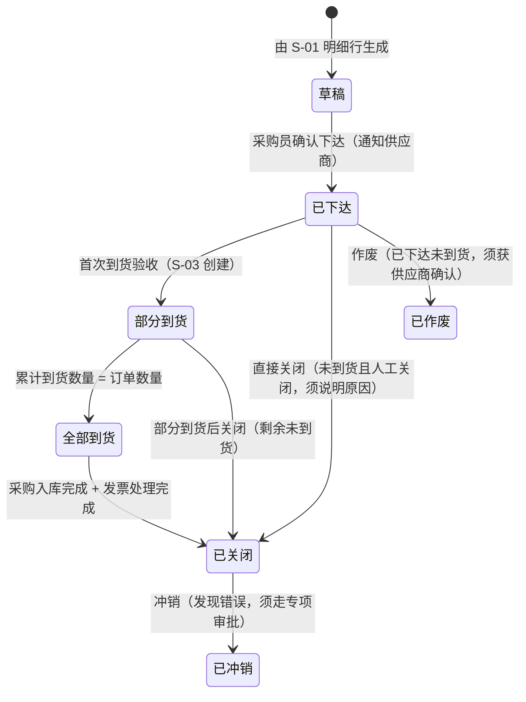
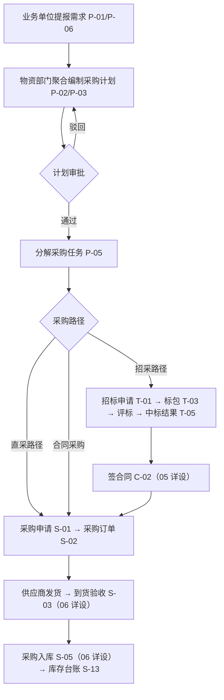
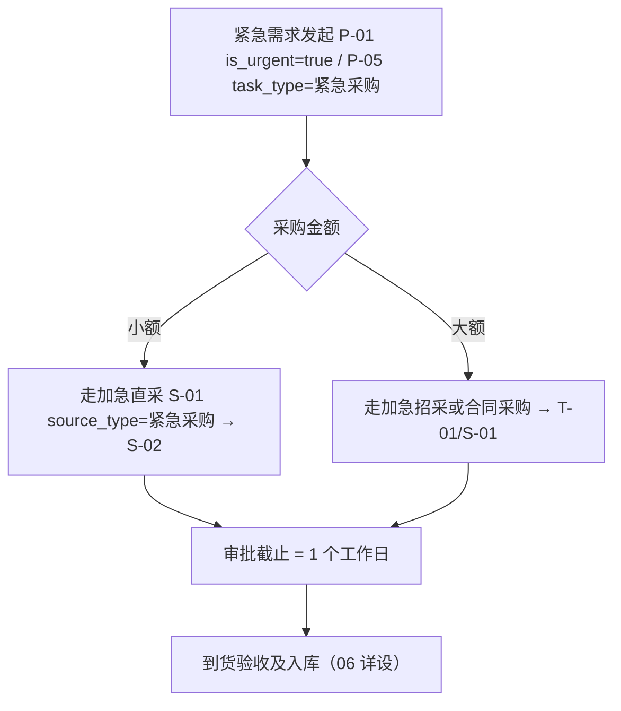
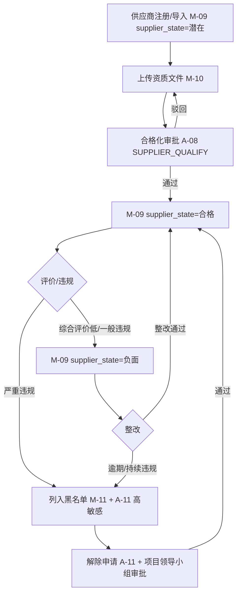

# 需求计划与采购协同详细设计（V1.1）

**版本：** V1.1
**日期：** 2026-05-09
**文档性质：** 详细设计层 · 模块详设第四篇
**适用阶段：** 详细设计执行、开发实施、联调测试

---

## 一、文档目的

本文档承接 `01-数据库逻辑模型-V1.0.md` 跨模块骨架与 `02-基础档案与组织仓库详细设计-V1.0.md`、`03-物料主数据与编码详细设计-V1.1.md` 的底座，把需求计划与采购协同模块涉及的 20 个实体的全字段、状态机、业务规则、接口规范、配置项和占位项固化下来。

本文档重点回答：

- 供应商档案全生命周期（潜在 → 合格 → 负面 → 黑名单）及资质到期管理
- 需求提报从业务单位发起到纳入采购计划的完整路径
- 采购计划的聚合、审批、分解与调整规则
- 招标申请、标包、文件、结果的状态机与业务约束
- 采购申请单与采购订单的生成规则、合同价格约束与 NC 接口触发点
- 一期招采平台对接口径（结果手工导入或平台 API 导入）

本文档**不**做以下事：

- 不写到货验收、质检单、入库单等收货侧流程（属 06 详设）
- 不写合同登记、付款节点、付款计划（属 05 详设）
- 不写 NC 凭证科目规则、接口推送报文（属 08 详设）
- 不写物料主数据、计量单位等基础档案（属 02/03 详设）
- 不写 SQL DDL 与页面交互

---

## 二、设计输入

| 输入文档 | 在本文档中的作用 |
| --- | --- |
| `docs/详细设计/01-数据库逻辑模型-V1.0.md` | 实体编号 M-09/10/11、P-01/06、P-02/03/04/05、T-01/02/03/04/05/06/07、S-01/22、S-02/23；共用约定 4.1-4.10 |
| `docs/详细设计/02-基础档案与组织仓库详细设计-V1.0.md` | SY-01 前缀清单、M-01/M-02/M-07/M-12/M-13 引用约定 |
| `docs/详细设计/03-物料主数据与编码详细设计-V1.1.md` | M-05 material_state 约束（不允许待申请/待审核状态物料进入采购流程） |
| `docs/概要设计/02-业务模块概要设计-v0.1.md` 节 5.2/5.3 | 采购协同模块定位、计划管控、招采对接、采购订单执行 |
| `docs/需求梳理/04-待确认事项清单.md` 第 2/4/5/8/13/14/18/26 项 | 采购方式阈值、招采平台对接口径、合同价差控制、紧急采购审批 |
| `docs/集团统筹/集团业务系统统一建设原则-V2.0.md` | SSO、独立数据库、PG 兼容、信创原则对采购协同的约束 |
| `docs/需求梳理/12-详细设计前保留事项与决策责任清单.md` | 已闭环决策与未决事项 |

---

## 三、模块范围

### 3.1 本篇覆盖实体

| 实体编号 | 英文名 | 中文名 | 本篇覆盖深度 |
| --- | --- | --- | --- |
| M-09 | supplier | 供应商档案 | 全字段、状态机（潜在/合格/负面/黑名单）、资质联动 |
| M-10 | supplier_qualification | 供应商资质 | 全字段、资质类型字典、到期预警 |
| M-11 | supplier_blacklist | 供应商黑名单 | 全字段、列入/解除高敏感审批 |
| P-01 | demand_request | 需求提报单 | 全字段、状态机、与计划聚合关系 |
| P-06 | demand_request_line | 需求提报明细 | 全字段、物料约束、fulfillment 跟踪 |
| P-02 | purchase_plan | 采购计划 | 全字段、状态机（草稿→已审→已分解）、锁定规则 |
| P-03 | purchase_plan_line | 采购计划明细 | 全字段、来源追溯、履行状态 |
| P-04 | plan_adjustment | 计划调整单 | 全字段、调整类型、审批约束 |
| P-05 | purchase_task | 采购任务单 | 全字段、紧急采购、分配审批 |
| T-01 | tender_application | 招标申请 | 全字段、状态机、采购方式路由 |
| T-02 | procurement_method | 采购方式 | 全字段、阈值约束、字典型 |
| T-03 | tender_package | 标包 | 全字段、状态机（待标→已结案）、合格供应商约束 |
| T-04 | procurement_document | 采购文件 | 全字段、版本管理、发布撤回 |
| T-05 | tender_result | 中标/成交结果 | 全字段、手工导入/平台导入口径、驱动合同 |
| T-06 | tender_platform_log | 招采平台对接日志 | 全字段、一期对接口径 |
| T-07 | tender_package_line | 标包明细 | 全字段、计划行与物料对应 |
| S-01 | purchase_request | 采购申请单 | 全字段、状态机、来源追溯 |
| S-22 | purchase_request_line | 采购申请明细 | 全字段、价格约束、行状态 |
| S-02 | purchase_order | 采购订单 | 全字段、状态机、NC 接口触发点 |
| S-23 | purchase_order_line | 采购订单明细 | 全字段、到货跟踪、行状态 |

### 3.2 不在本篇覆盖

| 实体 | 承接位置 |
| --- | --- |
| S-03 到货验收、S-04 质检、S-05 采购入库等收货单据 | 06 库存实物流转详细设计 |
| C-02 合同、C-04 付款节点、C-08 付款申请等合同资金单据 | 05 合同与资金详细设计 |
| F-01 接口任务、F-12 NC 凭证科目规则等 | 08 财务与 NC 接口详细设计 |
| M-04/M-05 物料主数据、M-07 计量单位 | 02/03 详细设计 |
| A-08 审批流程、A-20 审批实例 | 10 权限审批流详细设计 |

### 3.3 共用约定继承

本篇所有实体表默认遵守 `01-V1.0` 节四的共用约定（主键策略、审计字段、软删除、业务状态字段、NC 接口字段、工作流字段、时间戳字段、多租户字段、附件字段、主表/明细表原则）。下文字段表中**不重复列出**共用字段；如某实体对共用约定有补充说明，在该实体的"特别说明"中显式注明。

---

## 四、数据模型

### 4.1 M-09 supplier 供应商档案

#### 4.1.1 全字段表

| 字段名 | 类型 | 长度/精度 | 空值 | 默认值 | 唯一 | 外键 | 索引建议 | 注释 |
| --- | --- | --- | --- | --- | --- | --- | --- | --- |
| `supplier_id` | bigint | — | NOT NULL | auto | PK | — | PK | 技术主键 |
| `supplier_code` | varchar | 32 | NOT NULL | — | UQ | — | UQ | 业务编码；物资系统内唯一 |
| `supplier_name` | varchar | 128 | NOT NULL | — | — | — | idx | 供应商全称 |
| `supplier_short_name` | varchar | 64 | NULL | — | — | — | — | 简称 |
| `supplier_type` | varchar | 32 | NOT NULL | — | — | — | idx | 取值：制造商 / 贸易商 / 代理商 / 服务商 / 个人 |
| `credit_code` | varchar | 64 | NULL | — | UQ | — | UQ | 统一社会信用代码（自然人/无照供应商可空） |
| `tax_no` | varchar | 32 | NULL | — | — | — | idx | 税务登记号 |
| `legal_person` | varchar | 64 | NULL | — | — | — | — | 法定代表人 |
| `registered_capital` | decimal | (18,2) | NULL | — | — | — | — | 注册资本（万元人民币） |
| `registered_address` | varchar | 255 | NULL | — | — | — | — | 注册地址 |
| `business_address` | varchar | 255 | NULL | — | — | — | — | 经营地址 |
| `contact_person` | varchar | 64 | NULL | — | — | — | — | 主联系人 |
| `contact_phone` | varchar | 32 | NULL | — | — | — | — | 联系电话 |
| `contact_email` | varchar | 128 | NULL | — | — | — | — | 联系邮箱 |
| `bank_name` | varchar | 128 | NULL | — | — | — | — | 开户银行 |
| `bank_account` | varchar | 64 | NULL | — | — | — | — | 银行账号 |
| `bank_account_name` | varchar | 128 | NULL | — | — | — | — | 账户名称 |
| `supplier_state` | varchar | 16 | NOT NULL | `潜在` | — | — | idx | 取值：潜在 / 合格 / 负面 / 黑名单（见 4.1.2） |
| `credit_level` | varchar | 8 | NULL | — | — | — | idx | 综合评价等级：A / B / C / D / E；合格化或周期评价时评定 |
| `evaluation_score` | decimal | (5,2) | NULL | — | — | — | idx | 最近综合评价得分（百分制） |
| `cooldown_until` | date | — | NULL | — | — | — | idx | 高风险 / 不合格供应商重新评审冷却期截止日 |
| `qualified_date` | date | — | NULL | — | — | — | — | 合格化通过日期 |
| `last_eval_date` | date | — | NULL | — | — | — | — | 最近综合评价日期 |
| `category_scope` | varchar | 512 | NULL | — | — | — | — | 供货品类范围描述（如"支护材料、机电材料"） |
| `is_strategic` | boolean | — | NOT NULL | false | — | — | idx | 是否战略供应商 |
| `source` | varchar | 32 | NOT NULL | `本地注册` | — | — | idx | 取值：本地注册 / 招采平台导入 |
| `platform_supplier_code` | varchar | 64 | NULL | — | — | — | idx | 招采平台端的供应商编码（source=招采平台导入时回填） |
| `status` | varchar | 16 | NOT NULL | `启用` | — | — | idx | 取值：启用 / 停用 |
| `remarks` | varchar | 255 | NULL | — | — | — | — | 备注 |

**特别说明**：

- `credit_code` 全局唯一约束——同一社会信用代码不允许重复注册；个人类供应商 `credit_code` 可为 NULL，但 `supplier_name + contact_phone` 须人工查重
- `supplier_state` 与 `status` 独立：`status=停用` 表示该供应商记录已暂停使用（一般用于合并归档），`supplier_state` 反映业务信用状态

#### 4.1.2 状态机（supplier_state）



状态迁移约束：

- **潜在 → 合格**：必须满足：① M-10 中存在有效的"营业执照"资质；② 合格化审批（A-08 `business_type=SUPPLIER_QUALIFY`）通过；③ 至少有一条 `category_scope` 对应的品类声明
- **合格 → 黑名单** / **负面 → 黑名单**：属 A-11 高敏感操作，须物资管理 + 法务或主管领导联合审批；列入后自动取消该供应商参与所有进行中标包（T-03）的资格
- **黑名单 → 合格**：须走专项解除申请，A-11 高敏感 + 项目领导小组级别审批，`delist_reason` 必填
- **黑名单状态**下：不允许参与招标（T-03）、不允许签订合同（C-02）、不允许新建采购订单（S-02）；历史合同履行中的付款依照合同条款，不自动中断
- **负面 / 黑名单重新升级**：供应商被评为 D（高风险）或 E（不合格 / 黑名单候选）后，默认进入 **24 个月**冷却期；`cooldown_until` 到期后方可发起重新评价或解除申请。状态冲突时按最严口径执行（黑名单 > 负面 > 合格）。

#### 4.1.3 业务规则

1. **供应商编码规则**：建议 `VD-<YYYYMM>-<4 位流水>`，例如 `VD-202605-0001`；由物资部门维护，不强制系统生成
2. **合格供应商约束**：招标（T-03）中被邀请的供应商必须 `supplier_state=合格` 且 `status=启用`；若在评标完成前变为黑名单，须人工确认是否作废标包
3. **资质联动**：M-10 中有效资质到期后系统自动触发预警（R-04 alert_rule，rule_code=`SUPPLIER_QUAL_EXPIRY_NEAR`），但**不**自动将 `supplier_state` 降为"负面"；资质是否导致降级由物资部门评审决定
4. **战略供应商**：`is_strategic=true` 的供应商新增/变更须额外通知采购主管（R-08 推送）；计划分解（P-05）优先匹配战略供应商
5. **综合评价等级**：按政策 03 供应商管理办法执行百分制 + A/B/C/D/E 五等级：A≥90，B=80-89，C=70-79，D=60-69，E<60；评价维度包括产品质量、价格、履行能力、售后服务。
6. **评价与状态联动**：A/B/C 可保持或进入合格供应商池；D 默认映射为负面 / 高风险，须整改并进入 24 个月冷却期；E 默认触发不合格处置或黑名单评审。供应商同时存在多个分类或标签时，采购准入按最严标签控制。

#### 4.1.4 后评价反馈→供应商分类自动联动机制（业务方 Q-11-5 答复 2026-05-09）

> **业务依据：** 业务方 Q-11-5 拍板"自动联动"。流程调研 11-后评价流程的 4 类反馈处理结果直接影响 M-09 供应商分类，不依赖人工触发。

- **触发源**：详设 09 RPT-CMP-002 后评价反馈处理跟踪表 + ALR-CMP-002 后评价差评累计预警。
- **触发条件**：单一供应商在最近一个**自然季度**（按当前日期回溯 90 天）内累计收到差评（4 类反馈中评级为"严重 / 不合格"的处理结果）≥ `VENDOR_NEGATIVE_FEEDBACK_THRESHOLD` 次（默认 3 次/季，SY-02 配置）。
- **自动动作**：
  1. 系统自动创建 M-09 供应商重评估任务记录（建议新增 M-09A 表 `supplier_reassessment`，含字段 `reassessment_id / supplier_id / trigger_source(feedback/manual/quality_event) / negative_count / proposed_category / current_category / state(待审/已批准/已驳回)`）
  2. 自动将该供应商的 `proposed_category` 置为 D（高风险）
  3. 推送给物资管理部门走 A-08 审批流（WF-SUP-REASSESS-001 模板，详设 10 §6.1 落地）
- **审批后果**：
  - 通过 → 自动更新 M-09 `category=D` 和 `cooldown_until=审批日 + 24 个月`，进入负面供应商池，限制采购邀请
  - 驳回 → 保持原分类，但反馈记录留痕，纳入下次评估参考
- **不阻断业务**：自动联动期间，供应商现有合同 / 订单不冻结，仅影响新增邀标资格；阻断仅在审批通过后生效。
- **联动详设 09**：ALR-CMP-002 触发时自动创建本节的重评估任务；联动详设 10：WF-SUP-REASSESS-001 审批模板。

---

### 4.2 M-10 supplier_qualification 供应商资质

#### 4.2.1 全字段表

| 字段名 | 类型 | 长度/精度 | 空值 | 默认值 | 唯一 | 外键 | 索引建议 | 注释 |
| --- | --- | --- | --- | --- | --- | --- | --- | --- |
| `qual_id` | bigint | — | NOT NULL | auto | PK | — | PK | 技术主键 |
| `supplier_id` | bigint | — | NOT NULL | — | — | FK→M-09 | idx | 所属供应商 |
| `qual_type` | varchar | 32 | NOT NULL | — | — | — | idx | 见 4.2.2 资质类型字典 |
| `qual_no` | varchar | 64 | NULL | — | — | — | idx | 证件编号 |
| `issue_org` | varchar | 128 | NULL | — | — | — | — | 发证机关 |
| `issue_date` | date | — | NULL | — | — | — | — | 发证日期 |
| `expire_date` | date | — | NULL | — | — | — | idx | 到期日期；NULL 表示长期有效 |
| `is_long_valid` | boolean | — | NOT NULL | false | — | — | — | 是否长期有效（expire_date=NULL 时须此字段=true 显式声明） |
| `attachment_id` | bigint | — | NULL | — | — | FK→SY-04 | — | 资质证书附件 |
| `qualification_status` | varchar | 16 | NOT NULL | `有效` | — | — | idx | 取值：有效 / 已过期 / 待更新 / 已作废 |
| `remarks` | varchar | 255 | NULL | — | — | — | — | 备注 |

**唯一约束**：`(supplier_id, qual_type, qual_no)` 复合唯一（同一供应商同类型同证件号不重复；同类型可有多版本，通过 `status` 区分）

#### 4.2.2 资质类型字典（SY-03 dict_code=`SUPPLIER_QUAL_TYPE`）

| qual_type | 含义 | 是否合格化必须 | 到期管理 |
| --- | --- | --- | --- |
| `营业执照` | 工商营业执照 | 是 | 必须维护到期日 |
| `安全生产许可证` | 危化品/矿用物资供应商须持有 | 危化/矿用类是 | 必须维护到期日 |
| `资质证书` | 行业资质（如矿山机电安装资质） | 否 | 必须维护到期日 |
| `ISO认证` | ISO9001/14001/45001 等 | 否 | 必须维护到期日 |
| `特种设备许可` | 压力容器/起重机械等制造或维修许可 | 否 | 必须维护到期日 |
| `爆炸物品经营许可证` | 火工品类供应商必须 | HG 类供应商是 | 必须维护到期日 |
| `其他证件` | 不在上述范围的特定资质 | 否 | 可选 |

#### 4.2.3 到期预警规则

- 到期前 **90 天**：`qualification_status` 自动置为 `待更新`，触发 R-04 `SUPPLIER_QUAL_EXPIRY_NEAR` 预警，通知供应商管理员
- 到期前 **30 天**：升级通知物资管理
- 到期当日：`qualification_status` 自动置为 `已过期`
- **合格化必须**类资质（营业执照/爆炸物品许可证）过期后：自动触发供应商降级评审提醒（不自动降级，须人工确认）

---

### 4.3 M-11 supplier_blacklist 供应商黑名单

#### 4.3.1 全字段表

| 字段名 | 类型 | 长度/精度 | 空值 | 默认值 | 唯一 | 外键 | 索引建议 | 注释 |
| --- | --- | --- | --- | --- | --- | --- | --- | --- |
| `blacklist_id` | bigint | — | NOT NULL | auto | PK | — | PK | 技术主键 |
| `supplier_id` | bigint | — | NOT NULL | — | — | FK→M-09 | idx | 被列入黑名单的供应商 |
| `reason` | text | — | NOT NULL | — | — | — | — | 列入原因（详细描述） |
| `reason_type` | varchar | 32 | NOT NULL | — | — | — | idx | 取值：严重质量事故 / 重大违约 / 违规行贿 / 虚假资质 / 其他 |
| `listed_date` | date | — | NOT NULL | — | — | — | idx | 列入日期 |
| `listed_by` | bigint | — | NOT NULL | — | — | FK→A-01 | — | 列入操作人 |
| `list_approver_id` | bigint | — | NOT NULL | — | — | FK→A-01 | — | 列入审批人 |
| `list_approval_no` | varchar | 32 | NULL | — | — | — | — | 审批单号/会议纪要编号 |
| `delist_date` | date | — | NULL | — | — | — | — | 解除日期 |
| `delist_reason` | varchar | 512 | NULL | — | — | — | — | 解除原因（解除时必填） |
| `delist_by` | bigint | — | NULL | — | — | FK→A-01 | — | 解除操作人 |
| `delist_approver_id` | bigint | — | NULL | — | — | FK→A-01 | — | 解除审批人 |
| `delist_approval_no` | varchar | 32 | NULL | — | — | — | — | 解除审批单号 |
| `share_to_group` | boolean | — | NOT NULL | false | — | — | — | 是否上报集团黑名单（预留，一期不启用） |
| `status` | varchar | 16 | NOT NULL | `列入` | — | — | idx | 取值：列入 / 解除待审 / 已解除 |

**特别说明**：

- 每条黑名单记录为独立列入事件；一个供应商可有多条记录（历史留痕）；`status=列入` 的记录存在时，`M-09.supplier_state` 必须为 `黑名单`
- 本表属 A-11 高敏感操作，所有写入/修改均记录到 A-11 `sensitive_operation`，A-13 `operation_log` 全量留痕

#### 4.3.2 业务规则

1. **列入触发**：由物资管理发起 → 法务/安全会签 → 物资管理或项目领导小组审批通过后写入本表，同时变更 `M-09.supplier_state=黑名单`
2. **级联检查**：列入成功后系统自动检查并提示：① 该供应商参与的进行中标包（T-03 `package_state NOT IN ('已结案','已作废')`）；② 该供应商关联的执行中合同（C-02 `contract_state='执行中'`）；③ 未关闭的采购订单（S-02 `order_state NOT IN ('全部到货','已关闭','已作废','已冲销')`）——系统提示但不自动冻结，须人工处置
3. **解除审批**：须项目领导小组级别审批，`delist_reason` 必填，`delist_approval_no` 必填；审批通过后将 `M-09.supplier_state` 改回 `合格`（不能直接解除后跳过合格状态）

---

### 4.4 P-01 demand_request 需求提报单 + P-06 demand_request_line 需求提报明细

#### 4.4.1 P-01 全字段表

| 字段名 | 类型 | 长度/精度 | 空值 | 默认值 | 唯一 | 外键 | 索引建议 | 注释 |
| --- | --- | --- | --- | --- | --- | --- | --- | --- |
| `request_id` | bigint | — | NOT NULL | auto | PK | — | PK | 技术主键 |
| `request_no` | varchar | 32 | NOT NULL | — | UQ | — | UQ | 业务单号；前缀 `DR`（SY-01 取号） |
| `org_id` | bigint | — | NOT NULL | — | — | FK→M-01 | idx | 提报组织（归属厂矿） |
| `usage_unit_id` | bigint | — | NOT NULL | — | — | FK→M-01 | idx | 使用单位（部门/班组，可与 org_id 不同） |
| `cost_center_id` | bigint | — | NULL | — | — | FK→M-12 | idx | 成本中心（默认由 M-13 带出，可修改） |
| `plan_period` | varchar | 7 | NOT NULL | — | — | — | idx | 计划期（`YYYY-MM`，所属月份或年度） |
| `is_urgent` | boolean | — | NOT NULL | false | — | — | idx | 是否紧急需求（触发加急审批路径） |
| `priority` | varchar | 16 | NOT NULL | `一般` | — | — | idx | 取值：一般 / 重要 / 紧急 / 特急 |
| `submit_date` | date | — | NULL | — | — | — | idx | 提报提交日期 |
| `expected_delivery_date` | date | — | NULL | — | — | — | idx | 期望到货日期 |
| `request_reason` | varchar | 512 | NOT NULL | — | — | — | — | 提报原因 |
| `total_line_count` | integer | — | NOT NULL | 0 | — | — | — | 明细行总数（与 P-06 行数保持一致） |
| `total_estimated_amount` | decimal | (18,2) | NOT NULL | 0 | — | — | — | 汇总预估金额（由明细行汇总，不手工维护） |
| `plan_id` | bigint | — | NULL | — | — | FK→P-02 | idx | 被纳入的采购计划（审批通过后回填） |
| `request_state` | varchar | 16 | NOT NULL | `草稿` | — | — | idx | 见 4.4.3 |
| `workflow_instance_id` | bigint | — | NULL | — | — | FK→A-20 | idx | 审批实例 |
| `current_node_id` | bigint | — | NULL | — | — | FK→A-09 | — | 当前审批节点 |
| `approval_chain` | text | — | NULL | — | — | — | — | 审批链路 JSON |
| `approval_deadline` | timestamp | — | NULL | — | — | — | — | 审批截止时间 |
| `escalation_flag` | boolean | — | NOT NULL | false | — | — | — | 是否已升级 |

#### 4.4.2 P-06 全字段表

| 字段名 | 类型 | 长度/精度 | 空值 | 默认值 | 唯一 | 外键 | 索引建议 | 注释 |
| --- | --- | --- | --- | --- | --- | --- | --- | --- |
| `line_id` | bigint | — | NOT NULL | auto | PK | — | PK | 技术主键 |
| `request_id` | bigint | — | NOT NULL | — | — | FK→P-01 | idx | 所属需求提报单 |
| `line_no` | smallint | — | NOT NULL | — | — | — | — | 行序号（1 起） |
| `material_id` | bigint | — | NOT NULL | — | — | FK→M-05 | idx | 物料；必须 `material_state=启用` |
| `quantity` | decimal | (18,3) | NOT NULL | — | — | — | — | 需求数量（按主单位） |
| `unit_id` | bigint | — | NOT NULL | — | — | FK→M-07 | — | 计量单位 |
| `estimated_unit_price` | decimal | (18,2) | NULL | — | — | — | — | 预估单价（仅作参考，不约束采购价） |
| `estimated_line_amount` | decimal | (18,2) | NULL | — | — | — | — | 预估行金额（= quantity × estimated_unit_price） |
| `expected_date` | date | — | NULL | — | — | — | idx | 行级期望到货日期（可与主表不同） |
| `usage_description` | varchar | 255 | NULL | — | — | — | — | 用途说明 |
| `plan_line_id` | bigint | — | NULL | — | — | FK→P-03 | idx | 被纳入的计划明细行（回填） |
| `fulfillment_state` | varchar | 16 | NOT NULL | `待纳入计划` | — | — | idx | 取值：待纳入计划 / 已纳入计划 / 已采购完成 / 已取消 |

#### 4.4.3 P-01 状态机



#### 4.4.4 业务规则

1. **物料状态约束**：P-06 中的 `material_id` 对应物料必须 `material_state=启用`，不允许填写"待申请/待审核/待映射/停用/归档"状态的物料
2. **提报周期**：每个使用单位（`usage_unit_id`）按 `plan_period` 只允许提交一份 `request_state=已批准` 的需求提报单；如需补充，走"追加需求"走补单流程（新建一份同期提报单）
3. **紧急需求路径**：`is_urgent=true` 时审批时限压缩（SY-02 `URGENT_DEMAND_APPROVAL_DAYS`，默认 1 个工作日）；超时自动升级到上一级审批节点
4. **金额汇总**：`total_estimated_amount` 由服务层计算 P-06 所有行的 `estimated_line_amount` 之和，不允许手工填写主表

---

### 4.5 P-02 purchase_plan 采购计划 + P-03 purchase_plan_line 采购计划明细

#### 4.5.1 P-02 全字段表

| 字段名 | 类型 | 长度/精度 | 空值 | 默认值 | 唯一 | 外键 | 索引建议 | 注释 |
| --- | --- | --- | --- | --- | --- | --- | --- | --- |
| `plan_id` | bigint | — | NOT NULL | auto | PK | — | PK | 技术主键 |
| `plan_no` | varchar | 32 | NOT NULL | — | UQ | — | UQ | 业务单号；前缀 `PP`（SY-01 取号） |
| `plan_type` | varchar | 16 | NOT NULL | — | — | — | idx | 取值：年度 / 季度 / 月度 / 专项 |
| `plan_year` | smallint | — | NOT NULL | — | — | — | idx | 计划年度 |
| `plan_period` | varchar | 7 | NOT NULL | — | — | — | idx | 计划期（年度=`YYYY`，月度=`YYYY-MM`，季度=`YYYY-Q1`） |
| `org_id` | bigint | — | NOT NULL | — | — | FK→M-01 | idx | 归属组织（厂矿级编制） |
| `data_source` | varchar | 32 | NOT NULL | `需求提报` | — | — | idx | 取值：需求提报 / 直接录入 / 上期结转 |
| `total_items` | integer | — | NOT NULL | 0 | — | — | — | 计划行数 |
| `total_estimated_amount` | decimal | (18,2) | NOT NULL | 0 | — | — | — | 汇总预估金额 |
| `approval_state` | varchar | 16 | NOT NULL | `草稿` | — | — | idx | 取值：草稿 / 待审 / 已审 / 已驳回 / 已分解 / 已作废 |
| `approved_by` | bigint | — | NULL | — | — | FK→A-01 | — | 最终审批人 |
| `approved_date` | date | — | NULL | — | — | — | — | 审批通过日期 |
| `is_locked` | boolean | — | NOT NULL | false | — | — | — | 是否已锁定（月结后不允许修改） |
| `lock_date` | date | — | NULL | — | — | — | — | 锁定日期 |
| `lock_by` | bigint | — | NULL | — | — | FK→A-01 | — | 锁定人 |
| `workflow_instance_id` | bigint | — | NULL | — | — | FK→A-20 | idx | 审批实例 |
| `current_node_id` | bigint | — | NULL | — | — | FK→A-09 | — | 当前审批节点 |
| `approval_chain` | text | — | NULL | — | — | — | — | 审批链路 JSON |
| `approval_deadline` | timestamp | — | NULL | — | — | — | — | 审批截止时间 |
| `escalation_flag` | boolean | — | NOT NULL | false | — | — | — | 是否已升级 |

#### 4.5.2 P-03 全字段表

| 字段名 | 类型 | 长度/精度 | 空值 | 默认值 | 唯一 | 外键 | 索引建议 | 注释 |
| --- | --- | --- | --- | --- | --- | --- | --- | --- |
| `line_id` | bigint | — | NOT NULL | auto | PK | — | PK | 技术主键 |
| `plan_id` | bigint | — | NOT NULL | — | — | FK→P-02 | idx | 所属采购计划 |
| `line_no` | integer | — | NOT NULL | — | — | — | — | 行序号 |
| `material_id` | bigint | — | NOT NULL | — | — | FK→M-05 | idx | 物料 |
| `category_id` | bigint | — | NOT NULL | — | — | FK→M-04 | idx | 物料分类（冗余，提升查询性能） |
| `quantity` | decimal | (18,3) | NOT NULL | — | — | — | — | 计划数量 |
| `unit_id` | bigint | — | NOT NULL | — | — | FK→M-07 | — | 计量单位 |
| `estimated_unit_price` | decimal | (18,2) | NULL | — | — | — | — | 预估单价 |
| `line_amount` | decimal | (18,2) | NULL | — | — | — | — | 行金额 |
| `demand_request_id` | bigint | — | NULL | — | — | FK→P-01 | idx | 来源需求提报单（直接录入时为空） |
| `demand_line_id` | bigint | — | NULL | — | — | FK→P-06 | idx | 来源需求提报明细行 |
| `preferred_supplier_id` | bigint | — | NULL | — | — | FK→M-09 | — | 优先供应商（合格状态，仅参考） |
| `expected_delivery_date` | date | — | NULL | — | — | — | idx | 期望到货日期 |
| `fulfillment_state` | varchar | 16 | NOT NULL | `待采购` | — | — | idx | 取值：待采购 / 招采中 / 直采中 / 已完成 / 已取消 |
| `task_id` | bigint | — | NULL | — | — | FK→P-05 | idx | 分解产生的采购任务单（回填） |
| `tender_package_line_id` | bigint | — | NULL | — | — | FK→T-07 | idx | 关联标包明细行（回填） |

#### 4.5.3 P-02 状态机



状态迁移约束：

- `已审`：允许继续编辑（追加明细行），但须走 P-04 计划调整单，不直接修改 P-03
- `已审 → 已分解`：仅当所有 P-03 行的 `fulfillment_state` 均不为 `待采购` 时允许切换
- `is_locked=true`：进入月结后，`草稿/待审/已驳回` 状态的计划不允许修改金额与数量字段；`已审/已分解` 状态的计划只读

#### 4.5.4 业务规则

1. **聚合规则**：同期（`plan_period`）同组织（`org_id`）同物料（`material_id`）的多条需求提报行可合并为一条 P-03 行；合并后 `demand_request_id / demand_line_id` 记录最主要来源，其余来源在 `remarks` 中追溯
2. **计划编制权限**：`data_source=需求提报` 的计划由系统聚合生成；`data_source=直接录入` 须采购主管级别才能操作（A-06 数据权限控制）
3. **金额锁定**：`is_locked=true` 后，P-04 调整单若需变更金额，须重新走审批流

---

### 4.6 P-04 plan_adjustment 计划调整单

#### 4.6.1 全字段表

| 字段名 | 类型 | 长度/精度 | 空值 | 默认值 | 唯一 | 外键 | 索引建议 | 注释 |
| --- | --- | --- | --- | --- | --- | --- | --- | --- |
| `adj_id` | bigint | — | NOT NULL | auto | PK | — | PK | 技术主键 |
| `adj_no` | varchar | 32 | NOT NULL | — | UQ | — | UQ | 调整单号；前缀 `AD`（SY-01 取号） |
| `plan_id` | bigint | — | NOT NULL | — | — | FK→P-02 | idx | 被调整的采购计划 |
| `plan_line_id` | bigint | — | NULL | — | — | FK→P-03 | idx | 被调整的计划明细行（新增行时为空） |
| `adj_type` | varchar | 16 | NOT NULL | — | — | — | idx | 取值：增量 / 减量 / 取消行 / 新增行 / 合并行 |
| `adj_reason` | varchar | 512 | NOT NULL | — | — | — | — | 调整原因 |
| `old_quantity` | decimal | (18,3) | NULL | — | — | — | — | 调整前数量 |
| `new_quantity` | decimal | (18,3) | NULL | — | — | — | — | 调整后数量 |
| `old_estimated_amount` | decimal | (18,2) | NULL | — | — | — | — | 调整前金额 |
| `new_estimated_amount` | decimal | (18,2) | NULL | — | — | — | — | 调整后金额 |
| `approval_state` | varchar | 16 | NOT NULL | `草稿` | — | — | idx | 草稿 / 待审 / 已审 / 已驳回 |
| `workflow_instance_id` | bigint | — | NULL | — | — | FK→A-20 | idx | 审批实例 |
| `current_node_id` | bigint | — | NULL | — | — | FK→A-09 | — | 当前节点 |
| `approval_chain` | text | — | NULL | — | — | — | — | 审批链路 JSON |
| `effective_date` | date | — | NULL | — | — | — | — | 调整生效日期 |

#### 4.6.2 业务规则

1. **审批路径**：增量/新增行金额超过 SY-02 `PLAN_ADJ_APPROVAL_THRESHOLD`（`[待业务确认 - 来源 12]`）须提升审批节点级别
2. **取消行约束**：`adj_type=取消行` 时，对应 P-03 行必须满足：`fulfillment_state=待采购`（已进入招采流程的不允许直接取消，须先撤销招采）
3. **生效方式**：审批通过后服务层更新对应 P-03 行的 `quantity / line_amount / fulfillment_state`；新增行创建新的 P-03 记录

---

### 4.7 P-05 purchase_task 采购任务单

#### 4.7.1 全字段表

| 字段名 | 类型 | 长度/精度 | 空值 | 默认值 | 唯一 | 外键 | 索引建议 | 注释 |
| --- | --- | --- | --- | --- | --- | --- | --- | --- |
| `task_id` | bigint | — | NOT NULL | auto | PK | — | PK | 技术主键 |
| `task_no` | varchar | 32 | NOT NULL | — | UQ | — | UQ | 前缀 `PT`（SY-01 取号） |
| `plan_id` | bigint | — | NULL | — | — | FK→P-02 | idx | 来源采购计划（紧急采购时可为空） |
| `plan_line_id` | bigint | — | NULL | — | — | FK→P-03 | idx | 来源计划明细行 |
| `material_id` | bigint | — | NOT NULL | — | — | FK→M-05 | idx | 物料 |
| `quantity` | decimal | (18,3) | NOT NULL | — | — | — | — | 任务数量 |
| `unit_id` | bigint | — | NOT NULL | — | — | FK→M-07 | — | 计量单位 |
| `preferred_supplier_id` | bigint | — | NULL | — | — | FK→M-09 | — | 优先供应商 |
| `estimated_unit_price` | decimal | (18,2) | NULL | — | — | — | — | 预估单价 |
| `task_type` | varchar | 16 | NOT NULL | `计划分解` | — | — | idx | 取值：计划分解 / 紧急采购 |
| `source_type` | varchar | 16 | NOT NULL | — | — | — | idx | 取值：招采 / 直采 / 合同采购；决定后续路径 |
| `assigned_to_id` | bigint | — | NULL | — | — | FK→A-01 | idx | 负责采购员 |
| `task_state` | varchar | 16 | NOT NULL | `待采购` | — | — | idx | 取值：待采购 / 招采申请中 / 已分配合同 / 已完成 / 已取消 |
| `due_date` | date | — | NULL | — | — | — | idx | 任务截止日期 |
| `tender_app_id` | bigint | — | NULL | — | — | FK→T-01 | idx | 关联招标申请（招采路径时回填） |
| `purchase_request_id` | bigint | — | NULL | — | — | FK→S-01 | idx | 关联采购申请单（直采路径时回填） |

#### 4.7.2 业务规则

1. **紧急采购约束**：`task_type=紧急采购` 时 `plan_id / plan_line_id` 允许为空，但须填写紧急说明（`remarks`）并走加急审批路径（A-08 `business_type=EMERGENCY_PURCHASE`）
2. **路径分发**：`source_type=招采` → 发起 T-01 招标申请；`source_type=直采` → 直接创建 S-01 采购申请单；`source_type=合同采购` → 按现有合同（C-02）创建 S-01 并关联合同
3. **一对一原则**：一条 P-03 行通常分解为一条 P-05 任务；如需拆分到不同供应商，允许一条 P-03 行生成多条 P-05 任务，但数量之和不得超过 P-03 行数量（允许小于，超量须 P-04 调整）

---

### 4.8 T-01 tender_application 招标申请

#### 4.8.1 全字段表

| 字段名 | 类型 | 长度/精度 | 空值 | 默认值 | 唯一 | 外键 | 索引建议 | 注释 |
| --- | --- | --- | --- | --- | --- | --- | --- | --- |
| `app_id` | bigint | — | NOT NULL | auto | PK | — | PK | 技术主键 |
| `app_no` | varchar | 32 | NOT NULL | — | UQ | — | UQ | 前缀 `TA`（SY-01 取号） |
| `plan_id` | bigint | — | NULL | — | — | FK→P-02 | idx | 来源采购计划 |
| `task_id` | bigint | — | NULL | — | — | FK→P-05 | idx | 来源采购任务单 |
| `org_id` | bigint | — | NOT NULL | — | — | FK→M-01 | idx | 归属组织 |
| `tender_type` | varchar | 32 | NOT NULL | — | — | — | idx | 取值：公开招标 / 邀请招标 / 竞争性谈判 / 询比 / 询价 / 竞价 / 单一来源 / 直接采购 / 小额采购 |
| `procurement_method_id` | bigint | — | NOT NULL | — | — | FK→T-02 | idx | 采购方式（与 tender_type 联动，细化执行规范） |
| `total_estimate_amount` | decimal | (18,2) | NULL | — | — | — | — | 招采总预算金额 |
| `application_reason` | varchar | 512 | NOT NULL | — | — | — | — | 申请说明 |
| `invited_supplier_ids` | text | — | NULL | — | — | — | — | 邀请供应商 ID 列表（JSON 数组；邀请招标/竞争性谈判时填写） |
| `invited_supplier_count` | integer | — | NOT NULL | 0 | — | — | — | 邀请供应商数量 |
| `expected_result_date` | date | — | NULL | — | — | — | idx | 预计结果日期 |
| `application_state` | varchar | 16 | NOT NULL | `草稿` | — | — | idx | 取值：草稿 / 待审 / 已审 / 已驳回 / 进行中 / 已结案 / 已作废 |
| `workflow_instance_id` | bigint | — | NULL | — | — | FK→A-20 | idx | 审批实例 |
| `current_node_id` | bigint | — | NULL | — | — | FK→A-09 | — | 当前节点 |
| `approval_chain` | text | — | NULL | — | — | — | — | 审批链路 JSON |
| `approval_deadline` | timestamp | — | NULL | — | — | — | — | 审批截止时间 |
| `escalation_flag` | boolean | — | NOT NULL | false | — | — | — | 是否已升级 |

#### 4.8.2 状态机



#### 4.8.3 业务规则

1. **采购方式阈值约束**：`tender_type` 须与 `total_estimate_amount + project_type` 匹配 T-02 中配置的政策阈值矩阵；阈值矩阵按政策 04 采购管理办法执行：必须招标（工程/物资/服务设备修理 400/200/100 万）、应招标（50/20/10 万）、公开采购（5 万）、竞争性采购（2 万）、小额采购（<2 万）。
2. **邀请招标供应商数量**：`tender_type=邀请招标` 时 `invited_supplier_count` 不得少于 SY-02 `MIN_INVITED_SUPPLIER_COUNT`（默认 3）；邀请供应商必须全部 `supplier_state=合格`
3. **单一来源采购**：`tender_type=单一来源` 须在 `application_reason` 中填写单一来源原因（独家专利/紧急/原厂配件等），并上传证明材料（SY-04 附件）

---

### 4.9 T-02 procurement_method 采购方式

#### 4.9.1 全字段表

| 字段名 | 类型 | 长度/精度 | 空值 | 默认值 | 唯一 | 外键 | 索引建议 | 注释 |
| --- | --- | --- | --- | --- | --- | --- | --- | --- |
| `method_id` | bigint | — | NOT NULL | auto | PK | — | PK | 技术主键 |
| `method_code` | varchar | 16 | NOT NULL | — | UQ | — | UQ | 采购方式编码 |
| `method_name` | varchar | 64 | NOT NULL | — | — | — | idx | 采购方式名称 |
| `project_type` | varchar | 32 | NULL | — | — | — | idx | 项目类型：工程 / 物资 / 服务设备修理；NULL 表示通用方式 |
| `route_level` | varchar | 32 | NULL | — | — | — | idx | 政策档位：必须招标 / 应招标 / 公开采购 / 竞争性采购 / 小额采购 |
| `applies_threshold_min` | decimal | (18,2) | NULL | — | — | — | — | 适用金额下限（含）；NULL 表示无下限 |
| `applies_threshold_max` | decimal | (18,2) | NULL | — | — | — | — | 适用金额上限（不含）；NULL 表示无上限 |
| `is_system` | boolean | — | NOT NULL | false | — | — | — | 是否系统内置（内置方式不允许删除） |
| `description` | varchar | 255 | NULL | — | — | — | — | 说明 |
| `status` | varchar | 16 | NOT NULL | `启用` | — | — | idx | 启用 / 停用 |

**特别说明**：T-02 是字典型实体，不带审计字段（is_system=true 的记录由系统初始化，不走审批），软删除保留。

#### 4.9.2 初始化数据（政策 04 五档阈值矩阵）

| method_code | method_name | 政策档位 / 阈值 | 说明 |
| --- | --- | --- | --- |
| `OPEN_TENDER` | 公开招标 | 必须招标：工程 ≥400 万 / 物资 ≥200 万 / 服务设备修理 ≥100 万；应招标：工程 ≥50 万 / 物资 ≥20 万 / 服务设备修理 ≥10 万 | 默认招标路径；特殊情形可按政策转邀请招标或非招标 |
| `INVITED_TENDER` | 邀请招标 | 适用于政策允许的特殊招标情形 | 须保留邀请原因、审批和供应商来源 |
| `COMPETITIVE_NEGO` | 竞争性谈判 | 竞争性采购档位（≥2 万）及政策允许情形 | 最低供应商数 2 家；不足走 WF-PUR-EXC-001 |
| `INQUIRY` | 询比 / 询价采购 | 竞争性采购档位（≥2 万）及标准化采购需求 | 最低供应商数 3 家；不足走 WF-PUR-EXC-001 |
| `BIDDING` | 竞价采购 | 竞争性采购档位（≥2 万）及价格可比场景 | 最低供应商数 3 家；不足走 WF-PUR-EXC-001 |
| `DIRECT_PURCHASE` | 直接采购 | 直接采购 8 类适用情形 | 不要求 3 家；须选择政策情形并留痕 |
| `SINGLE_SOURCE` | 单一来源采购 | 直接采购 8 类适用情形之一（独家专利 / 应急 / 原厂配件等） | 不限金额；须在 `application_reason` 填写来源原因并上传证明材料（SY-04 附件） |
| `SMALL_PURCHASE` | 小额采购 | <2 万 | 按小额采购规则执行，至少双人经办 / 复核 |

---

### 4.10 T-03 tender_package 标包 + T-07 tender_package_line 标包明细

#### 4.10.1 T-03 全字段表

| 字段名 | 类型 | 长度/精度 | 空值 | 默认值 | 唯一 | 外键 | 索引建议 | 注释 |
| --- | --- | --- | --- | --- | --- | --- | --- | --- |
| `package_id` | bigint | — | NOT NULL | auto | PK | — | PK | 技术主键 |
| `tender_app_id` | bigint | — | NOT NULL | — | — | FK→T-01 | idx | 所属招标申请 |
| `package_code` | varchar | 32 | NOT NULL | — | — | — | idx | 标包编码（招标申请内唯一） |
| `package_name` | varchar | 128 | NOT NULL | — | — | — | idx | 标包名称 |
| `total_estimate_amount` | decimal | (18,2) | NULL | — | — | — | — | 标包总预算金额 |
| `total_quantity_desc` | varchar | 128 | NULL | — | — | — | — | 总量描述（多物料标包摘要说明） |
| `min_supplier_count` | integer | — | NOT NULL | 3 | — | — | — | 最低参与供应商数量 |
| `qualified_supplier_ids` | text | — | NULL | — | — | — | — | 参与供应商 ID 列表（JSON 数组） |
| `publish_date` | date | — | NULL | — | — | — | idx | 发标日期 |
| `bidding_deadline` | timestamp | — | NULL | — | — | — | idx | 投标截止时间 |
| `evaluation_date` | date | — | NULL | — | — | — | — | 评标日期 |
| `result_date` | date | — | NULL | — | — | — | — | 结果公示日期 |
| `package_state` | varchar | 16 | NOT NULL | `待标` | — | — | idx | 见 4.10.3 |

#### 4.10.2 T-07 全字段表

| 字段名 | 类型 | 长度/精度 | 空值 | 默认值 | 唯一 | 外键 | 索引建议 | 注释 |
| --- | --- | --- | --- | --- | --- | --- | --- | --- |
| `line_id` | bigint | — | NOT NULL | auto | PK | — | PK | 技术主键 |
| `package_id` | bigint | — | NOT NULL | — | — | FK→T-03 | idx | 所属标包 |
| `plan_line_id` | bigint | — | NULL | — | — | FK→P-03 | idx | 来源计划明细行 |
| `material_id` | bigint | — | NOT NULL | — | — | FK→M-05 | idx | 物料 |
| `quantity` | decimal | (18,3) | NOT NULL | — | — | — | — | 招采数量 |
| `unit_id` | bigint | — | NOT NULL | — | — | FK→M-07 | — | 计量单位 |
| `estimate_unit_price` | decimal | (18,2) | NULL | — | — | — | — | 预估单价 |
| `estimate_amount` | decimal | (18,2) | NULL | — | — | — | — | 预估行金额 |
| `delivery_requirement` | varchar | 255 | NULL | — | — | — | — | 交货要求说明 |
| `line_description` | varchar | 255 | NULL | — | — | — | — | 备注 |

#### 4.10.3 T-03 状态机



#### 4.10.4 业务规则

1. **供应商资格校验**：发标（`待标 → 已发标`）前须校验 `qualified_supplier_ids` 中所有供应商均 `supplier_state=合格` 且 `status=启用`；发标后若供应商降级为黑名单，须人工决定是否继续或作废重发
2. **最低参与数量**：评标时参与有效投标的合格供应商数量须 ≥ `min_supplier_count`；不足时标包按 4.10.5 流标处理
3. **一期招采平台对接**：`T-06` 记录从招采平台导入/导出的操作日志；一期以结果手工录入 `T-05` 为主，平台 API 导入为可选路径

#### 4.10.5 流标处理与重新走集体决策（业务方 Q-02-4 答复 2026-05-09）

- **流标判定条件**（任一满足）：
  - 已发标后投标响应供应商数量低于 `min_supplier_count`（响应不足）
  - 评标完成后全部投标被判定为废标（评标无效）
  - 公示期内有异议，重新评标后仍判定全部投标无效
- **流标后路径**：T-03 状态机进入 `流标`，系统强制不允许直接转 `已结案` 或 `已公示`，业务员必须二选一：
  1. **重新发标**（流标 → 待标）：同次招标申请下创建新的标包版本，**必须重新提交集体决策审批**（即使原招标申请已经审批通过，流标后的重新发标视为新决策事件，须再走一次 P-02 审批 + 供应链管理委员会会议；政策 04 第四十六条认可此类变更须报会审批）；重新发标过程中 `application_state=进行中` 不变，但 T-03 须重新创建并标注 `restart_count + 1`、`restart_reason`、`restart_decision_meeting_id`（关联本次集体决策会议）
  2. **终止本次招标**（流标 → 已作废）：当业务员判定本采购需求不再继续招标（如转单一来源或推迟到下一周期），T-03 终止 → T-01 招标申请回退到 `已驳回` 状态 → 采购计划 P-02 须重新规划（如调整采购方式、推迟期、转直接采购等），由计划申请人按业务流程发起调整
- **流标留痕字段**：T-03 应补充以下字段以支撑流标审计与重新发标：

| 字段名 | 类型 | 空值 | 说明 |
| --- | --- | --- | --- |
| `restart_count` | int | NOT NULL | 重新发标次数（初始 0） |
| `restart_reason` | varchar(512) | NULL | 流标原因（响应不足 / 全部废标 / 异议判定无效 / 其他）|
| `restart_decision_meeting_id` | bigint | NULL | 关联重新发标的集体决策会议（外键到详设 10 §6.2 月度集体决议节点的会议实例）|
| `terminate_reason` | varchar(512) | NULL | 终止本次招标的原因（仅在转 `已作废` 时填写）|

- **联动详设 10 / 09**：流标重新发标的集体决策审批走详设 10 §6.2 集体决议会议节点；ALR-PUR-002（建议新增）"招标流标提醒" 推送至物资公司管理层 + 采购主管，同时进入 RPT-PUR-INSUFFICIENT 月报合规审计依据。
- **政策依据**：政策 04 采购管理办法第四十六条 — 变更/终止/暂停采购须向集团供应链管理委员会申请；流标重新发标视为变更事件，须报会审批。

---

### 4.11 T-04 procurement_document 采购文件

#### 4.11.1 全字段表

| 字段名 | 类型 | 长度/精度 | 空值 | 默认值 | 唯一 | 外键 | 索引建议 | 注释 |
| --- | --- | --- | --- | --- | --- | --- | --- | --- |
| `doc_id` | bigint | — | NOT NULL | auto | PK | — | PK | 技术主键 |
| `package_id` | bigint | — | NOT NULL | — | — | FK→T-03 | idx | 所属标包 |
| `doc_type` | varchar | 32 | NOT NULL | — | — | — | idx | 取值：招标文件 / 投标须知 / 评标标准 / 澄清函 / 中标公告 / 合同范本 / 补充文件 |
| `doc_version` | varchar | 16 | NOT NULL | `V1.0` | — | — | — | 文件版本 |
| `doc_title` | varchar | 128 | NOT NULL | — | — | — | — | 文件标题 |
| `attachment_id` | bigint | — | NOT NULL | — | — | FK→SY-04 | idx | 文件附件 |
| `upload_by` | bigint | — | NOT NULL | — | — | FK→A-01 | — | 上传人 |
| `upload_date` | date | — | NOT NULL | — | — | — | idx | 上传日期 |
| `document_state` | varchar | 16 | NOT NULL | `草稿` | — | — | idx | 取值：草稿 / 已发布 / 已更新 / 已作废 |
| `superseded_by` | bigint | — | NULL | — | — | FK→T-04 | — | 被新版本替代时指向新文件 |
| `remarks` | varchar | 255 | NULL | — | — | — | — | 备注 |

#### 4.11.2 业务规则

1. **版本管理**：同一 `package_id + doc_type` 允许多条记录（不同版本）；更新时旧版本 `document_state=已更新`，`superseded_by` 指向新版本
2. **发标触发**：`doc_type=招标文件` 且 `document_state=已发布` 是 T-03 `待标 → 已发标` 的前提条件
3. **中标公告**：`doc_type=中标公告` 须在 T-03 `已公示` 状态时发布

---

### 4.12 T-05 tender_result 中标/成交结果

#### 4.12.1 全字段表

| 字段名 | 类型 | 长度/精度 | 空值 | 默认值 | 唯一 | 外键 | 索引建议 | 注释 |
| --- | --- | --- | --- | --- | --- | --- | --- | --- |
| `result_id` | bigint | — | NOT NULL | auto | PK | — | PK | 技术主键 |
| `package_id` | bigint | — | NOT NULL | — | — | FK→T-03 | idx | 所属标包 |
| `tender_app_id` | bigint | — | NOT NULL | — | — | FK→T-01 | idx | 所属招标申请 |
| `supplier_id` | bigint | — | NOT NULL | — | — | FK→M-09 | idx | 中标供应商 |
| `winning_reason` | varchar | 255 | NULL | — | — | — | — | 中标原因摘要（评标结论） |
| `winning_quantity` | decimal | (18,3) | NOT NULL | — | — | — | — | 中标数量 |
| `winning_price` | decimal | (18,4) | NOT NULL | — | — | — | — | 中标单价 |
| `winning_amount` | decimal | (18,2) | NOT NULL | — | — | — | — | 中标总金额 |
| `result_date` | date | — | NOT NULL | — | — | — | idx | 结果确认日期 |
| `public_date` | date | — | NULL | — | — | — | idx | 公示日期 |
| `contract_deadline` | date | — | NULL | — | — | — | — | 签合同截止日期 |
| `contract_id` | bigint | — | NULL | — | — | FK→C-02 | idx | 关联合同（签合同后回填） |
| `verification_state` | varchar | 16 | NOT NULL | `待验证` | — | — | idx | 取值：待验证 / 已验证 / 已作废 |
| `import_source` | varchar | 16 | NOT NULL | `手工录入` | — | — | — | 取值：手工录入 / 平台导入 |
| `platform_result_code` | varchar | 64 | NULL | — | — | — | — | 招采平台端的结果编号（平台导入时记录） |

#### 4.12.2 业务规则

1. **一标包一结果**：一个标包（T-03）对应一条 T-05（一个中标供应商）；如需多家供应商分标，须拆分为多个标包
2. **合同驱动**：`verification_state=已验证` 后，系统提示采购员发起 C-02 合同登记（属 05 详设），`contract_id` 回填后 `T-03.package_state` 可推进到 `已结案`
3. **一期平台导入**：`import_source=平台导入` 时 `platform_result_code` 必填，T-06 中记录对应的导入日志

---

### 4.13 T-06 tender_platform_log 招采平台对接日志

#### 4.13.1 全字段表

| 字段名 | 类型 | 长度/精度 | 空值 | 默认值 | 唯一 | 外键 | 索引建议 | 注释 |
| --- | --- | --- | --- | --- | --- | --- | --- | --- |
| `log_id` | bigint | — | NOT NULL | auto | PK | — | PK | 技术主键 |
| `tender_app_id` | bigint | — | NOT NULL | — | — | FK→T-01 | idx | 所属招标申请 |
| `sync_direction` | varchar | 16 | NOT NULL | — | — | — | idx | 取值：导入（平台 → 物资） / 导出（物资 → 平台） |
| `sync_type` | varchar | 32 | NOT NULL | — | — | — | idx | 取值：招采结果 / 采购文件 / 供应商资格 |
| `sync_content` | text | — | NULL | — | — | — | — | 导入/导出的核心内容 JSON 摘要 |
| `sync_time` | timestamp | — | NOT NULL | — | — | — | idx | 操作时间 |
| `operator_id` | bigint | — | NOT NULL | — | — | FK→A-01 | — | 操作人 |
| `total_count` | integer | — | NOT NULL | 0 | — | — | — | 总记录数 |
| `success_count` | integer | — | NOT NULL | 0 | — | — | — | 成功数 |
| `fail_count` | integer | — | NOT NULL | 0 | — | — | — | 失败数 |
| `log_state` | varchar | 16 | NOT NULL | — | — | — | idx | 取值：成功 / 部分成功 / 失败 |
| `error_detail` | text | — | NULL | — | — | — | — | 失败明细 JSON |

**特别说明**：T-06 为纯日志型实体，保留 `01-V1.0` 节 4.3 的软删除字段，但业务规则禁止删除或修改日志记录；日志只增不删不改，无业务状态字段。

---

### 4.14 S-01 purchase_request 采购申请单 + S-22 purchase_request_line 采购申请明细

#### 4.14.1 S-01 全字段表

| 字段名 | 类型 | 长度/精度 | 空值 | 默认值 | 唯一 | 外键 | 索引建议 | 注释 |
| --- | --- | --- | --- | --- | --- | --- | --- | --- |
| `request_id` | bigint | — | NOT NULL | auto | PK | — | PK | 技术主键 |
| `request_no` | varchar | 32 | NOT NULL | — | UQ | — | UQ | 业务单号；前缀 `PR`（SY-01 取号） |
| `org_id` | bigint | — | NOT NULL | — | — | FK→M-01 | idx | 归属组织 |
| `supplier_id` | bigint | — | NULL | — | — | FK→M-09 | idx | 供应商（合同采购时从 C-02 带出；直采时可指定） |
| `contract_id` | bigint | — | NULL | — | — | FK→C-02 | idx | 关联合同（合同采购时必填） |
| `plan_id` | bigint | — | NULL | — | — | FK→P-02 | idx | 来源采购计划 |
| `task_id` | bigint | — | NULL | — | — | FK→P-05 | idx | 来源采购任务单 |
| `source_type` | varchar | 16 | NOT NULL | — | — | — | idx | 取值：计划分解 / 紧急采购 / 合同执行 |
| `fulfillment_type` | varchar | 32 | NOT NULL | `外购入库` | — | — | idx | 业务流向：外购入库 / 直达材料 / 直达设备 / 外购代储 / 外委检修 / 委托加工 |
| `direct_exception_workflow_id` | bigint | — | NULL | — | — | FK→A-20 | idx | 非直达目录物资走直达通道时的审批实例 |
| `is_urgent` | boolean | — | NOT NULL | false | — | — | idx | 是否紧急 |
| `total_quantity` | decimal | (18,3) | NOT NULL | 0 | — | — | — | 汇总数量（明细行汇总，不手工维护） |
| `total_amount` | decimal | (18,2) | NOT NULL | 0 | — | — | — | 汇总金额（明细行汇总） |
| `expected_delivery_date` | date | — | NULL | — | — | — | idx | 期望到货日期 |
| `delivery_address` | varchar | 255 | NULL | — | — | — | — | 交货地址（默认取仓库地址） |
| `payment_terms` | varchar | 128 | NULL | — | — | — | — | 付款条件（参考合同条款） |
| `request_state` | varchar | 16 | NOT NULL | `草稿` | — | — | idx | 见 4.14.3 |
| `workflow_instance_id` | bigint | — | NULL | — | — | FK→A-20 | idx | 审批实例 |
| `current_node_id` | bigint | — | NULL | — | — | FK→A-09 | — | 当前节点 |
| `approval_chain` | text | — | NULL | — | — | — | — | 审批链路 JSON |
| `approval_deadline` | timestamp | — | NULL | — | — | — | — | 审批截止时间 |
| `escalation_flag` | boolean | — | NOT NULL | false | — | — | — | 是否已升级 |

#### 4.14.2 S-22 全字段表

| 字段名 | 类型 | 长度/精度 | 空值 | 默认值 | 唯一 | 外键 | 索引建议 | 注释 |
| --- | --- | --- | --- | --- | --- | --- | --- | --- |
| `line_id` | bigint | — | NOT NULL | auto | PK | — | PK | 技术主键 |
| `request_id` | bigint | — | NOT NULL | — | — | FK→S-01 | idx | 所属采购申请单 |
| `plan_line_id` | bigint | — | NULL | — | — | FK→P-03 | idx | 来源计划明细行 |
| `contract_line_id` | bigint | — | NULL | — | — | FK→C-11 | idx | 关联合同明细行（合同执行时必填） |
| `material_id` | bigint | — | NOT NULL | — | — | FK→M-05 | idx | 物料 |
| `quantity` | decimal | (18,3) | NOT NULL | — | — | — | — | 申请数量 |
| `unit_id` | bigint | — | NOT NULL | — | — | FK→M-07 | — | 计量单位 |
| `unit_price` | decimal | (18,4) | NULL | — | — | — | — | 申请单价（合同采购从合同行带出） |
| `line_amount` | decimal | (18,2) | NULL | — | — | — | — | 行金额 |
| `delivery_date` | date | — | NULL | — | — | — | idx | 行级期望到货日期 |
| `line_remark` | varchar | 255 | NULL | — | — | — | — | 行备注 |
| `request_line_state` | varchar | 16 | NOT NULL | `待下达` | — | — | idx | 取值：待下达 / 已下达 / 已关闭 |

#### 4.14.3 S-01 状态机



#### 4.14.4 业务规则

1. **合同价格约束**：`source_type=合同执行` 时，S-22 的 `unit_price` 不得超过 `C-11.unit_price × (1 + PRICE_VARIANCE_RATE)`（SY-02 `PRICE_VARIANCE_RATE` 默认 0%，`[待业务确认 - 来源 04 第 13 项]`）；超出则审批拦截
2. **无计划不采购**：除 `source_type=紧急采购` 外，S-01 提交审批时必须关联已审 P-02 / P-05；S-02 下达时必须继承 S-01 的计划来源，避免脱离计划直接下单
3. **紧急采购绕过计划**：`source_type=紧急采购` 时 `plan_id / task_id` 可为空，但须在 `request_reason` 中说明紧急原因（关联 A-08 `business_type=EMERGENCY_PURCHASE_REQUEST`），并在后评价 / 月报中单独暴露
4. **业务流向按单据确定**：同一物料可在不同采购单据中走不同 `fulfillment_type`；物料主数据只提供属性和默认建议，不把业务类型固化为单值
5. **非直达物资走直达通道审批**：当 `fulfillment_type` ∈ {直达材料, 直达设备} 且物料不在可直达目录时，必须先走 WF-DIR-001；金额 ≤100 万走业务主管审批，>100 万叠加总经理审批，审批实例写入 `direct_exception_workflow_id`
6. **一物料一行原则**：S-22 中同一 `material_id` 建议只允许一行（防止审批中合计数量被拆分规避）；如特殊场景需要多行，须填写行备注说明原因

---

### 4.15 S-02 purchase_order 采购订单 + S-23 purchase_order_line 采购订单明细

#### 4.15.1 S-02 全字段表

| 字段名 | 类型 | 长度/精度 | 空值 | 默认值 | 唯一 | 外键 | 索引建议 | 注释 |
| --- | --- | --- | --- | --- | --- | --- | --- | --- |
| `order_id` | bigint | — | NOT NULL | auto | PK | — | PK | 技术主键 |
| `order_no` | varchar | 32 | NOT NULL | — | UQ | — | UQ | 业务单号；前缀 `PO`（SY-01 取号） |
| `request_id` | bigint | — | NOT NULL | — | — | FK→S-01 | idx | 来源采购申请单 |
| `supplier_id` | bigint | — | NOT NULL | — | — | FK→M-09 | idx | 供应商；必须 `supplier_state=合格` |
| `contract_id` | bigint | — | NULL | — | — | FK→C-02 | idx | 关联合同 |
| `org_id` | bigint | — | NOT NULL | — | — | FK→M-01 | idx | 归属组织 |
| `warehouse_id` | bigint | — | NOT NULL | — | — | FK→M-02 | idx | 收货仓库 |
| `total_quantity` | decimal | (18,3) | NOT NULL | 0 | — | — | — | 汇总数量（明细行汇总） |
| `total_amount` | decimal | (18,2) | NOT NULL | 0 | — | — | — | 汇总金额（不含税） |
| `total_tax_amount` | decimal | (18,2) | NOT NULL | 0 | — | — | — | 汇总税额 |
| `total_amount_with_tax` | decimal | (18,2) | NOT NULL | 0 | — | — | — | 汇总含税金额 |
| `order_date` | date | — | NOT NULL | — | — | — | idx | 下单日期 |
| `expected_delivery_date` | date | — | NULL | — | — | — | idx | 期望到货日期 |
| `delivery_address` | varchar | 255 | NULL | — | — | — | — | 交货地址 |
| `payment_terms` | varchar | 128 | NULL | — | — | — | — | 付款条件 |
| `delivery_terms` | varchar | 128 | NULL | — | — | — | — | 交货条件（FOB/CIF/DAP 等） |
| `order_state` | varchar | 16 | NOT NULL | `草稿` | — | — | idx | 见 4.15.3 |
| `interface_push_state` | varchar | 16 | NOT NULL | `待推送` | — | — | idx | NC 接口推送状态（取自 4.4 共用约定） |
| `nc_voucher_no` | varchar | 64 | NULL | — | — | — | — | NC 凭证号（回执回写） |
| `last_push_time` | timestamp | — | NULL | — | — | — | — | 最后推送时间 |
| `push_error_code` | varchar | 32 | NULL | — | — | — | — | 推送错误码 |
| `push_error_message` | varchar | 256 | NULL | — | — | — | — | 推送错误描述 |
| `idempotent_key` | varchar | 128 | NULL | — | UQ | — | UQ | 幂等键（interface_code + order_no + org_code） |

#### 4.15.2 S-23 全字段表

| 字段名 | 类型 | 长度/精度 | 空值 | 默认值 | 唯一 | 外键 | 索引建议 | 注释 |
| --- | --- | --- | --- | --- | --- | --- | --- | --- |
| `line_id` | bigint | — | NOT NULL | auto | PK | — | PK | 技术主键 |
| `order_id` | bigint | — | NOT NULL | — | — | FK→S-02 | idx | 所属采购订单 |
| `request_line_id` | bigint | — | NULL | — | — | FK→S-22 | idx | 来源申请明细行 |
| `material_id` | bigint | — | NOT NULL | — | — | FK→M-05 | idx | 物料 |
| `quantity` | decimal | (18,3) | NOT NULL | — | — | — | — | 订单数量 |
| `unit_id` | bigint | — | NOT NULL | — | — | FK→M-07 | — | 计量单位 |
| `unit_price` | decimal | (18,4) | NOT NULL | — | — | — | — | 含税单价 |
| `tax_rate` | decimal | (5,4) | NOT NULL | 0.13 | — | — | — | 税率（默认 13%，`[待业务确认]`） |
| `tax_amount` | decimal | (18,2) | NOT NULL | 0 | — | — | — | 行税额 |
| `line_amount` | decimal | (18,2) | NOT NULL | 0 | — | — | — | 行不含税金额 |
| `line_amount_with_tax` | decimal | (18,2) | NOT NULL | 0 | — | — | — | 行含税金额 |
| `delivery_date` | date | — | NULL | — | — | — | idx | 行级到货日期 |
| `received_quantity` | decimal | (18,3) | NOT NULL | 0 | — | — | — | 已收货数量（由 S-03/S-05 回写） |
| `order_line_state` | varchar | 16 | NOT NULL | `待到货` | — | — | idx | 取值：待到货 / 部分到货 / 全部到货 / 已关闭 |

#### 4.15.3 S-02 状态机



状态迁移约束：

- `草稿 → 已下达`：校验供应商 `supplier_state=合格`；若合同执行，`contract_id` 必须非空且 `C-02.contract_state=执行中`
- `已关闭`：所有 S-23 行的 `order_line_state=全部到货 OR 已关闭`
- `已冲销`：属高敏感操作（A-11），须走专项审批；冲销后在 S-21 inventory_transaction 写入冲销流水

#### 4.15.4 业务规则

1. **NC 接口触发**：`order_state=已下达` 后，`interface_push_state` 从 `待推送` → `推送中`，由 F-01 interface_task 驱动推送 NC 采购订单接口（F-14 接口定义；**NC 未落地阶段 `interface_push_state` 保持 `待推送` 且 `F-13 interface_switch` 为关闭**）
2. **含税价格精度**：`line_amount = unit_price / (1 + tax_rate) × quantity`（保留 2 位小数，四舍五入）；`tax_amount = line_amount_with_tax - line_amount`
3. **已下达后不允许修改**：`order_state=已下达` 后不允许修改 `unit_price / quantity / supplier_id`；如需修改须先作废再重建，或通过合同变更单（C-05）走变更流程
4. **到货跟踪**：S-03 到货验收创建时回写 `S-23.received_quantity`，驱动 `S-23.order_line_state` 迁移；`order_line_state` 变化自动汇总到 `S-02.order_state`

---

## 五、业务主流程

### 5.1 正常采购流程（计划驱动）



### 5.2 紧急采购流程



### 5.3 供应商生命周期管理流程



---

## 六、ERD

### 6.1 供应商域 ERD

```mermaid
erDiagram
    M-09 supplier ||--o{ M-10 supplier_qualification : "资质"
    M-09 supplier ||--o{ M-11 supplier_blacklist : "黑名单记录"
    M-09 supplier ||--o{ T-05 tender_result : "中标供应商"
    M-09 supplier ||--o{ S-02 purchase_order : "供应商"
    M-09 supplier ||--o{ C-02 contract : "合同供应商（05 详设）"
```

### 6.2 计划-招采-采购主线 ERD

```mermaid
erDiagram
    P-01 demand_request ||--o{ P-06 demand_request_line : "明细"
    P-06 demand_request_line }o--|| P-03 purchase_plan_line : "plan_line_id"
    P-02 purchase_plan ||--o{ P-03 purchase_plan_line : "明细"
    P-02 purchase_plan ||--o{ P-04 plan_adjustment : "调整"
    P-03 purchase_plan_line ||--o| P-05 purchase_task : "分解"
    P-05 purchase_task }o--o| T-01 tender_application : "招采路径"
    P-05 purchase_task }o--o| S-01 purchase_request : "直采路径"
    T-01 tender_application ||--o{ T-03 tender_package : "标包"
    T-03 tender_package ||--o{ T-07 tender_package_line : "明细"
    T-07 tender_package_line }o--|| P-03 purchase_plan_line : "plan_line_id"
    T-03 tender_package ||--o{ T-04 procurement_document : "文件"
    T-03 tender_package ||--o| T-05 tender_result : "结果"
    T-05 tender_result }o--o| C-02 contract : "合同（05 详设）"
    S-01 purchase_request ||--o{ S-22 purchase_request_line : "明细"
    S-01 purchase_request ||--o{ S-02 purchase_order : "生成订单"
    S-02 purchase_order ||--o{ S-23 purchase_order_line : "明细"
    T-01 tender_application }o--o{ T-06 tender_platform_log : "对接日志"
```

---

## 七、状态机汇总

| 实体 | 状态字段 | 状态值域 | 关键迁移条件 |
| --- | --- | --- | --- |
| M-09 supplier | supplier_state | 潜在 / 合格 / 负面 / 黑名单 | 合格化审批（→合格）；严重违规 A-11 高敏感审批（→黑名单）；项目领导小组审批（黑名单→合格） |
| M-10 supplier_qualification | qualification_status | 有效 / 已过期 / 待更新 / 已作废 | 每日凌晨任务驱动；90 天前→待更新，到期日→已过期 |
| M-11 supplier_blacklist | status | 列入 / 解除待审 / 已解除 | A-11 高敏感 + 高层审批 |
| P-01 demand_request | request_state | 草稿 / 待审核 / 审中 / 已批准 / 已驳回 / 已撤回 / 已应用 / 已作废 | 审批流驱动；纳入计划后→已应用 |
| P-02 purchase_plan | approval_state | 草稿 / 待审 / 已审 / 已驳回 / 已分解 / 已作废 | 审批通过；P-03 全部分解→已分解；月结后锁定 |
| P-04 plan_adjustment | approval_state | 草稿 / 待审 / 已审 / 已驳回 | 审批通过后更新 P-03 行 |
| P-05 purchase_task | task_state | 待采购 / 招采申请中 / 已分配合同 / 已完成 / 已取消 | 路径分发后更新；合同签订→已分配合同 |
| T-01 tender_application | application_state | 草稿 / 待审 / 已审 / 已驳回 / 进行中 / 已结案 / 已作废 | 审批通过→已审；发标→进行中；全部标包结案→已结案 |
| T-03 tender_package | package_state | 待标 / 已发标 / 已评标 / 已公示 / 已结案 / 已作废 | 招标文件发布→已发标；合同签订→已结案 |
| T-04 procurement_document | document_state | 草稿 / 已发布 / 已更新 / 已作废 | 版本更新→旧版已更新；撤回→已作废 |
| T-05 tender_result | verification_state | 待验证 / 已验证 / 已作废 | 人工确认；合同关联后→已验证 |
| S-01 purchase_request | request_state | 草稿 / 待审 / 已审 / 已驳回 / 部分下达 / 已下达 / 已关闭 / 已作废 | 审批通过；行下达驱动 |
| S-02 purchase_order | order_state | 草稿 / 已下达 / 部分到货 / 全部到货 / 已关闭 / 已作废 / 已冲销 | 下达→NC 推送；S-03 到货→部分/全部到货；A-11 冲销 |
| S-22 purchase_request_line | request_line_state | 待下达 / 已下达 / 已关闭 | 生成采购订单后→已下达 |
| S-23 purchase_order_line | order_line_state | 待到货 / 部分到货 / 全部到货 / 已关闭 | S-03/S-05 到货入库回写 |

---

## 八、业务规则汇总

### 8.1 供应商管理规则

- 供应商准入：必须经合格化审批，营业执照有效
- 黑名单列入/解除：A-11 高敏感操作，全程留痕
- 资质到期：90 天预警 → 30 天升级 → 到期自动标记；不自动降级，须人工评审
- 战略供应商：计划分解优先匹配，变更须通知采购主管

### 8.2 需求计划规则

- 需求提报：物料必须 `material_state=启用`；同期同单位只有一份已批准提报单
- 计划聚合：同期同组织同物料可合并为一条计划行；月结后计划锁定
- 计划调整：已进入招采流程的行须先撤销招采才能取消

### 8.2.1 采购计划月度时间节点 SLA（政策 04 第三十九条）

> **业务依据：** 政策 04 采购管理办法第三十九条月度计划节点。详设落地：系统按以下日历自动触发提报截止、审议、报送等里程碑节点，超时进入预警 + 阻断流程。

| 月度日 | SLA 动作 | 触发对象 | 系统动作 |
| --- | --- | --- | --- |
| **每月 1 日前** | 招标采购申请报送（各单位 → 招投标管理委员会办公室）| 招标类需求 P-01 / T-01 | 1 日 00:00 截止申请窗口；逾期申请进入下月 |
| **每月 5 日前** | 报集团物资管理委员会审议；计划调整 / 取消上报 | P-02 已审计划 + P-04 计划调整 | 5 日触发管理委员会审议会议；同时锁定本月计划调整窗口 |
| **每月 7 日前** | 招标项目初审完成 → 招投标管理委员会审议 | T-01 招标申请 | 7 日 24:00 招投标委员会初审截止 |
| **每月 20 日前** | 申请计划报送（各单位 → 物资管理委员会办公室）| 下月 P-01 需求提报 | 20 日触发各单位下月计划截止；逾期进入"应急采购"或"次次月" |
| **每月 26 日前** | 管理委员会成员初审 | P-02 下月计划 | 26 日触发委员会成员初审截止 |

**月度时间节点配置项**：SY-02 system_config 下"采购计划月度 SLA 配置"组（统一可调）：

- `PLAN_TENDER_APPLY_DAY=1` / `PLAN_COMMITTEE_REVIEW_DAY=5` / `PLAN_TENDER_INITIAL_DAY=7` / `PLAN_DEMAND_REPORT_DAY=20` / `PLAN_INITIAL_REVIEW_DAY=26`
- 系统在每个节点前 3 天 / 1 天 / 当日触发渐进式提醒（联动详设 09 ALR-PLAN-001 至 ALR-PLAN-005，建议新增）
- 1/5/7 日逾期：自动进入下月窗口（不阻断业务）；20/26 日逾期：当月不再受理本次需求 / 计划，须走应急采购或顺延至次次月
- 节假日顺延：系统按工作日历自动顺延（SY-03 dictionary_base 维护节假日字典）

### 8.2.2 应急采购规则（政策 04 第四十一条）

> **业务依据：** 政策 04 第四十一条"应急采购"。详设落地：通过 P-05 / P-01 `is_emergency=true` 触发应急路径，强制 3 工作日内补办手续 + 100% 准确率审计。

- **触发条件**：使用单位 / 区队提交需求时勾选 `is_emergency=true`，必须填写应急原因（停产 / 抢险 / 安全事故等明确情形）
- **审批路径**：集团分管领导 + 物资采购分管领导 + 总经理同意 → 物资公司组织采购（详设 10 §6.x 建议新增 WF-PUR-EMERGENCY-001 加急审批模板）
- **特殊情形**：经分管领导同意后，申请单位可**自行采购**（政策第四十一条），事后向供应链管理委员会汇报
- **3 工作日内补办手续**：应急采购实物到货 / 服务交付后，**SY-02 `EMERGENCY_PAPERWORK_DEADLINE_WORKDAYS=3`**，业务员必须在 3 个工作日内补齐 P-01 / P-02 / S-01 / S-02 / 入库等单据；超期触发 ALR-PUR-EMERGENCY-001（紧急级），推送物资管理 + 财务部 + 集团审计
- **准确率必须 100%**：应急采购完成后 RPT-PUR-EMERGENCY 月度统计需达到"应急原因真实 + 物料数量真实 + 用途真实" 100% 抽查准确率；任一项失实即触发 A-11 高敏感操作 + 集团审计专项处置
- **量级控制**：单笔应急采购金额上限 SY-02 `EMERGENCY_AMOUNT_CAP`（默认 50 万）；单月应急采购占总采购金额比例预警阈值 SY-02 `EMERGENCY_RATIO_WARN`（默认 5%）
- **联动详设 09**：新增 RPT-PUR-EMERGENCY 应急采购月度统计 + 准确率报告；ALR-PUR-EMERGENCY-001 应急补办超期预警；ALR-PUR-EMERGENCY-002 应急占比异常预警
- **联动详设 10**：应急采购在 A-11 sensitive_operation 中登记，全程 A-14 审批日志留痕

### 8.2.3 采购提前期 SLA（政策 04 第三十一条）

> **业务依据：** 政策 04 采购管理办法第三十一条 — 不同采购物资有最低提前期要求，避免应急采购成为常态。

| 物资类别 | 最低提前期 | 说明 |
| --- | --- | --- |
| **掘进类专用物资** | **3 个月** | 掘进工作面专用物资（钻头、支护、爆破物资等）|
| **采煤类专用物资** | **6 个月** | 采煤工作面专用物资（液压支架、刮板机、综采设备等）|
| **进口物资** | **9 个月** | 涉及海运 / 报关 / 验货周期 |
| **常规物资** | 1 个月（默认）| 其他非专用类物资 |

- **配置项**：SY-02 system_config 下"采购提前期 SLA"组：
  - `LEAD_TIME_TUNNELING_MONTHS=3`（掘进）
  - `LEAD_TIME_MINING_MONTHS=6`（采煤）
  - `LEAD_TIME_IMPORT_MONTHS=9`（进口）
  - `LEAD_TIME_DEFAULT_MONTHS=1`（默认常规物资）
- **物料分类联动**：物料分类 M-04 加 `lead_time_category varchar(16)`（建议 V1.x 升级落表，值域：掘进 / 采煤 / 进口 / 常规）；P-01 需求提报创建时根据物料分类自动取对应提前期默认值
- **校验时点**：P-01 提交审批时，系统校验 `expected_date - request_date ≥ lead_time_months × 30`；不满足时提示业务员选择"接受应急采购"（走 §8.2.2 应急路径）或"调整需求日期"
- **联动详设 09**：新增 RPT-PUR-LEADTIME 提前期合规月度统计表；ALR-PUR-LEADTIME-001 提前期不足预警

### 8.3 招采规则

- 采购方式须匹配政策 04 五档阈值矩阵（必须招标 / 应招标 / 公开采购 / 竞争性采购 / 小额）
- 标包参与供应商必须全部合格；最低参与数量须满足
- 一期以结果手工导入为主；平台 API 导入为可选路径
- 黑名单供应商不允许参与任何标包
- **化整为零禁止**（政策 04 第二十六条）：禁止将一个招标项目化整为零规避招标。系统反规避检测：同一申请单位 + 同一物料 + 30 天内多次申请，单次金额低于必招标阈值但累计超过阈值时，自动标记 `is_split_suspected=true` 并触发 ALR-PUR-SPLIT-001 化整为零嫌疑预警，推送物资管理 + 集团审计 + 供应链管理委员会
- **指定供应商禁止**（政策 04 第三十二条）：禁止以任何方式指定供应商 / 指定品牌 / 独家安标变相指定。系统反规避检测：T-01 招标申请的 `application_reason` 含"独家 / 仅 / 必须 + 供应商名称 / 品牌名称"等关键词时，自动标记 `is_designation_suspected=true` 并触发 ALR-PUR-DESIGNATE-001 指定供应商嫌疑预警；该标记须由业务员说明合理性并经审批通过后清除，否则阻断 T-01 进入"已审"

### 8.3.1 询价 / 竞争性谈判 / 竞价 — 供应商最低数量规则

> **业务依据：** 流程调研业务方答复 Q-02-6 + Spencer 拍板（2026-05-09 V1.3 选方案 C 折中）+ 政策 04 第十九条（询比/竞价**硬性 ≥ 3 家**）。

- 适用范围：`tender_type` ∈ {`询价`, `竞争性谈判`, `竞价`}
- 最低供应商数：
  - **谈判采购：≥ 2 家**（政策 04 第十九条第（一）项）
  - **询比 / 竞价：≥ 3 家**
- **校验级别：强约束 + 简化特批**（V0.3 — 方案 C 折中）：
  1. 当实际响应供应商 < 最低数量时，**系统强制拦截**正常提交路径
  2. 业务员可发起《不足供应商数说明》→ 走**简化特批审批模板 WF-PUR-EXC-001**（详设 10 §6.2）
  3. 简化特批仅 2 节点：**业务主管 → 财务复核**（不上集团层面），保留全程 A-14 审批日志留痕
  4. 特批通过后允许继续走询比/竞价/谈判流程；特批驳回则需重新规划（如转直接采购）
- **应急例外**：政策 04 第十九条认可"应急采购"作为不足条件的允许情形 → 系统识别 `is_emergency=true` 时自动走 WF-PUR-EXC-001
- **监控**：详设 09 §六预警规则 ALR-PUR-001 在响应供应商低于最低供应商数时触发"重要"级提醒（无论是否走特批均触发）；月度报表 RPT-PUR-INSUFFICIENT 暴露不足比例（合规审计依据）。
- **直接采购**（`tender_type=单一来源` / `直接采购`）本身**不要求 3 家**，按政策 04 第十九条直接采购的 8 种适用情形之一审批，不在本规则范围。

### 8.4 采购申请与订单规则

- 合同采购的价格不得超过合同价格浮动区间（`[待业务确认 - 来源 04 第 13 项]`）
- 采购订单下达后不允许修改单价、数量、供应商
- NC 接口推送在订单下达时触发（NC 未落地阶段 F-13 开关关闭，不实际推送）
- 已冲销订单：A-11 高敏感审批，S-21 写冲销流水

---

## 九、接口规范

### 9.1 招采平台接口（一期）

| 接口 | 方向 | 频率 | 口径 | 说明 |
| --- | --- | --- | --- | --- |
| 招采结果导入 | 招采平台 → 物资 | 按需手工/自动 | 手工录入或 API | 写入 T-05；T-06 记录日志；`[待 NC 落地后与招采平台对接方案确定]` |
| 采购文件同步 | 物资 → 招采平台 | 按需 | 可选 | T-04 文件推送至招采平台展示；一期不强制 |
| 供应商资格推送 | 物资 → 招采平台 | 按需 | 可选 | 将 M-09 合格供应商清单同步至招采平台 |

接口字段细则在 08 详设的 F-14 `interface_definition` 中按 `interface_code` 登记，本篇不展开。

### 9.2 NC 接口

| 接口 | 方向 | 触发点 | 启用时点 |
| --- | --- | --- | --- |
| 采购订单推送 | 物资 → NC | S-02 `order_state=已下达` | NC 落地后 F-13 开关打开 |
| 采购订单冲销 | 物资 → NC | S-02 `order_state=已冲销` | NC 落地后 |

### 9.3 内部接口

- **采购价格校验服务**：S-01 审批前校验 S-22 行价格是否超合同价浮动限制
- **供应商状态校验服务**：S-02 下达前校验供应商 `supplier_state`
- **计划履行进度查询**：按 P-03 行统计 P-05 / T-03 / S-02 的执行进度，驱动 `fulfillment_state`

---

## 十、配置项与默认值矩阵

| 配置项 | 配置位置 | 默认值 | 可调范围 | 调整责任方 |
| --- | --- | --- | --- | --- |
| 采购方式金额阈值 | T-02 记录 | 政策 04 五档阈值矩阵 | 按政策变更维护 | 财务 + 采购主管 |
| 邀请招标最低供应商数量 | SY-02 | 3 | 2-5 | 采购主管 |
| 合同价格浮动率 | SY-02 | 0%（零容忍） | 0-5% | `[待业务确认 - 来源 04 第 13 项]` |
| 紧急需求审批时限（工作日） | SY-02 | 1 | 1-3 | 采购主管 |
| 紧急采购金额审批上限 | SY-02 | `[待业务确认]` | — | 财务 + 采购主管 |
| 计划调整须升级审批阈值 | SY-02 | `[待业务确认 - 来源 12]` | — | 财务 + 项目领导小组 |
| 资质到期预警提前天数（第一档） | SY-02 | 90 | 60-120 | 物资部门 |
| 资质到期预警提前天数（第二档） | SY-02 | 30 | 15-60 | 物资部门 |
| 采购订单默认税率 | SY-02 | 0.13（13%） | 按财务规定 | 财务 |
| 每日最大标包发标数量 | SY-02 | 不限 | — | 网信办 |

---

## 十一、业务确认占位项

| 占位项 | 影响实体 | 占位文本 | 解锁条件 |
| --- | --- | --- | --- |
| 采购方式金额阈值 | T-02 初始化数据 | ✅ 已确认：按政策 04 五档阈值矩阵初始化（项目类型 × 金额） | 政策调整时变更 |
| 邀请招标最低供应商数 | SY-02 config | 默认 3 | 实施配置时复核 |
| 合同价格浮动率 | SY-02 + S-22 业务规则 | `[待业务确认 - 来源 04 第 13 项]` | 财务 + 采购主管签字确认 |
| 紧急采购金额上限 | SY-02 + P-05 业务规则 | `[待业务确认]` | 业务方确认 |
| 计划调整升级审批阈值 | P-04 审批规则 | `[待业务确认 - 来源 12]` | 项目领导小组签字 |
| 采购订单税率默认值 | S-23.tax_rate | `[待业务确认]`，当前占位 13% | 财务确认适用税率范围 |
| 供应商初始数据 | M-09 | `[待业务部门提供]` | 物资部门提供现有合格供应商清单 |
| 供应商资质档案初始数据 | M-10 | `[待业务部门提供]` | 物资部门收集现有供应商资质文件 |
| 招采平台 API 对接方案 | T-06 接口 | `[待招采平台方案确定]` | 一期手工导入，平台 API 方案待后续阶段确认 |
| 物料申请单审批节点最终人员 | S-01/S-02 → A-08/A-09 | `[待实施配置阶段]` | 实施配置时由业务部门 + 网信办填写 |

---

## 十二、与其他模块协同

### 12.1 02 基础档案与组织仓库

- P-01/P-02/T-01/S-01/S-02 使用 M-01 组织维度
- S-02 `warehouse_id` 引用 M-02 仓库（收货仓库）
- M-09 供应商使用 SY-01 `DR/PP/PR/PO` 等前缀由 02 统一管理

### 12.2 03 物料主数据与编码

- P-06/P-03/T-07/S-22/S-23 `material_id` 要求 `M-05.material_state=启用`
- S-02 下达后 NC 推送依赖 M-14 物料 NC 映射查找供应商物料号

### 12.3 05 合同与资金

- T-05 中标结果 → 驱动 C-02 合同登记；`T-05.contract_id` 回填
- S-01 `source_type=合同执行` 时引用 C-02 合同与 C-11 合同明细
- S-02 付款触发 C-08 付款申请（05 详设承接）

### 12.4 06 库存实物流转

- S-02 采购订单下达后，06 负责 S-03 到货验收、S-04 质检、S-05 入库
- S-23 `received_quantity` 由 S-03/S-05 回写，驱动 `S-02.order_state`
- S-05 入库后驱动 S-13 库存台账与 S-21 流水

### 12.5 08 财务与 NC 接口

- S-02 下达触发 F-01 接口任务推送采购订单至 NC（NC 未落地阶段 F-13 开关关闭）
- NC 回执 F-03 回写 S-02 `nc_voucher_no / interface_push_state`
- 对账 F-06/F-07 引用 S-02/S-05 核对

### 12.6 09 报表预警与 AI

- 采购计划履行进度报表：P-02/P-03 + P-05 + S-02 维度
- 供应商资质到期预警：M-10 → R-04 `SUPPLIER_QUAL_EXPIRY_NEAR`
- 采购价格偏差预警：S-23 `unit_price` vs 历史均价/合同价
- AI Tool 查询：采购订单状态查询、供应商合格状态查询（只读）

### 12.7 10 权限审批流

- A-08 审批流程：`SUPPLIER_QUALIFY / EMERGENCY_PURCHASE / EMERGENCY_PURCHASE_REQUEST / PLAN_ADJUSTMENT / TENDER_APPLICATION / PURCHASE_REQUEST`
- 黑名单列入/解除：A-11 高敏感操作
- 数据权限：采购员只看本组织的 P-01/P-02/S-01/S-02

---

## 十三、SY-01 前缀补充

本篇新增以下业务单号前缀，已回写 `02-基础档案与组织仓库详细设计-V1.0.md` 节 4.9.5：

| 前缀 | 业务实体 | 备注 |
| --- | --- | --- |
| `AD` | P-04 plan_adjustment 计划调整单 | 本篇新增 |
| `PT` | P-05 purchase_task 采购任务单 | 本篇新增 |
| `TA` | T-01 tender_application 招标申请 | 本篇新增 |

（DR / PP / PR / PO 已在 02 详设 SY-01 前缀清单中登记）

---

## 十四、版本与维护

| 版本 | 日期 | 主要变化 |
| --- | --- | --- |
| V0.1 | 2026-05-02 | 详设第四篇首版：M-09/M-10/M-11 供应商管理（含黑名单高敏感）、P-01/P-06 需求提报、P-02/P-03/P-04/P-05 采购计划与任务、T-01/T-02/T-03/T-04/T-05/T-06/T-07 招采协同（一期结果导入口径）、S-01/S-22/S-02/S-23 采购申请与订单（含 NC 接口触发点）；共 20 张表全字段；主流程图 3 张；ERD 2 张；与 02/03/05/06/08/09/10 协同边界 |
| V0.2 | 2026-05-02 | 按 01-v0.7 上位口径修正 5 项：T-06 保留软删除字段但业务禁止删除/修改日志；M-10 `status` 改为 `qualification_status`；S-22 `line_state` 改为 `request_line_state`；S-23 `line_state` 改为 `order_line_state`；S-02 `nc_push_state` 统一为 `interface_push_state`。同步将 AD/PT/TA 前缀说明改为已回写 02-v0.3。 |
| V1.0 | 2026-05-02 | 详设阶段交叉评审通过（2026-05-02），全部 11 篇分卷无未解决问题，升至 V1.0 正式版 |
| V1.1 | 2026-05-09 | 吸收 P0 V1.3 和政策回填：采购方式阈值由“待确认”改为政策 04 五档阈值矩阵；T-02 增补项目类型 / 政策档位口径；供应商评价补 A/B/C/D/E 百分制、四维度评价、24 个月冷却期和最严标签控制。 |
| V1.1a | 2026-05-10 | 同步流程 08 / 12 / 14 核查：S-01 补 `fulfillment_type` 业务流向与 `direct_exception_workflow_id`；固化“无计划不采购”、同一物料可跨业务类型、非直达目录物资走直达需 WF-DIR-001 的规则。 |
| V1.1b | 2026-05-10 | 调研政策业务确认核查 — 第一/二/三批 7 项内容补强：(C1) §4.10.3 T-03 状态机加流标态 + §4.10.5 流标重新走集体决策（业务方 Q-02-4）；(C4) §4.1.4 后评价反馈→供应商分类自动联动机制（业务方 Q-11-5）；(D1) §8.2.1 采购计划月度时间节点 SLA 1/5/7/20/26 日（政策 04 第三十九条）；(D2) §8.2.2 应急采购 3 工作日补办 + 100% 准确率（政策 04 第四十一条）；(D9) §8.2.3 采购提前期 SLA 掘进 3 / 采煤 6 / 进口 9 月（政策 04 第三十一条）；(D3) §8.3 化整为零禁止 + 指定供应商禁止反规避检测（政策 04 第二十六 / 三十二条）；T-02 §4.9.2 补回 SINGLE_SOURCE 单一来源记录（V1.1 升级时被误删）。 |

后续维护规则：

- 新增采购相关实体须同步更新 01-v0.x 实体清单
- 采购方式阈值按政策 04 五档阈值矩阵初始化；金额浮动率等仍在业务方签字后回填 SY-02 初始化数据
- SY-01 前缀新增须同步更新 02 详设节 4.9.5 和本篇节十三
- 合同关联字段调整须与 05 详设保持一致

---

## 十五、一句话结论

本篇把需求计划与采购协同从 `01` 骨架向下细化到字段级、约束级和规则级，固化了"供应商准入与 A/B/C/D/E 评价 + 计划驱动采购主线 + 一期招采以结果导入为主 + 采购订单下达触发 NC 接口（NC 未落地阶段 F-13 开关关闭）"四条主线；采购方式阈值已按政策 04 五档矩阵收口，合同价格浮动率、紧急采购上限等实施参数仍在节十一中显式占位，不阻塞开发启动。
