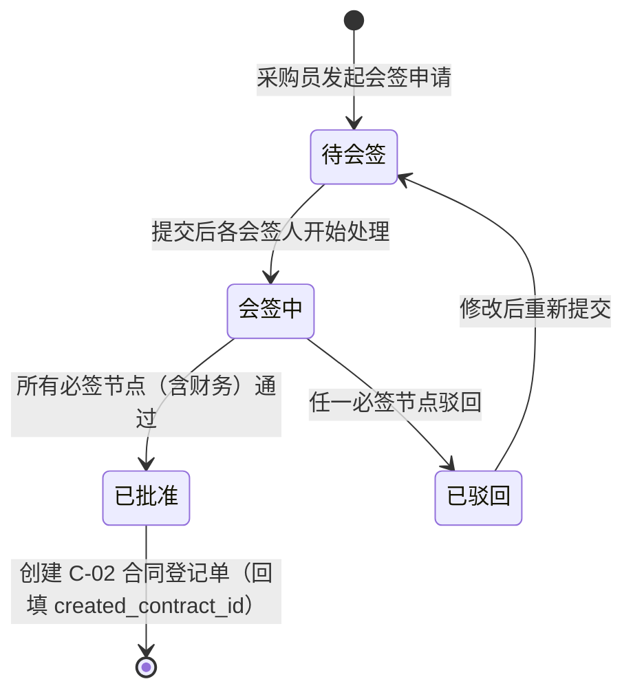
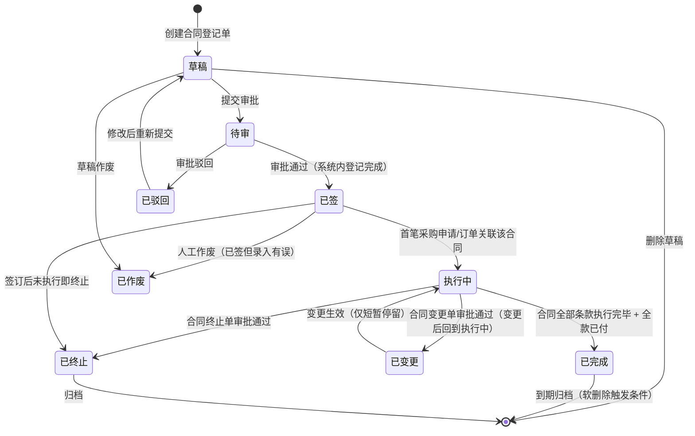
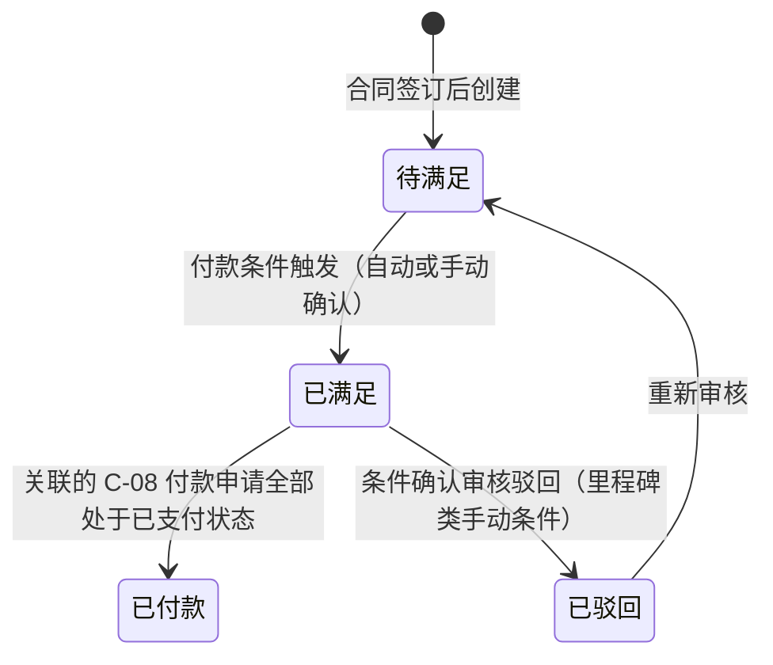
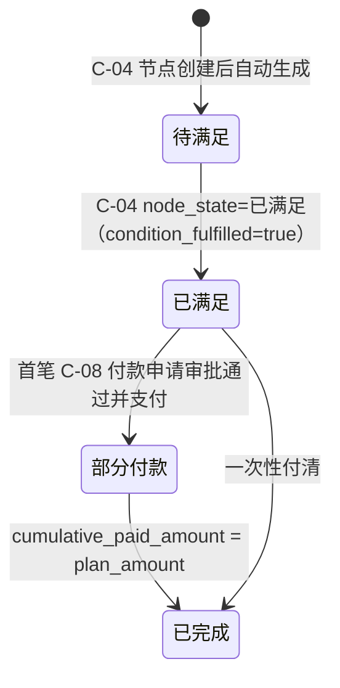
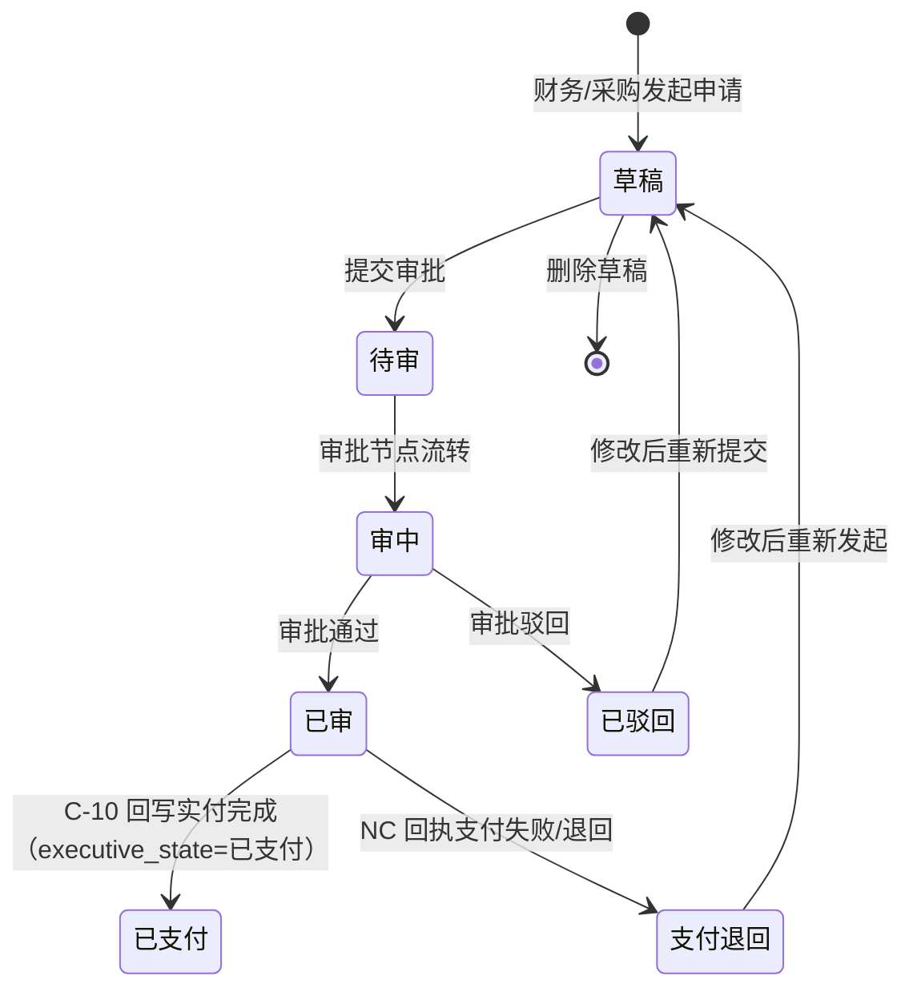
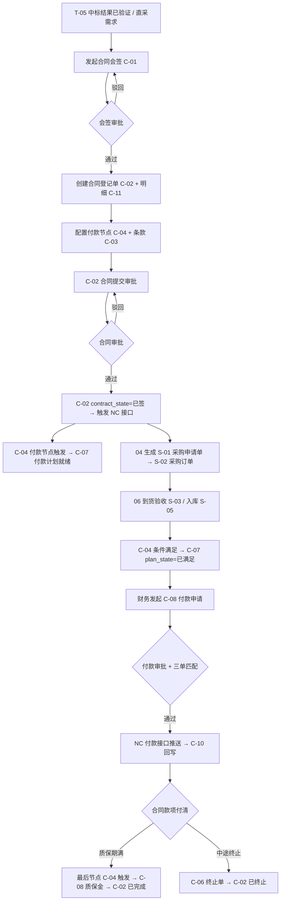
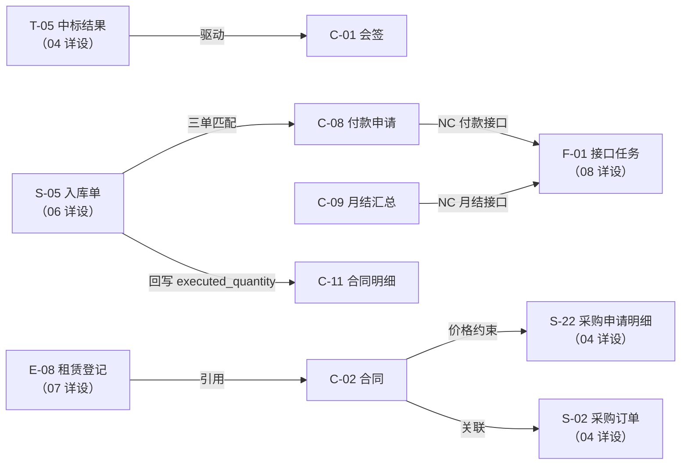
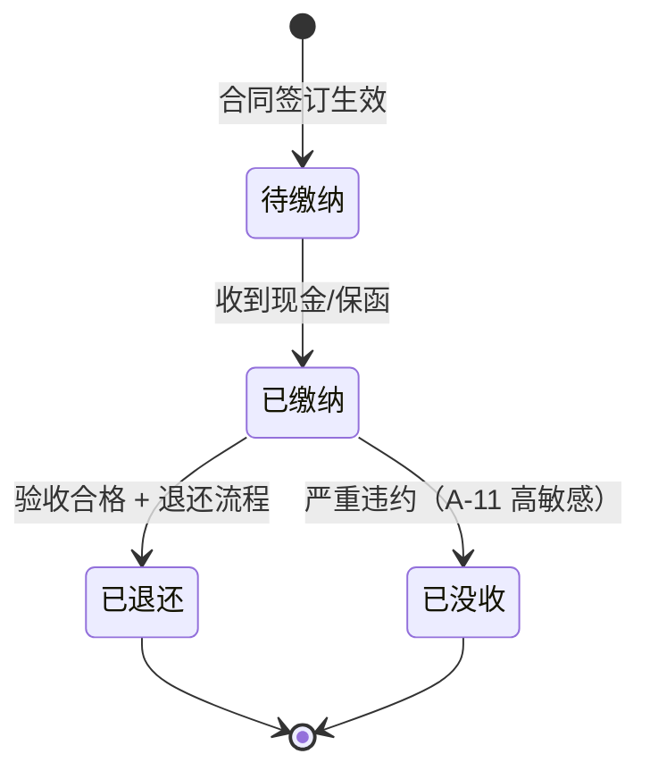

# 合同与资金详细设计（V1.2）

**版本：** V1.2
**日期：** 2026-05-13
**文档性质：** 详细设计层 · 模块详设第五篇
**适用阶段：** 详细设计执行、开发实施、联调测试

---

## 一、文档目的

本文档承接 `01-数据库逻辑模型-V1.0.md` 跨模块骨架与 `04-需求计划与采购协同详细设计-V1.1.md` 的上游协同，把合同与资金模块涉及的 11 个实体的全字段、状态机、业务规则、接口规范、配置项和占位项固化下来。

本文档重点回答：

- 合同从中标结果/直签到执行中/终止的完整生命周期（C-02 8 状态机）
- 合同会签（C-01）与合同登记（C-02）的分离设计及财务必参约束
- 合同条款（C-03）、付款节点（C-04）、付款计划（C-07）、付款申请（C-08）的四层付款控制链路
- 合同变更单（C-05）与终止单（C-06）的变更留痕与状态联动
- 付款执行台账（C-10）的 NC 实付回写与支付异常处理
- 月度预支付汇总（C-09）的批处理生成与 NC 接口口径
- NC 未落地阶段的付款接口过渡策略

本文档**不**做以下事：

- 不写采购申请单、采购订单、到货入库等收货侧流程（属 04 / 06 详设）
- 不写 NC 凭证科目规则、接口推送报文细节（属 08 详设）
- 不写设备租赁合同（E-08 rental_registration 属 07 详设，但会引用 C-02）
- 不写物料主数据、供应商档案（属 03 / 04 详设）
- 不写 SQL DDL 与页面交互

---

## 二、设计输入

| 输入文档 | 在本文档中的作用 |
| --- | --- |
| `docs/详细设计/01-数据库逻辑模型-V1.0.md` | 实体编号 C-01~C-11；共用约定 4.1-4.10；合同域状态值域节八；口径冲突处理节十二 |
| `docs/详细设计/04-需求计划与采购协同详细设计-V1.1.md` | T-05 中标结果驱动合同；S-01 合同执行来源；S-02 NC 接口触发点与合同约束；M-09 供应商状态约束 |
| `docs/概要设计/02-业务模块概要设计-v0.1.md` 节 5.4 | 合同与资金模块定位、付款节点管控、发票管理原则 |
| `docs/详细规则/物资管理与财务接口规范.md` | 付款接口字段、NC 预付/付款凭证推送规则、暂估冲销时序 |
| `docs/需求梳理/04-待确认事项清单.md` 第 3/6/7/15/16/21/22 项 | 合同金额变更阈值、付款条件类型、预付款比例、发票三单匹配、月度付款汇总口径 |
| `docs/需求梳理/14-NC映射与科目配置模板-V1.0.md` | NC 付款接口映射字段、科目配置、状态字典 |
| `docs/集团统筹/集团业务系统统一建设原则-V2.0.md` | 独立数据库、PG 兼容、API+JSON、SSO 约束 |

---

## 三、模块范围

### 3.1 本篇覆盖实体

| 实体编号 | 英文名 | 中文名 | 本篇覆盖深度 |
| --- | --- | --- | --- |
| C-01 | contract_approval | 合同审批会签单 | 全字段、状态机、财务必参约束 |
| C-02 | contract | 合同登记单 | 全字段、8 状态机、来源追溯、NC 接口触发 |
| C-03 | contract_clause | 合同条款 | 全字段、条款类型字典、变更联动 |
| C-04 | contract_payment_node | 合同付款节点 | 全字段、状态机、条件满足校验 |
| C-05 | contract_change | 合同变更单 | 全字段、变更类型、金额阈值升级 |
| C-06 | contract_termination | 合同终止单 | 全字段、终止类型、高敏感约束 |
| C-07 | payment_plan | 付款计划 | 全字段、状态机、由付款节点驱动生成 |
| C-08 | payment_request | 付款申请单 | 全字段、状态机、三单匹配、NC 接口触发 |
| C-09 | monthly_prepayment_summary | 月度预支付汇总 | 全字段、批处理生成规则、NC 接口 |
| C-10 | payment_execution | 付款执行台账 | 全字段、NC 实付回写、支付异常 |
| C-11 | contract_line | 合同明细 | 全字段、价格约束、与采购订单的对应关系 |

### 3.2 不在本篇覆盖

| 实体 | 承接位置 |
| --- | --- |
| T-05 tender_result（驱动合同登记的上游） | 04 需求计划与采购协同详细设计 |
| S-02 purchase_order（合同执行的下游） | 04 详设（已覆盖合同关联字段） |
| S-05 purchase_receipt（发票到货验收） | 06 库存实物流转详细设计 |
| E-08 rental_registration（设备租赁合同引用 C-02） | 07 设备与设备租赁详细设计 |
| F-01 接口任务、F-12 NC 凭证科目规则 | 08 财务与 NC 接口详细设计 |

### 3.3 共用约定继承

本篇所有实体表默认遵守 `01-V1.0` 节四的共用约定（主键策略、审计字段、软删除、业务状态字段、NC 接口字段、工作流字段、时间戳字段、多租户字段、附件字段、主表/明细表原则）。下文字段表中**不重复列出**共用字段；如某实体对共用约定有偏差，在该实体的"特别说明"中显式注明。

---

## 四、数据模型

### 4.1 C-01 contract_approval 合同审批会签单

#### 4.1.1 全字段表

| 字段名 | 类型 | 长度/精度 | 空值 | 默认值 | 唯一 | 外键 | 索引建议 | 注释 |
| --- | --- | --- | --- | --- | --- | --- | --- | --- |
| `approval_id` | bigint | — | NOT NULL | auto | PK | — | PK | 技术主键 |
| `approval_no` | varchar | 32 | NOT NULL | — | UQ | — | UQ | 前缀 `CA`（SY-01 取号） |
| `org_id` | bigint | — | NOT NULL | — | — | FK→M-01 | idx | 归属组织 |
| `supplier_id` | bigint | — | NOT NULL | — | — | FK→M-09 | idx | 拟签合同供应商 |
| `tender_result_id` | bigint | — | NULL | — | — | FK→T-05 | idx | 来源中标结果（招采路径时必填） |
| `contract_type` | varchar | 32 | NOT NULL | — | — | — | idx | 取值：采购合同 / 服务合同 / 租赁合同 / 框架合同 / 补充协议 |
| `contract_amount` | decimal | (18,2) | NOT NULL | — | — | — | — | 拟签合同金额 |
| `contract_summary` | varchar | 512 | NOT NULL | — | — | — | — | 合同内容摘要（标的物或服务描述） |
| `payment_terms_desc` | varchar | 255 | NULL | — | — | — | — | 付款条件说明 |
| `finance_approver_id` | bigint | — | NULL | — | — | FK→A-01 | — | 财务会签人（必须有财务角色） |
| `finance_approve_date` | date | — | NULL | — | — | — | — | 财务会签日期 |
| `finance_approve_comment` | varchar | 255 | NULL | — | — | — | — | 财务会签意见 |
| `legal_approver_id` | bigint | — | NULL | — | — | FK→A-01 | — | 法务会签人（可选） |
| `contract_approval_state` | varchar | 16 | NOT NULL | `待会签` | — | — | idx | 取值：待会签 / 会签中 / 已批准 / 已驳回（见 4.1.2） |
| `created_contract_id` | bigint | — | NULL | — | — | FK→C-02 | idx | 审批通过后创建的合同（回填） |
| `workflow_instance_id` | bigint | — | NULL | — | — | FK→A-20 | idx | 审批实例 |
| `current_node_id` | bigint | — | NULL | — | — | FK→A-09 | — | 当前节点 |
| `approval_chain` | text | — | NULL | — | — | — | — | 审批链路 JSON |
| `approval_deadline` | timestamp | — | NULL | — | — | — | — | 审批截止时间 |
| `escalation_flag` | boolean | — | NOT NULL | false | — | — | — | 是否已升级 |

#### 4.1.2 状态机



#### 4.1.3 业务规则

1. **财务必参**：`contract_approval_state=会签中` 时，必须存在一个 `finance_approver_id` 不为空且具有"财务会签"角色的节点；未完成财务会签不允许切换到 `已批准`
2. **金额分级**：`contract_amount` 超过 SY-02 `CONTRACT_LEGAL_REVIEW_THRESHOLD`（`[待业务确认]`）时，法务节点（`legal_approver_id`）自动加入会签链路
3. **1 对 1**：一份 C-01 会签单对应一份 C-02 合同；`created_contract_id` 回填后 C-01 不允许再次提交

---

### 4.2 C-02 contract 合同登记单

#### 4.2.1 全字段表

| 字段名 | 类型 | 长度/精度 | 空值 | 默认值 | 唯一 | 外键 | 索引建议 | 注释 |
| --- | --- | --- | --- | --- | --- | --- | --- | --- |
| `contract_id` | bigint | — | NOT NULL | auto | PK | — | PK | 技术主键 |
| `contract_no` | varchar | 32 | NOT NULL | — | UQ | — | UQ | 前缀 `CT`（SY-01 取号） |
| `org_id` | bigint | — | NOT NULL | — | — | FK→M-01 | idx | 归属组织 |
| `supplier_id` | bigint | — | NOT NULL | — | — | FK→M-09 | idx | 供应商；必须 `supplier_state=合格` |
| `approval_id` | bigint | — | NULL | — | — | FK→C-01 | idx | 来源会签单（招采/正式路径必填；直签小额合同允许为空） |
| `tender_result_id` | bigint | — | NULL | — | — | FK→T-05 | idx | 来源中标结果 |
| `purchase_plan_id` | bigint | — | NULL | — | — | FK→P-02 | idx | 关联采购计划 |
| `contract_type` | varchar | 32 | NOT NULL | — | — | — | idx | 取值：采购合同 / 服务合同 / 租赁合同 / 框架合同 / 补充协议 |
| `parent_contract_id` | bigint | — | NULL | — | — | FK→C-02 | idx | 父合同（补充协议时指向主合同） |
| `contract_name` | varchar | 255 | NOT NULL | — | — | — | idx | 合同名称 |
| `contract_amount` | decimal | (18,2) | NOT NULL | — | — | — | — | 合同总金额（含税） |
| `tax_amount` | decimal | (18,2) | NOT NULL | 0 | — | — | — | 合同税额 |
| `contract_amount_excl_tax` | decimal | (18,2) | NOT NULL | — | — | — | — | 合同不含税金额 |
| `currency` | varchar | 8 | NOT NULL | `CNY` | — | — | — | 币种（一期默认人民币） |
| `contract_date` | date | — | NOT NULL | — | — | — | idx | 签订日期 |
| `effective_date` | date | — | NOT NULL | — | — | — | idx | 合同生效日期 |
| `expiry_date` | date | — | NULL | — | — | — | idx | 合同到期日期（NULL 表示无固定期限） |
| `expected_delivery_date` | date | — | NULL | — | — | — | — | 整体预计到货完成日期 |
| `delivery_address` | varchar | 255 | NULL | — | — | — | — | 主交货地址 |
| `payment_terms` | varchar | 32 | NOT NULL | — | — | — | idx | 取值：预付款 / 到货付款 / 验收付款 / 分期付款 / 月结（见 4.2.4） |
| `prepayment_ratio` | decimal | (5,4) | NULL | — | — | — | — | 预付款比例（payment_terms=预付款 或 分期付款 时填写） |
| `quality_warranty_period` | integer | — | NULL | — | — | — | — | 质保期（天）；NULL 表示无质保期 |
| `warranty_retention_ratio` | decimal | (5,4) | NULL | — | — | — | — | 质保金比例（有质保期时填写） |
| `contract_file_attachment_id` | bigint | — | NULL | — | — | FK→SY-04 | — | 合同扫描件/PDF |
| `contract_state` | varchar | 16 | NOT NULL | `草稿` | — | — | idx | 见 4.2.2 |
| `signed_date` | date | — | NULL | — | — | — | — | 实际签订日期（双方签字盖章后回填） |
| `executed_amount` | decimal | (18,2) | NOT NULL | 0 | — | — | — | 已执行金额（由订单/入库回写，不手工维护） |
| `paid_amount` | decimal | (18,2) | NOT NULL | 0 | — | — | — | 累计已付金额（由 C-10 回写） |
| `is_framework` | boolean | — | NOT NULL | false | — | — | idx | 是否框架合同（is_framework=true 时可按框架循环采购） |
| `framework_expiry_date` | date | — | NULL | — | — | — | — | 框架合同有效期（is_framework=true 时填写） |
| `interface_push_state` | varchar | 16 | NOT NULL | `待推送` | — | — | idx | 接口推送状态 |
| `nc_voucher_no` | varchar | 64 | NULL | — | — | — | — | NC 凭证号 |
| `last_push_time` | timestamp | — | NULL | — | — | — | — | 最后推送时间 |
| `push_error_code` | varchar | 32 | NULL | — | — | — | — | 推送错误码 |
| `push_error_message` | varchar | 256 | NULL | — | — | — | — | 推送错误描述 |
| `idempotent_key` | varchar | 128 | NULL | — | UQ | — | UQ | 幂等键（interface_code + contract_no + org_code） |
| `workflow_instance_id` | bigint | — | NULL | — | — | FK→A-20 | idx | 审批实例（合同登记审批） |
| `current_node_id` | bigint | — | NULL | — | — | FK→A-09 | — | 当前节点 |
| `approval_chain` | text | — | NULL | — | — | — | — | 审批链路 JSON |
| `approval_deadline` | timestamp | — | NULL | — | — | — | — | 审批截止时间 |
| `escalation_flag` | boolean | — | NOT NULL | false | — | — | — | 是否已升级 |
| `bond_required` | boolean | — | NOT NULL | false | — | — | idx | 是否需履约保证金（V1.2 §8.6.1 自动判定：金额 ≥20 万 + 竞争性方式） |
| `bond_amount` | decimal | (18,2) | NULL | — | — | — | — | 履约保证金金额（= 合同总额 × bond_ratio，V1.2 §8.6.2） |
| `bond_form` | varchar | 20 | NULL | — | — | — | — | 缴纳形式：`CASH` / `BANK_GUARANTEE`（V1.2 §8.6.3） |
| `bond_state` | varchar | 16 | NULL | — | — | — | idx | 状态：待缴纳 / 已缴纳 / 已退还 / 已没收（V1.2 §8.6.5） |
| `bond_paid_date` | date | — | NULL | — | — | — | — | 实际缴纳日期 |
| `bond_release_date` | date | — | NULL | — | — | — | — | 退还日期 |
| `bond_release_trigger` | varchar | 32 | NULL | — | — | — | — | 退还触发：`ACCEPTANCE_PASSED` / `MANUAL` |
| `service_subtype` | varchar | 32 | NULL | — | — | — | idx | 服务合同子类型（外委检修 / 其他服务，V1.2 §8.7 价格上限规则联动） |
| `remarks` | varchar | 255 | NULL | — | — | — | — | 备注 |

#### 4.2.2 状态机（8 状态）



状态迁移约束：

- `待审 → 已签`：**审批通过后才允许进入"已签"状态，意味着此时双方已完成签字盖章**（业务方 Q-04-1 答复 2026-05-09 + 政策 05 第十七条第十四项 + 第二十六条）。系统校验：`待审 → 已签` 状态机迁移须满足 ① `contract_approval_state=已批准`；② `seal_state=双方盖章`；③ `signature_state=双方签字`；任一项缺失阻断状态推进，提示业务员先完成盖章签字
- `已签 → 执行中`：系统自动触发，不需人工操作；关联 S-02 采购订单下达后即驱动
- `执行中 → 已完成`：须满足：① 所有 S-02 `order_state=全部到货/已关闭`；② `paid_amount ≥ contract_amount × (1 - warranty_retention_ratio)`（质保金留存期内允许 < 100%）
- `执行中 → 已变更`：仅在 C-05 合同变更单 `change_state=已审` 后瞬时切换，变更生效后自动回到 `执行中`
- `执行中/已签 → 已终止`：须 C-06 终止单审批通过；已付款部分按结算条款处理
- `已作废`：仅允许在 `草稿/已签`（且未执行、未付款）状态下操作；属高敏感操作，须物资管理审批

#### 4.2.3 业务规则

1. **会签前置**：`contract_amount ≥ SY-02 CONTRACT_APPROVAL_THRESHOLD`（`[待业务确认]`，预设 XX 万元）时，C-01 会签单必须存在且 `contract_approval_state=已批准`，才允许创建 C-02；小额直签合同 `approval_id` 可为空但须加审节点
2. **供应商状态约束**：`contract_state=已签/执行中` 期间，若 `M-09.supplier_state` 变为黑名单，不自动终止合同，但触发提醒；合同须在下一付款节点前由物资管理决策
3. **框架合同**：`is_framework=true` 时，S-01/S-02 可在 `framework_expiry_date` 有效期内循环关联该合同采购，不要求每次走招采流程；订单金额累计不超过 `contract_amount`（超出须走 C-05 变更扩额）
4. **NC 接口触发**：`contract_state=已签` 后触发 F-01 接口任务推送合同登记至 NC（NC 未落地阶段 F-13 开关关闭）
5. **价格权威**：C-11 `unit_price` 是下游 S-22 `unit_price` 的价格上限权威来源；变更后的价格以最新 C-05 变更单为准

#### 4.2.4 付款条件字典

| payment_terms | 含义 | 付款节点典型设置 |
| --- | --- | --- |
| `预付款` | 合同签订后先支付预付款 | 节点 1：签订后 N 天，百分比 P% |
| `到货付款` | 货到验收后付款 | 节点 1：到货验收后 N 天，100% |
| `验收付款` | 质检/验收合格后付款 | 节点 1：验收合格后 N 天，100% |
| `分期付款` | 按里程碑分多期 | 节点 1~N：各百分比之和 = 100% |
| `月结` | 每月末汇总结算 | 驱动 C-09 月度预支付汇总 |

---

### 4.3 C-03 contract_clause 合同条款

#### 4.3.1 全字段表

| 字段名 | 类型 | 长度/精度 | 空值 | 默认值 | 唯一 | 外键 | 索引建议 | 注释 |
| --- | --- | --- | --- | --- | --- | --- | --- | --- |
| `clause_id` | bigint | — | NOT NULL | auto | PK | — | PK | 技术主键 |
| `contract_id` | bigint | — | NOT NULL | — | — | FK→C-02 | idx | 所属合同 |
| `clause_type` | varchar | 32 | NOT NULL | — | — | — | idx | 见 4.3.2 条款类型字典 |
| `clause_title` | varchar | 128 | NOT NULL | — | — | — | — | 条款标题 |
| `clause_content` | text | NOT NULL | — | — | — | — | — | 条款内容（富文本或 Markdown） |
| `is_key_clause` | boolean | — | NOT NULL | false | — | — | idx | 是否关键条款（如价格/质保/违约，需高亮显示） |
| `effective_date` | date | — | NULL | — | — | — | — | 条款生效日期（NULL 表示跟随合同生效日期） |
| `termination_date` | date | — | NULL | — | — | — | — | 条款终止日期 |
| `change_source_id` | bigint | — | NULL | — | — | FK→C-05 | — | 被哪次变更修改（C-05 变更单 ID；NULL 表示原始条款） |
| `is_superseded` | boolean | — | NOT NULL | false | — | — | idx | 是否已被新版本替代（被 C-05 变更后旧条款置为 true） |
| `display_order` | smallint | — | NOT NULL | 0 | — | — | — | 显示顺序 |
| `remarks` | varchar | 255 | NULL | — | — | — | — | 备注 |

**特别说明**：C-03 不带独立业务状态字段；条款是否有效由 `is_superseded` 与合同 `contract_state` 共同决定。软删除保留，不允许物理删除。

#### 4.3.2 条款类型字典（SY-03 dict_code=`CONTRACT_CLAUSE_TYPE`）

| clause_type | 含义 | 是否关键条款默认 |
| --- | --- | --- |
| `价格条款` | 单价、总价、调价机制 | 是 |
| `交货条款` | 交货期、交货地点、验收标准 | 是 |
| `付款条款` | 付款方式、节点、发票要求 | 是 |
| `质保条款` | 质保期、质保金比例、缺陷责任 | 是 |
| `违约条款` | 违约责任、赔偿标准 | 是 |
| `变更条款` | 变更程序约定 | 否 |
| `保密条款` | 保密义务 | 否 |
| `争议解决` | 仲裁或诉讼方式 | 否 |
| `其他条款` | 不在以上类型的其他约定 | 否 |

---

### 4.4 C-04 contract_payment_node 合同付款节点

#### 4.4.1 全字段表

| 字段名 | 类型 | 长度/精度 | 空值 | 默认值 | 唯一 | 外键 | 索引建议 | 注释 |
| --- | --- | --- | --- | --- | --- | --- | --- | --- |
| `node_id` | bigint | — | NOT NULL | auto | PK | — | PK | 技术主键 |
| `contract_id` | bigint | — | NOT NULL | — | — | FK→C-02 | idx | 所属合同 |
| `payment_node_no` | smallint | — | NOT NULL | — | — | — | idx | 节点序号（1 起，同合同内唯一） |
| `payment_condition` | varchar | 32 | NOT NULL | — | — | — | idx | 付款触发条件（见 4.4.2 条件字典） |
| `condition_desc` | varchar | 255 | NULL | — | — | — | — | 条件详细说明（如"到货验收合格后 30 日内"） |
| `payment_percentage` | decimal | (5,4) | NOT NULL | — | — | — | — | 本节点付款比例（各节点之和应 = 1.0） |
| `payment_amount` | decimal | (18,2) | NOT NULL | — | — | — | — | 本节点付款金额（= contract_amount × payment_percentage） |
| `due_date` | date | — | NULL | — | — | — | idx | 节点截止付款日期（条件触发后的付款期限） |
| `condition_check_date` | date | — | NULL | — | — | — | — | 条件满足确认日期（系统或人工标记） |
| `condition_source_bill_type` | varchar | 32 | NULL | — | — | — | — | 条件关联单据类型（如 purchase_receipt / tender_result） |
| `condition_source_bill_id` | bigint | — | NULL | — | — | — | idx | 条件关联单据 ID（触发该节点的业务单据） |
| `node_state` | varchar | 16 | NOT NULL | `待满足` | — | — | idx | 取值：待满足 / 已满足 / 已付款 / 已驳回（见 4.4.3） |
| `payment_plan_id` | bigint | — | NULL | — | — | FK→C-07 | idx | 关联付款计划（条件满足后生成，回填） |
| `remarks` | varchar | 255 | NULL | — | — | — | — | 备注 |

**唯一约束**：`(contract_id, payment_node_no)` 复合唯一

**校验约束**：同一合同所有节点的 `payment_percentage` 之和须 = 1.0（含质保金节点）

#### 4.4.2 付款条件字典（SY-03 dict_code=`PAYMENT_CONDITION`）

| payment_condition | 触发机制 | 自动/手动 |
| --- | --- | --- |
| `合同签订` | C-02 `contract_state=已签` | 自动 |
| `到货验收` | S-03 `goods_receipt_state=已验收` | 自动（关联 S-03.receipt_id） |
| `入库完成` | S-05 `purchase_receipt_state=已审`（入库审核通过） | 自动（关联 S-05.receipt_id） |
| `发票到达` | S-05 `is_invoice_arrived=已到` | 自动或手动标记 |
| `质保期满` | 当前日期 ≥ `C-02.signed_date + quality_warranty_period` | 自动（每日凌晨任务） |
| `里程碑确认` | 人工确认（项目进度里程碑，服务合同常用） | 手动 |
| `月结汇总` | 由 C-09 月度预支付汇总驱动 | 自动（月末批处理） |

#### 4.4.3 状态机



---

### 4.5 C-05 contract_change 合同变更单

#### 4.5.1 全字段表

| 字段名 | 类型 | 长度/精度 | 空值 | 默认值 | 唯一 | 外键 | 索引建议 | 注释 |
| --- | --- | --- | --- | --- | --- | --- | --- | --- |
| `change_id` | bigint | — | NOT NULL | auto | PK | — | PK | 技术主键 |
| `change_no` | varchar | 32 | NOT NULL | — | UQ | — | UQ | 前缀 `CC`（SY-01 取号） |
| `contract_id` | bigint | — | NOT NULL | — | — | FK→C-02 | idx | 被变更的合同 |
| `change_seq` | smallint | — | NOT NULL | — | — | — | idx | 变更序号（同一合同第 N 次变更，1 起） |
| `change_type` | varchar | 32 | NOT NULL | — | — | — | idx | 取值：金额变更 / 数量变更 / 价格变更 / 交期变更 / 付款条件变更 / 供应商信息变更 / 综合变更 |
| `change_reason` | varchar | 512 | NOT NULL | — | — | — | — | 变更原因 |
| `change_detail_json` | text | NOT NULL | — | — | — | — | — | 变更明细 JSON（before/after 对比，记录变更字段、旧值、新值） |
| `old_contract_amount` | decimal | (18,2) | NULL | — | — | — | — | 变更前合同金额（金额变更时填写） |
| `new_contract_amount` | decimal | (18,2) | NULL | — | — | — | — | 变更后合同金额 |
| `amount_delta` | decimal | (18,2) | NULL | — | — | — | — | 金额变化量（= new - old，允许负值） |
| `effective_date` | date | — | NULL | — | — | — | — | 变更生效日期 |
| `supplier_confirm_date` | date | — | NULL | — | — | — | — | 供应商书面确认日期 |
| `change_state` | varchar | 16 | NOT NULL | `草稿` | — | — | idx | 取值：草稿 / 待审 / 已审 / 已驳回 / 已作废 |
| `workflow_instance_id` | bigint | — | NULL | — | — | FK→A-20 | idx | 审批实例 |
| `current_node_id` | bigint | — | NULL | — | — | FK→A-09 | — | 当前节点 |
| `approval_chain` | text | — | NULL | — | — | — | — | 审批链路 JSON |
| `approval_deadline` | timestamp | — | NULL | — | — | — | — | 审批截止时间 |
| `escalation_flag` | boolean | — | NOT NULL | false | — | — | — | 是否已升级 |

#### 4.5.2 业务规则

1. **金额变更阈值**：`change_type=金额变更` 且 `amount_delta > SY-02 CONTRACT_CHANGE_MAJOR_THRESHOLD`（`[待业务确认]`）时，审批节点升级至项目领导小组
2. **变更生效**：`change_state=已审` 后，服务层自动更新 C-02 对应字段（以 `change_detail_json` 中的 after 值为准），并更新 C-03 对应条款（`is_superseded=true` 旧条款，创建新条款 `change_source_id = change_id`）
3. **付款节点联动**：`change_type=付款条件变更` 生效后，须同步修订 C-04 节点的 `payment_percentage / payment_amount / due_date`；已处于 `已满足/已付款` 状态的节点不允许修改
4. **合同金额上限**：变更后 `C-02.contract_amount` 不允许低于已执行金额（`executed_amount`）

---

### 4.6 C-06 contract_termination 合同终止单

#### 4.6.1 全字段表

| 字段名 | 类型 | 长度/精度 | 空值 | 默认值 | 唯一 | 外键 | 索引建议 | 注释 |
| --- | --- | --- | --- | --- | --- | --- | --- | --- |
| `term_id` | bigint | — | NOT NULL | auto | PK | — | PK | 技术主键 |
| `term_no` | varchar | 32 | NOT NULL | — | UQ | — | UQ | 前缀 `TN`（SY-01 取号） |
| `contract_id` | bigint | — | NOT NULL | — | — | FK→C-02 | idx | 被终止的合同 |
| `termination_type` | varchar | 32 | NOT NULL | — | — | — | idx | 取值：协议终止 / 违约终止 / 不可抗力终止 / 监管要求终止 |
| `termination_reason` | text | NOT NULL | — | — | — | — | — | 终止原因（详细描述） |
| `termination_date` | date | — | NOT NULL | — | — | — | idx | 生效终止日期 |
| `settlement_amount` | decimal | (18,2) | NULL | — | — | — | — | 结算金额（已执行部分的实际结算额） |
| `penalty_amount` | decimal | (18,2) | NULL | 0 | — | — | — | 违约金金额（违约终止时填写） |
| `supplier_confirm_required` | boolean | — | NOT NULL | true | — | — | — | 是否需要供应商书面确认 |
| `supplier_confirm_date` | date | — | NULL | — | — | — | — | 供应商书面确认日期 |
| `approved_by` | bigint | — | NULL | — | — | FK→A-01 | — | 审批人 |
| `termination_state` | varchar | 16 | NOT NULL | `草稿` | — | — | idx | 取值：草稿 / 待审 / 已审 / 已驳回 |
| `workflow_instance_id` | bigint | — | NULL | — | — | FK→A-20 | idx | 审批实例 |
| `current_node_id` | bigint | — | NULL | — | — | FK→A-09 | — | 当前节点 |
| `approval_chain` | text | — | NULL | — | — | — | — | 审批链路 JSON |
| `approval_deadline` | timestamp | — | NULL | — | — | — | — | 审批截止时间 |
| `escalation_flag` | boolean | — | NOT NULL | false | — | — | — | 是否已升级 |

#### 4.6.2 业务规则

1. **高敏感操作**：`termination_type=违约终止` 须走 A-11 高敏感记录；审批节点须含物资管理 + 法务
2. **未结单据处理**：终止申请提交前系统检查并提示：① 未关闭的 S-02 采购订单；② 未完成的 C-07 付款计划；③ 未处理的 C-08 付款申请——系统提示但不阻断；审批通过后须人工处置这些单据
3. **终止生效**：`termination_state=已审` 后，服务层将 `C-02.contract_state` 改为 `已终止`，同时将所有状态为 `待满足` 的 C-04 节点标记为 `已驳回`（以结算金额为准）

---

### 4.7 C-07 payment_plan 付款计划

#### 4.7.1 全字段表

| 字段名 | 类型 | 长度/精度 | 空值 | 默认值 | 唯一 | 外键 | 索引建议 | 注释 |
| --- | --- | --- | --- | --- | --- | --- | --- | --- |
| `plan_id` | bigint | — | NOT NULL | auto | PK | — | PK | 技术主键 |
| `contract_id` | bigint | — | NOT NULL | — | — | FK→C-02 | idx | 所属合同 |
| `payment_node_id` | bigint | — | NOT NULL | — | — | FK→C-04 | idx | 来源付款节点 |
| `plan_amount` | decimal | (18,2) | NOT NULL | — | — | — | — | 本次计划应付金额 |
| `cumulative_paid_amount` | decimal | (18,2) | NOT NULL | 0 | — | — | — | 本计划已累计付款金额（由 C-10 回写） |
| `remaining_amount` | decimal | (18,2) | NOT NULL | — | — | — | — | 剩余应付金额（= plan_amount - cumulative_paid_amount） |
| `condition_fulfilled` | boolean | — | NOT NULL | false | — | — | idx | 付款条件是否已满足（由 C-04 状态联动） |
| `due_date` | date | — | NULL | — | — | — | idx | 付款期限日期 |
| `plan_state` | varchar | 16 | NOT NULL | `待满足` | — | — | idx | 取值：待满足 / 已满足 / 部分付款 / 已完成（见 4.7.2） |

**唯一约束**：`(contract_id, payment_node_id)` 复合唯一（一个付款节点对应一个付款计划）

#### 4.7.2 状态机



#### 4.7.3 业务规则

1. **自动生成**：C-04 付款节点创建时由系统同步创建对应的 C-07 付款计划；不允许手工独立新建
2. **超期预警**：`plan_state IN ('已满足','部分付款')` 且 `due_date < TODAY + SY-02 PAYMENT_DUE_ALERT_DAYS`（默认 7 天）时触发 R-04 预警（`PAYMENT_DUE_NEAR`），通知财务和采购负责人
3. **质保金**：`C-04` 中最后一个节点（质保金节点）的 `payment_condition=质保期满`；`C-07` 对应的 `plan_state=待满足` 直到质保期自动触发

---

### 4.8 C-08 payment_request 付款申请单

#### 4.8.1 全字段表

| 字段名 | 类型 | 长度/精度 | 空值 | 默认值 | 唯一 | 外键 | 索引建议 | 注释 |
| --- | --- | --- | --- | --- | --- | --- | --- | --- |
| `request_id` | bigint | — | NOT NULL | auto | PK | — | PK | 技术主键 |
| `request_no` | varchar | 32 | NOT NULL | — | UQ | — | UQ | 前缀 `PA`（SY-01 取号） |
| `contract_id` | bigint | — | NOT NULL | — | — | FK→C-02 | idx | 所属合同 |
| `supplier_id` | bigint | — | NOT NULL | — | — | FK→M-09 | idx | 供应商 |
| `payment_plan_id` | bigint | — | NOT NULL | — | — | FK→C-07 | idx | 关联付款计划 |
| `payment_node_id` | bigint | — | NOT NULL | — | — | FK→C-04 | idx | 关联付款节点 |
| `org_id` | bigint | — | NOT NULL | — | — | FK→M-01 | idx | 归属组织 |
| `request_amount` | decimal | (18,2) | NOT NULL | — | — | — | — | 申请付款金额 |
| `invoice_no` | varchar | 64 | NULL | — | — | — | idx | 发票号码（开增值税专用发票时必填） |
| `invoice_date` | date | — | NULL | — | — | — | — | 发票日期 |
| `invoice_amount` | decimal | (18,2) | NULL | — | — | — | — | 发票金额 |
| `invoice_tax_rate` | decimal | (5,4) | NULL | — | — | — | — | 发票税率 |
| `receipt_check` | boolean | — | NOT NULL | false | — | — | — | 是否已完成三单匹配核查（合同/入库/发票） |
| `receipt_check_date` | date | — | NULL | — | — | — | — | 三单匹配核查日期 |
| `receipt_check_by` | bigint | — | NULL | — | — | FK→A-01 | — | 核查人 |
| `source_bill_type` | varchar | 32 | NULL | — | — | — | — | 关联触发单据类型（如 purchase_receipt, tender_result） |
| `source_bill_id` | bigint | — | NULL | — | — | — | idx | 关联触发单据 ID |
| `is_prepayment` | boolean | — | NOT NULL | false | — | — | idx | 是否预付款（payment_condition=合同签订 时通常为 true） |
| `approval_state` | varchar | 16 | NOT NULL | `草稿` | — | — | idx | 见 4.8.2 |
| `interface_push_state` | varchar | 16 | NOT NULL | `待推送` | — | — | idx | 接口推送状态 |
| `nc_voucher_no` | varchar | 64 | NULL | — | — | — | — | NC 凭证号（付款凭证） |
| `last_push_time` | timestamp | — | NULL | — | — | — | — | 最后推送时间 |
| `push_error_code` | varchar | 32 | NULL | — | — | — | — | 推送错误码 |
| `push_error_message` | varchar | 256 | NULL | — | — | — | — | 推送错误描述 |
| `idempotent_key` | varchar | 128 | NULL | — | UQ | — | UQ | 幂等键（interface_code + request_no + org_code） |
| `workflow_instance_id` | bigint | — | NULL | — | — | FK→A-20 | idx | 审批实例 |
| `current_node_id` | bigint | — | NULL | — | — | FK→A-09 | — | 当前节点 |
| `approval_chain` | text | — | NULL | — | — | — | — | 审批链路 JSON |
| `approval_deadline` | timestamp | — | NULL | — | — | — | — | 审批截止时间 |
| `escalation_flag` | boolean | — | NOT NULL | false | — | — | — | 是否已升级 |
| `finance_state` | varchar | 16 | NOT NULL | `未接收` | — | — | idx | NC 财务回执状态 |
| `remarks` | varchar | 255 | NULL | — | — | — | — | 备注 |

#### 4.8.2 状态机



状态迁移约束：

- `草稿 → 待审`：必须先完成三单匹配（`receipt_check=true`）；预付款类型（`is_prepayment=true`）豁免三单匹配
- `已审`：触发 F-01 接口任务推送 NC 付款接口（NC 未落地阶段 F-13 开关关闭）
- `已审 → 已支付`：由 NC 回执（F-03）触发 C-10 记录更新，再回写本字段

#### 4.8.3 三单匹配规则

| 匹配维度 | 说明 | 校验逻辑 |
| --- | --- | --- |
| 合同匹配 | 付款申请金额须在合同范围内 | `request_amount ≤ C-07.remaining_amount` |
| 入库匹配 | 非预付款类型须有对应的已审入库单 | `S-05.purchase_receipt_state=已审` 且 `S-05.contract_id=C-02.contract_id` |
| 发票匹配 | 发票金额须与申请金额匹配（默认允许 ≤ 发票金额） | `invoice_amount ≥ request_amount`（`[待业务确认]`） |

三单匹配通过后由核查人签字（`receipt_check=true`，`receipt_check_by` 回填），方可提交审批。

#### 4.8.4 业务规则

1. **预付款约束**：预付款（`is_prepayment=true`）的 `request_amount ≤ C-02.contract_amount × C-02.prepayment_ratio`；超出须补 C-05 变更单
2. **累计付款约束**：同一 `payment_plan_id` 下所有已审/已支付的 C-08 `request_amount` 之和不得超过 `C-07.plan_amount`
3. **供应商银行账号**：提交前须在 M-09 中维护 `bank_account / bank_name / bank_account_name`；字段为空则系统提示但不拦截（`[待业务确认]`）

---

### 4.9 C-09 monthly_prepayment_summary 月度预支付汇总

#### 4.9.1 全字段表

| 字段名 | 类型 | 长度/精度 | 空值 | 默认值 | 唯一 | 外键 | 索引建议 | 注释 |
| --- | --- | --- | --- | --- | --- | --- | --- | --- |
| `summary_id` | bigint | — | NOT NULL | auto | PK | — | PK | 技术主键 |
| `org_id` | bigint | — | NOT NULL | — | — | FK→M-01 | idx | 归属组织 |
| `supplier_id` | bigint | — | NOT NULL | — | — | FK→M-09 | idx | 供应商 |
| `summary_month` | varchar | 7 | NOT NULL | — | — | — | idx | 汇总月份（`YYYY-MM`） |
| `summary_amount` | decimal | (18,2) | NOT NULL | — | — | — | — | 当月月结应付总金额 |
| `invoice_count` | integer | — | NOT NULL | 0 | — | — | — | 纳入本次汇总的发票张数 |
| `contract_count` | integer | — | NOT NULL | 0 | — | — | — | 涉及合同数量 |
| `included_requests` | text | — | NULL | — | — | — | — | 纳入本次汇总的 C-08 申请单 ID 列表（JSON 数组） |
| `generate_date` | date | — | NOT NULL | — | — | — | idx | 汇总生成日期（月末批处理日期） |
| `summary_state` | varchar | 16 | NOT NULL | `待汇总` | — | — | idx | 取值：待汇总 / 已汇总 / 已推付款 / 已回写实付 / 已作废 |
| `interface_push_state` | varchar | 16 | NOT NULL | `待推送` | — | — | idx | 取值：待推送 / 推送中 / 推送成功 / 推送失败 / 已重推 / 已关闭 |
| `nc_voucher_no` | varchar | 64 | NULL | — | — | — | — | NC 月结凭证号 |
| `last_push_time` | timestamp | — | NULL | — | — | — | — | 最后推送时间 |
| `push_error_code` | varchar | 32 | NULL | — | — | — | — | 推送错误码 |
| `push_error_message` | varchar | 256 | NULL | — | — | — | — | 推送错误描述 |
| `idempotent_key` | varchar | 128 | NULL | — | UQ | — | UQ | 幂等键（interface_code + org_code + supplier_code + summary_month） |

**唯一约束**：`(org_id, supplier_id, summary_month)` 复合唯一（每个组织每个供应商每月只生成一份汇总）

**特别说明**：C-09 由月末批处理任务自动生成，**不**允许手工新建；`summary_state / interface_push_state` 可由运维人员重推，但 `summary_amount / included_requests` 一经生成不允许修改（如有误差走对账差异 F-07 处理）。

#### 4.9.2 批处理逻辑

月末（每月最后一个工作日晚 22:00 批处理）：

1. 查找 `C-02.payment_terms=月结` 的合同；
2. 匹配当月所有 `C-04.payment_condition=月结汇总` 且 `node_state=待满足` 的节点；
3. 按 `(org_id, supplier_id)` 聚合该月所有应付金额 → 写入 `C-09`；
4. 自动触发 C-04 节点 `node_state=已满足` + C-07 计划 `plan_state=已满足`；
5. `interface_push_state=待推送`，等待 F-01 接口任务推送。

---

### 4.10 C-10 payment_execution 付款执行台账

#### 4.10.1 全字段表

| 字段名 | 类型 | 长度/精度 | 空值 | 默认值 | 唯一 | 外键 | 索引建议 | 注释 |
| --- | --- | --- | --- | --- | --- | --- | --- | --- |
| `exec_id` | bigint | — | NOT NULL | auto | PK | — | PK | 技术主键 |
| `payment_request_id` | bigint | — | NOT NULL | — | — | FK→C-08 | idx | 关联付款申请单 |
| `contract_id` | bigint | — | NOT NULL | — | — | FK→C-02 | idx | 冗余存储，便于合同维度汇总 |
| `supplier_id` | bigint | — | NOT NULL | — | — | FK→M-09 | idx | 供应商 |
| `actual_payment_amount` | decimal | (18,2) | NOT NULL | — | — | — | — | 实际支付金额（NC 回执金额） |
| `actual_payment_date` | date | — | NOT NULL | — | — | — | idx | 实际支付日期 |
| `payment_voucher_no` | varchar | 64 | NULL | — | — | — | idx | 支付凭证号（银行流水号或 NC 付款凭证号） |
| `payment_channel` | varchar | 32 | NULL | — | — | — | — | 支付渠道（银行转账/支票/其他） |
| `executive_state` | varchar | 16 | NOT NULL | `待付款` | — | — | idx | 取值：待付款 / 部分支付 / 已支付 / 支付失败 |
| `failure_reason` | varchar | 255 | NULL | — | — | — | — | 支付失败原因（executive_state=支付失败 时填写） |
| `retry_count` | smallint | — | NOT NULL | 0 | — | — | — | 重推次数 |
| `nc_source` | varchar | 16 | NOT NULL | `NC回执` | — | — | — | 取值：NC回执 / 手工录入（NC 未落地阶段过渡用） |

**特别说明**：C-10 属于 NC 回写或过渡期手工录入的只读台账，**不**允许业务人员手工删改已生成记录；如有争议走对账差异（F-07）处理。

#### 4.10.2 NC 未落地过渡口径

| 阶段 | nc_source | 操作方式 | executive_state 来源 |
| --- | --- | --- | --- |
| **阶段 1：NC 完全未落地** | `手工录入` | 财务手工在系统中录入已支付记录 | 人工填写 |
| **阶段 2：NC 就绪但付款接口未启用** | `手工录入` | 同上，同时在 NC 端手工记账 | 人工填写 |
| **阶段 3：NC 付款接口联调通过** | `NC回执` | NC 回执通过 F-03 自动回写 | F-03 触发 |

#### 4.10.3 业务规则

1. **回写机制**：`executive_state=已支付` 后，服务层同步更新：
   - `C-07.cumulative_paid_amount += actual_payment_amount`
   - `C-07.remaining_amount -= actual_payment_amount`
   - 若 `C-07.remaining_amount ≤ 0`：`C-07.plan_state=已完成`，`C-04.node_state=已付款`
   - `C-02.paid_amount += actual_payment_amount`
   - 判断 `C-02.paid_amount ≥ C-02.contract_amount × (1 - warranty_retention_ratio)` → 如满足则尝试将 `C-02.contract_state` 推进到 `已完成`
2. **支付失败处理**：`executive_state=支付失败` 时，`C-08.approval_state` 回退到 `支付退回`；财务核查原因后重新发起 C-08

---

### 4.11 C-11 contract_line 合同明细

#### 4.11.1 全字段表

| 字段名 | 类型 | 长度/精度 | 空值 | 默认值 | 唯一 | 外键 | 索引建议 | 注释 |
| --- | --- | --- | --- | --- | --- | --- | --- | --- |
| `line_id` | bigint | — | NOT NULL | auto | PK | — | PK | 技术主键 |
| `contract_id` | bigint | — | NOT NULL | — | — | FK→C-02 | idx | 所属合同 |
| `line_no` | integer | — | NOT NULL | — | — | — | — | 行序号（1 起） |
| `material_id` | bigint | — | NULL | — | — | FK→M-05 | idx | 物料（服务合同可为空） |
| `line_description` | varchar | 255 | NULL | — | — | — | — | 行描述（服务合同标的描述；物料合同可为空） |
| `package_line_id` | bigint | — | NULL | — | — | FK→T-07 | idx | 关联标包明细行（招采路径时有值） |
| `quantity` | decimal | (18,3) | NOT NULL | — | — | — | — | 合同数量（按主单位；服务合同填 1） |
| `unit_id` | bigint | — | NULL | — | — | FK→M-07 | — | 计量单位（服务合同可为空） |
| `unit_price` | decimal | (18,4) | NOT NULL | — | — | — | — | 合同单价（含税） |
| `tax_rate` | decimal | (5,4) | NOT NULL | 0.13 | — | — | — | 税率 |
| `line_amount` | decimal | (18,2) | NOT NULL | — | — | — | — | 行不含税金额 |
| `line_amount_with_tax` | decimal | (18,2) | NOT NULL | — | — | — | — | 行含税金额（= quantity × unit_price） |
| `delivery_requirement` | varchar | 255 | NULL | — | — | — | — | 交货要求（交期、地点、验收标准） |
| `executed_quantity` | decimal | (18,3) | NOT NULL | 0 | — | — | — | 已执行数量（由 S-25 入库明细回写） |
| `executed_amount` | decimal | (18,2) | NOT NULL | 0 | — | — | — | 已执行金额 |
| `line_state` | varchar | 16 | NOT NULL | `未执行` | — | — | idx | 取值：未执行 / 执行中 / 已完成 / 已取消 |

**唯一约束**：`(contract_id, line_no)` 复合唯一

#### 4.11.2 业务规则

1. **价格权威**：`C-11.unit_price` 是 S-22 `unit_price` 的上限基准；S-02 采购订单的行单价不得超过此值 × (1 + `SY-02 PRICE_VARIANCE_RATE`)
2. **执行跟踪**：`executed_quantity / executed_amount` 由 06 详设的 S-25 入库明细行审核生效后回写；不允许手工维护
3. **服务合同**：`material_id=NULL` 时，`line_description` 必填；`unit_id` 可为空；`quantity=1`（以整体服务为最小单位）
4. **变更联动**：C-05 金额/数量变更审批通过后，对应 C-11 行的 `quantity / unit_price / line_amount` 同步更新（旧值通过 `change_detail_json` 保留）

---

## 五、业务主流程

### 5.1 合同登记与执行主流程



### 5.2 付款节点-计划-申请三层控制链路


---

## 六、ERD

### 6.1 合同与资金域 ERD

```mermaid
erDiagram
    C-01 contract_approval }o--|| T-05 tender_result : "tender_result_id"
    C-01 contract_approval ||--o| C-02 contract : "created_contract_id"
    C-02 contract ||--o{ C-03 contract_clause : "条款"
    C-02 contract ||--o{ C-04 contract_payment_node : "付款节点"
    C-02 contract ||--o{ C-05 contract_change : "变更"
    C-02 contract ||--o{ C-06 contract_termination : "终止"
    C-02 contract ||--o{ C-11 contract_line : "明细"
    C-04 contract_payment_node ||--o| C-07 payment_plan : "payment_node_id"
    C-07 payment_plan ||--o{ C-08 payment_request : "payment_plan_id"
    C-08 payment_request ||--o{ C-10 payment_execution : "payment_request_id"
    C-02 contract }o--o{ C-09 monthly_prepayment_summary : "月结汇总"
    M-09 supplier ||--o{ C-02 contract : "supplier_id"
    M-01 organization ||--o{ C-02 contract : "org_id"
    M-05 material ||--o{ C-11 contract_line : "material_id"
    T-07 tender_package_line ||--o| C-11 contract_line : "package_line_id"
```

### 6.2 与外部模块关系



---

## 七、状态机汇总

| 实体 | 状态字段 | 状态值域 | 关键迁移条件 |
| --- | --- | --- | --- |
| C-01 contract_approval | contract_approval_state | 待会签 / 会签中 / 已批准 / 已驳回 | 财务必参；审批通过后创建 C-02 |
| C-02 contract | contract_state | 草稿 / 待审 / 已签 / 执行中 / 已完成 / 已变更 / 已终止 / 已作废 | 已签触发 NC；执行完毕 + 全款付清 → 已完成 |
| C-04 contract_payment_node | node_state | 待满足 / 已满足 / 已付款 / 已驳回 | 付款条件满足（自动或手动）；C-10 回写 → 已付款 |
| C-05 contract_change | change_state | 草稿 / 待审 / 已审 / 已驳回 / 已作废 | 已审后更新 C-02/C-03/C-04 字段 |
| C-06 contract_termination | termination_state | 草稿 / 待审 / 已审 / 已驳回 | 已审后 C-02 → 已终止 |
| C-07 payment_plan | plan_state | 待满足 / 已满足 / 部分付款 / 已完成 | C-04 条件满足联动；C-10 累计付款 → 已完成 |
| C-08 payment_request | approval_state | 草稿 / 待审 / 审中 / 已审 / 已驳回 / 已支付 / 支付退回 | 三单匹配通过；审批通过触发 NC；NC 回执 → 已支付 |
| C-09 monthly_prepayment_summary | summary_state | 待汇总 / 已汇总 / 已推付款 / 已回写实付 / 已作废 | 月末批处理生成；推送付款/NC 后回写 |
| C-10 payment_execution | executive_state | 待付款 / 部分支付 / 已支付 / 支付失败 | NC 回执或手工录入；已支付后回写 C-07/C-02 |

---

## 八、业务规则汇总

### 8.0 合同必备条款与编号规则（政策 05 第十七 / 十九条 + 附件 3）

> **业务依据：** 政策 05 合同管理办法第十七条（必备条款 15 项）+ 第十九条 + 附件 3（合同编号规则）。详设落地：合同模板必须覆盖 15 项条款；合同编号生成规则严格遵循一合同一编号 + 补充协议同号原则。

#### 8.0.1 合同必备 15 项条款

C-02 合同登记单的 `contract_text_path`（合同文本附件）+ C-03 合同条款（按 `clause_type` 分类录入）须完整覆盖以下 15 项条款；缺项时合同审批不允许提交：

| # | 必备条款 | 录入位置 | 系统校验 |
| --- | --- | --- | --- |
| 1 | 合同当事人的名称、地址、法定代表人、委托代理人姓名、职务、联系方式 | C-02 + 供应商主数据 M-09 | 必填字段非空 |
| 2 | 签约的目的和依据（关联采购计划 / 招标文件）| C-02 `contract_purpose` + `purchase_plan_id` | 必填 |
| 3 | 标的（物资 / 服务 / 工程）| C-11 contract_line | 至少 1 行明细 |
| 4 | 数量和质量（含质量标准）| C-11 + C-03（`clause_type=质量标准`）| 必填 |
| 5 | 价款或酬金及支付方式 | C-04 contract_payment_node | 至少 1 个节点 |
| 6 | 履约期限、地点或方式 | C-02 `expected_delivery_date` + `delivery_location` + C-03（`clause_type=履约方式`）| 必填 |
| 7 | 双方权利和义务 | C-03（`clause_type=权利义务`）| 必填条款 |
| 8 | 法律适用和争议解决方式 | C-03（`clause_type=争议解决`，默认模板：约定我方所在地法院）| 默认值可改 |
| 9 | 违约责任（含违约金 / 赔偿金计算方法）| C-03（`clause_type=违约责任`）| 必填条款 |
| 10 | 合同期限、变更和终止条件 | C-02 `contract_period_*` + C-03（`clause_type=变更终止`）| 必填 |
| 11 | 其他法律规定或必要条款 | C-03（`clause_type=其他必要条款`）| 选填 |
| 12 | 生效的时间和条件 | C-02 `effective_condition` + `effective_date` | 必填 |
| 13 | 签订地点、日期（默认填写我方所在地）| C-02 `signing_location` + `signed_date` | 默认值可改 |
| 14 | 签约各方公章 / 合同专用章 | C-02 `seal_state`（双方盖章状态：未盖章 / 仅我方 / 双方盖章）| 状态机：仅"双方盖章"状态允许进入"已签" |
| 15 | 法定代表人 / 委托代理人签字 | C-02 `signature_state`（双方签字状态）| 同 14，状态机约束 |

> **强校验联动：** 合同审批 C-01 提交时调用条款完整性校验服务（建议命名 INTL-CONTRACT-CHECK），输出"已覆盖条款 / 缺失条款"清单；任一条款缺失阻断 C-01 进入"已批准"状态。

#### 8.0.2 合同编号规则

C-02 `contract_no` 字段遵循以下规则：

- **唯一性**：一份合同一个编号，全集团范围内不得重号或漏号
- **生成时机**：C-02 创建时由 SY-01 sequence_generator 按前缀 `CT` + 年月 + 流水号生成（如 `CT202605100001`）
- **补充协议 / 变更协议**：编号与原合同一致，通过 C-05 contract_change `change_no` 区分（格式 `<原合同号>-CH<3 位变更序号>`，如 `CT202605100001-CH001`）
- **不允许编辑**：合同编号生成后**禁止人工编辑**，即使在草稿状态；如需变更需先作废再重新创建
- **跨组织对账**：跨组织合同（如集团内部合同）使用同一编号，不允许双方各自起编号
- **政策依据**：政策 05 第十九条 + 附件 3

#### 8.0.3 2 万以下即时结清例外（政策 05 第十三条）

- **触发条件**：合同金额（不含税）< 20000 元 且 一次性即时结清（不分期付款）
- **简化路径**：可**不签订书面合同**，但仍须在系统中创建 C-02 记录（标记 `is_oral_contract=true`，必填字段保持必填，但 `contract_text_path` 可为空，C-03 条款简化为口头约定摘要 1 条）
- **凭证留痕**：必须保留付款单据 + 验收记录作为合同执行依据；C-02 状态直接从"草稿"跳到"已完成"（不经过"执行中"），由实付时点驱动
- **审批简化**：金额 < 20000 元 + `is_oral_contract=true` 走简化审批模板（建议详设 10 §6.2 新增 WF-CON-LITE-001，仅 2 节点：业务主管 + 财务复核）

### 8.1 合同登记规则

- 超阈值合同须先走 C-01 会签（财务必参）
- 供应商必须 `supplier_state=合格`；黑名单期间不允许新签合同
- 框架合同 `is_framework=true`：有效期内循环采购，累计金额不超合同上限
- `C-02.contract_state=已签` 后触发 NC 接口（NC 未落地阶段 F-13 关闭）

### 8.2 付款控制规则

- 四层控制链路：C-04 定义条件 → C-07 跟踪进度 → C-08 申请执行 → C-10 台账留痕
- 非预付款须三单匹配（合同/入库/发票）
- 付款金额约束：C-08 累计不超 C-07 计划金额；C-07 不超 C-04 节点金额；C-04 各节点比例之和 = 100%
- 质保金节点：`payment_condition=质保期满`，系统自动触发

#### 8.2.0 银行结算硬约束（业务方调研 C2）

> **业务依据：** 流程调研 13-支付采购款流程"银行结算硬约束"。详设落地：付款方式严格限定为银行转账，禁止现金 / 票据 / 承兑等其他形式。

- C-08 `payment_channel` 字段值域**仅允许** `BANK_TRANSFER`（银行转账）；提交审批时校验，非 `BANK_TRANSFER` 阻断
- 历史字段中"现金 / 支票 / 其他"语义已废弃；履约保证金 §8.6.3 中提到的"现金"实为"银行转账（POL CASH 子分类）"，已澄清
- 例外场景：政策上不允许豁免；如出现现金 / 票据需求须在合同条款 C-03 显式登记并经物资公司管理层 + 财务部 + 集团合规专项审批（A-11 高敏感操作），原则上不开放此通道
- 联动详设 08：BIZ-014 / BIZ-020 / BIZ-015 凭证模板的"贷"科目均为 `1002 银行存款`，不允许使用现金 `1001` 等其他付款科目

#### 8.2.1.5 价审前置约束（业务方调研 C3）

> **业务依据：** 流程调研 12-采购供应入财务账流程§共性原则"价审前置"。详设落地：合同 / 发票必须经价审（价格审查）后才能进入下游签订 / 入账 / 付款流程。

- **合同价审**：C-02 `price_audited_state varchar(16) NOT NULL DEFAULT '待价审'`（待价审 / 已价审 / 价审驳回）
  - 状态机约束：C-02 进入 `已签` 状态前必须满足 `price_audited_state=已价审`；价审驳回须修改后重新提交
  - 价审角色：物资公司价审岗（详设 10 §四角色）；价审动作 = 校验合同价格符合 C-11 单价上限（如外委检修 40% × 设备原值，§8.7）+ 市场价对照
  - 价审记录：写入 A-13 操作日志 + A-14 审批日志
- **发票价审**：S-25 采购入库明细的发票阶段（`is_invoice_arrived=已到`）须经价审才能从暂估转正式入账
  - S-25 加 `invoice_price_audited_state varchar(16) NOT NULL DEFAULT '待价审'`
  - 状态机约束：发票价审驳回 → S-07 暂估保留 + 不允许触发 BIZ-001 正式入库凭证 + 推送业务员协调供应商对账
- **联动详设 08**：BIZ-001 触发条件加"价审通过"前置校验；BIZ-002 暂估凭证不受价审约束（暂估为临时占位）
- **联动详设 09**：新增 RPT-PUR-PRICE-AUDIT 价审月度统计 + ALR-PUR-PRICE-AUDIT-001 价审驳回率超阈值预警

#### 8.2.1 应付账款挂账时点（业务方 Q-13-4 答复 2026-05-09）

> **核心口径：** "先挂账后付款"中的"挂账"环节由**详设 08 财务与 NC 接口**在采购入账阶段完成，**不**在付款流程内独立挂账；付款流程仅消减应付账款。

- **应付账款挂账时点**：S-05 采购入库审核通过 + 发票匹配 → 详设 08 **BIZ-001（采购入库正式）** 触发 NC 凭证生成，**借：原材料 1403**，**贷：应付账款 2202 + 进项税**。挂账完成后 NC 应付账款台账即出现该笔应付。
- **暂估场景**：S-05 暂估入库（`is_invoice_arrived=未到`）走详设 08 **BIZ-002（采购入库暂估）**，**借：原材料 1403**，**贷：应付账款—暂估 2181**；发票到达后由 **BIZ-003（暂估红字冲销）** 冲销原暂估凭证，再走 BIZ-001 生成正式凭证（详见详设 08 §六暂估闭环 + 详设 06 §7.6）。
- **付款申请阶段消减应付**：C-08 付款申请审批通过 → 详设 08 **BIZ-020（付款执行，建议新增）** 触发，**借：应付账款 2202**，**贷：银行存款 1002**。C-10 付款执行台账记录实付时点和金额，回写 C-02 `paid_amount` 累加；不再产生新的应付挂账。
- **预付款场景例外**：C-08 预付款审批走 **BIZ-014 预付款登记**（借 1123 预付账款，贷 1002 银行存款），不走应付路径；后续发票 + 入库匹配后由 **BIZ-015 预付款核销**（借 2202 应付账款，贷 1123 预付账款）将预付转应付，再消减应付走付款。
- **三单匹配前提**：C-08 付款申请须满足合同 + 入库 + 发票三单匹配（已挂账 = 已有合法应付），系统不允许在"应付未挂账"情况下创建付款申请。
- **联动详设 08**：BIZ-005 / BIZ-005A / BIZ-008 凭证模板由详设 08 承接定义；本篇仅明确触发时点和会计语义。
- **联动详设 06**：暂估闭环（§7.6）规约暂估窗口和发票到达后的冲销时点，应付科目从"应付账款—暂估"切换至"应付账款"。

### 8.3 变更与终止规则

- 变更留痕：C-05 `change_detail_json` 记录所有 before/after
- 大额变更升级审批（`[待业务确认]`）
- 终止：`termination_type=违约终止` 走 A-11 高敏感；终止后 C-04 未满足节点均驳回
- 月结合同：月末批处理自动汇总 → C-09 → NC 推送

### 8.4 对厂矿销售开票口径

> **业务依据：** 流程调研业务方答复 Q-MERGE-1（2026-05-09）。

- **统一外部销售口径：** 物资公司对厂矿（集团内部用户单位）出库销售，**按外部销售口径开具增值税专用发票**，与对外部供应商口径一致。
- **税法依据：** 税法上"集团内部交易"在母子公司 / 兄弟公司之间，**仍按视同销售开票计税**（增值税口径）；"实质内部移拨"是会计 / 管理报表层面的合并抵消，由集团财务侧处理，**不影响开票口径**。
- **不设双轨：** 详设**不**为"内部移拨 vs 外部销售"提供双开票模板；统一走外部销售凭证 → 详设 08 NC 接口科目按"主营业务收入 / 应收账款"标准映射。
- **合同侧：** 与"内部企业合同"分类（流程 04）正交 — 内部企业合同的会签链路简化（不走集团多部门），但**销售开票仍按外部销售实质**。

### 8.5 月度资金计划与集体决议规则

> **业务依据：** 流程调研业务方答复 Q-13-1 / Q-13-2（2026-05-09）。

- **集体决议前置所有付款：** WF-PAY-001 付款审批流（详设 10 §6.2）在"财务复核"和"终审"之间**强制经过"集体决议（月度）"节点**；不设金额阈值豁免（业务方明确"所有付款都集体决议"）。
- **决议依据：** 业务部按月拟订资金计划框架（含付款对象 / 金额 / 优先级 / 质保金计划 / 应付款项余额表），提交管理层集体决议。
- **决议输出：名单制（无灵活额度）** — 决议直接锁死供应商 + 金额（业务方 Q-13-2 明确）；决议结果作为该月**所有付款申请（C-08）的唯一授权来源**，未在决议名单的付款申请系统拒绝提交。
- **C-08 关联：** C-08 付款申请单建议增字段 `funding_plan_ref`（外键引用月度资金计划记录），由系统在 WF-PAY-001 节点 4 集体决议通过时回写。
- **月度触发：** 集体决议会议每月 1 次，建议日期由配置项 `MONTHLY_COUNCIL_DAY` 控制（默认每月 5 日，详设 10 §九 / 详设 11 §十二）；财务月初 3 个工作日内汇总待决议付款清单。
- **决议留痕：** 决议结果通过 A-14 审批日志记录（详设 10 §7 SENS-PAY-001 高敏感联动）；会议纪要 / 决议名单作为附件存档。
- **资金计划框架表（暂未独立建模）：** 一期可作为业务部线下文档 + 系统决议附件方式承接；如后续业务量大，可独立扩展 C-09A `monthly_funding_plan` 表（与 C-09 月度预支付汇总区分：C-09 是月末批处理输出 / C-09A 是月初决议输入）。

### 8.6 履约保证金规则

> **业务依据：** 流程调研业务方答复 Q-04-2（2026-05-09）+ 拍板补充（2026-05-09 V1.3）。来源经验值（无正式办法）。

#### 8.6.1 触发规则

供应商必须缴纳履约保证金，**同时满足**以下两条件：

1. **金额条件**：合同总金额（含税） ≥ **20 万元**
2. **采购方式条件**：合同对应的 `pur_method` ∈ **所有竞争性方式**（公开招标 / 邀请招标 / 谈判 / 询比 / 竞价）—— 即只有"直接采购"（`tender_type=单一来源/直接采购`）不触发

> **无免除情形**：满足上述触发条件的合同**全部缴纳**，不因供应商等级（优质/重点等）或集团内外部关系豁免。

#### 8.6.2 金额计算

```text
履约保证金金额 = 合同总金额（含税） × 履约保证金比例
```

| 项 | 默认值 | 配置位置 | 调整责任方 |
|---|---|---|---|
| 履约保证金比例 `bond_ratio` | **10%** | SY-02 `CONTRACT_PERFORMANCE_BOND_RATIO` | 财务 / 物资公司 |
| 计算基数 `bond_basis` | **合同总金额（含税）** | 固定（不可配置）| — |

#### 8.6.3 缴纳形式

| 形式 | 说明 |
|---|---|
| **现金** | 银行转账到指定账户 |
| **银行保函** | 银行出具的履约保函（与现金等效）|

> **数据库字段建议（C-02 合同主表）：** `bond_form varchar(20) NOT NULL` 枚举：`CASH` / `BANK_GUARANTEE`

#### 8.6.4 退还时点（**与质保金不同！**）

> **关键差异：** 履约保证金 ≠ 质保金（质量保证金）— **两笔独立**，分别管理。

| 保证金类型 | 触发缴纳 | 退还时点 | 字段 |
|---|---|---|---|
| **履约保证金** | 合同签订时 | **交货 + 验收合格即退**（C-02 合同验收节点 acceptance_passed = true）| `bond_*` 字段族 |
| **质量保证金（质保金）** | 验收合格后从应付款留存 | **质保期满**（C-04 质保金节点触发，已建模）| `quality_warranty_*` + `warranty_retention_ratio` |

#### 8.6.5 状态机（建议）



#### 8.6.6 C-02 字段（V1.2 起正式落地于 §4.2.1）

V1.2 已将以下 7 字段加入 §4.2.1 C-02 全字段表正式版（不再仅"建议"）：

| 字段名 | 类型 | 空值 | 说明 |
|---|---|---|---|
| `bond_required` | boolean | NOT NULL DEFAULT false | 是否需履约保证金（按 §8.6.1 自动判定）|
| `bond_amount` | decimal(18,2) | NULL | 履约保证金金额 |
| `bond_form` | varchar(20) | NULL | 缴纳形式：`CASH` / `BANK_GUARANTEE` |
| `bond_state` | varchar(16) | NULL | 状态：待缴纳 / 已缴纳 / 已退还 / 已没收 |
| `bond_paid_date` | date | NULL | 实际缴纳日期 |
| `bond_release_date` | date | NULL | 退还日期 |
| `bond_release_trigger` | varchar(32) | NULL | 退还触发：`ACCEPTANCE_PASSED` / `MANUAL` |

> **V1.2 实施：** 配合 Sprint 4 D4-2 落入 EF 实体 + Add_Contract_BondFields migration。

#### 8.6.7 与详设其他模块联动

- **详设 06 验收子模块**：验收合格（acceptance_passed=true）触发履约保证金退还流程
- **详设 08 NC 接口**：`bond_paid` / `bond_released` 凭证科目映射（待财务部确认 — 建议借 1124 其他应收 / 贷 1002 银行存款）
- **详设 10 §7 高敏感清单**：履约保证金"已没收"动作 = SENS-CON-003（合同没收保证金，强制留痕 + 二次确认）
- **详设 11 SLA**：履约保证金到货后退还的 SLA = **5 个工作日内**（验收合格起算）

### 8.7 外委检修类合同价格上限规则（政策 01 第五条第（二）款）

> **业务依据：** 政策 01 外委检修管理办法第五条第（二）款"外委检修价格原则上不超过原值的 40%"。详设落地：合同审批时强约束校验，超出阈值阻断 + 高敏感人工审批兜底。

#### 8.7.1 适用范围

- 合同类型识别：`contract_type=服务合同` 且 `service_subtype=外委检修`（建议 C-02 加 `service_subtype` 字段，值域含外委检修 / 外委加工 / 维保服务 / 咨询服务等）
- 价格基数：合同标的设备的**原值**（来自详设 07 设备档案 E-01 `equipment_original_value` 字段，并在 E-05 `original_value` 形成检修申请快照；外委检修合同必须在 C-11 contract_line 关联具体设备 `equipment_id (FK→E-01)`）
- 政策上限：合同总金额（不含税）≤ 设备原值 × `OUTSOURCED_REPAIR_PRICE_CAP_RATIO`（默认 **40%**，SY-02 配置）

#### 8.7.2 校验时点与系统行为

| 时点 | 系统动作 |
| --- | --- |
| C-02 创建（草稿）| 提示性校验：合同金额超 40% 显示警告条，但允许保存草稿 |
| C-02 提交审批（草稿 → 待审）| **强校验**：超过 40% 阻断提交；业务员须勾选《超阈值申请》并填写超阈原因（独家供应商 / 不可拆分 / 紧急抢修等）|
| 超阈值审批 | 自动触发 A-11 高敏感操作 SENS-CON-004 + 详设 10 加签级合同审批模板（WF-CON-OVERLIMIT-001：财务部 + 设备管理部 + 法务三方会签）|
| 合同变更 C-05 | 变更后总金额仍受 40% 上限约束，超阈走同样审批 |

#### 8.7.3 配置项与字段

- SY-02 配置项：
  - `OUTSOURCED_REPAIR_PRICE_CAP_RATIO=0.40`（可调范围 30%-50%，调整责任方：财务 + 设备管理 + 集团）
  - `OUTSOURCED_REPAIR_OVERLIMIT_REQUIRES_APPROVAL=true`（超阈值是否强制走加签审批）
- C-02 / C-11 字段：
  - **C-02 `service_subtype varchar(32)`** ✅ V1.2 已加入 §4.2.1 正式字段表（Sprint 4 D4-2 落地）
  - C-11 `equipment_id bigint NULL FK→E-01` 关联设备（仅外委检修类合同必填，Sprint 5 设备域落地时同步）
  - C-02 `overlimit_reason varchar(512) NULL` 超阈原因（V1.3 升版考虑落字段表，本期 V1.2 不落）
  - C-02 `overlimit_approval_id bigint NULL FK→A-20` 关联超阈审批实例（同上）

#### 8.7.4 联动详设其他模块

- **详设 04 §8.4 采购申请与订单规则**：外委检修类需求在 P-01/P-05 阶段需关联设备并在合同签订前完成 40% 校验（建议在合同登记前由系统提前校验避免合同后置返工）
- **详设 07 设备与租赁**：E-01 设备档案的 `equipment_original_value` 字段必须维护，E-05 `original_value` 作为申请时快照；维护责任为设备管理部
- **详设 09 §六**：新增 ALR-CON-OVERLIMIT-001 外委检修超阈值预警，推送物资管理 + 设备管理 + 财务
- **详设 10 §6.2**：WF-CON-OVERLIMIT-001 加签级合同审批模板
- **详设 11 §合规审计**：外委检修合同月度审计报表（RPT-CON-OUTSOURCED）展示所有外委检修合同的价格 / 原值比例分布

#### 8.7.5 必备附件、保证金与财务边界

- **必备附件**：合同审批前必须关联技术要求 / 工程量、检修预算或标底、内部单位不能检修回函、设备原值证明；竣工后必须关联设备检修竣工验收单、更换配件回收单和检修结算单。
- **质保金边界**：外委检修政策中的"质保金"属于质量保证金，按合同质保条款从应付款留存；不得与 §8.6 履约保证金合并计算。
- **财务接口占位**：外委检修费凭证科目、租赁设备一次性收取租用单位费用等规则由详设 08 / 财务确认后补充，不在本篇写死 NC 科目。

---

### 8.8 内部企业合同备案归口（业务方 Q-04-3/4 答复 + 政策 05 第二十三条）

> **业务依据：** 业务方 Q-04-3 答"由集团合同管理部门确定" + Q-04-4 答"数据归集口径差异" + 政策 05 第二十三条经发部归口。

#### 8.8.1 内部企业合同的识别

C-02 contract 表通过以下字段识别"内部企业合同"：

- C-02 增字段建议（V1.x 升级落表）：`is_internal_party boolean NOT NULL DEFAULT false`（是否内部企业合同）
- 触发条件：合同对方 `M-09.supplier_id` 关联的供应商属于阜矿集团内部所属单位（M-09 加字段 `is_group_internal boolean NOT NULL DEFAULT false`，由集团组织主数据维护）
- 系统自动识别：C-02 创建时根据 `supplier_id.is_group_internal` 自动设置 `is_internal_party`

#### 8.8.2 备案归口与审批简化

- **归口部门**：阜矿集团**经济发展部（经发部）**作为内部企业合同备案统一归口（政策 05 第二十三条）；详设 10 SUP:NEW 模板路由到经发部，无需走集团多部门会签
- **数据归集口径**：内部企业合同与外部销售合同**正交**（联动详设 05 §8.4 销售开票口径）：
  - 备案制 ≠ 内部移拨：内部企业合同走简化备案，但销售开票仍按外部销售（视同销售开票计税）
  - 内部企业合同 → 物资公司报表归集 + 集团合并报表抵消（由集团财务侧处理）
  - 外部企业合同 → 物资公司报表 + 集团合并报表均保留
- **审批模板**：详设 10 §6.2 现有 WF-CON-001 合同审批 + 建议新增 WF-CON-INTERNAL-001 内部企业合同备案模板（2 节点：物资公司业务主管 + 经发部备案确认；不上集团总经理层面）
- **金额阈值豁免**：内部企业合同**不适用**外部企业的 1000 万总经理审批阈值（业务方 Q-04-3 确认）；但单笔超过 SY-02 `INTERNAL_CONTRACT_REVIEW_THRESHOLD`（默认 5000 万，由集团合同管理部门定）时仍触发集团备案专项审批

#### 8.8.3 字段约束与状态机

- C-02 `is_internal_party=true` 时：
  - `seal_state` / `signature_state` 仍要求双方完成（B2 约束不豁免）
  - `contract_approval_state=已批准` 后才能进入 `已签`
  - 不进入集团多部门会签链路，直接经发部备案确认
- 联动详设 09：新增 RPT-CON-INTERNAL 内部企业合同月度备案统计表，按月推送经发部 + 物资管理

---

### 8.9 6 类重大合同自动归类（政策 05 第二十三条）

> **业务依据：** 政策 05 合同管理办法第二十三条 6 类重大合同识别。详设落地：C-02 创建时由系统按规则自动识别 `is_significant=true` 并触发对应审批路径。

#### 8.9.1 6 类重大合同识别规则

| # | 重大合同类型 | 识别条件 | 系统标记字段 |
| --- | --- | --- | --- |
| 1 | 经济金额重大 | `contract_amount ≥ 1000 万` | `significance_amount=true` |
| 2 | 跨年度长期 | `contract_period_years ≥ 3` 或 `expected_delivery_date - contract_date ≥ 36 个月` | `significance_long_term=true` |
| 3 | 涉外 / 涉港澳台 | `supplier_id.is_foreign=true` 或 `supplier_id.country_code ∈ {HK, MO, TW}` | `significance_foreign=true` |
| 4 | 涉及商业秘密 / 知识产权 | C-03 `clause_type=商业秘密 / 知识产权` 条款存在 | `significance_ip=true` |
| 5 | 涉及不动产 / 重大资产 | `contract_type=租赁合同` 且涉及房屋 / 土地，或资产金额 ≥ 500 万 | `significance_property=true` |
| 6 | 集团领导特别指定 | 人工标记（业务员勾选）| `significance_designated=true` |

#### 8.9.2 自动归类与审批路径

- **触发时点**：C-02 创建（草稿）时系统自动扫描 6 个识别条件，将命中的标记设为 true；提交审批时校验 `is_significant=ANY(significance_*)`，命中即视为重大合同
- **审批路径**：重大合同自动加入集团法务 + 法风部 + 集团总经理审批节点（详设 10 §6.2 WF-CON-001 模板按 `is_significant=true` 路由到完整审批链）
- **报表预警**：详设 09 加 RPT-CON-SIGNIFICANT 重大合同月度统计；ALR-CON-SIGNIFICANT-001 新增重大合同 24 小时内未审批预警
- **C-02 字段补充建议**（V1.x 升级落表）：
  - `is_significant boolean NOT NULL DEFAULT false`（是否重大合同）
  - `significance_amount / significance_long_term / significance_foreign / significance_ip / significance_property / significance_designated boolean NOT NULL DEFAULT false`（6 类标记）
  - `significance_designated_by bigint NULL FK→A-01`（指定人）

---

### 8.10 租赁设备一次性收费 + 质保金（政策 02 第三十九 / 四十一条）

> **业务依据：** 政策 02 资产租赁管理实施细则第三十九 / 四十一条。详设落地：详设 07 设备租赁的费用结算 + 详设 05 合同的质保金条款联动。

#### 8.10.1 租赁费用结算口径

- **一次性收费场景**：政策 02 第三十九条认可的"短期租赁 / 一次性事件性租赁"（如临时设备调拨用于抢修），在详设 07 E-08 rental_registration 中标记 `payment_mode=ONE_TIME`，整租期租金一次性收取
- **月度结算场景**：默认情况下，详设 07 E-13 rental_fee_summary 按月汇总租金；`payment_mode=MONTHLY`
- **配置项**：SY-02 `RENTAL_PAYMENT_MODE_DEFAULT=MONTHLY`（默认月度结算，业务员可在合同登记时调整）

#### 8.10.2 租赁合同质保金（政策 02 第四十一条）

- **触发条件**：`contract_type=租赁合同` 且 `lease_amount ≥ SY-02 LEASE_QUALITY_BOND_THRESHOLD`（默认 50 万）
- **质保金比例**：默认 5%（SY-02 `LEASE_QUALITY_BOND_RATIO`，可调 3%-10%）
- **缴纳形式**：仅现金（不接受银行保函，与履约保证金不同）
- **退还条件**：租赁结束 + 设备验收合格 + 无设备损坏赔偿事项 → 触发退还流程
- **联动履约保证金 §8.6**：租赁合同同时可能存在履约保证金（按 §8.6 规则）和质保金（按本节规则），两者**独立**核算与退还，**不冲抵**
- **C-02 字段补充建议**（V1.x 升级落表）：
  - `lease_quality_bond_amount decimal(18,2) NULL` 租赁质保金金额
  - `lease_quality_bond_state varchar(16) NULL` 租赁质保金状态（待缴纳 / 已缴纳 / 已退还 / 已没收 / 已抵扣）
  - `lease_quality_bond_release_date date NULL` 退还日期

#### 8.10.3 联动详设 07

- E-08 rental_registration 增字段建议：`payment_mode varchar(16) NOT NULL DEFAULT 'MONTHLY'`（结算模式）
- E-13 rental_fee_summary 仅在 `payment_mode=MONTHLY` 时按月生成；`ONE_TIME` 时只在合同生效时一次性生成 + NC 推送
- 详设 07 加 §租赁质保金子模块说明，引用本节作为合同侧规则

---

## 九、接口规范

### 9.1 NC 接口

| 接口 | 方向 | 触发点 | 启用时点 |
| --- | --- | --- | --- |
| 合同登记推送 | 物资 → NC | C-02 `contract_state=已签` | NC 落地后 F-13 开关打开 |
| 付款申请推送（预付/进度款） | 物资 → NC | C-08 `approval_state=已审` | NC 落地后 |
| 月度付款汇总推送（月结） | 物资 → NC | C-09 `summary_state=已汇总` 且 `interface_push_state=待推送` | NC 落地后 |
| NC 付款回执 | NC → 物资 | NC 端付款完成 | NC 落地后 |
| 合同变更推送 | 物资 → NC | C-05 `change_state=已审` | NC 落地后 |

接口字段细则在 08 详设的 F-14 `interface_definition` 中按 `interface_code` 登记；本篇不展开报文样例。

### 9.2 内部接口

- **付款条件自动触发服务**：每日凌晨扫描 C-04 `node_state=待满足` 行，按 `payment_condition` 类型校验触发条件，满足则更新 `node_state=已满足` 并联动 C-07
- **质保期到期扫描**：每日凌晨检查 `quality_warranty_period` 节点是否到期
- **付款超期预警服务**：扫描 `C-07.plan_state IN ('已满足','部分付款')` 且 `due_date` 临近记录，触发 R-04 预警
- **合同金额汇总服务**：`C-02.executed_amount / paid_amount` 由 S-25 / C-10 写入触发，不走批处理

---

## 十、配置项与默认值矩阵

| 配置项 | 配置位置 | 默认值 | 可调范围 | 调整责任方 |
| --- | --- | --- | --- | --- |
| 合同会签金额阈值 | SY-02 | `[待业务确认]` | — | 财务 + 项目领导小组 |
| 法务强制会签金额阈值 | SY-02 | `[待业务确认]` | — | 法务 + 项目领导小组 |
| 合同变更大额升级阈值 | SY-02 | `[待业务确认]` | — | 财务 + 项目领导小组 |
| 付款超期预警提前天数 | SY-02 | 7 | 3-30 | 财务 |
| 三单匹配：发票金额允许的偏差方向 | SY-02 | `≥ 申请金额` | — | `[待业务确认]` |
| 预付款比例上限 | SY-02 | `[待业务确认]` | 0-50% | 财务 |
| 月结批处理执行时间 | SY-02 | 最后工作日 22:00 | 可调时点 | 网信办 |
| 合同默认税率 | SY-02 | 0.13（13%） | 按财务规定 | 财务 |
| 框架合同有效期默认值 | SY-02 | 365 天 | 180-730 | 采购主管 |
| 质保金最低比例 | SY-02 | `[待业务确认]` | 0-10% | 财务 + 采购主管 |

---

## 十一、业务确认占位项

| 占位项 | 影响实体 | 占位文本 | 解锁条件 |
| --- | --- | --- | --- |
| 合同会签金额阈值 | C-01 审批规则 / SY-02 | `[待业务确认 - 来源 04 第 6 项]` | 财务 + 项目领导小组签字 |
| 法务强制会签阈值 | C-01 审批规则 | `[待业务确认]` | 法务 + 项目领导小组签字 |
| 合同变更大额升级阈值 | C-05 审批规则 / SY-02 | `[待业务确认 - 来源 04 第 7 项]` | 财务 + 项目领导小组签字 |
| 付款条件类型完整清单 | C-04 字典 / SY-03 | `[待业务确认 - 来源 04 第 3 项]` | 财务 + 物资部门确认常用付款方式 |
| 发票三单匹配偏差允许规则 | C-08 三单匹配 / SY-02 | `[待业务确认 - 来源 04 第 16 项]` | 财务 + 审计确认容差口径 |
| 预付款比例上限 | C-02.prepayment_ratio / SY-02 | `[待业务确认 - 来源 04 第 21 项]` | 财务 + 采购主管 |
| 质保金最低比例 | C-04 质保节点 / SY-02 | `[待业务确认]` | 财务 + 法务确认 |
| 合同初始数据 | C-02 全量 | `[待业务部门提供]` | 物资 + 财务部门提供现有执行合同清单 |
| 付款申请审批节点最终人员 | C-08 → A-08/A-09 | `[待实施配置阶段]` | 实施配置时填写 |
| NC 付款接口报文字段 | C-08 / C-09 的 NC 推送 | `[待 NC 落地 - 属 08 详设]` | NC 账套就绪 + 08 详设完成 |

---

## 十二、SY-01 前缀补充

本篇新增以下业务单号前缀，须回写 `02-基础档案与组织仓库详细设计-V1.0.md` 节 4.9.5：

| 前缀 | 业务实体 | 备注 |
| --- | --- | --- |
| `CA` | C-01 contract_approval 合同审批会签单 | 本篇新增 |
| `CC` | C-05 contract_change 合同变更单 | 本篇新增 |
| `TN` | C-06 contract_termination 合同终止单 | 本篇新增 |

（CT=C-02 合同、PA=C-08 付款申请已在 02 详设 SY-01 前缀清单中登记）

---

## 十三、与其他模块协同

### 13.1 04 需求计划与采购协同

- T-05 中标结果 `verification_state=已验证` → 发起 C-01 会签
- C-11 `unit_price` 作为 S-22 采购申请明细的价格上限约束（PRICE_VARIANCE_RATE）
- C-02 `contract_state=执行中` 是 S-02 采购订单下达的前提条件（合同采购路径）
- S-02 `order_state` 变化反映 `C-02.executed_amount` 进度

### 13.2 06 库存实物流转

- S-05 采购入库审核生效 → 触发 C-04 `payment_condition=入库完成/发票到达` 节点条件检查
- S-25 采购入库明细行回写 `C-11.executed_quantity / executed_amount`
- 三单匹配：S-05 `is_invoice_arrived / purchase_receipt_state` 作为 C-08 提交前提条件

### 13.3 07 设备与设备租赁

- E-08 `rental_registration.contract_id` 引用 C-02；租赁费用付款走 C-08 → C-10
- E-13 租赁费用月汇总可类比 C-09 月结汇总路径推送 NC（详 07 详设）

### 13.4 08 财务与 NC 接口

- C-02 已签、C-08 已审、C-09 生成分别触发不同 NC 接口（详 08 详设 F-14）
- C-10 `nc_source=NC回执` 的写入由 F-03 interface_receipt 驱动
- 对账 F-06/F-07 引用 C-08 / C-10 核对支付记录

### 13.5 09 报表预警与 AI

- 付款超期预警：C-07 `due_date` 临近 → R-04 `PAYMENT_DUE_NEAR`
- 合同执行进度报表：`C-02.contract_amount vs executed_amount vs paid_amount`
- AI Tool：合同付款状态查询（只读）

### 13.6 10 权限审批流

- A-08 审批流程：`CONTRACT_APPROVAL / CONTRACT_CHANGE / CONTRACT_TERMINATION / PAYMENT_REQUEST`
- 违约终止：A-11 高敏感操作
- 数据权限：财务角色看全组织合同；采购员仅看本组织

---

## 十四、版本与维护

| 版本 | 日期 | 主要变化 |
| --- | --- | --- |
| V0.1 | 2026-05-02 | 详设第五篇首版：C-01~C-11 共 11 张表全字段；合同 8 状态机；四层付款控制链路（C-04/07/08/10）；三单匹配规则；月结批处理口径；NC 未落地三阶段过渡；合同变更/终止留痕规则；与 04/06/07/08/09/10 协同边界；SY-01 前缀补充 CA/CC/TN |
| V0.2 | 2026-05-02 | 交叉评审修正：`nc_push_state` 统一为 `interface_push_state`；C-09 `summary_state` 与接口推送状态分层，保持与 01/08 口径一致 |
| V1.0 | 2026-05-02 | 详设阶段交叉评审通过（2026-05-02），全部 11 篇分卷无未解决问题，升至 V1.0 正式版 |
| V1.1 | 2026-05-09 | 同步 P0 V1.3：对厂矿出库按外部销售 / 视同销售口径开票；付款审批强制月度集体决议且名单制；履约保证金按“金额 ≥20 万 + 竞争性方式”触发，比例 10% × 含税合同总额，交货验收合格后退还。 |
| V1.1a | 2026-05-10 | 同步流程 14 外委检修政策回填：补外委检修合同价格上限、必备附件、质保金边界和 NC 科目待确认口径；履约保证金没收与详设 10 SENS-CON-003 对齐，外委检修超阈值与 SENS-CON-004 / WF-CON-OVERLIMIT-001 对齐。 |
| V1.1b | 2026-05-10 | 调研政策业务确认核查 — 第一/二/三批 7 项内容补强：(B2) §4.2.2 状态机加 `待审 → 已签` 三态校验（已批准 + 双方盖章 + 双方签字，业务方 Q-04-1）；(B3) §8.8 内部企业合同备案归口（经发部，政策 05 第二十三条 + 业务方 Q-04-3/4）；(C5) §8.2.1 应付账款挂账时点（流程 12 已挂应付，业务方 Q-13-4）；(D4) §8.9 6 类重大合同自动归类（政策 05 第二十三条）；(D6) §8.0 合同必备 15 项条款 + 编号规则 + 2 万以下即时结清例外（政策 05 第十七 / 十九 / 十三条）；(D7) §8.7 外委检修类合同价格上限 40%（政策 01 第五条）；(D8) §8.10 租赁设备一次性收费 + 质保金（政策 02 第三十九 / 四十一条）。 |
| V1.1c | 2026-05-10 | 第四批补强 — 调研差异清单 E 类 (C2 + C3)：§8.2.0 银行结算硬约束（payment_channel 仅允许 BANK_TRANSFER，禁止现金/票据；联动详设 08 BIZ-014/015/020 贷方科目限定 1002 银行存款）；§8.2.1.5 价审前置约束（C-02 加 `price_audited_state`，进入"已签"前必须价审通过；S-25 发票阶段加 `invoice_price_audited_state`，价审驳回不允许 BIZ-001 正式入库凭证）。 |
| V1.2 | 2026-05-13 | Sprint 4 D4-1 升版：§4.2.1 C-02 全字段表正式加入履约保证金 7 字段（bond_required / bond_amount / bond_form / bond_state / bond_paid_date / bond_release_date / bond_release_trigger）+ service_subtype 字段（服务合同子类型，联动 §8.7 外委检修价格上限）；§8.6.6 字段"建议"段标注为已正式落地 §4.2.1；§8.7.3 C-02 字段补充建议中 service_subtype 标注 V1.2 已落，其余字段（overlimit_reason / overlimit_approval_id）留 V1.3。配合 Sprint 4 D4-2/D4-3 EF 实体扩展 + Add_Contract_BondFields migration 落地。|

后续维护规则：

- 新增合同相关实体须同步更新 01-v0.x 实体清单
- 付款条件类型字典（SY-03）扩展须在本篇节 4.4.2 同步更新
- 合同会签/变更金额阈值确认后直接回填 SY-02 初始化数据
- NC 接口字段细则由 08 详设主导，本篇不重复定义

---

## 十五、一句话结论

本篇把合同与资金从 `01` 骨架向下细化到字段级、约束级和规则级，固化了"会签财务必参 + 四层付款控制（节点/计划/申请/台账）+ 所有付款月度集体决议 + 三单匹配 + 月结批处理 + 对厂矿销售开票 + 履约保证金"主线；合同金额阈值、付款条件细则、三单匹配容差等待业务方确认的项已在节十一中显式占位，NC 付款接口报文由 08 详设承接，不在本篇固化。
