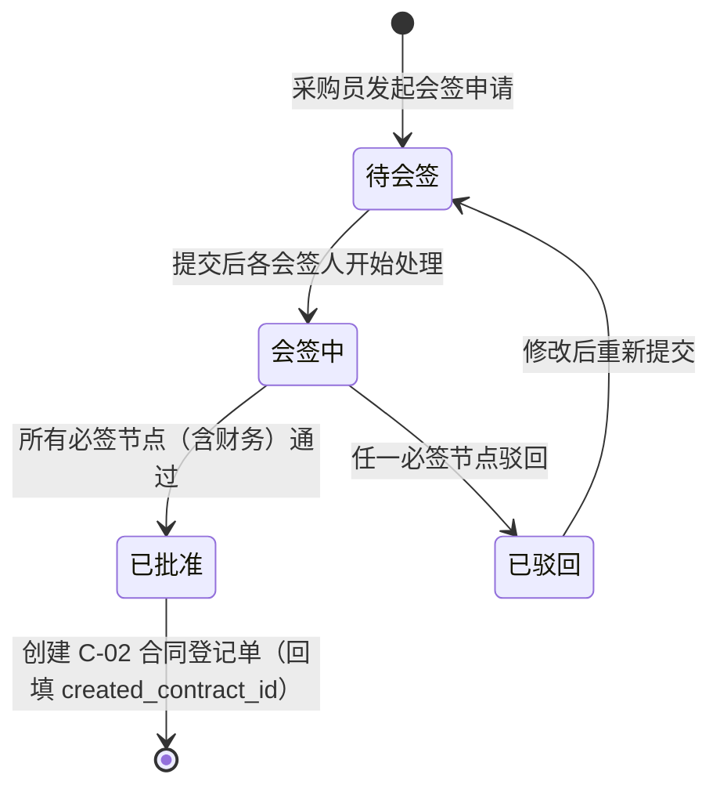
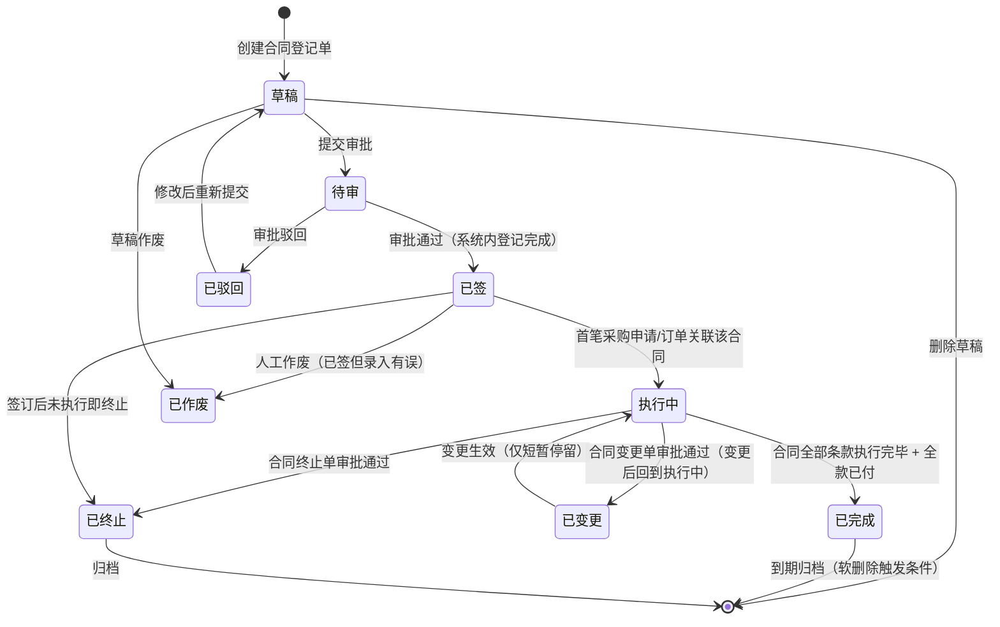
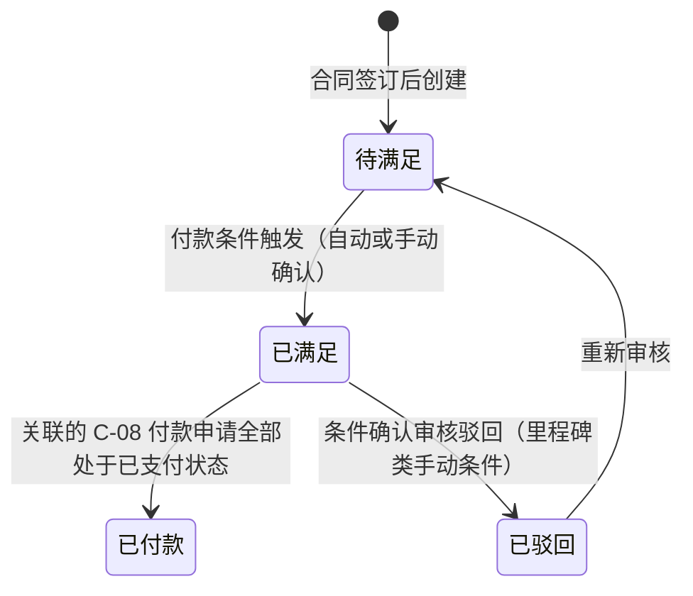
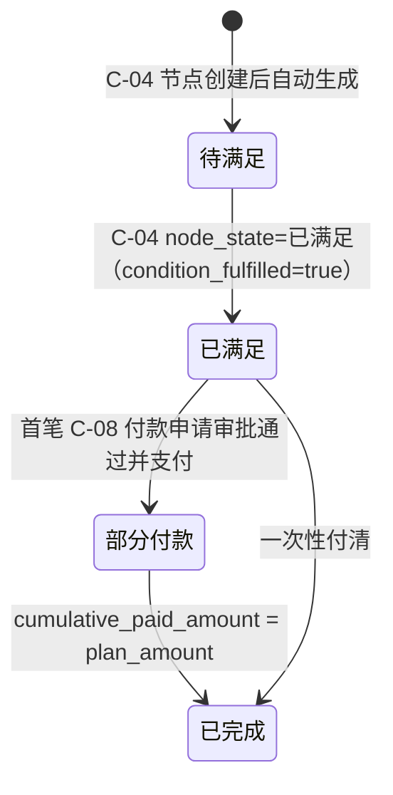
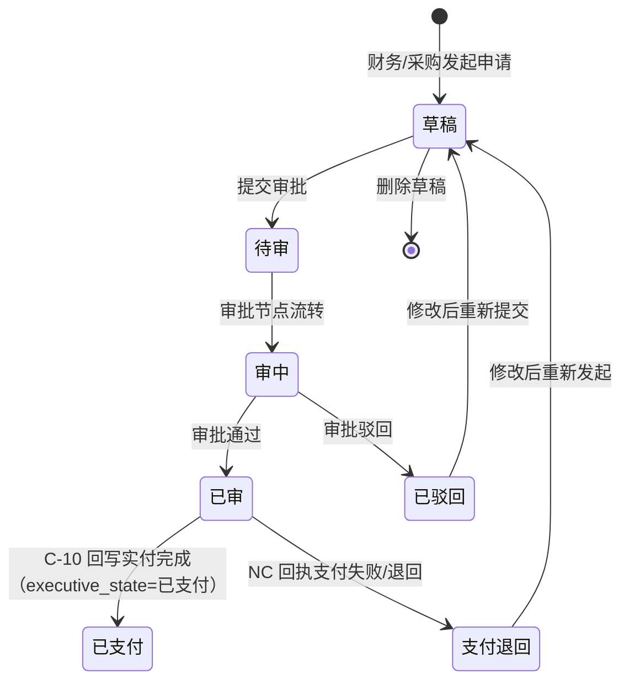
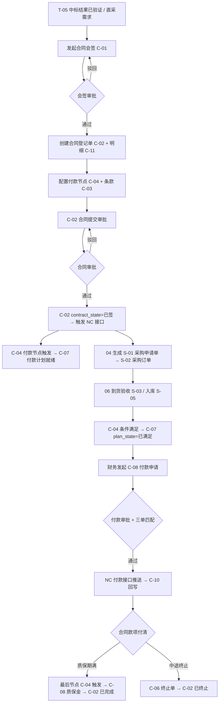
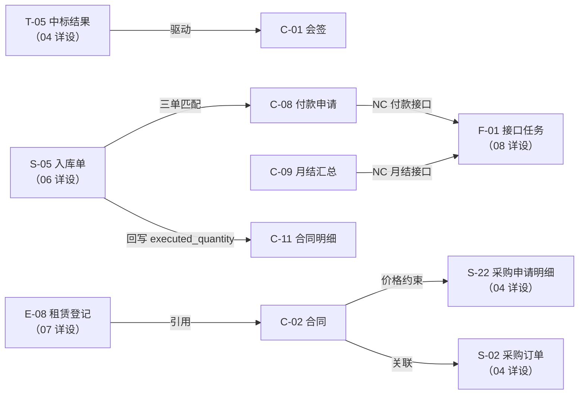

# 合同与资金详细设计（V0.1）

**版本：** V0.1
**日期：** 2026-05-02
**文档性质：** 详细设计层 · 模块详设第五篇
**适用阶段：** 详细设计执行、开发实施、联调测试

---

## 一、文档目的

本文档承接 `01-数据库逻辑模型-v0.7.md` 跨模块骨架与 `04-需求计划与采购协同详细设计-v0.2.md` 的上游协同，把合同与资金模块涉及的 11 个实体的全字段、状态机、业务规则、接口规范、配置项和占位项固化下来。

本文档重点回答：

- 合同从中标结果/直签到执行中/终止的完整生命周期（C-02 8 状态机）
- 合同会签（C-01）与合同登记（C-02）的分离设计及财务必参约束
- 合同条款（C-03）、付款节点（C-04）、付款计划（C-07）、付款申请（C-08）的四层付款控制链路
- 合同变更单（C-05）与终止单（C-06）的变更留痕与状态联动
- 付款执行台账（C-10）的 NC 实付回写与支付异常处理
- 月度预支付汇总（C-09）的批处理生成与 NC 接口口径
- NC 未落地阶段的付款接口过渡策略

本文档**不**做以下事：

- 不写采购申请单、采购订单、到货入库等收货侧流程（属 04 / 06 详设）
- 不写 NC 凭证科目规则、接口推送报文细节（属 08 详设）
- 不写设备租赁合同（E-08 rental_registration 属 07 详设，但会引用 C-02）
- 不写物料主数据、供应商档案（属 03 / 04 详设）
- 不写 SQL DDL 与页面交互

---

## 二、设计输入

| 输入文档 | 在本文档中的作用 |
| --- | --- |
| `docs/详细设计/01-数据库逻辑模型-v0.7.md` | 实体编号 C-01~C-11；共用约定 4.1-4.10；合同域状态值域节八；口径冲突处理节十二 |
| `docs/详细设计/04-需求计划与采购协同详细设计-v0.2.md` | T-05 中标结果驱动合同；S-01 合同执行来源；S-02 NC 接口触发点与合同约束；M-09 供应商状态约束 |
| `docs/概要设计/02-业务模块概要设计-v0.1.md` 节 5.4 | 合同与资金模块定位、付款节点管控、发票管理原则 |
| `docs/详细规则/物资管理与财务接口规范.md` | 付款接口字段、NC 预付/付款凭证推送规则、暂估冲销时序 |
| `docs/需求梳理/04-待确认事项清单.md` 第 3/6/7/15/16/21/22 项 | 合同金额变更阈值、付款条件类型、预付款比例、发票三单匹配、月度付款汇总口径 |
| `docs/需求梳理/14-NC映射与科目配置模板-V1.0.md` | NC 付款接口映射字段、科目配置、状态字典 |
| `docs/集团统筹/集团业务系统统一建设原则-V2.0.md` | 独立数据库、PG 兼容、API+JSON、SSO 约束 |

---

## 三、模块范围

### 3.1 本篇覆盖实体

| 实体编号 | 英文名 | 中文名 | 本篇覆盖深度 |
| --- | --- | --- | --- |
| C-01 | contract_approval | 合同审批会签单 | 全字段、状态机、财务必参约束 |
| C-02 | contract | 合同登记单 | 全字段、8 状态机、来源追溯、NC 接口触发 |
| C-03 | contract_clause | 合同条款 | 全字段、条款类型字典、变更联动 |
| C-04 | contract_payment_node | 合同付款节点 | 全字段、状态机、条件满足校验 |
| C-05 | contract_change | 合同变更单 | 全字段、变更类型、金额阈值升级 |
| C-06 | contract_termination | 合同终止单 | 全字段、终止类型、高敏感约束 |
| C-07 | payment_plan | 付款计划 | 全字段、状态机、由付款节点驱动生成 |
| C-08 | payment_request | 付款申请单 | 全字段、状态机、三单匹配、NC 接口触发 |
| C-09 | monthly_prepayment_summary | 月度预支付汇总 | 全字段、批处理生成规则、NC 接口 |
| C-10 | payment_execution | 付款执行台账 | 全字段、NC 实付回写、支付异常 |
| C-11 | contract_line | 合同明细 | 全字段、价格约束、与采购订单的对应关系 |

### 3.2 不在本篇覆盖

| 实体 | 承接位置 |
| --- | --- |
| T-05 tender_result（驱动合同登记的上游） | 04 需求计划与采购协同详细设计 |
| S-02 purchase_order（合同执行的下游） | 04 详设（已覆盖合同关联字段） |
| S-05 purchase_receipt（发票到货验收） | 06 库存实物流转详细设计 |
| E-08 rental_registration（设备租赁合同引用 C-02） | 07 设备与设备租赁详细设计 |
| F-01 接口任务、F-12 NC 凭证科目规则 | 08 财务与 NC 接口详细设计 |

### 3.3 共用约定继承

本篇所有实体表默认遵守 `01-v0.7` 节四的共用约定（主键策略、审计字段、软删除、业务状态字段、NC 接口字段、工作流字段、时间戳字段、多租户字段、附件字段、主表/明细表原则）。下文字段表中**不重复列出**共用字段；如某实体对共用约定有偏差，在该实体的"特别说明"中显式注明。

---

## 四、数据模型

### 4.1 C-01 contract_approval 合同审批会签单

#### 4.1.1 全字段表

| 字段名 | 类型 | 长度/精度 | 空值 | 默认值 | 唯一 | 外键 | 索引建议 | 注释 |
| --- | --- | --- | --- | --- | --- | --- | --- | --- |
| `approval_id` | bigint | — | NOT NULL | auto | PK | — | PK | 技术主键 |
| `approval_no` | varchar | 32 | NOT NULL | — | UQ | — | UQ | 前缀 `CA`（SY-01 取号） |
| `org_id` | bigint | — | NOT NULL | — | — | FK→M-01 | idx | 归属组织 |
| `supplier_id` | bigint | — | NOT NULL | — | — | FK→M-09 | idx | 拟签合同供应商 |
| `tender_result_id` | bigint | — | NULL | — | — | FK→T-05 | idx | 来源中标结果（招采路径时必填） |
| `contract_type` | varchar | 32 | NOT NULL | — | — | — | idx | 取值：采购合同 / 服务合同 / 租赁合同 / 框架合同 / 补充协议 |
| `contract_amount` | decimal | (18,2) | NOT NULL | — | — | — | — | 拟签合同金额 |
| `contract_summary` | varchar | 512 | NOT NULL | — | — | — | — | 合同内容摘要（标的物或服务描述） |
| `payment_terms_desc` | varchar | 255 | NULL | — | — | — | — | 付款条件说明 |
| `finance_approver_id` | bigint | — | NULL | — | — | FK→A-01 | — | 财务会签人（必须有财务角色） |
| `finance_approve_date` | date | — | NULL | — | — | — | — | 财务会签日期 |
| `finance_approve_comment` | varchar | 255 | NULL | — | — | — | — | 财务会签意见 |
| `legal_approver_id` | bigint | — | NULL | — | — | FK→A-01 | — | 法务会签人（可选） |
| `contract_approval_state` | varchar | 16 | NOT NULL | `待会签` | — | — | idx | 取值：待会签 / 会签中 / 已批准 / 已驳回（见 4.1.2） |
| `created_contract_id` | bigint | — | NULL | — | — | FK→C-02 | idx | 审批通过后创建的合同（回填） |
| `workflow_instance_id` | bigint | — | NULL | — | — | FK→A-20 | idx | 审批实例 |
| `current_node_id` | bigint | — | NULL | — | — | FK→A-09 | — | 当前节点 |
| `approval_chain` | text | — | NULL | — | — | — | — | 审批链路 JSON |
| `approval_deadline` | timestamp | — | NULL | — | — | — | — | 审批截止时间 |
| `escalation_flag` | boolean | — | NOT NULL | false | — | — | — | 是否已升级 |

#### 4.1.2 状态机



#### 4.1.3 业务规则

1. **财务必参**：`contract_approval_state=会签中` 时，必须存在一个 `finance_approver_id` 不为空且具有"财务会签"角色的节点；未完成财务会签不允许切换到 `已批准`
2. **金额分级**：`contract_amount` 超过 SY-02 `CONTRACT_LEGAL_REVIEW_THRESHOLD`（`[待业务确认]`）时，法务节点（`legal_approver_id`）自动加入会签链路
3. **1 对 1**：一份 C-01 会签单对应一份 C-02 合同；`created_contract_id` 回填后 C-01 不允许再次提交

---

### 4.2 C-02 contract 合同登记单

#### 4.2.1 全字段表

| 字段名 | 类型 | 长度/精度 | 空值 | 默认值 | 唯一 | 外键 | 索引建议 | 注释 |
| --- | --- | --- | --- | --- | --- | --- | --- | --- |
| `contract_id` | bigint | — | NOT NULL | auto | PK | — | PK | 技术主键 |
| `contract_no` | varchar | 32 | NOT NULL | — | UQ | — | UQ | 前缀 `CT`（SY-01 取号） |
| `org_id` | bigint | — | NOT NULL | — | — | FK→M-01 | idx | 归属组织 |
| `supplier_id` | bigint | — | NOT NULL | — | — | FK→M-09 | idx | 供应商；必须 `supplier_state=合格` |
| `approval_id` | bigint | — | NULL | — | — | FK→C-01 | idx | 来源会签单（招采/正式路径必填；直签小额合同允许为空） |
| `tender_result_id` | bigint | — | NULL | — | — | FK→T-05 | idx | 来源中标结果 |
| `purchase_plan_id` | bigint | — | NULL | — | — | FK→P-02 | idx | 关联采购计划 |
| `contract_type` | varchar | 32 | NOT NULL | — | — | — | idx | 取值：采购合同 / 服务合同 / 租赁合同 / 框架合同 / 补充协议 |
| `parent_contract_id` | bigint | — | NULL | — | — | FK→C-02 | idx | 父合同（补充协议时指向主合同） |
| `contract_name` | varchar | 255 | NOT NULL | — | — | — | idx | 合同名称 |
| `contract_amount` | decimal | (18,2) | NOT NULL | — | — | — | — | 合同总金额（含税） |
| `tax_amount` | decimal | (18,2) | NOT NULL | 0 | — | — | — | 合同税额 |
| `contract_amount_excl_tax` | decimal | (18,2) | NOT NULL | — | — | — | — | 合同不含税金额 |
| `currency` | varchar | 8 | NOT NULL | `CNY` | — | — | — | 币种（一期默认人民币） |
| `contract_date` | date | — | NOT NULL | — | — | — | idx | 签订日期 |
| `effective_date` | date | — | NOT NULL | — | — | — | idx | 合同生效日期 |
| `expiry_date` | date | — | NULL | — | — | — | idx | 合同到期日期（NULL 表示无固定期限） |
| `expected_delivery_date` | date | — | NULL | — | — | — | — | 整体预计到货完成日期 |
| `delivery_address` | varchar | 255 | NULL | — | — | — | — | 主交货地址 |
| `payment_terms` | varchar | 32 | NOT NULL | — | — | — | idx | 取值：预付款 / 到货付款 / 验收付款 / 分期付款 / 月结（见 4.2.4） |
| `prepayment_ratio` | decimal | (5,4) | NULL | — | — | — | — | 预付款比例（payment_terms=预付款 或 分期付款 时填写） |
| `quality_warranty_period` | integer | — | NULL | — | — | — | — | 质保期（天）；NULL 表示无质保期 |
| `warranty_retention_ratio` | decimal | (5,4) | NULL | — | — | — | — | 质保金比例（有质保期时填写） |
| `contract_file_attachment_id` | bigint | — | NULL | — | — | FK→SY-04 | — | 合同扫描件/PDF |
| `contract_state` | varchar | 16 | NOT NULL | `草稿` | — | — | idx | 见 4.2.2 |
| `signed_date` | date | — | NULL | — | — | — | — | 实际签订日期（双方签字盖章后回填） |
| `executed_amount` | decimal | (18,2) | NOT NULL | 0 | — | — | — | 已执行金额（由订单/入库回写，不手工维护） |
| `paid_amount` | decimal | (18,2) | NOT NULL | 0 | — | — | — | 累计已付金额（由 C-10 回写） |
| `is_framework` | boolean | — | NOT NULL | false | — | — | idx | 是否框架合同（is_framework=true 时可按框架循环采购） |
| `framework_expiry_date` | date | — | NULL | — | — | — | — | 框架合同有效期（is_framework=true 时填写） |
| `nc_push_state` | varchar | 16 | NOT NULL | `待推送` | — | — | idx | NC 接口推送状态 |
| `nc_voucher_no` | varchar | 64 | NULL | — | — | — | — | NC 凭证号 |
| `last_push_time` | timestamp | — | NULL | — | — | — | — | 最后推送时间 |
| `push_error_code` | varchar | 32 | NULL | — | — | — | — | 推送错误码 |
| `push_error_message` | varchar | 256 | NULL | — | — | — | — | 推送错误描述 |
| `idempotent_key` | varchar | 128 | NULL | — | UQ | — | UQ | 幂等键（interface_code + contract_no + org_code） |
| `workflow_instance_id` | bigint | — | NULL | — | — | FK→A-20 | idx | 审批实例（合同登记审批） |
| `current_node_id` | bigint | — | NULL | — | — | FK→A-09 | — | 当前节点 |
| `approval_chain` | text | — | NULL | — | — | — | — | 审批链路 JSON |
| `approval_deadline` | timestamp | — | NULL | — | — | — | — | 审批截止时间 |
| `escalation_flag` | boolean | — | NOT NULL | false | — | — | — | 是否已升级 |
| `remarks` | varchar | 255 | NULL | — | — | — | — | 备注 |

#### 4.2.2 状态机（8 状态）



状态迁移约束：

- `已签 → 执行中`：系统自动触发，不需人工操作；关联 S-02 采购订单下达后即驱动
- `执行中 → 已完成`：须满足：① 所有 S-02 `order_state=全部到货/已关闭`；② `paid_amount ≥ contract_amount × (1 - warranty_retention_ratio)`（质保金留存期内允许 < 100%）
- `执行中 → 已变更`：仅在 C-05 合同变更单 `change_state=已审` 后瞬时切换，变更生效后自动回到 `执行中`
- `执行中/已签 → 已终止`：须 C-06 终止单审批通过；已付款部分按结算条款处理
- `已作废`：仅允许在 `草稿/已签`（且未执行、未付款）状态下操作；属高敏感操作，须物资管理审批

#### 4.2.3 业务规则

1. **会签前置**：`contract_amount ≥ SY-02 CONTRACT_APPROVAL_THRESHOLD`（`[待业务确认]`，预设 XX 万元）时，C-01 会签单必须存在且 `contract_approval_state=已批准`，才允许创建 C-02；小额直签合同 `approval_id` 可为空但须加审节点
2. **供应商状态约束**：`contract_state=已签/执行中` 期间，若 `M-09.supplier_state` 变为黑名单，不自动终止合同，但触发提醒；合同须在下一付款节点前由物资管理决策
3. **框架合同**：`is_framework=true` 时，S-01/S-02 可在 `framework_expiry_date` 有效期内循环关联该合同采购，不要求每次走招采流程；订单金额累计不超过 `contract_amount`（超出须走 C-05 变更扩额）
4. **NC 接口触发**：`contract_state=已签` 后触发 F-01 接口任务推送合同登记至 NC（NC 未落地阶段 F-13 开关关闭）
5. **价格权威**：C-11 `unit_price` 是下游 S-22 `unit_price` 的价格上限权威来源；变更后的价格以最新 C-05 变更单为准

#### 4.2.4 付款条件字典

| payment_terms | 含义 | 付款节点典型设置 |
| --- | --- | --- |
| `预付款` | 合同签订后先支付预付款 | 节点 1：签订后 N 天，百分比 P% |
| `到货付款` | 货到验收后付款 | 节点 1：到货验收后 N 天，100% |
| `验收付款` | 质检/验收合格后付款 | 节点 1：验收合格后 N 天，100% |
| `分期付款` | 按里程碑分多期 | 节点 1~N：各百分比之和 = 100% |
| `月结` | 每月末汇总结算 | 驱动 C-09 月度预支付汇总 |

---

### 4.3 C-03 contract_clause 合同条款

#### 4.3.1 全字段表

| 字段名 | 类型 | 长度/精度 | 空值 | 默认值 | 唯一 | 外键 | 索引建议 | 注释 |
| --- | --- | --- | --- | --- | --- | --- | --- | --- |
| `clause_id` | bigint | — | NOT NULL | auto | PK | — | PK | 技术主键 |
| `contract_id` | bigint | — | NOT NULL | — | — | FK→C-02 | idx | 所属合同 |
| `clause_type` | varchar | 32 | NOT NULL | — | — | — | idx | 见 4.3.2 条款类型字典 |
| `clause_title` | varchar | 128 | NOT NULL | — | — | — | — | 条款标题 |
| `clause_content` | text | NOT NULL | — | — | — | — | — | 条款内容（富文本或 Markdown） |
| `is_key_clause` | boolean | — | NOT NULL | false | — | — | idx | 是否关键条款（如价格/质保/违约，需高亮显示） |
| `effective_date` | date | — | NULL | — | — | — | — | 条款生效日期（NULL 表示跟随合同生效日期） |
| `termination_date` | date | — | NULL | — | — | — | — | 条款终止日期 |
| `change_source_id` | bigint | — | NULL | — | — | FK→C-05 | — | 被哪次变更修改（C-05 变更单 ID；NULL 表示原始条款） |
| `is_superseded` | boolean | — | NOT NULL | false | — | — | idx | 是否已被新版本替代（被 C-05 变更后旧条款置为 true） |
| `display_order` | smallint | — | NOT NULL | 0 | — | — | — | 显示顺序 |
| `remarks` | varchar | 255 | NULL | — | — | — | — | 备注 |

**特别说明**：C-03 不带独立业务状态字段；条款是否有效由 `is_superseded` 与合同 `contract_state` 共同决定。软删除保留，不允许物理删除。

#### 4.3.2 条款类型字典（SY-03 dict_code=`CONTRACT_CLAUSE_TYPE`）

| clause_type | 含义 | 是否关键条款默认 |
| --- | --- | --- |
| `价格条款` | 单价、总价、调价机制 | 是 |
| `交货条款` | 交货期、交货地点、验收标准 | 是 |
| `付款条款` | 付款方式、节点、发票要求 | 是 |
| `质保条款` | 质保期、质保金比例、缺陷责任 | 是 |
| `违约条款` | 违约责任、赔偿标准 | 是 |
| `变更条款` | 变更程序约定 | 否 |
| `保密条款` | 保密义务 | 否 |
| `争议解决` | 仲裁或诉讼方式 | 否 |
| `其他条款` | 不在以上类型的其他约定 | 否 |

---

### 4.4 C-04 contract_payment_node 合同付款节点

#### 4.4.1 全字段表

| 字段名 | 类型 | 长度/精度 | 空值 | 默认值 | 唯一 | 外键 | 索引建议 | 注释 |
| --- | --- | --- | --- | --- | --- | --- | --- | --- |
| `node_id` | bigint | — | NOT NULL | auto | PK | — | PK | 技术主键 |
| `contract_id` | bigint | — | NOT NULL | — | — | FK→C-02 | idx | 所属合同 |
| `payment_node_no` | smallint | — | NOT NULL | — | — | — | idx | 节点序号（1 起，同合同内唯一） |
| `payment_condition` | varchar | 32 | NOT NULL | — | — | — | idx | 付款触发条件（见 4.4.2 条件字典） |
| `condition_desc` | varchar | 255 | NULL | — | — | — | — | 条件详细说明（如"到货验收合格后 30 日内"） |
| `payment_percentage` | decimal | (5,4) | NOT NULL | — | — | — | — | 本节点付款比例（各节点之和应 = 1.0） |
| `payment_amount` | decimal | (18,2) | NOT NULL | — | — | — | — | 本节点付款金额（= contract_amount × payment_percentage） |
| `due_date` | date | — | NULL | — | — | — | idx | 节点截止付款日期（条件触发后的付款期限） |
| `condition_check_date` | date | — | NULL | — | — | — | — | 条件满足确认日期（系统或人工标记） |
| `condition_source_bill_type` | varchar | 32 | NULL | — | — | — | — | 条件关联单据类型（如 purchase_receipt / tender_result） |
| `condition_source_bill_id` | bigint | — | NULL | — | — | — | idx | 条件关联单据 ID（触发该节点的业务单据） |
| `node_state` | varchar | 16 | NOT NULL | `待满足` | — | — | idx | 取值：待满足 / 已满足 / 已付款 / 已驳回（见 4.4.3） |
| `payment_plan_id` | bigint | — | NULL | — | — | FK→C-07 | idx | 关联付款计划（条件满足后生成，回填） |
| `remarks` | varchar | 255 | NULL | — | — | — | — | 备注 |

**唯一约束**：`(contract_id, payment_node_no)` 复合唯一

**校验约束**：同一合同所有节点的 `payment_percentage` 之和须 = 1.0（含质保金节点）

#### 4.4.2 付款条件字典（SY-03 dict_code=`PAYMENT_CONDITION`）

| payment_condition | 触发机制 | 自动/手动 |
| --- | --- | --- |
| `合同签订` | C-02 `contract_state=已签` | 自动 |
| `到货验收` | S-03 `goods_receipt_state=已验收` | 自动（关联 S-03.receipt_id） |
| `入库完成` | S-05 `purchase_receipt_state=已审`（入库审核通过） | 自动（关联 S-05.receipt_id） |
| `发票到达` | S-05 `is_invoice_arrived=已到` | 自动或手动标记 |
| `质保期满` | 当前日期 ≥ `C-02.signed_date + quality_warranty_period` | 自动（每日凌晨任务） |
| `里程碑确认` | 人工确认（项目进度里程碑，服务合同常用） | 手动 |
| `月结汇总` | 由 C-09 月度预支付汇总驱动 | 自动（月末批处理） |

#### 4.4.3 状态机



---

### 4.5 C-05 contract_change 合同变更单

#### 4.5.1 全字段表

| 字段名 | 类型 | 长度/精度 | 空值 | 默认值 | 唯一 | 外键 | 索引建议 | 注释 |
| --- | --- | --- | --- | --- | --- | --- | --- | --- |
| `change_id` | bigint | — | NOT NULL | auto | PK | — | PK | 技术主键 |
| `change_no` | varchar | 32 | NOT NULL | — | UQ | — | UQ | 前缀 `CC`（SY-01 取号） |
| `contract_id` | bigint | — | NOT NULL | — | — | FK→C-02 | idx | 被变更的合同 |
| `change_seq` | smallint | — | NOT NULL | — | — | — | idx | 变更序号（同一合同第 N 次变更，1 起） |
| `change_type` | varchar | 32 | NOT NULL | — | — | — | idx | 取值：金额变更 / 数量变更 / 价格变更 / 交期变更 / 付款条件变更 / 供应商信息变更 / 综合变更 |
| `change_reason` | varchar | 512 | NOT NULL | — | — | — | — | 变更原因 |
| `change_detail_json` | text | NOT NULL | — | — | — | — | — | 变更明细 JSON（before/after 对比，记录变更字段、旧值、新值） |
| `old_contract_amount` | decimal | (18,2) | NULL | — | — | — | — | 变更前合同金额（金额变更时填写） |
| `new_contract_amount` | decimal | (18,2) | NULL | — | — | — | — | 变更后合同金额 |
| `amount_delta` | decimal | (18,2) | NULL | — | — | — | — | 金额变化量（= new - old，允许负值） |
| `effective_date` | date | — | NULL | — | — | — | — | 变更生效日期 |
| `supplier_confirm_date` | date | — | NULL | — | — | — | — | 供应商书面确认日期 |
| `change_state` | varchar | 16 | NOT NULL | `草稿` | — | — | idx | 取值：草稿 / 待审 / 已审 / 已驳回 / 已作废 |
| `workflow_instance_id` | bigint | — | NULL | — | — | FK→A-20 | idx | 审批实例 |
| `current_node_id` | bigint | — | NULL | — | — | FK→A-09 | — | 当前节点 |
| `approval_chain` | text | — | NULL | — | — | — | — | 审批链路 JSON |
| `approval_deadline` | timestamp | — | NULL | — | — | — | — | 审批截止时间 |
| `escalation_flag` | boolean | — | NOT NULL | false | — | — | — | 是否已升级 |

#### 4.5.2 业务规则

1. **金额变更阈值**：`change_type=金额变更` 且 `amount_delta > SY-02 CONTRACT_CHANGE_MAJOR_THRESHOLD`（`[待业务确认]`）时，审批节点升级至项目领导小组
2. **变更生效**：`change_state=已审` 后，服务层自动更新 C-02 对应字段（以 `change_detail_json` 中的 after 值为准），并更新 C-03 对应条款（`is_superseded=true` 旧条款，创建新条款 `change_source_id = change_id`）
3. **付款节点联动**：`change_type=付款条件变更` 生效后，须同步修订 C-04 节点的 `payment_percentage / payment_amount / due_date`；已处于 `已满足/已付款` 状态的节点不允许修改
4. **合同金额上限**：变更后 `C-02.contract_amount` 不允许低于已执行金额（`executed_amount`）

---

### 4.6 C-06 contract_termination 合同终止单

#### 4.6.1 全字段表

| 字段名 | 类型 | 长度/精度 | 空值 | 默认值 | 唯一 | 外键 | 索引建议 | 注释 |
| --- | --- | --- | --- | --- | --- | --- | --- | --- |
| `term_id` | bigint | — | NOT NULL | auto | PK | — | PK | 技术主键 |
| `term_no` | varchar | 32 | NOT NULL | — | UQ | — | UQ | 前缀 `TN`（SY-01 取号） |
| `contract_id` | bigint | — | NOT NULL | — | — | FK→C-02 | idx | 被终止的合同 |
| `termination_type` | varchar | 32 | NOT NULL | — | — | — | idx | 取值：协议终止 / 违约终止 / 不可抗力终止 / 监管要求终止 |
| `termination_reason` | text | NOT NULL | — | — | — | — | — | 终止原因（详细描述） |
| `termination_date` | date | — | NOT NULL | — | — | — | idx | 生效终止日期 |
| `settlement_amount` | decimal | (18,2) | NULL | — | — | — | — | 结算金额（已执行部分的实际结算额） |
| `penalty_amount` | decimal | (18,2) | NULL | 0 | — | — | — | 违约金金额（违约终止时填写） |
| `supplier_confirm_required` | boolean | — | NOT NULL | true | — | — | — | 是否需要供应商书面确认 |
| `supplier_confirm_date` | date | — | NULL | — | — | — | — | 供应商书面确认日期 |
| `approved_by` | bigint | — | NULL | — | — | FK→A-01 | — | 审批人 |
| `termination_state` | varchar | 16 | NOT NULL | `草稿` | — | — | idx | 取值：草稿 / 待审 / 已审 / 已驳回 |
| `workflow_instance_id` | bigint | — | NULL | — | — | FK→A-20 | idx | 审批实例 |
| `current_node_id` | bigint | — | NULL | — | — | FK→A-09 | — | 当前节点 |
| `approval_chain` | text | — | NULL | — | — | — | — | 审批链路 JSON |
| `approval_deadline` | timestamp | — | NULL | — | — | — | — | 审批截止时间 |
| `escalation_flag` | boolean | — | NOT NULL | false | — | — | — | 是否已升级 |

#### 4.6.2 业务规则

1. **高敏感操作**：`termination_type=违约终止` 须走 A-11 高敏感记录；审批节点须含物资管理 + 法务
2. **未结单据处理**：终止申请提交前系统检查并提示：① 未关闭的 S-02 采购订单；② 未完成的 C-07 付款计划；③ 未处理的 C-08 付款申请——系统提示但不阻断；审批通过后须人工处置这些单据
3. **终止生效**：`termination_state=已审` 后，服务层将 `C-02.contract_state` 改为 `已终止`，同时将所有状态为 `待满足` 的 C-04 节点标记为 `已驳回`（以结算金额为准）

---

### 4.7 C-07 payment_plan 付款计划

#### 4.7.1 全字段表

| 字段名 | 类型 | 长度/精度 | 空值 | 默认值 | 唯一 | 外键 | 索引建议 | 注释 |
| --- | --- | --- | --- | --- | --- | --- | --- | --- |
| `plan_id` | bigint | — | NOT NULL | auto | PK | — | PK | 技术主键 |
| `contract_id` | bigint | — | NOT NULL | — | — | FK→C-02 | idx | 所属合同 |
| `payment_node_id` | bigint | — | NOT NULL | — | — | FK→C-04 | idx | 来源付款节点 |
| `plan_amount` | decimal | (18,2) | NOT NULL | — | — | — | — | 本次计划应付金额 |
| `cumulative_paid_amount` | decimal | (18,2) | NOT NULL | 0 | — | — | — | 本计划已累计付款金额（由 C-10 回写） |
| `remaining_amount` | decimal | (18,2) | NOT NULL | — | — | — | — | 剩余应付金额（= plan_amount - cumulative_paid_amount） |
| `condition_fulfilled` | boolean | — | NOT NULL | false | — | — | idx | 付款条件是否已满足（由 C-04 状态联动） |
| `due_date` | date | — | NULL | — | — | — | idx | 付款期限日期 |
| `plan_state` | varchar | 16 | NOT NULL | `待满足` | — | — | idx | 取值：待满足 / 已满足 / 部分付款 / 已完成（见 4.7.2） |

**唯一约束**：`(contract_id, payment_node_id)` 复合唯一（一个付款节点对应一个付款计划）

#### 4.7.2 状态机



#### 4.7.3 业务规则

1. **自动生成**：C-04 付款节点创建时由系统同步创建对应的 C-07 付款计划；不允许手工独立新建
2. **超期预警**：`plan_state IN ('已满足','部分付款')` 且 `due_date < TODAY + SY-02 PAYMENT_DUE_ALERT_DAYS`（默认 7 天）时触发 R-04 预警（`PAYMENT_DUE_NEAR`），通知财务和采购负责人
3. **质保金**：`C-04` 中最后一个节点（质保金节点）的 `payment_condition=质保期满`；`C-07` 对应的 `plan_state=待满足` 直到质保期自动触发

---

### 4.8 C-08 payment_request 付款申请单

#### 4.8.1 全字段表

| 字段名 | 类型 | 长度/精度 | 空值 | 默认值 | 唯一 | 外键 | 索引建议 | 注释 |
| --- | --- | --- | --- | --- | --- | --- | --- | --- |
| `request_id` | bigint | — | NOT NULL | auto | PK | — | PK | 技术主键 |
| `request_no` | varchar | 32 | NOT NULL | — | UQ | — | UQ | 前缀 `PA`（SY-01 取号） |
| `contract_id` | bigint | — | NOT NULL | — | — | FK→C-02 | idx | 所属合同 |
| `supplier_id` | bigint | — | NOT NULL | — | — | FK→M-09 | idx | 供应商 |
| `payment_plan_id` | bigint | — | NOT NULL | — | — | FK→C-07 | idx | 关联付款计划 |
| `payment_node_id` | bigint | — | NOT NULL | — | — | FK→C-04 | idx | 关联付款节点 |
| `org_id` | bigint | — | NOT NULL | — | — | FK→M-01 | idx | 归属组织 |
| `request_amount` | decimal | (18,2) | NOT NULL | — | — | — | — | 申请付款金额 |
| `invoice_no` | varchar | 64 | NULL | — | — | — | idx | 发票号码（开增值税专用发票时必填） |
| `invoice_date` | date | — | NULL | — | — | — | — | 发票日期 |
| `invoice_amount` | decimal | (18,2) | NULL | — | — | — | — | 发票金额 |
| `invoice_tax_rate` | decimal | (5,4) | NULL | — | — | — | — | 发票税率 |
| `receipt_check` | boolean | — | NOT NULL | false | — | — | — | 是否已完成三单匹配核查（合同/入库/发票） |
| `receipt_check_date` | date | — | NULL | — | — | — | — | 三单匹配核查日期 |
| `receipt_check_by` | bigint | — | NULL | — | — | FK→A-01 | — | 核查人 |
| `source_bill_type` | varchar | 32 | NULL | — | — | — | — | 关联触发单据类型（如 purchase_receipt, tender_result） |
| `source_bill_id` | bigint | — | NULL | — | — | — | idx | 关联触发单据 ID |
| `is_prepayment` | boolean | — | NOT NULL | false | — | — | idx | 是否预付款（payment_condition=合同签订 时通常为 true） |
| `approval_state` | varchar | 16 | NOT NULL | `草稿` | — | — | idx | 见 4.8.2 |
| `nc_push_state` | varchar | 16 | NOT NULL | `待推送` | — | — | idx | NC 接口推送状态 |
| `nc_voucher_no` | varchar | 64 | NULL | — | — | — | — | NC 凭证号（付款凭证） |
| `last_push_time` | timestamp | — | NULL | — | — | — | — | 最后推送时间 |
| `push_error_code` | varchar | 32 | NULL | — | — | — | — | 推送错误码 |
| `push_error_message` | varchar | 256 | NULL | — | — | — | — | 推送错误描述 |
| `idempotent_key` | varchar | 128 | NULL | — | UQ | — | UQ | 幂等键（interface_code + request_no + org_code） |
| `workflow_instance_id` | bigint | — | NULL | — | — | FK→A-20 | idx | 审批实例 |
| `current_node_id` | bigint | — | NULL | — | — | FK→A-09 | — | 当前节点 |
| `approval_chain` | text | — | NULL | — | — | — | — | 审批链路 JSON |
| `approval_deadline` | timestamp | — | NULL | — | — | — | — | 审批截止时间 |
| `escalation_flag` | boolean | — | NOT NULL | false | — | — | — | 是否已升级 |
| `finance_state` | varchar | 16 | NOT NULL | `未接收` | — | — | idx | NC 财务回执状态 |
| `remarks` | varchar | 255 | NULL | — | — | — | — | 备注 |

#### 4.8.2 状态机



状态迁移约束：

- `草稿 → 待审`：必须先完成三单匹配（`receipt_check=true`）；预付款类型（`is_prepayment=true`）豁免三单匹配
- `已审`：触发 F-01 接口任务推送 NC 付款接口（NC 未落地阶段 F-13 开关关闭）
- `已审 → 已支付`：由 NC 回执（F-03）触发 C-10 记录更新，再回写本字段

#### 4.8.3 三单匹配规则

| 匹配维度 | 说明 | 校验逻辑 |
| --- | --- | --- |
| 合同匹配 | 付款申请金额须在合同范围内 | `request_amount ≤ C-07.remaining_amount` |
| 入库匹配 | 非预付款类型须有对应的已审入库单 | `S-05.purchase_receipt_state=已审` 且 `S-05.contract_id=C-02.contract_id` |
| 发票匹配 | 发票金额须与申请金额匹配（默认允许 ≤ 发票金额） | `invoice_amount ≥ request_amount`（`[待业务确认]`） |

三单匹配通过后由核查人签字（`receipt_check=true`，`receipt_check_by` 回填），方可提交审批。

#### 4.8.4 业务规则

1. **预付款约束**：预付款（`is_prepayment=true`）的 `request_amount ≤ C-02.contract_amount × C-02.prepayment_ratio`；超出须补 C-05 变更单
2. **累计付款约束**：同一 `payment_plan_id` 下所有已审/已支付的 C-08 `request_amount` 之和不得超过 `C-07.plan_amount`
3. **供应商银行账号**：提交前须在 M-09 中维护 `bank_account / bank_name / bank_account_name`；字段为空则系统提示但不拦截（`[待业务确认]`）

---

### 4.9 C-09 monthly_prepayment_summary 月度预支付汇总

#### 4.9.1 全字段表

| 字段名 | 类型 | 长度/精度 | 空值 | 默认值 | 唯一 | 外键 | 索引建议 | 注释 |
| --- | --- | --- | --- | --- | --- | --- | --- | --- |
| `summary_id` | bigint | — | NOT NULL | auto | PK | — | PK | 技术主键 |
| `org_id` | bigint | — | NOT NULL | — | — | FK→M-01 | idx | 归属组织 |
| `supplier_id` | bigint | — | NOT NULL | — | — | FK→M-09 | idx | 供应商 |
| `summary_month` | varchar | 7 | NOT NULL | — | — | — | idx | 汇总月份（`YYYY-MM`） |
| `summary_amount` | decimal | (18,2) | NOT NULL | — | — | — | — | 当月月结应付总金额 |
| `invoice_count` | integer | — | NOT NULL | 0 | — | — | — | 纳入本次汇总的发票张数 |
| `contract_count` | integer | — | NOT NULL | 0 | — | — | — | 涉及合同数量 |
| `included_requests` | text | — | NULL | — | — | — | — | 纳入本次汇总的 C-08 申请单 ID 列表（JSON 数组） |
| `generate_date` | date | — | NOT NULL | — | — | — | idx | 汇总生成日期（月末批处理日期） |
| `summary_state` | varchar | 16 | NOT NULL | `待推送` | — | — | idx | 取值：待推送 / 推送中 / 已推送 / 推送失败 |
| `nc_push_state` | varchar | 16 | NOT NULL | `待推送` | — | — | idx | NC 接口推送状态 |
| `nc_voucher_no` | varchar | 64 | NULL | — | — | — | — | NC 月结凭证号 |
| `last_push_time` | timestamp | — | NULL | — | — | — | — | 最后推送时间 |
| `push_error_code` | varchar | 32 | NULL | — | — | — | — | 推送错误码 |
| `push_error_message` | varchar | 256 | NULL | — | — | — | — | 推送错误描述 |
| `idempotent_key` | varchar | 128 | NULL | — | UQ | — | UQ | 幂等键（interface_code + org_code + supplier_code + summary_month） |

**唯一约束**：`(org_id, supplier_id, summary_month)` 复合唯一（每个组织每个供应商每月只生成一份汇总）

**特别说明**：C-09 由月末批处理任务自动生成，**不**允许手工新建；`summary_state / nc_push_state` 可由运维人员重推，但 `summary_amount / included_requests` 一经生成不允许修改（如有误差走对账差异 F-07 处理）。

#### 4.9.2 批处理逻辑

月末（每月最后一个工作日晚 22:00 批处理）：

1. 查找 `C-02.payment_terms=月结` 的合同；
2. 匹配当月所有 `C-04.payment_condition=月结汇总` 且 `node_state=待满足` 的节点；
3. 按 `(org_id, supplier_id)` 聚合该月所有应付金额 → 写入 `C-09`；
4. 自动触发 C-04 节点 `node_state=已满足` + C-07 计划 `plan_state=已满足`；
5. `nc_push_state=待推送`，等待 F-01 接口任务推送。

---

### 4.10 C-10 payment_execution 付款执行台账

#### 4.10.1 全字段表

| 字段名 | 类型 | 长度/精度 | 空值 | 默认值 | 唯一 | 外键 | 索引建议 | 注释 |
| --- | --- | --- | --- | --- | --- | --- | --- | --- |
| `exec_id` | bigint | — | NOT NULL | auto | PK | — | PK | 技术主键 |
| `payment_request_id` | bigint | — | NOT NULL | — | — | FK→C-08 | idx | 关联付款申请单 |
| `contract_id` | bigint | — | NOT NULL | — | — | FK→C-02 | idx | 冗余存储，便于合同维度汇总 |
| `supplier_id` | bigint | — | NOT NULL | — | — | FK→M-09 | idx | 供应商 |
| `actual_payment_amount` | decimal | (18,2) | NOT NULL | — | — | — | — | 实际支付金额（NC 回执金额） |
| `actual_payment_date` | date | — | NOT NULL | — | — | — | idx | 实际支付日期 |
| `payment_voucher_no` | varchar | 64 | NULL | — | — | — | idx | 支付凭证号（银行流水号或 NC 付款凭证号） |
| `payment_channel` | varchar | 32 | NULL | — | — | — | — | 支付渠道（银行转账/支票/其他） |
| `executive_state` | varchar | 16 | NOT NULL | `待付款` | — | — | idx | 取值：待付款 / 部分支付 / 已支付 / 支付失败 |
| `failure_reason` | varchar | 255 | NULL | — | — | — | — | 支付失败原因（executive_state=支付失败 时填写） |
| `retry_count` | smallint | — | NOT NULL | 0 | — | — | — | 重推次数 |
| `nc_source` | varchar | 16 | NOT NULL | `NC回执` | — | — | — | 取值：NC回执 / 手工录入（NC 未落地阶段过渡用） |

**特别说明**：C-10 属于 NC 回写或过渡期手工录入的只读台账，**不**允许业务人员手工删改已生成记录；如有争议走对账差异（F-07）处理。

#### 4.10.2 NC 未落地过渡口径

| 阶段 | nc_source | 操作方式 | executive_state 来源 |
| --- | --- | --- | --- |
| **阶段 1：NC 完全未落地** | `手工录入` | 财务手工在系统中录入已支付记录 | 人工填写 |
| **阶段 2：NC 就绪但付款接口未启用** | `手工录入` | 同上，同时在 NC 端手工记账 | 人工填写 |
| **阶段 3：NC 付款接口联调通过** | `NC回执` | NC 回执通过 F-03 自动回写 | F-03 触发 |

#### 4.10.3 业务规则

1. **回写机制**：`executive_state=已支付` 后，服务层同步更新：
   - `C-07.cumulative_paid_amount += actual_payment_amount`
   - `C-07.remaining_amount -= actual_payment_amount`
   - 若 `C-07.remaining_amount ≤ 0`：`C-07.plan_state=已完成`，`C-04.node_state=已付款`
   - `C-02.paid_amount += actual_payment_amount`
   - 判断 `C-02.paid_amount ≥ C-02.contract_amount × (1 - warranty_retention_ratio)` → 如满足则尝试将 `C-02.contract_state` 推进到 `已完成`
2. **支付失败处理**：`executive_state=支付失败` 时，`C-08.approval_state` 回退到 `支付退回`；财务核查原因后重新发起 C-08

---

### 4.11 C-11 contract_line 合同明细

#### 4.11.1 全字段表

| 字段名 | 类型 | 长度/精度 | 空值 | 默认值 | 唯一 | 外键 | 索引建议 | 注释 |
| --- | --- | --- | --- | --- | --- | --- | --- | --- |
| `line_id` | bigint | — | NOT NULL | auto | PK | — | PK | 技术主键 |
| `contract_id` | bigint | — | NOT NULL | — | — | FK→C-02 | idx | 所属合同 |
| `line_no` | integer | — | NOT NULL | — | — | — | — | 行序号（1 起） |
| `material_id` | bigint | — | NULL | — | — | FK→M-05 | idx | 物料（服务合同可为空） |
| `line_description` | varchar | 255 | NULL | — | — | — | — | 行描述（服务合同标的描述；物料合同可为空） |
| `package_line_id` | bigint | — | NULL | — | — | FK→T-07 | idx | 关联标包明细行（招采路径时有值） |
| `quantity` | decimal | (18,3) | NOT NULL | — | — | — | — | 合同数量（按主单位；服务合同填 1） |
| `unit_id` | bigint | — | NULL | — | — | FK→M-07 | — | 计量单位（服务合同可为空） |
| `unit_price` | decimal | (18,4) | NOT NULL | — | — | — | — | 合同单价（含税） |
| `tax_rate` | decimal | (5,4) | NOT NULL | 0.13 | — | — | — | 税率 |
| `line_amount` | decimal | (18,2) | NOT NULL | — | — | — | — | 行不含税金额 |
| `line_amount_with_tax` | decimal | (18,2) | NOT NULL | — | — | — | — | 行含税金额（= quantity × unit_price） |
| `delivery_requirement` | varchar | 255 | NULL | — | — | — | — | 交货要求（交期、地点、验收标准） |
| `executed_quantity` | decimal | (18,3) | NOT NULL | 0 | — | — | — | 已执行数量（由 S-25 入库明细回写） |
| `executed_amount` | decimal | (18,2) | NOT NULL | 0 | — | — | — | 已执行金额 |
| `line_state` | varchar | 16 | NOT NULL | `未执行` | — | — | idx | 取值：未执行 / 执行中 / 已完成 / 已取消 |

**唯一约束**：`(contract_id, line_no)` 复合唯一

#### 4.11.2 业务规则

1. **价格权威**：`C-11.unit_price` 是 S-22 `unit_price` 的上限基准；S-02 采购订单的行单价不得超过此值 × (1 + `SY-02 PRICE_VARIANCE_RATE`)
2. **执行跟踪**：`executed_quantity / executed_amount` 由 06 详设的 S-25 入库明细行审核生效后回写；不允许手工维护
3. **服务合同**：`material_id=NULL` 时，`line_description` 必填；`unit_id` 可为空；`quantity=1`（以整体服务为最小单位）
4. **变更联动**：C-05 金额/数量变更审批通过后，对应 C-11 行的 `quantity / unit_price / line_amount` 同步更新（旧值通过 `change_detail_json` 保留）

---

## 五、业务主流程

### 5.1 合同登记与执行主流程



### 5.2 付款节点-计划-申请三层控制链路


---

## 六、ERD

### 6.1 合同与资金域 ERD

```mermaid
erDiagram
    C-01 contract_approval }o--|| T-05 tender_result : "tender_result_id"
    C-01 contract_approval ||--o| C-02 contract : "created_contract_id"
    C-02 contract ||--o{ C-03 contract_clause : "条款"
    C-02 contract ||--o{ C-04 contract_payment_node : "付款节点"
    C-02 contract ||--o{ C-05 contract_change : "变更"
    C-02 contract ||--o{ C-06 contract_termination : "终止"
    C-02 contract ||--o{ C-11 contract_line : "明细"
    C-04 contract_payment_node ||--o| C-07 payment_plan : "payment_node_id"
    C-07 payment_plan ||--o{ C-08 payment_request : "payment_plan_id"
    C-08 payment_request ||--o{ C-10 payment_execution : "payment_request_id"
    C-02 contract }o--o{ C-09 monthly_prepayment_summary : "月结汇总"
    M-09 supplier ||--o{ C-02 contract : "supplier_id"
    M-01 organization ||--o{ C-02 contract : "org_id"
    M-05 material ||--o{ C-11 contract_line : "material_id"
    T-07 tender_package_line ||--o| C-11 contract_line : "package_line_id"
```

### 6.2 与外部模块关系



---

## 七、状态机汇总

| 实体 | 状态字段 | 状态值域 | 关键迁移条件 |
| --- | --- | --- | --- |
| C-01 contract_approval | contract_approval_state | 待会签 / 会签中 / 已批准 / 已驳回 | 财务必参；审批通过后创建 C-02 |
| C-02 contract | contract_state | 草稿 / 待审 / 已签 / 执行中 / 已完成 / 已变更 / 已终止 / 已作废 | 已签触发 NC；执行完毕 + 全款付清 → 已完成 |
| C-04 contract_payment_node | node_state | 待满足 / 已满足 / 已付款 / 已驳回 | 付款条件满足（自动或手动）；C-10 回写 → 已付款 |
| C-05 contract_change | change_state | 草稿 / 待审 / 已审 / 已驳回 / 已作废 | 已审后更新 C-02/C-03/C-04 字段 |
| C-06 contract_termination | termination_state | 草稿 / 待审 / 已审 / 已驳回 | 已审后 C-02 → 已终止 |
| C-07 payment_plan | plan_state | 待满足 / 已满足 / 部分付款 / 已完成 | C-04 条件满足联动；C-10 累计付款 → 已完成 |
| C-08 payment_request | approval_state | 草稿 / 待审 / 审中 / 已审 / 已驳回 / 已支付 / 支付退回 | 三单匹配通过；审批通过触发 NC；NC 回执 → 已支付 |
| C-09 monthly_prepayment_summary | summary_state | 待推送 / 推送中 / 已推送 / 推送失败 | 月末批处理生成；NC 接口推送 |
| C-10 payment_execution | executive_state | 待付款 / 部分支付 / 已支付 / 支付失败 | NC 回执或手工录入；已支付后回写 C-07/C-02 |

---

## 八、业务规则汇总

### 8.1 合同登记规则

- 超阈值合同须先走 C-01 会签（财务必参）
- 供应商必须 `supplier_state=合格`；黑名单期间不允许新签合同
- 框架合同 `is_framework=true`：有效期内循环采购，累计金额不超合同上限
- `C-02.contract_state=已签` 后触发 NC 接口（NC 未落地阶段 F-13 关闭）

### 8.2 付款控制规则

- 四层控制链路：C-04 定义条件 → C-07 跟踪进度 → C-08 申请执行 → C-10 台账留痕
- 非预付款须三单匹配（合同/入库/发票）
- 付款金额约束：C-08 累计不超 C-07 计划金额；C-07 不超 C-04 节点金额；C-04 各节点比例之和 = 100%
- 质保金节点：`payment_condition=质保期满`，系统自动触发

### 8.3 变更与终止规则

- 变更留痕：C-05 `change_detail_json` 记录所有 before/after
- 大额变更升级审批（`[待业务确认]`）
- 终止：`termination_type=违约终止` 走 A-11 高敏感；终止后 C-04 未满足节点均驳回
- 月结合同：月末批处理自动汇总 → C-09 → NC 推送

---

## 九、接口规范

### 9.1 NC 接口

| 接口 | 方向 | 触发点 | 启用时点 |
| --- | --- | --- | --- |
| 合同登记推送 | 物资 → NC | C-02 `contract_state=已签` | NC 落地后 F-13 开关打开 |
| 付款申请推送（预付/进度款） | 物资 → NC | C-08 `approval_state=已审` | NC 落地后 |
| 月度付款汇总推送（月结） | 物资 → NC | C-09 `summary_state=待推送` | NC 落地后 |
| NC 付款回执 | NC → 物资 | NC 端付款完成 | NC 落地后 |
| 合同变更推送 | 物资 → NC | C-05 `change_state=已审` | NC 落地后 |

接口字段细则在 08 详设的 F-14 `interface_definition` 中按 `interface_code` 登记；本篇不展开报文样例。

### 9.2 内部接口

- **付款条件自动触发服务**：每日凌晨扫描 C-04 `node_state=待满足` 行，按 `payment_condition` 类型校验触发条件，满足则更新 `node_state=已满足` 并联动 C-07
- **质保期到期扫描**：每日凌晨检查 `quality_warranty_period` 节点是否到期
- **付款超期预警服务**：扫描 `C-07.plan_state IN ('已满足','部分付款')` 且 `due_date` 临近记录，触发 R-04 预警
- **合同金额汇总服务**：`C-02.executed_amount / paid_amount` 由 S-25 / C-10 写入触发，不走批处理

---

## 十、配置项与默认值矩阵

| 配置项 | 配置位置 | 默认值 | 可调范围 | 调整责任方 |
| --- | --- | --- | --- | --- |
| 合同会签金额阈值 | SY-02 | `[待业务确认]` | — | 财务 + 项目领导小组 |
| 法务强制会签金额阈值 | SY-02 | `[待业务确认]` | — | 法务 + 项目领导小组 |
| 合同变更大额升级阈值 | SY-02 | `[待业务确认]` | — | 财务 + 项目领导小组 |
| 付款超期预警提前天数 | SY-02 | 7 | 3-30 | 财务 |
| 三单匹配：发票金额允许的偏差方向 | SY-02 | `≥ 申请金额` | — | `[待业务确认]` |
| 预付款比例上限 | SY-02 | `[待业务确认]` | 0-50% | 财务 |
| 月结批处理执行时间 | SY-02 | 最后工作日 22:00 | 可调时点 | 网信办 |
| 合同默认税率 | SY-02 | 0.13（13%） | 按财务规定 | 财务 |
| 框架合同有效期默认值 | SY-02 | 365 天 | 180-730 | 采购主管 |
| 质保金最低比例 | SY-02 | `[待业务确认]` | 0-10% | 财务 + 采购主管 |

---

## 十一、业务确认占位项

| 占位项 | 影响实体 | 占位文本 | 解锁条件 |
| --- | --- | --- | --- |
| 合同会签金额阈值 | C-01 审批规则 / SY-02 | `[待业务确认 - 来源 04 第 6 项]` | 财务 + 项目领导小组签字 |
| 法务强制会签阈值 | C-01 审批规则 | `[待业务确认]` | 法务 + 项目领导小组签字 |
| 合同变更大额升级阈值 | C-05 审批规则 / SY-02 | `[待业务确认 - 来源 04 第 7 项]` | 财务 + 项目领导小组签字 |
| 付款条件类型完整清单 | C-04 字典 / SY-03 | `[待业务确认 - 来源 04 第 3 项]` | 财务 + 物资部门确认常用付款方式 |
| 发票三单匹配偏差允许规则 | C-08 三单匹配 / SY-02 | `[待业务确认 - 来源 04 第 16 项]` | 财务 + 审计确认容差口径 |
| 预付款比例上限 | C-02.prepayment_ratio / SY-02 | `[待业务确认 - 来源 04 第 21 项]` | 财务 + 采购主管 |
| 质保金最低比例 | C-04 质保节点 / SY-02 | `[待业务确认]` | 财务 + 法务确认 |
| 合同初始数据 | C-02 全量 | `[待业务部门提供]` | 物资 + 财务部门提供现有执行合同清单 |
| 付款申请审批节点最终人员 | C-08 → A-08/A-09 | `[待实施配置阶段]` | 实施配置时填写 |
| NC 付款接口报文字段 | C-08 / C-09 的 NC 推送 | `[待 NC 落地 - 属 08 详设]` | NC 账套就绪 + 08 详设完成 |

---

## 十二、SY-01 前缀补充

本篇新增以下业务单号前缀，须回写 `02-基础档案与组织仓库详细设计-v0.4.md` 节 4.9.5：

| 前缀 | 业务实体 | 备注 |
| --- | --- | --- |
| `CA` | C-01 contract_approval 合同审批会签单 | 本篇新增 |
| `CC` | C-05 contract_change 合同变更单 | 本篇新增 |
| `TN` | C-06 contract_termination 合同终止单 | 本篇新增 |

（CT=C-02 合同、PA=C-08 付款申请已在 02 详设 SY-01 前缀清单中登记）

---

## 十三、与其他模块协同

### 13.1 04 需求计划与采购协同

- T-05 中标结果 `verification_state=已验证` → 发起 C-01 会签
- C-11 `unit_price` 作为 S-22 采购申请明细的价格上限约束（PRICE_VARIANCE_RATE）
- C-02 `contract_state=执行中` 是 S-02 采购订单下达的前提条件（合同采购路径）
- S-02 `order_state` 变化反映 `C-02.executed_amount` 进度

### 13.2 06 库存实物流转

- S-05 采购入库审核生效 → 触发 C-04 `payment_condition=入库完成/发票到达` 节点条件检查
- S-25 采购入库明细行回写 `C-11.executed_quantity / executed_amount`
- 三单匹配：S-05 `is_invoice_arrived / purchase_receipt_state` 作为 C-08 提交前提条件

### 13.3 07 设备与设备租赁

- E-08 `rental_registration.contract_id` 引用 C-02；租赁费用付款走 C-08 → C-10
- E-13 租赁费用月汇总可类比 C-09 月结汇总路径推送 NC（详 07 详设）

### 13.4 08 财务与 NC 接口

- C-02 已签、C-08 已审、C-09 生成分别触发不同 NC 接口（详 08 详设 F-14）
- C-10 `nc_source=NC回执` 的写入由 F-03 interface_receipt 驱动
- 对账 F-06/F-07 引用 C-08 / C-10 核对支付记录

### 13.5 09 报表预警与 AI

- 付款超期预警：C-07 `due_date` 临近 → R-04 `PAYMENT_DUE_NEAR`
- 合同执行进度报表：`C-02.contract_amount vs executed_amount vs paid_amount`
- AI Tool：合同付款状态查询（只读）

### 13.6 10 权限审批流

- A-08 审批流程：`CONTRACT_APPROVAL / CONTRACT_CHANGE / CONTRACT_TERMINATION / PAYMENT_REQUEST`
- 违约终止：A-11 高敏感操作
- 数据权限：财务角色看全组织合同；采购员仅看本组织

---

## 十四、版本与维护

| 版本 | 日期 | 主要变化 |
| --- | --- | --- |
| V0.1 | 2026-05-02 | 详设第五篇首版：C-01~C-11 共 11 张表全字段；合同 8 状态机；四层付款控制链路（C-04/07/08/10）；三单匹配规则；月结批处理口径；NC 未落地三阶段过渡；合同变更/终止留痕规则；与 04/06/07/08/09/10 协同边界；SY-01 前缀补充 CA/CC/TN |

后续维护规则：

- 新增合同相关实体须同步更新 01-v0.x 实体清单
- 付款条件类型字典（SY-03）扩展须在本篇节 4.4.2 同步更新
- 合同会签/变更金额阈值确认后直接回填 SY-02 初始化数据
- NC 接口字段细则由 08 详设主导，本篇不重复定义

---

## 十五、一句话结论

本篇把合同与资金从 `01` 骨架向下细化到字段级、约束级和规则级，固化了"会签财务必参 + 四层付款控制（节点/计划/申请/台账）+ 三单匹配 + 月结批处理 + NC 未落地手工录入过渡"五条主线；合同金额阈值、付款条件细则、三单匹配容差等待业务方确认的项已在节十一中显式占位，NC 付款接口报文由 08 详设承接，不在本篇固化。
