# 库存实物流转详细设计（V1.1）

**版本：** V1.1
**日期：** 2026-05-09
**文档性质：** 详细设计层 · 模块详设第六篇
**适用阶段：** 详细设计执行、开发实施、联调测试

---

## 一、文档目的

本文档承接 `01-数据库逻辑模型-V1.0.md` 跨模块骨架，以及 `02-基础档案与组织仓库详细设计-V1.0.md`、`03-物料主数据与编码详细设计-V1.1.md`、`04-需求计划与采购协同详细设计-V1.0.md`、`05-合同与资金详细设计-V1.0.md` 的上游口径，把库存实物流转模块涉及的到货、验收、入库、出库、退货、退料、调拨、盘点、废旧处置、库存台账与库存事务流水固化到字段级、状态级和规则级。

本文档重点回答：

- 采购订单下达后，到货验收、质检、采购入库如何形成库存增加
- 领料申请、领料出库、退料入库如何形成库存减少或回补
- 调拨申请与调拨单如何在跨仓库、跨组织场景下形成调出 / 调入双边流水
- 盘点任务、盘点单、盘盈 / 盘亏处理如何调整库存并留痕
- 废旧认定与废旧处置如何受控处理高敏感库存退出
- S-13 库存台账、S-14 批次库存、S-21 库存事务流水如何保持原子一致
- 采购入库、出库、调拨、退货、盘盈盘亏、废旧处置等动作如何触发 08 财务与 NC 接口

本文档**不**做以下事：

- 不写采购申请与采购订单生成规则（属 04 详设）
- 不写合同付款节点、付款申请、付款执行台账（属 05 详设）
- 不写 NC 凭证、接口报文、科目规则和对账细则（属 08 详设）
- 不写设备台账、设备租赁、设备报废（属 07 详设；普通库存废旧处置在本篇）
- 不写权限审批流模板明细（属 10 详设）
- 不写 SQL DDL 与页面交互

---

## 二、设计输入

| 输入文档 | 在本文档中的作用 |
| --- | --- |
| `docs/详细设计/01-数据库逻辑模型-V1.0.md` | 实体编号 S-03~S-21、S-24~S-31；共用约定 4.1-4.10；库存事务原子性约束 12.7；状态字段值域 |
| `docs/详细设计/02-基础档案与组织仓库详细设计-V1.0.md` | M-01/M-02/M-03A/M-03B/M-07/M-12/M-13/M-16 引用约定；SY-01 前缀清单 |
| `docs/详细设计/03-物料主数据与编码详细设计-V1.1.md` | M-05 物料启停约束、M-15 批次状态、HG/HX 强制批次与 FIFO 口径 |
| `docs/详细设计/04-需求计划与采购协同详细设计-V1.0.md` | S-01/S-22/S-02/S-23 采购申请与采购订单口径；订单行到货状态回写 |
| `docs/详细设计/05-合同与资金详细设计-V1.0.md` | S-05/S-25 采购入库回写 C-11 执行数量与 C-04 付款节点条件；三单匹配前置 |
| `docs/概要设计/02-业务模块概要设计-v0.1.md` | 库存实物流转模块定位、入出库、调拨、盘点、废旧处置边界 |
| `docs/详细规则/物资管理与财务接口规范.md` | 入库、出库、退货、调拨、盘盈盘亏等 NC 接口触发原则 |
| `docs/需求梳理/04-待确认事项清单.md` | 库存管理、盘点、废旧处置、火工品 / 化学品管控等业务确认事项 |
| `docs/集团统筹/集团业务系统统一建设原则-V2.0.md` | 独立数据库、API+JSON、SSO、统一权限与日志留痕约束 |

---

## 三、模块范围

### 3.1 本篇覆盖实体

| 实体编号 | 英文名 | 中文名 | 本篇覆盖深度 |
| --- | --- | --- | --- |
| S-03 | goods_receipt | 到货验收单 | 全字段、状态机、订单行到货回写 |
| S-24 | goods_receipt_line | 到货验收明细 | 全字段、收货 / 拒收数量控制 |
| S-04 | quality_inspection | 质检单 | 全字段、检验结果、让步接收 |
| S-05 | purchase_receipt | 采购入库单 | 全字段、状态机、暂估、NC 触发 |
| S-25 | purchase_receipt_line | 采购入库明细 | 全字段、批次、成本、库存事务 |
| S-06 | purchase_return | 采购退货单 | 全字段、状态机、红字冲销 |
| S-29 | purchase_return_line | 采购退货明细 | 全字段、原入库行追溯 |
| S-07 | purchase_estimate | 采购入库暂估 | 全字段、暂估 / 冲销 / 正式入账 |
| S-08 | requisition_request | 领料申请单 | 全字段、状态机、成本中心约束 |
| S-26 | requisition_request_line | 领料申请明细 | 全字段、多物料领用 |
| S-09 | material_issuance | 领料出库单 | 全字段、状态机、成本归集、NC 触发 |
| S-27 | material_issuance_line | 领料出库明细 | 全字段、批次 FIFO、库存事务 |
| S-10 | material_return | 退料入库单 | 全字段、状态机、原出库追溯 |
| S-30 | material_return_line | 退料明细 | 全字段、退料数量与成本回补 |
| S-11 | transfer_request | 调拨申请单 | 全字段、状态机、跨组织约束 |
| S-12 | transfer_order | 调拨单 | 全字段、调出 / 调入状态机、NC 触发 |
| S-28 | transfer_order_line | 调拨明细 | 全字段、双边库存事务 |
| S-13 | inventory | 库存台账 | 全字段、唯一事实源、可用量计算 |
| S-14 | inventory_batch | 库存批次账 | 全字段、批次库存、临期过期 |
| S-15 | inventory_task | 盘点任务单 | 全字段、盘点范围与冻结策略 |
| S-16 | inventory_count | 盘点单 | 全字段、账实差异 |
| S-17 | inventory_surplus | 盘盈处理单 | 全字段、审批与库存增加 |
| S-18 | inventory_shortage | 盘亏处理单 | 全字段、高敏感审批与库存减少 |
| S-19 | scrap_declaration | 废旧认定单 | 全字段、废旧认定审批 |
| S-20 | scrap_disposal | 废旧处置单 | 全字段、处置方式、收入 / 损失 |
| S-31 | scrap_disposal_line | 废旧处置明细 | 全字段、出库与处置结果 |
| S-21 | inventory_transaction | 库存事务流水 | 全字段、库存追溯、移动平均 / FIFO / 对账 |

### 3.2 不在本篇覆盖

| 实体 / 能力 | 承接位置 |
| --- | --- |
| S-01/S-22 采购申请与采购申请明细 | 04 需求计划与采购协同详细设计 |
| S-02/S-23 采购订单与采购订单明细 | 04 需求计划与采购协同详细设计 |
| C-02/C-04/C-08/C-11 合同与付款控制 | 05 合同与资金详细设计 |
| F-01~F-14 NC 接口任务、报文、对账、科目规则 | 08 财务与 NC 接口详细设计 |
| E-01~E-14 设备台账、设备租赁、设备报废 | 07 设备与设备租赁详细设计 |
| A-08/A-20 审批流程与审批实例 | 10 权限审批流详细设计 |

### 3.3 共用约定继承

本篇所有实体表默认遵守 `01-V1.0` 节四的共用约定：技术主键 + 业务单号唯一索引、审计字段、软删除字段、业务状态字段、接口字段、工作流字段、时间戳字段、多租户字段、附件通用表、主表 / 明细表原则。下文字段表不重复列出共用字段；若某实体存在特别约束，在“特别说明”中显式注明。

---

## 四、数据模型

### 4.1 S-03 goods_receipt 到货验收单

#### 4.1.1 全字段表

| 字段名 | 类型 | 长度/精度 | 空值 | 默认值 | 唯一 | 外键 | 索引建议 | 注释 |
| --- | --- | --- | --- | --- | --- | --- | --- | --- |
| `receipt_id` | bigint | — | NOT NULL | auto | PK | — | PK | 技术主键 |
| `receipt_no` | varchar | 32 | NOT NULL | — | UQ | — | UQ | 前缀 `GR`（SY-01 取号） |
| `order_id` | bigint | — | NOT NULL | — | — | FK→S-02 | idx | 来源采购订单 |
| `supplier_id` | bigint | — | NOT NULL | — | — | FK→M-09 | idx | 供应商，冗余自订单 |
| `org_id` | bigint | — | NOT NULL | — | — | FK→M-01 | idx | 收货组织 |
| `warehouse_id` | bigint | — | NULL | — | — | FK→M-02 | idx | 预计入库仓库，可由订单指定或收货时选择 |
| `received_date` | date | — | NOT NULL | — | — | — | idx | 到货日期 |
| `received_person_id` | bigint | — | NOT NULL | — | — | FK→A-01 | idx | 收货人 |
| `delivery_no` | varchar | 64 | NULL | — | — | — | idx | 供应商送货单号 |
| `vehicle_no` | varchar | 32 | NULL | — | — | — | — | 车辆号 |
| `total_received_quantity` | decimal | (18,4) | NOT NULL | 0 | — | — | — | 到货总数量（明细汇总） |
| `total_accepted_quantity` | decimal | (18,4) | NOT NULL | 0 | — | — | — | 验收通过总数量（明细汇总） |
| `total_rejected_quantity` | decimal | (18,4) | NOT NULL | 0 | — | — | — | 拒收总数量（明细汇总） |
| `goods_receipt_state` | varchar | 16 | NOT NULL | `待验收` | — | — | idx | 待验收 / 已验收 / 已拒收 / 已作废 |
| `quality_required_flag` | boolean | — | NOT NULL | false | — | — | idx | 是否需质检 |
| `created_inspection_id` | bigint | — | NULL | — | — | FK→S-04 | idx | 生成的质检单（需质检时回填） |
| `remark` | varchar | 512 | NULL | — | — | — | — | 备注 |

#### 4.1.2 状态机

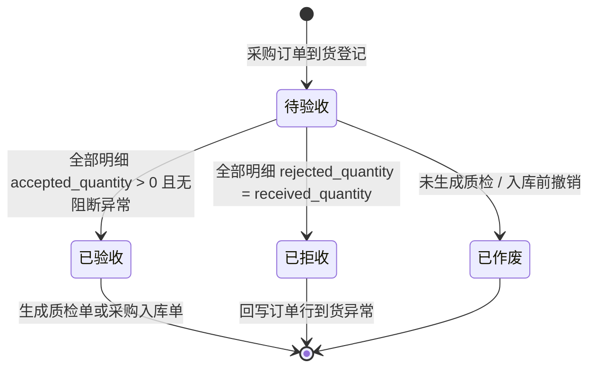

#### 4.1.3 特别说明

- S-03 只表示“到货与现场验收登记”，不直接增加库存。
- `goods_receipt_state=已验收` 后，如物料需质检，生成 S-04；无需质检时可直接生成 S-05。
- S-03 必须按 S-23 订单行校验累计到货数量，不得超过订单行数量 + 允许超收比例。

### 4.2 S-24 goods_receipt_line 到货验收明细

| 字段名 | 类型 | 长度/精度 | 空值 | 默认值 | 唯一 | 外键 | 索引建议 | 注释 |
| --- | --- | --- | --- | --- | --- | --- | --- | --- |
| `line_id` | bigint | — | NOT NULL | auto | PK | — | PK | 技术主键 |
| `receipt_id` | bigint | — | NOT NULL | — | — | FK→S-03 | idx | 到货验收单 |
| `order_line_id` | bigint | — | NOT NULL | — | — | FK→S-23 | idx | 来源采购订单明细 |
| `material_id` | bigint | — | NOT NULL | — | — | FK→M-05 | idx | 物料 |
| `unit_id` | bigint | — | NOT NULL | — | — | FK→M-07 | idx | 到货计量单位 |
| `ordered_quantity` | decimal | (18,4) | NOT NULL | — | — | — | — | 订单数量，冗余便于校验 |
| `received_quantity` | decimal | (18,4) | NOT NULL | 0 | — | — | — | 本次到货数量 |
| `accepted_quantity` | decimal | (18,4) | NOT NULL | 0 | — | — | — | 验收通过数量 |
| `rejected_quantity` | decimal | (18,4) | NOT NULL | 0 | — | — | — | 拒收数量 |
| `shortage_quantity` | decimal | (18,4) | NOT NULL | 0 | — | — | — | 短缺数量 |
| `damage_quantity` | decimal | (18,4) | NOT NULL | 0 | — | — | — | 损坏数量 |
| `need_inspection_flag` | boolean | — | NOT NULL | false | — | — | — | 是否需质检 |
| `inspection_requirement` | varchar | 255 | NULL | — | — | — | — | 质检要求 |
| `line_remark` | varchar | 255 | NULL | — | — | — | — | 明细备注 |

**约束：** `received_quantity = accepted_quantity + rejected_quantity + shortage_quantity + damage_quantity`，若业务允许“待判定数量”，须以配置项显式启用并进入质检挂起状态。

### 4.3 S-04 quality_inspection 质检单

| 字段名 | 类型 | 长度/精度 | 空值 | 默认值 | 唯一 | 外键 | 索引建议 | 注释 |
| --- | --- | --- | --- | --- | --- | --- | --- | --- |
| `inspection_id` | bigint | — | NOT NULL | auto | PK | — | PK | 技术主键 |
| `inspection_no` | varchar | 32 | NOT NULL | — | UQ | — | UQ | 前缀 `QC`（SY-01 取号） |
| `receipt_id` | bigint | — | NOT NULL | — | — | FK→S-03 | idx | 来源到货验收单 |
| `inspection_date` | date | — | NULL | — | — | — | idx | 检验日期 |
| `inspector_id` | bigint | — | NULL | — | — | FK→A-01 | idx | 检验人 |
| `inspection_method` | varchar | 32 | NOT NULL | `抽检` | — | — | — | 全检 / 抽检 / 外检 / 免检 |
| `sample_quantity` | decimal | (18,4) | NULL | — | — | — | — | 抽样数量 |
| `qualified_quantity` | decimal | (18,4) | NOT NULL | 0 | — | — | — | 合格数量 |
| `unqualified_quantity` | decimal | (18,4) | NOT NULL | 0 | — | — | — | 不合格数量 |
| `concession_quantity` | decimal | (18,4) | NOT NULL | 0 | — | — | — | 让步接收数量 |
| `inspection_result` | varchar | 16 | NULL | — | — | — | idx | 合格 / 不合格 / 让步接收 |
| `inspection_state` | varchar | 16 | NOT NULL | `待检` | — | — | idx | 待检 / 检验中 / 已检验 / 已作废 |
| `quality_report_file_id` | bigint | — | NULL | — | — | FK→SY-04 | — | 质检报告附件 |
| `unqualified_reason` | varchar | 255 | NULL | — | — | — | — | 不合格原因 |
| `disposal_suggestion` | varchar | 64 | NULL | — | — | — | — | 退货 / 让步接收 / 返修 / 报废 |

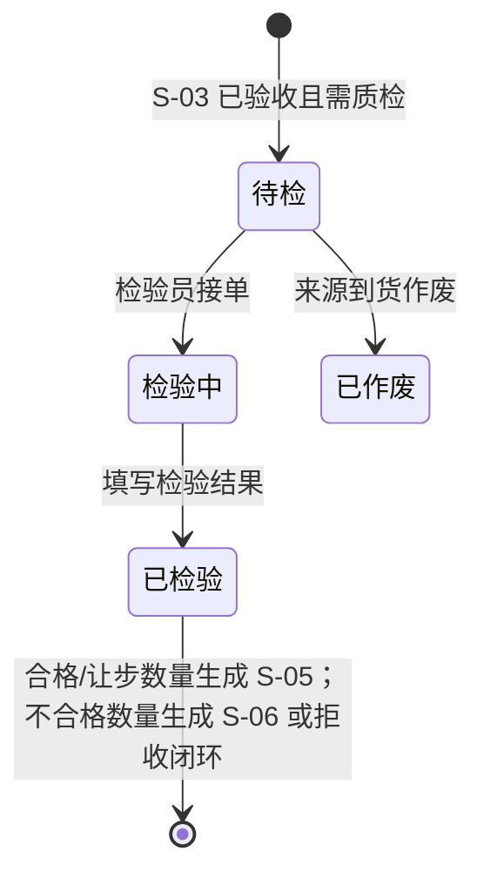

### 4.4 S-05 purchase_receipt 采购入库单

| 字段名 | 类型 | 长度/精度 | 空值 | 默认值 | 唯一 | 外键 | 索引建议 | 注释 |
| --- | --- | --- | --- | --- | --- | --- | --- | --- |
| `receipt_id` | bigint | — | NOT NULL | auto | PK | — | PK | 技术主键 |
| `receipt_no` | varchar | 32 | NOT NULL | — | UQ | — | UQ | 前缀 `RC`（SY-01 取号） |
| `org_id` | bigint | — | NOT NULL | — | — | FK→M-01 | idx | 入库组织 |
| `warehouse_id` | bigint | — | NOT NULL | — | — | FK→M-02 | idx | 入库仓库 |
| `source_receipt_id` | bigint | — | NULL | — | — | FK→S-03 | idx | 来源到货验收单 |
| `inspection_id` | bigint | — | NULL | — | — | FK→S-04 | idx | 来源质检单 |
| `supplier_id` | bigint | — | NOT NULL | — | — | FK→M-09 | idx | 供应商 |
| `order_id` | bigint | — | NOT NULL | — | — | FK→S-02 | idx | 来源采购订单 |
| `contract_id` | bigint | — | NULL | — | — | FK→C-02 | idx | 来源合同 |
| `receipt_date` | date | — | NOT NULL | — | — | — | idx | 入库日期 |
| `receipt_type` | varchar | 32 | NOT NULL | `采购入库` | — | — | idx | 采购入库 / 让步入库 / 暂估入库 / 冲销入库 |
| `total_quantity` | decimal | (18,4) | NOT NULL | 0 | — | — | — | 入库总数量（明细汇总） |
| `total_amount` | decimal | (18,2) | NOT NULL | 0 | — | — | — | 入库金额（明细汇总） |
| `is_invoice_arrived` | varchar | 8 | NOT NULL | `未到` | — | — | idx | 已到 / 未到 |
| `invoice_no` | varchar | 64 | NULL | — | — | — | idx | 发票号，可多张时存主号，明细附件补充 |
| `estimate_required_flag` | boolean | — | NOT NULL | false | — | — | idx | 是否需暂估 |
| `interface_push_state` | varchar | 16 | NOT NULL | `待推送` | — | — | idx | 待推送 / 推送中 / 推送成功 / 推送失败 / 已重推 / 已关闭 |
| `purchase_receipt_state` | varchar | 16 | NOT NULL | `草稿` | — | — | idx | 草稿 / 待审 / 已审 / 已作废 / 已冲销 |
| `workflow_instance_id` | bigint | — | NULL | — | — | FK→A-20 | idx | 审批实例 |
| `remark` | varchar | 512 | NULL | — | — | — | — | 备注 |

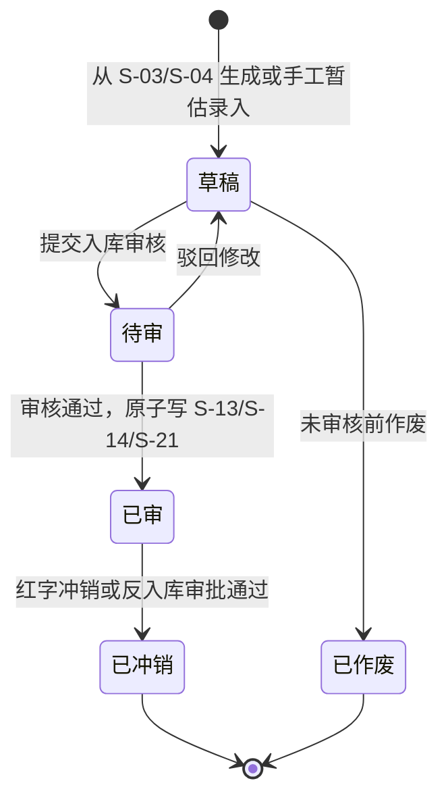

**特别说明：**

- S-05 审核通过是采购入库真正生效点，必须与 S-13、S-14、S-21 同事务提交。
- `interface_push_state` 统一采用 01-V1.0 口径，不使用 `nc_push_state`。
- 发票未到时可形成 S-07 暂估，发票到达后走冲销 + 正式入账口径，具体财务报文由 08 承接。
- S-05 审核通过后回写 C-11 合同明细执行数量 / 执行金额，并触发 C-04 付款节点条件检查。

### 4.5 S-25 purchase_receipt_line 采购入库明细

| 字段名 | 类型 | 长度/精度 | 空值 | 默认值 | 唯一 | 外键 | 索引建议 | 注释 |
| --- | --- | --- | --- | --- | --- | --- | --- | --- |
| `line_id` | bigint | — | NOT NULL | auto | PK | — | PK | 技术主键 |
| `receipt_id` | bigint | — | NOT NULL | — | — | FK→S-05 | idx | 采购入库单 |
| `receipt_line_id` | bigint | — | NULL | — | — | FK→S-24 | idx | 来源到货验收明细 |
| `order_line_id` | bigint | — | NOT NULL | — | — | FK→S-23 | idx | 来源采购订单明细 |
| `contract_line_id` | bigint | — | NULL | — | — | FK→C-11 | idx | 合同明细 |
| `material_id` | bigint | — | NOT NULL | — | — | FK→M-05 | idx | 物料 |
| `unit_id` | bigint | — | NOT NULL | — | — | FK→M-07 | idx | 入库单位 |
| `batch_id` | bigint | — | NULL | — | — | FK→M-15 | idx | 批次；HG/HX 必填 |
| `location_id` | bigint | — | NULL | — | — | FK→M-03B | idx | 入库货位 |
| `quantity` | decimal | (18,4) | NOT NULL | — | — | — | — | 入库数量 |
| `unit_price` | decimal | (18,6) | NOT NULL | — | — | — | — | 入库单价 |
| `line_amount` | decimal | (18,2) | NOT NULL | — | — | — | — | 入库金额 |
| `tax_rate` | decimal | (8,4) | NULL | — | — | — | — | 税率 |
| `tax_amount` | decimal | (18,2) | NULL | — | — | — | — | 税额 |
| `inventory_transaction_id` | bigint | — | NULL | — | — | FK→S-21 | idx | 审核后生成的库存事务 |
| `quality_result` | varchar | 16 | NULL | — | — | — | — | 合格 / 让步接收 / 免检 |
| `line_remark` | varchar | 255 | NULL | — | — | — | — | 明细备注 |

### 4.6 S-06 purchase_return 与 S-29 purchase_return_line 采购退货

#### 4.6.1 S-06 purchase_return 采购退货单

| 字段名 | 类型 | 长度/精度 | 空值 | 默认值 | 唯一 | 外键 | 索引建议 | 注释 |
| --- | --- | --- | --- | --- | --- | --- | --- | --- |
| `return_id` | bigint | — | NOT NULL | auto | PK | — | PK | 技术主键 |
| `return_no` | varchar | 32 | NOT NULL | — | UQ | — | UQ | 前缀 `RT`（SY-01 取号） |
| `receipt_id` | bigint | — | NOT NULL | — | — | FK→S-05 | idx | 原采购入库单 |
| `supplier_id` | bigint | — | NOT NULL | — | — | FK→M-09 | idx | 供应商 |
| `org_id` | bigint | — | NOT NULL | — | — | FK→M-01 | idx | 退货组织 |
| `warehouse_id` | bigint | — | NOT NULL | — | — | FK→M-02 | idx | 退货仓库 |
| `return_date` | date | — | NOT NULL | — | — | — | idx | 退货日期 |
| `return_reason` | varchar | 255 | NOT NULL | — | — | — | — | 退货原因 |
| `total_return_quantity` | decimal | (18,4) | NOT NULL | 0 | — | — | — | 退货总数量 |
| `total_return_amount` | decimal | (18,2) | NOT NULL | 0 | — | — | — | 退货总金额 |
| `return_state` | varchar | 16 | NOT NULL | `待审` | — | — | idx | 待审 / 已审 / 已驳回 / 已作废 / 已冲销 |
| `interface_push_state` | varchar | 16 | NOT NULL | `待推送` | — | — | idx | 待推送 / 推送中 / 推送成功 / 推送失败 / 已重推 / 已关闭 |
| `workflow_instance_id` | bigint | — | NULL | — | — | FK→A-20 | idx | 审批实例 |

#### 4.6.2 S-29 purchase_return_line 采购退货明细

| 字段名 | 类型 | 长度/精度 | 空值 | 默认值 | 唯一 | 外键 | 索引建议 | 注释 |
| --- | --- | --- | --- | --- | --- | --- | --- | --- |
| `line_id` | bigint | — | NOT NULL | auto | PK | — | PK | 技术主键 |
| `return_id` | bigint | — | NOT NULL | — | — | FK→S-06 | idx | 采购退货单 |
| `receipt_line_id` | bigint | — | NOT NULL | — | — | FK→S-25 | idx | 原入库明细 |
| `material_id` | bigint | — | NOT NULL | — | — | FK→M-05 | idx | 物料 |
| `batch_id` | bigint | — | NULL | — | — | FK→M-15 | idx | 批次 |
| `location_id` | bigint | — | NULL | — | — | FK→M-03B | idx | 退货货位 |
| `return_quantity` | decimal | (18,4) | NOT NULL | — | — | — | — | 退货数量 |
| `unit_price` | decimal | (18,6) | NOT NULL | — | — | — | — | 退货单价，默认原入库单价 |
| `return_amount` | decimal | (18,2) | NOT NULL | — | — | — | — | 退货金额 |
| `inventory_transaction_id` | bigint | — | NULL | — | — | FK→S-21 | idx | 审核后生成的库存事务 |

**规则：** S-06 审核通过形成 `transaction_type=退货` 的 S-21，扣减 S-13/S-14；如原入库已推 NC，退货触发红字接口，接口细则由 08 承接。

### 4.7 S-07 purchase_estimate 采购入库暂估

| 字段名 | 类型 | 长度/精度 | 空值 | 默认值 | 唯一 | 外键 | 索引建议 | 注释 |
| --- | --- | --- | --- | --- | --- | --- | --- | --- |
| `estimate_id` | bigint | — | NOT NULL | auto | PK | — | PK | 技术主键 |
| `estimate_no` | varchar | 32 | NOT NULL | — | UQ | — | UQ | 前缀 `PE`（SY-01 取号） |
| `receipt_id` | bigint | — | NOT NULL | — | — | FK→S-05 | idx | 来源采购入库单 |
| `org_id` | bigint | — | NOT NULL | — | — | FK→M-01 | idx | 组织 |
| `supplier_id` | bigint | — | NOT NULL | — | — | FK→M-09 | idx | 供应商 |
| `estimate_period` | varchar | 7 | NOT NULL | — | — | — | idx | 暂估期间，YYYY-MM |
| `estimate_amount` | decimal | (18,2) | NOT NULL | — | — | — | — | 暂估金额 |
| `reversal_period` | varchar | 7 | NULL | — | — | — | idx | 冲销期间 |
| `formal_receipt_id` | bigint | — | NULL | — | — | FK→S-05 | idx | 发票到达后正式入账单 |
| `estimate_state` | varchar | 16 | NOT NULL | `暂估中` | — | — | idx | 暂估中 / 已冲销 / 已正式入账 / 已作废 |
| `interface_push_state` | varchar | 16 | NOT NULL | `待推送` | — | — | idx | 待推送 / 推送中 / 推送成功 / 推送失败 / 已重推 / 已关闭 |

**规则：** 发票未到但物资已入库时，S-05 审核后生成 S-07；月末可推暂估，次月或发票到达后冲销，具体凭证规则由 08 详设承接。

### 4.8 S-08/S-26 领料申请

#### 4.8.1 S-08 requisition_request 领料申请单

| 字段名 | 类型 | 长度/精度 | 空值 | 默认值 | 唯一 | 外键 | 索引建议 | 注释 |
| --- | --- | --- | --- | --- | --- | --- | --- | --- |
| `request_id` | bigint | — | NOT NULL | auto | PK | — | PK | 技术主键 |
| `request_no` | varchar | 32 | NOT NULL | — | UQ | — | UQ | 前缀 `RQ`（SY-01 取号） |
| `org_id` | bigint | — | NOT NULL | — | — | FK→M-01 | idx | 申请组织 |
| `usage_unit_id` | bigint | — | NOT NULL | — | — | FK→M-01 | idx | 使用单位 |
| `cost_center_id` | bigint | — | NULL | — | — | FK→M-12 | idx | 成本中心，可由 M-13 默认带出 |
| `request_date` | date | — | NOT NULL | — | — | — | idx | 申请日期 |
| `required_date` | date | — | NULL | — | — | — | idx | 期望领用日期 |
| `request_purpose` | varchar | 255 | NOT NULL | — | — | — | — | 用途说明 |
| `total_quantity` | decimal | (18,4) | NOT NULL | 0 | — | — | — | 明细汇总数量 |
| `request_state` | varchar | 16 | NOT NULL | `草稿` | — | — | idx | 草稿 / 待审 / 已审 / 已驳回 / 待领用 / 已领用 / 已作废 |
| `workflow_instance_id` | bigint | — | NULL | — | — | FK→A-20 | idx | 审批实例 |

#### 4.8.2 S-26 requisition_request_line 领料申请明细

| 字段名 | 类型 | 长度/精度 | 空值 | 默认值 | 唯一 | 外键 | 索引建议 | 注释 |
| --- | --- | --- | --- | --- | --- | --- | --- | --- |
| `line_id` | bigint | — | NOT NULL | auto | PK | — | PK | 技术主键 |
| `request_id` | bigint | — | NOT NULL | — | — | FK→S-08 | idx | 领料申请单 |
| `plan_line_id` | bigint | — | NULL | — | — | FK→P-03 | idx | 对应已审采购计划明细；无显式来源时由出库计划核验规则反查 |
| `material_id` | bigint | — | NOT NULL | — | — | FK→M-05 | idx | 物料 |
| `unit_id` | bigint | — | NOT NULL | — | — | FK→M-07 | idx | 单位 |
| `quantity` | decimal | (18,4) | NOT NULL | — | — | — | — | 申请数量 |
| `approved_quantity` | decimal | (18,4) | NULL | — | — | — | — | 审批核定数量 |
| `issued_quantity` | decimal | (18,4) | NOT NULL | 0 | — | — | — | 已出库数量 |
| `cost_center_id` | bigint | — | NULL | — | — | FK→M-12 | idx | 明细成本中心，可覆盖主表 |
| `usage_description` | varchar | 255 | NULL | — | — | — | — | 用途说明 |
| `requisition_line_state` | varchar | 16 | NOT NULL | `待出库` | — | — | idx | 待出库 / 部分出库 / 已出库 / 已关闭 |

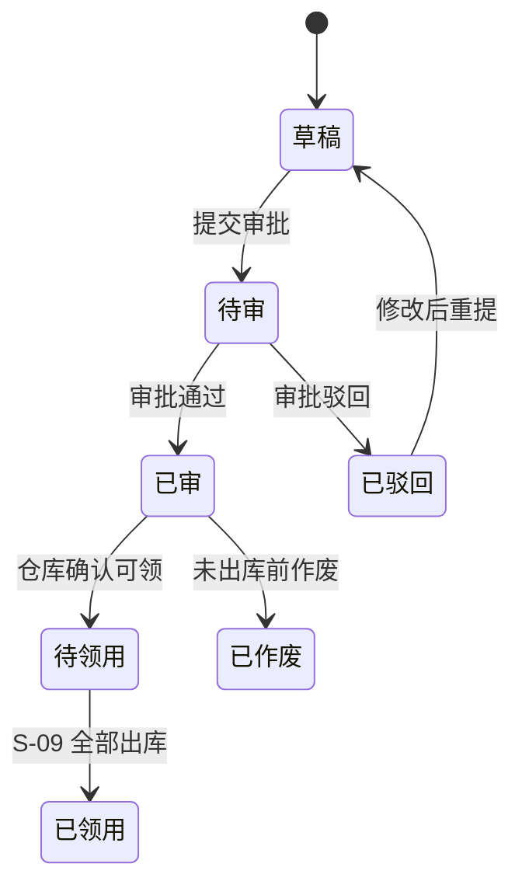

### 4.9 S-09/S-27 领料出库

#### 4.9.1 S-09 material_issuance 领料出库单

| 字段名 | 类型 | 长度/精度 | 空值 | 默认值 | 唯一 | 外键 | 索引建议 | 注释 |
| --- | --- | --- | --- | --- | --- | --- | --- | --- |
| `issuance_id` | bigint | — | NOT NULL | auto | PK | — | PK | 技术主键 |
| `issuance_no` | varchar | 32 | NOT NULL | — | UQ | — | UQ | 前缀 `IS`（SY-01 取号） |
| `request_id` | bigint | — | NULL | — | — | FK→S-08 | idx | 来源领料申请单 |
| `org_id` | bigint | — | NOT NULL | — | — | FK→M-01 | idx | 出库组织 |
| `usage_unit_id` | bigint | — | NOT NULL | — | — | FK→M-01 | idx | 使用单位 |
| `warehouse_id` | bigint | — | NOT NULL | — | — | FK→M-02 | idx | 出库仓库 |
| `cost_center_id` | bigint | — | NULL | — | — | FK→M-12 | idx | 成本中心 |
| `issuance_date` | date | — | NOT NULL | — | — | — | idx | 出库日期 |
| `plan_check_state` | varchar | 16 | NOT NULL | `待校验` | — | — | idx | 待校验 / 通过 / 不通过 / 豁免 |
| `print_month` | varchar | 7 | NULL | — | — | — | idx | 首次打印所属月份，格式 YYYY-MM |
| `print_state` | varchar | 16 | NOT NULL | `未打印` | — | — | idx | 未打印 / 已打印 / 已作废 |
| `first_print_time` | timestamp | — | NULL | — | — | — | — | 首次打印时间 |
| `print_hash` | varchar | 64 | NULL | — | — | — | — | 首次打印版式与内容摘要，防重复打印 |
| `issuance_type` | varchar | 32 | NOT NULL | `领料出库` | — | — | idx | 领料出库 / 维修出库 / 消耗出库 / 其他出库 |
| `total_quantity` | decimal | (18,4) | NOT NULL | 0 | — | — | — | 出库总数量 |
| `total_amount` | decimal | (18,2) | NOT NULL | 0 | — | — | — | 出库成本金额 |
| `issuance_state` | varchar | 16 | NOT NULL | `草稿` | — | — | idx | 草稿 / 待审 / 已审 / 已出库 / 已作废 / 已冲销 |
| `interface_push_state` | varchar | 16 | NOT NULL | `待推送` | — | — | idx | 待推送 / 推送中 / 推送成功 / 推送失败 / 已重推 / 已关闭 |
| `workflow_instance_id` | bigint | — | NULL | — | — | FK→A-20 | idx | 审批实例 |

#### 4.9.2 S-27 material_issuance_line 领料出库明细

| 字段名 | 类型 | 长度/精度 | 空值 | 默认值 | 唯一 | 外键 | 索引建议 | 注释 |
| --- | --- | --- | --- | --- | --- | --- | --- | --- |
| `line_id` | bigint | — | NOT NULL | auto | PK | — | PK | 技术主键 |
| `issuance_id` | bigint | — | NOT NULL | — | — | FK→S-09 | idx | 领料出库单 |
| `request_line_id` | bigint | — | NULL | — | — | FK→S-26 | idx | 来源领料申请明细 |
| `material_id` | bigint | — | NOT NULL | — | — | FK→M-05 | idx | 物料 |
| `batch_id` | bigint | — | NULL | — | — | FK→M-15 | idx | 出库批次 |
| `location_id` | bigint | — | NULL | — | — | FK→M-03B | idx | 出库货位 |
| `unit_id` | bigint | — | NOT NULL | — | — | FK→M-07 | idx | 单位 |
| `quantity` | decimal | (18,4) | NOT NULL | — | — | — | — | 出库数量 |
| `unit_cost` | decimal | (18,6) | NOT NULL | — | — | — | — | 出库单位成本 |
| `line_amount` | decimal | (18,2) | NOT NULL | — | — | — | — | 出库金额 |
| `cost_center_id` | bigint | — | NULL | — | — | FK→M-12 | idx | 成本中心 |
| `inventory_transaction_id` | bigint | — | NULL | — | — | FK→S-21 | idx | 审核后生成的库存事务 |

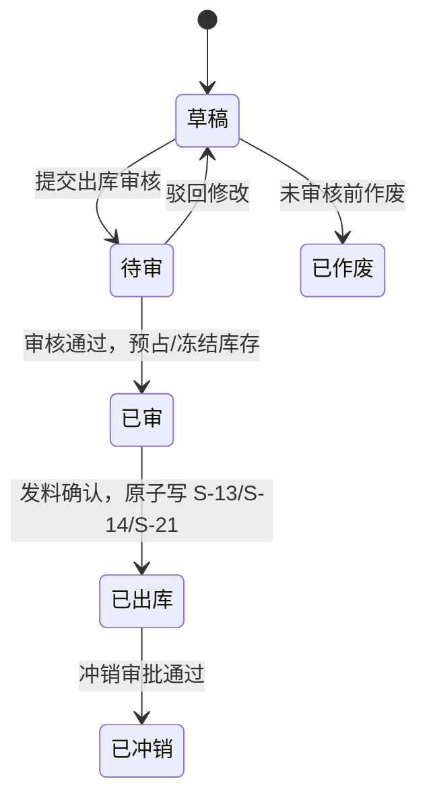

### 4.10 S-10/S-30 退料入库

| 实体 | 字段名 | 类型 | 关键约束 / 注释 |
| --- | --- | --- | --- |
| S-10 | `return_id` | bigint | PK |
| S-10 | `return_no` | varchar(32) | UQ，前缀 `MR`（SY-01 取号） |
| S-10 | `issuance_id` | bigint | FK→S-09，原领料出库单 |
| S-10 | `org_id` / `warehouse_id` / `usage_unit_id` | bigint | FK→M-01/M-02/M-01 |
| S-10 | `return_date` | date | 退料日期 |
| S-10 | `return_reason` | varchar(255) | 退料原因 |
| S-10 | `total_return_quantity` / `total_return_amount` | decimal | 明细汇总 |
| S-10 | `return_state` | varchar(16) | 待审 / 已审 / 已驳回 / 已作废 |
| S-10 | `interface_push_state` | varchar(16) | 待推送 / 推送中 / 推送成功 / 推送失败 / 已重推 / 已关闭 |
| S-30 | `line_id` | bigint | PK |
| S-30 | `return_id` | bigint | FK→S-10 |
| S-30 | `issuance_line_id` | bigint | FK→S-27，原出库明细 |
| S-30 | `material_id` / `batch_id` / `location_id` | bigint | FK→M-05/M-15/M-03B |
| S-30 | `return_quantity` | decimal(18,4) | 不得超过原出库行可退数量 |
| S-30 | `unit_cost` / `return_amount` | decimal | 默认按原出库成本回补 |
| S-30 | `inventory_transaction_id` | bigint | FK→S-21 |

**规则：** S-10 审核通过形成 `transaction_type=退料` 的 S-21，增加 S-13/S-14，成本按原 S-27 出库成本回补；若已推 NC，则触发退料接口或红字冲销，细则由 08 承接。

### 4.11 S-11/S-12/S-28 调拨

#### 4.11.1 S-11 transfer_request 调拨申请单

| 字段名 | 类型 | 长度/精度 | 空值 | 默认值 | 唯一 | 外键 | 索引建议 | 注释 |
| --- | --- | --- | --- | --- | --- | --- | --- | --- |
| `request_id` | bigint | — | NOT NULL | auto | PK | — | PK | 技术主键 |
| `request_no` | varchar | 32 | NOT NULL | — | UQ | — | UQ | 前缀 `TQ`（SY-01 取号） |
| `from_org_id` | bigint | — | NOT NULL | — | — | FK→M-01 | idx | 调出组织 |
| `to_org_id` | bigint | — | NOT NULL | — | — | FK→M-01 | idx | 调入组织 |
| `from_warehouse_id` | bigint | — | NOT NULL | — | — | FK→M-02 | idx | 调出仓库 |
| `to_warehouse_id` | bigint | — | NOT NULL | — | — | FK→M-02 | idx | 调入仓库 |
| `request_date` | date | — | NOT NULL | — | — | — | idx | 申请日期 |
| `transfer_reason` | varchar | 255 | NOT NULL | — | — | — | — | 调拨原因 |
| `request_state` | varchar | 16 | NOT NULL | `待审` | — | — | idx | 待审 / 已审 / 已驳回 / 已作废 |
| `workflow_instance_id` | bigint | — | NULL | — | — | FK→A-20 | idx | 审批实例 |

#### 4.11.2 S-12 transfer_order 调拨单

| 字段名 | 类型 | 长度/精度 | 空值 | 默认值 | 唯一 | 外键 | 索引建议 | 注释 |
| --- | --- | --- | --- | --- | --- | --- | --- | --- |
| `order_id` | bigint | — | NOT NULL | auto | PK | — | PK | 技术主键 |
| `order_no` | varchar | 32 | NOT NULL | — | UQ | — | UQ | 前缀 `TR`（SY-01 取号） |
| `request_id` | bigint | — | NULL | — | — | FK→S-11 | idx | 来源调拨申请 |
| `from_org_id` / `to_org_id` | bigint | — | NOT NULL | — | — | FK→M-01 | idx | 调出 / 调入组织 |
| `from_warehouse_id` / `to_warehouse_id` | bigint | — | NOT NULL | — | — | FK→M-02 | idx | 调出 / 调入仓库 |
| `transfer_date` | date | — | NOT NULL | — | — | — | idx | 调拨日期 |
| `print_state` / `first_print_time` | varchar(16) / timestamp | — | NOT NULL / NULL | `未打印` / — | — | — | idx / — | 移拨单打印状态与首次打印时间 |
| `reprint_workflow_instance_id` | bigint | — | NULL | — | — | FK→A-20 | idx | 移拨单重打审批实例 |
| `transfer_order_state` | varchar | 16 | NOT NULL | `待调拨` | — | — | idx | 待调拨 / 调出已发 / 待签收 / 已签收 / 已作废 / 已冲销 |
| `interface_push_state` | varchar | 16 | NOT NULL | `待推送` | — | — | idx | 待推送 / 推送中 / 推送成功 / 推送失败 / 已重推 / 已关闭 |
| `out_confirm_person_id` | bigint | — | NULL | — | — | FK→A-01 | — | 调出确认人 |
| `in_confirm_person_id` | bigint | — | NULL | — | — | FK→A-01 | — | 调入签收人 |

#### 4.11.3 S-28 transfer_order_line 调拨明细

| 字段名 | 类型 | 长度/精度 | 空值 | 默认值 | 唯一 | 外键 | 索引建议 | 注释 |
| --- | --- | --- | --- | --- | --- | --- | --- | --- |
| `line_id` | bigint | — | NOT NULL | auto | PK | — | PK | 技术主键 |
| `order_id` | bigint | — | NOT NULL | — | — | FK→S-12 | idx | 调拨单 |
| `material_id` | bigint | — | NOT NULL | — | — | FK→M-05 | idx | 物料 |
| `batch_id` | bigint | — | NULL | — | — | FK→M-15 | idx | 批次 |
| `from_location_id` | bigint | — | NULL | — | — | FK→M-03B | idx | 调出货位 |
| `to_location_id` | bigint | — | NULL | — | — | FK→M-03B | idx | 调入货位 |
| `unit_id` | bigint | — | NOT NULL | — | — | FK→M-07 | idx | 单位 |
| `quantity` | decimal | (18,4) | NOT NULL | — | — | — | — | 调拨数量 |
| `unit_cost` | decimal | (18,6) | NOT NULL | — | — | — | — | 调拨成本 |
| `line_amount` | decimal | (18,2) | NOT NULL | — | — | — | — | 调拨金额 |
| `out_transaction_id` | bigint | — | NULL | — | — | FK→S-21 | idx | 调出事务 |
| `in_transaction_id` | bigint | — | NULL | — | — | FK→S-21 | idx | 调入事务 |

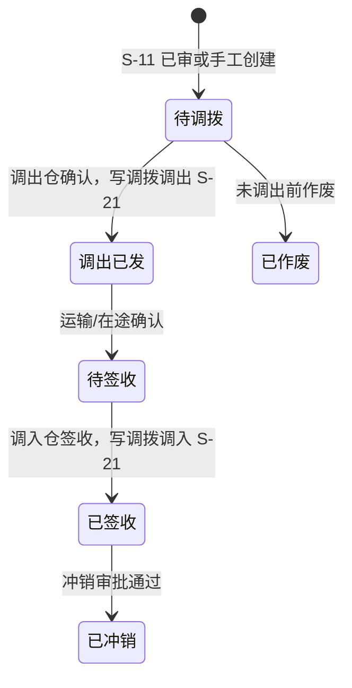

**规则：** 跨组织调拨必须满足 M-16 组织-仓库关系约束；跨组织调拨触发 NC 接口，同组织跨仓调拨是否推送由 F-13 接口开关控制。

### 4.12 S-13 inventory 库存台账

| 字段名 | 类型 | 长度/精度 | 空值 | 默认值 | 唯一 | 外键 | 索引建议 | 注释 |
| --- | --- | --- | --- | --- | --- | --- | --- | --- |
| `inventory_id` | bigint | — | NOT NULL | auto | PK | — | PK | 技术主键 |
| `org_id` | bigint | — | NOT NULL | — | UQ1 | FK→M-01 | idx | 库存归属组织 |
| `warehouse_id` | bigint | — | NOT NULL | — | UQ1 | FK→M-02 | idx | 仓库 |
| `material_id` | bigint | — | NOT NULL | — | UQ1 | FK→M-05 | idx | 物料 |
| `unit_id` | bigint | — | NOT NULL | — | — | FK→M-07 | idx | 库存单位 |
| `quantity` | decimal | (18,4) | NOT NULL | 0 | — | — | — | 账面总数量 |
| `in_quantity` | decimal | (18,4) | NOT NULL | 0 | — | — | — | 累计入库数量 |
| `out_quantity` | decimal | (18,4) | NOT NULL | 0 | — | — | — | 累计出库数量 |
| `frozen_quantity` | decimal | (18,4) | NOT NULL | 0 | — | — | — | 冻结数量 |
| `available_quantity` | decimal | (18,4) | NOT NULL | 0 | — | — | idx | 可用数量，quantity - frozen_quantity - reserved_quantity |
| `reserved_quantity` | decimal | (18,4) | NOT NULL | 0 | — | — | — | 已预留数量 |
| `unit_cost` | decimal | (18,6) | NOT NULL | 0 | — | — | — | 移动平均单价或当前成本 |
| `total_amount` | decimal | (18,2) | NOT NULL | 0 | — | — | — | 库存金额 |
| `last_transaction_id` | bigint | — | NULL | — | — | FK→S-21 | idx | 最近库存事务 |
| `last_transaction_time` | timestamp | — | NULL | — | — | — | idx | 最近变动时间 |

**唯一约束：** `(org_id, warehouse_id, material_id)` 唯一。S-13 是库存唯一事实源，报表、AI、接口对账不得绕过 S-13/S-21 自行拼接业务单据推导库存。

### 4.13 S-14 inventory_batch 库存批次账

| 字段名 | 类型 | 长度/精度 | 空值 | 默认值 | 唯一 | 外键 | 索引建议 | 注释 |
| --- | --- | --- | --- | --- | --- | --- | --- | --- |
| `batch_inventory_id` | bigint | — | NOT NULL | auto | PK | — | PK | 技术主键 |
| `inventory_id` | bigint | — | NOT NULL | — | UQ1 | FK→S-13 | idx | 库存台账 |
| `batch_id` | bigint | — | NOT NULL | — | UQ1 | FK→M-15 | idx | 物料批次 |
| `location_id` | bigint | — | NULL | — | UQ1 | FK→M-03B | idx | 货位，启用货位管理时参与唯一 |
| `batch_quantity` | decimal | (18,4) | NOT NULL | 0 | — | — | — | 批次数量 |
| `batch_available_quantity` | decimal | (18,4) | NOT NULL | 0 | — | — | idx | 批次可用量 |
| `batch_frozen_quantity` | decimal | (18,4) | NOT NULL | 0 | — | — | — | 批次冻结量 |
| `fifo_priority` | integer | — | NOT NULL | 0 | — | — | idx | FIFO 优先级 |
| `expired_flag` | boolean | — | NOT NULL | false | — | — | idx | 是否过期 |
| `last_transaction_id` | bigint | — | NULL | — | — | FK→S-21 | idx | 最近事务 |

**规则：** HG/HX 物料必须维护 S-14；批次状态以 M-15 `batch_state=有效/临期/过期/冻结/作废` 为准，S-14 不另设状态字段。

### 4.14 S-15/S-16/S-17/S-18 盘点

#### 4.14.1 S-15 inventory_task 盘点任务单

| 字段名 | 类型 | 长度/精度 | 空值 | 默认值 | 唯一 | 外键 | 索引建议 | 注释 |
| --- | --- | --- | --- | --- | --- | --- | --- | --- |
| `task_id` | bigint | — | NOT NULL | auto | PK | — | PK | 技术主键 |
| `task_no` | varchar | 32 | NOT NULL | — | UQ | — | UQ | 前缀 `IT`（SY-01 取号） |
| `org_id` | bigint | — | NOT NULL | — | — | FK→M-01 | idx | 组织 |
| `warehouse_id` | bigint | — | NOT NULL | — | — | FK→M-02 | idx | 仓库 |
| `task_type` | varchar | 32 | NOT NULL | — | — | — | idx | 全盘 / 抽盘 / 动态盘点 / 专项盘点 |
| `task_date` | date | — | NOT NULL | — | — | — | idx | 盘点日期 |
| `freeze_scope_flag` | boolean | — | NOT NULL | true | — | — | — | 盘点期间是否冻结范围内出入库 |
| `task_state` | varchar | 16 | NOT NULL | `待执行` | — | — | idx | 待执行 / 执行中 / 已完成 / 已驳回 / 已作废 |
| `workflow_instance_id` | bigint | — | NULL | — | — | FK→A-20 | idx | 审批实例 |

#### 4.14.2 S-16 inventory_count 盘点单

| 字段名 | 类型 | 长度/精度 | 空值 | 默认值 | 唯一 | 外键 | 索引建议 | 注释 |
| --- | --- | --- | --- | --- | --- | --- | --- | --- |
| `count_id` | bigint | — | NOT NULL | auto | PK | — | PK | 技术主键 |
| `count_no` | varchar | 32 | NOT NULL | — | UQ | — | UQ | 前缀 `IC`（SY-01 取号） |
| `task_id` | bigint | — | NOT NULL | — | — | FK→S-15 | idx | 盘点任务 |
| `material_id` | bigint | — | NOT NULL | — | — | FK→M-05 | idx | 物料 |
| `batch_id` | bigint | — | NULL | — | — | FK→M-15 | idx | 批次 |
| `warehouse_id` | bigint | — | NOT NULL | — | — | FK→M-02 | idx | 仓库 |
| `location_id` | bigint | — | NULL | — | — | FK→M-03B | idx | 货位 |
| `account_quantity` | decimal | (18,4) | NOT NULL | — | — | — | — | 账面数量 |
| `count_quantity` | decimal | (18,4) | NULL | — | — | — | — | 实盘数量 |
| `difference` | decimal | (18,4) | NULL | — | — | — | — | 差异数量 |
| `difference_amount` | decimal | (18,2) | NULL | — | — | — | — | 差异金额 |
| `count_person_id` | bigint | — | NULL | — | — | FK→A-01 | idx | 盘点人 |
| `count_state` | varchar | 16 | NOT NULL | `待盘` | — | — | idx | 待盘 / 已盘 / 已审 |

#### 4.14.3 S-17/S-18 盘盈盘亏处理

| 实体 | 字段名 | 类型 | 关键约束 / 注释 |
| --- | --- | --- | --- |
| S-17 | `surplus_id` / `surplus_no` | bigint / varchar(32) | PK；UQ，前缀 `SU` |
| S-17 | `task_id` / `count_id` | bigint | FK→S-15/S-16 |
| S-17 | `material_id` / `batch_id` / `warehouse_id` | bigint | FK→M-05/M-15/M-02 |
| S-17 | `surplus_quantity` / `surplus_amount` | decimal | 盘盈数量 / 金额 |
| S-17 | `surplus_reason` | varchar(255) | 盘盈原因 |
| S-17 | `approval_state` | varchar(16) | 待审 / 已审 / 已驳回 / 已作废 |
| S-17 | `inventory_transaction_id` | bigint | FK→S-21；已审后写入 |
| S-18 | `shortage_id` / `shortage_no` | bigint / varchar(32) | PK；UQ，前缀 `SL` |
| S-18 | `task_id` / `count_id` | bigint | FK→S-15/S-16 |
| S-18 | `material_id` / `batch_id` / `warehouse_id` | bigint | FK→M-05/M-15/M-02 |
| S-18 | `shortage_quantity` / `shortage_amount` | decimal | 盘亏数量 / 金额 |
| S-18 | `shortage_reason` | varchar(64) | 自然损耗 / 人为损坏 / 丢失 / 计量误差 / 其他 |
| S-18 | `responsible_person_id` | bigint | FK→A-01，可空 |
| S-18 | `approval_state` | varchar(16) | 待审 / 已审 / 已驳回 / 已作废 |
| S-18 | `inventory_transaction_id` | bigint | FK→S-21；已审后写入 |

**规则：** 盘亏属于高敏感操作，超过金额或数量阈值必须升级审批；盘盈 / 盘亏已审后分别形成 `transaction_type=盘盈/盘亏` 的 S-21。

### 4.15 S-19/S-20/S-31 废旧处置

#### 4.15.1 S-19 scrap_declaration 废旧认定单

| 字段名 | 类型 | 长度/精度 | 空值 | 默认值 | 唯一 | 外键 | 索引建议 | 注释 |
| --- | --- | --- | --- | --- | --- | --- | --- | --- |
| `declaration_id` | bigint | — | NOT NULL | auto | PK | — | PK | 技术主键 |
| `declaration_no` | varchar | 32 | NOT NULL | — | UQ | — | UQ | 前缀 `SD`（SY-01 取号） |
| `org_id` | bigint | — | NOT NULL | — | — | FK→M-01 | idx | 申报组织 |
| `warehouse_id` | bigint | — | NOT NULL | — | — | FK→M-02 | idx | 所在仓库 |
| `material_id` | bigint | — | NOT NULL | — | — | FK→M-05 | idx | 物料 |
| `batch_id` | bigint | — | NULL | — | — | FK→M-15 | idx | 批次 |
| `quantity` | decimal | (18,4) | NOT NULL | — | — | — | — | 认定数量 |
| `reason` | varchar | 255 | NOT NULL | — | — | — | — | 废旧原因 |
| `declaration_date` | date | — | NOT NULL | — | — | — | idx | 申报日期 |
| `declaration_state` | varchar | 16 | NOT NULL | `待申请` | — | — | idx | 待申请 / 待审 / 已审 / 已驳回 / 已作废 |
| `workflow_instance_id` | bigint | — | NULL | — | — | FK→A-20 | idx | 审批实例 |

#### 4.15.2 S-20 scrap_disposal 废旧处置单

| 字段名 | 类型 | 长度/精度 | 空值 | 默认值 | 唯一 | 外键 | 索引建议 | 注释 |
| --- | --- | --- | --- | --- | --- | --- | --- | --- |
| `disposal_id` | bigint | — | NOT NULL | auto | PK | — | PK | 技术主键 |
| `disposal_no` | varchar | 32 | NOT NULL | — | UQ | — | UQ | 前缀 `SP`（SY-01 取号） |
| `declaration_id` | bigint | — | NOT NULL | — | — | FK→S-19 | idx | 来源废旧认定单 |
| `org_id` | bigint | — | NOT NULL | — | — | FK→M-01 | idx | 处置组织 |
| `warehouse_id` | bigint | — | NOT NULL | — | — | FK→M-02 | idx | 处置仓库 |
| `disposal_type` | varchar | 32 | NOT NULL | — | — | — | idx | 报废 / 回收 / 变卖 / 销毁 |
| `disposal_date` | date | — | NULL | — | — | — | idx | 实际处置日期 |
| `disposal_quantity` | decimal | (18,4) | NOT NULL | 0 | — | — | — | 处置总数量 |
| `disposal_amount` | decimal | (18,2) | NOT NULL | 0 | — | — | — | 处置收入或残值金额 |
| `buyer_or_receiver` | varchar | 128 | NULL | — | — | — | — | 变卖买方 / 接收方 |
| `disposal_state` | varchar | 16 | NOT NULL | `待处置` | — | — | idx | 待处置 / 处置中 / 已完成 / 已作废 |
| `interface_push_state` | varchar | 16 | NOT NULL | `待推送` | — | — | idx | 待推送 / 推送中 / 推送成功 / 推送失败 / 已重推 / 已关闭 |
| `workflow_instance_id` | bigint | — | NULL | — | — | FK→A-20 | idx | 审批实例 |

#### 4.15.3 S-31 scrap_disposal_line 废旧处置明细

| 字段名 | 类型 | 长度/精度 | 空值 | 默认值 | 唯一 | 外键 | 索引建议 | 注释 |
| --- | --- | --- | --- | --- | --- | --- | --- | --- |
| `line_id` | bigint | — | NOT NULL | auto | PK | — | PK | 技术主键 |
| `disposal_id` | bigint | — | NOT NULL | — | — | FK→S-20 | idx | 废旧处置单 |
| `material_id` | bigint | — | NOT NULL | — | — | FK→M-05 | idx | 物料 |
| `batch_id` | bigint | — | NULL | — | — | FK→M-15 | idx | 批次 |
| `location_id` | bigint | — | NULL | — | — | FK→M-03B | idx | 货位 |
| `disposal_quantity` | decimal | (18,4) | NOT NULL | — | — | — | — | 处置数量 |
| `unit_cost` | decimal | (18,6) | NOT NULL | — | — | — | — | 库存成本 |
| `disposal_amount` | decimal | (18,2) | NOT NULL | 0 | — | — | — | 处置收入 / 残值 |
| `disposal_result` | varchar | 64 | NULL | — | — | — | — | 处置结果说明 |
| `inventory_transaction_id` | bigint | — | NULL | — | — | FK→S-21 | idx | 处置后生成的库存事务 |

**规则：** 废旧处置属于高敏感操作；已完成时扣减库存，形成 `transaction_type=出库` 或 `冲销/报废出库` 类型 S-21，是否推送 NC 由 08 详设与 F-13 开关决定。

### 4.16 S-21 inventory_transaction 库存事务流水

| 字段名 | 类型 | 长度/精度 | 空值 | 默认值 | 唯一 | 外键 | 索引建议 | 注释 |
| --- | --- | --- | --- | --- | --- | --- | --- | --- |
| `transaction_id` | bigint | — | NOT NULL | auto | PK | — | PK | 技术主键 |
| `transaction_no` | varchar | 32 | NOT NULL | — | UQ | — | UQ | 前缀 `TX`（SY-01 取号） |
| `org_id` | bigint | — | NOT NULL | — | — | FK→M-01 | idx | 组织 |
| `warehouse_id` | bigint | — | NOT NULL | — | — | FK→M-02 | idx | 仓库 |
| `material_id` | bigint | — | NOT NULL | — | — | FK→M-05 | idx | 物料 |
| `batch_id` | bigint | — | NULL | — | — | FK→M-15 | idx | 批次 |
| `location_id` | bigint | — | NULL | — | — | FK→M-03B | idx | 货位 |
| `inventory_id` | bigint | — | NOT NULL | — | — | FK→S-13 | idx | 库存台账 |
| `batch_inventory_id` | bigint | — | NULL | — | — | FK→S-14 | idx | 批次库存账 |
| `source_bill_type` | varchar | 32 | NOT NULL | — | — | — | idx | 来源单据类型，如 S-05/S-09/S-12 |
| `source_bill_id` | bigint | — | NOT NULL | — | — | — | idx | 来源单据主键 |
| `source_bill_no` | varchar | 32 | NOT NULL | — | — | — | idx | 来源单据号 |
| `source_line_id` | bigint | — | NULL | — | — | — | idx | 来源明细行主键 |
| `transaction_type` | varchar | 32 | NOT NULL | — | — | — | idx | 入库 / 出库 / 调拨调出 / 调拨调入 / 退料 / 退货 / 盘盈 / 盘亏 / 冲销 / 冻结 / 解冻 |
| `quantity_delta` | decimal | (18,4) | NOT NULL | — | — | — | — | 数量变动，增加为正、减少为负 |
| `amount_delta` | decimal | (18,2) | NOT NULL | — | — | — | — | 金额变动，增加为正、减少为负 |
| `unit_cost_before` | decimal | (18,6) | NULL | — | — | — | — | 变动前单位成本 |
| `unit_cost_after` | decimal | (18,6) | NULL | — | — | — | — | 变动后单位成本 |
| `quantity_before` | decimal | (18,4) | NOT NULL | — | — | — | — | 变动前库存数量 |
| `quantity_after` | decimal | (18,4) | NOT NULL | — | — | — | — | 变动后库存数量 |
| `amount_before` | decimal | (18,2) | NOT NULL | — | — | — | — | 变动前库存金额 |
| `amount_after` | decimal | (18,2) | NOT NULL | — | — | — | — | 变动后库存金额 |
| `transaction_time` | timestamp | — | NOT NULL | now | — | — | idx | 事务发生时间 |
| `operator_id` | bigint | — | NOT NULL | — | — | FK→A-01 | idx | 操作人 |
| `idempotent_key` | varchar | 128 | NOT NULL | — | UQ | — | UQ | 幂等键：source_bill_type + source_line_id + transaction_type + direction |
| `reversal_transaction_id` | bigint | — | NULL | — | — | FK→S-21 | idx | 冲销对应事务 |

**硬约束：** S-21 与 S-13/S-14 必须同事务原子提交，沿用 01-V1.0 节 12.7：不允许异步队列、不允许跨事务延迟提交；写入失败则整单回滚，业务单据不得进入“已审 / 已出库 / 已完成”等生效状态。

---

## 五、核心业务流程

### 5.1 采购到货 → 质检 → 入库

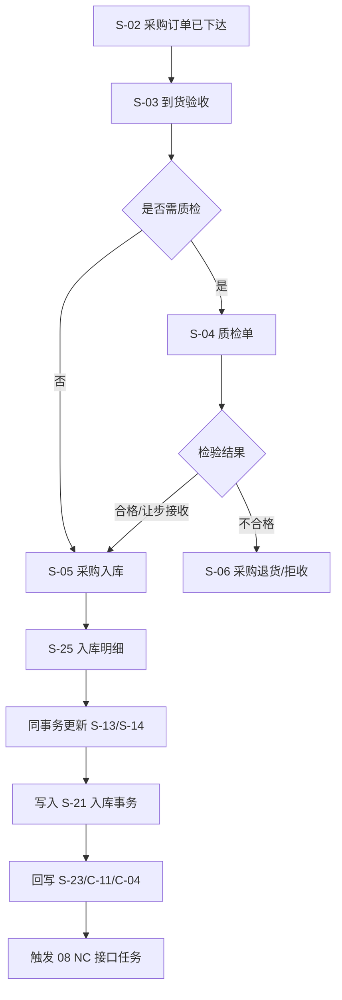

### 5.2 领料申请 → 出库 → 退料

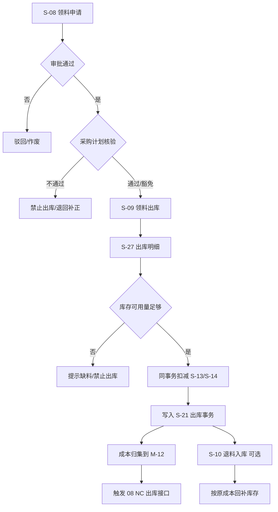

### 5.3 调拨双边事务

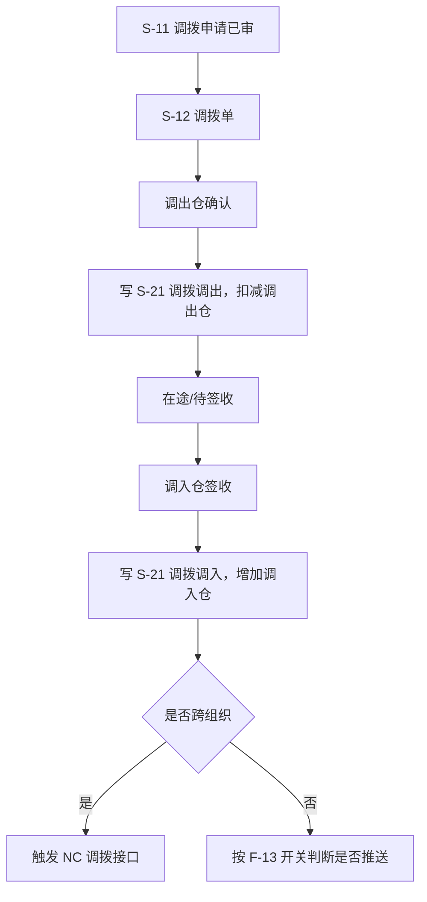

### 5.4 盘点差异处理

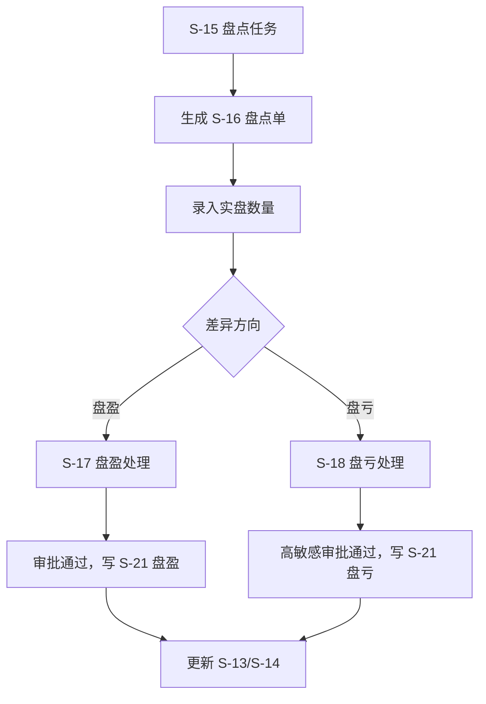

---

## 六、ERD

### 6.1 采购入库与退货

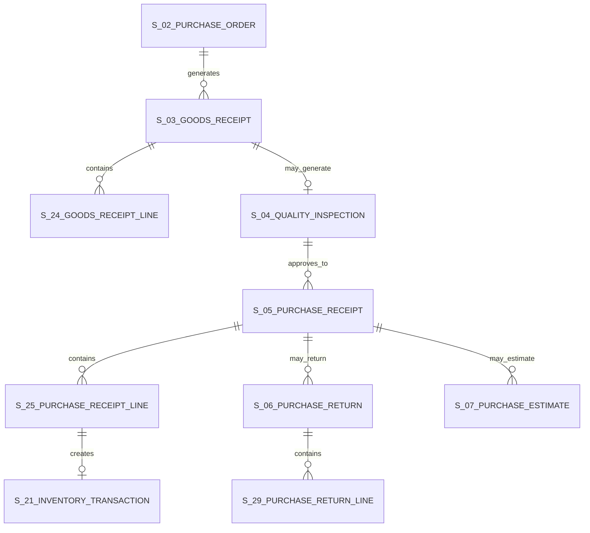

### 6.2 出库、调拨、盘点与废旧处置

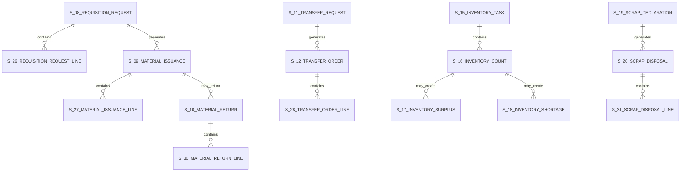

### 6.3 库存台账与事务流水

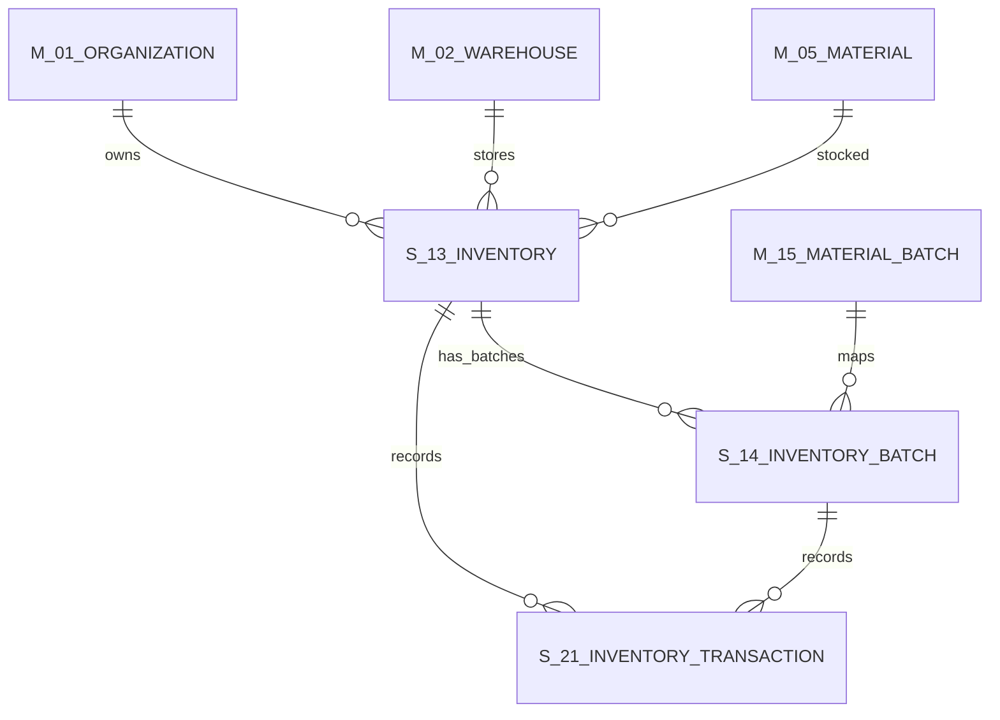

---

## 七、库存更新与成本规则

### 7.1 库存唯一事实源

- S-13 是库存数量与金额的唯一事实源。
- S-14 是批次 / 货位维度库存的事实源，仅在启用批次或货位管理时参与库存计算。
- S-21 是库存变动追溯的唯一流水源。
- 报表、AI Tool、接口对账原则上从 S-13/S-14/S-21 取数，不直接以业务单据叠加推导当前库存。

### 7.2 可用量公式

```text
available_quantity = quantity - frozen_quantity - reserved_quantity
```

- `quantity`：账面总量。
- `frozen_quantity`：盘点冻结、质量冻结、监管冻结等导致不可用数量。
- `reserved_quantity`：已被领料、调拨、订单预留但尚未出库的数量。

### 7.3 入库成本

- 采购入库成本默认取 S-25 `unit_price`。
- 如采购订单 / 合同存在价格，入库单价不得超过合同允许偏差阈值。
- 运杂费、税费、价差分摊一期不强制进入 S-25 成本；如业务确认需要，后续扩展成本调整单。

### 7.4 出库成本

- 默认采用**移动平均成本（全口径统一）**；HG/HX 或明确要求批次追溯的物料可采用批次 FIFO。
- 出库时必须记录 `unit_cost_before/unit_cost_after`、`quantity_before/after`、`amount_before/after` 到 S-21。
- 成本算法切换属于高影响配置变更，须由 08/财务确认后统一启用。

> **与流程调研对照（12-入财务账 §共性原则）：** 调研提及"基层不适用月末一次加权平均，与总库一致采用移动加权"，但表述本身有混用迹象。**详设统一为全口径移动加权**（不区分基层/总库），消除调研描述的内部矛盾，简化月度对账复杂度。如未来出现需保留"月末一次加权"的特殊场景，须按"高影响配置变更"流程评审后启用。

### 7.5 库存原子性

库存生效单据包括：S-05、S-06、S-09、S-10、S-12、S-17、S-18、S-20。上述单据进入生效状态时，必须同时完成：

1. 校验 S-13/S-14 当前数量与可用量；
2. 计算数量与金额变动；
3. 更新 S-13；
4. 更新 S-14（如适用）；
5. 写入 S-21；
6. 回写来源单据明细的 `inventory_transaction_id` 或双边事务 ID；
7. 必要时创建 F-01 接口任务。

任一步失败则整单回滚。

### 7.6 暂估入库与冲减闭环

> **业务背景（来源：流程调研 05-采购入总库 §4 / 12-入财务账 §3）：** 实物到货早于发票到达时，先按合同价"暂估"入账（S-05 采购入库单 暂估状态），待发票到达后冲减暂估、出正式入库单。

#### 7.6.1 暂估闭环时序

```text
   实物到货
       │
       ▼
   [合格验收] (品种/数量/质量)
       │
       ▼
   [暂估入库] ← 系统生成暂估唯一编号
       │      （写 S-05/S-13/S-21，按合同价计金额）
       │
       │  ⏳ 等待发票（默认窗口 6 个月，详见 7.6.3）
       │
       ▼
   [收到供应商发票]
       │
       ▼
   [冲减暂估] ← 按暂估唯一编号一对一抓对
       │      （差额修正 S-21，计入"暂估转正"流水）
       │
       ▼
   [物资采购入库单（正式）]
```

#### 7.6.2 暂估唯一编号

- 编码规则：`ZG-{YYYYMM}-{8 位流水}`（按月滚动重置流水，含年月前缀全局唯一）
- 字段落点：S-05 `tentative_no`（暂估单据编号，建议 idx 索引便于按月查询）
- 一对一约束：发票到达后冲减时，按 `tentative_no` 抓对，不允许跨编号合并/拆分

#### 7.6.3 暂估时限规约

| 项 | 默认值 | 配置位置 | 调整责任方 |
|---|---|---|---|
| 暂估窗口（暂估入库 → 发票冲减最长间隔）| **6 个月** | SY-02 `INVENTORY_TENTATIVE_WINDOW_DAYS` = 180 | 财务 |
| 超期预警阈值（提前预警天数）| 30 天 | SY-02 `INVENTORY_TENTATIVE_WARN_DAYS` = 30 | 财务 |

> **与调研对照：** 流程 05/12 调研约定"最长不超 12 个月"。**详设按行业标杆缩为 6 个月**（业务方 Q-05-2 ⭐ 答复后可调整）；超过 6 个月仍未冲减时，按 7.6.4 触发预警与强制对账。

#### 7.6.4 超期处理

- **D-30**：发票到达倒计时 30 天 → 详设 09 §六预警规则触发"暂估即将超期"提醒（推送至业务员 + 财务）
- **D-0**：超过暂估窗口 → 升级为"暂估超期"，强制业务员发起供应商对账，对账完成前阻断该供应商的新采购订单审批
- **D+30**：超期 30 天后仍未冲减 → 自动转入 9 详设 §六"暂估超期物资"报表，提交财务月度核对

#### 7.6.5 不合格物资是否暂估

- **不合格物资不产生暂估入库**（待验区只是物理存放，不进财务账）
- 待验区物资走"退货 / 索赔"路径（流程 05 §3 调研口径），不占用暂估闭环

### 7.7 对厂矿出库的销售凭证口径

> **业务依据：** 流程调研业务方答复 Q-MERGE-1（2026-05-09）。详细规约见详设 05 §8.4。

- **出库给厂矿统一走"销售出库"凭证**（不是"内部移拨"凭证），按外部销售口径处理。
- 适用范围：
  - 出总库（S-09 领料出库 → 厂矿）
  - 直达使用单位（S-05 直达入库 + 即时出库 → 厂矿，详见详设流程调研 08）
- 直达物资不形成可用库存余额：系统可保留 S-05 入库与即时销售出库的业务追溯和财务凭证触发，但入库与出库必须同批次同事务闭环，期末 S-13 数量 / 金额为 0；不得把直达物资沉淀为普通库存台账余额。
- NC 凭证科目：见详设 08 §五接口定义清单 — 销售出库凭证按"主营业务收入 / 应收账款"标准科目映射。

### 7.8 出库模拟收款口径

> **业务依据：** 流程调研业务方答复 Q-06-5（2026-05-09）。

- 总库财务在出库环节的"模拟收款"动作**仅本系统记账**（虚拟收款，作为出库依据），**不走 NC 接口**。
- 实际现金流随付款节奏走 NC（按详设 08 BIZ-005A 销售出库凭证 + 应收账款挂账 → 后续厂矿付款回写）。
- 模拟收款记录字段建议挂在 S-09 出库单：`mock_payment_state`（待收款 / 已模拟收款 / 已实收 / 已核销），不进 F-01 接口任务。

### 7.9 保管卡片与库存台账关系

> **业务依据：** 流程调研业务方答复 Q-06-6（2026-05-09）。

- **保管卡片 = 库存台账（同表，双向）**：出入库都更新保管卡片，保管卡片即该物料的库存台账。
- 实施层落点：保管卡片在系统中**不单独建表**，由 S-13 `material_stock` 库存表 + S-21 `inventory_transaction` 库存事务流水共同构成（S-13 是主台账即"卡片"主体，S-21 是流水即"卡片"明细）。
- 入库登记 / 出库登记**走同一逻辑**：通过 S-13/S-14 + S-21 的原子更新（详见 §7.5 库存原子性）。
- 不存在"保管卡片仅记流水、库存台账独立"的双轨结构。

### 7.10 出库计划核验与打印控制

> **业务依据：** 流程调研业务方答复 Q-06-1 / Q-06-3 / Q-06-4（2026-05-09）。

#### 7.10.1 出库计划核验

- 领料出库必须核验对应采购计划已经审批通过或分解完成，核验通过后 S-09 `plan_check_state=通过`；未通过时不得提交出库审核。
- 核验采用三段联合口径：① 物料编码 `material_id`；② 使用单位 / 部门与成本中心 `usage_unit_id + cost_center_id`；③ 时间窗为自然月，按 S-08 `request_date` 或 S-09 `issuance_date` 所属 `YYYY-MM` 匹配 P-01/P-02/P-03 的计划期。
- S-26 已有 `plan_line_id` 时优先按 P-03 精确核验；无显式计划行时，系统按三段联合从已审 P-03 中反查，反查到多行时要求仓储或业务员人工选择计划行后再出库。
- 抢险、停产抢修等确需计划外出库的，S-09 `plan_check_state=豁免`，必须走 A-08 加急审批并填写豁免原因；豁免记录纳入 09 报表预警抽查。

#### 7.10.2 打印有效期与过月作废

- 纸质出库凭证以首次打印日期所属月份有效，S-09 `print_month=YYYY-MM(first_print_time)`；跨月未完成实物出库的，系统将 `print_state` 置为 `已作废`，原凭证不得继续领用。
- 过月作废不直接冲销已生效库存；若 S-09 尚未 `已出库`，需重新发起或复制生成新出库单并重新核验计划、库存和审批。
- 已出库单据只允许查询、归档和冲销，不因跨月自动作废。

#### 7.10.3 防重打与例外路径

- S-09 首次打印后写入 `first_print_time` 和 `print_hash`，同一出库单禁止重复打印；页面可展示电子底稿，但不得生成第二份可流转纸质凭证。
- 允许重打的例外仅限交库单与移拨单：交库、移拨因纸质单损坏或丢失需要重打时，必须走 A-08 重打审批，审批通过后生成带"重打"水印、重打次数、审批单号和操作人签名的副本。
- S-12 移拨单通过 `reprint_workflow_instance_id` 关联重打审批；交库单重打由采购入库 / 交库业务单据在对应模块承接，库存侧只识别其审批结果。

### 7.11 委托加工库存、损耗与科目

> **业务依据：** 流程调研业务方答复 Q-07-2 / Q-07-4 / Q-07-5 / Q-07-6 / Q-12-7（2026-05-09）。

- 委托加工材料发出后，在物资公司账面上走独立"委托加工物资"科目，区分于自有库存（1403 原材料）；库存层通过 S-13 `inventory_type=委托加工` 或受托单位虚拟仓表达资产位置，不改变资产归属。
- 受托单位按 M-02 虚拟仓建模，`warehouse_type=受托加工仓`；委托发料写 S-21 `transaction_type=调拨调出/委托加工发出`，受托虚拟仓记录在途或加工中数量，禁止作为可领用库存参与普通出库。
- 损耗率按物料分类、加工工艺维护标准库；加工协议可覆盖标准损耗率。实际损耗超出协议损耗率时，必须发起超损耗审批并进入供应商扣款、索赔或评价扣分流程。
- 加工完毕验收采用三方联合确认：厂矿使用方、受托加工单位、物资公司业务员共同确认品种、数量、质量和损耗。验收通过后生成委托加工完工入库或直达使用单位闭环；验收不通过时进入返工、索赔或退回路径。
- 财务凭证：发出材料时借"委托加工物资"，贷"原材料"（详见详设 08 BIZ-019 委托加工财务触发）；加工完毕入库时借"自有库存"，贷"委托加工物资"，加工费与运杂费按完工入库成本分摊并入委托加工物资成本，不在库存侧另设独立明细科目。

### 7.12 超储 / 积压物资调剂处置优先序

> **业务依据：** 流程调研业务方答复 Q-10-4（2026-05-09）；超储识别口径见详设 09 ALR-INV-002。

- 超储或积压物资触发预警后，处置优先级固定为三层：① 厂矿内部调拨；② 集团内部销售 / 跨子公司调拨；③ 对外销售或废旧处置。系统推荐路径按此顺序生成，不允许直接跳到对外销售，除非前两层无可匹配需求并留痕说明。
- 厂矿内部调拨走 S-11/S-12，同组织跨仓不改变资产归属；跨厂矿或跨子公司场景按跨组织调拨处理，并由 08 决定是否生成销售出库或内部结算凭证。
- 对外销售或废旧处置属于最后选项：可复用 S-20/S-31 废旧处置口径，若仍具备使用价值但需外售，合同、开票和收款由 05/08 承接，库存侧只负责出库与 S-21 追溯。
- 采购计划分解和采购订单下达前应查询 ALR-INV-002 结果；存在同物料同组织可调剂库存时，系统提示延缓或取消近期采购供应，避免继续扩大超储。

---

## 八、接口规范

### 8.1 内部接口清单

| 接口编码 | 接口名称 | 调用方 | 被调用方 | 触发时机 | 说明 |
| --- | --- | --- | --- | --- | --- |
| INV-001 | 查询可用库存 | 04/09/AI | 06 库存模块 | 需求提报、领料、报表查询 | 按组织、仓库、物料、批次返回数量 |
| INV-002 | 创建到货验收 | 04 采购订单 | 06 库存模块 | S-02 到货登记 | 创建 S-03/S-24 |
| INV-003 | 创建采购入库 | 质检 / 收货 | 06 库存模块 | S-03/S-04 通过 | 创建 S-05/S-25 |
| INV-004 | 库存出库校验 | S-09/S-12/S-20 | 06 库存模块 | 出库前 | 校验采购计划、可用量、批次、货位冻结 |
| INV-005 | 库存事务提交 | 各库存生效单据 | 06 库存模块 | 审核通过 | 原子更新 S-13/S-14/S-21 |
| INV-006 | 合同执行回写 | 06 库存模块 | 05 合同资金模块 | S-05 已审 | 回写 C-11/C-04 |
| INV-007 | NC 接口任务创建 | 06 库存模块 | 08 财务接口模块 | 库存生效后 | 创建 F-01，具体报文由 08 承接 |

### 8.2 库存查询响应示例

```json
{
  "orgId": 1001,
  "warehouseId": 2001,
  "materialId": 3001,
  "quantity": 1200.0000,
  "frozenQuantity": 100.0000,
  "reservedQuantity": 200.0000,
  "availableQuantity": 900.0000,
  "unitCost": 12.345600,
  "batches": [
    {
      "batchId": 9001,
      "batchNo": "B20260502001",
      "batchState": "有效",
      "batchQuantity": 500.0000,
      "batchAvailableQuantity": 500.0000,
      "expireDate": "2027-05-02"
    }
  ]
}
```

### 8.3 NC 接口触发点

| 业务动作 | 来源单据 | 触发条件 | 接口方向 | 08 承接内容 |
| --- | --- | --- | --- | --- |
| 采购入库 | S-05 | `purchase_receipt_state=已审` | 物资 → NC | 入库凭证 / 暂估规则 |
| 采购退货 | S-06 | `return_state=已审` | 物资 → NC | 红字入库 / 退货凭证 |
| 领料出库 | S-09 | `issuance_state=已出库` | 物资 → NC | 材料出库成本归集 |
| 退料入库 | S-10 | `return_state=已审` | 物资 → NC | 出库冲销 / 退料入库 |
| 跨组织调拨 | S-12 | `transfer_order_state=已签收` | 物资 → NC | 调拨出入库凭证 |
| 盘盈盘亏 | S-17/S-18 | `approval_state=已审` | 物资 → NC | 盘盈盘亏调整凭证 |
| 废旧处置 | S-20 | `disposal_state=已完成` | 物资 → NC | 报废 / 变卖 / 残值处理 |

---

## 九、配置项默认值矩阵

| 配置项编码 | 配置项名称 | 默认值 | 可调范围 | 责任方 | 说明 |
| --- | --- | --- | --- | --- | --- |
| `INV_OVER_RECEIVE_RATE` | 采购超收允许比例 | 0% | 0%~5% | 物资 + 财务 | 超过比例禁止到货验收 |
| `INV_QUALITY_REQUIRED_CATEGORIES` | 强制质检物料分类 | HG/HX/高价值设备类 | 物料分类集合 | 物资 + 安监 | 影响 S-04 自动生成 |
| `INV_BATCH_REQUIRED_CATEGORIES` | 强制批次物料分类 | HG/HX | 物料分类集合 | 物资 + 安监 | 对齐 03 M-15 口径 |
| `INV_FIFO_ENABLED` | FIFO 出库启用 | true（仅批次物料） | true/false | 物资 + 财务 | 批次物料默认 FIFO |
| `INV_MOVING_AVG_ENABLED` | 移动平均成本启用 | true | true/false | 财务 | 普通物料默认移动平均 |
| `INV_COUNT_FREEZE_SCOPE` | 盘点冻结范围 | 仓库+物料 | 仓库 / 库区 / 货位 / 物料 | 仓储 | 冻结范围越细，作业影响越小 |
| `INV_SHORTAGE_APPROVAL_THRESHOLD` | 盘亏升级审批阈值 | 5000 元 | 金额阈值 | 物资 + 财务 | 高于阈值升级审批 |
| `INV_SCRAP_APPROVAL_THRESHOLD` | 废旧处置升级审批阈值 | 10000 元 | 金额阈值 | 物资 + 财务 | 高敏感操作 |
| `INV_TEMP_ESTIMATE_ENABLED` | 暂估入库启用 | true | true/false | 财务 | NC 未落地时可先本地留痕 |
| `INV_NEGATIVE_STOCK_ALLOWED` | 是否允许负库存 | false | true/false | 集团/财务 | 原则上禁止负库存 |
| `INV_ISSUE_PLAN_CHECK_ENABLED` | 出库采购计划核验启用 | true | true/false | 物资 + 仓储 | 默认启用，按物料 + 单位/成本中心 + 月份核验 |
| `INV_ISSUE_PRINT_VALID_MONTH` | 出库单打印有效期 | 当月 | 当月 | 仓储 | 首次打印所属月份有效，跨月未出库作废 |
| `INV_REPRINT_ALLOWED_BILL_TYPES` | 允许重打单据类型 | 交库单、移拨单 | 单据类型集合 | 仓储 + 审批管理员 | 其他出库凭证禁止重打 |
| `OUTSOURCED_LOSS_RATE_MODE` | 委托加工损耗率口径 | 标准库 + 协议覆盖 | 标准库 / 协议优先 / 手工审批 | 物资 + 财务 | 超协议损耗触发审批与索赔 |

---

## 十、业务确认占位项

| 编号 | 待确认事项 | 影响实体 / 字段 | 当前占位口径 | 回写触发 |
| --- | --- | --- | --- | --- |
| 06-01 | 采购超收比例是否允许 | S-03/S-24、SY-02 | 默认 0%，禁止超收 | 业务方正式签字后回填 |
| 06-02 | 哪些物料必须质检 | S-04、M-04/M-05 | 暂按 HG/HX/高价值设备类 | 物资 + 安监确认 |
| 06-03 | 库存成本算法 | S-13/S-21 | 普通物料移动平均，批次物料 FIFO | 财务确认 |
| 06-04 | 盘点期间是否强制冻结 | S-15/S-16 | 默认冻结盘点范围 | 仓储确认 |
| 06-05 | 盘亏升级审批阈值 | S-18、A-11 | 暂按 5000 元 | 管理层 / 财务确认 |
| 06-06 | 废旧处置升级审批阈值 | S-19/S-20、A-11 | 暂按 10000 元 | 管理层 / 财务确认 |
| 06-07 | 暂估入库是否一期启用 | S-07、F-01 | 默认启用，但 NC 报文由 08 承接 | 财务 / NC 联调确认 |
| 06-08 | 货位管理是否一期强制启用 | M-03B、S-14、各明细 location_id | 字段保留，按仓库配置启用 | 原型确认 |

---

## 十一、与其他模块协同

### 11.1 02 基础档案与组织仓库

- 所有库存单据引用 M-01/M-02；启用货位管理时引用 M-03B。
- S-12 跨组织调拨必须满足 M-16 组织-仓库关系约束。
- S-09 领料出库的 `cost_center_id` 优先从 M-13 默认带出。
- SY-01 库存相关前缀（GR/QC/RC/RT/PE/RQ/IS/MR/TQ/TR/IT/IC/SU/SL/SD/SP/TX）已在 `02-基础档案与组织仓库详细设计-V1.0.md` 节 4.9.5 全部补齐。

### 11.2 03 物料主数据与编码

- M-05 `material_state=启用` 方可参与入出库。
- HG/HX 或配置为批次管理的物料必须维护 M-15 批次，并同步 S-14。
- M-15 `batch_state=过期/冻结/作废` 的批次禁止出库；临期批次可出库但需预警。

### 11.3 04 需求计划与采购协同

- S-02/S-23 是 S-03 到货验收的上游。
- S-03/S-24 回写 S-23 `order_line_state=部分到货/全部到货`。
- S-05 审核后回写采购订单累计入库数量，必要时关闭订单行。
- S-08/S-26 领料出库前按 P-03 已审采购计划行核验；无显式计划行时按物料 + 使用单位/成本中心 + 月份反查。

### 11.4 05 合同与资金

- S-05/S-25 审核后回写 C-11 执行数量 / 执行金额。
- S-05 `is_invoice_arrived`、S-25 入库数量是 C-08 付款申请三单匹配的前置数据。
- S-05 审核通过触发 C-04 付款节点条件检查（入库完成 / 发票到达）。

### 11.5 07 设备与设备租赁

- 设备类物资采购入库后，可按 07 规则生成 E-01 设备台账。
- 普通库存废旧处置在本篇；设备报废处置在 07，但可引用 S-20/S-31 的处置口径。

### 11.6 08 财务与 NC 接口

- 库存生效单据创建 F-01 接口任务，报文、科目、重推、对账由 08 详设统一承接。
- S-21 作为库存与财务对账的物资侧明细依据。
- `interface_push_state` 字段统一使用 01-V1.0 口径。

### 11.7 09 报表预警与 AI

- 库存余额、库存周转、临期批次、缺料预警、盘亏异常等报表均以 S-13/S-14/S-21 为核心源。
- 计划外出库豁免、过月作废出库凭证、交库 / 移拨重打记录、委托加工超损耗记录、超储 / 积压调剂处置记录纳入 09 预警和审计报表。
- AI Tool 可查询库存、批次、出入库流水，但不得直连数据库，必须通过受控 API。

### 11.8 10 权限审批流

- 领料、调拨、盘亏、废旧处置、冲销等流程接入 A-08/A-20。
- 盘亏、废旧处置、红字冲销、接口重推属于 A-11 高敏感操作。
- 出库计划豁免、交库 / 移拨重打、委托加工超损耗审批接入 A-08；是否升入 A-11 由金额、物料敏感级别和配置阈值决定。
- 数据权限按组织、仓库、物料分类和角色范围过滤。

---

## 十二、版本与维护

| 版本 | 日期 | 主要变化 |
| --- | --- | --- |
| V0.1 | 2026-05-02 | 详设第六篇首版：S-03~S-21、S-24~S-31 共 26 张库存实物流转表全字段；采购到货/质检/入库、领料出库/退料、调拨、盘点、废旧处置 5 条主流程；S-13/S-14/S-21 库存唯一事实源与原子性约束；NC 接口触发点；配置项与业务确认占位；与 02/03/04/05/07/08/09/10 协同边界 |
| V0.2 | 2026-05-02 | 一致性自检收口：`interface_push_state` 值域统一为 01-v0.7 口径；S-03 `receipt_state` 专名化为 `goods_receipt_state`；S-05 `receipt_state` 专名化为 `purchase_receipt_state`；S-12 `order_state` 专名化为 `transfer_order_state`；S-26 `line_state` 专名化为 `requisition_line_state`；同步回写 01-v0.7 状态值域。 |
| V0.3 | 2026-05-02 | 完善收口：补充 S-16 盘点单 `count_no` 字段（前缀 `IC`，IC 已在 02 前缀表登记但原字段遗漏）；更新 11.1 节 SY-01 库存前缀已补充说明；上游引用同步至 02-v0.4。 |
| V1.0 | 2026-05-02 | 详设阶段交叉评审通过（2026-05-02），全部 11 篇分卷无未解决问题，升至 V1.0 正式版 |
| V1.1 | 2026-05-09 | 按 P0 业务答复补齐库存侧口径：出库前按物料 + 使用单位/成本中心 + 月份核验已审采购计划；出库单打印当月有效、过月作废、防重打，交库 / 移拨走审批重打；直达物资不沉淀普通库存余额；委托加工按受托虚拟仓、标准损耗率 + 协议覆盖、三方联合验收、加工费与运杂费并入委托加工物资成本收口；超储 / 积压物资按厂矿内部调拨 → 集团内部销售 / 跨子公司调拨 → 对外销售或废旧处置三层级优先序处理。 |

后续维护规则：

- 新增库存相关实体须同步更新 01-v0.x 实体清单。
- 任何库存生效逻辑变更必须同步检查 S-13/S-14/S-21 原子性。
- 成本算法、暂估策略、NC 接口触发策略由 08 与财务确认后回写本篇。
- 批次、货位、盘点冻结、废旧处置阈值等配置确认后回填 SY-02 初始化数据。

---

## 十三、一句话结论

本篇把库存实物流转从 `01` 骨架向下细化到字段级、状态级和库存原子事务级，固化了“到货验收不入账、采购入库才增库存、出库/调拨/盘点/废旧处置必须同事务更新 S-13/S-14/S-21、S-21 作为追溯与对账统一流水”的核心口径；出库计划核验、打印有效期、防重打、直达不沉淀库存、委托加工虚拟仓与损耗验收、超储 / 积压调剂优先序已收口，采购、合同、财务、报表和权限相关联动已明确承接边界，NC 报文与科目细则留给 08 详设统一展开。
