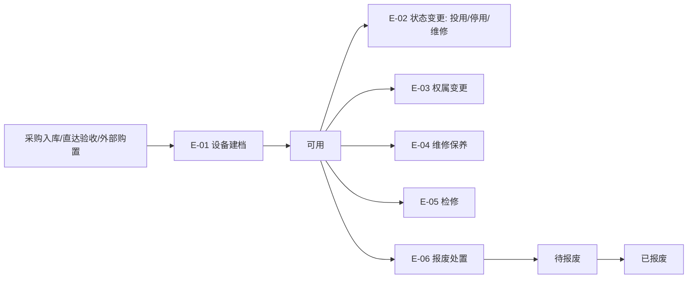
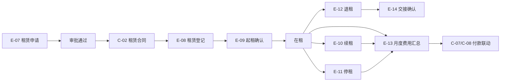
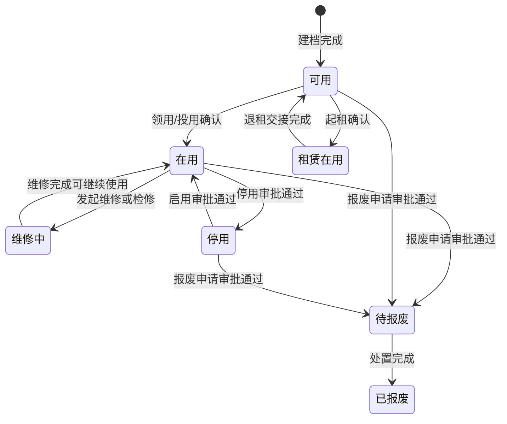
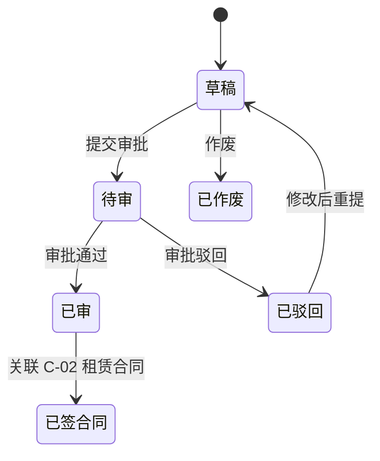
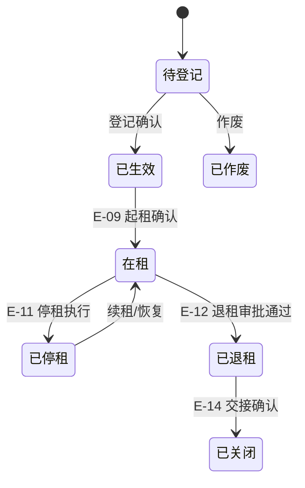
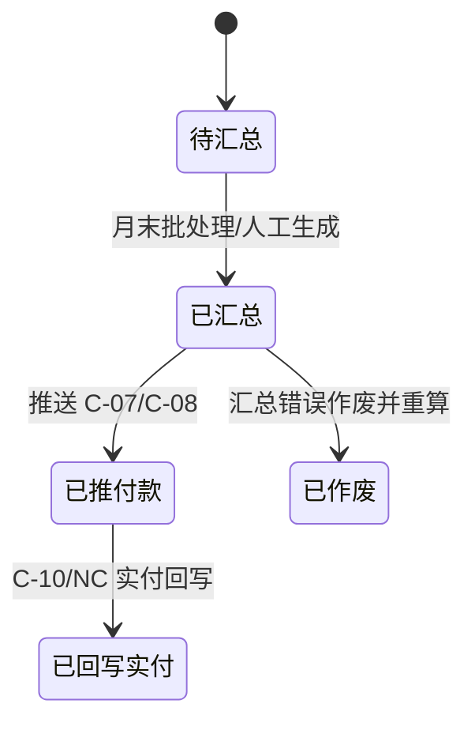

# 设备与设备租赁详细设计（V0.2）

**版本：** V0.2  
**日期：** 2026-05-02  
**文档性质：** 详细设计层 · 模块详设第七篇  
**适用阶段：** 详细设计执行、开发实施、联调测试

---

## 一、文档目的

本文档承接 `01-数据库逻辑模型-v0.7.md` 的设备租赁域骨架，以及 `06-库存实物流转详细设计-v0.3.md` 中采购入库、直达验收、库存受限和废旧处置口径，把设备管理与设备租赁管理涉及的 14 个实体的字段、状态机、业务规则、接口触发点、配置项和占位项固化下来。

本文档重点回答：

- 设备从采购/直达验收形成台账，到投用、维修、检修、权属变更、报废处置的生命周期如何落表
- 设备台账（E-01）与库存事实（S-13/S-14/S-21）的边界如何划清，避免重复记账
- 跨组织设备权属变更、状态变更、报废处置如何审批和留痕
- 租赁设备从申请、登记、起租、续租、停租、退租、交接、费用汇总到付款联动的闭环如何实现
- 租赁费用汇总如何作为合同付款/资金计划依据，而不直接替代 NC 或财务付款
- 一期与二期边界如何控制，避免把本模块扩展为完整固定资产系统或复杂经营租赁系统

本文档**不**做以下事：

- 不建设完整固定资产系统，不替代财务固定资产卡片、折旧和资产减值处理
- 不写 NC 凭证科目规则与接口报文细节（属 `08-财务与NC接口详细设计`）
- 不重写采购入库、库存调拨、盘点、废旧库存处置规则（属 `06-库存实物流转详细设计`）
- 不写合同审批、付款节点、付款申请和付款执行台账规则（属 `05-合同与资金详细设计`）
- 不写 SQL DDL、页面原型和具体部署脚本

---

## 二、设计输入

| 输入文档 | 在本文档中的作用 |
| --- | --- |
| `docs/详细设计/01-数据库逻辑模型-v0.7.md` | 实体编号 E-01~E-14、设备租赁域 ERD、设备与库存边界、共用字段约定 |
| `docs/详细设计/02-基础档案与组织仓库详细设计-v0.6.md` | M-01 组织、M-02 仓库、M-09 供应商、M-16 组织仓库关系、SY-01 前缀清单、SY-04 通用附件 |
| `docs/详细设计/03-物料主数据与编码详细设计-v0.2.md` | M-05 物料档案（设备类物料属性标识）、M-07 计量单位 |
| `docs/详细设计/05-合同与资金详细设计-v0.1.md` | 租赁合同 C-02、付款节点 C-04、付款计划 C-07、付款申请 C-08 的引用边界 |
| `docs/详细设计/06-库存实物流转详细设计-v0.3.md` | 设备来源入库、库存受限/已租出、废旧处置与 S-21 库存事务口径 |
| `docs/概要设计/02-业务模块概要设计-v0.1.md` 节 5.8/5.9 | 设备管理、设备租赁管理的一期模块边界与二期增强边界 |
| `docs/需求梳理/02-业务流程与单据清单-V1.0.md` 第 10 条流程 | 设备租赁申请、起租、在租、续租、停租、退租、费用汇总流程 |
| `docs/需求梳理/06-模块功能清单（需求沟通版）-V1.0.md` 模块八/九 | 设备管理与设备租赁功能清单、一二期边界 |
| `docs/集团统筹/集团业务系统统一建设原则-V2.0.md` | 独立数据库、统一权限、API+JSON、SSO、审计留痕、信创适配要求 |

---

## 三、模块范围

### 3.1 本篇覆盖实体

| 实体编号 | 英文名 | 中文名 | 本篇覆盖深度 |
| --- | --- | --- | --- |
| E-01 | equipment | 设备档案 | 全字段、生命周期状态、来源与库存边界 |
| E-02 | equipment_status_change | 设备状态变更单 | 全字段、状态变更规则、留痕 |
| E-03 | equipment_ownership_change | 设备权属变更单 | 全字段、跨组织审批、交接确认 |
| E-04 | equipment_maintenance | 设备维修保养记录 | 全字段、费用与供应商记录 |
| E-05 | equipment_inspection | 设备检修单 | 全字段、检修闭环、下次检修预警 |
| E-06 | equipment_scrapping | 设备报废处置单 | 全字段、报废审批、残值留痕 |
| E-07 | rental_request | 租赁申请单 | 全字段、审批状态、合同前置 |
| E-08 | rental_registration | 租赁登记单 | 全字段、租赁母单、合同/设备/供应商关联 |
| E-09 | rental_start | 租赁起租单 | 全字段、起租确认、在租状态触发 |
| E-10 | rental_renewal | 租赁续租单 | 全字段、续租审批、租期延长 |
| E-11 | rental_suspension | 租赁停租单 | 全字段、停租审批、费用暂停口径 |
| E-12 | rental_return | 租赁退租单 | 全字段、退租审批、交接前置 |
| E-13 | rental_fee_summary | 租赁费用汇总表 | 全字段、月度汇总、付款联动 |
| E-14 | rental_handover | 租赁交接确认单 | 全字段、退租交接与责任确认 |

### 3.2 不在本篇覆盖

| 对象 | 承接位置 |
| --- | --- |
| S-05 采购入库、S-03 大型设备直达验收、S-21 库存事务 | `06-库存实物流转详细设计` |
| C-02 租赁合同、C-07 付款计划、C-08 付款申请 | `05-合同与资金详细设计` |
| F-01 接口任务、F-12 科目规则、F-13 接口开关 | `08-财务与NC接口详细设计` |
| 固定资产折旧、资产减值、资产卡片与财务资产系统同步 | 本项目一期不覆盖，后续如需要由资产/财务专项承接 |
| 复杂租金计费模型、检修停租自动联动、多类型经营性租赁分析 | 二期增强 |

### 3.3 共用约定继承

本篇所有实体默认遵守 `01-v0.7` 节四共用约定：主键策略、审计字段、软删除、审批字段、时间戳字段、附件字段、数据权限字段和多租户预留字段。下文字段表不重复列出共用字段；如某实体有特殊要求，在“特别说明”中单独说明。

---

## 四、总体业务流程

### 4.1 设备生命周期流程

控制要点：

1. 设备建档可以来自 S-05 采购入库、S-03 大型设备直达验收或外部已有设备补录。
2. E-01 是设备生命周期台账，不作为库存数量事实源；库存数量事实仍以 S-13/S-14/S-21 为准。
3. 设备状态变更必须留痕，跨组织权属变更必须审批。
4. 报废处置不直接生成财务资产处置凭证；财务处理由后续 NC/财务系统接口或线下流程承接。

### 4.2 设备租赁闭环流程

控制要点：

1. 租赁申请审批通过后，必须关联合同、供应商和设备档案，才允许形成 E-08 租赁登记。
2. 起租确认后，E-08 进入在租状态，设备台账状态同步为“租赁在用/可用受限”。
3. 续租、停租、退租均形成独立单据，不直接覆盖历史登记。
4. 月度费用汇总只形成付款依据，不直接执行付款、不直接替代 NC 应付核算。

---

## 五、数据模型

### 5.1 E-01 equipment 设备档案

| 字段名 | 类型 | 长度/精度 | 空值 | 默认值 | 唯一 | 外键 | 索引建议 | 注释 |
| --- | --- | --- | --- | --- | --- | --- | --- | --- |
| `equipment_id` | bigint | — | NOT NULL | auto | PK | — | PK | 技术主键 |
| `equipment_code` | varchar | 32 | NOT NULL | — | UQ | — | UQ | 设备编码，前缀 `EQ` |
| `equipment_name` | varchar | 128 | NOT NULL | — | — | — | idx | 设备名称 |
| `equipment_type` | varchar | 64 | NOT NULL | — | — | — | idx | 设备类型/分类 |
| `material_id` | bigint | — | NULL | — | — | FK→M-05 | idx | 对应物料档案；能对应则必填 |
| `spec_model` | varchar | 128 | NULL | — | — | — | — | 规格型号 |
| `serial_no` | varchar | 128 | NULL | — | — | — | idx | 出厂编号/序列号 |
| `asset_tag_no` | varchar | 64 | NULL | — | — | — | idx | 关联资产标识；不作为资产卡片主键 |
| `source_type` | varchar | 32 | NOT NULL | — | — | — | idx | 采购入库 / 直达验收 / 外部购置 / 历史补录 / 租赁引入 |
| `source_bill_type` | varchar | 32 | NULL | — | — | — | — | 来源单据类型：S-05/S-03/手工补录等 |
| `source_bill_id` | bigint | — | NULL | — | — | — | idx | 来源单据 ID |
| `source_bill_no` | varchar | 32 | NULL | — | — | — | idx | 来源单据号 |
| `org_id` | bigint | — | NOT NULL | — | — | FK→M-01 | idx | 权属组织 |
| `usage_unit_id` | bigint | — | NULL | — | — | FK→M-01 | idx | 使用单位 |
| `warehouse_id` | bigint | — | NULL | — | — | FK→M-02 | idx | 所在仓库/保管仓库 |
| `location_desc` | varchar | 255 | NULL | — | — | — | — | 具体位置 |
| `responsible_person_id` | bigint | — | NULL | — | — | FK→A-01 | idx | 责任人 |
| `purchase_date` | date | — | NULL | — | — | — | — | 购置/入账日期 |
| `put_into_use_date` | date | — | NULL | — | — | — | — | 投用日期 |
| `warranty_end_date` | date | — | NULL | — | — | — | idx | 质保到期日 |
| `equipment_original_value` | decimal | (18,2) | NULL | — | — | — | — | 原值，仅作业务参考，不替代财务资产原值 |
| `equipment_status` | varchar | 16 | NOT NULL | `可用` | — | — | idx | 可用 / 在用 / 租赁在用 / 维修中 / 停用 / 待报废 / 已报废 |
| `rentable_flag` | boolean | — | NOT NULL | false | — | — | idx | 是否可用于租赁管理 |
| `current_rental_registration_id` | bigint | — | NULL | — | — | FK→E-08 | idx | 当前租赁登记；非在租为空 |
| `last_maintenance_date` | date | — | NULL | — | — | — | — | 最近维修/保养日期 |
| `next_inspection_date` | date | — | NULL | — | — | — | idx | 下次检修日期 |

#### 5.1.1 状态机

#### 5.1.2 业务规则

1. **库存边界**：E-01 不记录库存数量；若设备来自 S-05 采购入库，库存数量与批次仍以 S-13/S-14/S-21 为唯一事实源。E-01 仅记录设备台账、位置、责任人和生命周期状态。
2. **来源追溯**：`source_type=采购入库` 时，`source_bill_type/source_bill_id/source_bill_no` 必须指向 S-05；`source_type=直达验收` 时指向 S-03。
3. **资产关联**：`asset_tag_no` 只做资产标识留痕，不代表系统维护财务资产卡片，不参与折旧计算。
4. **状态受控**：`equipment_status` 不允许直接手工改值，必须由 E-02/E-03/E-06/E-09/E-12 等业务单据驱动。
5. **租赁占用**：`equipment_status=租赁在用` 时，不允许再次起租或报废；需先完成 E-12/E-14 退租交接。

---

### 5.2 E-02 equipment_status_change 设备状态变更单

| 字段名 | 类型 | 长度/精度 | 空值 | 默认值 | 唯一 | 外键 | 索引建议 | 注释 |
| --- | --- | --- | --- | --- | --- | --- | --- | --- |
| `change_id` | bigint | — | NOT NULL | auto | PK | — | PK | 技术主键 |
| `change_no` | varchar | 32 | NOT NULL | — | UQ | — | UQ | 前缀 `ESC` |
| `equipment_id` | bigint | — | NOT NULL | — | — | FK→E-01 | idx | 设备 |
| `old_status` | varchar | 16 | NOT NULL | — | — | — | idx | 原状态 |
| `new_status` | varchar | 16 | NOT NULL | — | — | — | idx | 新状态 |
| `change_reason` | varchar | 255 | NOT NULL | — | — | — | — | 变更原因 |
| `change_date` | date | — | NOT NULL | — | — | — | idx | 变更日期 |
| `operator_id` | bigint | — | NOT NULL | — | — | FK→A-01 | idx | 操作人 |
| `status_change_state` | varchar | 16 | NOT NULL | `待确认` | — | — | idx | 待确认 / 已确认 / 已驳回 / 已作废 |

业务规则：

1. 低风险状态变更（如“在用→维修中”）可由设备管理员确认；高风险状态变更（如“在用→停用”）应进入审批流。
2. E-02 确认后自动回写 E-01 `equipment_status`，并写入审计日志。
3. 已确认的状态变更单不得物理删除，如录入错误应发起反向状态变更并说明原因。

---

### 5.3 E-03 equipment_ownership_change 设备权属变更单

| 字段名 | 类型 | 长度/精度 | 空值 | 默认值 | 唯一 | 外键 | 索引建议 | 注释 |
| --- | --- | --- | --- | --- | --- | --- | --- | --- |
| `ownership_change_id` | bigint | — | NOT NULL | auto | PK | — | PK | 技术主键 |
| `ownership_change_no` | varchar | 32 | NOT NULL | — | UQ | — | UQ | 前缀 `EOC` |
| `equipment_id` | bigint | — | NOT NULL | — | — | FK→E-01 | idx | 设备 |
| `from_org_id` | bigint | — | NOT NULL | — | — | FK→M-01 | idx | 原权属组织 |
| `to_org_id` | bigint | — | NOT NULL | — | — | FK→M-01 | idx | 新权属组织 |
| `from_usage_unit_id` | bigint | — | NULL | — | — | FK→M-01 | idx | 原使用单位 |
| `to_usage_unit_id` | bigint | — | NULL | — | — | FK→M-01 | idx | 新使用单位 |
| `from_responsible_person_id` | bigint | — | NULL | — | — | FK→A-01 | — | 原责任人 |
| `to_responsible_person_id` | bigint | — | NULL | — | — | FK→A-01 | — | 新责任人 |
| `change_reason` | varchar | 255 | NOT NULL | — | — | — | — | 变更原因 |
| `handover_date` | date | — | NULL | — | — | — | idx | 交接日期 |
| `approval_state` | varchar | 16 | NOT NULL | `待审` | — | — | idx | 待审 / 审中 / 已审 / 已驳回 / 已撤回 |

业务规则：

1. 跨二级集团的数据边界内，一期默认只支持阜矿范围内组织间权属变更；跨二级集团调拨作为特殊事项，需项目领导小组确认。
2. `from_org_id != to_org_id` 时必须走审批流，并由双方组织确认交接。
3. 审批通过后回写 E-01 `org_id/usage_unit_id/responsible_person_id`。
4. 若设备仍存在未完结 E-08 租赁登记，不允许发起权属变更，除非走专项例外审批。

---

### 5.4 E-04 equipment_maintenance 设备维修保养记录

| 字段名 | 类型 | 长度/精度 | 空值 | 默认值 | 唯一 | 外键 | 索引建议 | 注释 |
| --- | --- | --- | --- | --- | --- | --- | --- | --- |
| `maintenance_id` | bigint | — | NOT NULL | auto | PK | — | PK | 技术主键 |
| `maintenance_no` | varchar | 32 | NOT NULL | — | UQ | — | UQ | 前缀 `EMT` |
| `equipment_id` | bigint | — | NOT NULL | — | — | FK→E-01 | idx | 设备 |
| `maintenance_type` | varchar | 32 | NOT NULL | — | — | — | idx | 维修 / 保养 / 点检 / 故障处理 |
| `maintenance_date` | date | — | NOT NULL | — | — | — | idx | 维修/保养日期 |
| `supplier_id` | bigint | — | NULL | — | — | FK→M-09 | idx | 外委维修供应商 |
| `maintenance_cost` | decimal | (18,2) | NOT NULL | 0 | — | — | — | 维修保养费用 |
| `maintenance_content` | varchar | 1024 | NOT NULL | — | — | — | — | 维修保养内容 |
| `result_desc` | varchar | 512 | NULL | — | — | — | — | 结果说明 |
| `next_maintenance_date` | date | — | NULL | — | — | — | idx | 下次保养日期 |

业务规则：

1. 维修保养记录属于过程留痕，不直接生成付款申请；涉及外委费用时应关联合同/付款模块另行处理。
2. 维修保养完成后可更新 E-01 `last_maintenance_date` 和 `next_inspection_date`。
3. 维修期间是否自动将 E-01 切换为“维修中”，由配置项 `EQUIPMENT_MAINTENANCE_AUTO_STATUS` 控制。

---

### 5.5 E-05 equipment_inspection 设备检修单

| 字段名 | 类型 | 长度/精度 | 空值 | 默认值 | 唯一 | 外键 | 索引建议 | 注释 |
| --- | --- | --- | --- | --- | --- | --- | --- | --- |
| `inspection_id` | bigint | — | NOT NULL | auto | PK | — | PK | 技术主键 |
| `inspection_no` | varchar | 32 | NOT NULL | — | UQ | — | UQ | 前缀 `EIN` |
| `equipment_id` | bigint | — | NOT NULL | — | — | FK→E-01 | idx | 设备 |
| `inspection_type` | varchar | 32 | NOT NULL | — | — | — | idx | 定期检修 / 临时检修 / 安全检查 / 专项检查 |
| `planned_inspection_date` | date | — | NOT NULL | — | — | — | idx | 计划检修日期 |
| `actual_inspection_date` | date | — | NULL | — | — | — | idx | 实际检修日期 |
| `inspection_result` | varchar | 32 | NULL | — | — | — | idx | 合格 / 需维修 / 建议停用 / 建议报废 |
| `next_inspection_date` | date | — | NULL | — | — | — | idx | 下次检修日期 |
| `inspection_state` | varchar | 16 | NOT NULL | `待执行` | — | — | idx | 待执行 / 执行中 / 已完成 / 已取消 |

业务规则：

1. 检修结果为“建议停用/建议报废”时，应自动生成待办，提示发起 E-02 状态变更或 E-06 报废处置。
2. `inspection_state=已完成` 后回写 E-01 `next_inspection_date`。
3. 检修超期预警由 `09-报表预警与AI能力详细设计` 承接，本文仅固化字段来源。

---

### 5.6 E-06 equipment_scrapping 设备报废处置单

| 字段名 | 类型 | 长度/精度 | 空值 | 默认值 | 唯一 | 外键 | 索引建议 | 注释 |
| --- | --- | --- | --- | --- | --- | --- | --- | --- |
| `scrap_id` | bigint | — | NOT NULL | auto | PK | — | PK | 技术主键 |
| `scrap_no` | varchar | 32 | NOT NULL | — | UQ | — | UQ | 前缀 `ESR` |
| `equipment_id` | bigint | — | NOT NULL | — | — | FK→E-01 | idx | 设备 |
| `scrap_reason` | varchar | 255 | NOT NULL | — | — | — | — | 报废原因 |
| `apply_date` | date | — | NOT NULL | — | — | — | idx | 申请日期 |
| `scrap_date` | date | — | NULL | — | — | — | idx | 实际报废日期 |
| `residual_value` | decimal | (18,2) | NULL | — | — | — | — | 预计/确认残值 |
| `disposal_method` | varchar | 32 | NULL | — | — | — | idx | 报废 / 回收 / 变卖 / 销毁 / 其他 |
| `related_scrap_disposal_id` | bigint | — | NULL | — | — | FK→S-20 | idx | 若进入废旧处置，关联 S-20 |
| `asset_disposal_note` | varchar | 512 | NULL | — | — | — | — | 关联资产处置说明 |
| `scrap_state` | varchar | 16 | NOT NULL | `待审` | — | — | idx | 待审 / 审中 / 已审 / 已驳回 / 已处置 / 已撤回 |

业务规则：

1. 报废属于高敏感操作，必须走审批流并纳入 A-11 高敏感操作清单。
2. 已在租设备不允许直接报废，需先完成 E-12 退租和 E-14 交接。
3. 若设备实物进入废旧物资处置，应关联 S-20；若仅做设备台账报废，不生成库存事务。
4. E-06 审批通过后将 E-01 状态置为“待报废”；处置完成后置为“已报废”。

---

### 5.7 E-07 rental_request 租赁申请单

| 字段名 | 类型 | 长度/精度 | 空值 | 默认值 | 唯一 | 外键 | 索引建议 | 注释 |
| --- | --- | --- | --- | --- | --- | --- | --- | --- |
| `request_id` | bigint | — | NOT NULL | auto | PK | — | PK | 技术主键 |
| `request_no` | varchar | 32 | NOT NULL | — | UQ | — | UQ | 前缀 `RR` |
| `org_id` | bigint | — | NOT NULL | — | — | FK→M-01 | idx | 申请组织 |
| `usage_unit_id` | bigint | — | NOT NULL | — | — | FK→M-01 | idx | 使用单位 |
| `supplier_id` | bigint | — | NULL | — | — | FK→M-09 | idx | 拟租赁供应商，可审批后补齐 |
| `equipment_type` | varchar | 64 | NOT NULL | — | — | — | idx | 设备类型 |
| `expected_equipment_name` | varchar | 128 | NULL | — | — | — | — | 拟租设备名称 |
| `expected_start_date` | date | — | NOT NULL | — | — | — | idx | 预计起租日期 |
| `expected_end_date` | date | — | NOT NULL | — | — | — | idx | 预计退租日期 |
| `usage_location` | varchar | 255 | NOT NULL | — | — | — | — | 使用地点 |
| `usage_purpose` | varchar | 512 | NOT NULL | — | — | — | — | 用途说明 |
| `estimated_monthly_amount` | decimal | (18,2) | NULL | — | — | — | — | 预计月租金 |
| `estimated_total_amount` | decimal | (18,2) | NULL | — | — | — | — | 预计总租金 |
| `request_state` | varchar | 16 | NOT NULL | `草稿` | — | — | idx | 草稿 / 待审 / 已审 / 已驳回 / 已签合同 / 已作废 |

#### 状态机

业务规则：

1. `expected_end_date` 必须晚于 `expected_start_date`。
2. 已审申请在未关联 C-02 合同前不得起租。
3. 申请审批通过不代表合同已生效，只有 E-08 登记后才形成正式租赁台账。

---

### 5.8 E-08 rental_registration 租赁登记单

| 字段名 | 类型 | 长度/精度 | 空值 | 默认值 | 唯一 | 外键 | 索引建议 | 注释 |
| --- | --- | --- | --- | --- | --- | --- | --- | --- |
| `registration_id` | bigint | — | NOT NULL | auto | PK | — | PK | 技术主键 |
| `registration_no` | varchar | 32 | NOT NULL | — | UQ | — | UQ | 前缀 `REG` |
| `request_id` | bigint | — | NOT NULL | — | — | FK→E-07 | idx | 来源租赁申请 |
| `contract_id` | bigint | — | NOT NULL | — | — | FK→C-02 | idx | 租赁合同 |
| `equipment_id` | bigint | — | NOT NULL | — | — | FK→E-01 | idx | 租赁设备 |
| `supplier_id` | bigint | — | NOT NULL | — | — | FK→M-09 | idx | 租赁供应商 |
| `usage_unit_id` | bigint | — | NOT NULL | — | — | FK→M-01 | idx | 使用单位 |
| `responsible_person_id` | bigint | — | NULL | — | — | FK→A-01 | idx | 租赁责任人 |
| `planned_start_date` | date | — | NOT NULL | — | — | — | idx | 计划起租日期 |
| `planned_end_date` | date | — | NOT NULL | — | — | — | idx | 计划退租日期 |
| `actual_start_date` | date | — | NULL | — | — | — | idx | 实际起租日期 |
| `actual_end_date` | date | — | NULL | — | — | — | idx | 实际退租日期 |
| `billing_cycle` | varchar | 16 | NOT NULL | `月` | — | — | idx | 日 / 月 / 季 / 次 |
| `monthly_rental_amount` | decimal | (18,2) | NOT NULL | — | — | — | — | 月租金；日/次计费时折算口径见配置 |
| `total_rental_period` | integer | — | NULL | — | — | — | — | 计划租期天数 |
| `rental_deposit_amount` | decimal | (18,2) | NOT NULL | 0 | — | — | — | 押金金额 |
| `fee_calculation_rule` | varchar | 255 | NULL | — | — | — | — | 计费规则说明；一期不做复杂公式引擎 |
| `registration_state` | varchar | 16 | NOT NULL | `待登记` | — | — | idx | 待登记 / 已生效 / 在租 / 已停租 / 已退租 / 已关闭 / 已作废 |

#### 状态机

业务规则：

1. E-08 必须引用已审 E-07、有效 C-02 和合格 M-09 供应商。
2. 同一 E-01 在存在未关闭 E-08 时，不允许创建新的 E-08。
3. `registration_state=在租` 时，E-01 `equipment_status` 自动置为“租赁在用”。
4. 租赁登记变更采用续租/停租/退租等子单据留痕，不直接覆盖原登记数据。

---

### 5.9 E-09 rental_start 租赁起租单

| 字段名 | 类型 | 长度/精度 | 空值 | 默认值 | 唯一 | 外键 | 索引建议 | 注释 |
| --- | --- | --- | --- | --- | --- | --- | --- | --- |
| `start_id` | bigint | — | NOT NULL | auto | PK | — | PK | 技术主键 |
| `start_no` | varchar | 32 | NOT NULL | — | UQ | — | UQ | 前缀 `RST` |
| `registration_id` | bigint | — | NOT NULL | — | — | FK→E-08 | idx | 租赁登记 |
| `actual_start_date` | date | — | NOT NULL | — | — | — | idx | 实际起租日期 |
| `initial_reading` | decimal | (18,4) | NULL | — | — | — | — | 初始读数（如里程/小时） |
| `handover_condition` | varchar | 512 | NULL | — | — | — | — | 起租时设备状态描述 |
| `start_state` | varchar | 16 | NOT NULL | `待确认` | — | — | idx | 待确认 / 已确认 / 已作废 |

业务规则：

1. 每个 E-08 只允许存在一条已确认 E-09。
2. 起租日期不得早于合同生效日期；例外需审批留痕。
3. 起租确认后回写 E-08 `actual_start_date/registration_state=在租`。

---

### 5.10 E-10 rental_renewal 租赁续租单

| 字段名 | 类型 | 长度/精度 | 空值 | 默认值 | 唯一 | 外键 | 索引建议 | 注释 |
| --- | --- | --- | --- | --- | --- | --- | --- | --- |
| `renewal_id` | bigint | — | NOT NULL | auto | PK | — | PK | 技术主键 |
| `renewal_no` | varchar | 32 | NOT NULL | — | UQ | — | UQ | 前缀 `RNE` |
| `registration_id` | bigint | — | NOT NULL | — | — | FK→E-08 | idx | 租赁登记 |
| `old_end_date` | date | — | NOT NULL | — | — | — | — | 原计划退租日期 |
| `new_end_date` | date | — | NOT NULL | — | — | — | idx | 新计划退租日期 |
| `renewal_period` | integer | — | NOT NULL | — | — | — | — | 续租天数 |
| `renewal_amount` | decimal | (18,2) | NULL | — | — | — | — | 预计续租金额 |
| `renewal_reason` | varchar | 255 | NOT NULL | — | — | — | — | 续租原因 |
| `renewal_state` | varchar | 16 | NOT NULL | `待审` | — | — | idx | 待审 / 审中 / 已审 / 已驳回 / 已撤回 |

业务规则：

1. 续租仅允许在 E-08 `registration_state=在租/已停租` 时发起。
2. `new_end_date` 必须晚于 E-08 当前 `planned_end_date`。
3. 审批通过后回写 E-08 `planned_end_date`，并作为 E-13 费用汇总的租期依据。

---

### 5.11 E-11 rental_suspension 租赁停租单

| 字段名 | 类型 | 长度/精度 | 空值 | 默认值 | 唯一 | 外键 | 索引建议 | 注释 |
| --- | --- | --- | --- | --- | --- | --- | --- | --- |
| `suspension_id` | bigint | — | NOT NULL | auto | PK | — | PK | 技术主键 |
| `suspension_no` | varchar | 32 | NOT NULL | — | UQ | — | UQ | 前缀 `RSP` |
| `registration_id` | bigint | — | NOT NULL | — | — | FK→E-08 | idx | 租赁登记 |
| `suspension_start_date` | date | — | NOT NULL | — | — | — | idx | 停租开始日期 |
| `suspension_end_date` | date | — | NULL | — | — | — | idx | 停租结束日期 |
| `suspension_reason` | varchar | 255 | NOT NULL | — | — | — | — | 停租原因 |
| `final_reading` | decimal | (18,4) | NULL | — | — | — | — | 停租时读数 |
| `fee_excluded_flag` | boolean | — | NOT NULL | true | — | — | idx | 停租期间是否不计费 |
| `suspension_state` | varchar | 16 | NOT NULL | `待审` | — | — | idx | 待审 / 审中 / 已审 / 已驳回 / 已执行 / 已撤回 |

业务规则：

1. 停租是否影响租赁费用由 `fee_excluded_flag` 与合同条款共同判断。
2. 停租执行后 E-08 进入“已停租”；如恢复租赁，可通过续租/恢复操作回到“在租”。
3. 复杂的“检修自动停租”联动不纳入一期，只保留手工停租入口。

---

### 5.12 E-12 rental_return 租赁退租单

| 字段名 | 类型 | 长度/精度 | 空值 | 默认值 | 唯一 | 外键 | 索引建议 | 注释 |
| --- | --- | --- | --- | --- | --- | --- | --- | --- |
| `return_id` | bigint | — | NOT NULL | auto | PK | — | PK | 技术主键 |
| `return_no` | varchar | 32 | NOT NULL | — | UQ | — | UQ | 前缀 `RRT` |
| `registration_id` | bigint | — | NOT NULL | — | — | FK→E-08 | idx | 租赁登记 |
| `planned_return_date` | date | — | NOT NULL | — | — | — | idx | 计划退租日期 |
| `actual_return_date` | date | — | NULL | — | — | — | idx | 实际退租日期 |
| `equipment_condition` | varchar | 512 | NULL | — | — | — | — | 退租时设备状态 |
| `damage_amount` | decimal | (18,2) | NOT NULL | 0 | — | — | — | 损坏赔偿/扣款金额 |
| `handover_confirmed` | boolean | — | NOT NULL | false | — | — | idx | 是否已交接确认 |
| `return_state` | varchar | 16 | NOT NULL | `待审` | — | — | idx | 待审 / 审中 / 已审 / 已驳回 / 已交接 / 已撤回 |

业务规则：

1. 退租审批通过后，必须完成 E-14 交接确认，才允许关闭 E-08。
2. `damage_amount` 可作为付款扣减依据，但不直接生成财务凭证。
3. 退租完成后 E-01 `equipment_status` 回到“可用”或按交接结果切换为“维修中/待报废”。

---

### 5.13 E-13 rental_fee_summary 租赁费用汇总表

| 字段名 | 类型 | 长度/精度 | 空值 | 默认值 | 唯一 | 外键 | 索引建议 | 注释 |
| --- | --- | --- | --- | --- | --- | --- | --- | --- |
| `summary_id` | bigint | — | NOT NULL | auto | PK | — | PK | 技术主键 |
| `summary_no` | varchar | 32 | NOT NULL | — | UQ | — | UQ | 前缀 `RFS` |
| `registration_id` | bigint | — | NOT NULL | — | — | FK→E-08 | idx | 租赁登记 |
| `contract_id` | bigint | — | NOT NULL | — | — | FK→C-02 | idx | 租赁合同 |
| `supplier_id` | bigint | — | NOT NULL | — | — | FK→M-09 | idx | 供应商 |
| `summary_month` | varchar | 7 | NOT NULL | — | — | — | idx | 汇总月份，格式 YYYY-MM |
| `billing_days` | integer | — | NOT NULL | 0 | — | — | — | 本月计费天数 |
| `excluded_days` | integer | — | NOT NULL | 0 | — | — | — | 停租不计费天数 |
| `monthly_fee` | decimal | (18,2) | NOT NULL | 0 | — | — | — | 本月应付租金 |
| `adjustment_amount` | decimal | (18,2) | NOT NULL | 0 | — | — | — | 调整金额 |
| `payable_amount` | decimal | (18,2) | NOT NULL | 0 | — | — | — | 本月应付金额 |
| `accumulative_fee` | decimal | (18,2) | NOT NULL | 0 | — | — | — | 累计租金 |
| `payment_plan_id` | bigint | — | NULL | — | — | FK→C-07 | idx | 生成/关联付款计划 |
| `payment_request_id` | bigint | — | NULL | — | — | FK→C-08 | idx | 生成/关联付款申请 |
| `summary_state` | varchar | 16 | NOT NULL | `待汇总` | — | — | idx | 待汇总 / 已汇总 / 已推付款 / 已回写实付 / 已作废 |

#### 状态机

业务规则：

1. 同一 `registration_id + summary_month` 只允许一条有效 E-13。
2. E-13 是合同付款和资金计划的依据，不直接执行付款。
3. 费用计算一期采用“月租金 × 计费天数 / 当月自然天数 + 调整金额”的基础口径；复杂阶梯计价、台班计价、联动检修停租作为二期增强。
4. 推送付款后，若需要调整，应走作废重算或补差流程，不允许直接改已推付款数据。

---

### 5.14 E-14 rental_handover 租赁交接确认单

| 字段名 | 类型 | 长度/精度 | 空值 | 默认值 | 唯一 | 外键 | 索引建议 | 注释 |
| --- | --- | --- | --- | --- | --- | --- | --- | --- |
| `handover_id` | bigint | — | NOT NULL | auto | PK | — | PK | 技术主键 |
| `handover_no` | varchar | 32 | NOT NULL | — | UQ | — | UQ | 前缀 `RHO` |
| `rental_return_id` | bigint | — | NOT NULL | — | — | FK→E-12 | idx | 退租单 |
| `registration_id` | bigint | — | NOT NULL | — | — | FK→E-08 | idx | 租赁登记 |
| `handover_date` | date | — | NOT NULL | — | — | — | idx | 交接日期 |
| `from_responsible_person_id` | bigint | — | NULL | — | — | FK→A-01 | — | 移交人 |
| `to_responsible_person_id` | bigint | — | NULL | — | — | FK→A-01 | — | 接收/确认人 |
| `handover_result` | varchar | 32 | NOT NULL | — | — | — | idx | 正常交接 / 带损交接 / 拒收 / 待补资料 |
| `equipment_condition_desc` | varchar | 512 | NULL | — | — | — | — | 交接时设备状况 |
| `attachment_required_flag` | boolean | — | NOT NULL | true | — | — | — | 是否要求附件 |
| `handover_state` | varchar | 16 | NOT NULL | `待确认` | — | — | idx | 待确认 / 已确认 / 已驳回 |

业务规则：

1. E-14 确认后回写 E-12 `handover_confirmed=true/return_state=已交接`，并关闭 E-08。
2. `handover_result=带损交接` 时，必须在 E-12 记录 `damage_amount` 或说明无需扣款原因。
3. 租赁交接附件统一走 SY-04 通用附件，不单独建附件表。

---

## 六、接口与联动

### 6.1 模块内联动

| 触发事件 | 联动结果 |
| --- | --- |
| E-01 建档完成 | 生成设备台账，可进入状态变更、权属变更、维修检修、报废或租赁流程 |
| E-02 状态变更确认 | 回写 E-01 `equipment_status` |
| E-03 权属变更审批通过 | 回写 E-01 `org_id/usage_unit_id/responsible_person_id` |
| E-05 检修完成 | 回写 E-01 `next_inspection_date`，必要时提示 E-02/E-06 |
| E-06 报废处置完成 | 回写 E-01 `equipment_status=已报废` |
| E-09 起租确认 | 回写 E-08 `registration_state=在租`，E-01 `equipment_status=租赁在用` |
| E-10 续租审批通过 | 回写 E-08 `planned_end_date` |
| E-11 停租执行 | 回写 E-08 `registration_state=已停租`，影响 E-13 计费天数 |
| E-14 交接确认 | 回写 E-12/E-08/E-01，完成租赁闭环 |

### 6.2 与库存模块联动

| 场景 | 联动口径 |
| --- | --- |
| 采购入库形成设备 | S-05 审核后如物料属性为设备类，可触发 E-01 建档任务 |
| 大型设备直达验收 | S-03 直达验收后可直接建 E-01，库存数量是否入账按 06 口径执行 |
| 租赁设备占用 | 若租赁设备曾进入库存，S-13/S-14 可标记受限/已租出；库存数量事实仍由 S 域维护 |
| 设备报废实物处置 | 需要进入废旧处置时，E-06 关联 S-20；库存事务由 S-20/S-21 产生 |

### 6.3 与合同资金模块联动

| 场景 | 联动口径 |
| --- | --- |
| 租赁申请审批通过 | 后续必须关联 C-02 租赁合同 |
| 租赁登记 | E-08 必须引用 C-02，且合同状态应为已签/执行中 |
| 月度费用汇总 | E-13 可推送 C-07 付款计划或 C-08 付款申请，作为付款依据 |
| 实付回写 | C-10/NC 实付回写后，E-13 `summary_state=已回写实付` |

### 6.4 与报表/AI 联动

本模块应向 `09-报表预警与AI能力详细设计` 提供以下查询能力来源：

- 设备台账查询：E-01 + E-02/E-03 最新状态与权属
- 设备检修预警：E-01 `next_inspection_date` + E-05
- 报废处置统计：E-06 + S-20（如关联废旧处置）
- 在租设备台账：E-08 + E-01 + C-02 + M-09
- 租赁费用统计：E-13 + C-07/C-08/C-10
- 即将到期租赁预警：E-08 `planned_end_date` 与 E-10 续租记录

### 6.5 SY-01 前缀管理

本篇新增以下业务单号前缀，已回写 `02-基础档案与组织仓库详细设计-v0.6.md` 节 4.9.5：

| 前缀 | 实体 | 说明 |
| --- | --- | --- |
| ESC | E-02 equipment_status_change | 设备状态变更单 |
| EOC | E-03 equipment_ownership_change | 设备权属变更单 |
| EMT | E-04 equipment_maintenance | 设备维修保养记录 |
| EIN | E-05 equipment_inspection | 设备检修单 |
| ESR | E-06 equipment_scrapping | 设备报废处置单 |
| REG | E-08 rental_registration | 租赁登记单 |
| RST | E-09 rental_start | 租赁起租单 |
| RNE | E-10 rental_renewal | 租赁续租单 |
| RSP | E-11 rental_suspension | 租赁停租单 |
| RRT | E-12 rental_return | 租赁退租单 |
| RFS | E-13 rental_fee_summary | 租赁费用汇总表 |
| RHO | E-14 rental_handover | 租赁交接确认单 |

E-01（EQ）和 E-07（RR）在此前版本已录入，不在此重复。所有前缀由 `SY-01` 统一取号，格式为 `<前缀><YYYYMMDD><6 位顺序号>`。

---

## 七、权限、审批与审计

### 7.1 关键角色

| 角色 | 主要权限 |
| --- | --- |
| 使用单位经办人 | 发起租赁申请、查看本单位设备与租赁执行情况 |
| 设备管理员 | 设备建档、状态维护、维修保养、检修、租赁登记与执行维护 |
| 物资管理人员 | 审核设备关键变更、租赁申请、报废处置、月度费用汇总 |
| 财务人员 | 查看租赁费用汇总、付款依据、实付回写状态 |
| 审计/管理人员 | 查询设备生命周期、权属变更、租赁费用和高敏感操作留痕 |
| 系统管理员 | 参数维护、字典维护、权限配置，不直接代办业务审批 |

### 7.2 必须审批事项

| 事项 | 审批要求 |
| --- | --- |
| 跨组织设备权属变更 E-03 | 必须审批，必要时双方组织确认 |
| 设备报废处置 E-06 | 必须审批，高敏感操作 |
| 租赁申请 E-07 | 必须审批，金额/租期超阈值升级 |
| 租赁续租 E-10 | 必须审批，超原合同金额或租期时升级 |
| 租赁停租 E-11 | 必须审批，影响费用时财务可参与 |
| 租赁退租 E-12 | 必须审批，交接确认后关闭 |

### 7.3 高敏感操作

以下操作必须写入 A-11/A-13/A-14 审计链路：

- 设备报废审批通过、撤回、作废
- 已在租设备强制关闭/强制作废
- 租赁费用汇总已推付款后的作废重算
- 跨组织权属变更审批通过
- 手工修改设备来源单据、资产标识、合同关联

---

## 八、配置项

| 参数名 | 默认值 | 可调范围 | 责任方 | 说明 |
| --- | --- | --- | --- | --- |
| `EQUIPMENT_CODE_PREFIX` | `EQ` | 固定/按组织扩展 | 物资部门 + 网信办 | 设备编码前缀 |
| `EQUIPMENT_MAINTENANCE_AUTO_STATUS` | true | true/false | 物资部门 | 维修保养时是否自动切换“维修中” |
| `EQUIPMENT_SCRAP_APPROVAL_THRESHOLD` | `[待业务确认]` | 金额/类型阈值 | 物资部门 + 财务 | 报废升级审批阈值 |
| `RENTAL_REQUEST_APPROVAL_THRESHOLD` | `[待业务确认]` | 金额/租期阈值 | 物资部门 | 租赁申请升级审批阈值 |
| `RENTAL_FEE_CALCULATION_MODE` | `自然日按月折算` | 自然日/固定30天/合同约定 | 物资部门 + 财务 | 月度租赁费用计算基础口径 |
| `RENTAL_OVERDUE_WARNING_DAYS` | 15 | 1-90 | 物资部门 | 租赁到期提前预警天数 |
| `INSPECTION_OVERDUE_WARNING_DAYS` | 7 | 1-60 | 设备管理部门 | 检修到期提前预警天数 |
| `ALLOW_CROSS_ORG_EQUIPMENT_TRANSFER` | true | true/false | 项目领导小组 | 是否允许阜矿范围内跨组织权属变更 |
| `RENTAL_FEE_PUSH_PAYMENT_MODE` | `人工确认后推送` | 自动/人工 | 财务 + 物资部门 | E-13 推送付款计划/申请方式 |

---

## 九、一期与二期边界

### 9.1 一期必须实现

- 设备分类、台账、来源关联、资产标识留痕
- 设备状态、权属、位置、责任人管理
- 跨组织权属变更审批与交接确认
- 维修保养、检修记录、下次检修预警字段
- 设备报废处置审批与残值/处置方式留痕
- 租赁申请、租赁登记、起租、续租、停租、退租、交接确认
- 月度租赁费用汇总，并联动合同付款/资金计划
- 设备与设备租赁查询、统计和 AI Tool 数据来源

### 9.2 二期或专项深化

- 完整固定资产卡片、折旧、减值、资产盘点与资产系统深度集成
- 复杂跨组织权属规则、租赁/买卖手续联动调拨
- 检修停租自动联动、停租费用自动争议处理
- 多类型复杂租金计费（台班、里程、阶梯、包干+超额等）
- 设备经营分析、重点设备专题驾驶舱
- 租赁供应商在线协同、电子签收和移动端扫码交接深化

---

## 十、待业务确认与占位项

| 占位项 | 影响位置 | 当前处理 |
| --- | --- | --- |
| 设备报废升级审批阈值 | E-06、配置项 | `[待业务确认]`，先固化字段和审批入口 |
| 租赁申请金额/租期审批阈值 | E-07/E-10、配置项 | `[待业务确认]`，先按普通审批流实现 |
| 租赁费用折算口径 | E-13 | 默认“自然日按月折算”，最终以财务/物资确认口径为准 |
| 租赁费用是否直接生成付款申请 | E-13 → C-07/C-08 | 默认“人工确认后推送”，不自动付款 |
| 跨二级集团设备权属变更 | E-03 | 一期不默认开放，需项目领导小组确认 |
| 资产系统接口范围 | E-01/E-06 | 一期仅保留资产标识字段，不做资产系统深度集成 |

---

## 十一、版本记录

| 版本 | 日期 | 主要变化 |
| --- | --- | --- |
| V0.1 | 2026-05-02 | 首版，覆盖 E-01~E-14 设备与设备租赁实体、状态机、流程、接口联动、权限审批、配置项和一期/二期边界 |
| V0.2 | 2026-05-02 | 完善收口：补充 02-v0.4（基础档案）与 03-v0.2（物料主数据）至设计输入；新增节 6.5 SY-01 前缀管理，声明 E-02~E-14 共 12 个新业务前缀已写入 02-v0.4；修正上游引用 06-v0.2 → v0.3。 |

---

## 十二、一句话结论

设备模块一期要做“可追溯的生命周期台账”，设备租赁模块一期要做“申请—登记—起租—变更—退租—费用汇总—付款依据”的闭环；二者都必须与库存、合同、资金和审计保持边界清晰，既补齐管理链条，又不越界替代库存事实源、固定资产系统或财务付款系统。
