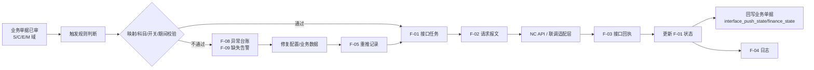
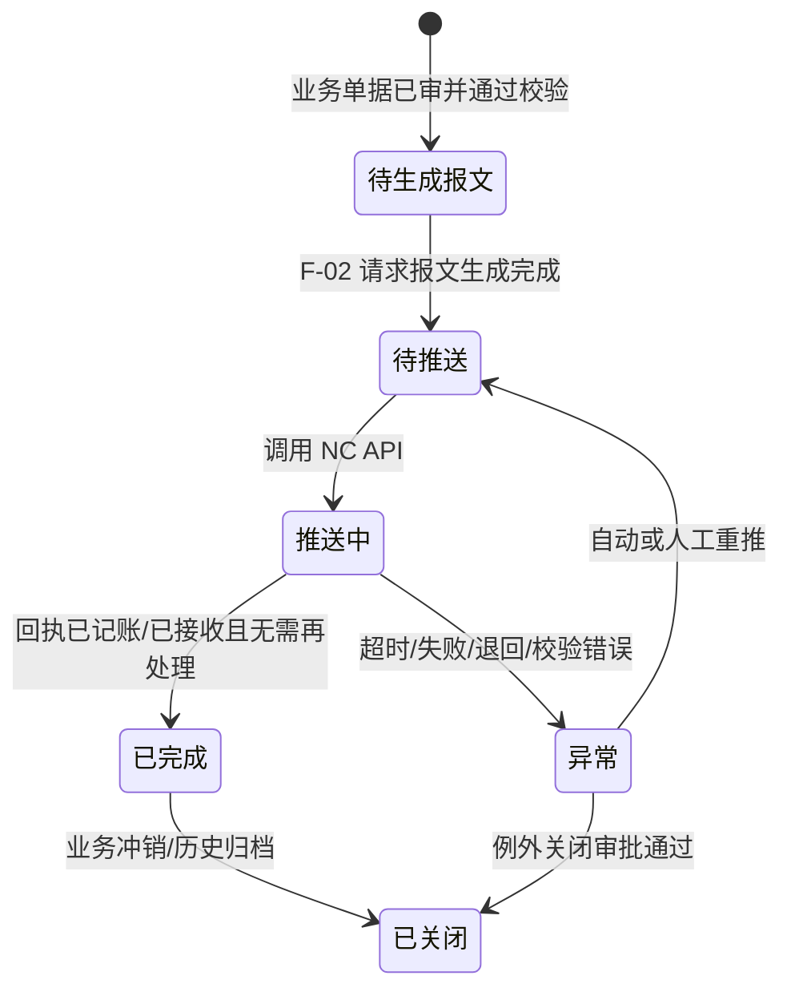
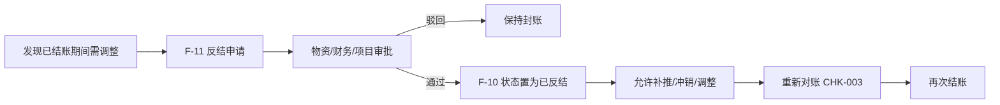

# 财务与 NC 接口详细设计（V1.0）

**版本：** V1.0  
**日期：** 2026-05-02  
**文档性质：** 详细设计层 · 模块详设第八篇  
**适用阶段：** 详细设计执行、开发实施、联调测试

---

## 一、文档目的

本文档承接 `01-数据库逻辑模型-V1.0.md` 中 F-01~F-14 财务接口域骨架，以及概要设计、需求层财务接口说明和招标附件中的 29 项 NC 接口要求，把物资系统与 NC 财务系统之间的接口任务、报文、回执、重推、对账、异常、月结反结、科目规则和接口开关固化到可开发、可联调、可验收的详细设计层。

本文档重点回答：

- 29 项 NC 接口如何在系统内注册、启停、触发和审计
- 接口任务（F-01）如何承接业务单据，如何生成报文、接收回执、更新业务单据状态
- 四类状态：业务状态、接口推送状态、财务处理状态、期间状态如何分层维护
- 幂等键、重推、冲销、已结账期间补推和反结如何受控
- 主数据映射、科目规则、接口开关缺失时如何拦截，避免脏数据进入 NC
- 日对账、周库存余额、月末全量对账、接口状态查询、映射完整性检查如何落表
- NC 尚未落地阶段如何先固化字段、状态、开关和人工替代留痕，不阻塞业务详设

本文档**不**做以下事：

- 不替代 NC 实施方的最终接口联调规范、最终错误码全集和 NC 端 API 文档
- 不替代财务部门最终会计科目体系和凭证模板审批
- 不重写采购、库存、合同、设备等业务单据的完整字段表，只定义其财务触发点
- 不写具体 SQL DDL、数据库厂商方言、页面原型和部署脚本

---

## 二、设计输入

| 输入文档 | 在本文档中的作用 |
| --- | --- |
| `docs/详细设计/01-数据库逻辑模型-V1.0.md` | F-01~F-14 实体骨架、共用字段、状态字段和 ERD |
| `docs/详细设计/02-基础档案与组织仓库详细设计-V1.0.md` | M-01 组织（F-01/F-10/F-12/F-13 的 org_id 外键）、SY-01 前缀清单（IFT/REC/EXC/REV/NAR）|
| `docs/概要设计/05-NC接口与对账概要设计-v0.1.md` | 29 项接口范围、状态分层、幂等重推、对账封账和异常补偿原则 |
| `docs/需求梳理/05-财务与NC接口需求说明-V1.0.md` | 财务接口需求边界、主数据接口、业务接口、支付执行边界 |
| `docs/需求梳理/14-NC映射与科目配置模板-V1.0.md` | NC 存货映射、科目规则、开关控制和拦截规则模板 |
| `docs/招标/附件二-接口清单及报文示例-v1.1.md` | 29 项接口清单、公共报文结构、回执字段、验收口径 |
| `docs/详细规则/物资管理与财务接口规范.md` | 凭证规则、分录、暂估冲销、特殊业务和对账 SOP |
| `docs/详细设计/03-物料主数据与编码详细设计-V1.0.md` | M-14 物料 NC 映射、M-15 批次、物料状态与映射拦截 |
| `docs/详细设计/05-合同与资金详细设计-V1.0.md` | C-07/C-08/C-10 付款计划、付款申请、支付回写与预付款接口触发 |
| `docs/详细设计/06-库存实物流转详细设计-V1.0.md` | S 域入库、出库、调拨、盘点、废旧、库存事务触发点 |
| `docs/集团统筹/集团业务系统统一建设原则-V2.0.md` | API+JSON、独立数据库、统一权限、日志审计和信创适配约束 |

---

## 三、模块范围

### 3.1 本篇覆盖实体

| 实体编号 | 英文名 | 中文名 | 本篇覆盖深度 |
| --- | --- | --- | --- |
| F-01 | interface_task | 接口任务 | 全字段、状态机、业务单据挂接、幂等键 |
| F-02 | interface_message | 接口报文 | 全字段、请求/响应、报文摘要与脱敏规则 |
| F-03 | interface_receipt | 接口回执 | 全字段、凭证号、错误码、NC 处理状态回写 |
| F-04 | interface_log | 接口日志 | 全字段、生命周期操作留痕 |
| F-05 | interface_retry | 重推记录 | 全字段、自动/人工重推、高敏感审计 |
| F-06 | reconciliation_record | 对账记录 | 全字段、日/周/月对账任务 |
| F-07 | reconciliation_variance | 对账差异清单 | 全字段、差异分级、闭环状态 |
| F-08 | exception_record | 异常台账 | 全字段、接口异常、业务异常、配置异常 |
| F-09 | mapping_missing_alert | 主数据映射缺失告警 | 全字段、映射/科目/成本中心缺失告警 |
| F-10 | period_close_record | 月结反结记录 | 全字段、期间状态、封账控制 |
| F-11 | period_reverse_request | 反结申请单 | 全字段、反结审批、影响单据范围 |
| F-12 | nc_account_rule | NC 凭证科目规则 | 全字段、配置维度、版本与生效期 |
| F-13 | interface_switch | 接口开关 | 全字段、总开关/场景/组织三级控制 |
| F-14 | interface_definition | 接口定义 | 全字段、29 项接口注册、版本、幂等规则 |

### 3.2 不在本篇覆盖

| 对象 | 承接位置 |
| --- | --- |
| 采购入库、退货、领料、调拨、盘点、废旧等业务单据全字段 | `06-库存实物流转详细设计` |
| 付款计划、付款申请、付款执行台账 | `05-合同与资金详细设计` |
| 物料、单位、成本中心、NC 存货映射主数据 | `02/03` 详设 + `14-NC映射与科目配置模板` |
| NC 端最终 API 路径、签名算法、错误码全集 | 实施阶段《接口联调规范》 |
| 会计科目最终编码、借贷分录最终审批稿 | 财务部门/NC 实施专项确认 |

### 3.3 共用约定继承

本篇所有实体默认继承 `01-V1.0` 节四的主键、审计、软删除、状态、审批、附件和多租户预留约定。接口日志、报文、回执类表虽然保留软删除字段，但业务上禁止删除或修改历史记录；如需更正，应追加新记录或形成反向处理记录。

---

## 四、总体接口架构

### 4.1 接口处理链路

### 4.2 四类状态分层

| 状态类别 | 字段 | 值域 | 说明 |
| --- | --- | --- | --- |
| 业务单据状态 | 各业务单据专有状态 | 已审/已冲销等 | 判断业务事实是否成立，由业务域维护 |
| 接口推送状态 | `interface_push_state` / F-01 `push_state` | 待推送 / 推送中 / 推送成功 / 推送失败 / 已重推 / 已关闭 | 判断接口任务执行过程 |
| 财务处理状态 | `finance_state` | 未接收 / 已接收 / 已记账 / 已退回 / 已冲销 | 判断 NC 侧处理结果 |
| 期间状态 | F-10 `close_state` | 未结账 / 已结账 / 已反结 | 判断是否允许补推、冲销和反结 |

约束：接口推送成功不等于财务已记账；只有 F-03 回执明确 `finance_state=已记账` 且返回凭证号，业务侧才可视为财务处理完成。

### 4.3 NC 未落地阶段三段式策略

| 阶段 | 系统行为 | 允许事项 | 禁止事项 |
| --- | --- | --- | --- |
| NC 完全未落地 | F-13 总开关关闭；F-12/F-14 可配置占位 | 业务单据流转、接口任务模拟、人工台账留痕 | 正式推送 NC、标记已记账 |
| NC 账套就绪但未正式启用 | 场景级开关逐项联调；允许测试环境推送 | 联调、报文校验、映射补齐、对账演练 | 生产凭证无审批上线 |
| NC 正式启用 | 按 F-13 开关启用正式接口 | 已启用场景正式推送、回执、对账、重推 | 绕过映射/科目/期间校验强行推送 |

---

## 五、29 项接口定义清单

F-14 `interface_definition` 应预置以下 29 项接口元数据。`interface_code` 使用招标附件 ID，后续 NC 端 endpoint 可在实施联调阶段填入 `endpoint_code`。

### 5.1 主数据同步接口（MD）

| interface_code | 接口名称 | 方向 | 触发时机 | F-14 类型 | 默认实时性 | 主要校验 |
| --- | --- | --- | --- | --- | --- | --- |
| MD-001 | 物料-存货映射同步 | 物资→NC | M-14 映射已配置并启用 | 主数据 | 准实时 | 物料启用、映射状态、单位完整 |
| MD-002 | 物料停用通知 | 物资→NC | M-05 停用审批通过 | 主数据 | 准实时 | 无未完结业务单据 |
| MD-003 | 计量单位统一字典同步 | 统一字典→双方 | 初始化/字典变更 | 主数据 | 准实时 | 单位状态、换算关系 |
| MD-004 | 成本中心对照同步 | NC→物资 | NC 成本中心新增/变更 | 主数据 | 准实时 | 成本中心编码唯一 |
| MD-005 | 核算组织口径对照同步 | NC→物资 | 初始化/变更 | 主数据 | 准实时 | NC 核算组织与集团组织映射 |

### 5.2 业务单据接口（BIZ）

| interface_code | 接口名称 | 来源单据 | 触发时机 | 默认实时性 | 主要凭证口径 |
| --- | --- | --- | --- | --- | --- |
| BIZ-001 | 采购入库（正式） | S-05 | 入库审核 + 发票匹配完成 | 准实时 | 借 1403，贷 2202 + 进项税 |
| BIZ-002 | 采购入库（暂估） | S-07/S-05 | 月末暂估批处理 | 批量 | 借 1403，贷 2181 |
| BIZ-003 | 暂估红字冲销 | S-07 | 次月初暂估冲销 | 批量 | 红字冲销原暂估 |
| BIZ-004 | 采购退货 | S-06 | 退货单审核通过 | 准实时 | 红字借 2202，贷 1403 |
| BIZ-005 | 领料出库 | S-09 | 出库单审核通过 | 准实时 | 借 6602，贷 1403 |
| BIZ-006 | 退料入库 | S-10 | 退料单审核通过 | 准实时 | 借 1403，贷 6602（红字） |
| BIZ-007 | 跨组织调拨 | S-12 | 调出 + 调入签收完成 | 准实时 | 内部往来对冲 |
| BIZ-008 | 盘盈处理 | S-17 | 盘盈审批通过 | 准实时 | 借 1403，贷 6301 |
| BIZ-009 | 盘亏处理 | S-18 | 盘亏审批通过 | 准实时 | 借 6601/6301，贷 1403 |
| BIZ-010 | 废旧变卖出库 | S-20/S-31 | 处置审批通过 | 准实时 | 借 6301，贷 1403 |
| BIZ-011 | 废旧变卖收入 | S-20 | 变卖收款确认 | 准实时 | 借 1002，贷 6301 |
| BIZ-012 | 危险品销毁 | S-20/S-31 | 销毁审批通过 | 实时 | 借 6301，贷 1403 |
| BIZ-013 | 火工品出入库 | S-05/S-09/S-21 | 火工品出入库审核通过 | 实时 | 独立科目、单独凭证序号 |
| BIZ-014 | 预付款登记 | C-08/C-10 | 合同/订单审批付款时 | 准实时 | 借 1123，贷 1002 |
| BIZ-015 | 预付款核销 | C-08 + S-05 | 发票 + 入库匹配完成 | 准实时 | 借 2202，贷 1123 |
| BIZ-016 | 让步接收入库 | S-04/S-05 | 质检让步 + 降价确认 | 准实时 | 降价后借 1403，贷 2202 |
| BIZ-017 | 安全专项领用 | S-09 | 安全专项领料审核通过 | 准实时 | 借专项储备，贷 1403 |
| BIZ-018 | 低值易耗品摊销 | S-09/S-21 | 月末摊销批处理 | 批量 | 一次性/五五/分期摊销 |
| BIZ-019 | 委托加工财务触发 | 委托加工单/扩展单据 | 发出或加工费确认 | 准实时 | 委托加工物资 + 加工费 |

说明：BIZ-019 一期若尚未形成独立委托加工业务单据，可先在 F-14/F-13 中保留接口定义和开关，业务落地时由模块详设补齐来源单据。

### 5.3 对账与监控接口（CHK）

| interface_code | 接口名称 | 方向 | 触发时机 | 默认实时性 | 落表对象 |
| --- | --- | --- | --- | --- | --- |
| CHK-001 | 日对账（笔数/金额） | 物资↔NC | 每日定时 | 定时 | F-06/F-07 |
| CHK-002 | 周库存余额核对 | 物资↔NC | 每周定时 | 定时 | F-06/F-07 |
| CHK-003 | 月末全量对账 | 物资↔NC | 月末 | 定时 | F-06/F-07/F-10 |
| CHK-004 | 接口状态查询 | NC→物资/物资→NC | 按需 | 实时 | F-01/F-03/F-04 |
| CHK-005 | 映射完整性检查 | 物资内部 | 每日 | 定时 | F-09 |

---

## 六、数据模型

### 6.1 F-14 interface_definition 接口定义

| 字段名 | 类型 | 长度/精度 | 空值 | 默认值 | 唯一 | 外键 | 索引建议 | 注释 |
| --- | --- | --- | --- | --- | --- | --- | --- | --- |
| `interface_id` | bigint | — | NOT NULL | auto | PK | — | PK | 技术主键 |
| `interface_code` | varchar | 32 | NOT NULL | — | UQ | — | UQ | MD-001/BIZ-001/CHK-001 等 |
| `interface_name` | varchar | 128 | NOT NULL | — | — | — | idx | 接口名称 |
| `interface_type` | varchar | 32 | NOT NULL | — | — | — | idx | 主数据 / 业务单据 / 对账监控 |
| `direction` | varchar | 16 | NOT NULL | — | — | — | idx | 物资→NC / NC→物资 / 双向 / 内部 |
| `endpoint_code` | varchar | 64 | NULL | — | — | — | idx | NC 端接口路径或适配器编码，联调阶段填写 |
| `version_no` | varchar | 16 | NOT NULL | `v1` | — | — | — | 接口版本 |
| `request_schema_ref` | varchar | 255 | NULL | — | — | — | — | 请求 schema 引用 |
| `response_schema_ref` | varchar | 255 | NULL | — | — | — | — | 响应 schema 引用 |
| `idempotent_rule` | varchar | 255 | NOT NULL | — | — | — | — | 幂等键组合规则 |
| `owner_module` | varchar | 64 | NOT NULL | — | — | — | idx | 来源模块：库存/合同/主数据/财务接口等 |
| `default_realtime_level` | varchar | 16 | NOT NULL | `准实时` | — | — | idx | 实时 / 准实时 / 批量 |
| `interface_status` | varchar | 16 | NOT NULL | `草稿` | — | — | idx | 草稿 / 已启用 / 已停用 / 已废弃 |
| `description` | varchar | 512 | NULL | — | — | — | — | 说明 |

业务规则：

1. F-14 是接口元数据权威表，F-01 必须通过 `interface_id` 关联，不允许业务代码硬编码接口名称。
2. `interface_code` 一经启用不得修改；如 NC 端升级不兼容，应新增版本或新接口定义。
3. 29 项接口应在系统初始化时预置，未启用接口通过 F-13 控制开关，不删除定义。

---

### 6.2 F-13 interface_switch 接口开关

| 字段名 | 类型 | 长度/精度 | 空值 | 默认值 | 唯一 | 外键 | 索引建议 | 注释 |
| --- | --- | --- | --- | --- | --- | --- | --- | --- |
| `switch_id` | bigint | — | NOT NULL | auto | PK | — | PK | 技术主键 |
| `switch_level` | varchar | 16 | NOT NULL | — | — | — | idx | 全局 / 模块级 / 接口级 / 组织级 |
| `switch_target` | varchar | 64 | NOT NULL | — | — | — | idx | ALL、模块编码、interface_code、org_id 等 |
| `interface_id` | bigint | — | NULL | — | — | FK→F-14 | idx | 接口级开关时填写 |
| `org_id` | bigint | — | NULL | — | — | FK→M-01 | idx | 组织级开关时填写 |
| `switch_status` | varchar | 8 | NOT NULL | `关` | — | — | idx | 开 / 关 |
| `effective_time` | timestamp | — | NOT NULL | 当前时间 | — | — | idx | 生效时间 |
| `expire_time` | timestamp | — | NULL | — | — | — | idx | 失效时间 |
| `updated_by` | bigint | — | NOT NULL | — | — | FK→A-01 | — | 更新人 |
| `updated_at` | timestamp | — | NOT NULL | 当前时间 | — | — | — | 更新时间 |
| `change_reason` | varchar | 255 | NOT NULL | — | — | — | — | 调整原因 |

开关优先级：组织级 > 接口级 > 模块级 > 全局。任一高优先级显式关闭时，接口任务不得正式推送。

---

### 6.3 F-01 interface_task 接口任务

| 字段名 | 类型 | 长度/精度 | 空值 | 默认值 | 唯一 | 外键 | 索引建议 | 注释 |
| --- | --- | --- | --- | --- | --- | --- | --- | --- |
| `task_id` | bigint | — | NOT NULL | auto | PK | — | PK | 技术主键 |
| `task_no` | varchar | 32 | NOT NULL | — | UQ | — | UQ | 前缀 `IFT` |
| `interface_id` | bigint | — | NOT NULL | — | — | FK→F-14 | idx | 接口定义 |
| `interface_code` | varchar | 32 | NOT NULL | — | — | — | idx | 冗余业务编码，便于查询 |
| `source_bill_type` | varchar | 64 | NOT NULL | — | — | — | idx | 来源单据类型，如 S-05 |
| `source_bill_id` | bigint | — | NOT NULL | — | — | — | idx | 来源单据技术主键 |
| `source_bill_no` | varchar | 32 | NOT NULL | — | — | — | idx | 来源单据号 |
| `org_id` | bigint | — | NOT NULL | — | — | FK→M-01 | idx | 业务组织 |
| `business_date` | date | — | NOT NULL | — | — | — | idx | 业务日期 |
| `period_code` | varchar | 7 | NOT NULL | — | — | — | idx | 会计期间 YYYY-MM |
| `idempotent_key` | varchar | 128 | NOT NULL | — | UQ | — | UQ | 幂等键 |
| `task_state` | varchar | 16 | NOT NULL | `待生成报文` | — | — | idx | 待生成报文 / 待推送 / 推送中 / 已完成 / 异常 / 已关闭 |
| `push_state` | varchar | 16 | NOT NULL | `待推送` | — | — | idx | 待推送 / 推送中 / 推送成功 / 推送失败 / 已重推 / 已关闭 |
| `finance_state` | varchar | 16 | NOT NULL | `未接收` | — | — | idx | 未接收 / 已接收 / 已记账 / 已退回 / 已冲销 |
| `retry_count` | integer | — | NOT NULL | 0 | — | — | — | 已重推次数 |
| `max_retry_count` | integer | — | NOT NULL | 3 | — | — | — | 自动重试上限 |
| `last_push_time` | timestamp | — | NULL | — | — | — | idx | 最后推送时间 |
| `next_retry_time` | timestamp | — | NULL | — | — | — | idx | 下次自动重试时间 |
| `nc_voucher_no` | varchar | 64 | NULL | — | — | — | idx | NC 凭证号 |
| `last_error_code` | varchar | 32 | NULL | — | — | — | idx | 最近错误码 |
| `last_error_message` | varchar | 512 | NULL | — | — | — | — | 最近错误描述 |
| `closed_reason` | varchar | 255 | NULL | — | — | — | — | 关闭原因 |

#### 6.3.1 状态机

业务规则：

1. F-01 只能由已审业务单据、定时批处理或对账任务生成，不允许无来源单据手工创建业务接口任务。
2. 同一 `idempotent_key` 只允许一条有效任务；冲销、重估、分批入账必须扩展幂等键。
3. `period_code` 对应 F-10 已结账时，不允许创建新的正式推送任务，除非 F-11 反结申请已执行。
4. F-01 完成后应回写来源单据的 `interface_push_state/finance_state/nc_voucher_no`，但不改变业务事实本身。

---

### 6.4 F-02 interface_message 接口报文

| 字段名 | 类型 | 长度/精度 | 空值 | 默认值 | 唯一 | 外键 | 索引建议 | 注释 |
| --- | --- | --- | --- | --- | --- | --- | --- | --- |
| `message_id` | bigint | — | NOT NULL | auto | PK | — | PK | 技术主键 |
| `task_id` | bigint | — | NOT NULL | — | — | FK→F-01 | idx | 接口任务 |
| `request_id` | varchar | 64 | NOT NULL | — | UQ | — | UQ | 请求流水号 |
| `request_body` | text/json | — | NOT NULL | — | — | — | — | 请求报文 JSON |
| `request_hash` | varchar | 64 | NOT NULL | — | — | — | idx | 报文摘要，用于幂等冲突判断 |
| `response_body` | text/json | — | NULL | — | — | — | — | 响应报文 JSON |
| `request_time` | timestamp | — | NOT NULL | 当前时间 | — | — | idx | 请求时间 |
| `response_time` | timestamp | — | NULL | — | — | — | idx | 响应时间 |
| `http_status` | varchar | 16 | NULL | — | — | — | — | HTTP/适配层状态 |
| `message_direction` | varchar | 16 | NOT NULL | `请求` | — | — | idx | 请求 / 响应 / 回调 |
| `mask_level` | varchar | 16 | NOT NULL | `普通` | — | — | — | 普通 / 脱敏 / 高敏 |

业务规则：

1. `request_body/response_body` 保留完整 JSON；涉及银行账号、个人敏感信息时，展示层必须脱敏，存储层按集团安全要求加密或受控访问。
2. 重推时必须新增 F-02 报文记录，不覆盖原报文。
3. `request_hash` 用于判断同一幂等键下报文是否一致；报文不一致时进入 F-08 幂等冲突异常。

---

### 6.5 F-03 interface_receipt 接口回执

| 字段名 | 类型 | 长度/精度 | 空值 | 默认值 | 唯一 | 外键 | 索引建议 | 注释 |
| --- | --- | --- | --- | --- | --- | --- | --- | --- |
| `receipt_id` | bigint | — | NOT NULL | auto | PK | — | PK | 技术主键 |
| `task_id` | bigint | — | NOT NULL | — | — | FK→F-01 | idx | 接口任务 |
| `message_id` | bigint | — | NULL | — | — | FK→F-02 | idx | 对应响应报文 |
| `receipt_status` | varchar | 16 | NOT NULL | — | — | — | idx | 成功 / 失败 / 已接收 / 已记账 / 已退回 / 冲突 |
| `finance_state` | varchar | 16 | NOT NULL | `未接收` | — | — | idx | 未接收 / 已接收 / 已记账 / 已退回 / 已冲销 |
| `nc_voucher_no` | varchar | 64 | NULL | — | — | — | idx | NC 凭证号 |
| `nc_receipt_no` | varchar | 64 | NULL | — | — | — | idx | NC 回执流水号 |
| `error_code` | varchar | 32 | NULL | — | — | — | idx | 错误码 |
| `error_message` | varchar | 512 | NULL | — | — | — | — | 错误描述 |
| `retry_no` | integer | — | NOT NULL | 0 | — | — | — | 第几次推送/重推 |
| `receipt_time` | timestamp | — | NOT NULL | 当前时间 | — | — | idx | 回执时间 |

业务规则：

1. 一次请求可有多条回执记录，以 NC 最新明确状态为准，但历史回执必须保留。
2. `receipt_status=已记账` 时必须有 `nc_voucher_no`，否则视为回执字段异常。
3. `receipt_status=失败/已退回/冲突` 时自动生成或更新 F-08 异常台账。

---

### 6.6 F-04 interface_log 接口日志

| 字段名 | 类型 | 长度/精度 | 空值 | 默认值 | 唯一 | 外键 | 索引建议 | 注释 |
| --- | --- | --- | --- | --- | --- | --- | --- | --- |
| `log_id` | bigint | — | NOT NULL | auto | PK | — | PK | 技术主键 |
| `task_id` | bigint | — | NOT NULL | — | — | FK→F-01 | idx | 接口任务 |
| `operation_type` | varchar | 32 | NOT NULL | — | — | — | idx | 创建/生成报文/推送/回执/重推/关闭/例外 |
| `operation_details` | varchar | 1024 | NOT NULL | — | — | — | — | 操作详情 |
| `operation_time` | timestamp | — | NOT NULL | 当前时间 | — | — | idx | 操作时间 |
| `operation_by` | bigint | — | NULL | — | — | FK→A-01 | idx | 操作人，系统自动可为空或系统用户 |
| `before_state` | varchar | 32 | NULL | — | — | — | — | 变更前状态 |
| `after_state` | varchar | 32 | NULL | — | — | — | — | 变更后状态 |

业务规则：日志业务上不可删改；人工重推、例外关闭、反结补推等高敏感操作需同步写 A-15 接口操作日志。

---

### 6.7 F-05 interface_retry 重推记录

| 字段名 | 类型 | 长度/精度 | 空值 | 默认值 | 唯一 | 外键 | 索引建议 | 注释 |
| --- | --- | --- | --- | --- | --- | --- | --- | --- |
| `retry_id` | bigint | — | NOT NULL | auto | PK | — | PK | 技术主键 |
| `task_id` | bigint | — | NOT NULL | — | — | FK→F-01 | idx | 原接口任务 |
| `retry_no` | integer | — | NOT NULL | — | — | — | idx | 第几次重推 |
| `retry_type` | varchar | 16 | NOT NULL | — | — | — | idx | 自动 / 人工 |
| `retry_reason` | varchar | 255 | NOT NULL | — | — | — | — | 重推原因 |
| `retry_time` | timestamp | — | NOT NULL | 当前时间 | — | — | idx | 重推时间 |
| `retry_by` | bigint | — | NULL | — | — | FK→A-01 | idx | 重推人 |
| `retry_count` | integer | — | NOT NULL | — | — | — | — | 累计次数 |
| `result_code` | varchar | 32 | NULL | — | — | — | idx | 本次结果码 |
| `result_message` | varchar | 512 | NULL | — | — | — | — | 本次结果说明 |
| `approval_instance_id` | bigint | — | NULL | — | — | FK→A-20 | idx | 人工重推审批实例 |

业务规则：

1. 网络超时、NC 暂不可达可自动重试，默认 3 次指数退避。
2. 科目缺失、映射缺失、幂等冲突、已结账期间异常不得自动重试，必须修复后人工重推。
3. 人工重推属于高敏感操作，需权限控制、理由必填并留审计。

---

### 6.8 F-06 reconciliation_record 对账记录

| 字段名 | 类型 | 长度/精度 | 空值 | 默认值 | 唯一 | 外键 | 索引建议 | 注释 |
| --- | --- | --- | --- | --- | --- | --- | --- | --- |
| `record_id` | bigint | — | NOT NULL | auto | PK | — | PK | 技术主键 |
| `record_no` | varchar | 32 | NOT NULL | — | UQ | — | UQ | 前缀 `REC` |
| `reconcile_date` | date | — | NOT NULL | — | — | — | idx | 对账日期 |
| `period_code` | varchar | 7 | NOT NULL | — | — | — | idx | 期间 YYYY-MM |
| `reconcile_type` | varchar | 16 | NOT NULL | — | — | — | idx | 日对账 / 周库存 / 月末全量 / 年末盘点 |
| `interface_code` | varchar | 32 | NULL | — | — | — | idx | 对应 CHK 接口 |
| `org_id` | bigint | — | NOT NULL | — | — | FK→M-01 | idx | 组织 |
| `total_items` | integer | — | NOT NULL | 0 | — | — | — | 总笔数 |
| `matched_items` | integer | — | NOT NULL | 0 | — | — | — | 匹配笔数 |
| `unmatched_items` | integer | — | NOT NULL | 0 | — | — | — | 不匹配笔数 |
| `physical_amount` | decimal | (18,2) | NOT NULL | 0 | — | — | — | 物资侧金额 |
| `financial_amount` | decimal | (18,2) | NOT NULL | 0 | — | — | — | NC 侧金额 |
| `variance_amount` | decimal | (18,2) | NOT NULL | 0 | — | — | — | 差异金额 |
| `record_state` | varchar | 16 | NOT NULL | `待执行` | — | — | idx | 待执行 / 执行中 / 已完成 / 有差异待处理 / 已关闭 |

业务规则：F-06 是对账批次主表；存在差异时必须生成 F-07，未闭环差异不得进入月结封账。

---

### 6.9 F-07 reconciliation_variance 对账差异清单

| 字段名 | 类型 | 长度/精度 | 空值 | 默认值 | 唯一 | 外键 | 索引建议 | 注释 |
| --- | --- | --- | --- | --- | --- | --- | --- | --- |
| `variance_id` | bigint | — | NOT NULL | auto | PK | — | PK | 技术主键 |
| `record_id` | bigint | — | NOT NULL | — | — | FK→F-06 | idx | 对账记录 |
| `variance_type` | varchar | 32 | NOT NULL | — | — | — | idx | 数量差异 / 金额差异 / 单据缺失 / 凭证缺失 / 状态不一致 / 映射差异 |
| `related_bill_type` | varchar | 64 | NULL | — | — | — | idx | 相关单据类型 |
| `related_bill_no` | varchar | 32 | NULL | — | — | — | idx | 相关单据号 |
| `nc_voucher_no` | varchar | 64 | NULL | — | — | — | idx | NC 凭证号 |
| `physical_quantity` | decimal | (18,4) | NULL | — | — | — | — | 物资侧数量 |
| `financial_quantity` | decimal | (18,4) | NULL | — | — | — | — | NC 侧数量 |
| `physical_amount` | decimal | (18,2) | NULL | — | — | — | — | 物资侧金额 |
| `financial_amount` | decimal | (18,2) | NULL | — | — | — | — | NC 侧金额 |
| `variance_reason` | varchar | 512 | NULL | — | — | — | — | 差异原因 |
| `responsible_dept` | varchar | 64 | NULL | — | — | — | idx | 责任部门 |
| `handler_id` | bigint | — | NULL | — | — | FK→A-01 | idx | 处理人 |
| `variance_state` | varchar | 16 | NOT NULL | `待处理` | — | — | idx | 待处理 / 处理中 / 已闭环 / 已例外关闭 |

业务规则：例外关闭必须审批，且需说明不影响封账的依据。

---

### 6.10 F-08 exception_record 异常台账

| 字段名 | 类型 | 长度/精度 | 空值 | 默认值 | 唯一 | 外键 | 索引建议 | 注释 |
| --- | --- | --- | --- | --- | --- | --- | --- | --- |
| `exception_id` | bigint | — | NOT NULL | auto | PK | — | PK | 技术主键 |
| `exception_no` | varchar | 32 | NOT NULL | — | UQ | — | UQ | 前缀 `EXC` |
| `interface_id` | bigint | — | NULL | — | — | FK→F-14 | idx | 接口定义 |
| `task_id` | bigint | — | NULL | — | — | FK→F-01 | idx | 相关接口任务 |
| `source_bill_type` | varchar | 64 | NULL | — | — | — | idx | 来源单据类型 |
| `source_bill_no` | varchar | 32 | NULL | — | — | — | idx | 来源单据号 |
| `exception_type` | varchar | 32 | NOT NULL | — | — | — | idx | 映射缺失 / 科目缺失 / 期间关闭 / NC退回 / 网络异常 / 幂等冲突 / 报文校验失败 |
| `exception_code` | varchar | 32 | NULL | — | — | — | idx | 异常编码 |
| `exception_message` | varchar | 1024 | NOT NULL | — | — | — | — | 异常描述 |
| `first_occurred_time` | timestamp | — | NOT NULL | 当前时间 | — | — | idx | 首次发生时间 |
| `last_occurred_time` | timestamp | — | NOT NULL | 当前时间 | — | — | idx | 最近发生时间 |
| `retry_count` | integer | — | NOT NULL | 0 | — | — | — | 重试次数 |
| `handler_id` | bigint | — | NULL | — | — | FK→A-01 | idx | 处理人 |
| `handle_result` | varchar | 512 | NULL | — | — | — | — | 处理结果 |
| `exception_state` | varchar | 16 | NOT NULL | `待处理` | — | — | idx | 待处理 / 处理中 / 已闭环 / 已例外关闭 |

业务规则：F-08 是接口异常统一入口；业务单据页面、接口监控页面和对账页面都应能追溯到同一异常记录。

---

### 6.11 F-09 mapping_missing_alert 主数据映射缺失告警

| 字段名 | 类型 | 长度/精度 | 空值 | 默认值 | 唯一 | 外键 | 索引建议 | 注释 |
| --- | --- | --- | --- | --- | --- | --- | --- | --- |
| `alert_id` | bigint | — | NOT NULL | auto | PK | — | PK | 技术主键 |
| `alert_type` | varchar | 32 | NOT NULL | — | — | — | idx | NC存货映射缺失 / 单位映射缺失 / 成本中心缺失 / 科目规则缺失 / 核算组织缺失 |
| `related_object_type` | varchar | 64 | NOT NULL | — | — | — | idx | material/unit/cost_center/account_rule/org 等 |
| `related_object_id` | bigint | — | NULL | — | — | — | idx | 相关对象 ID |
| `related_object_code` | varchar | 64 | NULL | — | — | — | idx | 相关对象编码 |
| `missing_field` | varchar | 64 | NOT NULL | — | — | — | idx | 缺失字段 |
| `alert_date` | date | — | NOT NULL | 当前日期 | — | — | idx | 告警日期 |
| `affected_interface_code` | varchar | 32 | NULL | — | — | — | idx | 影响接口 |
| `affected_bill_no` | varchar | 32 | NULL | — | — | — | idx | 影响单据 |
| `alert_state` | varchar | 16 | NOT NULL | `新增` | — | — | idx | 新增 / 已确认 / 已处理 / 已解除 |
| `resolved_time` | timestamp | — | NULL | — | — | — | — | 解除时间 |

业务规则：CHK-005 每日扫描生成 F-09；映射修复后可自动解除，但历史告警保留。

---

### 6.12 F-10 period_close_record 月结反结记录

| 字段名 | 类型 | 长度/精度 | 空值 | 默认值 | 唯一 | 外键 | 索引建议 | 注释 |
| --- | --- | --- | --- | --- | --- | --- | --- | --- |
| `close_id` | bigint | — | NOT NULL | auto | PK | — | PK | 技术主键 |
| `period_code` | varchar | 7 | NOT NULL | — | — | — | idx | 会计期间 YYYY-MM |
| `org_id` | bigint | — | NOT NULL | — | — | FK→M-01 | idx | 组织 |
| `close_date` | date | — | NULL | — | — | — | idx | 结账日期 |
| `close_by` | bigint | — | NULL | — | — | FK→A-01 | — | 结账人 |
| `close_state` | varchar | 16 | NOT NULL | `未结账` | — | — | idx | 未结账 / 已结账 / 已反结 |
| `last_reconcile_record_id` | bigint | — | NULL | — | — | FK→F-06 | idx | 月末对账记录 |
| `unclosed_variance_count` | integer | — | NOT NULL | 0 | — | — | — | 未闭环差异数 |
| `close_remark` | varchar | 512 | NULL | — | — | — | — | 结账说明 |

**唯一约束：** `(period_code, org_id)` 复合唯一。

业务规则：同一 `period_code + org_id` 只允许一条有效记录；未完成 CHK-003 或仍有未闭环差异时不得结账。

---

### 6.13 F-11 period_reverse_request 反结申请单

| 字段名 | 类型 | 长度/精度 | 空值 | 默认值 | 唯一 | 外键 | 索引建议 | 注释 |
| --- | --- | --- | --- | --- | --- | --- | --- | --- |
| `reverse_id` | bigint | — | NOT NULL | auto | PK | — | PK | 技术主键 |
| `reverse_no` | varchar | 32 | NOT NULL | — | UQ | — | UQ | 前缀 `REV` |
| `period_code` | varchar | 7 | NOT NULL | — | — | — | idx | 反结期间 |
| `org_id` | bigint | — | NOT NULL | — | — | FK→M-01 | idx | 组织 |
| `reverse_reason` | varchar | 512 | NOT NULL | — | — | — | — | 反结原因 |
| `affected_bill_no` | varchar | 1024 | NULL | — | — | — | — | 影响单据号列表或摘要 |
| `affected_task_id` | bigint | — | NULL | — | — | FK→F-01 | idx | 影响接口任务 |
| `risk_assessment` | varchar | 1024 | NULL | — | — | — | — | 风险说明 |
| `approved_by` | bigint | — | NULL | — | — | FK→A-01 | — | 审批人 |
| `approved_at` | timestamp | — | NULL | — | — | — | — | 审批时间 |
| `reverse_state` | varchar | 16 | NOT NULL | `待审` | — | — | idx | 待审 / 审中 / 已审 / 已驳回 / 已执行 / 已撤回 |
| `workflow_instance_id` | bigint | — | NULL | — | — | FK→A-20 | idx | 审批实例 |

业务规则：反结是高敏感操作；审批通过后才允许对已结账期间执行补推、冲销或调整。

---

### 6.14 F-12 nc_account_rule NC 凭证科目规则

| 字段名 | 类型 | 长度/精度 | 空值 | 默认值 | 唯一 | 外键 | 索引建议 | 注释 |
| --- | --- | --- | --- | --- | --- | --- | --- | --- |
| `rule_id` | bigint | — | NOT NULL | auto | PK | — | PK | 技术主键 |
| `rule_code` | varchar | 32 | NOT NULL | — | UQ | — | UQ | 前缀 `NAR` |
| `business_type` | varchar | 64 | NOT NULL | — | — | — | idx | 采购入库/领料出库/盘盈盘亏等 |
| `interface_id` | bigint | — | NULL | — | — | FK→F-14 | idx | 适用接口 |
| `org_id` | bigint | — | NULL | — | — | FK→M-01 | idx | 适用组织；NULL 表示全局 |
| `material_category_id` | bigint | — | NULL | — | — | FK→M-04 | idx | 物料分类 |
| `special_flag` | varchar | 32 | NULL | — | — | — | idx | 安全专项/火工品/低值易耗等 |
| `cost_center_required` | boolean | — | NOT NULL | false | — | — | idx | 是否要求成本中心 |
| `debit_account_code` | varchar | 64 | NULL | — | — | — | idx | 借方科目编码，可占位 |
| `debit_account_name` | varchar | 128 | NULL | — | — | — | — | 借方科目名称 |
| `credit_account_code` | varchar | 64 | NULL | — | — | — | idx | 贷方科目编码，可占位 |
| `credit_account_name` | varchar | 128 | NULL | — | — | — | — | 贷方科目名称 |
| `tax_process_mode` | varchar | 32 | NULL | — | — | — | — | 价税分离/含税/NC处理 |
| `rule_status` | varchar | 16 | NOT NULL | `待配置` | — | — | idx | 待配置 / 已配置 / 已启用 / 已停用 |
| `effective_date` | date | — | NOT NULL | 当前日期 | — | — | idx | 生效日期 |
| `expire_date` | date | — | NULL | — | — | — | idx | 失效日期 |
| `finance_confirm_user_id` | bigint | — | NULL | — | — | FK→A-01 | — | 财务确认人 |

业务规则：

1. 科目规则不得硬编码；正式推送前必须找到状态为“已启用”的 F-12 规则。
2. 查找优先级：接口 + 组织 + 物料分类 + 特殊标识 > 接口 + 组织 + 物料分类 > 接口 + 物料分类 > 接口默认规则。
3. NC 未落地阶段允许占位配置，但 `rule_status` 不得标为“已启用”。
4. 规则变更不影响历史已推送任务；通过生效/失效日期控制新任务。

---

## 七、统一校验与拦截规则

### 7.1 生成接口任务前置校验

| 校验项 | 规则 | 不通过处理 |
| --- | --- | --- |
| 业务状态 | 来源单据必须已审或满足批处理条件 | 不生成 F-01，提示业务状态不满足 |
| 接口开关 | F-13 全局/模块/接口/组织开关允许 | 生成 F-08，标记接口关闭 |
| 期间状态 | F-10 未结账或 F-11 已执行反结 | 生成 F-08，标记期间关闭 |
| 物料映射 | 涉及物料行必须存在启用的 M-14 映射 | 生成 F-09 + F-08，阻断推送 |
| 计量单位 | 单位须已统一或可换算 | 生成 F-09，阻断推送 |
| 成本中心 | 领料/专项/费用类业务必须有成本中心 | 生成 F-09/F-08，阻断推送 |
| 科目规则 | 找到已启用 F-12 规则 | 生成 F-09/F-08，阻断推送 |
| 幂等键 | 幂等键唯一；重复时校验报文一致 | 一致返回幂等成功；不一致进 F-08 |

### 7.2 幂等键规则

| 场景 | 幂等键 |
| --- | --- |
| 普通单据一次推送 | `interface_code + source_bill_no + org_code` |
| 采购入库部分到票 | `interface_code + source_bill_no + org_code + invoice_no/settle_batch_no + line_no` |
| 暂估/冲销/重新暂估 | `interface_code + source_bill_no + org_code + estimate_period + estimate_batch_no` |
| 预付款分批核销 | `interface_code + source_bill_no + org_code + payment_node_no + invoice_no/settle_batch_no` |
| 低值易耗摊销 | `interface_code + source_bill_no + org_code + amortize_period + amortize_batch_no` |
| 委托加工 | `interface_code + source_bill_no + org_code + process_stage + line_no` |
| 冲销任务 | 原幂等键 + `-REVERSE-` + 冲销批次号 |

---

## 八、接口触发点与回写

### 8.1 业务触发矩阵

| 业务事件 | 生成接口 | 回写业务字段 |
| --- | --- | --- |
| S-05 入库审核 + 发票匹配完成 | BIZ-001 | S-05 `interface_push_state/finance_state/nc_voucher_no` |
| 月末已入库未到票暂估 | BIZ-002 | S-07 `interface_push_state/finance_state` |
| 次月暂估冲销 | BIZ-003 | S-07 `finance_state=已冲销` |
| S-06 采购退货审核 | BIZ-004 | S-06 `interface_push_state/finance_state` |
| S-09 领料出库审核 | BIZ-005 或 BIZ-017 | S-09 `interface_push_state/finance_state` |
| S-10 退料入库审核 | BIZ-006 | S-10 `interface_push_state/finance_state` |
| S-12 跨组织调拨双方签收 | BIZ-007 | S-12 `interface_push_state/finance_state` |
| S-17/S-18 盘盈盘亏审批 | BIZ-008/BIZ-009 | S-17/S-18 `interface_push_state/finance_state` |
| S-20 废旧处置审批/收入确认/销毁 | BIZ-010/BIZ-011/BIZ-012 | S-20 `interface_push_state/finance_state` |
| 火工品相关出入库审核 | BIZ-013 | 来源单据 `interface_push_state/finance_state` |
| C-08/C-10 预付款支付确认 | BIZ-014 | C-08/C-10 `interface_push_state/finance_state` |
| 发票 + 入库 + 预付匹配完成 | BIZ-015 | C-08/S-05 `finance_state` |
| S-04 让步接收 + 降价确认 | BIZ-016 | S-04/S-05 `interface_push_state/finance_state` |
| 月末低值易耗摊销 | BIZ-018 | 摊销批次/来源出库记录状态 |

### 8.2 回写规则

1. F-01 `push_state=推送成功` 时，来源单据 `interface_push_state=推送成功`。
2. F-03 `finance_state=已记账` 时，来源单据 `finance_state=已记账` 并回写 `nc_voucher_no`。
3. F-03 `finance_state=已退回` 时，来源单据 `finance_state=已退回`，并生成 F-08 异常。
4. 冲销接口成功后，原任务进入 `已关闭`，新冲销任务保留独立凭证号和回执。

---

## 九、对账、封账与反结

### 9.1 对账节奏

| 对账类型 | 频率 | 接口 | 主要比对项 | 责任方 |
| --- | --- | --- | --- | --- |
| 日对账 | 每日 | CHK-001 | 笔数、金额、凭证号、状态 | 系统自动 + 接口管理员 |
| 周库存余额核对 | 每周 | CHK-002 | 库存余额、存货科目余额、组织/物料分类 | 物资 + 财务 |
| 月末全量对账 | 月末 | CHK-003 | 全量数量、金额、凭证、暂估、冲销、差异 | 物资 + 财务 + 项目管理 |
| 接口状态查询 | 按需 | CHK-004 | 任务状态、NC 回执、重推结果 | 接口管理员 |
| 映射完整性检查 | 每日 | CHK-005 | 映射、单位、成本中心、科目规则 | 系统自动 + 主数据维护人 |

### 9.2 月结封账条件

进入 F-10 `已结账` 前必须满足：

- CHK-003 月末全量对账已完成
- F-07 不存在 `待处理/处理中` 的关键差异
- F-08 不存在影响该期间的未闭环 NC 退回、幂等冲突、期间异常
- 暂估与冲销批次状态完整
- 财务与物资双方确认当期人工替代台账（如 NC 未落地）

### 9.3 反结流程

---

## 十、权限、审批与高敏感操作

### 10.1 关键角色

| 角色 | 主要权限 |
| --- | --- |
| 物资接口管理员 | 查看接口任务、处理业务侧异常、发起人工重推申请 |
| 财务接口管理员 | 维护科目规则、确认 NC 回执、处理财务退回和对账差异 |
| 主数据维护人 | 维护物料映射、单位、成本中心引用和映射缺失告警 |
| 系统管理员 | 维护 F-14 接口定义、F-13 开关、技术参数，不代替业务审批 |
| 审计/管理人员 | 查询接口日志、重推、反结、例外关闭和对账报告 |

### 10.2 高敏感操作清单

| 操作 | 控制要求 |
| --- | --- |
| 人工重推 F-05 | 理由必填、权限控制、必要时审批、写 A-15 |
| 例外关闭 F-08/F-07 | 必须审批，说明不影响财务结果或封账依据 |
| 接口开关从关到开 | 记录变更原因，重要接口需财务确认 |
| 已结账期间反结 F-11 | 必须审批，项目领导小组/财务参与 |
| 科目规则启用/停用 F-12 | 财务确认后生效，保留历史版本 |
| 修改接口定义 F-14 | 仅限系统管理员，启用接口不允许随意改 code |

---

## 十一、配置项与开关

| 参数名 | 默认值 | 可调范围 | 责任方 | 说明 |
| --- | --- | --- | --- | --- |
| `NC_INTERFACE_GLOBAL_SWITCH` | 关 | 开/关 | 网信办 + 财务 | NC 未落地阶段默认关闭 |
| `NC_AUTO_RETRY_MAX_COUNT` | 3 | 0-10 | 网信办 | 自动重试次数 |
| `NC_AUTO_RETRY_INITIAL_SECONDS` | 30 | 10-600 | 网信办 | 初始退避时间 |
| `NC_IDEMPOTENT_CONFLICT_BLOCK` | true | true/false | 网信办 + 财务 | 幂等冲突是否强制阻断 |
| `NC_REQUIRE_MAPPING_BEFORE_PUSH` | true | true/false | 财务 + 物资 | 映射缺失是否阻断正式推送 |
| `NC_REQUIRE_ACCOUNT_RULE_BEFORE_PUSH` | true | true/false | 财务 | 科目规则缺失是否阻断正式推送 |
| `NC_DAILY_RECONCILE_TIME` | 02:00 | 时间 | 财务 + 运维 | 日对账任务时间 |
| `NC_MONTH_CLOSE_LOCK_ENABLED` | true | true/false | 财务 | 月结期间锁定是否启用 |
| `NC_EXCEPTION_SLA_HOURS` | 24 | 1-168 | 财务 + 物资 | 接口异常处理时限 |

---

## 十二、待业务确认与占位项

| 占位项 | 影响位置 | 当前处理 |
| --- | --- | --- |
| NC 最终 endpoint、鉴权方式、签名算法 | F-14/F-02 | `[待 NC 落地]`，先保留 endpoint_code/schema_ref 字段 |
| 正式会计科目编码 | F-12 | `[待 NC 落地]`，先按业务类型+组织+物料分类固化配置模型 |
| 成本中心完整对照表 | F-09/F-12/BIZ-005/017 | `[待业务确认 - 来源14]`，缺失时阻断正式推送 |
| 核算组织正式映射 | MD-005/F-01 | `[待 NC 落地]`，先保留 org_id 与 NC 组织映射入口 |
| 暂估价差阈值与处理方式 | BIZ-001/002/003 | `[待业务确认]`，先按配置项和财务规则承接 |
| 低值易耗品摊销方式 | BIZ-018 | `[待业务确认]`，默认支持一次性/五五/分期三类配置 |
| 委托加工来源单据 | BIZ-019 | `[待业务确认]`，接口定义先预置，业务模块落地时补来源单据 |
| 人工替代台账格式 | NC 未落地阶段 | `[待业务确认]`，先要求责任人、期间、单据、金额、处理依据留痕 |

---

## 十三、SY-01 前缀管理

本篇新增以下业务单号前缀，已回写 `02-基础档案与组织仓库详细设计-V1.0.md` 节 4.9.5：

| 前缀 | 实体 | 说明 |
| --- | --- | --- |
| IFT | F-01 interface_task | 接口任务（修正原占位 TK） |
| REC | F-06 reconciliation_record | 对账记录 |
| EXC | F-08 exception_record | 异常台账 |
| REV | F-11 period_reverse_request | 反结申请单 |
| NAR | F-12 nc_account_rule | NC 凭证科目规则 |

F-02/F-03/F-04/F-05/F-07/F-09/F-10/F-13 无用户可见业务单号，不需注册前缀；F-14 `interface_code` 使用人工赋值（MD-/BIZ-/CHK- 序列），不走 SY-01 取号。

---

## 十四、版本记录

| 版本 | 日期 | 主要变化 |
| --- | --- | --- |
| V0.2 | 2026-05-02 | 补录 SY-01 前缀管理节（IFT/REC/EXC/REV/NAR 共 5 个 F 域前缀，回写 02-v0.5）；完善设计输入版本引用 |
| V0.1 | 2026-05-02 | 首版，覆盖 F-01~F-14、29 项接口清单、状态分层、幂等重推、对账封账、反结、科目规则、接口开关、权限审计和 NC 未落地占位策略 |
| V1.0 | 2026-05-02 | 详设阶段交叉评审通过（2026-05-02），全部 11 篇分卷无未解决问题，升至 V1.0 正式版 |

---

## 十五、一句话结论

08 详设的核心是把“业务事实如何安全进入 NC、NC 结果如何可信回到物资系统”做成一套可控链路：接口定义可配置、任务可追踪、报文可审计、回执可回写、失败可重推、差异可对账、封账可控制、反结有审批；在 NC 尚未落地时先固化模型和开关，正式启用时再补齐 endpoint、科目和联调细节。
